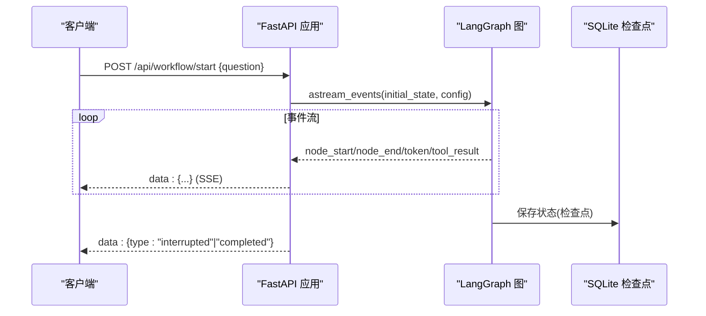
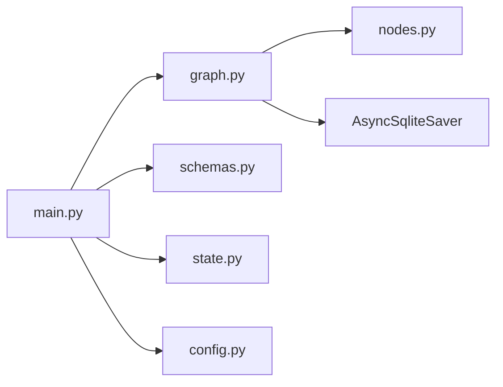

# API 参考

<cite>
**本文引用的文件**
- [main.py](file://workflow-studio/backend/app/main.py)
- [schemas.py](file://workflow-studio/backend/app/schemas.py)
- [graph.py](file://workflow-studio/backend/app/graph.py)
- [state.py](file://workflow-studio/backend/app/state.py)
- [config.py](file://workflow-studio/backend/app/config.py)
- [useWorkflowSSE.ts](file://workflow-studio/frontend/src/composables/useWorkflowSSE.ts)
- [workflow.ts](file://workflow-studio/frontend/src/types/workflow.ts)
- [README.md](file://workflow-studio/README.md)
</cite>

## 目录
1. [简介](#简介)
2. [项目结构](#项目结构)
3. [核心组件](#核心组件)
4. [架构总览](#架构总览)
5. [详细组件分析](#详细组件分析)
6. [依赖关系分析](#依赖关系分析)
7. [性能与速率限制](#性能与速率限制)
8. [故障排查指南](#故障排查指南)
9. [结论](#结论)
10. [附录](#附录)

## 简介
本 API 参考文档面向 Workflow Studio 的后端 RESTful 接口与 SSE（Server-Sent Events）事件流，覆盖所有端点的 HTTP 方法、URL、请求参数、响应格式、错误码、认证机制、版本兼容性与客户端集成方式。同时提供调试技巧与常见问题处理建议，帮助前端或第三方系统快速集成工作流执行、人工审核、状态查询与图结构获取能力。

## 项目结构
后端基于 FastAPI 暴露 REST 接口并通过 LangGraph 驱动有状态工作流；前端通过 Vue 组合式函数消费 SSE 事件，实现节点状态更新、流式文本渲染与中断恢复。

```mermaid
graph TB
FE["前端<br/>Vue + useWorkflowSSE"] --> |HTTP POST /api/workflow/start| BE["后端<br/>FastAPI main.py"]
FE --> |HTTP POST /api/workflow/review| BE
FE --> |HTTP GET /api/workflow/state/{id}| BE
FE --> |HTTP GET /api/workflow/graph-structure| BE
BE --> |LangGraph 编译图| LG["LangGraph Graph"]
LG --> |检查点持久化| DB["SQLite checkpoints.db"]
```

图表来源
- [main.py:34-200](file://workflow-studio/backend/app/main.py#L34-L200)
- [graph.py:23-78](file://workflow-studio/backend/app/graph.py#L23-L78)

章节来源
- [README.md:15-91](file://workflow-studio/README.md#L15-L91)

## 核心组件
- REST 控制器：统一入口与路由定义，负责接收请求、构造初始状态、调用工作流并返回 SSE 流。
- 数据模型：Pydantic 模型用于校验请求体。
- 工作流图：LangGraph 构建的有向图，包含节点、边与条件分支，支持在指定节点前中断。
- 状态定义：研究任务的状态字段，包括消息历史、控制字段、内容字段与元数据。
- 配置：从环境变量加载 LLM 相关配置。
- 前端 SSE 客户端：解析 data 行、维护节点状态、处理中断与完成事件。

章节来源
- [main.py:1-200](file://workflow-studio/backend/app/main.py#L1-L200)
- [schemas.py:1-12](file://workflow-studio/backend/app/schemas.py#L1-L12)
- [graph.py:1-78](file://workflow-studio/backend/app/graph.py#L1-L78)
- [state.py:1-30](file://workflow-studio/backend/app/state.py#L1-L30)
- [config.py:1-9](file://workflow-studio/backend/app/config.py#L1-L9)
- [useWorkflowSSE.ts:1-172](file://workflow-studio/frontend/src/composables/useWorkflowSSE.ts#L1-L172)

## 架构总览
后端以 FastAPI 应用为入口，启动时编译 LangGraph 图并在需要时懒加载。工作流在“审核”节点前被中断，等待外部提交审核结果后继续执行。所有执行过程通过 SSE 推送给前端，前端根据事件类型更新 UI 与状态。



图表来源
- [main.py:34-103](file://workflow-studio/backend/app/main.py#L34-L103)
- [graph.py:65-78](file://workflow-studio/backend/app/graph.py#L65-L78)

## 详细组件分析

### 端点：启动工作流
- 方法：POST
- URL：/api/workflow/start
- 请求头：Content-Type: application/json
- 请求体：
  - question: string（必填）
- 响应：SSE 流（text/event-stream），逐条推送事件对象
- 事件类型与数据格式：
  - node_start：{ type: "node_start", node: string }
  - node_end：{ type: "node_end", node: string, output?: string }
  - token：{ type: "token", content: string }
  - tool_result：{ type: "tool_result", data: string }
  - interrupted：{ type: "interrupted", at: string, workflow_id: string }
  - completed：{ type: "completed" }
  - error：{ type: "error", message: string }
- 说明：
  - 首次调用会生成唯一 workflow_id 并注入初始状态。
  - 工作流在“review”节点前中断，返回 interrupted 事件，前端需调用审核接口恢复。
  - 完成后返回 completed 事件。
  - 异常时返回 error 事件。

章节来源
- [main.py:34-103](file://workflow-studio/backend/app/main.py#L34-L103)
- [schemas.py:4-6](file://workflow-studio/backend/app/schemas.py#L4-L6)
- [workflow.ts:22-32](file://workflow-studio/frontend/src/types/workflow.ts#L22-L32)

### 端点：提交审核并恢复工作流
- 方法：POST
- URL：/api/workflow/review
- 请求头：Content-Type: application/json
- 请求体：
  - workflow_id: string（必填）
  - status: string，取值 "approved" | "rejected"（必填）
  - feedback: string（可选）
- 响应：SSE 流（text/event-stream），事件类型同上
- 说明：
  - 使用 Command(update=..., resume=True) 恢复中断的工作流。
  - 若再次中断（例如仍停留在 review），返回 interrupted 事件并携带 workflow_id。
  - 最终完成返回 completed 事件。

章节来源
- [main.py:106-154](file://workflow-studio/backend/app/main.py#L106-L154)
- [schemas.py:8-12](file://workflow-studio/backend/app/schemas.py#L8-L12)
- [workflow.ts:22-32](file://workflow-studio/frontend/src/types/workflow.ts#L22-L32)

### 端点：获取工作流状态（检查点恢复）
- 方法：GET
- URL：/api/workflow/state/{workflow_id}
- 路径参数：
  - workflow_id: string（必填）
- 响应体：
  - workflow_id: string
  - values: object（状态值，排除 messages）
  - next: string[]（下一个待执行节点列表）
  - is_interrupted: boolean
- 错误：
  - 404：工作流不存在

章节来源
- [main.py:157-173](file://workflow-studio/backend/app/main.py#L157-L173)
- [state.py:5-30](file://workflow-studio/backend/app/state.py#L5-L30)

### 端点：获取工作流图结构（供前端渲染）
- 方法：GET
- URL：/api/workflow/graph-structure
- 响应体：
  - nodes: Array<{ id, label, type, position }>
  - edges: Array<{ id, source, target, label? }>
- 用途：前端初始化流程图布局与连线

章节来源
- [main.py:176-200](file://workflow-studio/backend/app/main.py#L176-L200)

### SSE 事件协议与连接方式
- 传输协议：HTTP 长连接，媒体类型为 text/event-stream
- 连接方式：
  - 客户端发起 POST /api/workflow/start 或 POST /api/workflow/review
  - 服务端持续推送 data: JSON 行，每行以 \n\n 结尾
  - 客户端读取 body 流，按行解析并以 data: 开头的行作为事件载荷
- 事件类型：
  - node_start：节点开始执行
  - node_end：节点结束执行，可能包含输出摘要
  - token：LLM 流式输出的片段
  - tool_result：工具执行结果摘要
  - interrupted：工作流暂停，等待人工审核
  - completed：工作流完成
  - error：发生错误
- 注意事项：
  - 建议在请求头中设置 Cache-Control: no-cache 与 X-Accel-Buffering: no（服务端已设置）
  - 客户端应处理断线重连与幂等性（如基于 workflow_id 恢复）

章节来源
- [main.py:60-103](file://workflow-studio/backend/app/main.py#L60-L103)
- [main.py:119-154](file://workflow-studio/backend/app/main.py#L119-L154)
- [useWorkflowSSE.ts:84-114](file://workflow-studio/frontend/src/composables/useWorkflowSSE.ts#L84-L114)
- [useWorkflowSSE.ts:123-157](file://workflow-studio/frontend/src/composables/useWorkflowSSE.ts#L123-L157)

### 认证与安全
- 当前未启用显式鉴权中间件
- 跨域：允许本地开发端口（localhost:5173、localhost:3000）
- 建议：
  - 生产环境引入鉴权中间件（如 JWT、API Key）
  - 限制 CORS 白名单
  - 对敏感端点增加访问控制

章节来源
- [main.py:16-21](file://workflow-studio/backend/app/main.py#L16-L21)

### 版本兼容性
- 工作流事件版本：v2（LangGraph astream_events 版本）
- 影响范围：事件结构与解析逻辑基于 v2 约定
- 升级注意：若升级 LangGraph 版本，需确认事件结构变更并同步前端解析逻辑

章节来源
- [main.py:60-66](file://workflow-studio/backend/app/main.py#L60-L66)
- [main.py:121-126](file://workflow-studio/backend/app/main.py#L121-L126)

### 错误处理与错误码
- HTTP 层：
  - 404：工作流不存在（GET /api/workflow/state/{workflow_id}）
- SSE 层：
  - error 事件：包含 message 字段描述错误原因
- 建议：
  - 客户端对 error 事件进行提示与重试策略
  - 对网络异常进行指数退避重连

章节来源
- [main.py:96-98](file://workflow-studio/backend/app/main.py#L96-L98)
- [main.py:147-149](file://workflow-studio/backend/app/main.py#L147-L149)
- [main.py:164-167](file://workflow-studio/backend/app/main.py#L164-L167)

### 客户端集成指南（前端示例流程）
- 启动工作流：
  - 调用 POST /api/workflow/start，传入 question
  - 读取 SSE 流，处理 node_start/node_end/token/tool_result/interrupted/completed/error
  - 收到 interrupted 后，记录 workflow_id 并展示审核界面
- 提交审核：
  - 调用 POST /api/workflow/review，传入 workflow_id、status、feedback
  - 继续消费 SSE 流直至 completed 或再次 interrupted
- 状态恢复：
  - 页面刷新后调用 GET /api/workflow/state/{workflow_id} 获取当前状态与是否中断
- 图结构：
  - 调用 GET /api/workflow/graph-structure 初始化流程图

章节来源
- [useWorkflowSSE.ts:74-114](file://workflow-studio/frontend/src/composables/useWorkflowSSE.ts#L74-L114)
- [useWorkflowSSE.ts:116-157](file://workflow-studio/frontend/src/composables/useWorkflowSSE.ts#L116-L157)

### 调试技巧
- 使用浏览器开发者工具的 Network 面板查看 SSE 流
- 在后端日志中捕获异常信息（SSE error 事件中的 message）
- 通过 GET /api/workflow/state/{workflow_id} 检查中断位置与状态
- 验证事件顺序：node_start -> token* -> node_end -> ... -> interrupted/completed

章节来源
- [main.py:60-103](file://workflow-studio/backend/app/main.py#L60-L103)
- [main.py:119-154](file://workflow-studio/backend/app/main.py#L119-L154)
- [main.py:157-173](file://workflow-studio/backend/app/main.py#L157-L173)

## 依赖关系分析
后端模块之间的依赖关系如下：



图表来源
- [main.py:1-13](file://workflow-studio/backend/app/main.py#L1-L13)
- [graph.py:1-9](file://workflow-studio/backend/app/graph.py#L1-L9)
- [config.py:1-9](file://workflow-studio/backend/app/config.py#L1-L9)

章节来源
- [main.py:1-200](file://workflow-studio/backend/app/main.py#L1-L200)
- [graph.py:1-78](file://workflow-studio/backend/app/graph.py#L1-L78)

## 性能与速率限制
- 当前未实现显式的速率限制（Rate Limit）
- 建议：
  - 在网关或反向代理层实施限流（如 Nginx、API Gateway）
  - 针对 start/review 接口设置并发上限
  - 对大体积响应（如大量 token）考虑分页或节流
- 缓存策略：
  - SSE 流禁用缓存（服务端已设置相应头部）
  - 静态资源可启用浏览器缓存

[本节为通用指导，不直接分析具体文件]

## 故障排查指南
- 工作流未启动或无事件：
  - 检查请求体是否包含 question
  - 检查后端日志与 SSE 流是否正常建立
- 卡在审核节点：
  - 确认是否收到 interrupted 事件并正确传递 workflow_id
  - 调用审核接口后观察是否再次中断或完成
- 状态查询失败：
  - 确认 workflow_id 是否正确
  - 若返回 404，表示该工作流不存在或未创建
- 前端解析错误：
  - 确保仅处理以 data: 开头的行
  - 对 JSON 解析异常进行容错处理

章节来源
- [main.py:34-103](file://workflow-studio/backend/app/main.py#L34-L103)
- [main.py:106-154](file://workflow-studio/backend/app/main.py#L106-L154)
- [main.py:157-173](file://workflow-studio/backend/app/main.py#L157-L173)
- [useWorkflowSSE.ts:94-108](file://workflow-studio/frontend/src/composables/useWorkflowSSE.ts#L94-L108)

## 结论
Workflow Studio 提供了简洁而强大的 REST + SSE 接口，支持工作流的启动、人工审核、状态查询与图结构获取。通过 LangGraph 的状态管理与检查点持久化，实现了中断恢复与多轮修订。建议在生产环境中补充鉴权与速率限制，并完善监控与告警机制。

[本节为总结，不直接分析具体文件]

## 附录

### 端点速查表
- POST /api/workflow/start
  - 请求体：{ question: string }
  - 响应：SSE 流（事件见上文）
- POST /api/workflow/review
  - 请求体：{ workflow_id: string, status: "approved"|"rejected", feedback?: string }
  - 响应：SSE 流（事件见上文）
- GET /api/workflow/state/{workflow_id}
  - 响应：{ workflow_id, values, next, is_interrupted }
  - 错误：404 当工作流不存在
- GET /api/workflow/graph-structure
  - 响应：{ nodes, edges }

章节来源
- [main.py:34-200](file://workflow-studio/backend/app/main.py#L34-L200)
- [schemas.py:4-12](file://workflow-studio/backend/app/schemas.py#L4-L12)

### 事件类型速查表
- node_start：节点开始
- node_end：节点结束
- token：流式文本片段
- tool_result：工具结果摘要
- interrupted：中断等待审核
- completed：完成
- error：错误

章节来源
- [main.py:60-103](file://workflow-studio/backend/app/main.py#L60-L103)
- [main.py:119-154](file://workflow-studio/backend/app/main.py#L119-L154)
- [workflow.ts:22-32](file://workflow-studio/frontend/src/types/workflow.ts#L22-L32)