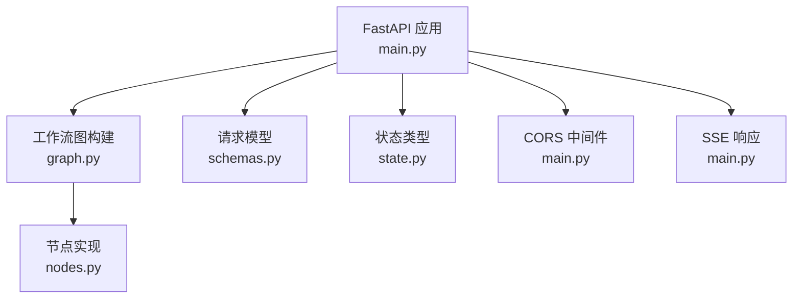
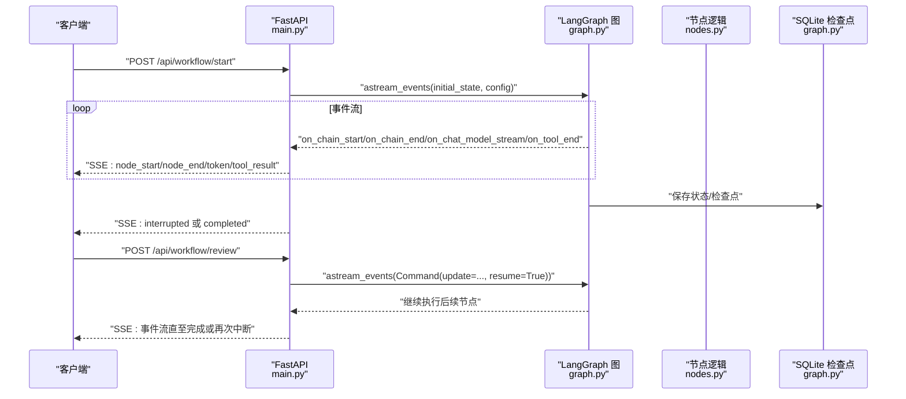
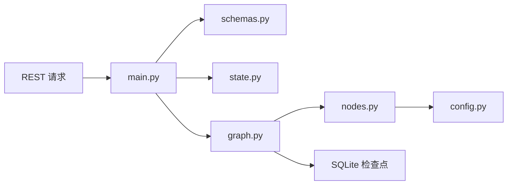

# RESTful API

<cite>
**本文引用的文件**
- [main.py](file://workflow-studio/backend/app/main.py)
- [schemas.py](file://workflow-studio/backend/app/schemas.py)
- [state.py](file://workflow-studio/backend/app/state.py)
- [graph.py](file://workflow-studio/backend/app/graph.py)
- [nodes.py](file://workflow-studio/backend/app/nodes.py)
- [config.py](file://workflow-studio/backend/app/config.py)
- [requirements.txt](file://workflow-studio/backend/requirements.txt)
- [README.md](file://workflow-studio/README.md)
</cite>

## 目录
1. [简介](#简介)
2. [项目结构](#项目结构)
3. [核心组件](#核心组件)
4. [架构总览](#架构总览)
5. [详细接口文档](#详细接口文档)
6. [依赖关系分析](#依赖关系分析)
7. [性能考虑](#性能考虑)
8. [故障排查指南](#故障排查指南)
9. [结论](#结论)
10. [附录](#附录)

## 简介
本文件为 Workflow Studio 后端的 RESTful API 提供完整说明，覆盖以下端点：
- POST /api/workflow/start（启动工作流）
- POST /api/workflow/review（提交审核并恢复执行）
- GET /api/workflow/state/{workflow_id}（获取工作流状态）
- GET /api/workflow/graph-structure（获取图结构）

该服务基于 FastAPI 构建，使用 LangGraph 编排研究工作流，并通过 Server-Sent Events（SSE）实时推送节点执行事件与 LLM 输出。所有请求均通过 CORS 白名单允许跨域访问。

## 项目结构
后端位于 workflow-studio/backend/app，主要模块职责如下：
- main.py：FastAPI 应用、CORS 配置、四个 REST 端点实现、SSE 事件流
- schemas.py：Pydantic 数据模型，定义请求体结构
- state.py：LangGraph 状态类型定义
- graph.py：工作流图构建、编译与检查点持久化
- nodes.py：各节点逻辑（规划、搜索、分析、写作、审核、修订、输出）
- config.py：环境变量加载与 LLM 配置
- requirements.txt：依赖声明

图表来源
- [main.py:14-21](file://workflow-studio/backend/app/main.py#L14-L21)
- [graph.py:23-77](file://workflow-studio/backend/app/graph.py#L23-L77)
- [schemas.py:4-11](file://workflow-studio/backend/app/schemas.py#L4-L11)
- [state.py:5-30](file://workflow-studio/backend/app/state.py#L5-L30)
- [nodes.py:18-128](file://workflow-studio/backend/app/nodes.py#L18-L128)

章节来源
- [main.py:14-21](file://workflow-studio/backend/app/main.py#L14-L21)
- [graph.py:23-77](file://workflow-studio/backend/app/graph.py#L23-L77)
- [schemas.py:4-11](file://workflow-studio/backend/app/schemas.py#L4-L11)
- [state.py:5-30](file://workflow-studio/backend/app/state.py#L5-L30)
- [nodes.py:18-128](file://workflow-studio/backend/app/nodes.py#L18-L128)

## 核心组件
- 工作流图：包含 plan → search → analyze → write → review → (output | revision → search) 的有向图，并在 review 前中断等待人工审核。
- 状态管理：ResearchState 定义了消息历史、控制字段、研究内容、审核元数据等。
- 事件流：SSE 推送 node_start、node_end、token、tool_result、interrupted、completed、error 等事件。
- 检查点：使用 SQLite 持久化，支持刷新页面后从断点恢复。

章节来源
- [graph.py:23-77](file://workflow-studio/backend/app/graph.py#L23-L77)
- [state.py:5-30](file://workflow-studio/backend/app/state.py#L5-L30)
- [main.py:60-103](file://workflow-studio/backend/app/main.py#L60-L103)
- [main.py:119-154](file://workflow-studio/backend/app/main.py#L119-L154)

## 架构总览
下图展示了客户端调用 REST 接口后，后端如何与 LangGraph 工作流交互，并通过 SSE 将事件回推至前端。

图表来源
- [main.py:35-103](file://workflow-studio/backend/app/main.py#L35-L103)
- [main.py:107-154](file://workflow-studio/backend/app/main.py#L107-L154)
- [graph.py:65-77](file://workflow-studio/backend/app/graph.py#L65-L77)
- [nodes.py:18-128](file://workflow-studio/backend/app/nodes.py#L18-L128)

## 详细接口文档

### 通用说明
- 基础路径：/api/workflow
- 认证机制：当前未启用鉴权中间件；如需生产环境安全，建议增加 JWT/OAuth2 等认证策略。
- CORS 配置：仅允许 http://localhost:5173 与 http://localhost:3000 跨域访问，方法与头均放行。
- 错误处理：HTTP 异常由 FastAPI 统一返回 JSON 错误；SSE 流中会推送 error 事件。
- 内容类型：JSON 请求/响应；SSE 响应类型为 text/event-stream。

章节来源
- [main.py:16-21](file://workflow-studio/backend/app/main.py#L16-L21)
- [main.py:96-97](file://workflow-studio/backend/app/main.py#L96-L97)
- [main.py:147-148](file://workflow-studio/backend/app/main.py#L147-L148)

### POST /api/workflow/start
- 功能：启动研究工作流，返回 SSE 事件流。
- 请求方法：POST
- URL 路径：/api/workflow/start
- 请求头：Content-Type: application/json
- 请求体：StartRequest
  - question: string（必填）
- 响应：SSE 文本流，事件类型包括：
  - node_start：节点开始执行
  - node_end：节点结束执行
  - token：LLM 流式输出片段
  - tool_result：工具调用结果摘要
  - interrupted：在审核节点暂停，附带 at 与 workflow_id
  - completed：工作流完成
  - error：异常信息
- 状态码：200（SSE 连接建立）；若抛出 HTTPException 则返回相应错误码（如 4xx/5xx）。
- 示例请求体（JSON）：
  - { "question": "请分析大语言模型在科研中的最新进展与挑战" }
- 示例响应片段（SSE 行）：
  - data: {"type":"node_start","node":"plan"}
  - data: {"type":"token","content":"..."}
  - data: {"type":"interrupted","at":"review","workflow_id":"..."}
  - data: {"type":"completed"}
  - data: {"type":"error","message":"..."}

章节来源
- [main.py:35-103](file://workflow-studio/backend/app/main.py#L35-L103)
- [schemas.py:4-5](file://workflow-studio/backend/app/schemas.py#L4-L5)
- [graph.py:65-77](file://workflow-studio/backend/app/graph.py#L65-L77)
- [nodes.py:18-128](file://workflow-studio/backend/app/nodes.py#L18-L128)

### POST /api/workflow/review
- 功能：提交人工审核结果，恢复工作流执行。
- 请求方法：POST
- URL 路径：/api/workflow/review
- 请求头：Content-Type: application/json
- 请求体：ReviewRequest
  - workflow_id: string（必填）
  - status: string（必填，取值 "approved" 或 "rejected"）
  - feedback: string（可选，默认空字符串）
- 响应：SSE 文本流，事件类型同 start 接口，可能再次触发 interrupted（若仍不通过且未达到最大迭代次数）。
- 状态码：200（SSE 连接建立）；异常时返回对应 HTTP 错误码。
- 示例请求体（JSON）：
  - { "workflow_id": "...", "status": "rejected", "feedback": "需补充对比实验与局限性讨论" }
- 示例响应片段（SSE 行）：
  - data: {"type":"node_start","node":"revision"}
  - data: {"type":"node_end","node":"search"}
  - data: {"type":"interrupted","at":"review","workflow_id":"..."}
  - data: {"type":"completed"}

章节来源
- [main.py:107-154](file://workflow-studio/backend/app/main.py#L107-L154)
- [schemas.py:8-11](file://workflow-studio/backend/app/schemas.py#L8-L11)
- [graph.py:11-20](file://workflow-studio/backend/app/graph.py#L11-L20)
- [nodes.py:100-128](file://workflow-studio/backend/app/nodes.py#L100-L128)

### GET /api/workflow/state/{workflow_id}
- 功能：获取指定工作流的当前状态，用于页面刷新后恢复。
- 请求方法：GET
- URL 路径：/api/workflow/state/{workflow_id}
- 路径参数：
  - workflow_id: string（必填）
- 响应体（JSON）：
  - workflow_id: string
  - values: object（排除 messages 后的状态值）
  - next: array<string>（下一个待执行节点列表，为空表示已完成）
  - is_interrupted: boolean（是否处于中断状态）
- 状态码：
  - 200：成功
  - 404：工作流不存在
- 示例响应（JSON）：
  - {
      "workflow_id": "...",
      "values": {
        "current_step": "review",
        "iteration_count": 1,
        "original_question": "...",
        "research_plan": [...],
        "search_results": [...],
        "analysis": "...",
        "draft_report": "...",
        "final_report": "",
        "review_status": "pending",
        "review_feedback": "",
        "started_at": "...",
        "completed_at": ""
      },
      "next": ["review"],
      "is_interrupted": true
    }

章节来源
- [main.py:158-173](file://workflow-studio/backend/app/main.py#L158-L173)
- [state.py:5-30](file://workflow-studio/backend/app/state.py#L5-L30)

### GET /api/workflow/graph-structure
- 功能：返回工作流图结构（节点与边），供前端渲染可视化。
- 请求方法：GET
- URL 路径：/api/workflow/graph-structure
- 响应体（JSON）：
  - nodes: array<object>，每个对象包含 id、label、type、position（x,y）
  - edges: array<object>，每个对象包含 id、source、target、label（可选）
- 状态码：200
- 示例响应（JSON）：
  - {
      "nodes": [
        {"id":"plan","label":"📋 规划","type":"plan","position":{"x":250,"y":0}},
        {"id":"search","label":"🔍 搜索","type":"search","position":{"x":250,"y":120}},
        {"id":"analyze","label":"📊 分析","type":"analyze","position":{"x":250,"y":240}},
        {"id":"write","label":"✍️ 写作","type":"write","position":{"x":250,"y":360}},
        {"id":"review","label":"👤 审核","type":"review","position":{"x":250,"y":480}},
        {"id":"revision","label":"🔄 修订","type":"revision","position":{"x":500,"y":300}},
        {"id":"output","label":"✅ 输出","type":"output","position":{"x":250,"y":600}}
      ],
      "edges": [
        {"id":"e1","source":"plan","target":"search"},
        {"id":"e2","source":"search","target":"analyze"},
        {"id":"e3","source":"analyze","target":"write"},
        {"id":"e4","source":"write","target":"review"},
        {"id":"e5","source":"review","target":"output","label":"通过"},
        {"id":"e6","source":"review","target":"revision","label":"不通过"},
        {"id":"e7","source":"revision","target":"search"}
      ]
    }

章节来源
- [main.py:177-199](file://workflow-studio/backend/app/main.py#L177-L199)

## 依赖关系分析
- 框架与运行时：FastAPI、Uvicorn、SSE Starlette
- 工作流与 LLM：LangGraph、LangChain、LangChain OpenAI
- 检查点：AsyncSqliteSaver（SQLite 文件存储）
- 配置：python-dotenv 读取 .env

图表来源
- [main.py:14-21](file://workflow-studio/backend/app/main.py#L14-L21)
- [graph.py:65-77](file://workflow-studio/backend/app/graph.py#L65-L77)
- [nodes.py:1-15](file://workflow-studio/backend/app/nodes.py#L1-L15)
- [config.py:1-9](file://workflow-studio/backend/app/config.py#L1-L9)
- [requirements.txt:1-10](file://workflow-studio/backend/requirements.txt#L1-L10)

章节来源
- [requirements.txt:1-10](file://workflow-studio/backend/requirements.txt#L1-L10)
- [config.py:1-9](file://workflow-studio/backend/app/config.py#L1-L9)

## 性能考虑
- 流式处理：SSE 避免长轮询开销，降低延迟。
- 检查点持久化：SQLite 本地存储，适合开发/小规模；生产建议迁移到 PostgreSQL 以增强并发与可靠性。
- 防无限循环：审核不通过最多 3 轮修订后强制输出，避免资源耗尽。
- 并发与扩展：FastAPI 异步 I/O 可提升吞吐；必要时引入队列与外部任务调度。

[本节为通用指导，不直接分析具体文件]

## 故障排查指南
- 常见问题
  - 工作流不存在：GET /api/workflow/state/{workflow_id} 返回 404，检查 workflow_id 是否正确。
  - 审核未生效：确认 ReviewRequest 中 workflow_id 与当前中断的工作流一致。
  - 事件流中断：检查网络与代理是否支持 SSE；确保服务端未缓存响应。
  - LLM 调用失败：检查 OPENAI_API_KEY、OPENAI_BASE_URL、LLM_MODEL 配置是否正确。
- 错误处理策略
  - HTTP 层：FastAPI 抛出 HTTPException 返回标准错误格式。
  - 流式层：SSE 推送 error 事件，包含异常消息，便于前端提示与重试。
- 调试建议
  - 查看日志：关注节点执行与工具调用日志。
  - 检查点文件：确认 checkpoints.db 是否存在并可读写。
  - 环境变量：验证 .env 已正确加载。

章节来源
- [main.py:96-97](file://workflow-studio/backend/app/main.py#L96-L97)
- [main.py:147-148](file://workflow-studio/backend/app/main.py#L147-L148)
- [main.py:165-166](file://workflow-studio/backend/app/main.py#L165-L166)
- [graph.py:69-74](file://workflow-studio/backend/app/graph.py#L69-L74)
- [config.py:6-8](file://workflow-studio/backend/app/config.py#L6-L8)

## 结论
Workflow Studio 提供了简洁而强大的 RESTful API，结合 SSE 实现了实时工作流执行反馈。通过清晰的请求/响应模型与健壮的错误处理，开发者可以快速集成前端可视化与人工审核流程。建议在生产环境中完善认证、升级检查点存储并加强监控与限流。

[本节为总结性内容，不直接分析具体文件]

## 附录

### 认证与安全
- 当前未启用认证中间件；建议在生产环境添加 JWT/OAuth2 等鉴权策略，并对敏感操作进行权限校验。
- CORS 仅允许特定前端域名，避免任意站点跨域调用。

章节来源
- [main.py:16-21](file://workflow-studio/backend/app/main.py#L16-L21)

### 运行与部署
- 后端启动命令参考 README，端口默认为 1994。
- 前端开发服务器端口参考 README，通常为 1993。

章节来源
- [README.md:23-45](file://workflow-studio/README.md#L23-L45)