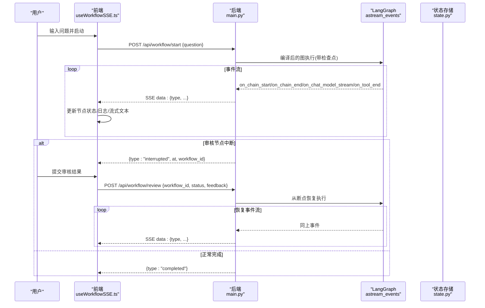
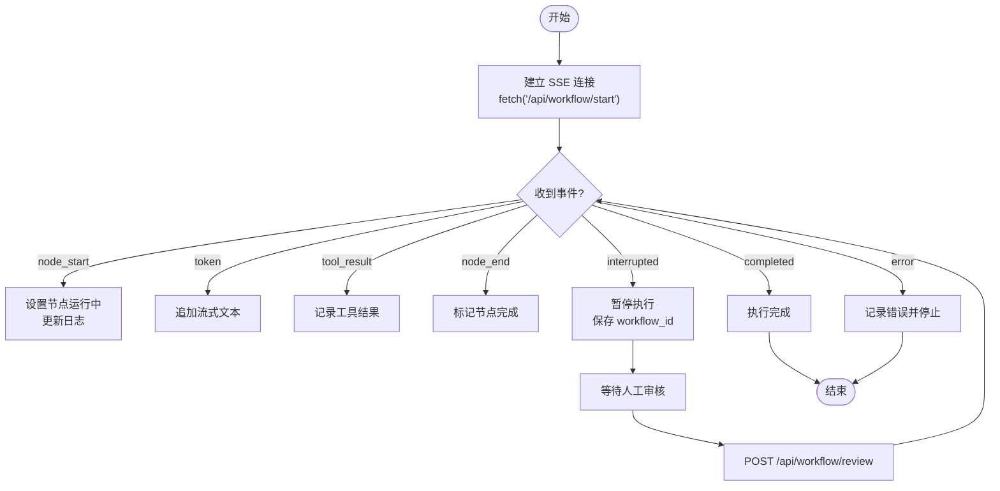
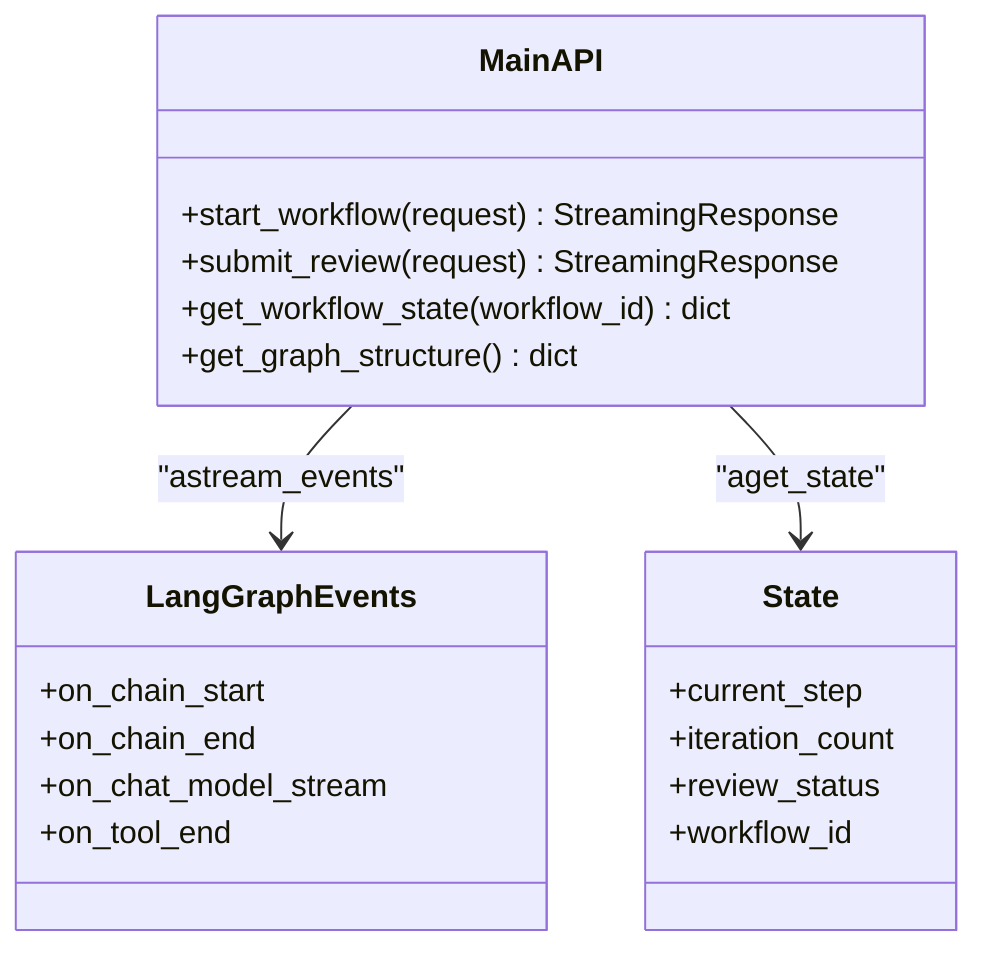
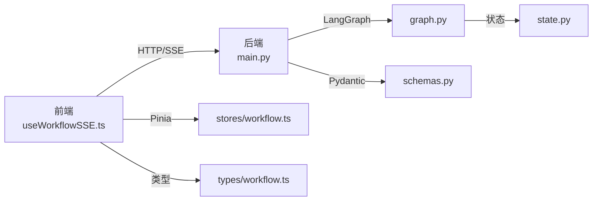

# SSE 事件流

<cite>
**本文引用的文件**
- [backend/app/main.py](file://workflow-studio/backend/app/main.py)
- [backend/app/schemas.py](file://workflow-studio/backend/app/schemas.py)
- [backend/app/graph.py](file://workflow-studio/backend/app/graph.py)
- [backend/app/state.py](file://workflow-studio/backend/app/state.py)
- [frontend/src/composables/useWorkflowSSE.ts](file://workflow-studio/frontend/src/composables/useWorkflowSSE.ts)
- [frontend/src/types/workflow.ts](file://workflow-studio/frontend/src/types/workflow.ts)
- [frontend/src/stores/workflow.ts](file://workflow-studio/frontend/src/stores/workflow.ts)
- [frontend/src/components/panels/Timeline.vue](file://workflow-studio/frontend/src/components/panels/Timeline.vue)
- [README.md](file://workflow-studio/README.md)
</cite>

## 目录
1. [简介](#简介)
2. [项目结构](#项目结构)
3. [核心组件](#核心组件)
4. [架构总览](#架构总览)
5. [详细组件分析](#详细组件分析)
6. [依赖关系分析](#依赖关系分析)
7. [性能考虑](#性能考虑)
8. [故障排查指南](#故障排查指南)
9. [结论](#结论)
10. [附录](#附录)

## 简介
本文件为 Workflow Studio 的 Server-Sent Events（SSE）事件流提供完整文档，覆盖连接建立方式、事件类型定义与数据格式规范、前端集成示例（连接管理、事件监听、错误处理与重连机制）、性能优化建议与调试技巧。系统后端基于 FastAPI + LangGraph 实现工作流执行，并通过 SSE 将节点开始/结束、LLM 流式 token、工具结果、中断暂停、完成与错误等事件实时推送至前端；前端使用 Vue 3 + TypeScript 消费事件并驱动可视化渲染与状态更新。

## 项目结构
- 后端：FastAPI 入口暴露 /api/workflow/start、/api/workflow/review、/api/workflow/state/{workflow_id}、/api/workflow/graph-structure 等接口；其中 start 与 review 返回 SSE 流。
- 前端：composable useWorkflowSSE 封装 SSE 连接与事件处理；types 定义事件与工作流类型；store 维护全局状态；Timeline 展示日志。

```mermaid
graph TB
FE["前端<br/>useWorkflowSSE.ts"] --> |POST /api/workflow/start| BE["后端<br/>main.py"]
FE --> |POST /api/workflow/review| BE
FE --> |GET /api/workflow/state/{id}| BE
FE --> |GET /api/workflow/graph-structure| BE
BE --> |LangGraph astream_events| LG["LangGraph 图<br/>graph.py"]
LG --> |读取/写入状态| ST["状态定义<br/>state.py"]
```

图表来源
- [backend/app/main.py:35-103](file://workflow-studio/backend/app/main.py#L35-L103)
- [backend/app/graph.py:23-77](file://workflow-studio/backend/app/graph.py#L23-L77)
- [backend/app/state.py:5-29](file://workflow-studio/backend/app/state.py#L5-L29)
- [frontend/src/composables/useWorkflowSSE.ts:74-114](file://workflow-studio/frontend/src/composables/useWorkflowSSE.ts#L74-L114)

章节来源
- [README.md:62-90](file://workflow-studio/README.md#L62-L90)

## 核心组件
- 后端事件源：/api/workflow/start 与 /api/workflow/review 两个端点通过 StreamingResponse 输出 text/event-stream，内部基于 LangGraph 的 astream_events 捕获 on_chain_start/on_chain_end/on_chat_model_stream/on_tool_end 等事件，并转换为统一的事件 JSON。
- 前端事件消费者：useWorkflowSSE 负责发起 fetch 请求、读取 ReadableStream、按行解析 data: 前缀消息、分发到 handleSSEEvent 进行状态更新与 UI 渲染。
- 类型与状态：types/workflow.ts 定义了所有事件类型与字段；stores/workflow.ts 提供 Pinia store 用于跨组件共享状态；Timeline.vue 展示日志。

章节来源
- [backend/app/main.py:35-154](file://workflow-studio/backend/app/main.py#L35-L154)
- [frontend/src/composables/useWorkflowSSE.ts:19-72](file://workflow-studio/frontend/src/composables/useWorkflowSSE.ts#L19-L72)
- [frontend/src/types/workflow.ts:22-32](file://workflow-studio/frontend/src/types/workflow.ts#L22-L32)
- [frontend/src/stores/workflow.ts:5-73](file://workflow-studio/frontend/src/stores/workflow.ts#L5-L73)
- [frontend/src/components/panels/Timeline.vue:1-22](file://workflow-studio/frontend/src/components/panels/Timeline.vue#L1-L22)

## 架构总览
SSE 事件流由后端在用户触发工作流时建立长连接，持续推送事件；前端以流式方式接收并即时更新 UI。审核节点会中断流程，等待人工提交结果后恢复执行。



图表来源
- [backend/app/main.py:35-154](file://workflow-studio/backend/app/main.py#L35-L154)
- [backend/app/graph.py:65-77](file://workflow-studio/backend/app/graph.py#L65-L77)
- [frontend/src/composables/useWorkflowSSE.ts:74-157](file://workflow-studio/frontend/src/composables/useWorkflowSSE.ts#L74-L157)

## 详细组件分析

### 事件类型与数据格式
- node_start
  - 含义：某个工作流节点开始执行
  - 字段：type="node_start"，node=节点名
  - 场景：plan/search/analyze/write/review/output/revision 节点开始时推送
- node_end
  - 含义：某个工作流节点执行结束
  - 字段：type="node_end"，node=节点名，output=节点输出的字符串摘要（截断）
  - 场景：节点结束时推送
- token
  - 含义：LLM 流式输出片段
  - 字段：type="token"，content=文本片段
  - 场景：on_chat_model_stream 时推送，前端可拼接显示
- tool_result
  - 含义：工具调用结果
  - 字段：type="tool_result"，data=工具返回内容（字符串摘要）
  - 场景：on_tool_end 时推送
- interrupted
  - 含义：工作流被中断（如等待人工审核）
  - 字段：type="interrupted"，at=当前节点名，workflow_id=工作流ID
  - 场景：当 state.next 非空时推送，表示需要外部干预
- completed
  - 含义：工作流执行完成
  - 字段：type="completed"
  - 场景：无下一个待执行节点时推送
- error
  - 含义：执行异常
  - 字段：type="error"，message=错误信息
  - 场景：任何未捕获异常时推送

章节来源
- [backend/app/main.py:60-98](file://workflow-studio/backend/app/main.py#L60-L98)
- [backend/app/main.py:119-148](file://workflow-studio/backend/app/main.py#L119-L148)
- [frontend/src/types/workflow.ts:22-32](file://workflow-studio/frontend/src/types/workflow.ts#L22-L32)

### 连接建立与事件处理流程
- 启动工作流
  - 前端 POST /api/workflow/start，携带 question
  - 后端创建初始状态与 thread_id，进入 astream_events 循环
  - 根据事件类型映射为统一 JSON 并逐条推送
  - 结束时判断是否中断或完成，推送相应事件
- 提交审核并恢复
  - 前端 POST /api/workflow/review，携带 workflow_id、status、feedback
  - 后端注入 Command(update=update, resume=True)，从断点继续执行
  - 再次推送事件流，直至完成或再次中断



图表来源
- [frontend/src/composables/useWorkflowSSE.ts:74-157](file://workflow-studio/frontend/src/composables/useWorkflowSSE.ts#L74-L157)
- [backend/app/main.py:35-154](file://workflow-studio/backend/app/main.py#L35-L154)

章节来源
- [frontend/src/composables/useWorkflowSSE.ts:19-72](file://workflow-studio/frontend/src/composables/useWorkflowSSE.ts#L19-L72)
- [frontend/src/composables/useWorkflowSSE.ts:74-157](file://workflow-studio/frontend/src/composables/useWorkflowSSE.ts#L74-L157)
- [backend/app/main.py:35-154](file://workflow-studio/backend/app/main.py#L35-L154)

### 前端客户端集成要点
- 连接管理
  - 使用 fetch 发起 POST 请求，获取 response.body.getReader()
  - 通过 TextDecoder 解码二进制块，按行过滤 data: 前缀的消息
  - 对每行 JSON 解析并调用 handleSSEEvent
- 事件监听与状态更新
  - node_start/node_end：更新节点状态与日志
  - token：累积 streamingText 用于实时展示
  - tool_result：记录工具结果摘要
  - interrupted：暂停运行、记录中断位置与 workflow_id
  - completed/error：结束运行并记录结果
- 错误处理与重连
  - 当前实现未包含自动重连；建议在 reader 读取失败或网络异常时，基于 workflow_id 查询状态并尝试重新建立连接
  - 可在错误分支中调用 /api/workflow/state/{workflow_id} 获取当前状态，决定是否恢复

章节来源
- [frontend/src/composables/useWorkflowSSE.ts:74-157](file://workflow-studio/frontend/src/composables/useWorkflowSSE.ts#L74-L157)
- [frontend/src/types/workflow.ts:22-32](file://workflow-studio/frontend/src/types/workflow.ts#L22-L32)
- [frontend/src/stores/workflow.ts:5-73](file://workflow-studio/frontend/src/stores/workflow.ts#L5-L73)

### 后端事件生成逻辑
- 事件映射
  - on_chain_start → node_start（仅特定节点）
  - on_chain_end → node_end（仅特定节点，附带输出摘要）
  - on_chat_model_stream → token（LLM 文本片段）
  - on_tool_end → tool_result（工具结果摘要）
- 中断与完成
  - 执行结束后读取 state.next 判断是否中断；若为空则推送 completed
- 错误处理
  - 捕获异常并推送 error 事件



图表来源
- [backend/app/main.py:35-154](file://workflow-studio/backend/app/main.py#L35-L154)
- [backend/app/graph.py:65-77](file://workflow-studio/backend/app/graph.py#L65-L77)
- [backend/app/state.py:5-29](file://workflow-studio/backend/app/state.py#L5-L29)

章节来源
- [backend/app/main.py:35-154](file://workflow-studio/backend/app/main.py#L35-L154)
- [backend/app/graph.py:23-77](file://workflow-studio/backend/app/graph.py#L23-L77)
- [backend/app/state.py:5-29](file://workflow-studio/backend/app/state.py#L5-L29)

## 依赖关系分析
- 后端依赖
  - FastAPI 路由与 StreamingResponse
  - LangGraph 的 StateGraph、CompiledStateGraph、AsyncSqliteSaver
  - Pydantic 模型用于请求校验
- 前端依赖
  - Vue 3 响应式 API
  - Fetch API 与 ReadableStream
  - Pinia 状态管理
  - TypeScript 类型约束



图表来源
- [backend/app/main.py:35-154](file://workflow-studio/backend/app/main.py#L35-L154)
- [backend/app/graph.py:23-77](file://workflow-studio/backend/app/graph.py#L23-L77)
- [backend/app/schemas.py:4-11](file://workflow-studio/backend/app/schemas.py#L4-L11)
- [backend/app/state.py:5-29](file://workflow-studio/backend/app/state.py#L5-L29)
- [frontend/src/composables/useWorkflowSSE.ts:1-172](file://workflow-studio/frontend/src/composables/useWorkflowSSE.ts#L1-L172)
- [frontend/src/stores/workflow.ts:1-75](file://workflow-studio/frontend/src/stores/workflow.ts#L1-L75)
- [frontend/src/types/workflow.ts:1-64](file://workflow-studio/frontend/src/types/workflow.ts#L1-L64)

章节来源
- [backend/app/main.py:35-154](file://workflow-studio/backend/app/main.py#L35-L154)
- [frontend/src/composables/useWorkflowSSE.ts:1-172](file://workflow-studio/frontend/src/composables/useWorkflowSSE.ts#L1-L172)

## 性能考虑
- 后端
  - 使用 StreamingResponse 与 no-cache 头避免代理缓冲
  - 对输出与工具结果做长度截断，减少传输体积
  - 使用 AsyncSqliteSaver 作为检查点，生产环境可替换为 PostgreSQL
- 前端
  - 流式拼接 token 时注意内存占用，可对 streamingText 做分段缓存或虚拟滚动
  - 日志列表过长时应限制条目数量或使用分页加载
  - 在网络不稳定时增加重试与退避策略，结合 /api/workflow/state/{workflow_id} 恢复状态

[本节为通用指导，不直接分析具体文件]

## 故障排查指南
- 常见问题
  - 连接断开：检查浏览器控制台网络面板，确认 SSE 流是否正常；必要时实现重连逻辑
  - 事件丢失：确保按行解析 data: 前缀消息，忽略解析失败的行
  - 审核不恢复：确认 workflow_id 正确传递至 /api/workflow/review，且后端成功 resume
- 调试技巧
  - 在后端打印事件 kind 与 name，确认事件映射是否正确
  - 在前端 logs 中查看关键事件顺序，定位问题阶段
  - 使用 /api/workflow/state/{workflow_id} 检查当前状态与 next 节点

章节来源
- [backend/app/main.py:60-98](file://workflow-studio/backend/app/main.py#L60-L98)
- [backend/app/main.py:119-148](file://workflow-studio/backend/app/main.py#L119-L148)
- [frontend/src/composables/useWorkflowSSE.ts:94-109](file://workflow-studio/frontend/src/composables/useWorkflowSSE.ts#L94-L109)
- [frontend/src/components/panels/Timeline.vue:1-22](file://workflow-studio/frontend/src/components/panels/Timeline.vue#L1-L22)

## 结论
本 SSE 事件流方案通过后端 LangGraph 事件驱动与前端流式消费，实现了工作流的实时可视化与人工介入控制。事件类型覆盖节点生命周期、LLM 流式输出、工具结果、中断与完成等关键场景。前端采用简洁的 composable 封装，便于复用与维护。建议在生产环境中增强重连机制、日志管理与性能监控，以提升稳定性与可观测性。

[本节为总结，不直接分析具体文件]

## 附录

### API 参考
- POST /api/workflow/start
  - 请求体：{ question: string }
  - 响应：text/event-stream，事件包括 node_start、token、tool_result、node_end、interrupted、completed、error
- POST /api/workflow/review
  - 请求体：{ workflow_id: string, status: "approved"|"rejected", feedback?: string }
  - 响应：text/event-stream，事件同上
- GET /api/workflow/state/{workflow_id}
  - 响应：{ workflow_id, values, next, is_interrupted }
- GET /api/workflow/graph-structure
  - 响应：{ nodes[], edges[] }

章节来源
- [backend/app/main.py:35-200](file://workflow-studio/backend/app/main.py#L35-L200)
- [backend/app/schemas.py:4-11](file://workflow-studio/backend/app/schemas.py#L4-L11)

### 前端集成示例（路径引用）
- 连接管理与事件处理：[useWorkflowSSE.ts:74-157](file://workflow-studio/frontend/src/composables/useWorkflowSSE.ts#L74-L157)
- 事件类型定义：[workflow.ts:22-32](file://workflow-studio/frontend/src/types/workflow.ts#L22-L32)
- 状态管理：[stores/workflow.ts:5-73](file://workflow-studio/frontend/src/stores/workflow.ts#L5-L73)
- 日志展示：[Timeline.vue:1-22](file://workflow-studio/frontend/src/components/panels/Timeline.vue#L1-L22)