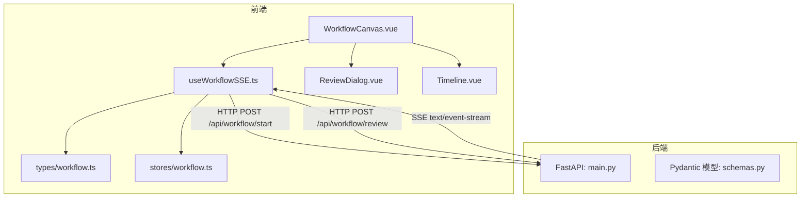
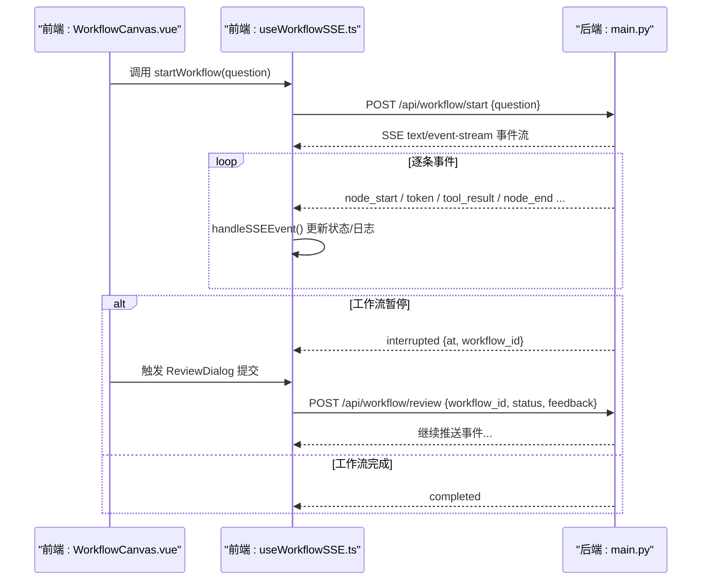
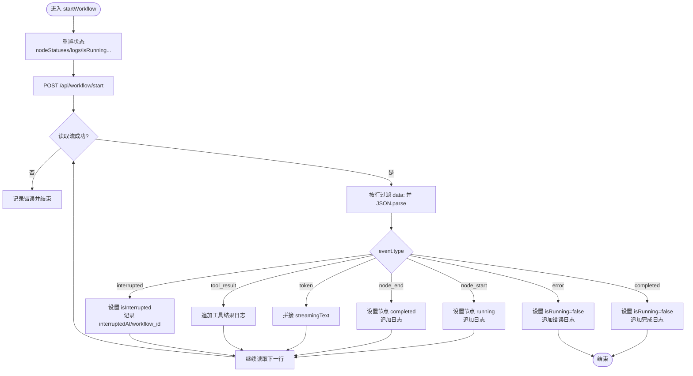
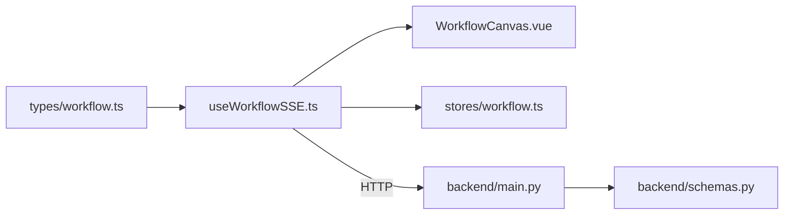

# SSE 实时通信

<cite>
**本文引用的文件**
- [useWorkflowSSE.ts](file://workflow-studio/frontend/src/composables/useWorkflowSSE.ts)
- [workflow.ts](file://workflow-studio/frontend/src/types/workflow.ts)
- [workflow.ts（store）](file://workflow-studio/frontend/src/stores/workflow.ts)
- [main.py](file://workflow-studio/backend/app/main.py)
- [schemas.py](file://workflow-studio/backend/app/schemas.py)
- [WorkflowCanvas.vue](file://workflow-studio/frontend/src/components/WorkflowCanvas.vue)
- [ReviewDialog.vue](file://workflow-studio/frontend/src/components/panels/ReviewDialog.vue)
- [Timeline.vue](file://workflow-studio/frontend/src/components/panels/Timeline.vue)
</cite>

## 目录
1. [简介](#简介)
2. [项目结构](#项目结构)
3. [核心组件](#核心组件)
4. [架构总览](#架构总览)
5. [详细组件分析](#详细组件分析)
6. [依赖关系分析](#依赖关系分析)
7. [性能与内存优化](#性能与内存优化)
8. [故障排除指南](#故障排除指南)
9. [结论](#结论)
10. [附录：事件协议与数据格式](#附录事件协议与数据格式)

## 简介
本技术文档聚焦于 Workflow Studio 的 SSE（Server-Sent Events）实时通信机制，重点解析前端组合式函数 useWorkflowSSE 的实现原理，包括连接建立、事件监听、消息解析与错误处理；并详细说明工作流事件类型定义、数据格式规范与传输协议。同时覆盖前端如何接收后端推送的工作流状态更新、日志信息以及用户交互请求（人工审核），并提供连接重连策略建议、内存泄漏防护和性能优化技巧，最后给出客户端集成示例、调试方法与故障排除指南。

## 项目结构
本项目采用前后端分离架构：
- 后端使用 FastAPI 暴露 REST + SSE 接口，负责启动工作流、持续推送事件、支持人工审核后恢复执行。
- 前端基于 Vue 3 + TypeScript，通过组合式函数 useWorkflowSSE 封装 SSE 连接与事件处理逻辑，并在画布组件中驱动 UI 实时更新。

图表来源
- [WorkflowCanvas.vue:1-133](file://workflow-studio/frontend/src/components/WorkflowCanvas.vue#L1-L133)
- [useWorkflowSSE.ts:1-172](file://workflow-studio/frontend/src/composables/useWorkflowSSE.ts#L1-L172)
- [workflow.ts:1-64](file://workflow-studio/frontend/src/types/workflow.ts#L1-L64)
- [workflow.ts（store）:1-75](file://workflow-studio/frontend/src/stores/workflow.ts#L1-L75)
- [main.py:1-200](file://workflow-studio/backend/app/main.py#L1-L200)
- [schemas.py:1-12](file://workflow-studio/backend/app/schemas.py#L1-L12)

章节来源
- [WorkflowCanvas.vue:1-133](file://workflow-studio/frontend/src/components/WorkflowCanvas.vue#L1-L133)
- [useWorkflowSSE.ts:1-172](file://workflow-studio/frontend/src/composables/useWorkflowSSE.ts#L1-L172)
- [main.py:1-200](file://workflow-studio/backend/app/main.py#L1-L200)

## 核心组件
- useWorkflowSSE：封装 SSE 连接、事件分发、状态管理与用户交互（启动工作流、提交审核）。
- types/workflow.ts：定义 NodeStatus、NodeType、SSEEvent、WorkflowState 等类型契约。
- stores/workflow.ts：Pinia store 用于集中管理工作流状态（可选，当前 useWorkflowSSE 独立维护状态）。
- WorkflowCanvas.vue：将 useWorkflowSSE 的状态映射到可视化节点与边，驱动 UI 动画与交互。
- ReviewDialog.vue：提供人工审核输入与提交入口。
- Timeline.vue：展示执行日志。

章节来源
- [useWorkflowSSE.ts:1-172](file://workflow-studio/frontend/src/composables/useWorkflowSSE.ts#L1-L172)
- [workflow.ts:1-64](file://workflow-studio/frontend/src/types/workflow.ts#L1-L64)
- [workflow.ts（store）:1-75](file://workflow-studio/frontend/src/stores/workflow.ts#L1-L75)
- [WorkflowCanvas.vue:1-133](file://workflow-studio/frontend/src/components/WorkflowCanvas.vue#L1-L133)
- [ReviewDialog.vue:1-54](file://workflow-studio/frontend/src/components/panels/ReviewDialog.vue#L1-L54)
- [Timeline.vue:1-22](file://workflow-studio/frontend/src/components/panels/Timeline.vue#L1-L22)

## 架构总览
SSE 通信流程如下：
- 前端调用 /api/workflow/start 发起工作流执行，后端以 text/event-stream 持续推送事件。
- 前端读取响应体流，按行过滤 data: 前缀，解析 JSON 后分发给 handleSSEEvent，更新节点状态、日志、流式文本与中断标记。
- 当工作流在 review 节点暂停时，后端返回 interrupted 事件携带 workflow_id；前端通过 /api/workflow/review 提交审核结果恢复执行。
- 后端在每次事件流结束时检查是否再次暂停或已完成，分别推送 interrupted 或 completed。

图表来源
- [WorkflowCanvas.vue:85-93](file://workflow-studio/frontend/src/components/WorkflowCanvas.vue#L85-L93)
- [useWorkflowSSE.ts:74-114](file://workflow-studio/frontend/src/composables/useWorkflowSSE.ts#L74-L114)
- [useWorkflowSSE.ts:116-157](file://workflow-studio/frontend/src/composables/useWorkflowSSE.ts#L116-L157)
- [main.py:34-103](file://workflow-studio/backend/app/main.py#L34-L103)
- [main.py:106-154](file://workflow-studio/backend/app/main.py#L106-L154)

## 详细组件分析

### useWorkflowSSE 组合式函数
职责与实现要点：
- 状态管理：维护 nodeStatuses、logs、isRunning、isInterrupted、interruptedAt、streamingText、workflowId。
- 事件分发：handleSSEEvent 根据 event.type 分支处理不同事件类型，更新状态与日志。
- 连接建立：startWorkflow 通过 fetch 发起 POST，获取 ReadableStream 并按行解析 data: 前缀的事件，JSON 解析后分发。
- 用户交互：submitReview 在收到 interrupted 事件后，携带 workflow_id 提交审核结果，恢复工作流执行。
- 错误处理：捕获网络异常与 JSON 解析异常，记录日志并重置运行状态。

图表来源
- [useWorkflowSSE.ts:74-114](file://workflow-studio/frontend/src/composables/useWorkflowSSE.ts#L74-L114)
- [useWorkflowSSE.ts:19-72](file://workflow-studio/frontend/src/composables/useWorkflowSSE.ts#L19-L72)

章节来源
- [useWorkflowSSE.ts:1-172](file://workflow-studio/frontend/src/composables/useWorkflowSSE.ts#L1-L172)

### 类型定义与数据格式
- NodeStatus：idle | running | completed | error | waiting
- NodeType：plan | search | analyze | write | review | revision | output
- SSEEvent：包含 type、node、content、output、data、at、message、workflow_id 等字段，用于描述事件类型与负载。
- WorkflowState：聚合前端运行时状态，便于跨组件共享。

章节来源
- [workflow.ts:1-64](file://workflow-studio/frontend/src/types/workflow.ts#L1-L64)

### 后端事件流与协议
- 启动接口：POST /api/workflow/start，接收 question，返回 SSE 流。
- 审核接口：POST /api/workflow/review，接收 workflow_id、status、feedback，恢复执行并返回 SSE 流。
- 事件类型：
  - node_start：节点开始执行
  - node_end：节点结束执行，附带输出摘要
  - token：LLM 流式内容片段
  - tool_result：工具调用结果摘要
  - interrupted：工作流暂停，附带 at（暂停节点）与 workflow_id
  - completed：工作流完成
  - error：发生错误，附带 message
- 传输协议：text/event-stream，每行以 data: 开头，内容为 JSON。

章节来源
- [main.py:34-103](file://workflow-studio/backend/app/main.py#L34-L103)
- [main.py:106-154](file://workflow-studio/backend/app/main.py#L106-L154)
- [schemas.py:1-12](file://workflow-studio/backend/app/schemas.py#L1-L12)

### 前端集成与 UI 联动
- WorkflowCanvas.vue 使用 useWorkflowSSE 提供的状态与方法，将节点状态映射到 Vue Flow 节点与边，动态控制动画与样式。
- ReviewDialog.vue 提供人工审核输入，调用 submitReview 提交审核结果。
- Timeline.vue 展示 logs 数组，反映事件处理过程。

章节来源
- [WorkflowCanvas.vue:85-127](file://workflow-studio/frontend/src/components/WorkflowCanvas.vue#L85-L127)
- [ReviewDialog.vue:32-53](file://workflow-studio/frontend/src/components/panels/ReviewDialog.vue#L32-L53)
- [Timeline.vue:1-22](file://workflow-studio/frontend/src/components/panels/Timeline.vue#L1-L22)

## 依赖关系分析
- 前端依赖：
  - useWorkflowSSE 依赖 types/workflow.ts 的类型定义。
  - WorkflowCanvas.vue 依赖 useWorkflowSSE 的状态与方法，并通过 Pinion 的 watch 深度监听更新节点与边。
- 后端依赖：
  - main.py 依赖 Pydantic 模型 schemas.py 进行请求校验。
  - 事件流基于 LangGraph 的 astream_events 与 aget_state，结合自定义事件映射为 SSE。

图表来源
- [workflow.ts:1-64](file://workflow-studio/frontend/src/types/workflow.ts#L1-L64)
- [useWorkflowSSE.ts:1-172](file://workflow-studio/frontend/src/composables/useWorkflowSSE.ts#L1-L172)
- [workflow.ts（store）:1-75](file://workflow-studio/frontend/src/stores/workflow.ts#L1-L75)
- [main.py:1-200](file://workflow-studio/backend/app/main.py#L1-L200)
- [schemas.py:1-12](file://workflow-studio/backend/app/schemas.py#L1-L12)

章节来源
- [useWorkflowSSE.ts:1-172](file://workflow-studio/frontend/src/composables/useWorkflowSSE.ts#L1-L172)
- [main.py:1-200](file://workflow-studio/backend/app/main.py#L1-L200)

## 性能与内存优化
- 流式处理优化：
  - 使用 TextDecoder 与逐行过滤 data: 前缀，避免大对象一次性加载。
  - 对 tool_result 与 node_end 的输出进行截断，减少日志体积。
- 状态更新优化：
  - 使用不可变更新（展开运算符）确保 Vue 响应式追踪正确。
  - 仅在必要时更新 streamingText，避免频繁重渲染。
- 内存泄漏防护：
  - 当前实现未显式关闭流或清理定时器，建议在组件销毁时中止 fetch 流（例如 AbortController）并释放资源。
  - 限制日志长度，避免无限增长导致内存占用过高。
- 重连策略建议：
  - 检测网络错误或流提前结束，实现指数退避重连。
  - 使用 workflow_id 恢复上下文，避免重复创建会话。
- 并发与背压：
  - 若事件速率高，考虑节流或合并 token 事件，降低 UI 压力。
  - 在后端侧可对大输出进行分页或限速。

[本节为通用指导，不直接分析具体文件]

## 故障排除指南
- 常见问题定位：
  - 无法建立连接：检查 CORS 配置与端口，确认后端允许前端域名。
  - 事件未解析：确认后端返回的 data: 行格式正确且 JSON 可解析。
  - 工作流未恢复：确认 interrupted 事件携带正确的 workflow_id，并提交审核参数。
  - 日志过多导致卡顿：限制日志长度或分页显示。
- 调试方法：
  - 浏览器开发者工具 Network 面板查看 SSE 流与请求头。
  - 控制台打印 handleSSEEvent 的输入事件，验证类型与字段。
  - 后端日志记录事件流生成过程，确认节点执行顺序。
- 错误处理：
  - 捕获 fetch 异常与 JSON 解析异常，记录错误日志并重置运行状态。
  - 对 interrupted 与 completed 状态进行互斥处理，避免状态不一致。

章节来源
- [useWorkflowSSE.ts:101-113](file://workflow-studio/frontend/src/composables/useWorkflowSSE.ts#L101-L113)
- [useWorkflowSSE.ts:144-156](file://workflow-studio/frontend/src/composables/useWorkflowSSE.ts#L144-L156)
- [main.py:96-98](file://workflow-studio/backend/app/main.py#L96-L98)
- [main.py:147-149](file://workflow-studio/backend/app/main.py#L147-L149)

## 结论
useWorkflowSSE 以简洁的组合式函数封装了 SSE 连接的完整生命周期，配合清晰的类型定义与后端事件协议，实现了工作流状态的实时可视化与交互式审核。通过合理的状态更新策略与错误处理，前端能够稳定地接收并展示后端推送的事件。未来可在连接重连、内存管理与性能优化方面进一步增强，以提升用户体验与系统鲁棒性。

[本节为总结，不直接分析具体文件]

## 附录：事件协议与数据格式
- 事件类型与字段说明：
  - node_start：{type: 'node_start', node: string}
  - node_end：{type: 'node_end', node: string, output?: string}
  - token：{type: 'token', content: string}
  - tool_result：{type: 'tool_result', data: unknown}
  - interrupted：{type: 'interrupted', at: string, workflow_id: string}
  - completed：{type: 'completed'}
  - error：{type: 'error', message: string}
- 传输协议：
  - Content-Type: text/event-stream
  - 每行以 data: 开头，内容为 JSON
  - 后端设置 Cache-Control: no-cache 与 X-Accel-Buffering: no 以禁用缓冲

章节来源
- [workflow.ts:22-32](file://workflow-studio/frontend/src/types/workflow.ts#L22-L32)
- [main.py:60-98](file://workflow-studio/backend/app/main.py#L60-L98)
- [main.py:119-149](file://workflow-studio/backend/app/main.py#L119-L149)