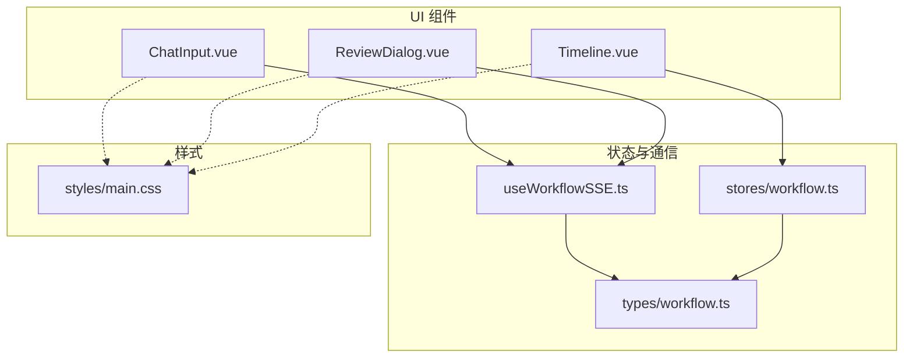
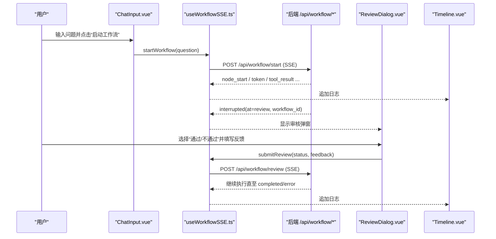
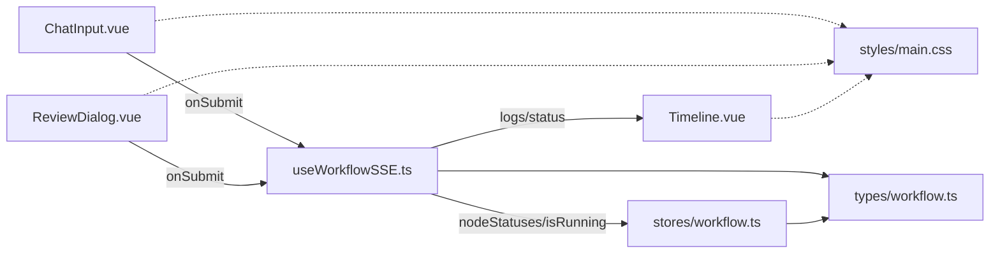

# UI 组件库

<cite>
**本文引用的文件**
- [ChatInput.vue](file://workflow-studio/frontend/src/components/panels/ChatInput.vue)
- [ReviewDialog.vue](file://workflow-studio/frontend/src/components/panels/ReviewDialog.vue)
- [Timeline.vue](file://workflow-studio/frontend/src/components/panels/Timeline.vue)
- [useWorkflowSSE.ts](file://workflow-studio/frontend/src/composables/useWorkflowSSE.ts)
- [workflow.ts（类型定义）](file://workflow-studio/frontend/src/types/workflow.ts)
- [workflow.ts（Pinia Store）](file://workflow-studio/frontend/src/stores/workflow.ts)
- [main.css](file://workflow-studio/frontend/src/styles/main.css)
- [README.md](file://workflow-studio/README.md)
</cite>

## 目录
1. [简介](#简介)
2. [项目结构](#项目结构)
3. [核心组件](#核心组件)
4. [架构总览](#架构总览)
5. [详细组件分析](#详细组件分析)
6. [依赖关系分析](#依赖关系分析)
7. [性能与可访问性](#性能与可访问性)
8. [故障排查指南](#故障排查指南)
9. [结论](#结论)
10. [附录：API 与扩展指南](#附录api-与扩展指南)

## 简介
本文件为 Workflow Studio 前端 UI 组件库的开发文档，聚焦三个关键面板组件：
- ChatInput.vue：聊天输入与提交入口，负责用户交互、基础校验与触发工作流执行。
- ReviewDialog.vue：人工审核对话框，承载业务决策流程与状态回传。
- Timeline.vue：执行日志时间线，提供数据展示、滚动控制与视觉反馈。

文档涵盖组件的 props 接口、事件发射机制、样式定制选项与主题支持，并提供使用示例、最佳实践与扩展开发指南，帮助开发者快速集成与二次开发。

## 项目结构
前端采用 Vue 3 + TypeScript + Tailwind CSS + Pinia 的组合，UI 组件集中在 components/panels 下，状态管理与 SSE 逻辑位于 composables 与 stores，类型定义集中于 types。

图表来源
- [ChatInput.vue:1-40](file://workflow-studio/frontend/src/components/panels/ChatInput.vue#L1-L40)
- [ReviewDialog.vue:1-54](file://workflow-studio/frontend/src/components/panels/ReviewDialog.vue#L1-L54)
- [Timeline.vue:1-22](file://workflow-studio/frontend/src/components/panels/Timeline.vue#L1-L22)
- [useWorkflowSSE.ts:1-172](file://workflow-studio/frontend/src/composables/useWorkflowSSE.ts#L1-L172)
- [workflow.ts（Pinia Store）:1-75](file://workflow-studio/frontend/src/stores/workflow.ts#L1-L75)
- [workflow.ts（类型定义）:1-64](file://workflow-studio/frontend/src/types/workflow.ts#L1-L64)
- [main.css:1-36](file://workflow-studio/frontend/src/styles/main.css#L1-L36)

章节来源
- [README.md:1-109](file://workflow-studio/README.md#L1-L109)

## 核心组件
本节概述三个面板组件的职责与协作方式：
- ChatInput.vue：接收用户问题，进行空白校验后通过 onSubmit 回调触发工作流启动。
- ReviewDialog.vue：在审核节点暂停时弹出，收集审核意见并通过 onSubmit(status, feedback) 回传。
- Timeline.vue：以只读列表形式展示执行日志，支持自动滚动与空态提示。

章节来源
- [ChatInput.vue:1-40](file://workflow-studio/frontend/src/components/panels/ChatInput.vue#L1-L40)
- [ReviewDialog.vue:1-54](file://workflow-studio/frontend/src/components/panels/ReviewDialog.vue#L1-L54)
- [Timeline.vue:1-22](file://workflow-studio/frontend/src/components/panels/Timeline.vue#L1-L22)

## 架构总览
整体交互链路如下：用户在 ChatInput 中输入问题并提交，调用 useWorkflowSSE.startWorkflow 发起后端 SSE 流；当工作流到达审核节点时，后端返回中断事件，前端进入等待状态并显示 ReviewDialog；用户完成审核后，调用 submitReview 继续执行；Timeline 实时渲染日志，反映各阶段状态变化。

图表来源
- [ChatInput.vue:1-40](file://workflow-studio/frontend/src/components/panels/ChatInput.vue#L1-L40)
- [useWorkflowSSE.ts:74-157](file://workflow-studio/frontend/src/composables/useWorkflowSSE.ts#L74-L157)
- [ReviewDialog.vue:1-54](file://workflow-studio/frontend/src/components/panels/ReviewDialog.vue#L1-L54)
- [Timeline.vue:1-22](file://workflow-studio/frontend/src/components/panels/Timeline.vue#L1-L22)

## 详细组件分析

### ChatInput.vue：聊天输入与消息发送
- 用户交互设计
  - 文本域 v-model 绑定 question，支持多行输入与 placeholder 引导。
  - 按钮根据 disabled 状态切换图标与文案，禁用条件包括外部传入的 disabled 与内容为空。
  - 提交时进行 trim 校验，避免空提交。
- 表单验证
  - 基础非空校验在组件内部完成；如需更复杂规则（如长度限制、敏感词过滤），可在父组件或 composable 层扩展。
- 消息发送机制
  - 通过 defineProps 暴露 onSubmit(question) 回调，由父组件接入 useWorkflowSSE.startWorkflow。
  - 提交成功后清空输入框，保持界面简洁。
- Props 接口
  - onSubmit: (question: string) => void
  - disabled: boolean
- 事件发射机制
  - 无直接 emit，采用回调模式将问题上抛给父组件。
- 样式定制与主题
  - 基于 Tailwind 原子类，可通过覆盖容器类名或使用 CSS 变量实现主题化。
  - 焦点环颜色、禁用态透明度等均可按需调整。
- 使用示例（概念说明）
  - 父组件引入 ChatInput，绑定 onSubmit 到 useWorkflowSSE.startWorkflow，并根据运行状态设置 disabled。
- 最佳实践
  - 在父组件中统一处理错误提示与加载态。
  - 对超长输入做截断或分页提示，避免阻塞渲染。
- 扩展建议
  - 增加富文本编辑器、附件上传、历史会话记忆等功能。

章节来源
- [ChatInput.vue:1-40](file://workflow-studio/frontend/src/components/panels/ChatInput.vue#L1-L40)
- [useWorkflowSSE.ts:74-114](file://workflow-studio/frontend/src/composables/useWorkflowSSE.ts#L74-L114)

### ReviewDialog.vue：审核对话框与决策流程
- 业务逻辑
  - 展示审核提示与反馈输入框。
  - “通过”直接提交空反馈，“不通过”要求必填反馈。
- 状态管理
  - 本地维护 feedback 响应式变量，提交后清空。
  - 实际运行态由 useWorkflowSSE 管理（isRunning、isInterrupted、interruptedAt）。
- 用户决策流程
  - handleApprove -> onSubmit('approved', '')
  - handleReject -> 校验反馈非空 -> onSubmit('rejected', feedback)
- Props 接口
  - onSubmit: (status: string, feedback: string) => void
- 事件发射机制
  - 通过回调将审核结果与反馈上抛至父组件，再由父组件调用 useWorkflowSSE.submitReview。
- 样式定制与主题
  - 使用 Tailwind 色板（amber/green/red），可替换为自定义主题色。
- 使用示例（概念说明）
  - 父组件监听 isInterrupted 且 interruptedAt === 'review' 时显示该对话框，并将 onSubmit 绑定到 submitReview。
- 最佳实践
  - 确保“不通过”时强制填写反馈，防止误操作。
  - 在提交前进行本地校验，减少无效网络请求。
- 扩展建议
  - 增加评分、标签、备注模板、批量审核能力。

章节来源
- [ReviewDialog.vue:1-54](file://workflow-studio/frontend/src/components/panels/ReviewDialog.vue#L1-L54)
- [useWorkflowSSE.ts:116-157](file://workflow-studio/frontend/src/composables/useWorkflowSSE.ts#L116-L157)

### Timeline.vue：执行日志时间线
- 数据展示
  - 接收 logs: string[] 数组，逐项渲染为带分隔线的条目。
  - 空态提示“暂无日志...”。
- 滚动控制
  - 容器设置最大高度与垂直滚动条，便于查看历史日志。
  - 建议在新增日志时自动滚动到底部以提升体验（可在父组件或组件内实现）。
- 视觉反馈
  - 使用等宽字体提升可读性，灰色调弱化背景干扰。
- Props 接口
  - logs: string[]
- 事件发射机制
  - 纯展示组件，无事件发射。
- 样式定制与主题
  - 基于 Tailwind 布局与颜色，可替换为深色主题或品牌色系。
- 使用示例（概念说明）
  - 父组件订阅 useWorkflowSSE.logs 或 Pinia store 的 logs，并传入 Timeline。
- 最佳实践
  - 大量日志场景下考虑虚拟滚动或分页加载。
  - 对过长日志进行截断与展开折叠。
- 扩展建议
  - 增加筛选（按节点/级别）、搜索、导出功能。

章节来源
- [Timeline.vue:1-22](file://workflow-studio/frontend/src/components/panels/Timeline.vue#L1-L22)
- [useWorkflowSSE.ts:19-72](file://workflow-studio/frontend/src/composables/useWorkflowSSE.ts#L19-L72)

## 依赖关系分析
- 组件与状态
  - ChatInput 与 ReviewDialog 通过回调与 useWorkflowSSE 通信，后者封装了 SSE 连接、事件分发与状态更新。
  - Timeline 消费 logs 数据，可由 useWorkflowSSE 或 Pinia store 提供。
- 类型契约
  - 所有组件与 composable 共享 types/workflow.ts 中的 NodeStatus、SSEEvent、GraphStructure 等类型，保证前后端与前端内部一致性。
- 样式系统
  - main.css 初始化全局样式并覆盖 Vue Flow 相关样式，组件均基于 Tailwind 构建。

图表来源
- [ChatInput.vue:1-40](file://workflow-studio/frontend/src/components/panels/ChatInput.vue#L1-L40)
- [ReviewDialog.vue:1-54](file://workflow-studio/frontend/src/components/panels/ReviewDialog.vue#L1-L54)
- [useWorkflowSSE.ts:1-172](file://workflow-studio/frontend/src/composables/useWorkflowSSE.ts#L1-L172)
- [workflow.ts（Pinia Store）:1-75](file://workflow-studio/frontend/src/stores/workflow.ts#L1-L75)
- [workflow.ts（类型定义）:1-64](file://workflow-studio/frontend/src/types/workflow.ts#L1-L64)
- [main.css:1-36](file://workflow-studio/frontend/src/styles/main.css#L1-L36)

章节来源
- [useWorkflowSSE.ts:1-172](file://workflow-studio/frontend/src/composables/useWorkflowSSE.ts#L1-L172)
- [workflow.ts（Pinia Store）:1-75](file://workflow-studio/frontend/src/stores/workflow.ts#L1-L75)
- [workflow.ts（类型定义）:1-64](file://workflow-studio/frontend/src/types/workflow.ts#L1-L64)

## 性能与可访问性
- 性能
  - Timeline 的日志列表应关注大数据量下的渲染性能，必要时引入虚拟滚动或增量更新策略。
  - SSE 流式处理已逐行解析，避免一次性大对象解析带来的卡顿。
- 可访问性
  - 按钮具备明确的语义与禁用态，建议补充 aria-label 与键盘导航支持。
  - 文本域与按钮可使用 focus-visible 增强焦点可见性。
- 主题
  - 基于 Tailwind 的语义化类名便于主题切换；可通过配置 tailwind.config.js 扩展品牌色与字体。

[本节为通用指导，不直接分析具体文件]

## 故障排查指南
- 工作流未启动或无日志
  - 检查 ChatInput 的 disabled 状态与输入是否为空。
  - 确认 useWorkflowSSE.startWorkflow 是否被正确调用，网络请求是否成功。
- 审核弹窗不出现
  - 检查后端是否返回 interrupted 事件，且 interruptedAt 是否为 review。
  - 确认父组件是否正确监听 isInterrupted 并渲染 ReviewDialog。
- 审核提交无效
  - 确认 ReviewDialog 的 onSubmit 已绑定到 useWorkflowSSE.submitReview。
  - 检查 workflowId 是否存在，否则无法提交审核。
- 日志不更新
  - 确认 SSE 事件处理函数已将日志追加到 logs。
  - 若使用 Pinia store，确保 addLog 被调用且 Timeline 订阅了最新 logs。

章节来源
- [useWorkflowSSE.ts:19-72](file://workflow-studio/frontend/src/composables/useWorkflowSSE.ts#L19-L72)
- [useWorkflowSSE.ts:74-157](file://workflow-studio/frontend/src/composables/useWorkflowSSE.ts#L74-L157)
- [workflow.ts（Pinia Store）:33-50](file://workflow-studio/frontend/src/stores/workflow.ts#L33-L50)

## 结论
ChatInput、ReviewDialog 与 Timeline 构成了 Workflow Studio 的前端交互核心：输入驱动、审核决策与执行可视化。通过统一的类型定义与 SSE 通信机制，三者协同实现了从提问到输出、再到人工介入的完整闭环。遵循本文档的接口约定与最佳实践，可快速集成并扩展更多业务能力。

[本节为总结性内容，不直接分析具体文件]

## 附录：API 与扩展指南

### 组件 Props 与回调速查
- ChatInput.vue
  - Props: onSubmit(question), disabled
  - 行为: 校验非空后调用 onSubmit，随后清空输入
- ReviewDialog.vue
  - Props: onSubmit(status, feedback)
  - 行为: 通过/不通过分别提交不同状态与反馈
- Timeline.vue
  - Props: logs(string[])
  - 行为: 展示日志列表，空态提示

章节来源
- [ChatInput.vue:22-39](file://workflow-studio/frontend/src/components/panels/ChatInput.vue#L22-L39)
- [ReviewDialog.vue:32-53](file://workflow-studio/frontend/src/components/panels/ReviewDialog.vue#L32-L53)
- [Timeline.vue:17-21](file://workflow-studio/frontend/src/components/panels/Timeline.vue#L17-L21)

### 事件与状态流转
- 启动工作流
  - ChatInput.onSubmit -> useWorkflowSSE.startWorkflow -> 后端 /api/workflow/start
  - 事件：node_start、token、tool_result、interrupted、completed、error
- 审核流程
  - ReviewDialog.onSubmit -> useWorkflowSSE.submitReview -> 后端 /api/workflow/review
  - 事件：继续执行直至 completed 或 error

章节来源
- [useWorkflowSSE.ts:74-157](file://workflow-studio/frontend/src/composables/useWorkflowSSE.ts#L74-L157)
- [workflow.ts（类型定义）:22-32](file://workflow-studio/frontend/src/types/workflow.ts#L22-L32)

### 样式与主题定制
- 全局样式
  - main.css 初始化 Tailwind 并覆盖 Vue Flow 样式，便于统一风格。
- 组件级样式
  - 组件使用 Tailwind 原子类，推荐通过主题色与间距变量进行品牌化定制。
- 建议
  - 在 tailwind.config.js 中扩展 color/font/space 等配置，集中管理主题。

章节来源
- [main.css:1-36](file://workflow-studio/frontend/src/styles/main.css#L1-L36)

### 使用示例（步骤说明）
- 在父组件中引入 ChatInput、ReviewDialog、Timeline 与 useWorkflowSSE。
- 将 ChatInput.onSubmit 绑定到 startWorkflow，并根据 isRunning 设置 disabled。
- 监听 isInterrupted 与 interruptedAt，当处于 review 时显示 ReviewDialog。
- 将 ReviewDialog.onSubmit 绑定到 submitReview。
- 将 Timeline 的 logs 绑定到 useWorkflowSSE.logs 或 store.logs。

[本节为概念性示例，不直接引用代码片段]

### 扩展开发指南
- 新增输入校验
  - 在 ChatInput 父组件或 composable 中增加规则，并在 UI 中给出即时反馈。
- 丰富审核维度
  - 在 ReviewDialog 中增加评分、标签、模板等字段，扩展 onSubmit 的数据结构。
- 日志增强
  - 在 Timeline 中增加筛选、搜索、导出与虚拟滚动，提升大数据量体验。
- 主题与国际化
  - 通过 Tailwind 主题与 i18n 插件实现多语言与多主题切换。

[本节为通用指导，不直接分析具体文件]