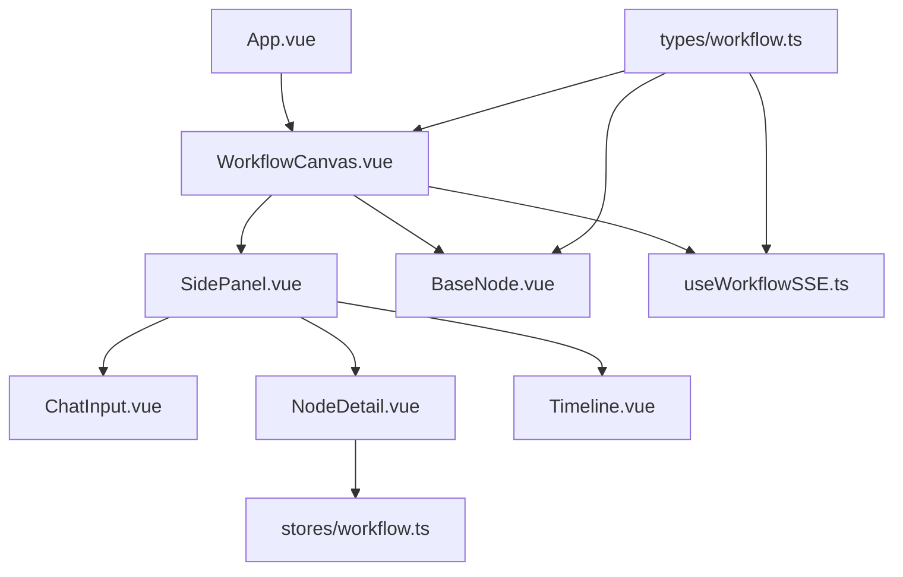
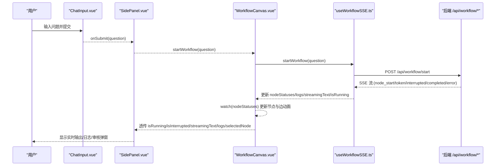
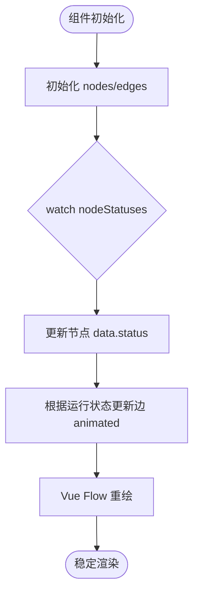
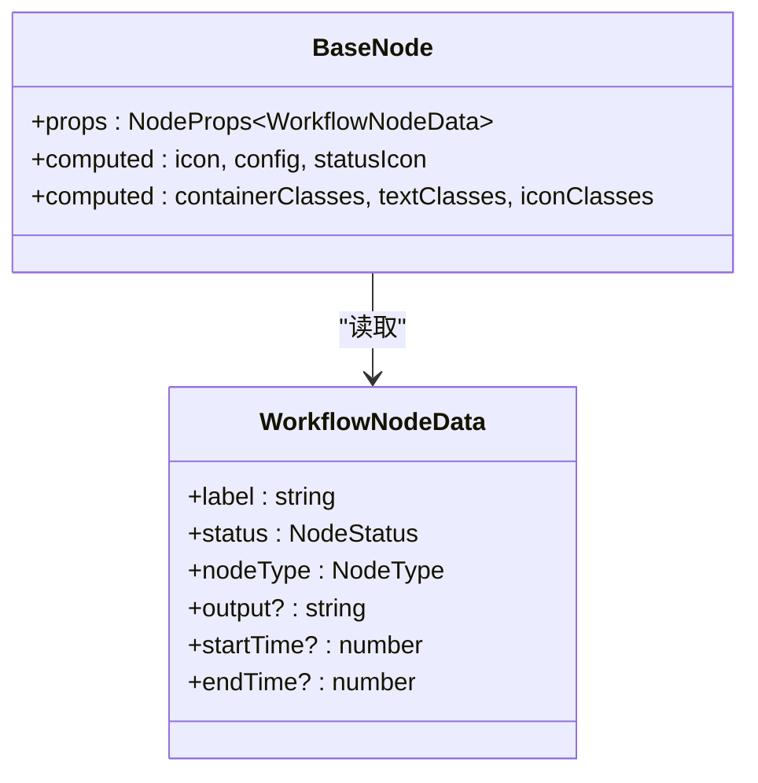
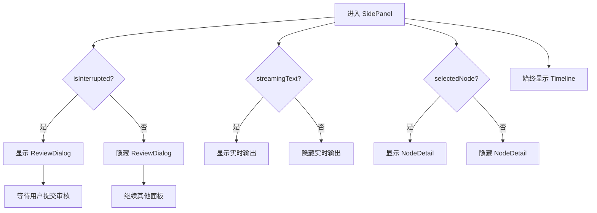
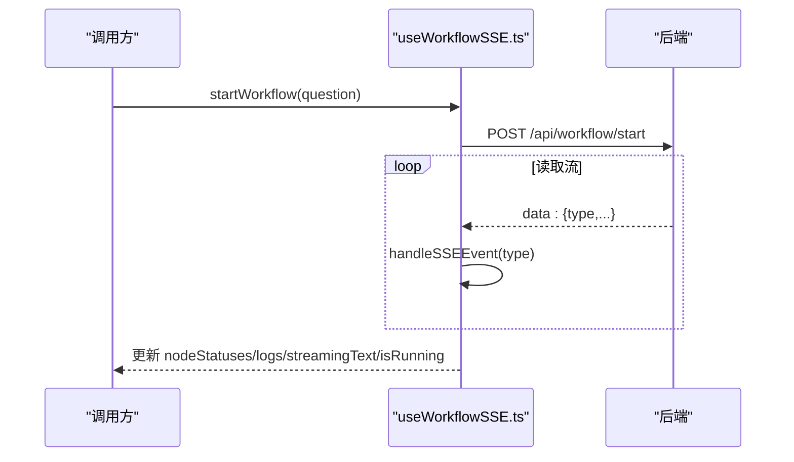
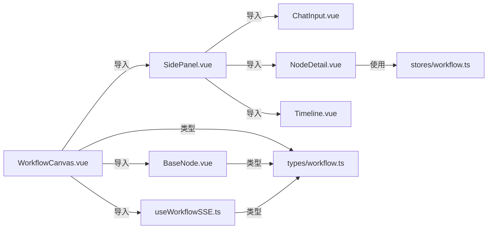

# Vue 组件架构

<cite>
**本文引用的文件**
- [WorkflowCanvas.vue](file://workflow-studio/frontend/src/components/WorkflowCanvas.vue)
- [BaseNode.vue](file://workflow-studio/frontend/src/components/nodes/BaseNode.vue)
- [SidePanel.vue](file://workflow-studio/frontend/src/components/layout/SidePanel.vue)
- [ChatInput.vue](file://workflow-studio/frontend/src/components/panels/ChatInput.vue)
- [NodeDetail.vue](file://workflow-studio/frontend/src/components/panels/NodeDetail.vue)
- [Timeline.vue](file://workflow-studio/frontend/src/components/panels/Timeline.vue)
- [useWorkflowSSE.ts](file://workflow-studio/frontend/src/composables/useWorkflowSSE.ts)
- [workflow.ts（类型定义）](file://workflow-studio/frontend/src/types/workflow.ts)
- [workflow.ts（Pinia Store）](file://workflow-studio/frontend/src/stores/workflow.ts)
- [App.vue](file://workflow-studio/frontend/src/App.vue)
</cite>

## 目录
1. [简介](#简介)
2. [项目结构](#项目结构)
3. [核心组件](#核心组件)
4. [架构总览](#架构总览)
5. [详细组件分析](#详细组件分析)
6. [依赖关系分析](#依赖关系分析)
7. [性能考虑](#性能考虑)
8. [故障排查指南](#故障排查指南)
9. [结论](#结论)
10. [附录：最佳实践与示例路径](#附录最佳实践与示例路径)

## 简介
本文件为 Workflow Studio 前端 Vue 组件架构的权威文档，聚焦以下目标：
- 深入解析主画布组件 WorkflowCanvas.vue 的设计模式、组件层次、数据流向与事件处理机制。
- 详解自定义节点 BaseNode.vue 的实现原理、状态管理与样式定制策略。
- 说明 SidePanel 布局组件的响应式布局、面板切换逻辑与用户交互处理。
- 总结组件间通信模式（props、events、provide/inject）、复用策略与性能优化技巧。
- 提供具体代码片段路径与使用最佳实践，便于快速定位与落地。

## 项目结构
前端采用按功能分层的组织方式：
- components：UI 组件（画布、节点、侧边栏、面板等）
- composables：可组合函数（如 SSE 工作流控制）
- stores：全局状态（Pinia）
- types：类型定义
- App.vue：应用入口，挂载主画布

图表来源
- [App.vue:1-10](file://workflow-studio/frontend/src/App.vue#L1-L10)
- [WorkflowCanvas.vue:1-133](file://workflow-studio/frontend/src/components/WorkflowCanvas.vue#L1-L133)
- [SidePanel.vue:1-39](file://workflow-studio/frontend/src/components/layout/SidePanel.vue#L1-L39)
- [BaseNode.vue:1-82](file://workflow-studio/frontend/src/components/nodes/BaseNode.vue#L1-L82)
- [useWorkflowSSE.ts:1-172](file://workflow-studio/frontend/src/composables/useWorkflowSSE.ts#L1-L172)
- [workflow.ts（类型定义）:1-64](file://workflow-studio/frontend/src/types/workflow.ts#L1-L64)
- [workflow.ts（Pinia Store）:1-75](file://workflow-studio/frontend/src/stores/workflow.ts#L1-L75)

章节来源
- [App.vue:1-10](file://workflow-studio/frontend/src/App.vue#L1-L10)
- [WorkflowCanvas.vue:1-133](file://workflow-studio/frontend/src/components/WorkflowCanvas.vue#L1-L133)

## 核心组件
- WorkflowCanvas.vue：基于 @vue-flow/core 的主画布容器，负责注册自定义节点、维护节点与边集合、监听 SSE 状态并驱动 UI 更新。
- BaseNode.vue：自定义节点实现，根据节点类型与执行状态动态渲染图标、边框、文字与耗时信息。
- SidePanel.vue：右侧面板聚合输入、审核弹窗、流式输出、节点详情与执行日志。
- useWorkflowSSE.ts：封装 SSE 连接、事件分发与状态管理，暴露 startWorkflow/submitReview 等方法。
- Pinia Store（workflow.ts）：集中式状态与计算属性，供子组件读取节点状态。
- 类型定义（workflow.ts）：统一 NodeStatus、NodeType、SSEEvent、GraphStructure 等类型。

章节来源
- [WorkflowCanvas.vue:1-133](file://workflow-studio/frontend/src/components/WorkflowCanvas.vue#L1-L133)
- [BaseNode.vue:1-82](file://workflow-studio/frontend/src/components/nodes/BaseNode.vue#L1-L82)
- [SidePanel.vue:1-39](file://workflow-studio/frontend/src/components/layout/SidePanel.vue#L1-L39)
- [useWorkflowSSE.ts:1-172](file://workflow-studio/frontend/src/composables/useWorkflowSSE.ts#L1-L172)
- [workflow.ts（Pinia Store）:1-75](file://workflow-studio/frontend/src/stores/workflow.ts#L1-L75)
- [workflow.ts（类型定义）:1-64](file://workflow-studio/frontend/src/types/workflow.ts#L1-L64)

## 架构总览
整体采用“画布 + 侧边面板”的双栏布局，通过 props 将运行态数据从父组件传递至子面板；SSE 事件在 composable 中统一处理，再回写至画布节点状态与边动画。

图表来源
- [ChatInput.vue:1-40](file://workflow-studio/frontend/src/components/panels/ChatInput.vue#L1-L40)
- [SidePanel.vue:1-39](file://workflow-studio/frontend/src/components/layout/SidePanel.vue#L1-L39)
- [WorkflowCanvas.vue:1-133](file://workflow-studio/frontend/src/components/WorkflowCanvas.vue#L1-L133)
- [useWorkflowSSE.ts:1-172](file://workflow-studio/frontend/src/composables/useWorkflowSSE.ts#L1-L172)

## 详细组件分析

### WorkflowCanvas.vue：主画布组件
- 设计模式
  - 组合式 API + 响应式 ref 管理 nodes/edges/selectedNodeId。
  - 通过 v-model:nodes/v-model:edges 双向绑定 Vue Flow 的数据模型。
  - 使用 markRaw 注册自定义节点类型，避免不必要的响应式开销。
- 组件层次
  - 顶层 flex 容器分为左侧画布与右侧面板。
  - 画布内嵌 Background、Controls、MiniMap 等工具。
- 数据流向
  - 初始节点与边在组件内定义，作为默认图结构。
  - useWorkflowSSE 返回的 nodeStatuses/isRunning/streamingText/logs 等状态被 watch 监听，驱动节点 data.status 与边 animated 状态更新。
- 事件处理
  - onNodeClick 捕获节点点击，设置 selectedNodeId，用于右侧面板展示节点详情。
  - 通过 SidePanel 暴露的 startWorkflow/submitReview 方法触发工作流生命周期。

图表来源
- [WorkflowCanvas.vue:50-133](file://workflow-studio/frontend/src/components/WorkflowCanvas.vue#L50-L133)

章节来源
- [WorkflowCanvas.vue:1-133](file://workflow-studio/frontend/src/components/WorkflowCanvas.vue#L1-L133)

### BaseNode.vue：自定义节点组件
- 实现原理
  - 使用 @vue-flow/core 的 Handle 组件定义入/出点（Top/Bottom）。
  - 通过 props.data.nodeType 映射图标，props.data.status 映射样式与状态图标。
  - 使用 clsx 组合 Tailwind 类名，实现不同状态的视觉反馈（边框色、背景色、文字色、动画）。
- 状态管理
  - 只读 props.data，不直接修改父级状态，保证单向数据流。
  - 计算属性派生 icon/config/statusIcon 等视图所需值。
- 样式定制
  - idle/running/completed/error/waiting 五种状态分别对应不同配色与动画。
  - 支持显示执行耗时（startTime/endTime 差值）。

图表来源
- [BaseNode.vue:1-82](file://workflow-studio/frontend/src/components/nodes/BaseNode.vue#L1-L82)
- [workflow.ts（类型定义）:10-18](file://workflow-studio/frontend/src/types/workflow.ts#L10-L18)

章节来源
- [BaseNode.vue:1-82](file://workflow-studio/frontend/src/components/nodes/BaseNode.vue#L1-L82)
- [workflow.ts（类型定义）:1-64](file://workflow-studio/frontend/src/types/workflow.ts#L1-L64)

### SidePanel.vue：侧边面板布局
- 响应式设计
  - 固定宽度 w-96，滚动区域 overflow-y-auto，适配不同屏幕高度。
- 面板切换逻辑
  - 条件渲染：isInterrupted 时显示 ReviewDialog；streamingText 存在时显示实时输出；selectedNode 存在时显示 NodeDetail；始终显示 Timeline。
- 用户交互处理
  - 接收 ChatInput 的提交回调 startWorkflow。
  - 透传 submitReview 给 ReviewDialog，用于人工审核流程。

图表来源
- [SidePanel.vue:1-39](file://workflow-studio/frontend/src/components/layout/SidePanel.vue#L1-L39)

章节来源
- [SidePanel.vue:1-39](file://workflow-studio/frontend/src/components/layout/SidePanel.vue#L1-L39)

### 子面板组件
- ChatInput.vue
  - 本地 question 状态，提交时调用 props.onSubmit 并清空输入。
  - 禁用态与加载态由父组件传入 disabled 控制。
- NodeDetail.vue
  - 通过 Pinia store 读取当前节点状态，并以不同颜色高亮显示。
- Timeline.vue
  - 以列表形式展示 logs，空态提示“暂无日志”。

章节来源
- [ChatInput.vue:1-40](file://workflow-studio/frontend/src/components/panels/ChatInput.vue#L1-L40)
- [NodeDetail.vue:1-36](file://workflow-studio/frontend/src/components/panels/NodeDetail.vue#L1-L36)
- [Timeline.vue:1-22](file://workflow-studio/frontend/src/components/panels/Timeline.vue#L1-L22)
- [workflow.ts（Pinia Store）:1-75](file://workflow-studio/frontend/src/stores/workflow.ts#L1-L75)

### 工作流与 SSE 编排（composable）
- 职责
  - 维护 nodeStatuses/logs/isRunning/isInterrupted/streamingText/workflowId 等状态。
  - 解析后端 SSE 流，分发到 handleSSEEvent，统一更新状态与日志。
  - 暴露 startWorkflow/submitReview 方法，发起请求并持续消费流。
- 事件处理
  - node_start/node_end：更新节点状态与日志。
  - token：追加 streamingText。
  - tool_result：记录工具结果摘要。
  - interrupted：暂停运行，标记中断位置，等待人工审核。
  - completed/error：结束运行或记录错误。

图表来源
- [useWorkflowSSE.ts:1-172](file://workflow-studio/frontend/src/composables/useWorkflowSSE.ts#L1-L172)

章节来源
- [useWorkflowSSE.ts:1-172](file://workflow-studio/frontend/src/composables/useWorkflowSSE.ts#L1-L172)

## 依赖关系分析
- 组件耦合
  - WorkflowCanvas 依赖 @vue-flow/core 及 SidePanel、useWorkflowSSE。
  - BaseNode 仅依赖 props.data 与类型定义，低耦合、高内聚。
  - SidePanel 聚合多个面板组件，通过 props 解耦。
- 外部依赖
  - @vue-flow/core：画布与节点系统。
  - @lucide/vue：图标库。
  - clsx：类名组合。
  - Tailwind CSS：样式体系。
- 潜在循环依赖
  - 当前无循环引用；SSE 与组件之间通过返回值与 props 单向通信。

图表来源
- [WorkflowCanvas.vue:1-133](file://workflow-studio/frontend/src/components/WorkflowCanvas.vue#L1-L133)
- [BaseNode.vue:1-82](file://workflow-studio/frontend/src/components/nodes/BaseNode.vue#L1-L82)
- [SidePanel.vue:1-39](file://workflow-studio/frontend/src/components/layout/SidePanel.vue#L1-L39)
- [useWorkflowSSE.ts:1-172](file://workflow-studio/frontend/src/composables/useWorkflowSSE.ts#L1-L172)
- [workflow.ts（类型定义）:1-64](file://workflow-studio/frontend/src/types/workflow.ts#L1-L64)
- [workflow.ts（Pinia Store）:1-75](file://workflow-studio/frontend/src/stores/workflow.ts#L1-L75)

章节来源
- [WorkflowCanvas.vue:1-133](file://workflow-studio/frontend/src/components/WorkflowCanvas.vue#L1-L133)
- [useWorkflowSSE.ts:1-172](file://workflow-studio/frontend/src/composables/useWorkflowSSE.ts#L1-L172)

## 性能考虑
- 避免不必要的响应式开销
  - 使用 markRaw 注册自定义节点类型，减少 Vue Flow 内部对组件实例的深度代理。
- 最小化重渲染
  - 仅在 watch 中按需更新 nodes.data.status 与 edges.animated，避免全量重建。
- 流式输出优化
  - streamingText 增量拼接，注意大数据时的内存占用；必要时可限制长度或分页显示。
- 计算属性与条件渲染
  - 大量条件渲染的面板（SidePanel）应确保条件判断准确，避免多余 DOM 创建。
- 网络与错误处理
  - SSE 读取异常时及时重置 isRunning 并记录日志，防止状态不一致。

[本节为通用性能建议，不直接分析具体文件]

## 故障排查指南
- 工作流未启动
  - 检查 ChatInput 是否启用（disabled=false），以及父组件是否正确传入 startWorkflow。
  - 确认后端接口 /api/workflow/start 可达且返回 SSE 流。
- 节点状态不更新
  - 检查 useWorkflowSSE 的 handleSSEEvent 是否正确分发 node_start/node_end。
  - 确认 WorkflowCanvas 的 watch(nodeStatuses) 已正确映射到 nodes[].data.status。
- 边动画不生效
  - 确认 edges.animated 的计算逻辑与 isRunning 和 nodeStatuses 关联正确。
- 审核流程卡住
  - 检查 interruptedAt 与 workflowId 是否正确设置；submitReview 是否携带正确的 workflow_id。
- 日志为空
  - 确认后端是否发送 tool_result 或 node_start/node_end 事件；检查日志追加逻辑。

章节来源
- [useWorkflowSSE.ts:19-72](file://workflow-studio/frontend/src/composables/useWorkflowSSE.ts#L19-L72)
- [WorkflowCanvas.vue:95-127](file://workflow-studio/frontend/src/components/WorkflowCanvas.vue#L95-L127)

## 结论
该架构以 WorkflowCanvas 为核心，结合 SidePanel 与 BaseNode 实现了可视化工作流的编辑与执行监控。通过 composable 统一管理 SSE 事件与状态，配合类型定义与 Pinia Store，形成清晰的数据流与职责边界。整体方案具备良好的可扩展性与可维护性，适合进一步扩展更多节点类型与交互能力。

[本节为总结性内容，不直接分析具体文件]

## 附录：最佳实践与示例路径
- 组件间通信模式
  - props：SidePanel 接收 isRunning/isInterrupted/streamingText/logs/selectedNode 等状态，以及 startWorkflow/submitReview 回调。
  - events：WorkflowCanvas 通过 onNodeClick 捕获节点点击事件，更新选中节点。
  - provide/inject：当前未使用；如需跨多层共享状态，可考虑引入 provide/inject 或继续使用 Pinia。
- 组件复用策略
  - BaseNode 通过 props.data 抽象节点内容与样式，易于扩展新节点类型。
  - SidePanel 聚合多个面板，通过条件渲染复用同一容器。
- 性能优化技巧
  - 使用 markRaw 注册节点类型。
  - 在 watch 中局部更新 nodes/edges，避免整图重建。
  - 流式文本增量更新，必要时做截断或虚拟滚动。
- 代码片段路径（便于快速定位）
  - 自定义节点注册与默认图结构：[WorkflowCanvas.vue:50-83](file://workflow-studio/frontend/src/components/WorkflowCanvas.vue#L50-L83)
  - 节点状态监听与边动画更新：[WorkflowCanvas.vue:95-127](file://workflow-studio/frontend/src/components/WorkflowCanvas.vue#L95-L127)
  - 节点点击事件处理：[WorkflowCanvas.vue:129-131](file://workflow-studio/frontend/src/components/WorkflowCanvas.vue#L129-L131)
  - 自定义节点样式与状态映射：[BaseNode.vue:33-80](file://workflow-studio/frontend/src/components/nodes/BaseNode.vue#L33-L80)
  - 侧边面板条件渲染与回调透传：[SidePanel.vue:1-39](file://workflow-studio/frontend/src/components/layout/SidePanel.vue#L1-L39)
  - SSE 事件分发与状态更新：[useWorkflowSSE.ts:19-72](file://workflow-studio/frontend/src/composables/useWorkflowSSE.ts#L19-L72)
  - 工作流启动与审核提交：[useWorkflowSSE.ts:74-157](file://workflow-studio/frontend/src/composables/useWorkflowSSE.ts#L74-L157)
  - 类型定义（NodeStatus/NodeType/SSEEvent/GraphStructure）：[workflow.ts（类型定义）:1-64](file://workflow-studio/frontend/src/types/workflow.ts#L1-L64)
  - Pinia Store 状态与方法：[workflow.ts（Pinia Store）:1-75](file://workflow-studio/frontend/src/stores/workflow.ts#L1-L75)