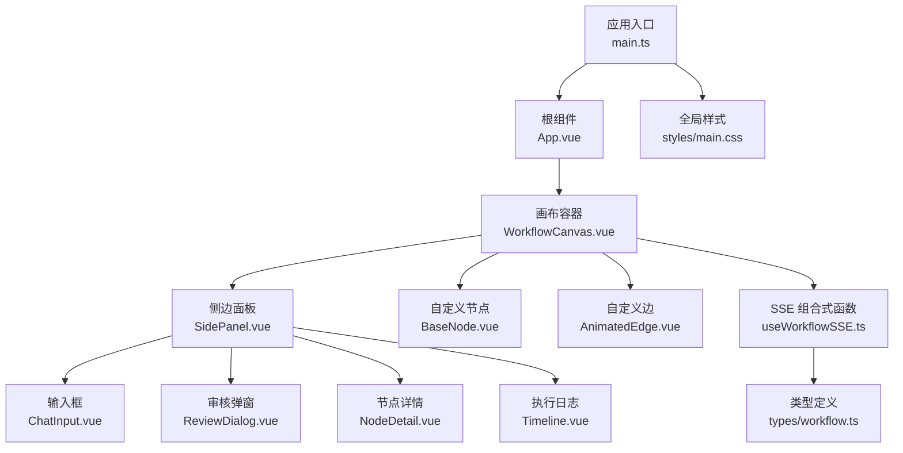
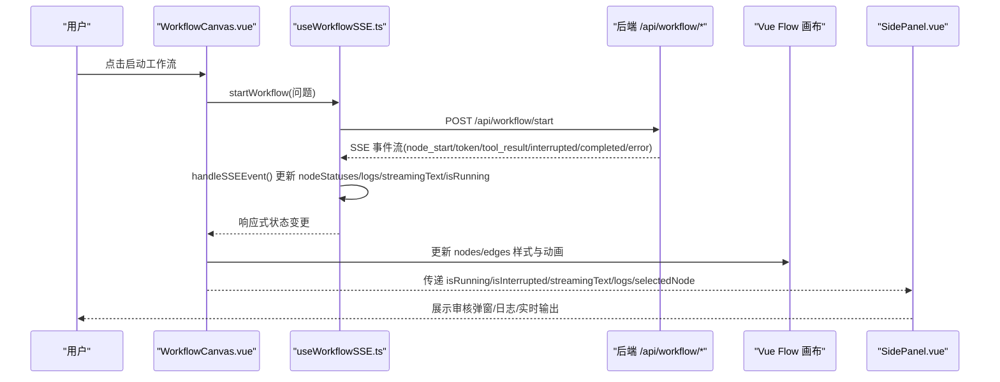
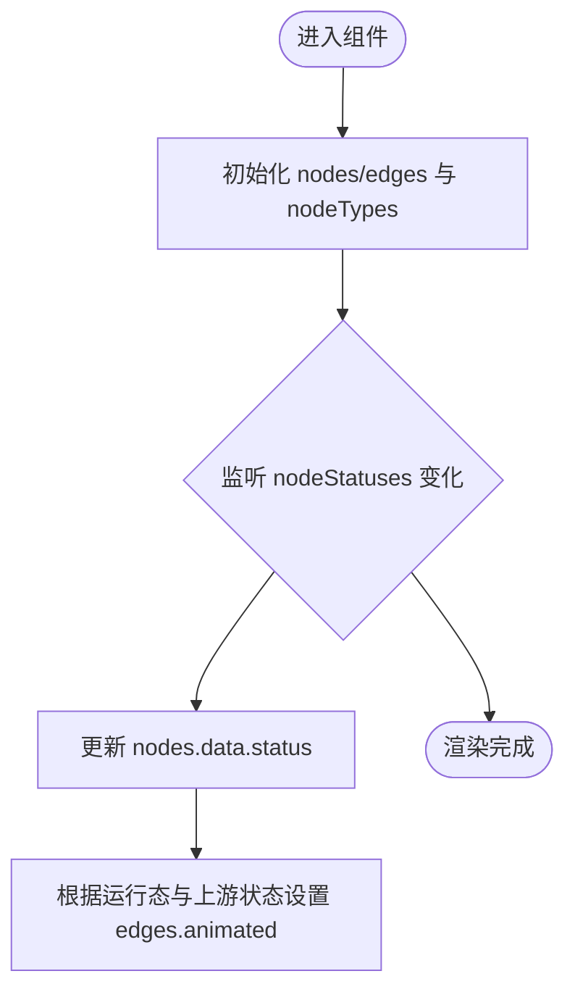
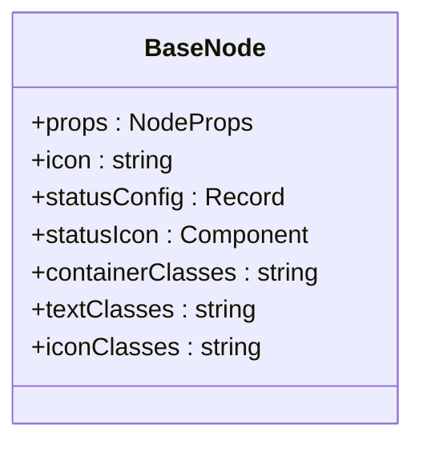
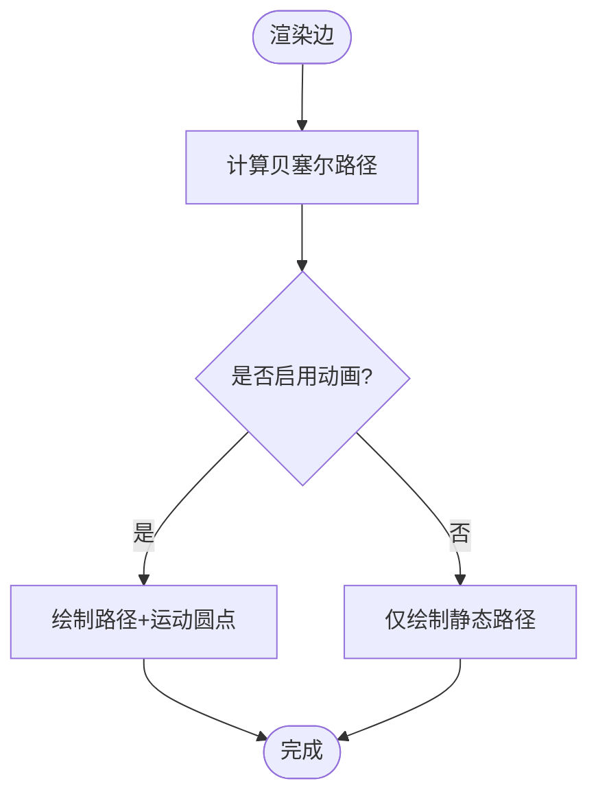
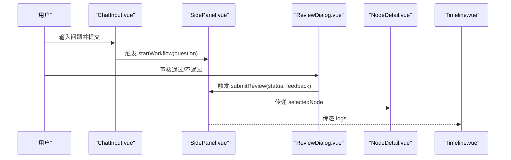
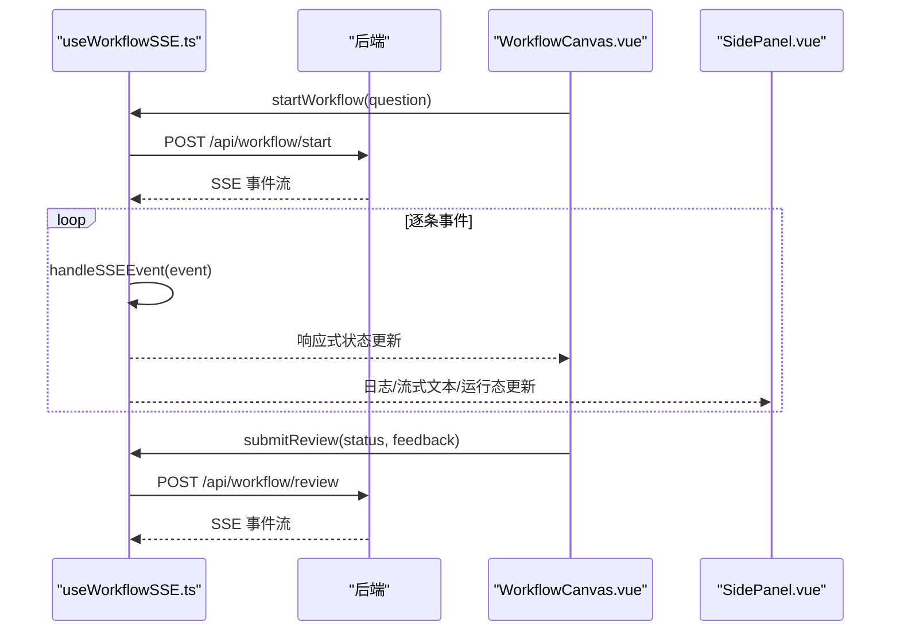
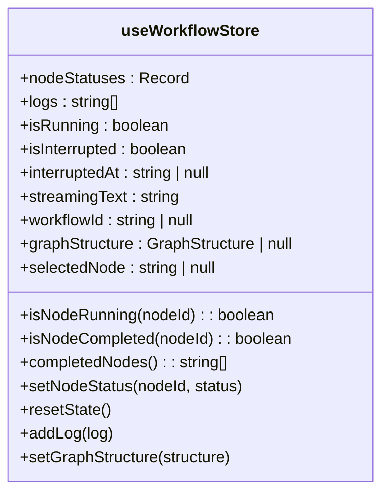
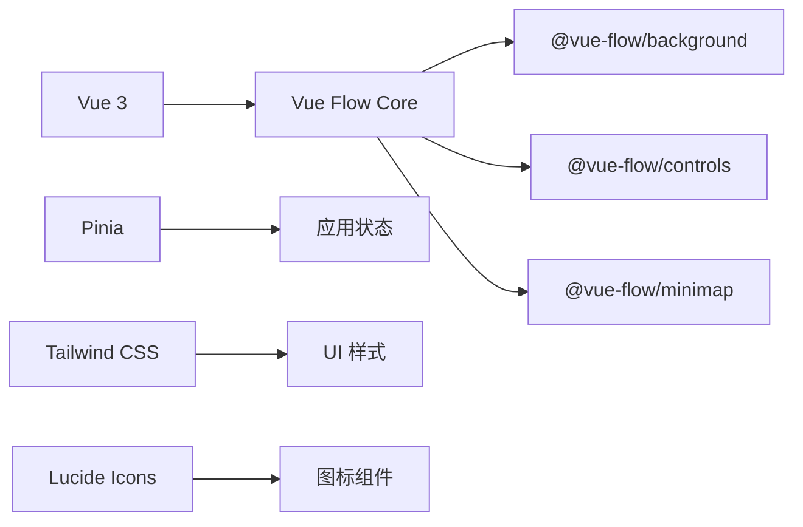

# 前端应用

<cite>
**本文引用的文件**
- [main.ts](file://frontend/src/main.ts)
- [App.vue](file://frontend/src/App.vue)
- [package.json](file://frontend/package.json)
- [workflow.ts（状态管理）](file://frontend/src/stores/workflow.ts)
- [useWorkflowSSE.ts](file://frontend/src/composables/useWorkflowSSE.ts)
- [workflow.ts（类型定义）](file://frontend/src/types/workflow.ts)
- [WorkflowCanvas.vue](file://frontend/src/components/WorkflowCanvas.vue)
- [BaseNode.vue](file://frontend/src/components/nodes/BaseNode.vue)
- [AnimatedEdge.vue](file://frontend/src/components/edges/AnimatedEdge.vue)
- [SidePanel.vue](file://frontend/src/components/layout/SidePanel.vue)
- [ChatInput.vue](file://frontend/src/components/panels/ChatInput.vue)
- [ReviewDialog.vue](file://frontend/src/components/panels/ReviewDialog.vue)
- [NodeDetail.vue](file://frontend/src/components/panels/NodeDetail.vue)
- [Timeline.vue](file://frontend/src/components/panels/Timeline.vue)
- [main.css](file://frontend/src/styles/main.css)
</cite>

## 目录
1. [简介](#简介)
2. [项目结构](#项目结构)
3. [核心组件](#核心组件)
4. [架构总览](#架构总览)
5. [详细组件分析](#详细组件分析)
6. [依赖关系分析](#依赖关系分析)
7. [性能考虑](#性能考虑)
8. [故障排查指南](#故障排查指南)
9. [结论](#结论)
10. [附录](#附录)

## 简介
本文件为 Workflow Studio 前端应用的开发文档，面向使用 Vue 3、Pinia、Vue Flow、Tailwind CSS 与 TypeScript 的团队。文档重点覆盖：
- Vue 3 组件架构与组合式函数设计
- Pinia 状态管理模式与 SSE 事件驱动的状态更新
- Vue Flow 集成与自定义节点/边实现
- 用户界面交互设计与样式系统
- 组件通信模式、类型定义、最佳实践与性能优化建议

## 项目结构
前端采用按功能域划分的目录组织方式：
- 入口与根组件：初始化应用、挂载 Pinia、引入全局样式
- 画布与布局：基于 Vue Flow 的可视化工作流画布与右侧面板
- 状态与事件：SSE 事件处理、状态管理与类型定义
- 组件库：节点、边、面板等可复用 UI 组件
- 样式：Tailwind CSS 与 Vue Flow 主题/样式覆盖

图表来源
- [main.ts:1-11](file://frontend/src/main.ts#L1-L11)
- [App.vue:1-10](file://frontend/src/App.vue#L1-L10)
- [WorkflowCanvas.vue:1-133](file://frontend/src/components/WorkflowCanvas.vue#L1-L133)
- [SidePanel.vue:1-39](file://frontend/src/components/layout/SidePanel.vue#L1-L39)
- [ChatInput.vue:1-40](file://frontend/src/components/panels/ChatInput.vue#L1-L40)
- [ReviewDialog.vue:1-54](file://frontend/src/components/panels/ReviewDialog.vue#L1-L54)
- [NodeDetail.vue:1-36](file://frontend/src/components/panels/NodeDetail.vue#L1-L36)
- [Timeline.vue:1-22](file://frontend/src/components/panels/Timeline.vue#L1-L22)
- [BaseNode.vue:1-82](file://frontend/src/components/nodes/BaseNode.vue#L1-L82)
- [AnimatedEdge.vue:1-48](file://frontend/src/components/edges/AnimatedEdge.vue#L1-L48)
- [useWorkflowSSE.ts:1-172](file://frontend/src/composables/useWorkflowSSE.ts#L1-L172)
- [workflow.ts（类型定义）:1-64](file://frontend/src/types/workflow.ts#L1-L64)
- [main.css:1-36](file://frontend/src/styles/main.css#L1-L36)

章节来源
- [main.ts:1-11](file://frontend/src/main.ts#L1-L11)
- [App.vue:1-10](file://frontend/src/App.vue#L1-L10)
- [package.json:1-32](file://frontend/package.json#L1-L32)

## 核心组件
- 应用入口与根组件
  - 初始化 Vue 应用并注册 Pinia，挂载根组件，引入全局样式
- 工作流画布
  - 基于 Vue Flow 的可视化画布，注册自定义节点类型，绑定节点与边数据，监听节点点击事件，联动右侧面板
- 侧边面板
  - 聚合输入、审核弹窗、实时输出、节点详情与执行日志，统一接收来自 SSE 的状态与日志
- 自定义节点与边
  - BaseNode：根据节点类型与状态渲染图标、边框、文字与耗时；支持连接点
  - AnimatedEdge：根据 animated 属性控制路径颜色与运动动画
- SSE 组合式函数
  - 维护运行态、中断态、流式文本、日志与节点状态；解析后端 SSE 事件并更新本地状态
- 类型定义
  - 统一节点状态、节点类型、SSE 事件、图结构等类型，确保前后端契约一致

章节来源
- [WorkflowCanvas.vue:1-133](file://frontend/src/components/WorkflowCanvas.vue#L1-L133)
- [BaseNode.vue:1-82](file://frontend/src/components/nodes/BaseNode.vue#L1-L82)
- [AnimatedEdge.vue:1-48](file://frontend/src/components/edges/AnimatedEdge.vue#L1-L48)
- [useWorkflowSSE.ts:1-172](file://frontend/src/composables/useWorkflowSSE.ts#L1-L172)
- [workflow.ts（类型定义）:1-64](file://frontend/src/types/workflow.ts#L1-L64)

## 架构总览
前端以“画布 + 面板”为核心视图，通过组合式函数订阅后端 SSE 事件，驱动节点状态与日志更新；Pinia store 提供跨组件共享状态与计算属性。

图表来源
- [WorkflowCanvas.vue:35-133](file://frontend/src/components/WorkflowCanvas.vue#L35-L133)
- [useWorkflowSSE.ts:74-157](file://frontend/src/composables/useWorkflowSSE.ts#L74-L157)
- [SidePanel.vue:1-39](file://frontend/src/components/layout/SidePanel.vue#L1-L39)

## 详细组件分析

### WorkflowCanvas 组件（画布与联动）
- 职责
  - 注册自定义节点类型，初始化节点与边，绑定 Vue Flow 事件
  - 监听 SSE 状态变化，同步节点 data.status 与边的 animated 属性
  - 将选中节点传递给 SidePanel
- 关键流程
  - 节点点击：记录 selectedNodeId
  - 深度监听 nodeStatuses：映射到 nodes[].data.status，并根据运行态与源节点状态切换边的动画
  - 监听 isRunning：在运行中且上游节点完成时启用边动画
- 与外部协作
  - 通过 useWorkflowSSE 获取运行态与操作函数
  - 通过 Tailwind 类名与 Vue Flow 默认样式组合实现视觉反馈

图表来源
- [WorkflowCanvas.vue:50-127](file://frontend/src/components/WorkflowCanvas.vue#L50-L127)

章节来源
- [WorkflowCanvas.vue:1-133](file://frontend/src/components/WorkflowCanvas.vue#L1-L133)

### BaseNode 组件（自定义节点）
- 职责
  - 根据节点类型显示图标，根据状态显示不同边框、背景与文字颜色
  - 显示执行耗时（startTime/endTime），提供上下连接点
- 设计要点
  - 使用 clsx 组合样式类，避免硬编码分支
  - 使用 Lucide 图标区分 idle/running/completed/error/waiting
- 扩展性
  - 新增 NodeType 或 NodeStatus 只需扩展映射表与样式配置

图表来源
- [BaseNode.vue:23-82](file://frontend/src/components/nodes/BaseNode.vue#L23-L82)
- [workflow.ts（类型定义）:1-64](file://frontend/src/types/workflow.ts#L1-L64)

章节来源
- [BaseNode.vue:1-82](file://frontend/src/components/nodes/BaseNode.vue#L1-L82)

### AnimatedEdge 组件（自定义边）
- 职责
  - 根据 source/target 坐标计算贝塞尔路径
  - 当 animated 为真时，绘制运动圆点沿路径循环移动
- 关键点
  - 使用 getBezierPath 计算路径
  - 通过 animateMotion 实现路径动画，颜色随状态切换

图表来源
- [AnimatedEdge.vue:16-48](file://frontend/src/components/edges/AnimatedEdge.vue#L16-L48)

章节来源
- [AnimatedEdge.vue:1-48](file://frontend/src/components/edges/AnimatedEdge.vue#L1-L48)

### SidePanel 与子面板（交互聚合）
- SidePanel
  - 聚合 ChatInput、ReviewDialog、NodeDetail、Timeline，透传运行态与回调
- ChatInput
  - 收集用户问题，调用父级传入的 onSubmit，禁用状态下显示加载态
- ReviewDialog
  - 人工审核弹窗，提交通过或不通过及反馈
- NodeDetail
  - 读取 Pinia store 中的节点状态，展示当前节点信息
- Timeline
  - 滚动展示执行日志列表

图表来源
- [SidePanel.vue:1-39](file://frontend/src/components/layout/SidePanel.vue#L1-L39)
- [ChatInput.vue:1-40](file://frontend/src/components/panels/ChatInput.vue#L1-L40)
- [ReviewDialog.vue:1-54](file://frontend/src/components/panels/ReviewDialog.vue#L1-L54)
- [NodeDetail.vue:1-36](file://frontend/src/components/panels/NodeDetail.vue#L1-L36)
- [Timeline.vue:1-22](file://frontend/src/components/panels/Timeline.vue#L1-L22)

章节来源
- [SidePanel.vue:1-39](file://frontend/src/components/layout/SidePanel.vue#L1-L39)
- [ChatInput.vue:1-40](file://frontend/src/components/panels/ChatInput.vue#L1-L40)
- [ReviewDialog.vue:1-54](file://frontend/src/components/panels/ReviewDialog.vue#L1-L54)
- [NodeDetail.vue:1-36](file://frontend/src/components/panels/NodeDetail.vue#L1-L36)
- [Timeline.vue:1-22](file://frontend/src/components/panels/Timeline.vue#L1-L22)

### SSE 事件处理机制（useWorkflowSSE）
- 职责
  - 发起工作流启动与审核提交请求，建立 SSE 流
  - 解析事件并更新 nodeStatuses、logs、streamingText、isRunning、isInterrupted、interruptedAt、workflowId
- 事件处理
  - node_start/node_end：更新节点状态与日志
  - token：追加流式文本
  - tool_result：记录工具结果摘要
  - interrupted：暂停运行，标记等待节点，记录 workflow_id
  - completed/error：结束运行并记录日志
- 错误处理
  - 网络异常或解析失败时重置运行态并记录错误日志

图表来源
- [useWorkflowSSE.ts:74-157](file://frontend/src/composables/useWorkflowSSE.ts#L74-L157)
- [WorkflowCanvas.vue:85-93](file://frontend/src/components/WorkflowCanvas.vue#L85-L93)
- [SidePanel.vue:1-39](file://frontend/src/components/layout/SidePanel.vue#L1-L39)

章节来源
- [useWorkflowSSE.ts:1-172](file://frontend/src/composables/useWorkflowSSE.ts#L1-L172)

### 状态管理（Pinia Store）
- 职责
  - 集中管理工作流相关状态：节点状态、日志、运行态、中断态、流式文本、图结构、选中节点
  - 提供计算属性判断节点运行/完成状态与已完成节点集合
  - 提供 actions 更新状态与重置
- 使用场景
  - NodeDetail 读取节点状态进行展示
  - 其他组件可按需接入 store 共享状态

图表来源
- [workflow.ts（状态管理）:1-75](file://frontend/src/stores/workflow.ts#L1-L75)
- [workflow.ts（类型定义）:1-64](file://frontend/src/types/workflow.ts#L1-L64)

章节来源
- [workflow.ts（状态管理）:1-75](file://frontend/src/stores/workflow.ts#L1-L75)
- [NodeDetail.vue:13-36](file://frontend/src/components/panels/NodeDetail.vue#L13-L36)

### 样式系统与主题
- 全局样式
  - 引入 Tailwind 基础、组件与工具类
  - 覆盖 Vue Flow 节点光标、边路径宽度与动画
- 主题与插件
  - 引入 Vue Flow 核心样式与默认主题
  - 使用 Tailwind 原子类快速构建 UI

章节来源
- [main.css:1-36](file://frontend/src/styles/main.css#L1-L36)
- [WorkflowCanvas.vue:37-43](file://frontend/src/components/WorkflowCanvas.vue#L37-L43)

## 依赖关系分析
- 运行时依赖
  - Vue 3、Vue Flow 及其插件（背景、控件、小地图）、Pinia、Lucide 图标、clsx、tailwind-merge
- 构建与开发依赖
  - Vite、TypeScript、vue-tsc、Tailwind CSS、PostCSS、Autoprefixer

图表来源
- [package.json:11-29](file://frontend/package.json#L11-L29)

章节来源
- [package.json:1-32](file://frontend/package.json#L1-L32)

## 性能考虑
- 减少不必要的重渲染
  - 对节点状态更新采用浅拷贝替换对象字段，避免整树重建
  - 使用 computed 派生样式与图标，降低模板内计算开销
- 优化边动画
  - 仅在运行中且上游节点处于 running/completed 时启用边动画，避免全量边同时动画造成卡顿
- 流式文本渲染
  - 流式追加文本时注意 DOM 更新频率，必要时可节流或分页渲染
- 资源加载
  - 按需引入 Vue Flow 插件与样式，减少打包体积
- 长列表日志
  - 日志区域使用固定高度与滚动，避免一次性渲染过多条目导致阻塞

[本节为通用性能建议，无需特定文件引用]

## 故障排查指南
- 工作流无法启动
  - 检查后端接口 /api/workflow/start 是否可达
  - 查看控制台日志与 SidePanel 日志区是否有错误提示
- SSE 事件未生效
  - 确认后端返回的数据行以 data: 开头且为合法 JSON
  - 检查 handleSSEEvent 分支是否正确匹配事件类型
- 节点状态不同步
  - 确认 WorkflowCanvas 的深度监听已触发，nodes[].data.status 已更新
  - 检查 BaseNode 的 props.data.status 是否与 store/SSE 状态一致
- 边动画异常
  - 确认 edges.animated 条件满足（运行中且上游节点状态为 running/completed）
  - 检查 Vue Flow 主题与自定义样式是否冲突
- 审核弹窗不出现
  - 确认 isInterrupted 状态由 SSE 的 interrupted 事件正确设置
  - 检查 ReviewDialog 的 onSubmit 是否被正确传递并调用

章节来源
- [useWorkflowSSE.ts:19-72](file://frontend/src/composables/useWorkflowSSE.ts#L19-L72)
- [WorkflowCanvas.vue:95-127](file://frontend/src/components/WorkflowCanvas.vue#L95-L127)
- [SidePanel.vue:1-39](file://frontend/src/components/layout/SidePanel.vue#L1-L39)

## 结论
该前端应用以 Vue Flow 为核心构建可视化工作流编辑器，结合 SSE 事件驱动实时更新节点状态与日志，配合 Pinia 统一管理状态，形成清晰的数据流与组件边界。通过自定义节点与边增强表达力，使用 Tailwind 快速构建一致的界面。建议在后续迭代中继续优化流式渲染性能、完善错误边界与测试覆盖，并逐步抽象更多可复用的节点类型。

[本节为总结性内容，无需特定文件引用]

## 附录
- 组件使用示例（路径参考）
  - 在工作流画布中注册自定义节点类型与初始节点：[WorkflowCanvas.vue:50-64](file://frontend/src/components/WorkflowCanvas.vue#L50-L64)
  - 在侧边面板中触发工作流启动与审核提交：[SidePanel.vue:1-39](file://frontend/src/components/layout/SidePanel.vue#L1-L39)
  - 在节点详情中读取 Pinia 状态：[NodeDetail.vue:13-36](file://frontend/src/components/panels/NodeDetail.vue#L13-L36)
- 最佳实践
  - 使用组合式函数封装副作用（如 SSE 流），保持组件纯净
  - 使用类型定义约束前后端契约，提升可维护性
  - 通过计算属性派生样式与状态，减少重复逻辑
- 性能优化建议
  - 合理拆分大组件，按需懒加载
  - 对高频更新的流式文本进行节流或虚拟滚动
  - 避免在模板中进行复杂计算，尽量下沉至 computed 或方法

[本节为补充说明，无需特定文件引用]