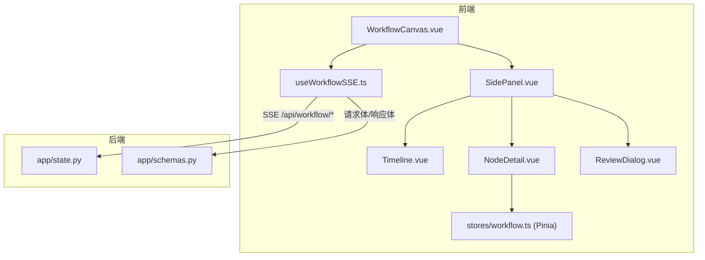
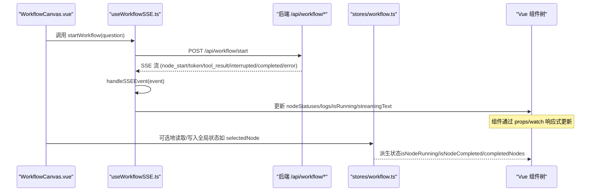
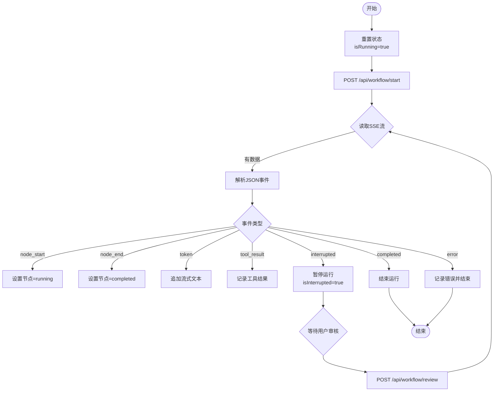
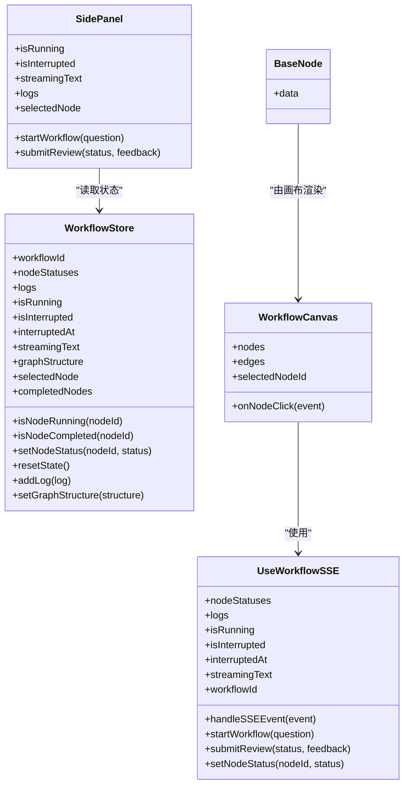
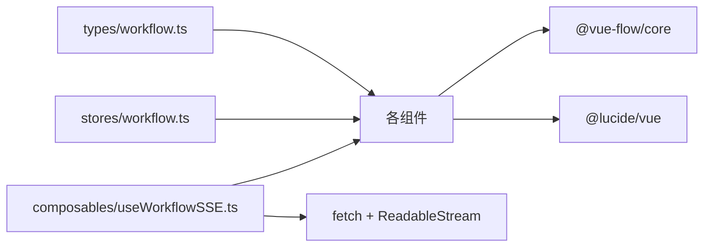

# 状态管理

<cite>
**本文引用的文件**
- [workflow.ts](file://workflow-studio/frontend/src/stores/workflow.ts)
- [workflow.ts（类型定义）](file://workflow-studio/frontend/src/types/workflow.ts)
- [useWorkflowSSE.ts](file://workflow-studio/frontend/src/composables/useWorkflowSSE.ts)
- [WorkflowCanvas.vue](file://workflow-studio/frontend/src/components/WorkflowCanvas.vue)
- [BaseNode.vue](file://workflow-studio/frontend/src/components/nodes/BaseNode.vue)
- [SidePanel.vue](file://workflow-studio/frontend/src/components/layout/SidePanel.vue)
- [NodeDetail.vue](file://workflow-studio/frontend/src/components/panels/NodeDetail.vue)
- [Timeline.vue](file://workflow-studio/frontend/src/components/panels/Timeline.vue)
- [ReviewDialog.vue](file://workflow-studio/frontend/src/components/panels/ReviewDialog.vue)
- [state.py](file://workflow-studio/backend/app/state.py)
- [schemas.py](file://workflow-studio/backend/app/schemas.py)
</cite>

## 目录
1. [简介](#简介)
2. [项目结构](#项目结构)
3. [核心组件](#核心组件)
4. [架构总览](#架构总览)
5. [详细组件分析](#详细组件分析)
6. [依赖关系分析](#依赖关系分析)
7. [性能考虑](#性能考虑)
8. [故障排查指南](#故障排查指南)
9. [结论](#结论)
10. [附录：使用示例与常见问题](#附录使用示例与常见问题)

## 简介
本文件为 Workflow Studio 的状态管理系统提供全面文档，聚焦基于 Pinia 的前端状态管理模式、工作流状态类型定义、异步事件处理、状态同步机制、组件绑定与响应式更新原理，以及状态调试、错误处理和性能优化建议。同时涵盖前后端状态契约与数据流转，帮助读者快速理解并高效使用该系统的状态管理能力。

## 项目结构
前端采用“组合式函数 + Store”的混合模式：
- 组合式函数 useWorkflowSSE 负责 SSE 事件驱动的状态变更与网络交互。
- Pinia store workflow.ts 提供全局共享状态与派生计算属性，供需要跨组件共享状态的模块使用。
- 类型定义 types/workflow.ts 统一 NodeStatus、GraphStructure、SSEEvent 等类型。
- 组件通过 props、watch 和 computed 将状态与视图绑定，实现响应式更新。

图表来源
- [WorkflowCanvas.vue:1-133](file://workflow-studio/frontend/src/components/WorkflowCanvas.vue#L1-L133)
- [useWorkflowSSE.ts:1-172](file://workflow-studio/frontend/src/composables/useWorkflowSSE.ts#L1-L172)
- [workflow.ts（类型定义）:1-64](file://workflow-studio/frontend/src/types/workflow.ts#L1-L64)
- [state.py:1-30](file://workflow-studio/backend/app/state.py#L1-L30)
- [schemas.py:1-12](file://workflow-studio/backend/app/schemas.py#L1-L12)

章节来源
- [WorkflowCanvas.vue:1-133](file://workflow-studio/frontend/src/components/WorkflowCanvas.vue#L1-L133)
- [useWorkflowSSE.ts:1-172](file://workflow-studio/frontend/src/composables/useWorkflowSSE.ts#L1-L172)
- [workflow.ts（类型定义）:1-64](file://workflow-studio/frontend/src/types/workflow.ts#L1-L64)
- [state.py:1-30](file://workflow-studio/backend/app/state.py#L1-L30)
- [schemas.py:1-12](file://workflow-studio/backend/app/schemas.py#L1-L12)

## 核心组件
- 类型定义（types/workflow.ts）
  - NodeStatus：节点执行状态枚举，包含 idle、running、completed、error、waiting。
  - NodeType：节点类型，如 plan、search、analyze、write、review、revision、output。
  - WorkflowNodeData：节点自定义数据，包含 label、status、nodeType、输出与时间戳等。
  - WorkflowNode：基于 @vue-flow/core 的 Node 泛型，承载节点数据。
  - SSEEvent：SSE 事件类型，包括 node_start、node_end、token、tool_result、interrupted、completed、error。
  - GraphStructure：图结构（nodes、edges），用于从后端加载或渲染流程图。
  - WorkflowState：工作流状态模型，描述 nodeStatuses、logs、isRunning、isInterrupted、streamingText、workflowId 等。

- 组合式函数（useWorkflowSSE.ts）
  - 维护本地响应式状态：nodeStatuses、logs、isRunning、isInterrupted、interruptedAt、streamingText、workflowId。
  - handleSSEEvent：根据事件类型更新状态（开始/完成/中断/错误/流式文本）。
  - startWorkflow：发起启动请求，读取 SSE 流并逐条解析事件。
  - submitReview：提交审核结果，继续接收 SSE 流。
  - setNodeStatus：原子更新单个节点状态。

- Pinia Store（stores/workflow.ts）
  - 暴露全局状态：workflowId、nodeStatuses、logs、isRunning、isInterrupted、interruptedAt、streamingText、graphStructure、selectedNode。
  - Getters：isNodeRunning、isNodeCompleted、completedNodes。
  - Actions：setNodeStatus、resetState、addLog、setGraphStructure。

- 组件绑定
  - WorkflowCanvas.vue：通过 watch 监听 nodeStatuses 变化，驱动节点样式与边动画；传递控制函数给 SidePanel。
  - BaseNode.vue：根据 data.status 动态渲染样式与图标。
  - SidePanel.vue：聚合输入、审核弹窗、流式输出、节点详情、日志展示。
  - NodeDetail.vue：通过 Pinia store 读取节点状态并展示。
  - Timeline.vue：展示 logs 列表。
  - ReviewDialog.vue：收集用户反馈并提交审核。

章节来源
- [workflow.ts（类型定义）:1-64](file://workflow-studio/frontend/src/types/workflow.ts#L1-L64)
- [useWorkflowSSE.ts:1-172](file://workflow-studio/frontend/src/composables/useWorkflowSSE.ts#L1-L172)
- [workflow.ts（store）:1-75](file://workflow-studio/frontend/src/stores/workflow.ts#L1-L75)
- [WorkflowCanvas.vue:1-133](file://workflow-studio/frontend/src/components/WorkflowCanvas.vue#L1-L133)
- [BaseNode.vue:1-82](file://workflow-studio/frontend/src/components/nodes/BaseNode.vue#L1-L82)
- [SidePanel.vue:1-39](file://workflow-studio/frontend/src/components/layout/SidePanel.vue#L1-L39)
- [NodeDetail.vue:1-36](file://workflow-studio/frontend/src/components/panels/NodeDetail.vue#L1-L36)
- [Timeline.vue:1-22](file://workflow-studio/frontend/src/components/panels/Timeline.vue#L1-L22)
- [ReviewDialog.vue:1-54](file://workflow-studio/frontend/src/components/panels/ReviewDialog.vue#L1-L54)

## 架构总览
下图展示了前端状态管理与后端状态契约之间的数据流：

图表来源
- [WorkflowCanvas.vue:1-133](file://workflow-studio/frontend/src/components/WorkflowCanvas.vue#L1-L133)
- [useWorkflowSSE.ts:1-172](file://workflow-studio/frontend/src/composables/useWorkflowSSE.ts#L1-L172)
- [workflow.ts（store）:1-75](file://workflow-studio/frontend/src/stores/workflow.ts#L1-L75)

## 详细组件分析

### 类型与状态设计
- NodeStatus 业务含义
  - idle：初始空闲，未开始执行。
  - running：正在执行中，通常伴随边动画与加载图标。
  - completed：执行成功结束。
  - error：执行出错，需提示并停止运行。
  - waiting：等待人工介入（如审核），处于暂停态。

- WorkflowNodeData 与 WorkflowNode
  - 承载节点标签、类型、状态、输出与耗时等信息，配合 @vue-flow/core 渲染可视化节点。

- GraphStructure
  - 描述图的节点与边，便于从后端加载或初始化画布布局。

- SSEEvent
  - 标准化事件协议，确保前端能一致处理不同阶段的事件。

章节来源
- [workflow.ts（类型定义）:1-64](file://workflow-studio/frontend/src/types/workflow.ts#L1-L64)

### 异步操作与事件处理
- 启动工作流
  - 重置本地状态，设置 isRunning=true。
  - 发起 POST /api/workflow/start，获取 Response Body Reader。
  - 逐行解码并过滤以 data: 开头的行，解析 JSON 后调用 handleSSEEvent。

- 事件处理策略
  - node_start：将对应节点状态设为 running，追加日志。
  - node_end：将节点状态设为 completed，追加日志。
  - token：拼接 streamingText，实现实时输出。
  - tool_result：截取工具结果片段记录日志。
  - interrupted：暂停运行，标记 isInterrupted=true，设置 interruptedAt，必要时将某节点置为 waiting。
  - completed：结束运行，清理中断标志。
  - error：结束运行，记录错误信息。

- 提交审核
  - 若存在 workflowId，则 POST /api/workflow/review，继续消费 SSE 流并更新状态。

图表来源
- [useWorkflowSSE.ts:1-172](file://workflow-studio/frontend/src/composables/useWorkflowSSE.ts#L1-L172)

章节来源
- [useWorkflowSSE.ts:1-172](file://workflow-studio/frontend/src/composables/useWorkflowSSE.ts#L1-L172)

### 状态同步与组件绑定
- 画布与节点
  - WorkflowCanvas.vue 通过 watch 监听 nodeStatuses 的变化，映射到 nodes.data.status，并依据 isRunning 与上游节点状态决定边的 animated。
  - BaseNode.vue 根据 data.status 动态切换边框、背景、文字颜色与图标，实现视觉反馈。

- 侧边面板
  - SidePanel.vue 聚合输入、审核弹窗、流式输出、节点详情与日志，通过 props 接收状态与回调。
  - NodeDetail.vue 通过 Pinia store 读取当前选中节点的状态并展示。
  - Timeline.vue 展示 logs 列表，支持滚动查看历史。

- 响应式更新原理
  - Vue 的 ref/computed 与 Pinia 的响应式系统保证状态变更后自动触发视图更新。
  - 通过 deep watch 监听对象变化，批量更新节点与边，减少重复渲染。

图表来源
- [workflow.ts（store）:1-75](file://workflow-studio/frontend/src/stores/workflow.ts#L1-L75)
- [useWorkflowSSE.ts:1-172](file://workflow-studio/frontend/src/composables/useWorkflowSSE.ts#L1-L172)
- [WorkflowCanvas.vue:1-133](file://workflow-studio/frontend/src/components/WorkflowCanvas.vue#L1-L133)
- [BaseNode.vue:1-82](file://workflow-studio/frontend/src/components/nodes/BaseNode.vue#L1-L82)
- [SidePanel.vue:1-39](file://workflow-studio/frontend/src/components/layout/SidePanel.vue#L1-L39)

章节来源
- [WorkflowCanvas.vue:1-133](file://workflow-studio/frontend/src/components/WorkflowCanvas.vue#L1-L133)
- [BaseNode.vue:1-82](file://workflow-studio/frontend/src/components/nodes/BaseNode.vue#L1-L82)
- [SidePanel.vue:1-39](file://workflow-studio/frontend/src/components/layout/SidePanel.vue#L1-L39)
- [NodeDetail.vue:1-36](file://workflow-studio/frontend/src/components/panels/NodeDetail.vue#L1-L36)
- [Timeline.vue:1-22](file://workflow-studio/frontend/src/components/panels/Timeline.vue#L1-L22)

### 后端状态契约
- ResearchState（后端状态模型）
  - 包含消息历史、当前步骤、迭代计数、研究内容、审核状态与元数据等字段。
  - 作为后端工作流的状态载体，与前端事件协同，确保端到端一致性。

- 请求/响应模型
  - StartRequest：包含 question。
  - ReviewRequest：包含 workflow_id、status、feedback。

章节来源
- [state.py:1-30](file://workflow-studio/backend/app/state.py#L1-L30)
- [schemas.py:1-12](file://workflow-studio/backend/app/schemas.py#L1-L12)

## 依赖关系分析
- 组件依赖
  - WorkflowCanvas.vue 依赖 useWorkflowSSE.ts 提供的状态与动作，并通过 props 传递给 SidePanel.vue。
  - BaseNode.vue 依赖 types/workflow.ts 的类型定义，确保节点数据一致性。
  - NodeDetail.vue 依赖 stores/workflow.ts 的全局状态。
  - Timeline.vue 仅依赖传入的 logs。

- 外部库
  - @vue-flow/core：提供画布、节点、边与交互能力。
  - @lucide/vue：图标库，用于状态指示。
  - clsx：条件类名拼接。

- 网络依赖
  - 使用 fetch 与 ReadableStream 消费 SSE 流，解析 data: 行并处理 JSON。

图表来源
- [workflow.ts（类型定义）:1-64](file://workflow-studio/frontend/src/types/workflow.ts#L1-L64)
- [workflow.ts（store）:1-75](file://workflow-studio/frontend/src/stores/workflow.ts#L1-L75)
- [useWorkflowSSE.ts:1-172](file://workflow-studio/frontend/src/composables/useWorkflowSSE.ts#L1-L172)

章节来源
- [workflow.ts（类型定义）:1-64](file://workflow-studio/frontend/src/types/workflow.ts#L1-L64)
- [workflow.ts（store）:1-75](file://workflow-studio/frontend/src/stores/workflow.ts#L1-L75)
- [useWorkflowSSE.ts:1-172](file://workflow-studio/frontend/src/composables/useWorkflowSSE.ts#L1-L172)

## 性能考虑
- 避免不必要的深拷贝与全量更新
  - 在 watch 中更新 nodes/edges 时，尽量只修改必要字段，减少重新渲染开销。
- 节流/防抖
  - 对高频 token 事件可考虑节流，降低 DOM 更新频率。
- 虚拟滚动
  - 当 logs 数量较大时，可使用虚拟滚动技术提升渲染性能。
- 计算属性缓存
  - 使用 computed 派生状态（如 isNodeRunning、completedNodes），避免重复计算。
- 事件批处理
  - 将多个 SSE 事件合并处理，减少多次状态更新带来的重绘。

[本节为通用性能建议，不直接分析具体文件]

## 故障排查指南
- SSE 解析失败
  - 现象：控制台出现解析错误或无日志。
  - 排查：检查后端返回格式是否为 data: JSON 行；确认 TextDecoder 与 split('\n') 逻辑正确。
  - 参考位置：[useWorkflowSSE.ts:84-114](file://workflow-studio/frontend/src/composables/useWorkflowSSE.ts#L84-L114)、[useWorkflowSSE.ts:123-156](file://workflow-studio/frontend/src/composables/useWorkflowSSE.ts#L123-L156)

- 节点状态不同步
  - 现象：节点显示状态与实际执行不一致。
  - 排查：确认 handleSSEEvent 是否正确设置 nodeStatuses；检查 WorkflowCanvas.vue 的 watch 是否深度监听。
  - 参考位置：[useWorkflowSSE.ts:19-72](file://workflow-studio/frontend/src/composables/useWorkflowSSE.ts#L19-L72)、[WorkflowCanvas.vue:96-117](file://workflow-studio/frontend/src/components/WorkflowCanvas.vue#L96-L117)

- 审核流程卡住
  - 现象：提交审核后无后续事件。
  - 排查：确认 workflowId 已设置；检查 /api/workflow/review 接口返回；验证 interruptedAt 与 isInterrupted 状态。
  - 参考位置：[useWorkflowSSE.ts:116-157](file://workflow-studio/frontend/src/composables/useWorkflowSSE.ts#L116-L157)、[ReviewDialog.vue:42-52](file://workflow-studio/frontend/src/components/panels/ReviewDialog.vue#L42-L52)

- 流式输出异常
  - 现象：streamingText 为空或乱码。
  - 排查：确认 token 事件 content 字段；检查拼接逻辑与编码。
  - 参考位置：[useWorkflowSSE.ts:35-39](file://workflow-studio/frontend/src/composables/useWorkflowSSE.ts#L35-L39)

- 状态持久化缺失
  - 现状：当前未实现持久化。
  - 建议：在 resetState 或关键状态变更处加入 localStorage/sessionStorage 或 IndexedDB 持久化；恢复时读取并回填状态。
  - 参考位置：[workflow.ts（store）:37-46](file://workflow-studio/frontend/src/stores/workflow.ts#L37-L46)

章节来源
- [useWorkflowSSE.ts:19-72](file://workflow-studio/frontend/src/composables/useWorkflowSSE.ts#L19-L72)
- [useWorkflowSSE.ts:84-114](file://workflow-studio/frontend/src/composables/useWorkflowSSE.ts#L84-L114)
- [useWorkflowSSE.ts:116-157](file://workflow-studio/frontend/src/composables/useWorkflowSSE.ts#L116-L157)
- [WorkflowCanvas.vue:96-117](file://workflow-studio/frontend/src/components/WorkflowCanvas.vue#L96-L117)
- [ReviewDialog.vue:42-52](file://workflow-studio/frontend/src/components/panels/ReviewDialog.vue#L42-L52)
- [workflow.ts（store）:37-46](file://workflow-studio/frontend/src/stores/workflow.ts#L37-L46)

## 结论
该状态管理系统通过组合式函数与 Pinia store 的协作，实现了清晰的工作流状态管理：类型定义统一了前后端契约，SSE 事件驱动保证了实时性，组件绑定与响应式更新确保了良好的用户体验。结合合理的错误处理与性能优化策略，系统具备良好的可维护性与扩展性。建议在后续版本中加入状态持久化与更完善的监控调试能力。

[本节为总结性内容，不直接分析具体文件]

## 附录：使用示例与常见问题

- 启动工作流
  - 在 WorkflowCanvas.vue 中调用 startWorkflow(question)，观察 SidePanel 中的流式输出与日志。
  - 参考位置：[WorkflowCanvas.vue:85-93](file://workflow-studio/frontend/src/components/WorkflowCanvas.vue#L85-L93)、[useWorkflowSSE.ts:74-114](file://workflow-studio/frontend/src/composables/useWorkflowSSE.ts#L74-L114)

- 人工审核
  - 当收到 interrupted 事件时，ReviewDialog 弹出，填写反馈并提交审核。
  - 参考位置：[useWorkflowSSE.ts:47-58](file://workflow-studio/frontend/src/composables/useWorkflowSSE.ts#L47-L58)、[ReviewDialog.vue:42-52](file://workflow-studio/frontend/src/components/panels/ReviewDialog.vue#L42-L52)

- 查看节点详情
  - 点击节点后，SidePanel 中的 NodeDetail 显示当前节点状态。
  - 参考位置：[WorkflowCanvas.vue:129-131](file://workflow-studio/frontend/src/components/WorkflowCanvas.vue#L129-L131)、[NodeDetail.vue:21-34](file://workflow-studio/frontend/src/components/panels/NodeDetail.vue#L21-L34)

- 常见问题解决方案
  - 问题：节点状态不更新。
    - 解决：确认 SSE 事件中包含 node_start/node_end；检查 handleSSEEvent 与 watch 逻辑。
    - 参考位置：[useWorkflowSSE.ts:19-33](file://workflow-studio/frontend/src/composables/useWorkflowSSE.ts#L19-L33)、[WorkflowCanvas.vue:96-117](file://workflow-studio/frontend/src/components/WorkflowCanvas.vue#L96-L117)
  - 问题：流式输出卡顿。
    - 解决：对 token 事件进行节流；减少 DOM 更新频率。
    - 参考位置：[useWorkflowSSE.ts:35-39](file://workflow-studio/frontend/src/composables/useWorkflowSSE.ts#L35-L39)
  - 问题：审核无法继续。
    - 解决：确认 workflowId 已设置；检查 /api/workflow/review 返回；验证 interruptedAt 与 isInterrupted。
    - 参考位置：[useWorkflowSSE.ts:116-157](file://workflow-studio/frontend/src/composables/useWorkflowSSE.ts#L116-L157)

章节来源
- [WorkflowCanvas.vue:85-93](file://workflow-studio/frontend/src/components/WorkflowCanvas.vue#L85-L93)
- [useWorkflowSSE.ts:74-114](file://workflow-studio/frontend/src/composables/useWorkflowSSE.ts#L74-L114)
- [useWorkflowSSE.ts:47-58](file://workflow-studio/frontend/src/composables/useWorkflowSSE.ts#L47-L58)
- [ReviewDialog.vue:42-52](file://workflow-studio/frontend/src/components/panels/ReviewDialog.vue#L42-L52)
- [WorkflowCanvas.vue:129-131](file://workflow-studio/frontend/src/components/WorkflowCanvas.vue#L129-L131)
- [NodeDetail.vue:21-34](file://workflow-studio/frontend/src/components/panels/NodeDetail.vue#L21-L34)
- [useWorkflowSSE.ts:19-33](file://workflow-studio/frontend/src/composables/useWorkflowSSE.ts#L19-L33)
- [WorkflowCanvas.vue:96-117](file://workflow-studio/frontend/src/components/WorkflowCanvas.vue#L96-L117)
- [useWorkflowSSE.ts:35-39](file://workflow-studio/frontend/src/composables/useWorkflowSSE.ts#L35-L39)
- [useWorkflowSSE.ts:116-157](file://workflow-studio/frontend/src/composables/useWorkflowSSE.ts#L116-L157)