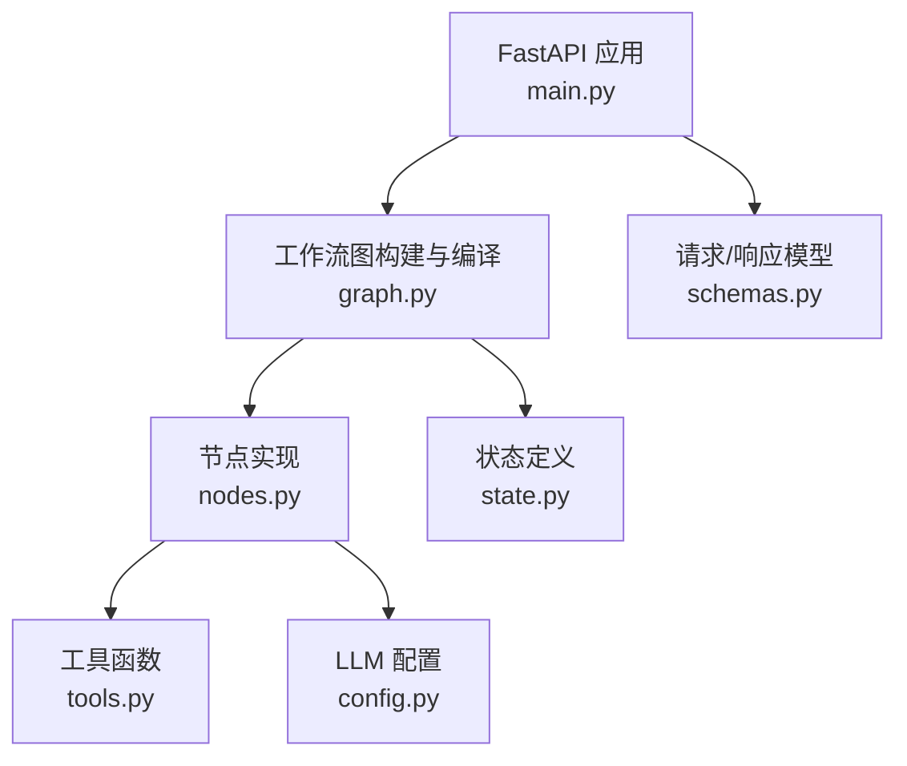
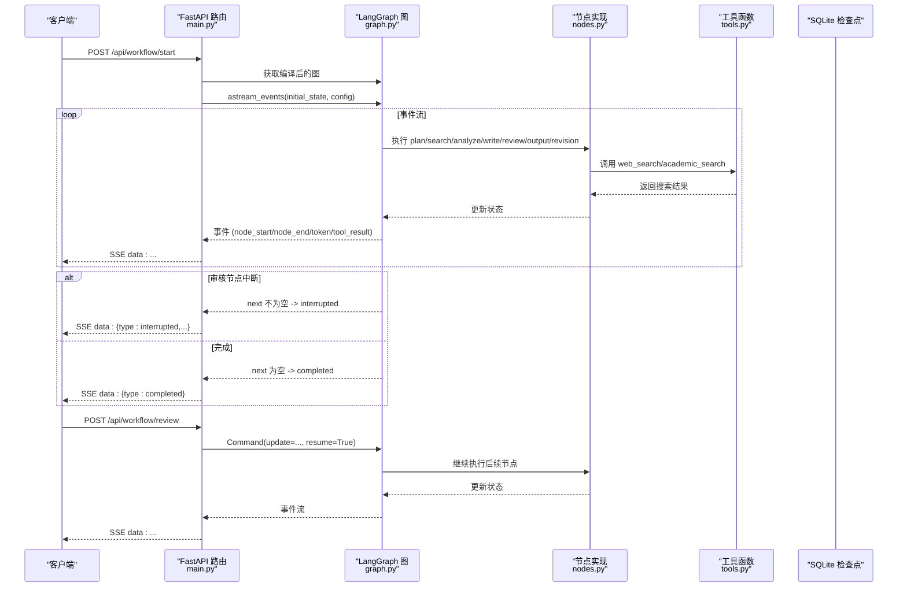
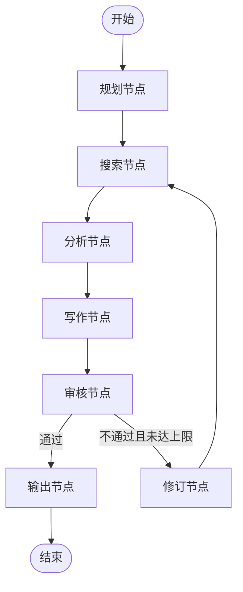
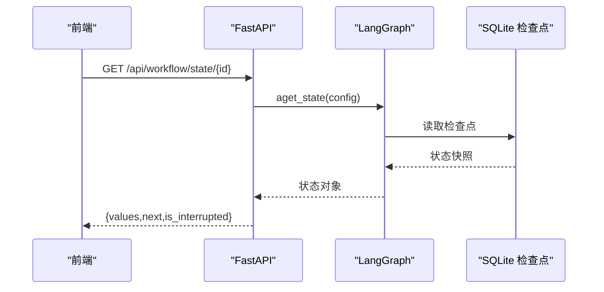
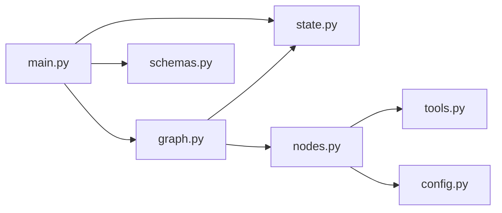

# FastAPI 应用层

<cite>
**本文引用的文件**
- [main.py](file://workflow-studio/backend/app/main.py)
- [config.py](file://workflow-studio/backend/app/config.py)
- [schemas.py](file://workflow-studio/backend/app/schemas.py)
- [graph.py](file://workflow-studio/backend/app/graph.py)
- [state.py](file://workflow-studio/backend/app/state.py)
- [nodes.py](file://workflow-studio/backend/app/nodes.py)
- [tools.py](file://workflow-studio/backend/app/tools.py)
- [README.md](file://workflow-studio/README.md)
</cite>

## 目录
1. [简介](#简介)
2. [项目结构](#项目结构)
3. [核心组件](#核心组件)
4. [架构总览](#架构总览)
5. [详细组件分析](#详细组件分析)
6. [依赖关系分析](#依赖关系分析)
7. [性能考虑](#性能考虑)
8. [故障排查指南](#故障排查指南)
9. [结论](#结论)
10. [附录：API 参考与集成示例](#附录api-参考与集成示例)

## 简介
本技术文档聚焦于后端 FastAPI 应用层，系统性地说明 API 路由设计、中间件配置（CORS）、SSE 流式事件处理、异步任务管理、异常处理策略，以及工作流启动、人工审核、状态查询、图结构获取等接口的实现逻辑。同时提供请求/响应数据模型定义、调用示例与集成指南，帮助开发者理解并扩展该服务。

## 项目结构
后端采用模块化组织：
- main.py：FastAPI 应用入口、路由、CORS、SSE 流式事件处理
- graph.py：LangGraph 工作流图构建、编译、检查点持久化
- nodes.py：各节点实现（规划、搜索、分析、写作、审核、输出、修订）
- state.py：工作流状态类型定义
- schemas.py：Pydantic 请求模型
- tools.py：工具函数（模拟搜索）
- config.py：环境变量加载与 LLM 配置

图表来源
- [main.py:14-21](file://workflow-studio/backend/app/main.py#L14-L21)
- [graph.py:23-77](file://workflow-studio/backend/app/graph.py#L23-L77)
- [nodes.py:18-128](file://workflow-studio/backend/app/nodes.py#L18-L128)
- [state.py:5-29](file://workflow-studio/backend/app/state.py#L5-L29)
- [schemas.py:4-11](file://workflow-studio/backend/app/schemas.py#L4-L11)
- [tools.py:4-25](file://workflow-studio/backend/app/tools.py#L4-L25)
- [config.py:6-8](file://workflow-studio/backend/app/config.py#L6-L8)

章节来源
- [main.py:14-21](file://workflow-studio/backend/app/main.py#L14-L21)
- [graph.py:23-77](file://workflow-studio/backend/app/graph.py#L23-L77)
- [nodes.py:18-128](file://workflow-studio/backend/app/nodes.py#L18-L128)
- [state.py:5-29](file://workflow-studio/backend/app/state.py#L5-L29)
- [schemas.py:4-11](file://workflow-studio/backend/app/schemas.py#L4-L11)
- [tools.py:4-25](file://workflow-studio/backend/app/tools.py#L4-L25)
- [config.py:6-8](file://workflow-studio/backend/app/config.py#L6-L8)

## 核心组件
- 应用与中间件
  - FastAPI 实例创建与全局配置
  - CORS 中间件允许前端跨域访问
- 工作流图与状态
  - LangGraph StateGraph 构建研究流程
  - 在审核节点前中断，支持 Human-in-the-loop
  - SQLite 检查点持久化，支持刷新恢复
- 节点与工具
  - 规划、搜索、分析、写作、审核、输出、修订节点
  - 工具函数用于模拟搜索与学术检索
- API 路由与 SSE
  - 启动工作流、提交审核、查询状态、获取图结构
  - 使用 StreamingResponse 推送事件流（node_start/node_end/token/tool_result/interrupted/completed/error）

章节来源
- [main.py:14-21](file://workflow-studio/backend/app/main.py#L14-L21)
- [graph.py:23-77](file://workflow-studio/backend/app/graph.py#L23-L77)
- [nodes.py:18-128](file://workflow-studio/backend/app/nodes.py#L18-L128)
- [tools.py:4-25](file://workflow-studio/backend/app/tools.py#L4-L25)
- [schemas.py:4-11](file://workflow-studio/backend/app/schemas.py#L4-L11)

## 架构总览
下图展示了从请求到工作流执行、再到 SSE 事件返回的整体流程，包括审核中断与恢复机制。

图表来源
- [main.py:35-103](file://workflow-studio/backend/app/main.py#L35-L103)
- [main.py:107-154](file://workflow-studio/backend/app/main.py#L107-L154)
- [graph.py:23-77](file://workflow-studio/backend/app/graph.py#L23-L77)
- [nodes.py:18-128](file://workflow-studio/backend/app/nodes.py#L18-L128)
- [tools.py:4-25](file://workflow-studio/backend/app/tools.py#L4-L25)

## 详细组件分析

### 应用与中间件（CORS）
- 应用初始化：创建 FastAPI 实例，设置标题
- CORS 中间件：允许指定前端地址，放行所有方法与头，便于本地开发联调

章节来源
- [main.py:14-21](file://workflow-studio/backend/app/main.py#L14-L21)

### 数据模型（Pydantic）
- StartRequest：包含问题文本字段
- ReviewRequest：包含工作流 ID、审核状态（通过/不通过）、反馈文本

章节来源
- [schemas.py:4-11](file://workflow-studio/backend/app/schemas.py#L4-L11)

### 状态模型（ResearchState）
- 消息历史：使用 LangGraph 内置 reducer
- 控制字段：当前步骤、迭代次数（防无限循环）
- 内容字段：原始问题、研究计划、搜索结果、分析、草稿报告、最终报告
- 审核字段：审核状态、审核反馈
- 元数据：工作流 ID、开始时间、完成时间

章节来源
- [state.py:5-29](file://workflow-studio/backend/app/state.py#L5-L29)

### 工作流图与节点
- 图构建：添加节点与边，线性流程为 plan→search→analyze→write→review；review 后条件分支至 output 或 revision；revision 回到 search；output 结束
- 中断策略：在 review 节点前中断，等待人工审核
- 检查点：使用 AsyncSqliteSaver 持久化，支持刷新恢复
- 节点职责：
  - plan_node：将问题拆解为子问题
  - search_node：对每个子问题执行搜索
  - analyze_node：综合搜索结果进行分析
  - write_node：生成研究报告草稿
  - review_node：暂停等待人工审核
  - output_node：输出最终报告
  - revision_node：根据反馈决定是否重新搜索（最多 3 轮）

图表来源
- [graph.py:23-77](file://workflow-studio/backend/app/graph.py#L23-L77)
- [nodes.py:18-128](file://workflow-studio/backend/app/nodes.py#L18-L128)

章节来源
- [graph.py:23-77](file://workflow-studio/backend/app/graph.py#L23-L77)
- [nodes.py:18-128](file://workflow-studio/backend/app/nodes.py#L18-L128)

### API 路由与 SSE 事件处理
- 启动工作流接口
  - 路径：POST /api/workflow/start
  - 输入：StartRequest
  - 行为：初始化初始状态，使用 astream_events 订阅事件，按事件类型推送 node_start/node_end/token/tool_result，结束时判断是否被中断或已完成
  - 事件流：text/event-stream，禁用缓存与代理缓冲
- 人工审核接口
  - 路径：POST /api/workflow/review
  - 输入：ReviewRequest
  - 行为：使用 Command(update=..., resume=True) 注入审核结果并恢复执行，继续推送事件流，结束后再次判断中断或完成
- 状态查询接口
  - 路径：GET /api/workflow/state/{workflow_id}
  - 行为：读取检查点状态，返回 values（过滤 messages）、next、is_interrupted；不存在时返回 404
- 图结构获取接口
  - 路径：GET /api/workflow/graph-structure
  - 行为：返回节点与边的静态结构，供前端渲染流程图

图表来源
- [main.py:158-173](file://workflow-studio/backend/app/main.py#L158-L173)
- [graph.py:65-77](file://workflow-studio/backend/app/graph.py#L65-L77)

章节来源
- [main.py:35-103](file://workflow-studio/backend/app/main.py#L35-L103)
- [main.py:107-154](file://workflow-studio/backend/app/main.py#L107-L154)
- [main.py:158-173](file://workflow-studio/backend/app/main.py#L158-L173)
- [main.py:177-199](file://workflow-studio/backend/app/main.py#L177-L199)

### 错误处理策略
- SSE 事件中的 error 类型：捕获异常并以事件形式推送，避免连接中断
- HTTP 异常：当工作流不存在时返回 404
- 建议：可在上游增加重试与超时控制，结合前端重连逻辑提升鲁棒性

章节来源
- [main.py:96-97](file://workflow-studio/backend/app/main.py#L96-L97)
- [main.py:147-148](file://workflow-studio/backend/app/main.py#L147-L148)
- [main.py:165-166](file://workflow-studio/backend/app/main.py#L165-L166)

## 依赖关系分析
- 模块耦合
  - main.py 依赖 graph.py、schemas.py、state.py
  - graph.py 依赖 nodes.py、state.py 与检查点存储
  - nodes.py 依赖 tools.py、config.py 与 state.py
- 外部依赖
  - FastAPI、LangGraph、LangChain、AsyncSqliteSaver
- 潜在风险
  - 全局图实例缓存需确保线程安全（当前为单进程同步访问）
  - 检查点文件路径与权限在生产环境需妥善配置

图表来源
- [main.py:10-12](file://workflow-studio/backend/app/main.py#L10-L12)
- [graph.py:1-8](file://workflow-studio/backend/app/graph.py#L1-L8)
- [nodes.py:1-8](file://workflow-studio/backend/app/nodes.py#L1-L8)

章节来源
- [main.py:10-12](file://workflow-studio/backend/app/main.py#L10-L12)
- [graph.py:1-8](file://workflow-studio/backend/app/graph.py#L1-L8)
- [nodes.py:1-8](file://workflow-studio/backend/app/nodes.py#L1-L8)

## 性能考虑
- 流式传输：SSE 减少首字节延迟，提升交互体验
- 检查点持久化：SQLite 适合轻量场景，生产可迁移至 PostgreSQL
- 并发与资源：
  - 长连接占用服务器资源，需合理配置反向代理与超时
  - 大模型调用可能耗时较长，建议在前端展示进度与取消能力
- 优化建议：
  - 对搜索与分析阶段进行缓存或去重
  - 限制最大迭代次数（已实现 3 轮）
  - 监控 Token 消耗与响应时间

[本节为通用指导，无需具体文件引用]

## 故障排查指南
- 常见问题
  - 工作流不存在：状态查询返回 404，请检查工作流 ID 是否正确
  - 审核未恢复：确认 review 接口传入的 workflow_id 与 start 一致
  - SSE 断连：检查网络与代理配置，确保 no-cache 与无缓冲
- 定位方法
  - 查看事件流中的 error 类型消息
  - 检查 SQLite 检查点文件是否存在与可读
  - 验证 LLM 配置与密钥

章节来源
- [main.py:165-166](file://workflow-studio/backend/app/main.py#L165-L166)
- [main.py:96-97](file://workflow-studio/backend/app/main.py#L96-L97)
- [main.py:147-148](file://workflow-studio/backend/app/main.py#L147-L148)

## 结论
该 FastAPI 应用层以 LangGraph 为核心，实现了具备中断与恢复能力的研究工作流，并通过 SSE 提供实时事件流。API 设计清晰、状态管理完善、错误处理到位，具备良好的可扩展性与可维护性。建议在生产环境中强化检查点存储、监控与限流策略，进一步提升稳定性与性能。

[本节为总结性内容，无需具体文件引用]

## 附录：API 参考与集成示例

### API 列表
- 启动工作流
  - 方法：POST
  - 路径：/api/workflow/start
  - 请求体：StartRequest（question）
  - 响应：SSE 事件流（node_start/node_end/token/tool_result/interrupted/completed/error）
- 提交审核
  - 方法：POST
  - 路径：/api/workflow/review
  - 请求体：ReviewRequest（workflow_id、status、feedback）
  - 响应：SSE 事件流（同上）
- 查询状态
  - 方法：GET
  - 路径：/api/workflow/state/{workflow_id}
  - 响应：{workflow_id, values, next, is_interrupted}
- 获取图结构
  - 方法：GET
  - 路径：/api/workflow/graph-structure
  - 响应：{nodes, edges}

章节来源
- [schemas.py:4-11](file://workflow-studio/backend/app/schemas.py#L4-L11)
- [main.py:35-103](file://workflow-studio/backend/app/main.py#L35-L103)
- [main.py:107-154](file://workflow-studio/backend/app/main.py#L107-L154)
- [main.py:158-173](file://workflow-studio/backend/app/main.py#L158-L173)
- [main.py:177-199](file://workflow-studio/backend/app/main.py#L177-L199)

### SSE 事件类型说明
- node_start：节点开始执行
- node_end：节点执行结束，附带输出摘要
- token：LLM 流式输出片段
- tool_result：工具执行结果
- interrupted：工作流在审核节点中断，等待人工审核
- completed：工作流完成
- error：发生异常，附带错误信息

章节来源
- [main.py:60-97](file://workflow-studio/backend/app/main.py#L60-L97)
- [main.py:119-148](file://workflow-studio/backend/app/main.py#L119-L148)

### 集成指南（前端）
- 建立 EventSource 连接 /api/workflow/start，监听事件并渲染节点状态
- 收到 interrupted 事件后弹出审核对话框，调用 /api/workflow/review 恢复执行
- 使用 /api/workflow/state/{workflow_id} 在页面刷新后恢复状态
- 使用 /api/workflow/graph-structure 渲染流程图

章节来源
- [README.md:23-45](file://workflow-studio/README.md#L23-L45)
- [main.py:158-199](file://workflow-studio/backend/app/main.py#L158-L199)