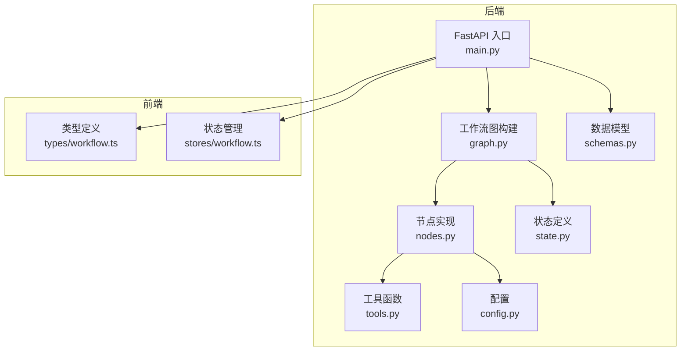
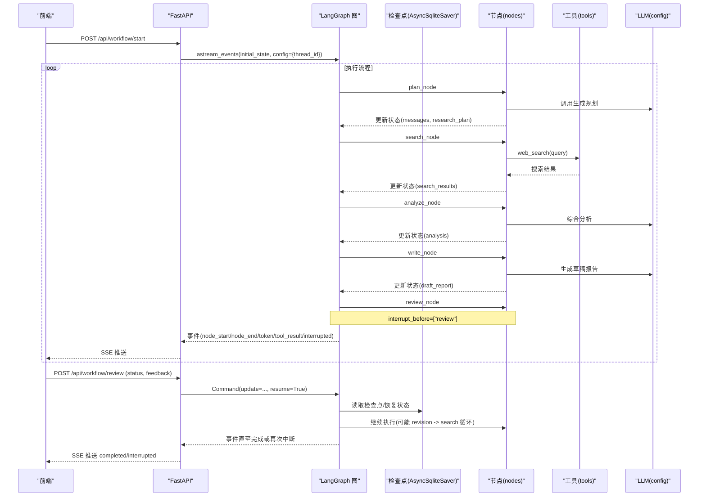
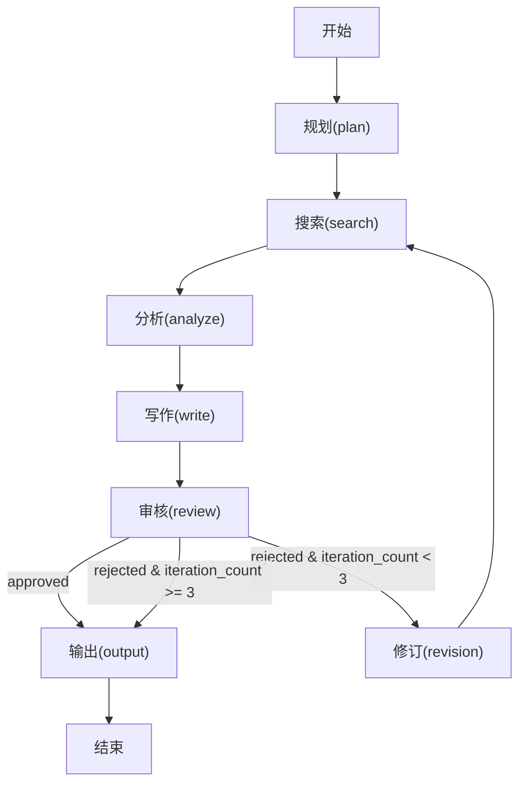
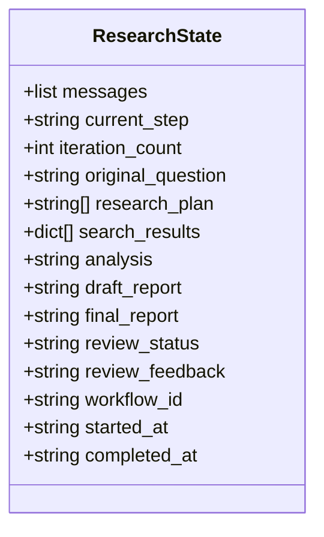
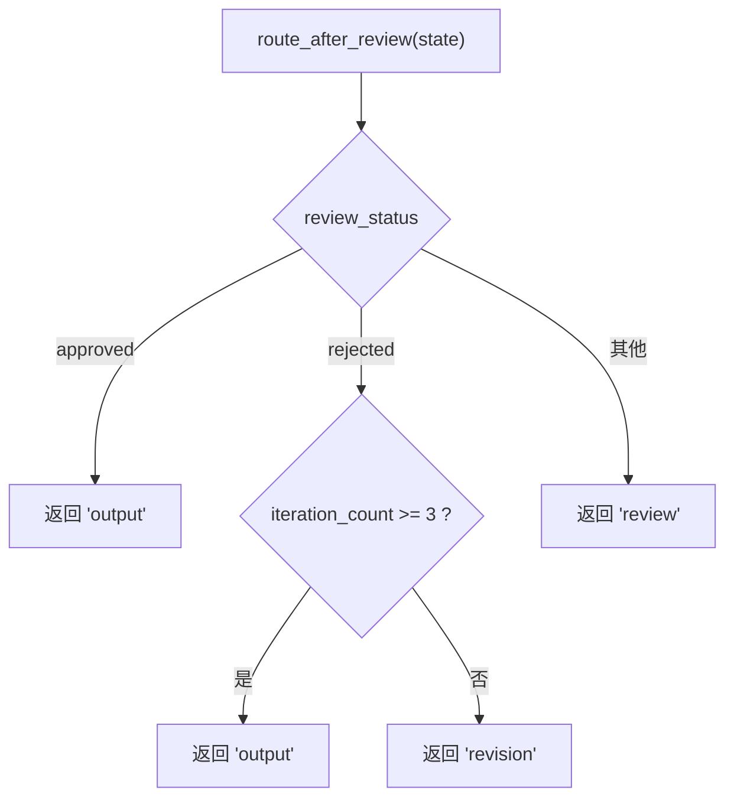
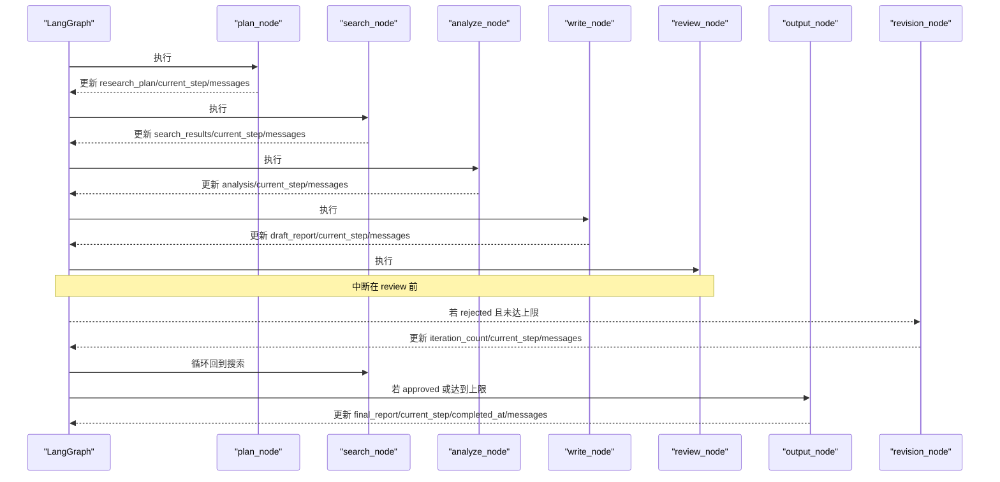
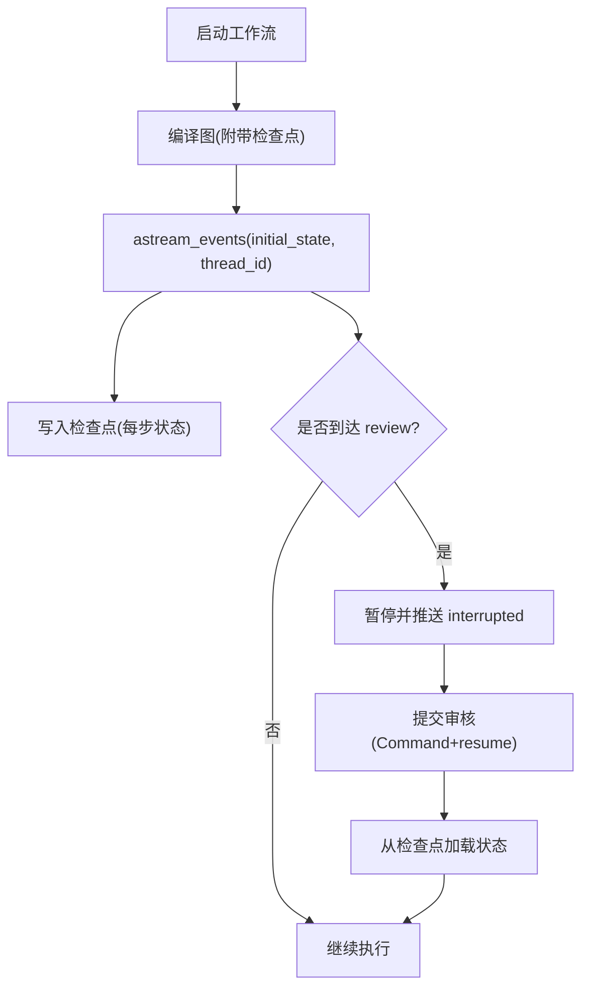
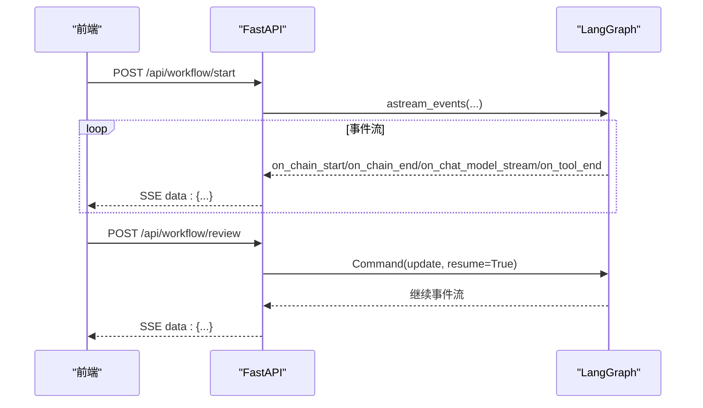
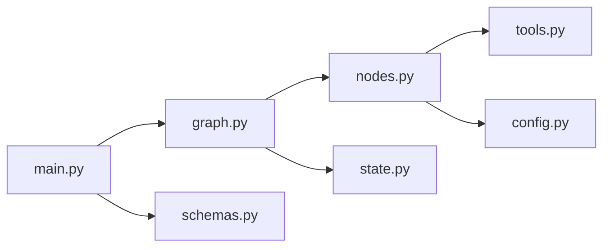

# LangGraph 工作流引擎

<cite>
**本文引用的文件**
- [README.md](file://workflow-studio/README.md)
- [graph.py](file://workflow-studio/backend/app/graph.py)
- [state.py](file://workflow-studio/backend/app/state.py)
- [nodes.py](file://workflow-studio/backend/app/nodes.py)
- [main.py](file://workflow-studio/backend/app/main.py)
- [tools.py](file://workflow-studio/backend/app/tools.py)
- [config.py](file://workflow-studio/backend/app/config.py)
- [schemas.py](file://workflow-studio/backend/app/schemas.py)
- [workflow.ts](file://workflow-studio/frontend/src/types/workflow.ts)
- [workflow store](file://workflow-studio/frontend/src/stores/workflow.ts)
</cite>

## 目录
1. [简介](#简介)
2. [项目结构](#项目结构)
3. [核心组件](#核心组件)
4. [架构总览](#架构总览)
5. [详细组件分析](#详细组件分析)
6. [依赖关系分析](#依赖关系分析)
7. [性能考量](#性能考量)
8. [故障排查指南](#故障排查指南)
9. [结论](#结论)
10. [附录](#附录)

## 简介
本项目基于 LangGraph + Vue 3 + Vue Flow 构建的可视化多 Agent 研究工作流系统。后端使用 FastAPI 暴露 API，通过 LangGraph 定义有状态的工作流图，结合 AsyncSqliteSaver 实现检查点持久化与中断恢复；前端通过 SSE 实时接收执行事件并渲染节点状态。工作流包含规划、搜索、分析、写作、审核（人工介入）、修订循环与输出等阶段，支持条件分支与最多三轮修订后强制输出的防无限循环策略。

## 项目结构
- 后端：FastAPI 入口、LangGraph 图构建、节点实现、状态定义、工具函数、配置与数据模型。
- 前端：Vue Flow 画布、类型定义、Pinia 状态管理、SSE 事件处理。

**图表来源**
- [main.py:1-200](file://workflow-studio/backend/app/main.py#L1-L200)
- [graph.py:1-78](file://workflow-studio/backend/app/graph.py#L1-L78)
- [nodes.py:1-129](file://workflow-studio/backend/app/nodes.py#L1-L129)
- [state.py:1-30](file://workflow-studio/backend/app/state.py#L1-L30)
- [tools.py:1-26](file://workflow-studio/backend/app/tools.py#L1-L26)
- [config.py:1-9](file://workflow-studio/backend/app/config.py#L1-L9)
- [schemas.py:1-12](file://workflow-studio/backend/app/schemas.py#L1-L12)
- [workflow.ts:1-64](file://workflow-studio/frontend/src/types/workflow.ts#L1-L64)
- [workflow store:1-75](file://workflow-studio/frontend/src/stores/workflow.ts#L1-L75)

**章节来源**
- [README.md:1-109](file://workflow-studio/README.md#L1-L109)

## 核心组件
- 工作流图：StateGraph 定义节点与边，含条件分支与循环，编译时附加检查点与中断点。
- 状态模型：ResearchState 描述消息历史、控制字段、研究内容、审核元数据与工作流标识。
- 节点实现：plan/search/analyze/write/review/output/revision 各节点负责具体业务逻辑与状态更新。
- API 层：启动工作流、提交审核、获取状态、获取图结构，统一通过 SSE 推送事件。
- 工具与配置：web_search/academic_search 工具，OpenAI 模型与端点配置。
- 前端类型与状态：定义节点状态、SSE 事件、图结构及 Pinia store 管理运行态。

**章节来源**
- [graph.py:23-78](file://workflow-studio/backend/app/graph.py#L23-L78)
- [state.py:5-30](file://workflow-studio/backend/app/state.py#L5-L30)
- [nodes.py:18-129](file://workflow-studio/backend/app/nodes.py#L18-L129)
- [main.py:35-200](file://workflow-studio/backend/app/main.py#L35-L200)
- [tools.py:4-26](file://workflow-studio/backend/app/tools.py#L4-L26)
- [config.py:1-9](file://workflow-studio/backend/app/config.py#L1-L9)
- [schemas.py:4-12](file://workflow-studio/backend/app/schemas.py#L4-L12)
- [workflow.ts:1-64](file://workflow-studio/frontend/src/types/workflow.ts#L1-L64)
- [workflow store:1-75](file://workflow-studio/frontend/src/stores/workflow.ts#L1-L75)

## 架构总览
后端以 FastAPI 提供 REST/SSE 接口，调用 LangGraph 编译后的图进行事件驱动的执行。图在编译时注册了检查点与中断点（审核前），支持线程隔离（thread_id）与状态持久化。前端通过 SSE 订阅事件，实时更新节点状态与流式文本。

**图表来源**
- [main.py:35-154](file://workflow-studio/backend/app/main.py#L35-L154)
- [graph.py:23-78](file://workflow-studio/backend/app/graph.py#L23-L78)
- [nodes.py:18-129](file://workflow-studio/backend/app/nodes.py#L18-L129)
- [tools.py:4-26](file://workflow-studio/backend/app/tools.py#L4-L26)
- [config.py:1-9](file://workflow-studio/backend/app/config.py#L1-L9)

## 详细组件分析

### 工作流图构建与连接关系
- 节点注册：plan、search、analyze、write、review、output、revision。
- 线性边：START→plan→search→analyze→write→review→output→END。
- 条件边：review 之后根据 route_after_review 决定 output、revision 或继续 review。
- 循环边：revision→search，形成“不通过→修订→重新搜索”的闭环。
- 编译配置：使用 AsyncSqliteSaver 作为检查点，interrupt_before=["review"] 在审核前暂停。

**图表来源**
- [graph.py:23-78](file://workflow-studio/backend/app/graph.py#L23-L78)

**章节来源**
- [graph.py:11-78](file://workflow-studio/backend/app/graph.py#L11-L78)

### ResearchState 状态类型与更新机制
- 消息历史：messages 使用 add_messages reducer，自动追加新消息。
- 控制字段：current_step 记录当前节点；iteration_count 用于防止无限循环。
- 研究内容：original_question、research_plan、search_results、analysis、draft_report、final_report。
- 审核字段：review_status（pending/approved/rejected/空）、review_feedback。
- 元数据：workflow_id、started_at、completed_at。
- 节点返回 dict 合并到状态，由 LangGraph 状态机按 reducer 规则更新。

**图表来源**
- [state.py:5-30](file://workflow-studio/backend/app/state.py#L5-L30)

**章节来源**
- [state.py:5-30](file://workflow-studio/backend/app/state.py#L5-L30)
- [nodes.py:18-129](file://workflow-studio/backend/app/nodes.py#L18-L129)

### 条件分支与循环逻辑
- 路由函数 route_after_review：
  - approved → output
  - rejected 且 iteration_count < 3 → revision
  - rejected 且 iteration_count ≥ 3 → output（强制输出）
  - 默认 → review（等待）
- 循环：revision→search，确保不通过时重新搜索与分析。

**图表来源**
- [graph.py:11-21](file://workflow-studio/backend/app/graph.py#L11-L21)

**章节来源**
- [graph.py:11-21](file://workflow-studio/backend/app/graph.py#L11-L21)

### 节点实现与状态更新
- plan_node：调用 LLM 将问题拆解为子问题，更新 research_plan、current_step、messages。
- search_node：对每个子问题调用 web_search，收集结果并更新 search_results、current_step、messages。
- analyze_node：综合搜索结果，调用 LLM 生成分析，更新 analysis、current_step、messages。
- write_node：基于分析生成草稿报告，支持上一轮反馈，更新 draft_report、current_step、messages。
- review_node：设置 review_status=pending，触发中断（interrupt_before）。
- output_node：复制 draft_report 为 final_report，标记完成时间，更新 messages。
- revision_node：递增 iteration_count，提示进入下一轮修订。

**图表来源**
- [nodes.py:18-129](file://workflow-studio/backend/app/nodes.py#L18-L129)
- [graph.py:23-78](file://workflow-studio/backend/app/graph.py#L23-L78)

**章节来源**
- [nodes.py:18-129](file://workflow-studio/backend/app/nodes.py#L18-L129)

### 检查点持久化与线程管理
- 检查点：编译时使用 AsyncSqliteSaver.from_conn_string("./checkpoints.db")，保存每一步状态，支持页面刷新后恢复。
- 线程管理：通过 config={"configurable": {"thread_id": workflow_id}} 隔离不同工作流实例的状态。
- 中断恢复：interrupt_before=["review"] 使审核前暂停；提交审核后使用 Command(update=update, resume=True) 恢复执行。

**图表来源**
- [graph.py:65-78](file://workflow-studio/backend/app/graph.py#L65-L78)
- [main.py:35-154](file://workflow-studio/backend/app/main.py#L35-L154)

**章节来源**
- [graph.py:65-78](file://workflow-studio/backend/app/graph.py#L65-L78)
- [main.py:35-154](file://workflow-studio/backend/app/main.py#L35-L154)

### 事件驱动架构与 SSE 推送
- 启动工作流：POST /api/workflow/start，返回 StreamingResponse，推送 node_start、node_end、token、tool_result、interrupted、completed、error。
- 提交审核：POST /api/workflow/review，注入 update 并 resume，继续事件流。
- 获取状态：GET /api/workflow/state/{workflow_id}，返回 values、next、is_interrupted。
- 获取图结构：GET /api/workflow/graph-structure，供前端渲染。

**图表来源**
- [main.py:35-200](file://workflow-studio/backend/app/main.py#L35-L200)

**章节来源**
- [main.py:35-200](file://workflow-studio/backend/app/main.py#L35-L200)

### 前端类型与状态管理
- 类型定义：NodeStatus、NodeType、WorkflowNodeData、SSEEvent、GraphStructure 等，规范前后端交互。
- Pinia Store：维护 workflowId、nodeStatuses、logs、isRunning、isInterrupted、interruptedAt、streamingText、graphStructure 等，并提供 setNodeStatus、resetState、addLog、setGraphStructure 等方法。

**章节来源**
- [workflow.ts:1-64](file://workflow-studio/frontend/src/types/workflow.ts#L1-L64)
- [workflow store:1-75](file://workflow-studio/frontend/src/stores/workflow.ts#L1-L75)

## 依赖关系分析
- 模块耦合：
  - main.py 依赖 graph.py、state.py、schemas.py。
  - graph.py 依赖 state.py、nodes.py。
  - nodes.py 依赖 tools.py、config.py、state.py。
- 外部依赖：
  - LangChain/LangGraph：工作流框架与消息处理。
  - OpenAI：LLM 调用。
  - AsyncSqliteSaver：检查点持久化。
- 潜在循环依赖：无直接循环，graph→nodes→tools/config/state，main→graph/state/schemas，层次清晰。

**图表来源**
- [main.py:1-200](file://workflow-studio/backend/app/main.py#L1-L200)
- [graph.py:1-78](file://workflow-studio/backend/app/graph.py#L1-L78)
- [nodes.py:1-129](file://workflow-studio/backend/app/nodes.py#L1-L129)
- [tools.py:1-26](file://workflow-studio/backend/app/tools.py#L1-L26)
- [config.py:1-9](file://workflow-studio/backend/app/config.py#L1-L9)
- [schemas.py:1-12](file://workflow-studio/backend/app/schemas.py#L1-L12)

**章节来源**
- [main.py:1-200](file://workflow-studio/backend/app/main.py#L1-L200)
- [graph.py:1-78](file://workflow-studio/backend/app/graph.py#L1-L78)
- [nodes.py:1-129](file://workflow-studio/backend/app/nodes.py#L1-L129)

## 性能考量
- 并发与流式：astream_events 与 SSE 降低首屏延迟，提升用户体验。
- 检查点粒度：每步状态写入 SQLite，兼顾恢复能力与存储开销；生产环境可替换为 PostgreSQL。
- 循环限制：iteration_count 上限避免无限循环导致的资源消耗。
- 工具调用：web_search 目前为模拟数据，实际接入真实搜索引擎时需考虑速率限制与缓存策略。
- LLM 调用：temperature 较低保证稳定性；可根据场景调整参数与重试策略。

[本节为通用指导，不直接分析具体文件]

## 故障排查指南
- 工作流不存在：GET /api/workflow/state/{workflow_id} 返回 404，检查 thread_id 是否正确。
- 审核未生效：确认 POST /api/workflow/review 传入正确的 workflow_id、status、feedback，并确保 resume=True。
- 无限循环：检查 route_after_review 中 iteration_count 判断逻辑，确保达到上限后强制输出。
- 检查点丢失：确认 checkpoints.db 存在且可写；必要时清理旧文件或迁移至数据库。
- 前端状态不同步：检查 SSE 事件类型与前端 store 的映射，确保 node_start/node_end/token 正确更新节点状态。

**章节来源**
- [main.py:158-173](file://workflow-studio/backend/app/main.py#L158-L173)
- [graph.py:11-21](file://workflow-studio/backend/app/graph.py#L11-L21)
- [graph.py:65-78](file://workflow-studio/backend/app/graph.py#L65-L78)

## 结论
该工作流引擎以 LangGraph 为核心，结合 FastAPI 与 SSE 实现了事件驱动的可视化研究工作流。通过状态机设计、条件分支与循环、检查点持久化与中断恢复，提供了稳定且可扩展的多 Agent 协作流程。开发者可基于现有节点与状态扩展新的业务能力，并通过前端类型与 store 保持前后端一致性。

[本节为总结性内容，不直接分析具体文件]

## 附录
- 快速开始：参考 README 中的后端与前端启动步骤。
- 扩展指南：
  - 新增节点：在 nodes.py 实现异步函数，返回状态更新 dict；在 graph.py 添加节点与边。
  - 自定义路由：修改 route_after_review 或新增条件边。
  - 持久化切换：替换 AsyncSqliteSaver 为其他 checkpointer。
  - 工具集成：在 tools.py 接入真实搜索服务，并在 search_node 中调用。
- 最佳实践：
  - 明确状态字段语义，避免歧义。
  - 合理使用 reducer（如 add_messages）管理消息历史。
  - 设置合理的迭代上限与超时策略。
  - 在生产环境启用日志与监控，跟踪节点耗时与 Token 消耗。

**章节来源**
- [README.md:23-109](file://workflow-studio/README.md#L23-L109)
- [nodes.py:18-129](file://workflow-studio/backend/app/nodes.py#L18-L129)
- [graph.py:23-78](file://workflow-studio/backend/app/graph.py#L23-L78)
- [tools.py:4-26](file://workflow-studio/backend/app/tools.py#L4-L26)