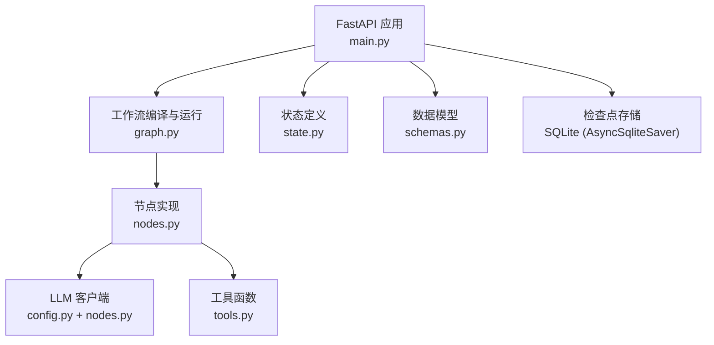
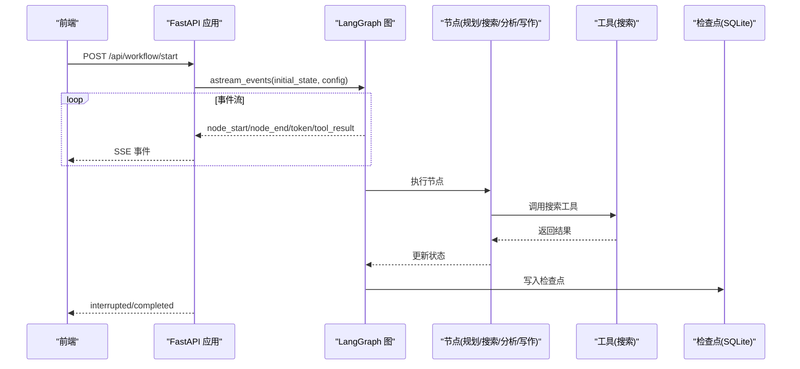
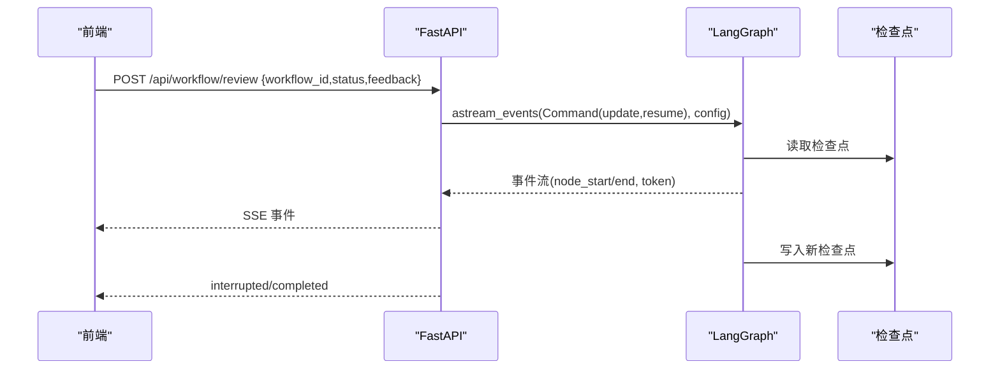
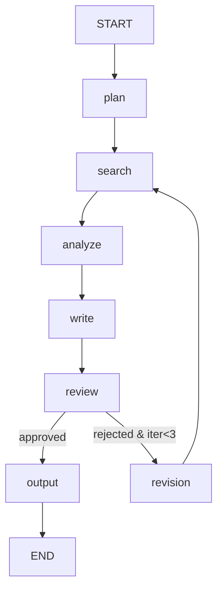
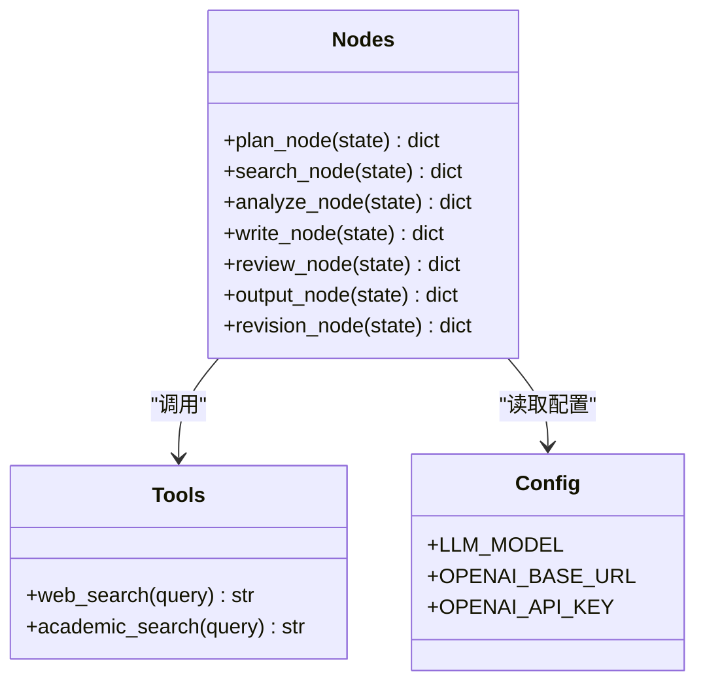
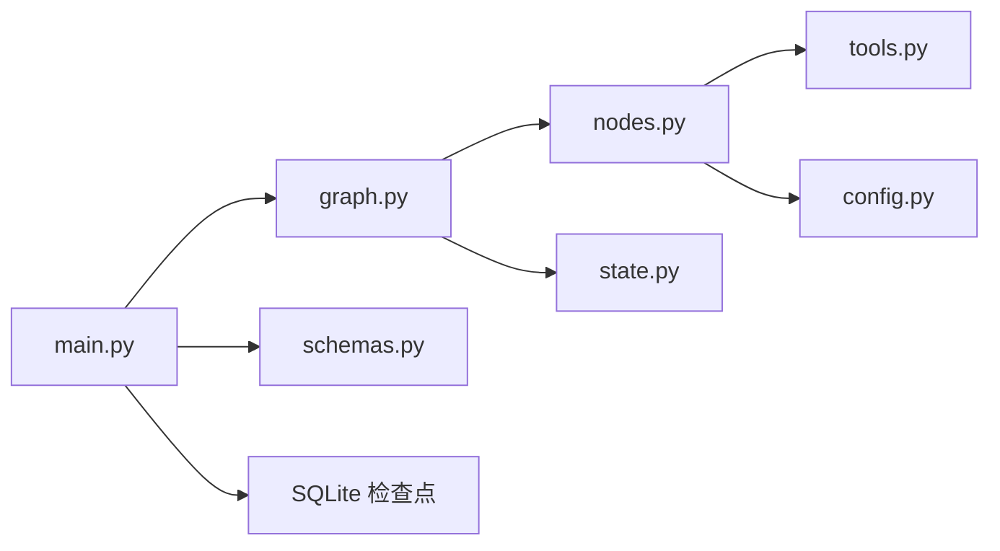

# 后端服务

<cite>
**本文引用的文件**
- [main.py](file://workflow-studio/backend/app/main.py)
- [graph.py](file://workflow-studio/backend/app/graph.py)
- [nodes.py](file://workflow-studio/backend/app/nodes.py)
- [state.py](file://workflow-studio/backend/app/state.py)
- [tools.py](file://workflow-studio/backend/app/tools.py)
- [config.py](file://workflow-studio/backend/app/config.py)
- [schemas.py](file://workflow-studio/backend/app/schemas.py)
- [README.md](file://workflow-studio/README.md)
- [requirements.txt](file://workflow-studio/backend/requirements.txt)
</cite>

## 目录
1. [简介](#简介)
2. [项目结构](#项目结构)
3. [核心组件](#核心组件)
4. [架构总览](#架构总览)
5. [详细组件分析](#详细组件分析)
6. [依赖关系分析](#依赖关系分析)
7. [性能与可扩展性](#性能与可扩展性)
8. [故障排查指南](#故障排查指南)
9. [结论](#结论)
10. [附录：API 接口规范与数据模型](#附录api-接口规范与数据模型)

## 简介
本技术文档面向 Workflow Studio 后端服务，聚焦于 FastAPI 应用层设计、LangGraph 工作流引擎实现、节点定义与执行逻辑、状态管理、工具系统集成、配置管理方案，以及 API 接口规范、数据模型与错误处理策略。文档旨在帮助开发者快速理解并扩展后端功能，提供清晰的架构图、流程图和调用时序图，便于定位问题与优化性能。

## 项目结构
后端采用模块化组织方式，按职责划分：
- 应用入口与路由：FastAPI 应用、CORS、SSE 事件流、REST 接口
- 工作流定义：LangGraph StateGraph 构建、条件路由、检查点持久化
- 节点实现：规划、搜索、分析、写作、审核、修订、输出等节点
- 状态定义：TypedDict 描述工作流状态字段与类型约束
- 工具集成：搜索工具（模拟），可替换为真实搜索引擎
- 配置管理：环境变量加载与 LLM 参数配置
- 数据模型：Pydantic 请求体校验

图表来源
- [main.py:14-21](file://workflow-studio/backend/app/main.py#L14-L21)
- [graph.py:23-77](file://workflow-studio/backend/app/graph.py#L23-L77)
- [nodes.py:18-129](file://workflow-studio/backend/app/nodes.py#L18-L129)
- [state.py:5-30](file://workflow-studio/backend/app/state.py#L5-L30)
- [tools.py:4-26](file://workflow-studio/backend/app/tools.py#L4-L26)
- [config.py:1-9](file://workflow-studio/backend/app/config.py#L1-L9)

章节来源
- [README.md:15-90](file://workflow-studio/README.md#L15-L90)
- [requirements.txt:1-10](file://workflow-studio/backend/requirements.txt#L1-L10)

## 核心组件
- FastAPI 应用层：提供 REST 接口与 SSE 事件流，负责启动工作流、提交审核、查询状态、获取图结构等。
- LangGraph 工作流：基于 StateGraph 构建线性流程与条件分支，支持中断恢复与检查点持久化。
- 节点模块：每个节点封装单一职责，使用 LLM 与工具完成具体任务，更新状态并推进流程。
- 状态管理：TypedDict 定义强类型状态，结合消息累加器与迭代计数控制循环。
- 工具系统：声明式工具装饰器，便于在节点中调用；当前为模拟实现，易于替换为真实搜索服务。
- 配置管理：通过 dotenv 加载环境变量，集中管理 LLM 模型、基地址与密钥。

章节来源
- [main.py:34-200](file://workflow-studio/backend/app/main.py#L34-L200)
- [graph.py:23-77](file://workflow-studio/backend/app/graph.py#L23-L77)
- [nodes.py:18-129](file://workflow-studio/backend/app/nodes.py#L18-L129)
- [state.py:5-30](file://workflow-studio/backend/app/state.py#L5-L30)
- [tools.py:4-26](file://workflow-studio/backend/app/tools.py#L4-L26)
- [config.py:1-9](file://workflow-studio/backend/app/config.py#L1-L9)

## 架构总览
后端以 FastAPI 作为 HTTP 网关，暴露 REST 接口并通过 SSE 推送实时事件。工作流由 LangGraph 驱动，节点间通过状态传递数据，关键节点（审核）前暂停等待人工输入。检查点机制确保刷新页面后可恢复执行进度。

图表来源
- [main.py:34-103](file://workflow-studio/backend/app/main.py#L34-L103)
- [graph.py:23-77](file://workflow-studio/backend/app/graph.py#L23-L77)
- [nodes.py:18-129](file://workflow-studio/backend/app/nodes.py#L18-L129)
- [tools.py:4-26](file://workflow-studio/backend/app/tools.py#L4-L26)

## 详细组件分析

### FastAPI 应用层（main.py）
- 启动工作流接口：接收研究问题，初始化初始状态，生成 workflow_id，使用 LangGraph 的 astream_events 推送节点开始/结束、LLM token、工具结果等事件，并在结束时判断是否被中断或完成。
- 提交审核接口：使用 Command(update=update, resume=True) 注入审核结果并恢复执行，继续事件流推送。
- 状态查询接口：根据 workflow_id 获取当前状态，过滤敏感字段（如 messages），返回 next 节点列表与中断标志。
- 图结构接口：返回静态节点与边信息供前端渲染。

图表来源
- [main.py:106-154](file://workflow-studio/backend/app/main.py#L106-L154)
- [graph.py:65-77](file://workflow-studio/backend/app/graph.py#L65-L77)

章节来源
- [main.py:34-200](file://workflow-studio/backend/app/main.py#L34-L200)

### LangGraph 工作流（graph.py）
- 构建图：定义 StateGraph，添加节点与边，设置条件路由（审核后分支）。
- 条件路由：根据 review_status 与 iteration_count 决定输出、修订或继续审核，防止无限循环。
- 编译与检查点：使用 AsyncSqliteSaver 持久化检查点，interrupt_before=["review"] 在审核节点前暂停。

图表来源
- [graph.py:23-62](file://workflow-studio/backend/app/graph.py#L23-L62)

章节来源
- [graph.py:11-77](file://workflow-studio/backend/app/graph.py#L11-L77)

### 节点实现（nodes.py）
- plan_node：将用户问题拆解为子问题，返回研究计划与消息。
- search_node：对每个子问题调用 web_search 工具，收集结果。
- analyze_node：综合搜索结果进行分析，生成结构化分析内容。
- write_node：基于分析与反馈撰写研究报告草稿。
- review_node：标记审核状态为 pending，等待人工输入。
- output_node：输出最终报告并记录完成时间。
- revision_node：增加迭代计数，触发重新搜索。

图表来源
- [nodes.py:18-129](file://workflow-studio/backend/app/nodes.py#L18-L129)
- [tools.py:4-26](file://workflow-studio/backend/app/tools.py#L4-L26)
- [config.py:1-9](file://workflow-studio/backend/app/config.py#L1-L9)

章节来源
- [nodes.py:18-129](file://workflow-studio/backend/app/nodes.py#L18-L129)

### 状态管理（state.py）
- TypedDict 定义完整状态字段，包括消息历史、工作流控制、研究内容、人工审核、元数据。
- 使用 add_messages 注解实现消息累加，iteration_count 用于防循环控制。

章节来源
- [state.py:5-30](file://workflow-studio/backend/app/state.py#L5-L30)

### 工具系统集成（tools.py）
- 使用 @tool 装饰器声明工具，当前为模拟实现，返回固定文本片段。
- 可替换为真实搜索引擎（如 Tavily/SerpAPI/Bing Search），保持接口一致。

章节来源
- [tools.py:4-26](file://workflow-studio/backend/app/tools.py#L4-L26)

### 配置管理（config.py）
- 通过 dotenv 加载环境变量，集中管理 OPENAI_API_KEY、OPENAI_BASE_URL、LLM_MODEL。
- 节点与 LLM 客户端统一从配置读取，便于多环境部署。

章节来源
- [config.py:1-9](file://workflow-studio/backend/app/config.py#L1-L9)

## 依赖关系分析
- FastAPI 依赖 langgraph、langchain-openai、sqlite 检查点、uvicorn、sse-starlette、httpx、python-dotenv。
- 应用层依赖工作流定义、节点实现、状态定义、工具函数与配置。
- 节点依赖 LLM 客户端与工具函数，工具函数可独立替换。

图表来源
- [requirements.txt:1-10](file://workflow-studio/backend/requirements.txt#L1-L10)
- [main.py:10-12](file://workflow-studio/backend/app/main.py#L10-L12)
- [graph.py:1-8](file://workflow-studio/backend/app/graph.py#L1-L8)
- [nodes.py:1-8](file://workflow-studio/backend/app/nodes.py#L1-L8)

章节来源
- [requirements.txt:1-10](file://workflow-studio/backend/requirements.txt#L1-L10)

## 性能与可扩展性
- 异步执行：FastAPI 与 LangGraph 均支持异步，提升并发处理能力。
- 事件流：SSE 推送减少轮询开销，提升前端响应速度。
- 检查点：SQLite 持久化避免重复计算，支持刷新恢复。
- 防循环：iteration_count 限制修订次数，防止无限循环导致资源耗尽。
- 可扩展：工具函数可替换为真实搜索服务；节点可并行化（需调整图结构）；检查点可迁移至 PostgreSQL 提升吞吐。

[本节为通用指导，不直接分析具体文件]

## 故障排查指南
- 工作流不存在：查询状态时若未找到对应 workflow_id，返回 404。
- 审核未恢复：提交审核后若仍返回 interrupted，检查 next 节点是否为 review 且状态是否正确更新。
- LLM 调用失败：检查 OPENAI_API_KEY 与 BASE_URL 配置，确认网络连通性与配额。
- 工具返回异常：当前为模拟实现，若替换为真实服务，需确保返回格式一致。
- 检查点损坏：删除 checkpoints.db 后重启服务，从头重建。

章节来源
- [main.py:158-173](file://workflow-studio/backend/app/main.py#L158-L173)
- [config.py:1-9](file://workflow-studio/backend/app/config.py#L1-L9)
- [tools.py:4-26](file://workflow-studio/backend/app/tools.py#L4-L26)

## 结论
Workflow Studio 后端基于 FastAPI 与 LangGraph 构建了可视化、可中断、可恢复的研究工作流。通过模块化设计、强类型状态管理与检查点持久化，实现了高内聚、低耦合的系统架构。开发者可轻松扩展节点与工具，适配更多业务场景。

[本节为总结，不直接分析具体文件]

## 附录：API 接口规范与数据模型

### REST 接口
- POST /api/workflow/start
  - 请求体：StartRequest（question）
  - 响应：SSE 事件流（node_start/node_end/token/tool_result/interrupted/completed/error）
- POST /api/workflow/review
  - 请求体：ReviewRequest（workflow_id, status, feedback）
  - 响应：SSE 事件流（同上）
- GET /api/workflow/state/{workflow_id}
  - 响应：{workflow_id, values, next, is_interrupted}
- GET /api/workflow/graph-structure
  - 响应：{nodes, edges}

章节来源
- [main.py:34-200](file://workflow-studio/backend/app/main.py#L34-L200)

### 数据模型
- StartRequest：包含 question 字段
- ReviewRequest：包含 workflow_id、status（approved/rejected）、feedback（可选）
- ResearchState：包含消息历史、工作流控制、研究内容、审核状态、元数据等字段

章节来源
- [schemas.py:4-12](file://workflow-studio/backend/app/schemas.py#L4-L12)
- [state.py:5-30](file://workflow-studio/backend/app/state.py#L5-L30)