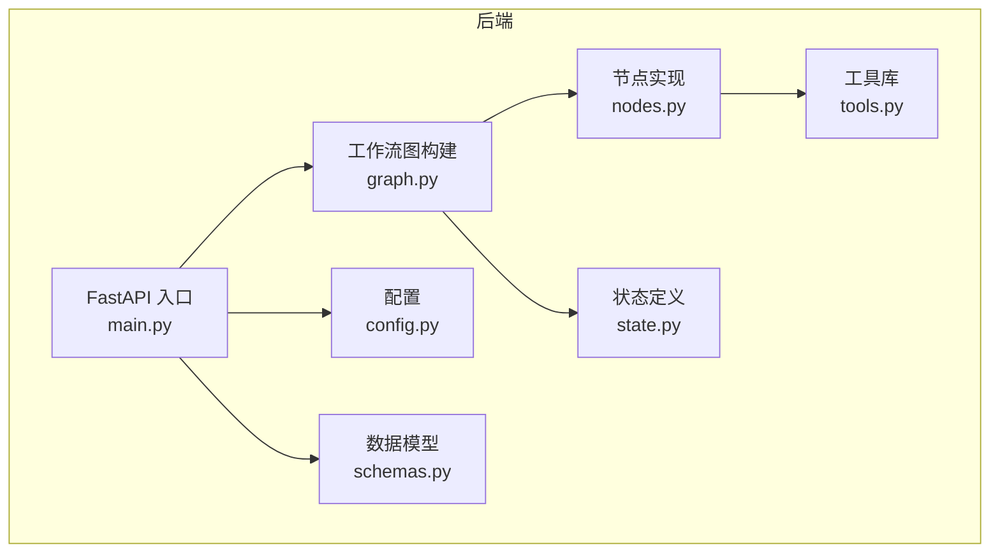
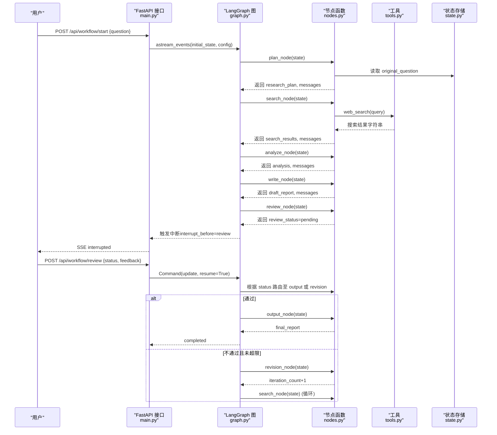
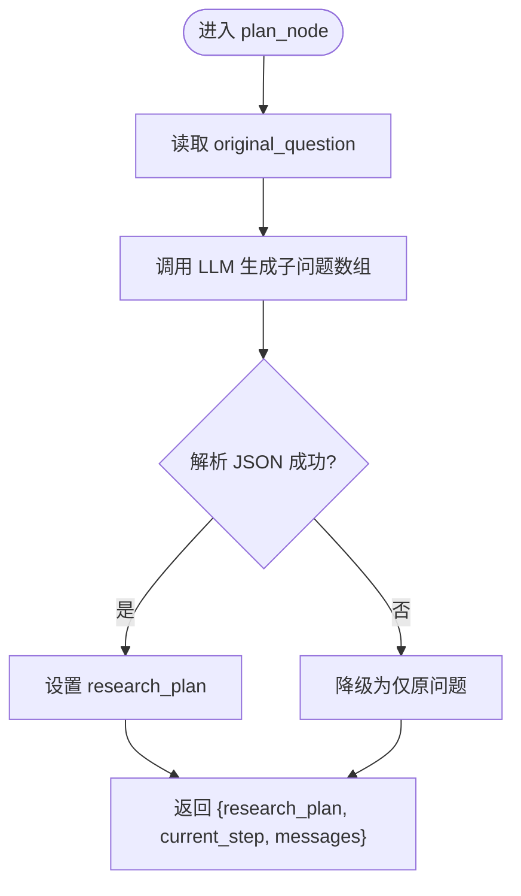
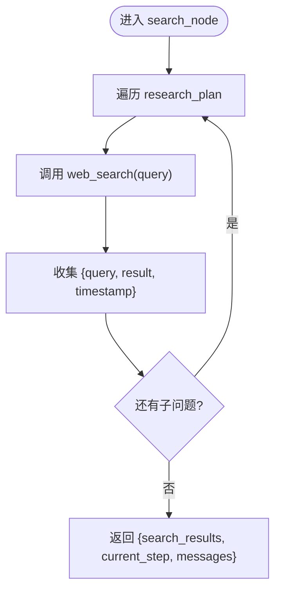
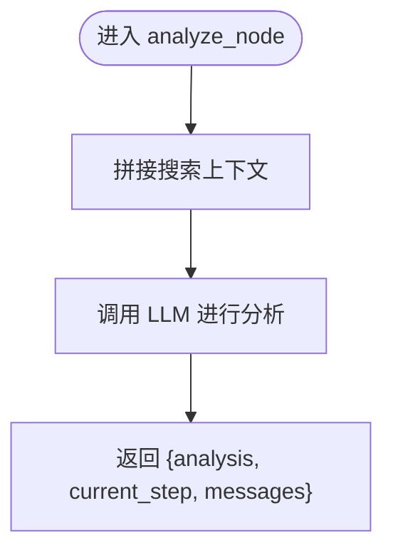
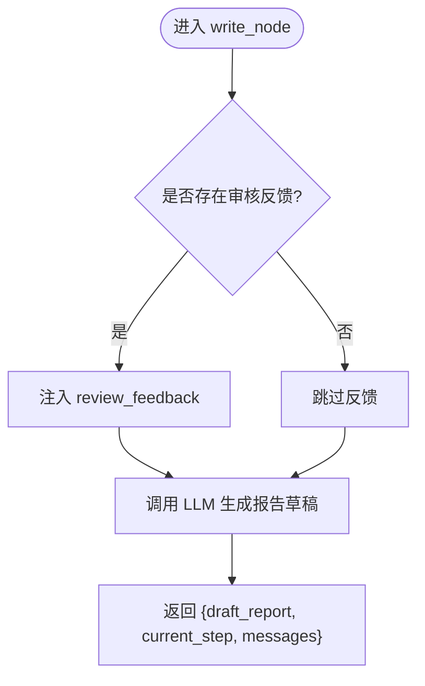
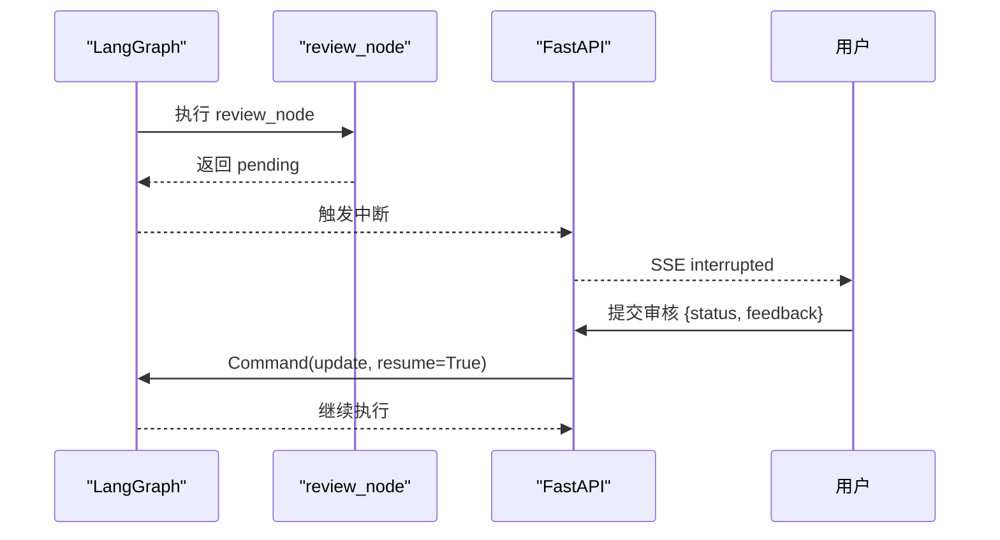
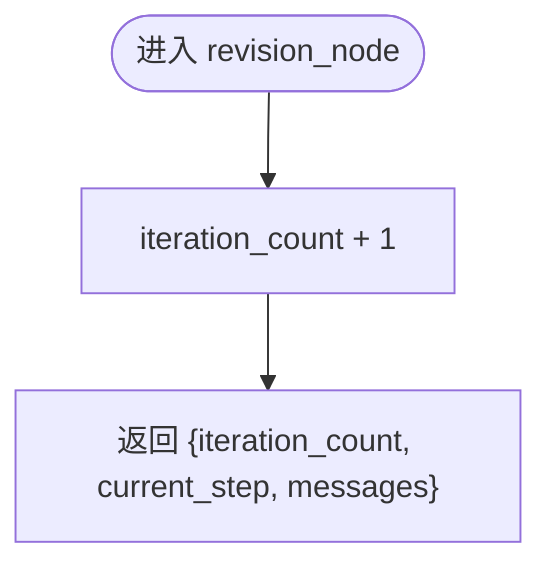
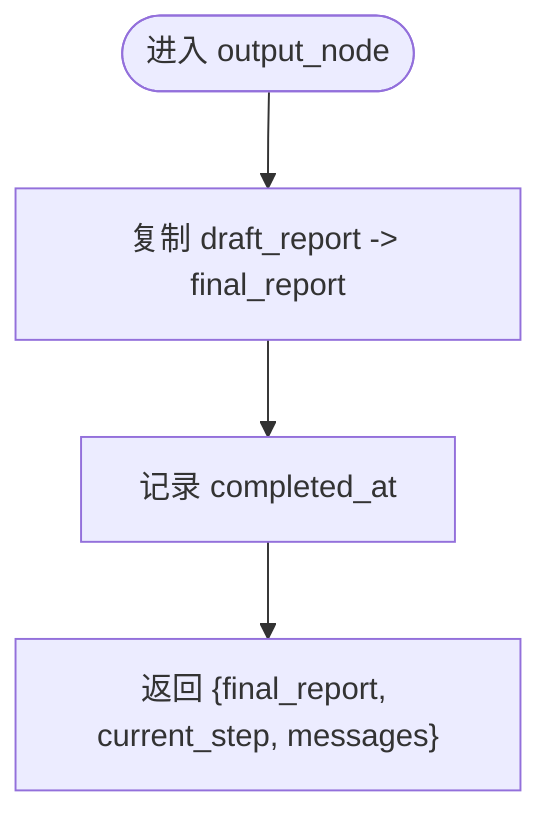
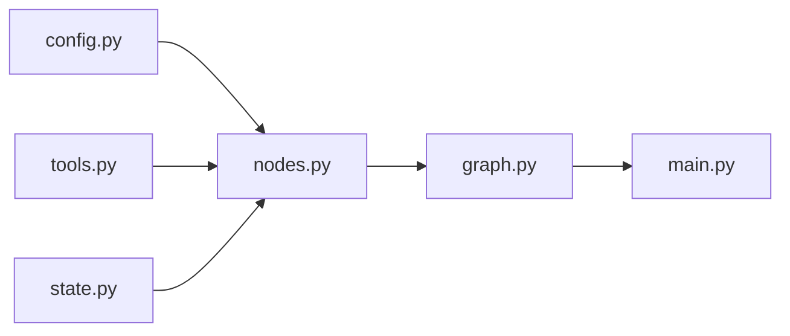

# 工作流节点实现

<cite>
**本文引用的文件**
- [nodes.py](file://workflow-studio/backend/app/nodes.py)
- [state.py](file://workflow-studio/backend/app/state.py)
- [tools.py](file://workflow-studio/backend/app/tools.py)
- [graph.py](file://workflow-studio/backend/app/graph.py)
- [schemas.py](file://workflow-studio/backend/app/schemas.py)
- [main.py](file://workflow-studio/backend/app/main.py)
- [config.py](file://workflow-studio/backend/app/config.py)
- [README.md](file://workflow-studio/README.md)
</cite>

## 目录
1. [简介](#简介)
2. [项目结构](#项目结构)
3. [核心组件](#核心组件)
4. [架构总览](#架构总览)
5. [详细组件分析](#详细组件分析)
6. [依赖关系分析](#依赖关系分析)
7. [性能考虑](#性能考虑)
8. [故障排查指南](#故障排查指南)
9. [结论](#结论)
10. [附录：节点开发模板与扩展指南](#附录节点开发模板与扩展指南)

## 简介
本技术文档围绕“AI 研究工作流”的七个核心节点进行深度解析，包括：规划节点（问题拆解）、搜索节点（网络搜索）、分析节点（结果分析）、写作节点（报告生成）、审核节点（人工审核）、修订节点（反馈处理）、输出节点（最终报告）。文档覆盖每个节点的输入输出、LLM 调用逻辑、工具使用方式、错误处理策略；并说明节点间数据传递机制、上下文共享方式、性能优化技巧。最后提供节点开发模板与扩展指南，帮助开发者快速添加新的工作流节点。

## 项目结构
后端采用 FastAPI + LangGraph 构建有状态多 Agent 工作流，前端通过 Vue Flow 可视化执行过程并通过 SSE 实时接收事件。关键文件职责如下：
- nodes.py：定义各节点函数，封装 LLM 调用与工具使用
- state.py：定义全局状态 ResearchState，承载节点间数据
- tools.py：定义可被节点调用的工具（如 web_search）
- graph.py：构建 LangGraph 图、条件路由、中断点配置
- main.py：FastAPI 接口，启动工作流、提交审核、SSE 事件流
- config.py：加载环境变量（模型、Base URL、密钥）
- schemas.py：请求体 Pydantic 模型
- README.md：项目说明与架构图

图表来源
- [main.py:35-103](file://workflow-studio/backend/app/main.py#L35-L103)
- [graph.py:23-77](file://workflow-studio/backend/app/graph.py#L23-L77)
- [nodes.py:18-128](file://workflow-studio/backend/app/nodes.py#L18-L128)
- [tools.py:4-25](file://workflow-studio/backend/app/tools.py#L4-L25)
- [state.py:5-30](file://workflow-studio/backend/app/state.py#L5-L30)
- [config.py:1-9](file://workflow-studio/backend/app/config.py#L1-L9)
- [schemas.py:4-12](file://workflow-studio/backend/app/schemas.py#L4-L12)

章节来源
- [README.md:15-21](file://workflow-studio/README.md#L15-L21)
- [main.py:14-31](file://workflow-studio/backend/app/main.py#L14-L31)

## 核心组件
- 状态管理：ResearchState 统一承载消息历史、控制字段、研究内容、审核信息、元数据
- 节点集合：plan/search/analyze/write/review/revision/output 七个节点
- 工具集：web_search、academic_search（可扩展为真实搜索引擎）
- 图编排：LangGraph StateGraph 定义线性流程与条件分支，支持中断与检查点持久化
- API 层：FastAPI 暴露启动、审核、状态查询、图结构等接口，SSE 推送事件

章节来源
- [state.py:5-30](file://workflow-studio/backend/app/state.py#L5-L30)
- [nodes.py:18-128](file://workflow-studio/backend/app/nodes.py#L18-L128)
- [tools.py:4-25](file://workflow-studio/backend/app/tools.py#L4-L25)
- [graph.py:23-77](file://workflow-studio/backend/app/graph.py#L23-L77)
- [main.py:35-200](file://workflow-studio/backend/app/main.py#L35-L200)

## 架构总览
下图展示了从用户提问到最终报告的完整执行路径，包含审核后的条件分支与循环修订保护。

图表来源
- [main.py:35-154](file://workflow-studio/backend/app/main.py#L35-L154)
- [graph.py:11-77](file://workflow-studio/backend/app/graph.py#L11-L77)
- [nodes.py:18-128](file://workflow-studio/backend/app/nodes.py#L18-L128)
- [tools.py:4-25](file://workflow-studio/backend/app/tools.py#L4-L25)
- [state.py:5-30](file://workflow-studio/backend/app/state.py#L5-L30)

## 详细组件分析

### 规划节点（问题拆解）
- 输入：state.original_question
- 处理：调用 LLM 将原始问题拆解为 3-5 个具体子问题，强制返回 JSON 数组
- 输出：research_plan（子问题列表）、current_step="plan"、messages
- LLM 调用：使用 ChatOpenAI，temperature=0.3，SystemMessage 指定角色与输出格式，HumanMessage 传入问题
- 错误处理：JSON 解析失败时降级为仅保留原问题作为计划
- 上下文共享：写入 ResearchState.research_plan，后续节点读取

图表来源
- [nodes.py:18-40](file://workflow-studio/backend/app/nodes.py#L18-L40)
- [config.py:6-9](file://workflow-studio/backend/app/config.py#L6-L9)

章节来源
- [nodes.py:18-40](file://workflow-studio/backend/app/nodes.py#L18-L40)
- [state.py:14-17](file://workflow-studio/backend/app/state.py#L14-L17)

### 搜索节点（网络搜索）
- 输入：state.research_plan（子问题列表）
- 处理：对每个子问题调用 web_search 工具，收集结果与时间戳
- 输出：search_results（每条含 query/result/timestamp）、current_step="search"、messages
- 工具使用：web_search 当前为模拟实现，可按需替换为 Tavily/SerpAPI/Bing Search
- 错误处理：若工具返回异常，建议上层捕获并记录日志（当前为同步调用，生产环境建议异步化与重试）

图表来源
- [nodes.py:43-60](file://workflow-studio/backend/app/nodes.py#L43-L60)
- [tools.py:4-19](file://workflow-studio/backend/app/tools.py#L4-L19)

章节来源
- [nodes.py:43-60](file://workflow-studio/backend/app/nodes.py#L43-L60)
- [tools.py:4-19](file://workflow-studio/backend/app/tools.py#L4-L19)
- [state.py:17-17](file://workflow-studio/backend/app/state.py#L17-L17)

### 分析节点（结果分析）
- 输入：state.original_question 与 state.search_results
- 处理：拼接搜索上下文，调用 LLM 进行综合分析，提取关键发现、矛盾点与结构化分析
- 输出：analysis（文本）、current_step="analyze"、messages
- LLM 调用：SystemMessage 指定分析师角色，HumanMessage 注入原始问题与搜索结果
- 错误处理：若 LLM 返回非预期格式，可在上层校验并回退到默认摘要

图表来源
- [nodes.py:63-79](file://workflow-studio/backend/app/nodes.py#L63-L79)

章节来源
- [nodes.py:63-79](file://workflow-studio/backend/app/nodes.py#L63-L79)
- [state.py:15-18](file://workflow-studio/backend/app/state.py#L15-L18)

### 写作节点（报告生成）
- 输入：state.original_question、state.analysis、可选 state.review_feedback
- 处理：调用 LLM 基于分析结果撰写结构化研究报告（Markdown），若存在审核反馈则附加提示
- 输出：draft_report（文本）、current_step="write"、messages
- LLM 调用：SystemMessage 指定学术写作专家角色，HumanMessage 注入问题与分析/反馈
- 错误处理：若生成内容不完整，可在上层进行二次补全或截断

图表来源
- [nodes.py:82-97](file://workflow-studio/backend/app/nodes.py#L82-L97)

章节来源
- [nodes.py:82-97](file://workflow-studio/backend/app/nodes.py#L82-L97)
- [state.py:19-24](file://workflow-studio/backend/app/state.py#L19-L24)

### 审核节点（人工审核）
- 输入：无额外输入，等待外部人类决策
- 处理：节点返回 pending 状态，LangGraph 在 interrupt_before=["review"] 处暂停
- 输出：current_step="review"、review_status="pending"、messages
- 中断恢复：通过 /api/workflow/review 提交审核结果（approved/rejected + feedback），使用 Command(update, resume=True) 恢复执行
- 错误处理：若审核状态缺失或非法，路由函数会默认回到 review 等待

图表来源
- [nodes.py:100-108](file://workflow-studio/backend/app/nodes.py#L100-L108)
- [graph.py:65-77](file://workflow-studio/backend/app/graph.py#L65-L77)
- [main.py:107-154](file://workflow-studio/backend/app/main.py#L107-L154)

章节来源
- [nodes.py:100-108](file://workflow-studio/backend/app/nodes.py#L100-L108)
- [graph.py:65-77](file://workflow-studio/backend/app/graph.py#L65-L77)
- [main.py:107-154](file://workflow-studio/backend/app/main.py#L107-L154)

### 修订节点（反馈处理）
- 输入：state.iteration_count
- 处理：迭代计数加一，用于防止无限循环
- 输出：iteration_count、current_step="revision"、messages
- 路由逻辑：当审核不通过且 iteration_count < 3 时，回到 search 重新搜索；否则强制输出

图表来源
- [nodes.py:121-128](file://workflow-studio/backend/app/nodes.py#L121-L128)
- [graph.py:11-20](file://workflow-studio/backend/app/graph.py#L11-L20)

章节来源
- [nodes.py:121-128](file://workflow-studio/backend/app/nodes.py#L121-L128)
- [graph.py:11-20](file://workflow-studio/backend/app/graph.py#L11-L20)
- [state.py:11-12](file://workflow-studio/backend/app/state.py#L11-L12)

### 输出节点（最终报告）
- 输入：state.draft_report
- 处理：直接产出最终报告，记录完成时间
- 输出：final_report、current_step="output"、completed_at、messages
- 结束：执行完成后，LangGraph 到达 END

图表来源
- [nodes.py:111-118](file://workflow-studio/backend/app/nodes.py#L111-L118)

章节来源
- [nodes.py:111-118](file://workflow-studio/backend/app/nodes.py#L111-L118)
- [state.py:20-20](file://workflow-studio/backend/app/state.py#L20-L20)

## 依赖关系分析
- 节点依赖：所有节点均依赖 ResearchState 进行读写；LLM 调用依赖 config.py 中的模型与密钥；搜索节点依赖 tools.py 的工具
- 图依赖：graph.py 将节点与边组合，定义条件路由与中断点；main.py 通过 get_compiled_graph 获取编译后的图实例
- 外部依赖：LangChain/LangGraph、FastAPI、AsyncSqliteSaver（检查点）

图表来源
- [config.py:1-9](file://workflow-studio/backend/app/config.py#L1-L9)
- [tools.py:4-25](file://workflow-studio/backend/app/tools.py#L4-L25)
- [state.py:5-30](file://workflow-studio/backend/app/state.py#L5-L30)
- [nodes.py:18-128](file://workflow-studio/backend/app/nodes.py#L18-L128)
- [graph.py:23-77](file://workflow-studio/backend/app/graph.py#L23-L77)
- [main.py:27-31](file://workflow-studio/backend/app/main.py#L27-L31)

章节来源
- [graph.py:23-77](file://workflow-studio/backend/app/graph.py#L23-L77)
- [main.py:27-31](file://workflow-studio/backend/app/main.py#L27-L31)

## 性能考虑
- LLM 调用优化：降低 temperature（已设为 0.3）以减少发散；合理拆分 prompt 避免过长上下文；对分析/写作节点可引入缓存或增量更新
- 工具调用优化：web_search 当前为同步调用，生产环境建议改为异步并发搜索，并对失败请求实施重试与超时控制
- 状态与检查点：使用 AsyncSqliteSaver 持久化检查点，支持页面刷新后恢复；生产环境可切换 PostgreSQL
- 防无限循环：revision 节点限制最多 3 轮修订，超过阈值强制输出，避免资源耗尽
- SSE 流式传输：通过 astream_events 推送 token 级输出，提升用户体验；注意前端缓冲与重连策略

[本节为通用指导，不直接分析具体文件]

## 故障排查指南
- JSON 解析失败：规划节点在解析 LLM 返回的 JSON 数组失败时会降级为仅保留原问题；检查 LLM 输出格式与 SystemMessage 约束
- 工具返回异常：搜索节点若工具抛出异常，应在上层捕获并记录日志；当前为模拟数据，替换为真实搜索引擎时需增加错误处理
- 审核中断未恢复：确认 /api/workflow/review 正确传入 workflow_id 与状态；检查 graph.aget_state 是否返回 next 为空
- 状态丢失：确保 thread_id 一致；检查 SQLite 检查点文件是否存在并可读
- 循环过多：若 iteration_count 达到上限仍进入循环，检查 route_after_review 逻辑与 revision 节点返回值

章节来源
- [nodes.py:29-34](file://workflow-studio/backend/app/nodes.py#L29-L34)
- [graph.py:11-20](file://workflow-studio/backend/app/graph.py#L11-L20)
- [main.py:158-173](file://workflow-studio/backend/app/main.py#L158-L173)

## 结论
该工作流以 LangGraph 为核心，结合 FastAPI 与 SSE 实现了端到端的 AI 研究助手可视化流程。七个节点各司其职，状态集中管理，工具与 LLM 解耦，审核节点支持人机协同与循环修订保护。整体架构清晰、可扩展性强，适合在生产环境中替换工具与增强错误处理。

[本节为总结性内容，不直接分析具体文件]

## 附录：节点开发模板与扩展指南

### 新增节点开发步骤
- 定义状态字段：在 ResearchState 中添加必要字段（参考 state.py）
- 编写节点函数：遵循 async def node_name(state: ResearchState) -> dict 签名，返回要合并到状态的键值对（参考 nodes.py）
- 注册节点与边：在 build_research_graph 中 add_node 与 add_edge/add_conditional_edges（参考 graph.py）
- 配置中断与路由：如需人工介入，设置 interrupt_before 并在路由函数中处理分支（参考 graph.py）
- 暴露 API：如需外部交互，添加 FastAPI 端点并使用 Command(update, resume=True) 恢复执行（参考 main.py）

### 节点模板（示例结构）
- 输入：从 state 读取所需上下文
- 处理：调用 LLM 或工具，必要时做数据清洗与校验
- 输出：返回字典，包含 current_step 与业务字段，以及 messages 用于前端展示
- 错误处理：捕获异常并降级或记录日志，保证工作流稳定性

### 扩展工具
- 在 tools.py 中新增 @tool 装饰函数，定义参数与返回类型
- 在节点中通过 tool.invoke 调用，建议增加重试与超时控制
- 生产环境替换模拟数据为真实服务（如 Tavily/SerpAPI/Bing Search）

### 扩展指南要点
- 保持状态最小化：只传递必要字段，避免过大上下文导致 LLM 成本上升
- 幂等性设计：节点应能安全重复执行（如搜索节点按 query 去重）
- 可观测性：通过 messages 与 SSE 事件记录关键步骤，便于调试与回放
- 安全性：对外部工具与 LLM 调用进行鉴权与限流，防止滥用

章节来源
- [state.py:5-30](file://workflow-studio/backend/app/state.py#L5-L30)
- [nodes.py:18-128](file://workflow-studio/backend/app/nodes.py#L18-L128)
- [graph.py:23-77](file://workflow-studio/backend/app/graph.py#L23-L77)
- [tools.py:4-25](file://workflow-studio/backend/app/tools.py#L4-L25)
- [main.py:35-200](file://workflow-studio/backend/app/main.py#L35-L200)