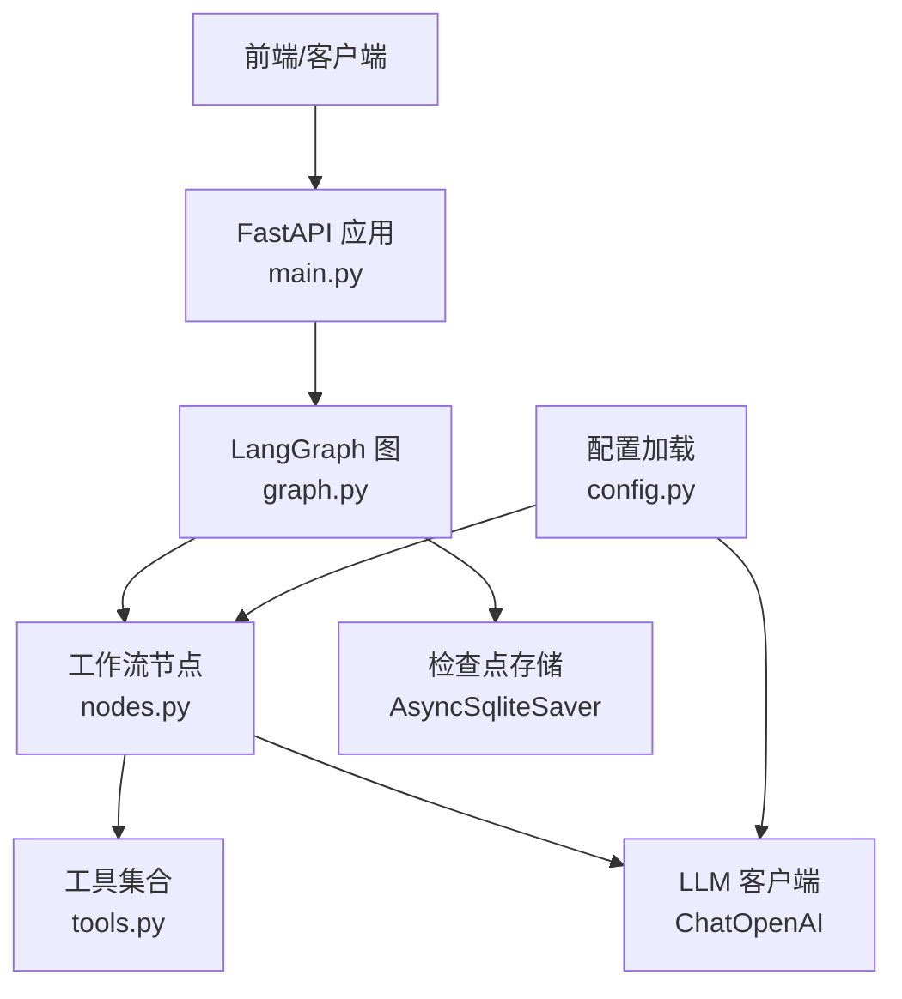
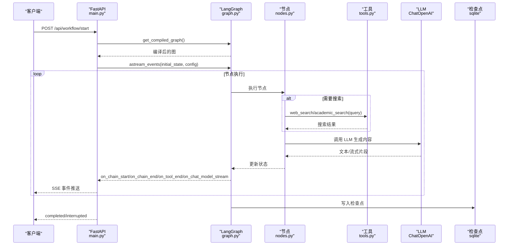
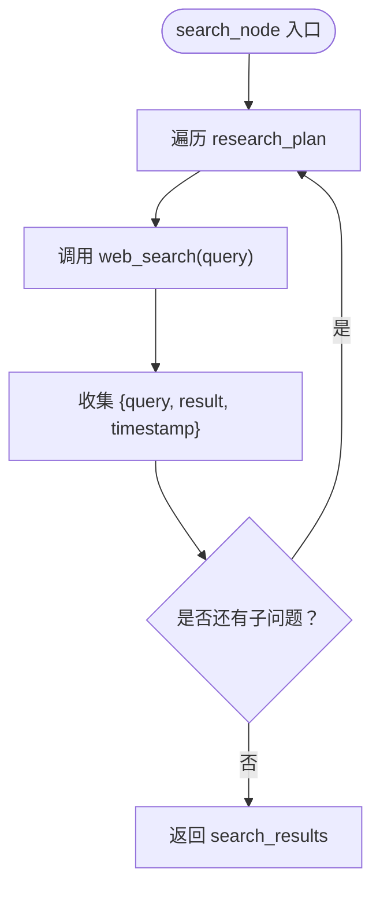
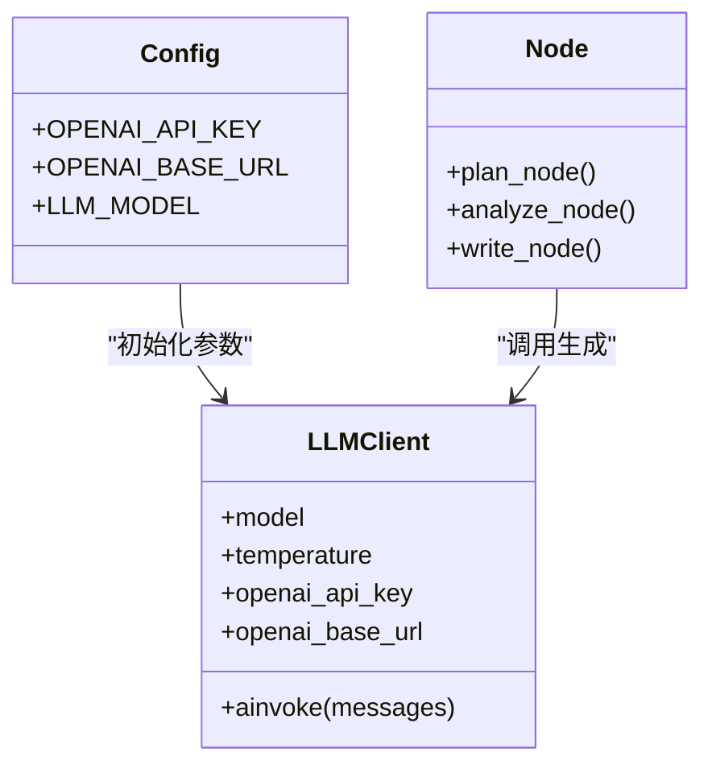
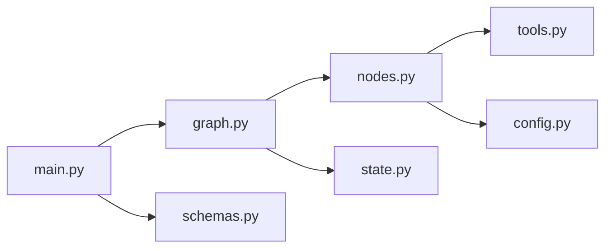

# 工具和外部集成

<cite>
**本文引用的文件**
- [tools.py](file://workflow-studio/backend/app/tools.py)
- [nodes.py](file://workflow-studio/backend/app/nodes.py)
- [config.py](file://workflow-studio/backend/app/config.py)
- [graph.py](file://workflow-studio/backend/app/graph.py)
- [main.py](file://workflow-studio/backend/app/main.py)
- [state.py](file://workflow-studio/backend/app/state.py)
- [schemas.py](file://workflow-studio/backend/app/schemas.py)
- [requirements.txt](file://workflow-studio/backend/requirements.txt)
</cite>

## 目录
1. [简介](#简介)
2. [项目结构](#项目结构)
3. [核心组件](#核心组件)
4. [架构总览](#架构总览)
5. [详细组件分析](#详细组件分析)
6. [依赖关系分析](#依赖关系分析)
7. [性能与可靠性](#性能与可靠性)
8. [故障排查指南](#故障排查指南)
9. [结论](#结论)
10. [附录：工具开发与配置示例](#附录：工具开发与配置示例)

## 简介
本技术文档聚焦于“工具与外部集成”，覆盖搜索工具（web_search、academic_search）、LLM 服务集成、配置管理系统，以及工具注册机制、参数传递、结果处理、错误重试策略。同时说明环境变量配置、API 密钥管理、数据库连接配置，并提供第三方服务集成模式、插件化设计思路与配置热重载建议，帮助开发者扩展新的外部服务与增强现有功能。

## 项目结构
后端采用 FastAPI + LangGraph 的有状态工作流架构：
- API 层：FastAPI 暴露启动、审核、状态查询等接口，并通过 SSE 推送事件。
- 工作流层：LangGraph StateGraph 定义节点与边，支持条件分支与中断恢复。
- 节点层：各业务节点调用 LLM 与工具，更新状态。
- 工具层：基于 langchain_core.tools 的工具装饰器声明可被工作流调用的能力。
- 配置层：通过 python-dotenv 加载环境变量，集中管理 LLM 与外部服务配置。
- 持久化：使用 AsyncSqliteSaver 作为检查点存储，便于中断恢复与页面刷新后继续执行。

图表来源
- [main.py:14-21](file://workflow-studio/backend/app/main.py#L14-L21)
- [graph.py:23-77](file://workflow-studio/backend/app/graph.py#L23-L77)
- [nodes.py:10-15](file://workflow-studio/backend/app/nodes.py#L10-L15)
- [tools.py:4-25](file://workflow-studio/backend/app/tools.py#L4-L25)
- [config.py:1-9](file://workflow-studio/backend/app/config.py#L1-L9)

章节来源
- [main.py:14-21](file://workflow-studio/backend/app/main.py#L14-L21)
- [graph.py:23-77](file://workflow-studio/backend/app/graph.py#L23-L77)
- [nodes.py:10-15](file://workflow-studio/backend/app/nodes.py#L10-L15)
- [tools.py:4-25](file://workflow-studio/backend/app/tools.py#L4-L25)
- [config.py:1-9](file://workflow-studio/backend/app/config.py#L1-L9)

## 核心组件
- 工具模块：提供 web_search、academic_search 两个工具，使用 @tool 装饰器注册，供工作流节点调用。
- 节点模块：实现规划、搜索、分析、写作、审核、修订、输出等节点逻辑，调用 LLM 与工具，并更新状态。
- 配置模块：从环境变量读取 OPENAI_API_KEY、OPENAI_BASE_URL、LLM_MODEL，注入到 LLM 客户端。
- 图构建：定义节点、边与条件路由，编译为可执行图，并在审核前中断以支持人工介入。
- API 层：提供启动工作流、提交审核、获取状态、获取图结构等接口，并通过 SSE 推送事件。

章节来源
- [tools.py:4-25](file://workflow-studio/backend/app/tools.py#L4-L25)
- [nodes.py:18-128](file://workflow-studio/backend/app/nodes.py#L18-L128)
- [config.py:1-9](file://workflow-studio/backend/app/config.py#L1-L9)
- [graph.py:23-77](file://workflow-studio/backend/app/graph.py#L23-L77)
- [main.py:34-154](file://workflow-studio/backend/app/main.py#L34-L154)

## 架构总览
下图展示了请求从 API 进入，触发工作流执行，节点调用 LLM 与工具，事件通过 SSE 返回给前端的全链路流程。

图表来源
- [main.py:34-103](file://workflow-studio/backend/app/main.py#L34-L103)
- [graph.py:23-77](file://workflow-studio/backend/app/graph.py#L23-L77)
- [nodes.py:43-60](file://workflow-studio/backend/app/nodes.py#L43-L60)
- [tools.py:4-25](file://workflow-studio/backend/app/tools.py#L4-L25)
- [config.py:1-9](file://workflow-studio/backend/app/config.py#L1-L9)

## 详细组件分析

### 搜索工具实现（web_search、academic_search）
- 工具注册：使用 @tool 装饰器将函数注册为 LangChain 工具，可在节点中通过 .invoke 调用。
- 参数传递：工具接收 query 字符串，当前实现为模拟数据匹配；实际项目中应替换为真实搜索引擎或学术检索 API。
- 结果处理：返回结构化文本，节点将其收集为 search_results，后续用于分析与写作。
- 可扩展性：新增工具只需在 tools.py 中定义新函数并使用 @tool 装饰，即可在工作流中直接调用。

图表来源
- [nodes.py:43-60](file://workflow-studio/backend/app/nodes.py#L43-L60)
- [tools.py:4-25](file://workflow-studio/backend/app/tools.py#L4-L25)

章节来源
- [tools.py:4-25](file://workflow-studio/backend/app/tools.py#L4-L25)
- [nodes.py:43-60](file://workflow-studio/backend/app/nodes.py#L43-L60)

### LLM 服务集成
- 配置加载：从环境变量读取 OPENAI_API_KEY、OPENAI_BASE_URL、LLM_MODEL，构造 ChatOpenAI 客户端。
- 节点调用：规划、分析、写作节点通过 llm.ainvoke 发送消息并获取响应，用于生成计划、分析、报告草稿。
- 流式输出：API 层监听 on_chat_model_stream 事件，将 token 流式推送到前端。
- 可替换性：如需切换模型提供商或接入本地模型，仅需调整配置与客户端初始化参数。

图表来源
- [config.py:1-9](file://workflow-studio/backend/app/config.py#L1-L9)
- [nodes.py:10-15](file://workflow-studio/backend/app/nodes.py#L10-L15)
- [nodes.py:18-40](file://workflow-studio/backend/app/nodes.py#L18-L40)
- [nodes.py:63-97](file://workflow-studio/backend/app/nodes.py#L63-L97)

章节来源
- [config.py:1-9](file://workflow-studio/backend/app/config.py#L1-L9)
- [nodes.py:10-15](file://workflow-studio/backend/app/nodes.py#L10-L15)
- [nodes.py:18-40](file://workflow-studio/backend/app/nodes.py#L18-L40)
- [nodes.py:63-97](file://workflow-studio/backend/app/nodes.py#L63-L97)

### 配置管理系统
- 环境变量：通过 python-dotenv 加载 .env，读取 OPENAI_API_KEY、OPENAI_BASE_URL、LLM_MODEL。
- 集中管理：所有与 LLM 相关的配置集中在 config.py，便于统一维护与扩展。
- 生产建议：在生产环境建议使用更安全的配置中心或密钥管理服务，避免明文存储密钥。

章节来源
- [config.py:1-9](file://workflow-studio/backend/app/config.py#L1-L9)

### 工具注册机制与插件化设计
- 注册方式：使用 @tool 装饰器声明工具，LangChain 自动识别并可在工作流中调用。
- 插件化建议：
  - 按领域拆分工具文件（如 search_tools.py、db_tools.py），在统一入口导入注册。
  - 提供工具元数据（名称、描述、参数 schema），便于动态发现与展示。
  - 通过配置文件或环境变量启用/禁用特定工具，实现运行时开关。
- 当前实现：工具位于 tools.py，节点通过 import 直接调用，尚未实现动态加载。

章节来源
- [tools.py:4-25](file://workflow-studio/backend/app/tools.py#L4-L25)
- [nodes.py:43-60](file://workflow-studio/backend/app/nodes.py#L43-L60)

### 参数传递与结果处理
- 参数传递：search_node 将 research_plan 中的每个子问题作为 query 传入 web_search。
- 结果处理：节点收集每条查询的结果与时间戳，形成 search_results 列表，传递给 analyze_node 进行综合分析。
- 状态更新：每个节点返回 dict，包含 current_step、messages 及业务字段，由 LangGraph 合并到全局状态。

章节来源
- [nodes.py:43-60](file://workflow-studio/backend/app/nodes.py#L43-L60)
- [nodes.py:63-79](file://workflow-studio/backend/app/nodes.py#L63-L79)
- [state.py:5-30](file://workflow-studio/backend/app/state.py#L5-L30)

### 错误处理与重试策略
- 当前实现：工具与节点未显式实现重试与异常捕获；LLM 调用失败会抛出异常并被 API 层捕获，返回 error 事件。
- 建议方案：
  - 在工具层增加指数退避重试（如 httpx 请求失败时重试）。
  - 对 LLM 调用增加超时与重试保护，区分可重试与不可重试错误。
  - 记录错误上下文（查询、节点、迭代次数），便于定位与审计。

章节来源
- [main.py:96-98](file://workflow-studio/backend/app/main.py#L96-L98)
- [nodes.py:18-40](file://workflow-studio/backend/app/nodes.py#L18-L40)

### 第三方服务集成模式
- 搜索服务：当前为模拟实现，建议替换为 Tavily/SerpAPI/Bing Search 等真实搜索引擎。
- 学术检索：academic_search 可对接 arXiv、Semantic Scholar、CNKI 等学术 API。
- 数据库服务：如需持久化搜索结果或用户反馈，可引入 SQLAlchemy + PostgreSQL，并通过异步客户端访问。
- 认证与安全：对外部 API 的密钥通过环境变量管理，避免硬编码；必要时使用签名与加密传输。

章节来源
- [tools.py:4-25](file://workflow-studio/backend/app/tools.py#L4-L25)
- [requirements.txt:1-10](file://workflow-studio/backend/requirements.txt#L1-L10)

### 配置热重载机制
- 当前实现：应用启动时加载 .env，无运行时热重载。
- 建议方案：
  - 使用 watchdog 监听 .env 变化，动态重新加载配置。
  - 或使用配置中心（如 etcd、Consul）配合健康检查与滚动更新。
  - 注意：LLM 客户端实例需安全重建，避免并发冲突。

章节来源
- [config.py:1-9](file://workflow-studio/backend/app/config.py#L1-L9)

## 依赖关系分析
- 框架与库：FastAPI、LangGraph、LangChain、AsyncSqliteSaver、python-dotenv、httpx 等。
- 模块耦合：
  - main.py 依赖 graph.py、state.py、schemas.py。
  - graph.py 依赖 nodes.py、state.py。
  - nodes.py 依赖 tools.py、config.py、state.py。
  - tools.py 仅依赖 langchain_core.tools。
- 潜在循环：当前无循环依赖；若引入动态加载需注意模块导入顺序。

图表来源
- [main.py:10-12](file://workflow-studio/backend/app/main.py#L10-L12)
- [graph.py:4-8](file://workflow-studio/backend/app/graph.py#L4-L8)
- [nodes.py:6-8](file://workflow-studio/backend/app/nodes.py#L6-L8)

章节来源
- [main.py:10-12](file://workflow-studio/backend/app/main.py#L10-L12)
- [graph.py:4-8](file://workflow-studio/backend/app/graph.py#L4-L8)
- [nodes.py:6-8](file://workflow-studio/backend/app/nodes.py#L6-L8)

## 性能与可靠性
- 流式输出：通过 SSE 推送 token，降低首屏延迟，提升用户体验。
- 检查点持久化：使用 AsyncSqliteSaver 保存执行状态，支持中断恢复与页面刷新续跑。
- 防无限循环：审核不通过最多 3 轮修订后强制输出，避免死循环。
- 资源占用：SQLite 适合轻量场景，生产环境建议迁移至 PostgreSQL 以提升并发与可靠性。

章节来源
- [main.py:60-103](file://workflow-studio/backend/app/main.py#L60-L103)
- [graph.py:65-77](file://workflow-studio/backend/app/graph.py#L65-L77)
- [graph.py:11-20](file://workflow-studio/backend/app/graph.py#L11-L20)

## 故障排查指南
- 工作流启动失败：检查 .env 是否包含有效的 OPENAI_API_KEY 与正确的 BASE_URL。
- 节点执行异常：查看 SSE 事件中的 error 类型消息，定位具体节点与输入。
- 审核中断：确认 workflow_id 正确，调用 /api/workflow/review 提交审核结果恢复执行。
- 状态恢复：刷新页面后调用 /api/workflow/state/{workflow_id} 获取当前状态与 next 节点。

章节来源
- [main.py:96-98](file://workflow-studio/backend/app/main.py#L96-L98)
- [main.py:107-154](file://workflow-studio/backend/app/main.py#L107-L154)
- [main.py:157-173](file://workflow-studio/backend/app/main.py#L157-L173)

## 结论
本项目基于 FastAPI 与 LangGraph 构建了可视化研究工作流，工具与 LLM 集成清晰、可扩展性强。当前工具为模拟实现，建议替换为真实外部服务并完善错误重试与配置热重载机制。通过插件化工具注册与环境变量配置，开发者可快速集成新的外部服务，扩展现有功能。

## 附录：工具开发与配置示例

### 新增搜索工具步骤
- 在 tools.py 中新增函数并使用 @tool 装饰器。
- 在 nodes.py 的 search_node 中调用新工具，收集结果。
- 如需启用/禁用，可通过环境变量控制。

章节来源
- [tools.py:4-25](file://workflow-studio/backend/app/tools.py#L4-L25)
- [nodes.py:43-60](file://workflow-studio/backend/app/nodes.py#L43-L60)

### 环境变量配置示例
- OPENAI_API_KEY：LLM 提供商的 API 密钥。
- OPENAI_BASE_URL：自定义或代理的 LLM 服务地址。
- LLM_MODEL：选择的模型名称。

章节来源
- [config.py:1-9](file://workflow-studio/backend/app/config.py#L1-L9)

### 数据库连接配置建议
- 开发环境：使用 AsyncSqliteSaver 的 SQLite 文件存储检查点。
- 生产环境：迁移至 PostgreSQL，使用对应的 AsyncSqliteSaver 替代或 LangGraph 提供的其他检查点实现。

章节来源
- [graph.py:65-77](file://workflow-studio/backend/app/graph.py#L65-L77)

### 错误重试策略建议
- 工具层：对网络请求增加指数退避重试，捕获超时与连接错误。
- LLM 层：设置合理超时与最大重试次数，区分可重试错误（如 5xx）与不可重试错误（如 4xx）。
- 监控与日志：记录重试次数、错误码、请求上下文，便于问题定位。

章节来源
- [nodes.py:18-40](file://workflow-studio/backend/app/nodes.py#L18-L40)
- [main.py:96-98](file://workflow-studio/backend/app/main.py#L96-L98)