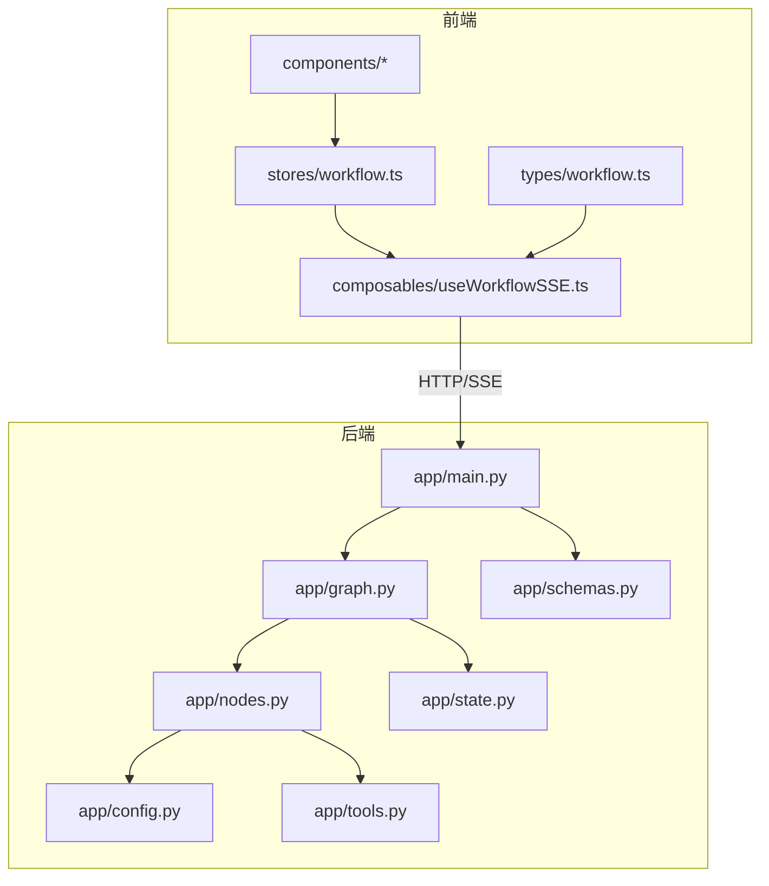
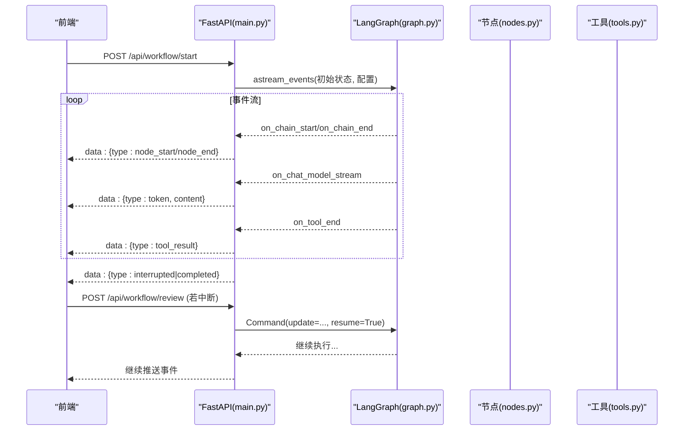
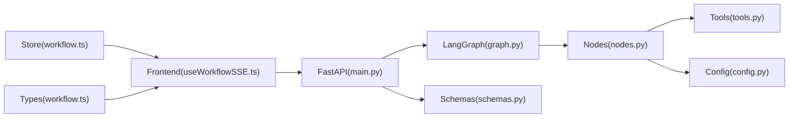

# 代码规范

<cite>
**本文引用的文件**
- [main.py](file://backend/app/main.py)
- [graph.py](file://backend/app/graph.py)
- [nodes.py](file://backend/app/nodes.py)
- [state.py](file://backend/app/state.py)
- [config.py](file://backend/app/config.py)
- [tools.py](file://backend/app/tools.py)
- [schemas.py](file://backend/app/schemas.py)
- [useWorkflowSSE.ts](file://frontend/src/composables/useWorkflowSSE.ts)
- [workflow.ts](file://frontend/src/stores/workflow.ts)
- [workflow.ts（类型）](file://frontend/src/types/workflow.ts)
- [BaseNode.vue](file://frontend/src/components/nodes/BaseNode.vue)
- [ChatInput.vue](file://frontend/src/components/panels/ChatInput.vue)
- [ReviewDialog.vue](file://frontend/src/components/panels/ReviewDialog.vue)
- [package.json](file://frontend/package.json)
- [requirements.txt](file://backend/requirements.txt)
</cite>

## 目录
1. [简介](#简介)
2. [项目结构](#项目结构)
3. [核心组件](#核心组件)
4. [架构总览](#架构总览)
5. [详细组件分析](#详细组件分析)
6. [依赖关系分析](#依赖关系分析)
7. [性能与可观测性](#性能与可观测性)
8. [故障排查指南](#故障排查指南)
9. [结论](#结论)
10. [附录：规范清单与工具配置](#附录：规范清单与工具配置)

## 简介
本规范面向 Workflow Studio 项目的后端 Python（FastAPI + LangGraph）与前端 Vue 3（TypeScript、Pinia、Vue Flow），目标是统一团队编码风格、提升可维护性与协作效率。内容覆盖：
- Python 后端：函数命名、异步模式、错误处理、LangGraph 节点编写标准、SSE 事件流最佳实践、数据库（检查点）操作规范
- Vue 3 前端：组件结构、状态管理、TypeScript 类型定义、SSE 客户端消费规范
- 配置管理：环境变量与敏感信息隔离
- 质量保障：代码风格检查、Git 提交信息规范、代码审查清单

## 项目结构
- 后端采用 FastAPI 提供 REST API，基于 LangGraph 构建有状态工作流图，使用 SQLite 作为检查点存储；通过 SSE 向前端推送节点执行事件与 LLM 流式输出。
- 前端使用 Vue 3 + TypeScript + Pinia + Vue Flow，封装 SSE 消费逻辑 composable，并通过 Store 集中管理工作流状态与日志。

图表来源
- [main.py:1-200](file://backend/app/main.py#L1-L200)
- [graph.py:1-78](file://backend/app/graph.py#L1-L78)
- [nodes.py:1-129](file://backend/app/nodes.py#L1-L129)
- [state.py:1-30](file://backend/app/state.py#L1-L30)
- [config.py:1-9](file://backend/app/config.py#L1-L9)
- [tools.py:1-26](file://backend/app/tools.py#L1-L26)
- [schemas.py:1-12](file://backend/app/schemas.py#L1-L12)
- [useWorkflowSSE.ts:1-172](file://frontend/src/composables/useWorkflowSSE.ts#L1-L172)
- [workflow.ts:1-75](file://frontend/src/stores/workflow.ts#L1-L75)
- [workflow.ts（类型）:1-64](file://frontend/src/types/workflow.ts#L1-L64)

章节来源
- [main.py:1-200](file://backend/app/main.py#L1-L200)
- [graph.py:1-78](file://backend/app/graph.py#L1-L78)
- [useWorkflowSSE.ts:1-172](file://frontend/src/composables/useWorkflowSSE.ts#L1-L172)
- [workflow.ts:1-75](file://frontend/src/stores/workflow.ts#L1-L75)
- [workflow.ts（类型）:1-64](file://frontend/src/types/workflow.ts#L1-L64)

## 核心组件
- 后端 API 与服务编排
  - FastAPI 应用入口、CORS 中间件、全局图实例懒加载
  - 启动工作流、人工审核恢复、查询状态、获取图结构
  - LangGraph 图构建、条件路由、中断机制、检查点持久化
  - 节点实现（规划、搜索、分析、写作、审核、修订、输出）
  - 工具（模拟搜索）、配置（环境变量）、请求模型（Pydantic）
- 前端状态与交互
  - SSE 事件消费 composable（解析 data: 行、事件分发、状态更新）
  - Pinia Store（工作流状态、日志、图结构、节点状态）
  - 类型定义（节点状态、SSE 事件、图结构）
  - 基础节点组件、输入面板、审核对话框

章节来源
- [main.py:1-200](file://backend/app/main.py#L1-L200)
- [graph.py:1-78](file://backend/app/graph.py#L1-L78)
- [nodes.py:1-129](file://backend/app/nodes.py#L1-L129)
- [state.py:1-30](file://backend/app/state.py#L1-L30)
- [config.py:1-9](file://backend/app/config.py#L1-L9)
- [tools.py:1-26](file://backend/app/tools.py#L1-L26)
- [schemas.py:1-12](file://backend/app/schemas.py#L1-L12)
- [useWorkflowSSE.ts:1-172](file://frontend/src/composables/useWorkflowSSE.ts#L1-L172)
- [workflow.ts:1-75](file://frontend/src/stores/workflow.ts#L1-L75)
- [workflow.ts（类型）:1-64](file://frontend/src/types/workflow.ts#L1-L64)

## 架构总览
后端以 FastAPI 暴露接口，内部通过 LangGraph 编译有向图，按节点顺序执行并支持条件分支与人工中断；通过 SSE 将节点生命周期事件、LLM token 流、工具结果等实时推送到前端。前端使用 composable 订阅 SSE，驱动 Pinia Store 更新 UI，并在需要时调用审核接口恢复执行。

图表来源
- [main.py:34-154](file://backend/app/main.py#L34-L154)
- [graph.py:23-77](file://backend/app/graph.py#L23-L77)
- [nodes.py:18-128](file://backend/app/nodes.py#L18-L128)
- [tools.py:4-25](file://backend/app/tools.py#L4-L25)

## 详细组件分析

### 后端：FastAPI 工作流 API
- 职责
  - 启动工作流：创建初始状态、生成 workflow_id、注入线程配置、以 SSE 推送事件
  - 人工审核：接收审核结果，使用 Command 恢复执行
  - 状态查询：读取当前状态，返回是否中断及下一步
  - 图结构：返回静态图元数据供前端渲染
- 关键约定
  - 所有事件以 data: JSON 行形式推送，媒体类型为 text/event-stream
  - 事件类型包括 node_start、node_end、token、tool_result、interrupted、completed、error
  - 异常统一捕获并推送 error 事件
- 建议
  - 对大对象输出做截断（如 node_end 的 output 字段）
  - 为每个工作流分配独立 thread_id，避免状态污染
  - 在 review 前设置中断，确保人机协同

章节来源
- [main.py:34-200](file://backend/app/main.py#L34-L200)

### 后端：LangGraph 图与节点
- 图构建
  - 线性流程：plan → search → analyze → write → review
  - 条件边：review 后根据审核结果路由到 output 或 revision
  - 循环保护：revision 最多 3 轮后强制输出
  - 中断：在 review 前暂停，等待人工输入
- 节点规范
  - 统一 async 函数签名，接收 ResearchState，返回增量 state 更新
  - 对外部服务调用（LLM、工具）进行错误降级与兜底
  - 通过 messages 追加用户可见消息，便于前端展示
- 推荐
  - 节点内只做单一职责处理，复杂逻辑下沉到工具或服务层
  - 对 LLM 返回进行结构化校验与容错

章节来源
- [graph.py:11-77](file://backend/app/graph.py#L11-L77)
- [nodes.py:18-128](file://backend/app/nodes.py#L18-L128)

### 后端：状态与配置
- 状态模型
  - 使用 TypedDict 描述完整状态，包含控制字段、研究内容、审核字段与元数据
  - 使用 add_messages reducer 维护消息历史
- 配置管理
  - 通过 dotenv 加载环境变量，避免硬编码密钥
  - 关键键：OPENAI_API_KEY、OPENAI_BASE_URL、LLM_MODEL

章节来源
- [state.py:1-30](file://backend/app/state.py#L1-L30)
- [config.py:1-9](file://backend/app/config.py#L1-L9)

### 后端：工具与请求模型
- 工具
  - 使用 @tool 装饰器声明工具，便于 LLM 调用
  - 当前为模拟实现，生产环境替换为真实搜索服务
- 请求模型
  - 使用 Pydantic 定义 StartRequest、ReviewRequest，保证入参校验

章节来源
- [tools.py:1-26](file://backend/app/tools.py#L1-L26)
- [schemas.py:1-12](file://backend/app/schemas.py#L1-L12)

### 前端：SSE 事件处理 Composable
- 职责
  - 发起 /api/workflow/start 与 /api/workflow/review 请求
  - 使用 ReadableStream 读取 body，按行过滤 data: 前缀并解析 JSON
  - 分发事件到 handleSSEEvent，更新节点状态、日志、流式文本、中断标记等
- 事件映射
  - node_start/node_end：更新节点运行态
  - token：拼接流式文本
  - tool_result：记录工具输出摘要
  - interrupted：暂停执行，记录中断位置与工作流 ID
  - completed/error：结束或报错
- 建议
  - 对解析失败进行静默忽略，避免中断整体流
  - 连接断开时重置 isRunning，提示用户重试

章节来源
- [useWorkflowSSE.ts:1-172](file://frontend/src/composables/useWorkflowSSE.ts#L1-L172)

### 前端：状态管理与类型
- Store
  - 集中管理 workflowId、节点状态、日志、运行标志、图结构、选中节点
  - 提供计算属性判断节点运行/完成集合
  - 提供重置、添加日志、设置图结构等方法
- 类型
  - NodeStatus、NodeType、SSEEvent、GraphStructure 等类型统一约束前后端契约
  - 节点数据 WorkflowNodeData 扩展自定义字段（标签、状态、耗时等）

章节来源
- [workflow.ts:1-75](file://frontend/src/stores/workflow.ts#L1-L75)
- [workflow.ts（类型）:1-64](file://frontend/src/types/workflow.ts#L1-L64)

### 前端：组件开发规范
- BaseNode 节点组件
  - 基于 @vue-flow/core 的 Handle 与 Position，展示图标、标题、状态图标与耗时
  - 通过 props.data 绑定节点数据，使用 computed 派生样式与图标
- ChatInput 输入面板
  - 双向绑定问题输入，禁用态与发送按钮联动
- ReviewDialog 审核对话框
  - 支持通过/不通过两种操作，不通过需填写反馈

章节来源
- [BaseNode.vue:1-82](file://frontend/src/components/nodes/BaseNode.vue#L1-L82)
- [ChatInput.vue:1-40](file://frontend/src/components/panels/ChatInput.vue#L1-L40)
- [ReviewDialog.vue:1-54](file://frontend/src/components/panels/ReviewDialog.vue#L1-L54)

## 依赖关系分析
- 后端依赖
  - FastAPI、uvicorn、sse-starlette（可选）、httpx、python-dotenv
  - LangChain/LangGraph 生态：langchain-core、langchain-openai、langgraph-checkpoint-sqlite
- 前端依赖
  - Vue 3、Vite、TypeScript、Pinia、@vue-flow/*、TailwindCSS、Lucide Icons

图表来源
- [main.py:1-200](file://backend/app/main.py#L1-L200)
- [graph.py:1-78](file://backend/app/graph.py#L1-L78)
- [nodes.py:1-129](file://backend/app/nodes.py#L1-L129)
- [tools.py:1-26](file://backend/app/tools.py#L1-L26)
- [schemas.py:1-12](file://backend/app/schemas.py#L1-L12)
- [config.py:1-9](file://backend/app/config.py#L1-L9)
- [useWorkflowSSE.ts:1-172](file://frontend/src/composables/useWorkflowSSE.ts#L1-L172)
- [workflow.ts:1-75](file://frontend/src/stores/workflow.ts#L1-L75)
- [workflow.ts（类型）:1-64](file://frontend/src/types/workflow.ts#L1-L64)

章节来源
- [requirements.txt:1-10](file://backend/requirements.txt#L1-L10)
- [package.json:1-32](file://frontend/package.json#L1-L32)

## 性能与可观测性
- 后端
  - 使用 astream_events 实现细粒度事件流，降低首屏延迟
  - 对大对象输出进行截断，减少网络负载
  - 检查点使用 SQLite（开发/测试），生产建议切换至 PostgreSQL
  - 合理设置温度与模型参数，平衡质量与成本
- 前端
  - 流式拼接文本，避免整段重绘
  - 事件解析失败静默忽略，提高鲁棒性
  - 使用计算属性派生视图状态，减少重复计算

[本节为通用指导，无需特定文件引用]

## 故障排查指南
- 常见问题
  - SSE 连接断开：前端重置 isRunning，提示重试；后端检查异常路径是否推送 error
  - 工作流未恢复：确认 workflow_id 正确传递，审核接口携带 update 与 resume=True
  - 节点卡住：检查 LangGraph 条件路由与迭代次数上限
  - 环境变量缺失：检查 .env 是否加载，OPENAI_API_KEY 等是否配置
- 定位方法
  - 查看前端 logs 与 streamingText 变化
  - 后端日志中关注异常堆栈与事件类型
  - 检查 checkpoints.db 是否存在且可写

章节来源
- [main.py:96-154](file://backend/app/main.py#L96-L154)
- [useWorkflowSSE.ts:100-157](file://frontend/src/composables/useWorkflowSSE.ts#L100-L157)
- [graph.py:65-77](file://backend/app/graph.py#L65-L77)
- [config.py:1-9](file://backend/app/config.py#L1-L9)

## 结论
本规范围绕“一致、可维护、可观测”的目标，明确了后端与前端的关键实现约定与最佳实践。遵循这些规范有助于团队协作、降低沟通成本，并确保工作流在生产环境的稳定运行。

[本节为总结性内容，无需特定文件引用]

## 附录：规范清单与工具配置

### Python 后端代码规范
- 函数命名
  - 使用小写下划线分隔，动词+名词组合，如 start_workflow、get_graph_structure
  - 节点函数以 _node 结尾，如 plan_node、search_node
- 异步编程模式
  - 对外部 I/O（LLM、工具、数据库）一律使用 async/await
  - 事件流使用 astream_events，逐条 yield 事件
- 错误处理
  - 统一 try/except 捕获异常，并以 event.type='error' 推送
  - 对 LLM 返回进行结构化校验与降级处理
- LangGraph 节点编写标准
  - 输入：ResearchState；输出：增量 dict
  - 仅修改必要字段，保持幂等与可恢复
  - 通过 messages 追加用户可见消息
- SSE 事件处理最佳实践
  - 固定事件类型集合，严格区分 node_start/end、token、tool_result、interrupted、completed、error
  - 对大字段做截断，避免响应体过大
- 数据库操作规范（检查点）
  - 使用 AsyncSqliteSaver 保存检查点，生产环境迁移至 PostgreSQL
  - 确保线程隔离（thread_id）与幂等写入

章节来源
- [nodes.py:18-128](file://backend/app/nodes.py#L18-L128)
- [main.py:60-154](file://backend/app/main.py#L60-L154)
- [graph.py:65-77](file://backend/app/graph.py#L65-L77)

### Vue 3 前端组件开发规范
- 组件结构
  - 单文件组件，模板/脚本/样式分离，props 明确类型
  - 使用 @vue-flow/core 的 Handle/Position 构建节点
- 状态管理
  - 使用 Pinia Store 集中管理工作流状态与日志
  - 通过 computed 派生视图状态，避免冗余状态
- TypeScript 类型定义
  - 统一 NodeStatus、NodeType、SSEEvent、GraphStructure 等类型
  - 组件 props 与 composable 返回值均标注类型
- SSE 客户端消费
  - 使用 ReadableStream 读取 body，按行解析 data: 前缀
  - 事件分发到 handleSSEEvent，更新 store 与 UI

章节来源
- [BaseNode.vue:1-82](file://frontend/src/components/nodes/BaseNode.vue#L1-L82)
- [useWorkflowSSE.ts:1-172](file://frontend/src/composables/useWorkflowSSE.ts#L1-L172)
- [workflow.ts:1-75](file://frontend/src/stores/workflow.ts#L1-L75)
- [workflow.ts（类型）:1-64](file://frontend/src/types/workflow.ts#L1-L64)

### 配置文件管理规范
- 环境变量
  - 使用 python-dotenv 加载 .env，禁止硬编码密钥
  - 关键变量：OPENAI_API_KEY、OPENAI_BASE_URL、LLM_MODEL
- 前端构建
  - 使用 Vite + TypeScript，生产构建前执行 vue-tsc 类型检查
- 依赖管理
  - 后端 requirements.txt 锁定版本范围，定期升级
  - 前端 package.json 管理依赖，避免冲突

章节来源
- [config.py:1-9](file://backend/app/config.py#L1-L9)
- [requirements.txt:1-10](file://backend/requirements.txt#L1-L10)
- [package.json:1-32](file://frontend/package.json#L1-L32)

### 代码风格检查与格式化
- 后端
  - 建议使用 ruff/flake8 进行 lint，black 进行格式化
  - 在 pre-commit 钩子中集成，提交前自动检查
- 前端
  - 使用 ESLint + Prettier 统一风格
  - 使用 vue-tsc 进行类型检查，纳入构建流程

[本节为通用指导，无需特定文件引用]

### Git 提交信息规范
- 格式
  - <类型>: <简述>
  - 类型：feat、fix、docs、style、refactor、test、chore
- 示例
  - feat: 新增工作流启动与审核恢复接口
  - fix: 修复 SSE 事件解析异常导致的中断
  - docs: 更新代码规范文档

[本节为通用指导，无需特定文件引用]

### 代码审查清单
- 后端
  - 是否正确使用 async/await 与 astream_events
  - 事件类型是否符合约定，是否对大字段截断
  - 节点是否幂等、可恢复，是否有降级策略
  - 环境变量是否从 .env 读取，无硬编码
- 前端
  - SSE 解析是否健壮，异常是否静默忽略
  - Store 状态是否最小化，computed 是否正确派生
  - 组件 props 与类型定义是否完整
- 安全与合规
  - 无敏感信息泄露
  - 外部依赖版本可控

[本节为通用指导，无需特定文件引用]