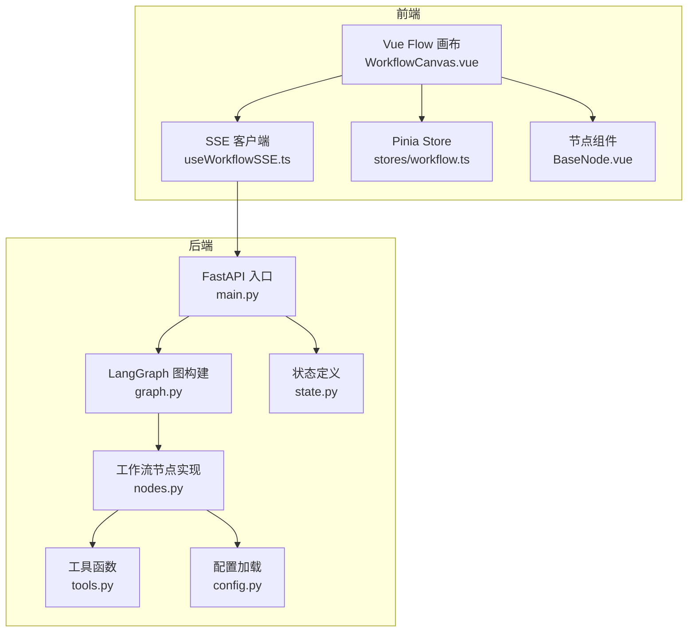
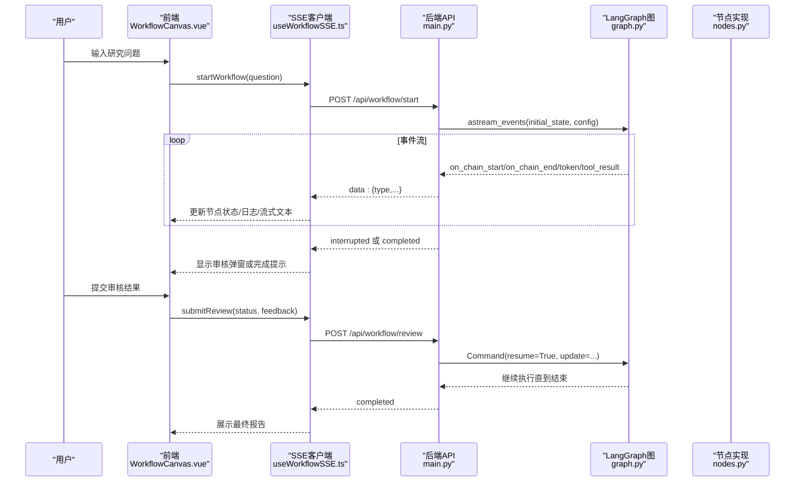
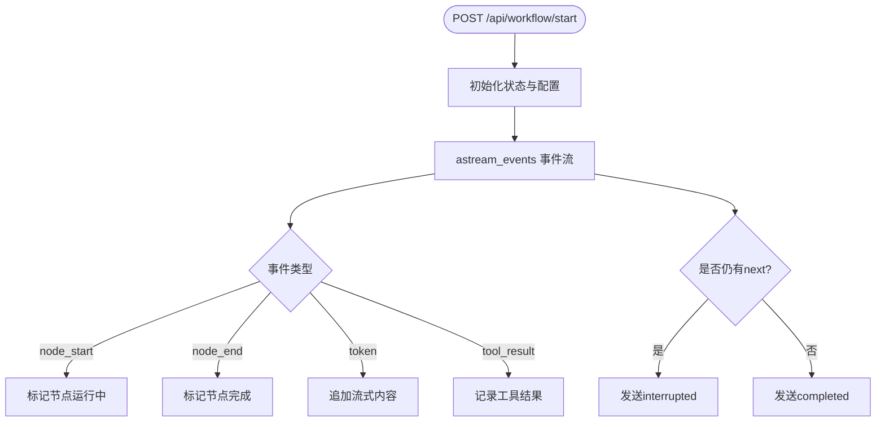
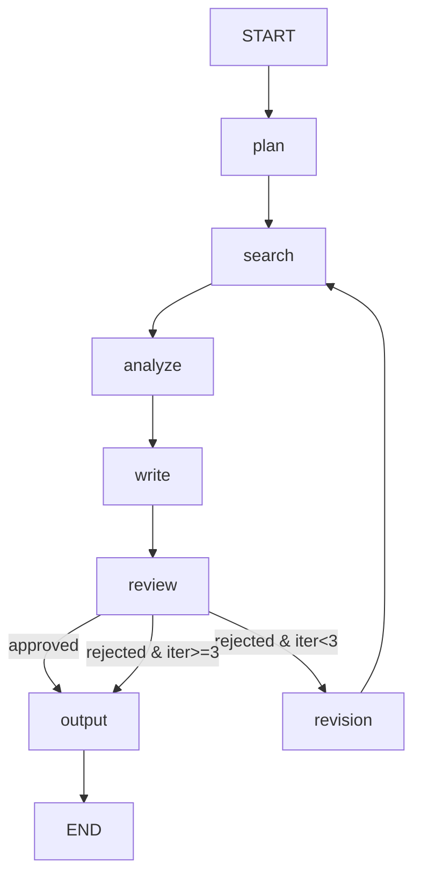
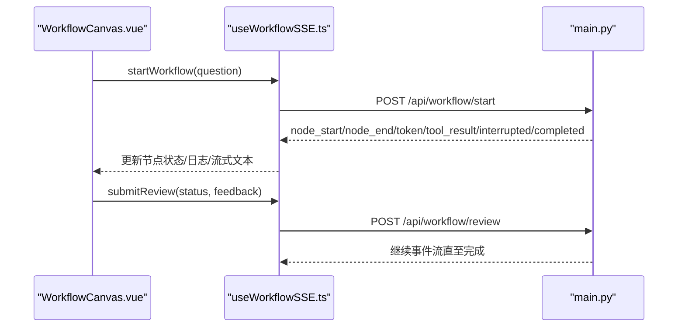
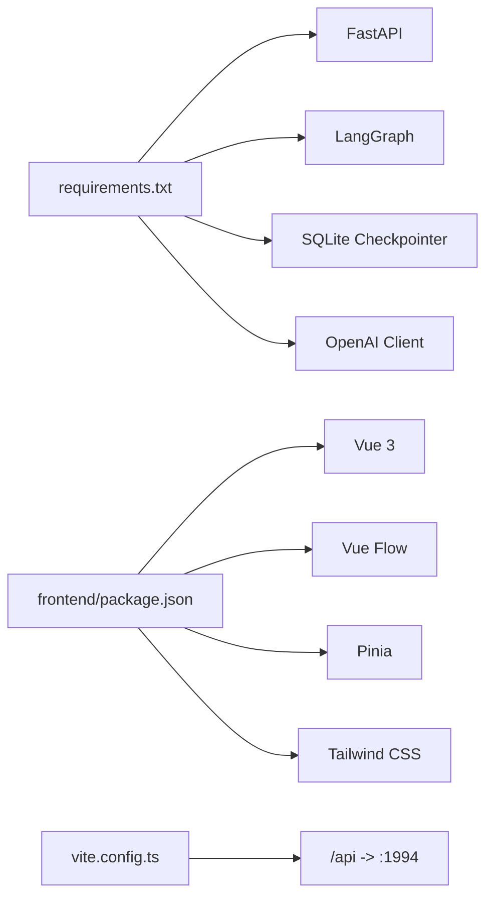

# 开发指南

<cite>
**本文引用的文件**
- [README.md](file://workflow-studio/README.md)
- [main.py](file://workflow-studio/backend/app/main.py)
- [graph.py](file://workflow-studio/backend/app/graph.py)
- [nodes.py](file://workflow-studio/backend/app/nodes.py)
- [state.py](file://workflow-studio/backend/app/state.py)
- [tools.py](file://workflow-studio/backend/app/tools.py)
- [config.py](file://workflow-studio/backend/app/config.py)
- [schemas.py](file://workflow-studio/backend/app/schemas.py)
- [requirements.txt](file://workflow-studio/backend/requirements.txt)
- [WorkflowCanvas.vue](file://workflow-studio/frontend/src/components/WorkflowCanvas.vue)
- [useWorkflowSSE.ts](file://workflow-studio/frontend/src/composables/useWorkflowSSE.ts)
- [workflow.ts（store）](file://workflow-studio/frontend/src/stores/workflow.ts)
- [workflow.ts（类型）](file://workflow-studio/frontend/src/types/workflow.ts)
- [BaseNode.vue](file://workflow-studio/frontend/src/components/nodes/BaseNode.vue)
- [vite.config.ts](file://workflow-studio/frontend/vite.config.ts)
- [package.json](file://workflow-studio/frontend/package.json)
</cite>

## 目录
1. [简介](#简介)
2. [项目结构](#项目结构)
3. [核心组件](#核心组件)
4. [架构总览](#架构总览)
5. [详细组件分析](#详细组件分析)
6. [依赖关系分析](#依赖关系分析)
7. [性能考虑](#性能考虑)
8. [故障排查指南](#故障排查指南)
9. [结论](#结论)
10. [附录](#附录)

## 简介
本指南面向希望参与 Workflow Studio 开发与扩展的工程师，涵盖代码规范、开发流程、调试技巧与最佳实践。重点说明如何添加新的工作流节点、扩展前端组件、集成第三方工具，并给出单元测试与集成测试策略、代码质量检查建议，以及开发环境配置、热重载设置与性能分析方法，帮助高效贡献与扩展功能。

## 项目结构
- 后端采用 FastAPI + LangGraph，提供 SSE 实时事件流、工作流启动/恢复、状态查询与图结构接口；使用 SQLite 检查点持久化。
- 前端基于 Vue 3 + Vue Flow + Pinia + Tailwind CSS，通过 SSE 消费后端事件，驱动画布节点状态与边动画。

图表来源
- [main.py:14-200](file://workflow-studio/backend/app/main.py#L14-L200)
- [graph.py:1-78](file://workflow-studio/backend/app/graph.py#L1-L78)
- [nodes.py:1-129](file://workflow-studio/backend/app/nodes.py#L1-L129)
- [state.py:1-30](file://workflow-studio/backend/app/state.py#L1-L30)
- [tools.py:1-26](file://workflow-studio/backend/app/tools.py#L1-L26)
- [config.py:1-9](file://workflow-studio/backend/app/config.py#L1-L9)
- [WorkflowCanvas.vue:1-133](file://workflow-studio/frontend/src/components/WorkflowCanvas.vue#L1-L133)
- [useWorkflowSSE.ts:1-172](file://workflow-studio/frontend/src/composables/useWorkflowSSE.ts#L1-L172)
- [workflow.ts（store）:1-75](file://workflow-studio/frontend/src/stores/workflow.ts#L1-L75)
- [BaseNode.vue:1-82](file://workflow-studio/frontend/src/components/nodes/BaseNode.vue#L1-L82)

章节来源
- [README.md:15-91](file://workflow-studio/README.md#L15-L91)
- [vite.config.ts:1-22](file://workflow-studio/frontend/vite.config.ts#L1-L22)
- [package.json:1-32](file://workflow-studio/frontend/package.json#L1-L32)

## 核心组件
- 后端 API：提供启动工作流、人工审核恢复、获取状态与图结构的 SSE 接口。
- LangGraph 图：定义节点、边与条件路由，并在审核前中断以支持人机协作。
- 节点实现：规划、搜索、分析、写作、审核、修订、输出等节点逻辑。
- 前端画布：基于 Vue Flow 渲染节点与边，响应 SSE 事件更新状态与动画。
- SSE 客户端：解析事件流，维护节点状态、日志、流式文本与中断状态。
- 类型与 Store：统一前后端数据契约，集中管理工作流状态。

章节来源
- [main.py:34-200](file://workflow-studio/backend/app/main.py#L34-L200)
- [graph.py:23-78](file://workflow-studio/backend/app/graph.py#L23-L78)
- [nodes.py:18-129](file://workflow-studio/backend/app/nodes.py#L18-L129)
- [WorkflowCanvas.vue:35-133](file://workflow-studio/frontend/src/components/WorkflowCanvas.vue#L35-L133)
- [useWorkflowSSE.ts:19-172](file://workflow-studio/frontend/src/composables/useWorkflowSSE.ts#L19-L172)
- [workflow.ts（类型）:1-64](file://workflow-studio/frontend/src/types/workflow.ts#L1-L64)
- [workflow.ts（store）:1-75](file://workflow-studio/frontend/src/stores/workflow.ts#L1-L75)

## 架构总览
系统由“前端可视化 + 后端工作流引擎”组成，通过 SSE 进行双向交互：前端发起请求，后端逐步推送执行事件；在审核节点暂停，等待前端提交结果后恢复执行。

图表来源
- [main.py:34-154](file://workflow-studio/backend/app/main.py#L34-L154)
- [graph.py:23-78](file://workflow-studio/backend/app/graph.py#L23-L78)
- [nodes.py:18-129](file://workflow-studio/backend/app/nodes.py#L18-L129)
- [useWorkflowSSE.ts:74-157](file://workflow-studio/frontend/src/composables/useWorkflowSSE.ts#L74-L157)
- [WorkflowCanvas.vue:85-127](file://workflow-studio/frontend/src/components/WorkflowCanvas.vue#L85-L127)

## 详细组件分析

### 后端 API 与服务编排
- 启动工作流：创建初始状态，按 v2 版本订阅事件流，过滤关键事件并转发给前端；结束时判断是否被中断。
- 人工审核恢复：根据 workflow_id 恢复执行，注入审核结果，继续事件流直至完成或再次中断。
- 状态与图结构：提供当前状态查询与静态图结构返回，便于前端渲染与恢复。

图表来源
- [main.py:34-103](file://workflow-studio/backend/app/main.py#L34-L103)
- [main.py:106-154](file://workflow-studio/backend/app/main.py#L106-L154)

章节来源
- [main.py:34-200](file://workflow-studio/backend/app/main.py#L34-L200)

### LangGraph 工作流图与节点
- 图构建：线性流程 plan→search→analyze→write→review，审核后条件分支至 output 或 revision，revision 回到 search；output 后结束。
- 中断机制：在 review 前中断，等待人工审核。
- 防循环：迭代计数超过阈值时强制输出。

图表来源
- [graph.py:23-62](file://workflow-studio/backend/app/graph.py#L23-L62)
- [graph.py:65-78](file://workflow-studio/backend/app/graph.py#L65-L78)
- [nodes.py:18-129](file://workflow-studio/backend/app/nodes.py#L18-L129)

章节来源
- [graph.py:1-78](file://workflow-studio/backend/app/graph.py#L1-L78)
- [nodes.py:18-129](file://workflow-studio/backend/app/nodes.py#L18-L129)
- [state.py:1-30](file://workflow-studio/backend/app/state.py#L1-L30)

### 前端画布与 SSE 客户端
- 画布：使用 Vue Flow 渲染节点与边，监听节点点击，依据 SSE 状态更新节点样式与边动画。
- SSE 客户端：解析事件流，维护节点状态、日志、流式文本、中断与工作流 ID；提供启动与审核提交方法。
- 类型与 Store：定义节点状态、事件类型与图结构；Store 提供计算属性与重置能力。

图表来源
- [WorkflowCanvas.vue:85-127](file://workflow-studio/frontend/src/components/WorkflowCanvas.vue#L85-L127)
- [useWorkflowSSE.ts:74-157](file://workflow-studio/frontend/src/composables/useWorkflowSSE.ts#L74-L157)
- [main.py:34-154](file://workflow-studio/backend/app/main.py#L34-L154)

章节来源
- [WorkflowCanvas.vue:1-133](file://workflow-studio/frontend/src/components/WorkflowCanvas.vue#L1-L133)
- [useWorkflowSSE.ts:1-172](file://workflow-studio/frontend/src/composables/useWorkflowSSE.ts#L1-L172)
- [workflow.ts（类型）:1-64](file://workflow-studio/frontend/src/types/workflow.ts#L1-L64)
- [workflow.ts（store）:1-75](file://workflow-studio/frontend/src/stores/workflow.ts#L1-L75)

### 节点组件与样式
- BaseNode 根据节点类型与状态动态渲染图标、边框与文字颜色，支持运行中旋转动画与耗时显示。
- 通过 props.data.nodeType 与 data.status 控制视觉反馈，便于快速定位执行阶段。

章节来源
- [BaseNode.vue:1-82](file://workflow-studio/frontend/src/components/nodes/BaseNode.vue#L1-L82)

## 依赖关系分析
- 后端依赖：FastAPI、LangGraph、SQLite 检查点、OpenAI 客户端、SSE 支持。
- 前端依赖：Vue 3、Vue Flow、Pinia、Tailwind CSS、TypeScript。
- 代理与端口：Vite 开发服务器将 /api 请求代理到后端 1994 端口，前端默认 1993 端口。

图表来源
- [requirements.txt:1-10](file://workflow-studio/backend/requirements.txt#L1-L10)
- [package.json:1-32](file://workflow-studio/frontend/package.json#L1-L32)
- [vite.config.ts:12-20](file://workflow-studio/frontend/vite.config.ts#L12-L20)

章节来源
- [requirements.txt:1-10](file://workflow-studio/backend/requirements.txt#L1-L10)
- [package.json:1-32](file://workflow-studio/frontend/package.json#L1-L32)
- [vite.config.ts:1-22](file://workflow-studio/frontend/vite.config.ts#L1-L22)

## 性能考虑
- 事件流优化：仅对关键节点名过滤事件，减少不必要的数据传输。
- 前端渲染：仅在节点状态变化时更新 nodes/edges，避免全量重绘。
- 检查点：使用 SQLite 检查点持久化状态，支持刷新恢复；生产环境可替换为 PostgreSQL。
- LLM 调用：合理设置 temperature 与模型选择，结合重试与超时策略。
- 并发与资源：确保后端进程数与线程池配置匹配负载；前端限制并行请求。

[本节为通用指导，不直接分析具体文件]

## 故障排查指南
- 无法连接后端：确认后端已启动且端口 1994 可用；检查 CORS 配置允许前端域名。
- SSE 无事件：检查后端事件流是否正常返回；浏览器开发者工具 Network 面板查看 text/event-stream。
- 审核未触发：确认 graph 编译时 interrupt_before 包含 review；检查状态 next 是否为空。
- 前端代理失败：确认 vite.config.ts 中 /api 代理目标地址正确；防火墙与跨域设置无误。
- 环境变量缺失：检查 .env 是否包含 OPENAI_API_KEY、LLM_MODEL 等必要变量。

章节来源
- [main.py:16-21](file://workflow-studio/backend/app/main.py#L16-L21)
- [graph.py:65-78](file://workflow-studio/backend/app/graph.py#L65-L78)
- [vite.config.ts:12-20](file://workflow-studio/frontend/vite.config.ts#L12-L20)
- [config.py:1-9](file://workflow-studio/backend/app/config.py#L1-L9)

## 结论
Workflow Studio 通过 LangGraph 与 Vue Flow 实现了可视化、可中断、可恢复的多 Agent 工作流。遵循本指南的规范与实践，开发者可以高效地扩展节点、增强前端交互、集成外部工具，并确保系统的稳定性与可维护性。

[本节为总结，不直接分析具体文件]

## 附录

### 开发环境配置与热重载
- 后端：安装依赖，复制 .env.example 为 .env 并填写密钥；使用 uvicorn 启动并开启 --reload。
- 前端：安装依赖，运行 dev 脚本；Vite 自动热重载，代理 /api 到后端。

章节来源
- [README.md:23-45](file://workflow-studio/README.md#L23-L45)
- [requirements.txt:1-10](file://workflow-studio/backend/requirements.txt#L1-L10)
- [package.json:6-10](file://workflow-studio/frontend/package.json#L6-L10)
- [vite.config.ts:12-20](file://workflow-studio/frontend/vite.config.ts#L12-L20)

### 代码规范与风格建议
- Python：遵循 PEP 8；异步函数使用 async/await；错误处理统一捕获并返回结构化消息。
- TypeScript/Vue：使用严格模式；组件 Props 与 Emits 明确类型；状态变更保持不可变更新。
- 命名：模块与函数语义清晰；常量与配置集中管理。

[本节为通用指导，不直接分析具体文件]

### 新增工作流节点（后端）
步骤：
1. 在 nodes.py 中实现新节点的异步函数，读取 state 并返回增量更新。
2. 在 graph.py 中添加节点与边，必要时增加条件路由。
3. 如需中断，调整 interrupt_before 列表。
4. 更新 schemas 与状态定义（如需要）。
5. 前端无需改动即可看到新节点（若沿用默认图结构），或通过 /api/workflow/graph-structure 扩展。

章节来源
- [nodes.py:18-129](file://workflow-studio/backend/app/nodes.py#L18-L129)
- [graph.py:23-78](file://workflow-studio/backend/app/graph.py#L23-L78)
- [state.py:1-30](file://workflow-studio/backend/app/state.py#L1-L30)
- [schemas.py:1-12](file://workflow-studio/backend/app/schemas.py#L1-L12)
- [main.py:176-200](file://workflow-studio/backend/app/main.py#L176-L200)

### 扩展前端组件
步骤：
1. 在 components/nodes 下新增自定义节点组件，遵循 BaseNode 的 props/data 约定。
2. 在 WorkflowCanvas.vue 中注册节点类型，或在 graph-structure 中声明节点布局。
3. 在 useWorkflowSSE.ts 中处理新的事件类型或字段。
4. 使用 Tailwind 类进行样式定制，保持主题一致。

章节来源
- [WorkflowCanvas.vue:50-74](file://workflow-studio/frontend/src/components/WorkflowCanvas.vue#L50-L74)
- [BaseNode.vue:1-82](file://workflow-studio/frontend/src/components/nodes/BaseNode.vue#L1-L82)
- [useWorkflowSSE.ts:19-72](file://workflow-studio/frontend/src/composables/useWorkflowSSE.ts#L19-L72)

### 集成第三方工具
- 在后端 tools.py 中新增 @tool 装饰的函数，封装外部 API 调用与错误处理。
- 在 nodes.py 中调用工具，并将结果写入 state。
- 在前端通过 tool_result 事件展示工具输出摘要。

章节来源
- [tools.py:1-26](file://workflow-studio/backend/app/tools.py#L1-L26)
- [nodes.py:43-60](file://workflow-studio/backend/app/nodes.py#L43-L60)
- [useWorkflowSSE.ts:41-45](file://workflow-studio/frontend/src/composables/useWorkflowSSE.ts#L41-L45)

### 单元测试编写
- 后端：
  - 针对 nodes.py 中的每个节点函数编写异步测试，模拟 LLM 与工具调用。
  - 验证状态更新是否符合预期，边界情况（如 JSON 解析失败）有降级处理。
  - 使用 pytest 与 httpx 测试 API 端点，覆盖正常与异常路径。
- 前端：
  - 使用 Vitest + Vue Test Utils 对 composable 与组件进行单元测试。
  - 模拟 fetch/SSE 事件，验证状态更新与 UI 行为。

[本节为通用指导，不直接分析具体文件]

### 集成测试策略
- 端到端：启动前后端服务，通过浏览器或自动化脚本触发工作流，验证从启动到完成的完整链路。
- 中断恢复：在审核节点提交不同结果，验证分支逻辑与循环上限。
- 持久化：重启后端后通过 /api/workflow/state/{workflow_id} 恢复状态。

[本节为通用指导，不直接分析具体文件]

### 代码质量检查
- 后端：使用 ruff/flake8 进行 lint，mypy 进行类型检查；CI 中集成。
- 前端：使用 eslint + prettier；vue-tsc 校验类型；Vitest 覆盖率报告。
- 提交前：pre-commit 钩子自动格式化与检查。

[本节为通用指导，不直接分析具体文件]

### 调试技巧
- 后端：启用 uvicorn --reload；打印关键 state 与事件；使用浏览器网络面板观察 SSE。
- 前端：控制台打印事件流；断点调试 useWorkflowSSE 的事件处理；检查节点状态映射。
- 联调：确保代理配置正确，CORS 允许本地开发域名。

章节来源
- [main.py:60-103](file://workflow-studio/backend/app/main.py#L60-L103)
- [useWorkflowSSE.ts:94-109](file://workflow-studio/frontend/src/composables/useWorkflowSSE.ts#L94-L109)
- [vite.config.ts:12-20](file://workflow-studio/frontend/vite.config.ts#L12-L20)

### 性能分析工具
- 后端：使用 py-spy 或 cProfile 分析热点；监控 LLM 调用耗时与重试次数。
- 前端：浏览器 Performance 面板录制 SSE 事件处理；评估节点渲染开销。
- 指标：收集节点执行时长、Token 消耗（可在节点中记录并展示）。

[本节为通用指导，不直接分析具体文件]