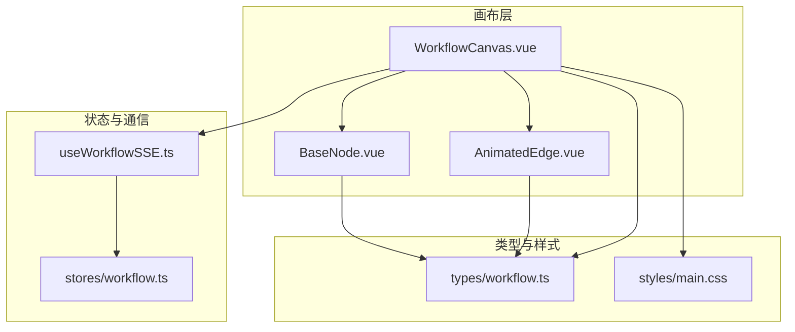
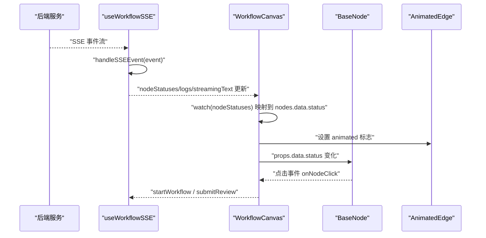
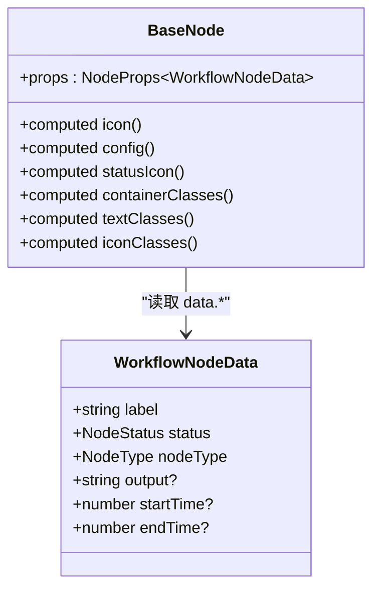
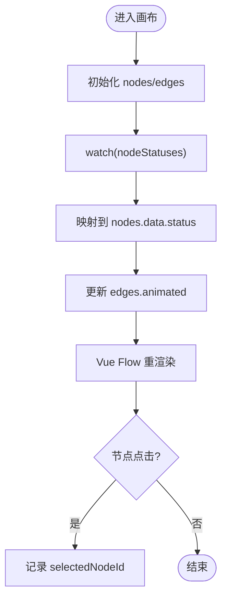
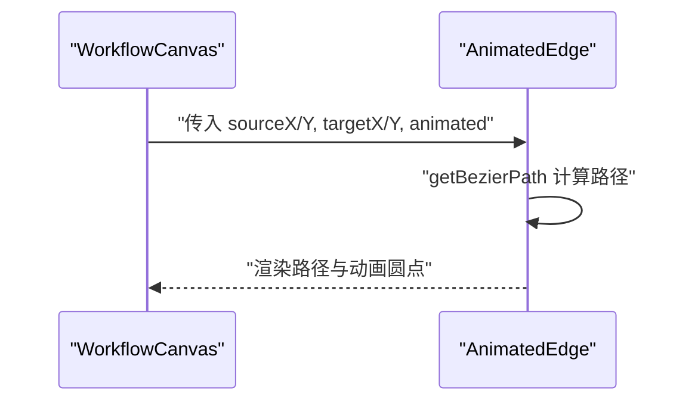
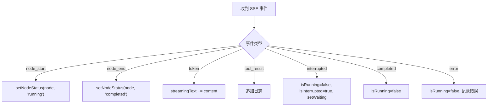
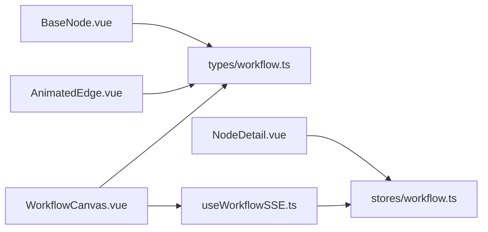

# 前端组件扩展

<cite>
**本文引用的文件**
- [BaseNode.vue](file://workflow-studio/frontend/src/components/nodes/BaseNode.vue)
- [WorkflowCanvas.vue](file://workflow-studio/frontend/src/components/WorkflowCanvas.vue)
- [AnimatedEdge.vue](file://workflow-studio/frontend/src/components/edges/AnimatedEdge.vue)
- [useWorkflowSSE.ts](file://workflow-studio/frontend/src/composables/useWorkflowSSE.ts)
- [workflow.ts](file://workflow-studio/frontend/src/types/workflow.ts)
- [workflow.ts（store）](file://workflow-studio/frontend/src/stores/workflow.ts)
- [NodeDetail.vue](file://workflow-studio/frontend/src/components/panels/NodeDetail.vue)
- [main.css](file://workflow-studio/frontend/src/styles/main.css)
- [package.json](file://workflow-studio/frontend/package.json)
</cite>

## 目录
1. [简介](#简介)
2. [项目结构](#项目结构)
3. [核心组件](#核心组件)
4. [架构总览](#架构总览)
5. [详细组件分析](#详细组件分析)
6. [依赖关系分析](#依赖关系分析)
7. [性能考量](#性能考量)
8. [故障排查指南](#故障排查指南)
9. [结论](#结论)
10. [附录](#附录)

## 简介
本指南面向希望基于 BaseNode 扩展自定义节点可视化组件的前端开发者。内容涵盖：
- 如何定义节点属性、处理事件与定制样式
- Vue Flow 的节点渲染机制以及与后端状态同步方式
- 如何处理节点交互事件，并实现响应式设计与可访问性
- TypeScript 类型系统的使用与扩展工作流类型
- 完整示例：节点状态显示、用户输入处理、动画效果
- 将新组件集成到画布并保持 UI 风格一致

## 项目结构
前端采用 Vue 3 + TypeScript + Vue Flow 构建可视化工作流画布。关键目录与职责：
- components/nodes：节点组件（BaseNode 为基类）
- components/edges：边组件（AnimatedEdge 提供动态边）
- components/panels：面板组件（NodeDetail 展示节点详情）
- composables：组合式逻辑（useWorkflowSSE 负责 SSE 事件与状态更新）
- stores：全局状态（Pinia store 管理工作流状态）
- types：类型定义（工作流节点、边、SSE 事件等）
- styles：全局样式与 Tailwind 配置

图表来源
- [WorkflowCanvas.vue:1-133](file://workflow-studio/frontend/src/components/WorkflowCanvas.vue#L1-L133)
- [BaseNode.vue:1-82](file://workflow-studio/frontend/src/components/nodes/BaseNode.vue#L1-L82)
- [AnimatedEdge.vue:1-48](file://workflow-studio/frontend/src/components/edges/AnimatedEdge.vue#L1-L48)
- [useWorkflowSSE.ts:1-172](file://workflow-studio/frontend/src/composables/useWorkflowSSE.ts#L1-L172)
- [workflow.ts（store）:1-75](file://workflow-studio/frontend/src/stores/workflow.ts#L1-L75)
- [workflow.ts:1-64](file://workflow-studio/frontend/src/types/workflow.ts#L1-L64)
- [main.css:1-36](file://workflow-studio/frontend/src/styles/main.css#L1-L36)

章节来源
- [WorkflowCanvas.vue:1-133](file://workflow-studio/frontend/src/components/WorkflowCanvas.vue#L1-L133)
- [package.json:1-32](file://workflow-studio/frontend/package.json#L1-L32)

## 核心组件
- BaseNode：基础节点可视化组件，封装了图标、状态、执行耗时、连接点（Handle）等通用能力。
- WorkflowCanvas：Vue Flow 画布容器，注册节点类型、维护节点与边数据、监听 SSE 状态变化以驱动视图更新。
- AnimatedEdge：自定义边组件，支持根据运行状态动态绘制路径与动画指示器。
- useWorkflowSSE：通过 Server-Sent Events 接收后端事件，统一更新节点状态、日志、流式文本等。
- Pinia Store：集中管理工作流状态，提供查询与操作方法。
- NodeDetail：右侧面板中用于展示选中节点的详细信息。

章节来源
- [BaseNode.vue:1-82](file://workflow-studio/frontend/src/components/nodes/BaseNode.vue#L1-L82)
- [WorkflowCanvas.vue:1-133](file://workflow-studio/frontend/src/components/WorkflowCanvas.vue#L1-L133)
- [AnimatedEdge.vue:1-48](file://workflow-studio/frontend/src/components/edges/AnimatedEdge.vue#L1-L48)
- [useWorkflowSSE.ts:1-172](file://workflow-studio/frontend/src/composables/useWorkflowSSE.ts#L1-L172)
- [workflow.ts（store）:1-75](file://workflow-studio/frontend/src/stores/workflow.ts#L1-L75)
- [NodeDetail.vue:1-36](file://workflow-studio/frontend/src/components/panels/NodeDetail.vue#L1-L36)

## 架构总览
整体数据流：
- 后端通过 SSE 推送事件（node_start、node_end、token、tool_result、interrupted、completed、error）。
- useWorkflowSSE 解析事件并更新 nodeStatuses、logs、streamingText 等状态。
- WorkflowCanvas 通过 watch 监听 nodeStatuses 变化，映射回 nodes 的 data.status，并联动边的动画。
- BaseNode 读取 data.status、data.nodeType、时间戳等，渲染不同样式与图标。
- NodeDetail 从 store 获取当前选中节点的状态进行展示。

图表来源
- [useWorkflowSSE.ts:19-72](file://workflow-studio/frontend/src/composables/useWorkflowSSE.ts#L19-L72)
- [WorkflowCanvas.vue:95-127](file://workflow-studio/frontend/src/components/WorkflowCanvas.vue#L95-L127)
- [BaseNode.vue:23-81](file://workflow-studio/frontend/src/components/nodes/BaseNode.vue#L23-L81)
- [AnimatedEdge.vue:16-47](file://workflow-studio/frontend/src/components/edges/AnimatedEdge.vue#L16-L47)

## 详细组件分析

### BaseNode：自定义节点基类
- 属性与数据
  - 使用 NodeProps<WorkflowNodeData> 接收节点数据，包含 label、status、nodeType、startTime、endTime 等。
  - 通过 computed 计算图标、状态样式、文本颜色与动画类名。
- 事件与交互
  - 内置 Handle 提供连接点（顶部目标、底部源），便于连线。
  - 点击节点由父级 WorkflowCanvas 捕获并记录 selectedNodeId。
- 样式定制
  - 使用 clsx 组合 Tailwind 类名，按状态切换边框、背景、文字色与阴影。
  - 支持运行态旋转动画、等待态脉冲动画。
- 可扩展点
  - 新增节点类型时，在 nodeTypeIcons 中添加图标映射。
  - 新增状态时，在 statusConfig 与 statusIcons 中补充样式与图标。

图表来源
- [BaseNode.vue:23-81](file://workflow-studio/frontend/src/components/nodes/BaseNode.vue#L23-L81)
- [workflow.ts:10-20](file://workflow-studio/frontend/src/types/workflow.ts#L10-L20)

章节来源
- [BaseNode.vue:1-82](file://workflow-studio/frontend/src/components/nodes/BaseNode.vue#L1-L82)
- [workflow.ts:1-20](file://workflow-studio/frontend/src/types/workflow.ts#L1-L20)

### WorkflowCanvas：画布与状态同步
- 节点与边
  - 通过 v-model:nodes/v-model:edges 双向绑定节点与边。
  - 注册自定义节点类型 custom -> BaseNode。
  - 初始节点与边定义了典型工作流顺序与分支。
- 状态同步
  - 监听 nodeStatuses 变化，将状态映射到 nodes[].data.status，并据此更新边的 animated 标志。
  - 监听 isRunning 控制边的全局动画开关。
- 事件处理
  - onNodeClick 记录选中节点 ID，供侧边面板展示详情。
  - 通过 useWorkflowSSE 暴露的 startWorkflow/submitReview 触发后端流程。

图表来源
- [WorkflowCanvas.vue:50-83](file://workflow-studio/frontend/src/components/WorkflowCanvas.vue#L50-L83)
- [WorkflowCanvas.vue:95-127](file://workflow-studio/frontend/src/components/WorkflowCanvas.vue#L95-L127)
- [WorkflowCanvas.vue:129-131](file://workflow-studio/frontend/src/components/WorkflowCanvas.vue#L129-L131)

章节来源
- [WorkflowCanvas.vue:1-133](file://workflow-studio/frontend/src/components/WorkflowCanvas.vue#L1-L133)

### AnimatedEdge：动态边与动画
- 功能
  - 根据 props.animated 决定路径颜色与是否显示运动圆点。
  - 使用 getBezierPath 计算贝塞尔路径，结合 animateMotion 实现流动动画。
- 集成
  - 在 WorkflowCanvas 中通过 default-edge-options 或 edge 对象的 animated 字段启用。

图表来源
- [AnimatedEdge.vue:16-47](file://workflow-studio/frontend/src/components/edges/AnimatedEdge.vue#L16-L47)
- [WorkflowCanvas.vue:107-127](file://workflow-studio/frontend/src/components/WorkflowCanvas.vue#L107-L127)

章节来源
- [AnimatedEdge.vue:1-48](file://workflow-studio/frontend/src/components/edges/AnimatedEdge.vue#L1-L48)

### useWorkflowSSE：SSE 事件与状态管理
- 事件处理
  - node_start：将对应节点状态设为 running，追加日志。
  - node_end：将节点状态设为 completed，追加日志。
  - token：拼接流式文本。
  - tool_result：截取工具结果追加日志。
  - interrupted：暂停工作流，标记 waiting 节点，记录 workflowId。
  - completed/error：结束运行，记录日志。
- 启动与审核
  - startWorkflow：重置状态，POST 启动接口，读取流式响应并分发事件。
  - submitReview：提交审核结果，恢复运行并继续消费 SSE。

图表来源
- [useWorkflowSSE.ts:19-72](file://workflow-studio/frontend/src/composables/useWorkflowSSE.ts#L19-L72)
- [useWorkflowSSE.ts:74-114](file://workflow-studio/frontend/src/composables/useWorkflowSSE.ts#L74-L114)
- [useWorkflowSSE.ts:116-157](file://workflow-studio/frontend/src/composables/useWorkflowSSE.ts#L116-L157)

章节来源
- [useWorkflowSSE.ts:1-172](file://workflow-studio/frontend/src/composables/useWorkflowSSE.ts#L1-L172)

### NodeDetail：节点详情面板
- 从 store 读取当前选中节点状态，并以不同颜色展示 idle/running/completed/error/waiting。
- 作为右侧面板的一部分，配合 WorkflowCanvas 的选中逻辑使用。

章节来源
- [NodeDetail.vue:1-36](file://workflow-studio/frontend/src/components/panels/NodeDetail.vue#L1-L36)
- [workflow.ts（store）:1-75](file://workflow-studio/frontend/src/stores/workflow.ts#L1-L75)

## 依赖关系分析
- 组件依赖
  - BaseNode 依赖 @vue-flow/core 的 Handle/Position 与 lucide 图标库。
  - WorkflowCanvas 依赖 Vue Flow 核心与插件（Background、Controls、MiniMap）。
  - AnimatedEdge 依赖 @vue-flow/core 的路径计算函数。
- 状态依赖
  - WorkflowCanvas 依赖 useWorkflowSSE 提供的 nodeStatuses、isRunning、logs、streamingText。
  - NodeDetail 依赖 Pinia store 中的 nodeStatuses。
- 类型依赖
  - 所有组件共享 types/workflow.ts 中的 NodeStatus、NodeType、WorkflowNodeData、SSEEvent 等类型。

图表来源
- [BaseNode.vue:23-31](file://workflow-studio/frontend/src/components/nodes/BaseNode.vue#L23-L31)
- [AnimatedEdge.vue:16-20](file://workflow-studio/frontend/src/components/edges/AnimatedEdge.vue#L16-L20)
- [WorkflowCanvas.vue:35-53](file://workflow-studio/frontend/src/components/WorkflowCanvas.vue#L35-L53)
- [useWorkflowSSE.ts:1-13](file://workflow-studio/frontend/src/composables/useWorkflowSSE.ts#L1-L13)
- [workflow.ts（store）:1-15](file://workflow-studio/frontend/src/stores/workflow.ts#L1-L15)
- [workflow.ts:1-64](file://workflow-studio/frontend/src/types/workflow.ts#L1-L64)

章节来源
- [package.json:11-20](file://workflow-studio/frontend/package.json#L11-L20)
- [workflow.ts:1-64](file://workflow-studio/frontend/src/types/workflow.ts#L1-L64)

## 性能考量
- 避免不必要的重渲染
  - 使用 markRaw 注册节点类型，减少 Vue 代理开销。
  - 在 watch 中仅更新必要字段（nodes.data.status、edges.animated）。
- 高效状态更新
  - useWorkflowSSE 对 nodeStatuses 采用不可变更新（对象展开），确保响应式最小化变更。
- 动画与渲染
  - 边的动画仅在 running 且上游节点处于 running/completed 时启用，降低无意义重绘。
- 资源加载
  - 图标来自轻量图标库，按需引入；Tailwind 类名组合减少 CSS 体积。

[本节为通用性能建议，不直接分析具体文件]

## 故障排查指南
- 节点状态不更新
  - 检查 useWorkflowSSE.handleSSEEvent 是否正确分发事件。
  - 确认 WorkflowCanvas 的 watch(nodeStatuses) 已正确映射到 nodes.data.status。
- 边动画异常
  - 检查 edges.animated 的计算逻辑是否与 isRunning 和上游节点状态一致。
  - 确认 main.css 中 .animated 的 dashdraw 动画未被覆盖。
- 事件解析失败
  - 查看 try/catch 块，忽略解析错误的行，必要时增加日志定位。
- 审核中断后无法恢复
  - 确认 submitReview 正确设置 isRunning/isInterrupted，并重新消费 SSE。

章节来源
- [useWorkflowSSE.ts:19-72](file://workflow-studio/frontend/src/composables/useWorkflowSSE.ts#L19-L72)
- [WorkflowCanvas.vue:95-127](file://workflow-studio/frontend/src/components/WorkflowCanvas.vue#L95-L127)
- [main.css:17-35](file://workflow-studio/frontend/src/styles/main.css#L17-L35)

## 结论
本项目提供了基于 BaseNode 的标准化节点开发范式：通过统一的类型定义、SSE 事件驱动的状态同步、以及可复用的边与面板组件，快速扩展新的可视化节点。遵循本文档的指南，你可以：
- 定义节点属性与状态映射
- 处理节点交互事件并与后端状态保持一致
- 定制样式与动画，保持 UI 一致性
- 利用 TypeScript 强化类型安全
- 实现响应式设计与可访问性

[本节为总结性内容，不直接分析具体文件]

## 附录

### 从零创建自定义节点步骤
- 新建组件文件
  - 在 components/nodes 下新建 MyNode.vue，继承 BaseNode 的设计模式（Handle、状态样式、图标映射）。
- 扩展类型系统
  - 在 types/workflow.ts 中扩展 NodeType、WorkflowNodeData 字段，必要时新增 NodeStatus。
- 注册节点类型
  - 在 WorkflowCanvas.vue 的 nodeTypes 中注册 newType -> MyNode。
- 添加节点实例
  - 在 initialNodes 中添加新节点，设置 id、type、position、data（label、status、nodeType、时间戳等）。
- 连接边
  - 在 initialEdges 中添加 source/target，必要时设置 style/label。
- 事件与状态同步
  - 如需用户输入，可在节点内触发 emit 或调用父级方法，通过 useWorkflowSSE 的 startWorkflow/submitReview 与后端交互。
- 样式与可访问性
  - 使用 Tailwind 类名保持风格一致。
  - 为交互元素添加 aria-* 属性与键盘焦点支持（如 tabindex、aria-label）。
- 测试与调试
  - 使用浏览器控制台观察 nodeStatuses 变化与 SSE 事件。
  - 验证边动画与节点状态的一致性。

[本节为概念性指导，不直接分析具体文件]

### 响应式设计与可访问性要点
- 响应式
  - 使用 Tailwind 断点与 flex/grid 布局适配不同屏幕尺寸。
  - 画布区域自适应容器宽度，侧边面板固定宽度并滚动。
- 可访问性
  - 为按钮与可聚焦元素提供语义化标签与提示。
  - 确保颜色对比度满足可读性要求，避免仅用颜色传达状态。
  - 为动画提供 prefers-reduced-motion 降级策略（可通过 CSS 媒体查询控制）。

[本节为通用设计建议，不直接分析具体文件]