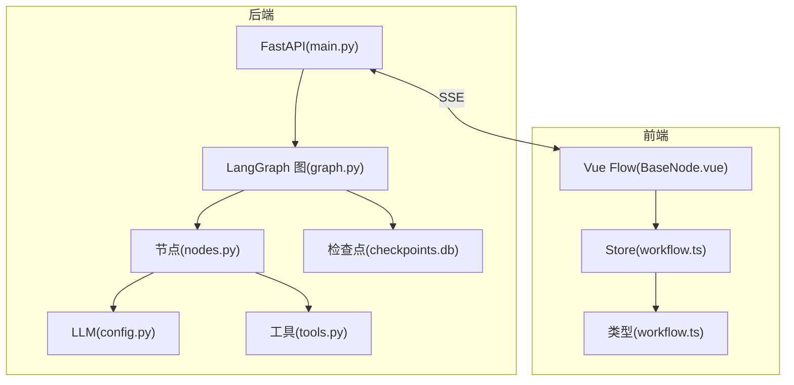
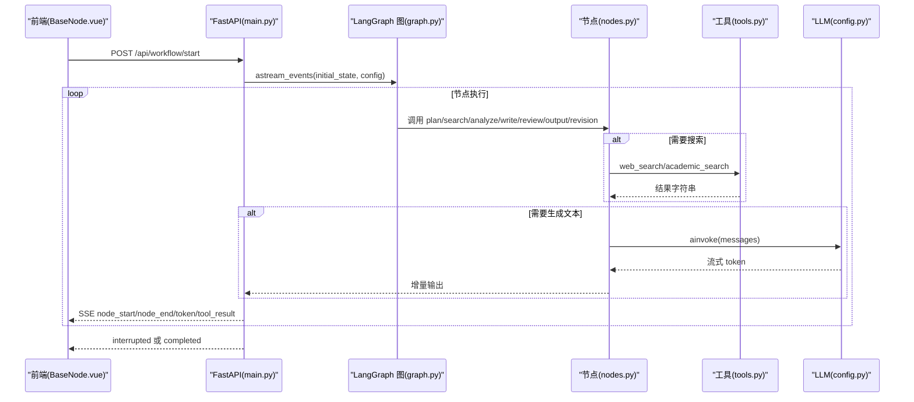
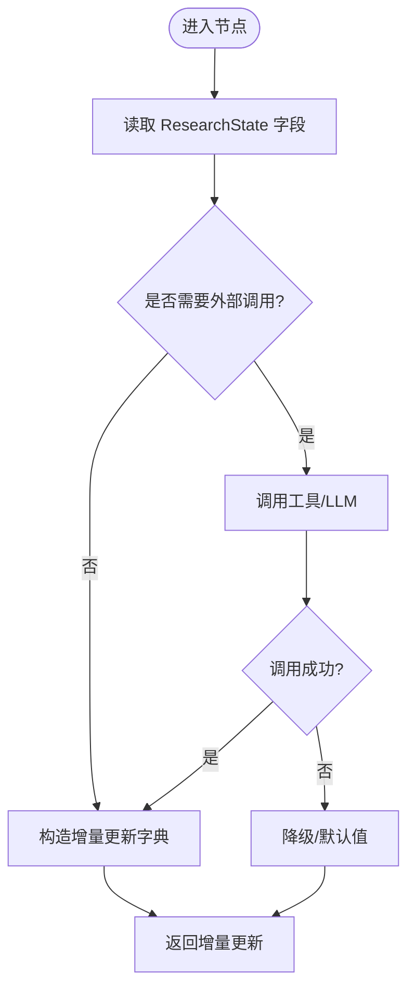
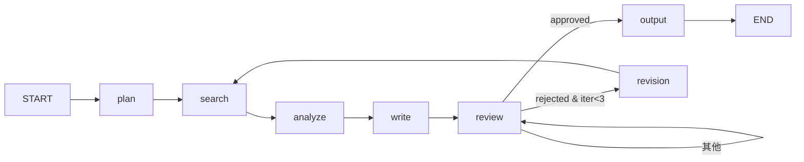
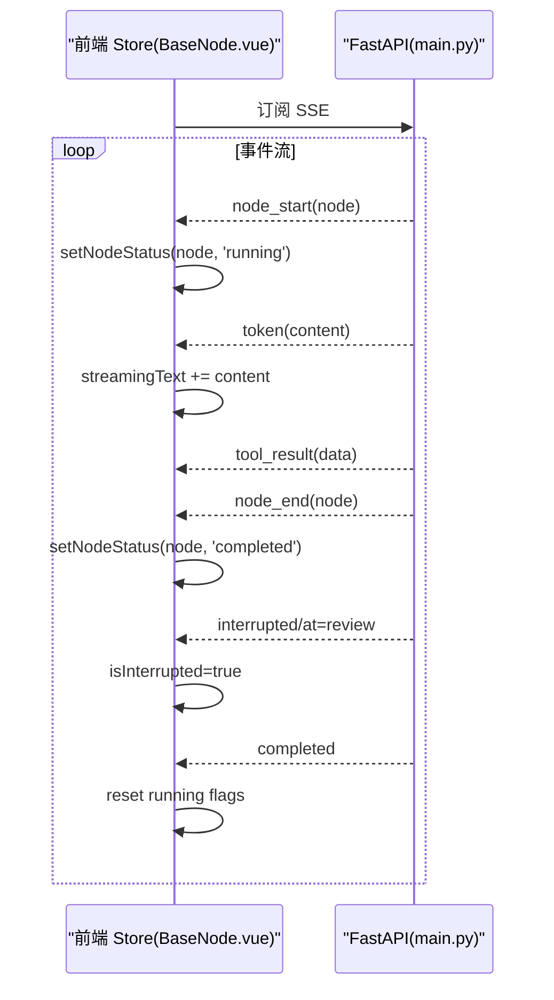
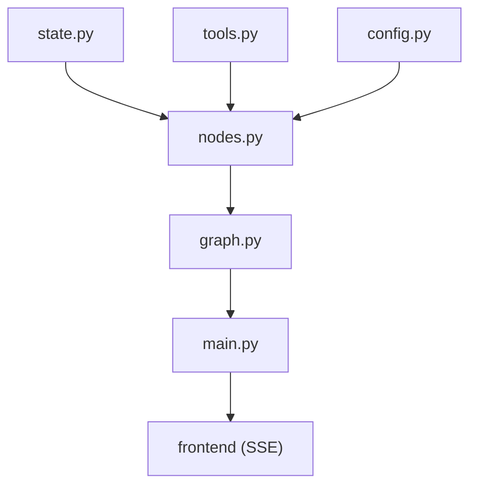

# 工作流节点扩展

<cite>
**本文引用的文件**
- [state.py](file://workflow-studio/backend/app/state.py)
- [nodes.py](file://workflow-studio/backend/app/nodes.py)
- [graph.py](file://workflow-studio/backend/app/graph.py)
- [tools.py](file://workflow-studio/backend/app/tools.py)
- [schemas.py](file://workflow-studio/backend/app/schemas.py)
- [main.py](file://workflow-studio/backend/app/main.py)
- [config.py](file://workflow-studio/backend/app/config.py)
- [workflow.ts](file://workflow-studio/frontend/src/types/workflow.ts)
- [workflow.ts](file://workflow-studio/frontend/src/stores/workflow.ts)
- [BaseNode.vue](file://workflow-studio/frontend/src/components/nodes/BaseNode.vue)
</cite>

## 目录
1. [简介](#简介)
2. [项目结构](#项目结构)
3. [核心组件](#核心组件)
4. [架构总览](#架构总览)
5. [详细组件分析](#详细组件分析)
6. [依赖关系分析](#依赖关系分析)
7. [性能与可扩展性](#性能与可扩展性)
8. [故障排查指南](#故障排查指南)
9. [结论](#结论)
10. [附录：节点开发清单与最佳实践](#附录：节点开发清单与最佳实践)

## 简介
本指南面向希望基于现有模式创建自定义工作流节点的开发者。内容涵盖：
- 如何定义节点函数、处理状态、集成 LLM
- ResearchState 状态模型的使用与跨节点数据传递
- 异步操作与错误处理策略
- 完整示例：规划节点、搜索节点、分析节点的实现模式
- 如何将新节点注册到工作流图，并定义连接关系与条件分支
- 最佳实践与常见陷阱

## 项目结构
后端采用 FastAPI + LangGraph 构建有状态工作流；前端使用 Vue Flow 可视化执行过程并通过 SSE 接收事件。关键文件职责如下：
- 状态模型：ResearchState 定义工作流全局状态
- 节点实现：plan/search/analyze/write/review/output/revision 等节点函数
- 图构建：build_research_graph 组装节点与边，配置中断点
- 工具层：web_search/academic_search 作为可调用工具
- API 层：启动工作流、提交审核、获取状态、获取图结构
- 前端类型与 Store：SSE 事件、节点状态、图结构类型与状态管理
- 基础节点 UI：BaseNode 展示节点图标、状态、耗时

图表来源
- [main.py:34-103](file://workflow-studio/backend/app/main.py#L34-L103)
- [graph.py:23-77](file://workflow-studio/backend/app/graph.py#L23-L77)
- [nodes.py:18-128](file://workflow-studio/backend/app/nodes.py#L18-L128)
- [tools.py:4-25](file://workflow-studio/backend/app/tools.py#L4-L25)
- [config.py:6-8](file://workflow-studio/backend/app/config.py#L6-L8)
- [BaseNode.vue:1-82](file://workflow-studio/frontend/src/components/nodes/BaseNode.vue#L1-L82)
- [workflow.ts(类型):1-64](file://workflow-studio/frontend/src/types/workflow.ts#L1-L64)
- [workflow.ts(Store):1-75](file://workflow-studio/frontend/src/stores/workflow.ts#L1-L75)

章节来源
- [main.py:34-200](file://workflow-studio/backend/app/main.py#L34-L200)
- [graph.py:23-77](file://workflow-studio/backend/app/graph.py#L23-L77)
- [nodes.py:18-128](file://workflow-studio/backend/app/nodes.py#L18-L128)
- [tools.py:4-25](file://workflow-studio/backend/app/tools.py#L4-L25)
- [config.py:6-8](file://workflow-studio/backend/app/config.py#L6-L8)
- [workflow.ts(类型):1-64](file://workflow-studio/frontend/src/types/workflow.ts#L1-L64)
- [workflow.ts(Store):1-75](file://workflow-studio/frontend/src/stores/workflow.ts#L1-L75)
- [BaseNode.vue:1-82](file://workflow-studio/frontend/src/components/nodes/BaseNode.vue#L1-L82)

## 核心组件
- ResearchState：统一的状态容器，包含消息历史、控制字段（当前步骤、迭代次数）、研究内容（问题、计划、搜索结果、分析、报告）、人工审核字段与元数据。
- 节点函数：每个节点接收 ResearchState，返回增量更新字典，由 LangGraph 合并到状态中。
- 图构建：声明式添加节点与边，支持条件分支与循环，设置中断点以支持“人在回路”。
- 工具：通过 @tool 装饰器暴露可被节点调用的能力（如搜索）。
- API：提供启动、恢复、查询状态、获取图结构等接口，并以 SSE 推送事件。
- 前端：基于 Vue Flow 渲染图，监听 SSE 事件驱动节点状态与日志。

章节来源
- [state.py:5-30](file://workflow-studio/backend/app/state.py#L5-L30)
- [nodes.py:18-128](file://workflow-studio/backend/app/nodes.py#L18-L128)
- [graph.py:23-77](file://workflow-studio/backend/app/graph.py#L23-L77)
- [tools.py:4-25](file://workflow-studio/backend/app/tools.py#L4-L25)
- [main.py:34-200](file://workflow-studio/backend/app/main.py#L34-L200)
- [workflow.ts(类型):1-64](file://workflow-studio/frontend/src/types/workflow.ts#L1-L64)
- [workflow.ts(Store):1-75](file://workflow-studio/frontend/src/stores/workflow.ts#L1-L75)

## 架构总览
下图展示了从前端发起请求到后端执行工作流、再回推事件的端到端流程。

图表来源
- [main.py:34-103](file://workflow-studio/backend/app/main.py#L34-L103)
- [graph.py:23-77](file://workflow-studio/backend/app/graph.py#L23-L77)
- [nodes.py:18-128](file://workflow-studio/backend/app/nodes.py#L18-L128)
- [tools.py:4-25](file://workflow-studio/backend/app/tools.py#L4-L25)
- [config.py:6-8](file://workflow-studio/backend/app/config.py#L6-L8)

## 详细组件分析

### 状态模型 ResearchState
- 作用：承载工作流全生命周期数据，包括消息历史、控制字段、研究内容与审核信息。
- 关键字段：
  - messages：用于记录节点间对话与系统提示，便于调试与回放
  - current_step：当前执行节点标识，便于前端高亮与定位
  - iteration_count：防止无限循环的计数器
  - original_question/research_plan/search_results/analysis/draft_report/final_report：研究流水线各阶段产物
  - review_status/review_feedback：人工审核状态与反馈
  - workflow_id/started_at/completed_at：元数据追踪
- 使用方式：节点函数读取所需字段，返回增量更新字典，LangGraph 自动合并到状态。

章节来源
- [state.py:5-30](file://workflow-studio/backend/app/state.py#L5-L30)

### 节点函数与状态处理
- 规划节点 plan_node
  - 输入：original_question
  - 行为：调用 LLM 将问题拆解为子问题列表
  - 输出：research_plan、current_step、messages
- 搜索节点 search_node
  - 输入：research_plan
  - 行为：对每个子问题调用 web_search，收集结果与时间戳
  - 输出：search_results、current_step、messages
- 分析节点 analyze_node
  - 输入：original_question、search_results
  - 行为：拼接上下文后调用 LLM 进行综合分析
  - 输出：analysis、current_step、messages
- 写作节点 write_node
  - 输入：original_question、analysis、review_feedback（可选）
  - 行为：调用 LLM 生成结构化报告草稿
  - 输出：draft_report、current_step、messages
- 审核节点 review_node
  - 行为：标记 pending，等待人工审核（中断点）
  - 输出：current_step、review_status、messages
- 修订节点 revision_node
  - 行为：递增 iteration_count，触发重新搜索
  - 输出：iteration_count、current_step、messages
- 输出节点 output_node
  - 行为：复制草稿为最终报告，记录完成时间
  - 输出：final_report、current_step、completed_at、messages

图表来源
- [nodes.py:18-128](file://workflow-studio/backend/app/nodes.py#L18-L128)
- [tools.py:4-25](file://workflow-studio/backend/app/tools.py#L4-L25)
- [config.py:6-8](file://workflow-studio/backend/app/config.py#L6-L8)

章节来源
- [nodes.py:18-128](file://workflow-studio/backend/app/nodes.py#L18-L128)

### 图构建与条件分支
- 节点注册：通过 add_node 将函数映射到节点名
- 边定义：线性流程 START -> plan -> search -> analyze -> write -> review -> output
- 条件分支：在 review 后根据 review_status 与 iteration_count 决定输出或修订
- 循环：revision -> search 形成“修订-搜索”闭环，iteration_count 限制最大轮数
- 中断：interrupt_before=["review"] 使工作流在审核前暂停，等待人工提交

图表来源
- [graph.py:23-77](file://workflow-studio/backend/app/graph.py#L23-L77)

章节来源
- [graph.py:23-77](file://workflow-studio/backend/app/graph.py#L23-L77)

### 工具与 LLM 集成
- 工具：@tool 装饰器暴露 web_search、academic_search，供节点同步调用
- LLM：通过 ChatOpenAI 实例，使用 ainvoke 进行异步调用，支持流式 token 推送
- 配置：OPENAI_API_KEY、OPENAI_BASE_URL、LLM_MODEL 从环境变量加载

章节来源
- [tools.py:4-25](file://workflow-studio/backend/app/tools.py#L4-L25)
- [config.py:6-8](file://workflow-studio/backend/app/config.py#L6-L8)
- [nodes.py:10-15](file://workflow-studio/backend/app/nodes.py#L10-L15)

### 前端事件与状态管理
- SSE 事件类型：node_start、node_end、token、tool_result、interrupted、completed、error
- Store：维护 workflowId、nodeStatuses、logs、isRunning、isInterrupted、streamingText、graphStructure
- BaseNode：根据 data.nodeType 与 data.status 渲染不同样式与图标，显示执行耗时

图表来源
- [main.py:60-103](file://workflow-studio/backend/app/main.py#L60-L103)
- [workflow.ts(类型):22-43](file://workflow-studio/frontend/src/types/workflow.ts#L22-L43)
- [workflow.ts(Store):1-75](file://workflow-studio/frontend/src/stores/workflow.ts#L1-L75)
- [BaseNode.vue:1-82](file://workflow-studio/frontend/src/components/nodes/BaseNode.vue#L1-L82)

章节来源
- [main.py:60-103](file://workflow-studio/backend/app/main.py#L60-L103)
- [workflow.ts(类型):22-43](file://workflow-studio/frontend/src/types/workflow.ts#L22-L43)
- [workflow.ts(Store):1-75](file://workflow-studio/frontend/src/stores/workflow.ts#L1-L75)
- [BaseNode.vue:1-82](file://workflow-studio/frontend/src/components/nodes/BaseNode.vue#L1-L82)

## 依赖关系分析
- nodes.py 依赖 state.py、tools.py、config.py
- graph.py 依赖 nodes.py、state.py
- main.py 依赖 graph.py、state.py、schemas.py
- 前端依赖 types/workflow.ts、stores/workflow.ts、components/nodes/BaseNode.vue

图表来源
- [nodes.py:1-15](file://workflow-studio/backend/app/nodes.py#L1-L15)
- [graph.py:1-8](file://workflow-studio/backend/app/graph.py#L1-L8)
- [main.py:1-13](file://workflow-studio/backend/app/main.py#L1-L13)

章节来源
- [nodes.py:1-15](file://workflow-studio/backend/app/nodes.py#L1-L15)
- [graph.py:1-8](file://workflow-studio/backend/app/graph.py#L1-L8)
- [main.py:1-13](file://workflow-studio/backend/app/main.py#L1-L13)

## 性能与可扩展性
- 并发与异步：节点内 LLM 调用使用 ainvoke，避免阻塞；搜索工具可替换为并行调用以提升吞吐
- 流式输出：LLM 流式 token 经 SSE 实时推送，降低首屏延迟
- 检查点持久化：SQLite 检查点支持中断恢复，生产环境建议切换至 PostgreSQL
- 防环机制：iteration_count 限制修订轮数，避免死循环
- 可扩展点：
  - 新增节点：在 nodes.py 实现函数，在 graph.py 注册并连线
  - 新增工具：在 tools.py 增加 @tool 函数，节点按需调用
  - 条件路由：在 graph.py 的条件函数中扩展分支逻辑

[本节为通用指导，不直接分析具体文件]

## 故障排查指南
- 常见问题
  - LLM 调用失败：检查 OPENAI_API_KEY、OPENAI_BASE_URL、LLM_MODEL 配置是否正确
  - JSON 解析异常：规划节点已做降级处理，若仍失败请检查 LLM 返回格式
  - 无限循环：确认 iteration_count 上限与条件路由逻辑
  - 中断未恢复：确保 /api/workflow/review 正确传入 workflow_id 与审核结果
- 定位方法
  - 查看 SSE 事件中的 error 类型消息
  - 通过 /api/workflow/state/{workflow_id} 获取当前状态与 next 节点
  - 检查 checkpoints.db 是否存在对应线程的检查点

章节来源
- [main.py:96-98](file://workflow-studio/backend/app/main.py#L96-L98)
- [main.py:158-173](file://workflow-studio/backend/app/main.py#L158-L173)
- [nodes.py:29-35](file://workflow-studio/backend/app/nodes.py#L29-L35)
- [graph.py:11-20](file://workflow-studio/backend/app/graph.py#L11-L20)

## 结论
本项目提供了完整的“规划-搜索-分析-写作-审核-修订-输出”研究工作流。通过 ResearchState 统一管理状态，节点函数专注业务逻辑，图构建负责流程编排，SSE 实现前后端实时联动。遵循本文档的模式与最佳实践，可快速扩展新的工作流节点与分支逻辑。

[本节为总结性内容，不直接分析具体文件]

## 附录：节点开发清单与最佳实践

### 新增节点步骤
- 在 nodes.py 中实现异步节点函数，签名：async def xxx_node(state: ResearchState) -> dict
- 在 graph.py 中：
  - add_node("xxx", xxx_node)
  - 添加边与条件分支（add_edge/add_conditional_edges）
  - 如需中断，可在 interrupt_before 中添加节点名
- 在 tools.py 中补充工具（如有），并在节点中调用
- 在前端 types/workflow.ts 中扩展 NodeType（如需）
- 测试：启动工作流，观察 SSE 事件与节点状态变化

章节来源
- [nodes.py:18-128](file://workflow-studio/backend/app/nodes.py#L18-L128)
- [graph.py:23-77](file://workflow-studio/backend/app/graph.py#L23-L77)
- [tools.py:4-25](file://workflow-studio/backend/app/tools.py#L4-L25)
- [workflow.ts(类型):6-8](file://workflow-studio/frontend/src/types/workflow.ts#L6-L8)

### 节点间数据传递
- 通过 ResearchState 字段传递：例如 plan_node 写入 research_plan，search_node 读取该字段
- 使用 messages 字段记录节点间通信与调试信息
- 注意增量更新语义：节点只返回变更字段，LangGraph 会合并到状态

章节来源
- [state.py:5-30](file://workflow-studio/backend/app/state.py#L5-L30)
- [nodes.py:18-128](file://workflow-studio/backend/app/nodes.py#L18-L128)

### 异步与错误处理
- 使用 ainvoke 调用 LLM，避免阻塞事件循环
- 对工具调用与 LLM 响应进行 try/except 保护，必要时降级为默认值
- 利用 iteration_count 与条件路由防止异常路径导致的死循环

章节来源
- [nodes.py:29-35](file://workflow-studio/backend/app/nodes.py#L29-L35)
- [graph.py:11-20](file://workflow-studio/backend/app/graph.py#L11-L20)

### 条件分支与循环
- 条件分支：route_after_review 根据 review_status 与 iteration_count 决定输出或修订
- 循环：revision -> search，配合 iteration_count 限制最大轮数

章节来源
- [graph.py:11-20](file://workflow-studio/backend/app/graph.py#L11-L20)
- [graph.py:56-60](file://workflow-studio/backend/app/graph.py#L56-L60)

### 最佳实践
- 节点职责单一：每个节点只做一件事，保持函数简洁
- 明确输入输出：在节点注释中说明期望的 state 字段与返回字段
- 防御性编程：对 LLM 返回进行校验与降级
- 可观测性：通过 messages 与 SSE 事件记录关键步骤
- 安全配置：敏感信息通过环境变量注入，避免硬编码

[本节为通用指导，不直接分析具体文件]