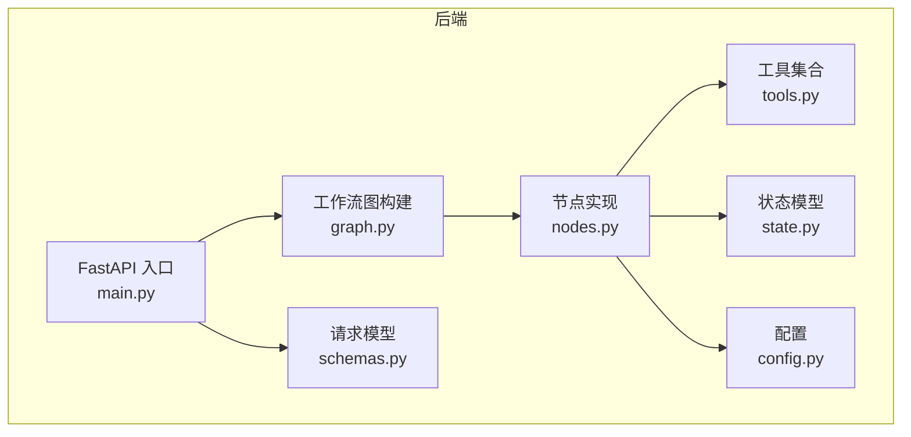
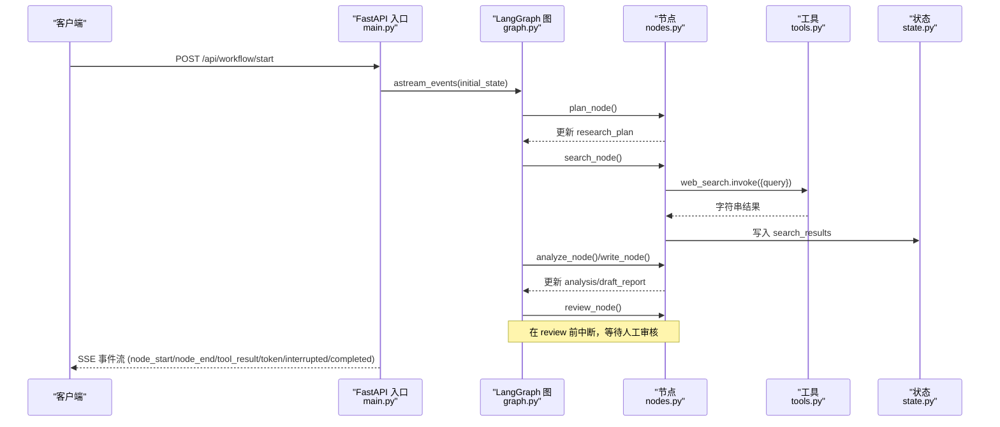
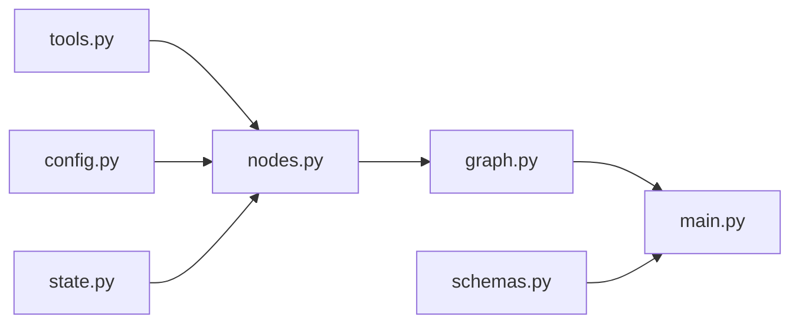

# 工具系统扩展

<cite>
**本文引用的文件**
- [tools.py](file://workflow-studio/backend/app/tools.py)
- [nodes.py](file://workflow-studio/backend/app/nodes.py)
- [graph.py](file://workflow-studio/backend/app/graph.py)
- [main.py](file://workflow-studio/backend/app/main.py)
- [config.py](file://workflow-studio/backend/app/config.py)
- [state.py](file://workflow-studio/backend/app/state.py)
- [schemas.py](file://workflow-studio/backend/app/schemas.py)
- [README.md](file://workflow-studio/README.md)
</cite>

## 目录
1. [简介](#简介)
2. [项目结构](#项目结构)
3. [核心组件](#核心组件)
4. [架构总览](#架构总览)
5. [详细组件分析](#详细组件分析)
6. [依赖关系分析](#依赖关系分析)
7. [性能考虑](#性能考虑)
8. [故障排查指南](#故障排查指南)
9. [结论](#结论)
10. [附录](#附录)

## 简介
本指南面向希望在现有工作流系统中扩展“工具系统”的开发者，目标是：
- 理解并复用现有 web_search 与 academic_search 工具的实现模式
- 掌握自定义搜索工具的接口定义、API 调用封装、结果格式化
- 学习工具配置管理、错误处理机制、日志记录方式
- 完成第三方 API 集成、数据处理管道、缓存策略
- 将新工具注册到系统中并在节点中调用
- 获取性能优化建议与调试技巧

## 项目结构
后端采用 FastAPI + LangGraph 的工作流架构。工具位于 tools.py，节点在 nodes.py 中调用；工作流图在 graph.py 中定义；SSE 事件流与 API 入口在 main.py；配置在 config.py；状态模型在 state.py；请求模型在 schemas.py。

**图表来源**
- [main.py:1-200](file://workflow-studio/backend/app/main.py#L1-L200)
- [graph.py:1-78](file://workflow-studio/backend/app/graph.py#L1-L78)
- [nodes.py:1-129](file://workflow-studio/backend/app/nodes.py#L1-L129)
- [tools.py:1-26](file://workflow-studio/backend/app/tools.py#L1-L26)
- [state.py:1-30](file://workflow-studio/backend/app/state.py#L1-L30)
- [config.py:1-9](file://workflow-studio/backend/app/config.py#L1-L9)
- [schemas.py:1-12](file://workflow-studio/backend/app/schemas.py#L1-L12)

**章节来源**
- [README.md:1-109](file://workflow-studio/README.md#L1-L109)

## 核心组件
- 工具层（tools.py）：使用 @tool 装饰器声明工具函数，当前包含 web_search 与 academic_search，返回字符串格式的结果。
- 节点层（nodes.py）：通过 llm 进行规划、分析、写作；search_node 调用 web_search 工具，收集结果并写入状态。
- 工作流图（graph.py）：定义节点顺序、条件分支与中断点（审核前暂停），支持检查点持久化。
- 服务层（main.py）：提供启动工作流、提交审核、查询状态等 SSE 接口，转发工具执行事件。
- 配置（config.py）：从环境变量加载 LLM 相关配置。
- 状态（state.py）：定义 ResearchState 字段，包括消息历史、研究计划、搜索结果、分析、报告、审核信息等。
- 数据模型（schemas.py）：StartRequest、ReviewRequest 用于 API 输入校验。

**章节来源**
- [tools.py:1-26](file://workflow-studio/backend/app/tools.py#L1-L26)
- [nodes.py:1-129](file://workflow-studio/backend/app/nodes.py#L1-L129)
- [graph.py:1-78](file://workflow-studio/backend/app/graph.py#L1-L78)
- [main.py:1-200](file://workflow-studio/backend/app/main.py#L1-L200)
- [config.py:1-9](file://workflow-studio/backend/app/config.py#L1-L9)
- [state.py:1-30](file://workflow-studio/backend/app/state.py#L1-L30)
- [schemas.py:1-12](file://workflow-studio/backend/app/schemas.py#L1-L12)

## 架构总览
下图展示了从用户发起请求到工具执行、再到结果回传的完整流程，以及工具在节点中的调用位置。

**图表来源**
- [main.py:34-103](file://workflow-studio/backend/app/main.py#L34-L103)
- [graph.py:23-78](file://workflow-studio/backend/app/graph.py#L23-L78)
- [nodes.py:18-129](file://workflow-studio/backend/app/nodes.py#L18-L129)
- [tools.py:4-26](file://workflow-studio/backend/app/tools.py#L4-L26)
- [state.py:5-30](file://workflow-studio/backend/app/state.py#L5-L30)

## 详细组件分析

### 工具接口定义与实现模式
- 工具接口：使用 @tool 装饰器定义函数，参数为查询字符串，返回字符串结果。
- 现有工具：
  - web_search：根据关键词匹配模拟结果或返回通用摘要。
  - academic_search：返回固定格式的学术论文搜索结果摘要。
- 扩展建议：
  - 保持函数签名一致（query -> str），便于统一调用。
  - 若需结构化输出，可在工具内部解析后仍返回字符串，或在节点层做二次解析。

**章节来源**
- [tools.py:4-26](file://workflow-studio/backend/app/tools.py#L4-L26)

### API 调用封装
- 节点内调用：search_node 通过 web_search.invoke({"query": sub_question}) 调用工具，并将结果与时间戳一起写入 search_results。
- 事件透传：main.py 在 on_tool_end 事件中推送 tool_result 给前端，便于实时展示工具执行结果。
- 扩展建议：
  - 对第三方 API 的调用应封装为独立模块，统一异常处理与重试逻辑。
  - 可引入异步调用与超时控制，避免阻塞工作流。

**章节来源**
- [nodes.py:43-60](file://workflow-studio/backend/app/nodes.py#L43-L60)
- [main.py:86-88](file://workflow-studio/backend/app/main.py#L86-L88)

### 结果格式化处理
- 当前工具返回纯文本，节点将其直接存入 search_results 列表。
- 建议在工具层返回标准化 JSON 字符串，或在节点层统一解析为结构化对象，便于后续分析与展示。
- 可扩展：增加元数据（如来源、时间、评分）、分页信息、去重键等。

**章节来源**
- [tools.py:9-19](file://workflow-studio/backend/app/tools.py#L9-L19)
- [nodes.py:47-54](file://workflow-studio/backend/app/nodes.py#L47-L54)

### 扩展现有工具功能
- 替换模拟数据为真实 API：在 web_search 中接入 Tavily/SerpAPI/Bing Search，保持返回字符串格式。
- 多源聚合：在工具内部合并多个来源结果，按相关性排序后返回。
- 过滤与清洗：去除重复项、敏感信息、低质量内容。
- 版本兼容：新增字段时保持向后兼容，避免破坏现有节点逻辑。

**章节来源**
- [tools.py:4-26](file://workflow-studio/backend/app/tools.py#L4-L26)

### 工具的配置管理
- 配置来源：config.py 从环境变量读取 OPENAI_API_KEY、OPENAI_BASE_URL、LLM_MODEL。
- 工具配置建议：
  - 将第三方 API Key、Base URL、超时、重试次数等放入 .env 并通过 config.py 暴露。
  - 提供默认值与校验，避免运行时崩溃。
  - 支持按环境切换（开发/测试/生产）。

**章节来源**
- [config.py:1-9](file://workflow-studio/backend/app/config.py#L1-L9)

### 错误处理机制
- 节点层：plan_node 对 LLM 返回的 JSON 进行解析失败降级处理。
- 服务层：main.py 在事件流中捕获异常并推送 error 事件。
- 工具层建议：
  - 捕获网络异常、超时、HTTP 错误码，转换为统一错误消息。
  - 提供重试与退避策略。
  - 记录详细上下文（请求参数、响应片段）以便调试。

**章节来源**
- [nodes.py:29-35](file://workflow-studio/backend/app/nodes.py#L29-L35)
- [main.py:96-98](file://workflow-studio/backend/app/main.py#L96-L98)

### 日志记录方式
- 当前代码未显式使用日志库。
- 建议：
  - 使用 Python logging 模块，按模块划分日志级别。
  - 记录关键步骤（工具调用开始/结束、错误、耗时）。
  - 在生产环境启用结构化日志（JSON），便于采集与分析。

[本节为通用实践建议，不直接分析具体文件]

### 完整的工具开发示例
以下示例以“学术搜索增强版”为例，说明如何集成第三方 API、构建数据处理管道、加入缓存策略，并在节点中调用。

- 工具接口定义
  - 新建函数 academic_search_enhanced(query: str) -> str，使用 @tool 装饰。
  - 内部调用第三方 API，解析响应为结构化对象，再序列化为字符串返回。

- 数据处理管道
  - 输入清洗：去除多余空格、截断过长查询。
  - 请求构造：组装查询参数、鉴权头。
  - 响应解析：提取标题、摘要、作者、发表年份、DOI。
  - 后处理：去重、排序、过滤低质量结果。

- 缓存策略
  - 基于查询指纹（hash(query)）缓存最近 N 条结果。
  - 设置过期时间与最大容量，避免内存泄漏。
  - 缓存命中直接返回，未命中则调用 API 并写入缓存。

- 节点调用
  - 在 search_node 中新增对 academic_search_enhanced 的调用，将结果追加到 search_results。
  - 保持与其他工具一致的写入格式。

- 配置管理
  - 在 config.py 中添加 ACADEMIC_API_KEY、ACADEMIC_BASE_URL、CACHE_TTL、CACHE_MAX_SIZE。
  - 工具函数读取这些配置。

- 错误处理与日志
  - 捕获异常并记录日志，返回友好错误消息。
  - 在 main.py 的事件流中继续透传 tool_result 与 error。

**章节来源**
- [tools.py:4-26](file://workflow-studio/backend/app/tools.py#L4-L26)
- [nodes.py:43-60](file://workflow-studio/backend/app/nodes.py#L43-L60)
- [config.py:1-9](file://workflow-studio/backend/app/config.py#L1-L9)
- [main.py:86-88](file://workflow-studio/backend/app/main.py#L86-L88)

### 将新工具注册到系统中
- 工具注册：无需额外注册表，直接在 tools.py 中用 @tool 定义即可被 LangChain/LangGraph 识别。
- 节点调用：在 nodes.py 的 search_node 或其他节点中导入并使用工具函数。
- 事件透传：main.py 已自动转发 on_tool_end 事件，无需修改。

**章节来源**
- [tools.py:4-26](file://workflow-studio/backend/app/tools.py#L4-L26)
- [nodes.py:43-60](file://workflow-studio/backend/app/nodes.py#L43-L60)
- [main.py:86-88](file://workflow-studio/backend/app/main.py#L86-L88)

### 在节点中调用自定义工具
- 导入工具：from .tools import your_custom_tool
- 调用方式：your_custom_tool.invoke({"query": sub_question})
- 结果处理：将结果与元数据写入 search_results，确保格式一致。

**章节来源**
- [nodes.py:43-60](file://workflow-studio/backend/app/nodes.py#L43-L60)

### 性能优化建议
- 并发调用：对多个子问题并行调用工具，减少整体耗时。
- 超时与重试：为外部 API 设置合理超时与重试次数。
- 缓存命中：优先命中缓存，降低 API 调用频率。
- 结果裁剪：仅保留必要字段，减少传输与存储开销。
- 流式处理：对大结果集分块处理，避免内存峰值。

[本节为通用实践建议，不直接分析具体文件]

### 调试技巧
- 使用 main.py 的 SSE 事件观察工具执行过程（tool_result、token、interrupted、completed）。
- 在工具函数中加入日志，记录输入参数、响应片段、耗时。
- 利用 checkpointer 持久化状态，刷新页面后恢复执行，便于复现问题。
- 对 LLM 返回进行严格校验，失败时降级处理。

**章节来源**
- [main.py:60-103](file://workflow-studio/backend/app/main.py#L60-L103)
- [graph.py:65-78](file://workflow-studio/backend/app/graph.py#L65-L78)

## 依赖关系分析
- nodes.py 依赖 tools.py 中的工具函数，依赖 config.py 中的 LLM 配置。
- graph.py 依赖 nodes.py 中的节点函数，定义工作流顺序与条件分支。
- main.py 依赖 graph.py 编译后的图，提供 API 与 SSE 事件流。
- state.py 定义全局状态结构，被 nodes.py 与 graph.py 使用。
- schemas.py 定义 API 请求模型，被 main.py 使用。

**图表来源**
- [nodes.py:1-129](file://workflow-studio/backend/app/nodes.py#L1-L129)
- [tools.py:1-26](file://workflow-studio/backend/app/tools.py#L1-L26)
- [graph.py:1-78](file://workflow-studio/backend/app/graph.py#L1-L78)
- [main.py:1-200](file://workflow-studio/backend/app/main.py#L1-L200)
- [state.py:1-30](file://workflow-studio/backend/app/state.py#L1-L30)
- [config.py:1-9](file://workflow-studio/backend/app/config.py#L1-L9)
- [schemas.py:1-12](file://workflow-studio/backend/app/schemas.py#L1-L12)

**章节来源**
- [nodes.py:1-129](file://workflow-studio/backend/app/nodes.py#L1-L129)
- [graph.py:1-78](file://workflow-studio/backend/app/graph.py#L1-L78)
- [main.py:1-200](file://workflow-studio/backend/app/main.py#L1-L200)

## 性能考虑
- 工具调用应尽可能异步化，避免阻塞工作流线程。
- 对高频查询实施缓存，减少重复计算与网络开销。
- 限制单次查询返回结果数量，避免过大负载。
- 监控工具调用耗时与错误率，及时优化瓶颈。
- 在生产环境使用更健壮的持久化存储替代 SQLite。

[本节为通用实践建议，不直接分析具体文件]

## 故障排查指南
- 工具返回非预期格式：检查工具函数返回值是否满足节点期望，必要时在节点层增加解析与容错。
- 工作流中断：确认 review 节点前的中断逻辑是否符合预期，检查审核状态更新是否正确。
- 事件流无输出：检查 main.py 的事件类型过滤与 SSE 响应头设置。
- 配置错误：验证 .env 变量是否正确加载，默认值是否合理。
- 循环过多：检查 iteration_count 与路由逻辑，防止无限修订。

**章节来源**
- [nodes.py:29-35](file://workflow-studio/backend/app/nodes.py#L29-L35)
- [graph.py:11-21](file://workflow-studio/backend/app/graph.py#L11-L21)
- [main.py:60-103](file://workflow-studio/backend/app/main.py#L60-L103)
- [config.py:1-9](file://workflow-studio/backend/app/config.py#L1-L9)

## 结论
本指南基于现有代码库，系统阐述了工具系统的扩展方法与实践要点。通过遵循统一的工具接口、规范的配置管理、完善的错误处理与日志记录，结合缓存与并发优化，可以高效地集成第三方 API 并提升工作流性能。同时，借助 SSE 事件流与检查点机制，开发与调试体验得到显著改善。

[本节为总结性内容，不直接分析具体文件]

## 附录
- 快速开始参考：见 README.md 的后端与前端启动说明。
- API 文档：访问 http://localhost:1994/docs 查看 FastAPI 自动生成的接口文档。
- 前端可视化：Vue Flow 实时渲染工作流执行状态，便于观察节点推进与工具调用结果。

**章节来源**
- [README.md:23-45](file://workflow-studio/README.md#L23-L45)