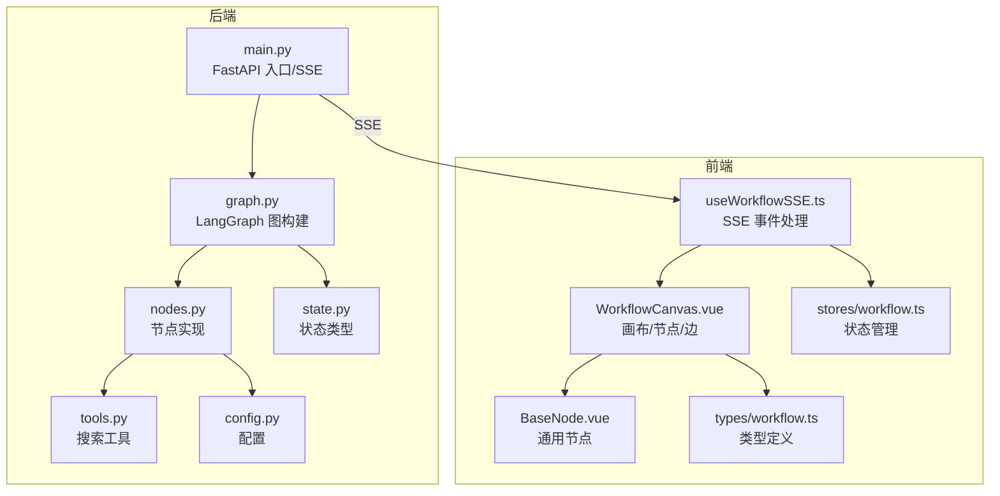
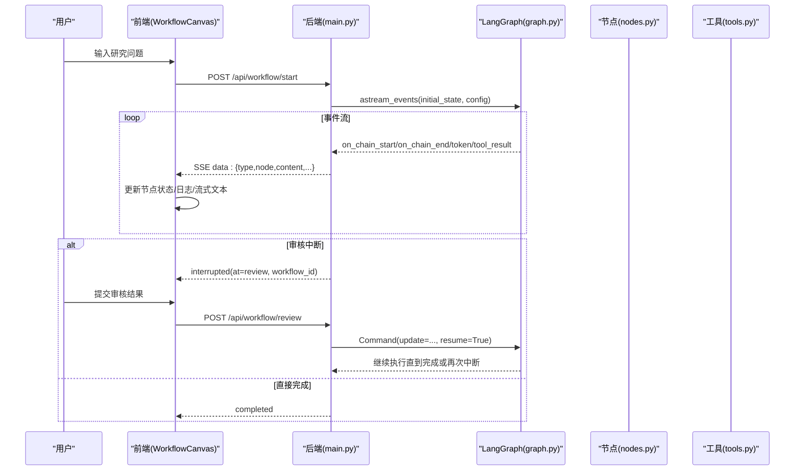
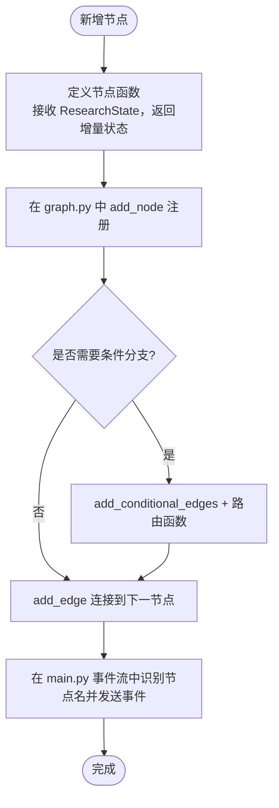
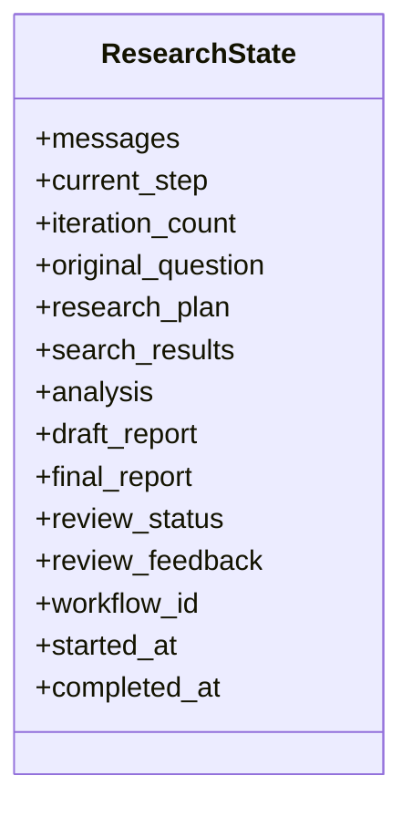
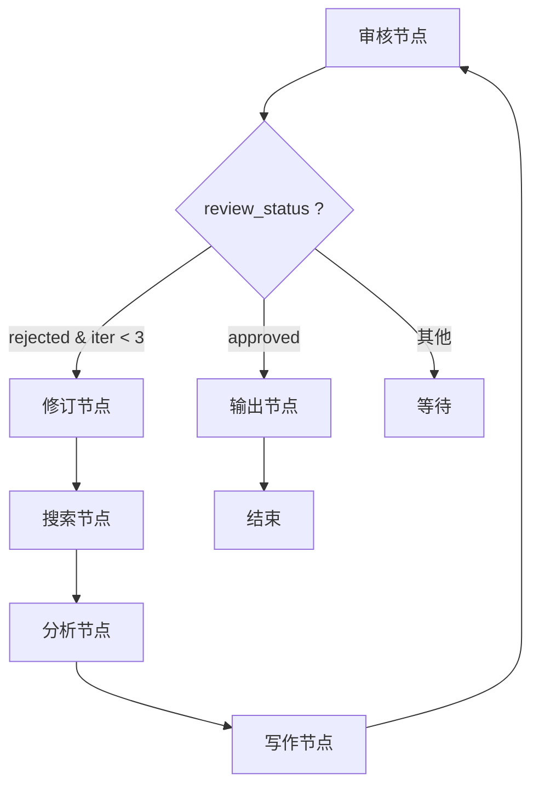
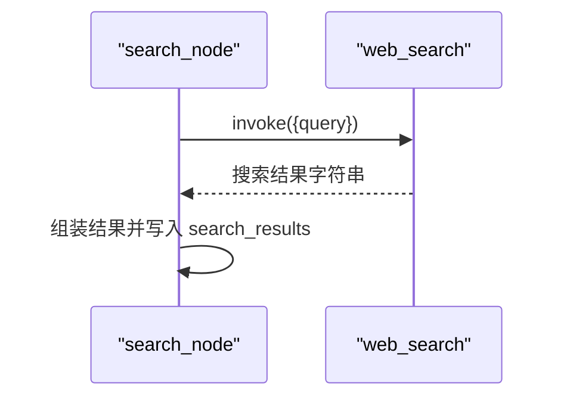
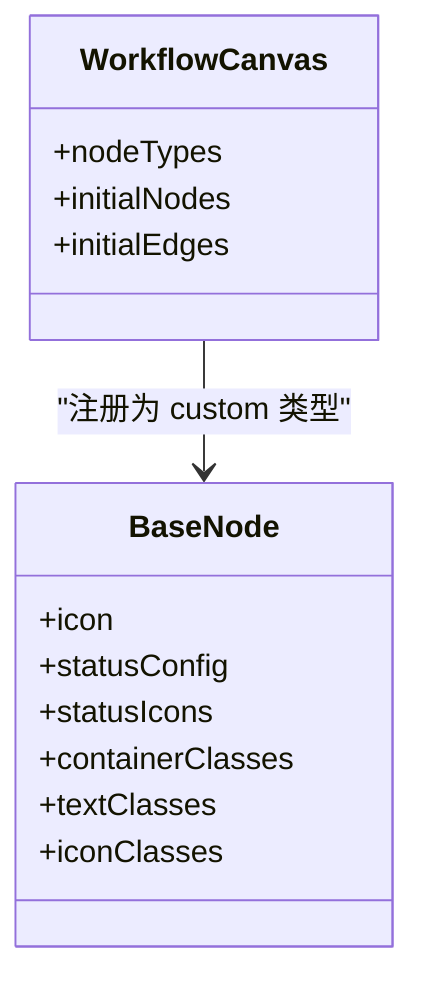
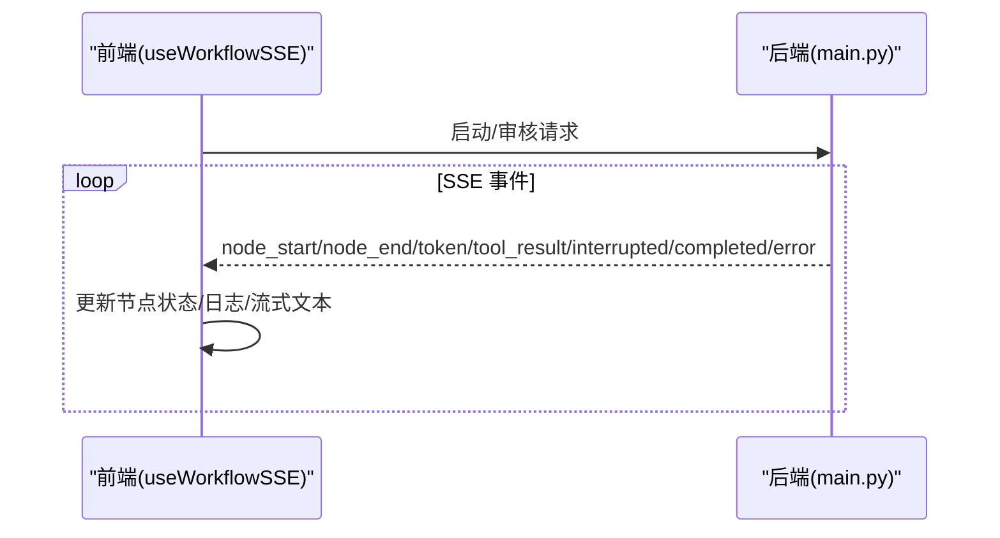
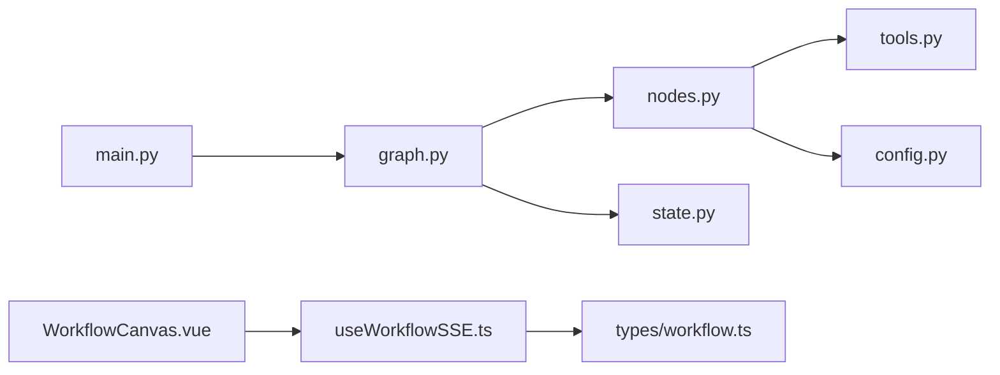

# 扩展开发

<cite>
**本文引用的文件**
- [backend/app/main.py](file://workflow-studio/backend/app/main.py)
- [backend/app/graph.py](file://workflow-studio/backend/app/graph.py)
- [backend/app/nodes.py](file://workflow-studio/backend/app/nodes.py)
- [backend/app/tools.py](file://workflow-studio/backend/app/tools.py)
- [backend/app/state.py](file://workflow-studio/backend/app/state.py)
- [backend/app/config.py](file://workflow-studio/backend/app/config.py)
- [frontend/src/components/WorkflowCanvas.vue](file://workflow-studio/frontend/src/components/WorkflowCanvas.vue)
- [frontend/src/components/nodes/BaseNode.vue](file://workflow-studio/frontend/src/components/nodes/BaseNode.vue)
- [frontend/src/composables/useWorkflowSSE.ts](file://workflow-studio/frontend/src/composables/useWorkflowSSE.ts)
- [frontend/src/stores/workflow.ts](file://workflow-studio/frontend/src/stores/workflow.ts)
- [frontend/src/types/workflow.ts](file://workflow-studio/frontend/src/types/workflow.ts)
- [README.md](file://workflow-studio/README.md)
</cite>

## 目录
1. [简介](#简介)
2. [项目结构](#项目结构)
3. [核心组件](#核心组件)
4. [架构总览](#架构总览)
5. [详细组件分析](#详细组件分析)
6. [依赖关系分析](#依赖关系分析)
7. [性能考虑](#性能考虑)
8. [故障排查指南](#故障排查指南)
9. [结论](#结论)
10. [附录：扩展清单与最佳实践](#附录：扩展清单与最佳实践)

## 简介
本指南面向希望在 Workflow Studio 中扩展能力的开发者，覆盖以下目标：
- 添加新的工作流节点（接口定义、状态处理、LLM 集成）
- 扩展搜索工具系统（实现自定义搜索工具、API 集成）
- 开发前端可视化组件（基于 BaseNode 的自定义节点、样式定制）
- 注册新节点到工作流图、处理节点间数据传递、实现条件分支逻辑
- 提供完整的开发示例与最佳实践（错误处理、日志记录、性能优化）

本项目基于 LangGraph + FastAPI + Vue 3 + Vue Flow，支持有状态工作流、条件分支、人工审核中断、检查点恢复与 SSE 实时推送。

## 项目结构
后端采用模块化组织：
- main.py：FastAPI 入口、SSE 事件流、工作流启动与恢复
- graph.py：LangGraph 状态图构建、条件路由、编译与检查点
- nodes.py：各工作流节点实现（规划、搜索、分析、写作、审核、修订、输出）
- tools.py：工具函数（搜索工具），使用 @tool 装饰器暴露给 LLM
- state.py：工作流状态类型定义（TypedDict）
- config.py：环境变量配置（OpenAI 密钥、模型、Base URL）

前端采用 Vue 3 + TypeScript：
- WorkflowCanvas.vue：Vue Flow 画布、节点与边初始化、SSE 驱动的状态更新
- BaseNode.vue：通用节点渲染（图标、状态、耗时等）
- useWorkflowSSE.ts：SSE 事件处理、工作流启动与审核提交
- stores/workflow.ts：Pinia 状态管理
- types/workflow.ts：类型定义（节点状态、SSE 事件、图结构）

图表来源
- [backend/app/main.py:34-103](file://workflow-studio/backend/app/main.py#L34-L103)
- [backend/app/graph.py:23-78](file://workflow-studio/backend/app/graph.py#L23-L78)
- [backend/app/nodes.py:18-129](file://workflow-studio/backend/app/nodes.py#L18-L129)
- [backend/app/tools.py:4-26](file://workflow-studio/backend/app/tools.py#L4-L26)
- [backend/app/state.py:5-30](file://workflow-studio/backend/app/state.py#L5-L30)
- [backend/app/config.py:1-9](file://workflow-studio/backend/app/config.py#L1-L9)
- [frontend/src/components/WorkflowCanvas.vue:1-133](file://workflow-studio/frontend/src/components/WorkflowCanvas.vue#L1-L133)
- [frontend/src/components/nodes/BaseNode.vue:1-82](file://workflow-studio/frontend/src/components/nodes/BaseNode.vue#L1-L82)
- [frontend/src/composables/useWorkflowSSE.ts:1-172](file://workflow-studio/frontend/src/composables/useWorkflowSSE.ts#L1-L172)
- [frontend/src/stores/workflow.ts:1-75](file://workflow-studio/frontend/src/stores/workflow.ts#L1-L75)
- [frontend/src/types/workflow.ts:1-64](file://workflow-studio/frontend/src/types/workflow.ts#L1-L64)

章节来源
- [README.md:1-109](file://workflow-studio/README.md#L1-L109)

## 核心组件
- 工作流图（LangGraph StateGraph）：在 graph.py 中定义节点、边与条件路由，并通过 get_compiled_graph 编译为可执行图，附带检查点持久化与中断点设置。
- 节点实现（nodes.py）：每个节点接收 ResearchState，返回增量状态更新；包含 LLM 调用、工具调用、消息追加。
- 工具系统（tools.py）：通过 @tool 装饰器暴露搜索能力，供节点在运行时调用。
- 状态类型（state.py）：使用 TypedDict 定义完整的工作流状态字段，包括控制字段、业务字段、元数据。
- 配置（config.py）：从环境变量加载 OpenAI 相关配置。
- 前端画布（WorkflowCanvas.vue）：初始化节点与边，监听 SSE 事件并驱动节点状态与边的动画。
- 通用节点（BaseNode.vue）：根据 nodeType 与 status 渲染图标、边框、文本与耗时。
- SSE 处理（useWorkflowSSE.ts）：解析后端事件流，更新节点状态、日志、流式文本，支持工作流启动与审核提交。
- 状态管理（stores/workflow.ts）：集中管理运行态、节点状态、日志、图结构等。
- 类型定义（types/workflow.ts）：统一前后端交互的数据结构与事件类型。

章节来源
- [backend/app/graph.py:23-78](file://workflow-studio/backend/app/graph.py#L23-L78)
- [backend/app/nodes.py:18-129](file://workflow-studio/backend/app/nodes.py#L18-L129)
- [backend/app/tools.py:4-26](file://workflow-studio/backend/app/tools.py#L4-L26)
- [backend/app/state.py:5-30](file://workflow-studio/backend/app/state.py#L5-L30)
- [backend/app/config.py:1-9](file://workflow-studio/backend/app/config.py#L1-L9)
- [frontend/src/components/WorkflowCanvas.vue:1-133](file://workflow-studio/frontend/src/components/WorkflowCanvas.vue#L1-L133)
- [frontend/src/components/nodes/BaseNode.vue:1-82](file://workflow-studio/frontend/src/components/nodes/BaseNode.vue#L1-L82)
- [frontend/src/composables/useWorkflowSSE.ts:1-172](file://workflow-studio/frontend/src/composables/useWorkflowSSE.ts#L1-L172)
- [frontend/src/stores/workflow.ts:1-75](file://workflow-studio/frontend/src/stores/workflow.ts#L1-L75)
- [frontend/src/types/workflow.ts:1-64](file://workflow-studio/frontend/src/types/workflow.ts#L1-L64)

## 架构总览
下图展示了从用户输入到最终输出的端到端流程，包括条件分支与人工审核中断。

图表来源
- [backend/app/main.py:34-154](file://workflow-studio/backend/app/main.py#L34-L154)
- [backend/app/graph.py:23-78](file://workflow-studio/backend/app/graph.py#L23-L78)
- [backend/app/nodes.py:18-129](file://workflow-studio/backend/app/nodes.py#L18-L129)
- [backend/app/tools.py:4-26](file://workflow-studio/backend/app/tools.py#L4-L26)
- [frontend/src/components/WorkflowCanvas.vue:50-133](file://workflow-studio/frontend/src/components/WorkflowCanvas.vue#L50-L133)
- [frontend/src/composables/useWorkflowSSE.ts:19-157](file://workflow-studio/frontend/src/composables/useWorkflowSSE.ts#L19-L157)

## 详细组件分析

### 新增工作流节点（后端）
- 步骤概览
  - 在 nodes.py 中新增异步函数作为节点实现，接收 ResearchState，返回增量状态更新字典。
  - 在 graph.py 的 build_research_graph 中通过 add_node 注册节点。
  - 如需条件分支，使用 add_conditional_edges 与路由函数决定下一步。
  - 如需要循环，添加回到上游节点的边。
  - 在 main.py 的事件流中确保新节点名称被识别并发送 node_start/node_end 事件。
- 关键要点
  - 节点应返回 current_step 用于追踪当前步骤。
  - 可通过 messages 字段追加 AI 消息，便于前端展示。
  - 对 LLM 调用进行异常降级处理，保证工作流健壮性。
  - 工具调用通过 tools.py 中的 @tool 函数，节点内以 invoke 方式调用。
- 示例路径
  - 节点实现参考：[plan_node/search_node/analyze_node/write_node/review_node/output_node/revision_node:18-129](file://workflow-studio/backend/app/nodes.py#L18-L129)
  - 节点注册参考：[build_research_graph:23-62](file://workflow-studio/backend/app/graph.py#L23-L62)
  - 事件流映射参考：[start_workflow 事件流:60-103](file://workflow-studio/backend/app/main.py#L60-L103)

图表来源
- [backend/app/nodes.py:18-129](file://workflow-studio/backend/app/nodes.py#L18-L129)
- [backend/app/graph.py:23-62](file://workflow-studio/backend/app/graph.py#L23-L62)
- [backend/app/main.py:60-103](file://workflow-studio/backend/app/main.py#L60-L103)

章节来源
- [backend/app/nodes.py:18-129](file://workflow-studio/backend/app/nodes.py#L18-L129)
- [backend/app/graph.py:23-62](file://workflow-studio/backend/app/graph.py#L23-L62)
- [backend/app/main.py:60-103](file://workflow-studio/backend/app/main.py#L60-L103)

### 节点间数据传递与状态管理
- 状态结构
  - ResearchState 定义了所有共享字段，包括原始问题、计划、搜索结果、分析、草稿报告、最终报告、审核状态与反馈、迭代计数、时间戳等。
- 传递机制
  - 节点返回的增量状态会被 LangGraph 合并到全局状态中，后续节点可直接读取。
  - 通过 messages 字段累积对话历史，便于上下文传递与调试。
- 示例路径
  - 状态定义参考：[ResearchState:5-30](file://workflow-studio/backend/app/state.py#L5-L30)
  - 节点读写状态参考：[search_node/analyze_node/write_node:43-97](file://workflow-studio/backend/app/nodes.py#L43-L97)

图表来源
- [backend/app/state.py:5-30](file://workflow-studio/backend/app/state.py#L5-L30)

章节来源
- [backend/app/state.py:5-30](file://workflow-studio/backend/app/state.py#L5-L30)
- [backend/app/nodes.py:43-97](file://workflow-studio/backend/app/nodes.py#L43-L97)

### 条件分支与循环逻辑
- 条件路由
  - route_after_review 根据 review_status 与 iteration_count 决定下一步：approved → output；rejected 且未达上限 → revision；否则等待。
- 循环控制
  - revision → search 形成循环，防止无限循环的上限由 iteration_count 控制。
- 示例路径
  - 条件路由参考：[route_after_review](file://workflow-studio/backend/app/graph.py:11-21)
  - 条件边与循环边参考：[build_research_graph](file://workflow-studio/backend/app/graph.py:45-58)

图表来源
- [backend/app/graph.py:11-58](file://workflow-studio/backend/app/graph.py#L11-L58)

章节来源
- [backend/app/graph.py:11-58](file://workflow-studio/backend/app/graph.py#L11-L58)

### 扩展搜索工具系统（自定义工具/API 集成）
- 工具定义
  - 使用 @tool 装饰器定义工具函数，参数与返回值清晰，便于 LLM 调用。
  - 当前 web_search 与 academic_search 为模拟实现，生产环境替换为真实 API（如 Tavily/SerpAPI/Bing）。
- 节点集成
  - 在 search_node 中遍历 research_plan，逐个调用 web_search.invoke，收集结果并写入 search_results。
- 示例路径
  - 工具定义参考：[web_search/academic_search](file://workflow-studio/backend/app/tools.py:4-26)
  - 工具调用参考：[search_node](file://workflow-studio/backend/app/nodes.py:43-60)

图表来源
- [backend/app/nodes.py:43-60](file://workflow-studio/backend/app/nodes.py#L43-L60)
- [backend/app/tools.py:4-26](file://workflow-studio/backend/app/tools.py#L4-L26)

章节来源
- [backend/app/tools.py:4-26](file://workflow-studio/backend/app/tools.py#L4-L26)
- [backend/app/nodes.py:43-60](file://workflow-studio/backend/app/nodes.py#L43-L60)

### 开发前端可视化组件（基于 BaseNode 的自定义节点）
- 节点类型与渲染
  - WorkflowCanvas.vue 中通过 node-types 注册 custom 类型为 BaseNode。
  - BaseNode.vue 根据 data.nodeType 与 data.status 动态选择图标、边框颜色、文本颜色与动画。
- 样式定制
  - 通过 clsx 组合 Tailwind 类名，按状态切换样式；支持运行中旋转、等待脉冲等效果。
- 示例路径
  - 节点注册与初始布局参考：[WorkflowCanvas.vue](file://workflow-studio/frontend/src/components/WorkflowCanvas.vue:50-74)
  - 通用节点渲染参考：[BaseNode.vue](file://workflow-studio/frontend/src/components/nodes/BaseNode.vue:1-82)

图表来源
- [frontend/src/components/WorkflowCanvas.vue:50-74](file://workflow-studio/frontend/src/components/WorkflowCanvas.vue#L50-L74)
- [frontend/src/components/nodes/BaseNode.vue:33-80](file://workflow-studio/frontend/src/components/nodes/BaseNode.vue#L33-L80)

章节来源
- [frontend/src/components/WorkflowCanvas.vue:50-74](file://workflow-studio/frontend/src/components/WorkflowCanvas.vue#L50-L74)
- [frontend/src/components/nodes/BaseNode.vue:1-82](file://workflow-studio/frontend/src/components/nodes/BaseNode.vue#L1-L82)

### SSE 事件与前端状态同步
- 事件类型
  - node_start/node_end：节点开始/结束
  - token：LLM 流式内容片段
  - tool_result：工具执行结果
  - interrupted：工作流暂停（人工审核）
  - completed：工作流完成
  - error：错误信息
- 状态更新
  - useWorkflowSSE.ts 将事件转换为节点状态、日志与流式文本，并支持 startWorkflow 与 submitReview。
- 示例路径
  - 事件处理参考：[handleSSEEvent](file://workflow-studio/frontend/src/composables/useWorkflowSSE.ts:19-72)
  - 工作流启动与审核提交参考：[startWorkflow/submitReview](file://workflow-studio/frontend/src/composables/useWorkflowSSE.ts:74-157)

图表来源
- [frontend/src/composables/useWorkflowSSE.ts:19-157](file://workflow-studio/frontend/src/composables/useWorkflowSSE.ts#L19-L157)
- [backend/app/main.py:60-154](file://workflow-studio/backend/app/main.py#L60-L154)

章节来源
- [frontend/src/composables/useWorkflowSSE.ts:19-157](file://workflow-studio/frontend/src/composables/useWorkflowSSE.ts#L19-L157)
- [backend/app/main.py:60-154](file://workflow-studio/backend/app/main.py#L60-L154)

## 依赖关系分析
- 后端模块耦合
  - main.py 依赖 graph.py 获取编译后的图实例，并在事件流中转发节点事件。
  - graph.py 依赖 nodes.py 与 state.py 构建图与状态。
  - nodes.py 依赖 tools.py 与 config.py 进行工具调用与 LLM 配置。
- 前后端交互
  - 前端通过 SSE 消费后端事件，驱动节点状态与 UI 更新。
  - 类型定义 types/workflow.ts 约束前后端数据结构一致性。

图表来源
- [backend/app/main.py:34-154](file://workflow-studio/backend/app/main.py#L34-L154)
- [backend/app/graph.py:23-78](file://workflow-studio/backend/app/graph.py#L23-L78)
- [backend/app/nodes.py:18-129](file://workflow-studio/backend/app/nodes.py#L18-L129)
- [backend/app/tools.py:4-26](file://workflow-studio/backend/app/tools.py#L4-L26)
- [backend/app/state.py:5-30](file://workflow-studio/backend/app/state.py#L5-L30)
- [backend/app/config.py:1-9](file://workflow-studio/backend/app/config.py#L1-L9)
- [frontend/src/components/WorkflowCanvas.vue:50-133](file://workflow-studio/frontend/src/components/WorkflowCanvas.vue#L50-L133)
- [frontend/src/composables/useWorkflowSSE.ts:1-172](file://workflow-studio/frontend/src/composables/useWorkflowSSE.ts#L1-L172)
- [frontend/src/types/workflow.ts:1-64](file://workflow-studio/frontend/src/types/workflow.ts#L1-L64)

章节来源
- [backend/app/main.py:34-154](file://workflow-studio/backend/app/main.py#L34-L154)
- [backend/app/graph.py:23-78](file://workflow-studio/backend/app/graph.py#L23-L78)
- [backend/app/nodes.py:18-129](file://workflow-studio/backend/app/nodes.py#L18-L129)
- [backend/app/tools.py:4-26](file://workflow-studio/backend/app/tools.py#L4-L26)
- [backend/app/state.py:5-30](file://workflow-studio/backend/app/state.py#L5-L30)
- [backend/app/config.py:1-9](file://workflow-studio/backend/app/config.py#L1-L9)
- [frontend/src/components/WorkflowCanvas.vue:50-133](file://workflow-studio/frontend/src/components/WorkflowCanvas.vue#L50-L133)
- [frontend/src/composables/useWorkflowSSE.ts:1-172](file://workflow-studio/frontend/src/composables/useWorkflowSSE.ts#L1-L172)
- [frontend/src/types/workflow.ts:1-64](file://workflow-studio/frontend/src/types/workflow.ts#L1-L64)

## 性能考虑
- LLM 调用优化
  - 合理设置 temperature 与模型，避免过长提示词；对 JSON 解析失败做降级处理。
  - 使用流式输出减少首字节延迟，提升用户体验。
- 工具调用优化
  - 批量查询时注意速率限制与缓存策略；对重复查询结果进行去重。
- 前端渲染优化
  - 仅对运行中或刚完成的边启用动画，降低不必要的重绘。
  - 使用 Pinia 集中管理状态，避免频繁 DOM 操作。
- 后端并发与持久化
  - 使用 AsyncSqliteSaver 保存检查点，生产环境建议迁移至 PostgreSQL。
  - 合理设置中断点，避免长时间阻塞。

[本节为通用指导，不直接分析具体文件]

## 故障排查指南
- 常见问题
  - LLM 返回非 JSON：在 plan_node 中进行 try/except 降级，默认回退为原问题列表。
  - 工具调用失败：在 search_node 中对结果进行空值保护，避免后续分析崩溃。
  - 审核中断后无法恢复：确认 workflow_id 正确传递，并使用 /api/workflow/review 恢复。
  - 前端状态不同步：检查 SSE 事件是否完整接收，确认 handleSSEEvent 对各类事件的处理逻辑。
- 日志与调试
  - 利用 messages 字段记录关键步骤，便于回溯。
  - 前端 logs 数组记录事件序列，辅助定位问题。
- 示例路径
  - 错误降级参考：[plan_node](file://workflow-studio/backend/app/nodes.py:29-40)
  - 工具结果日志参考：[useWorkflowSSE.ts tool_result](file://workflow-studio/frontend/src/composables/useWorkflowSSE.ts:41-45)
  - 中断恢复参考：[submit_review](file://workflow-studio/backend/app/main.py:107-154)

章节来源
- [backend/app/nodes.py:29-40](file://workflow-studio/backend/app/nodes.py#L29-L40)
- [frontend/src/composables/useWorkflowSSE.ts:41-45](file://workflow-studio/frontend/src/composables/useWorkflowSSE.ts#L41-L45)
- [backend/app/main.py:107-154](file://workflow-studio/backend/app/main.py#L107-L154)

## 结论
通过本指南，您可以：
- 在后端新增节点并注册到工作流图，实现复杂条件分支与循环。
- 扩展工具系统，集成外部 API，增强节点能力。
- 在前端基于 BaseNode 开发自定义节点，实现样式与交互定制。
- 正确处理节点间数据传递、条件分支与人工审核中断。
- 遵循最佳实践，提升系统的健壮性与性能。

[本节为总结，不直接分析具体文件]

## 附录：扩展清单与最佳实践
- 新增节点清单
  - 定义节点函数（nodes.py）
  - 注册节点（graph.py）
  - 添加边或条件边（graph.py）
  - 在事件流中识别节点名（main.py）
- 工具扩展清单
  - 定义 @tool 函数（tools.py）
  - 在节点中调用工具（nodes.py）
  - 处理工具结果与错误（nodes.py）
- 前端组件清单
  - 注册自定义节点类型（WorkflowCanvas.vue）
  - 基于 BaseNode 定制样式与行为（BaseNode.vue）
  - 处理 SSE 事件与状态同步（useWorkflowSSE.ts）
- 最佳实践
  - 状态设计：明确字段职责，避免冗余；使用 messages 记录上下文。
  - 错误处理：对 LLM 与工具调用进行降级与保护。
  - 性能优化：流式输出、按需动画、缓存与去重。
  - 可维护性：模块化组织、类型约束、清晰的命名与注释。

[本节为通用指导，不直接分析具体文件]