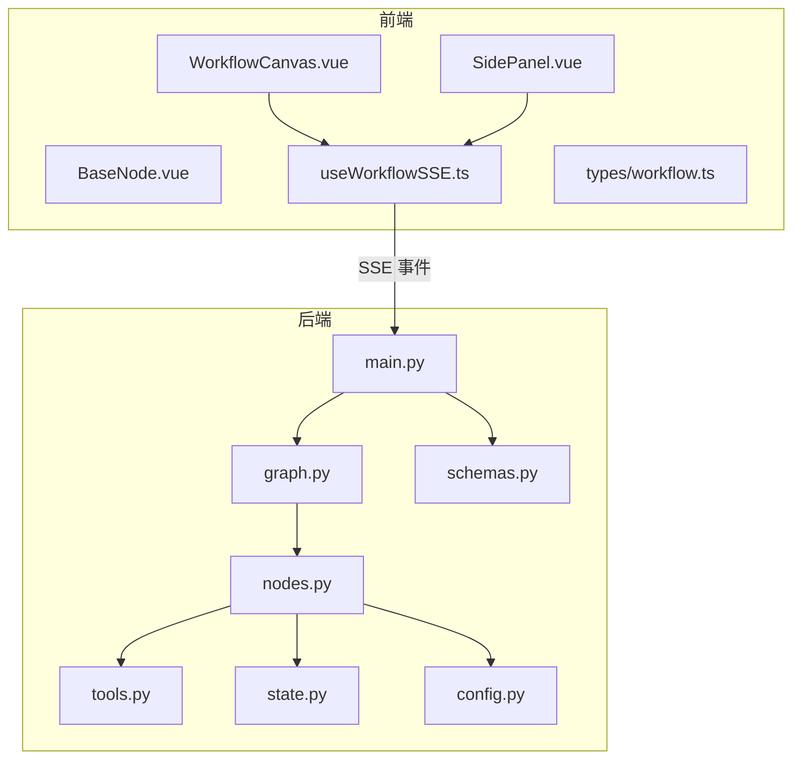
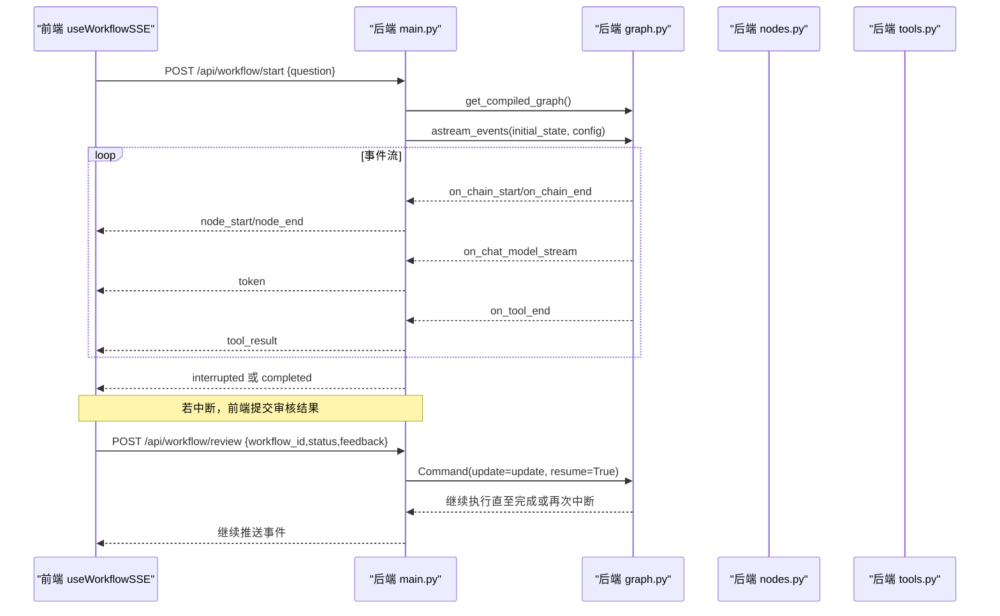
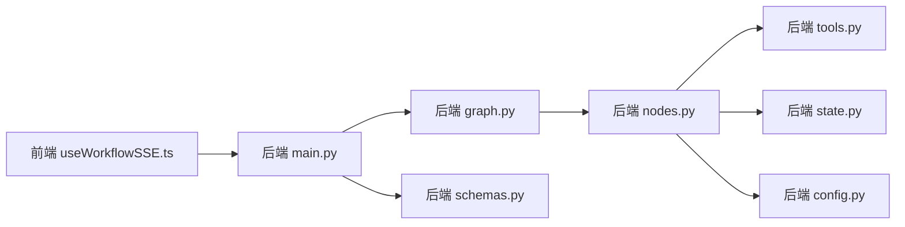

# 测试策略

<cite>
**本文引用的文件**
- [backend/app/main.py](file://workflow-studio/backend/app/main.py)
- [backend/app/graph.py](file://workflow-studio/backend/app/graph.py)
- [backend/app/nodes.py](file://workflow-studio/backend/app/nodes.py)
- [backend/app/state.py](file://workflow-studio/backend/app/state.py)
- [backend/app/tools.py](file://workflow-studio/backend/app/tools.py)
- [backend/app/config.py](file://workflow-studio/backend/app/config.py)
- [backend/app/schemas.py](file://workflow-studio/backend/app/schemas.py)
- [backend/requirements.txt](file://workflow-studio/backend/requirements.txt)
- [frontend/src/components/WorkflowCanvas.vue](file://workflow-studio/frontend/src/components/WorkflowCanvas.vue)
- [frontend/src/components/layout/SidePanel.vue](file://workflow-studio/frontend/src/components/layout/SidePanel.vue)
- [frontend/src/components/nodes/BaseNode.vue](file://workflow-studio/frontend/src/components/nodes/BaseNode.vue)
- [frontend/src/composables/useWorkflowSSE.ts](file://workflow-studio/frontend/src/composables/useWorkflowSSE.ts)
- [frontend/src/types/workflow.ts](file://workflow-studio/frontend/src/types/workflow.ts)
- [frontend/vite.config.ts](file://workflow-studio/frontend/vite.config.ts)
- [frontend/package.json](file://workflow-studio/frontend/package.json)
</cite>

## 目录
1. [简介](#简介)
2. [项目结构](#项目结构)
3. [核心组件](#核心组件)
4. [架构总览](#架构总览)
5. [详细组件分析](#详细组件分析)
6. [依赖关系分析](#依赖关系分析)
7. [性能考量](#性能考量)
8. [故障排查指南](#故障排查指南)
9. [结论](#结论)
10. [附录](#附录)

## 简介
本测试策略面向 Workflow Studio 项目的端到端质量保障，覆盖后端 Python 节点、前端 Vue 组件与 API 接口、集成测试（工作流端到端、SSE 通信、数据库操作）、测试框架选型（pytest、Vitest、Playwright）、测试数据管理、Mock 策略、覆盖率目标、持续集成与自动化流程。重点解决异步操作、外部 API 调用、用户交互场景的测试方法，建立可回归的质量体系。

## 项目结构
- 后端（FastAPI + LangGraph）：提供工作流启动、审核恢复、状态查询、图结构等 REST 接口；通过 SSE 推送事件；使用 SQLite 检查点持久化状态。
- 前端（Vue 3 + Vite）：基于 Vue Flow 渲染工作流图；通过 composable 处理 SSE 事件流；侧边面板承载输入、审核弹窗、日志与详情。
- 类型定义：前后端共享的工作流事件与工作流状态类型在前端 types 中集中定义，便于 UI 与 composable 的类型安全。

**图示来源**
- [frontend/src/components/WorkflowCanvas.vue:1-133](file://workflow-studio/frontend/src/components/WorkflowCanvas.vue#L1-L133)
- [frontend/src/components/layout/SidePanel.vue:1-39](file://workflow-studio/frontend/src/components/layout/SidePanel.vue#L1-L39)
- [frontend/src/components/nodes/BaseNode.vue:1-82](file://workflow-studio/frontend/src/components/nodes/BaseNode.vue#L1-L82)
- [frontend/src/composables/useWorkflowSSE.ts:1-172](file://workflow-studio/frontend/src/composables/useWorkflowSSE.ts#L1-L172)
- [frontend/src/types/workflow.ts:1-64](file://workflow-studio/frontend/src/types/workflow.ts#L1-L64)
- [backend/app/main.py:1-200](file://workflow-studio/backend/app/main.py#L1-L200)
- [backend/app/graph.py:1-78](file://workflow-studio/backend/app/graph.py#L1-L78)
- [backend/app/nodes.py:1-129](file://workflow-studio/backend/app/nodes.py#L1-L129)
- [backend/app/tools.py:1-26](file://workflow-studio/backend/app/tools.py#L1-L26)
- [backend/app/state.py:1-30](file://workflow-studio/backend/app/state.py#L1-L30)
- [backend/app/schemas.py:1-12](file://workflow-studio/backend/app/schemas.py#L1-L12)
- [backend/app/config.py:1-9](file://workflow-studio/backend/app/config.py#L1-L9)

**章节来源**
- [backend/app/main.py:1-200](file://workflow-studio/backend/app/main.py#L1-L200)
- [frontend/src/composables/useWorkflowSSE.ts:1-172](file://workflow-studio/frontend/src/composables/useWorkflowSSE.ts#L1-L172)
- [frontend/src/components/WorkflowCanvas.vue:1-133](file://workflow-studio/frontend/src/components/WorkflowCanvas.vue#L1-L133)

## 核心组件
- 后端 API 层：提供 /api/workflow/start、/api/workflow/review、/api/workflow/state/{id}、/api/workflow/graph-structure 四个关键接口，负责初始化工作流、人工审核恢复、状态查询与图结构返回。
- 工作流图与节点：LangGraph 构建研究类工作流，包含 plan、search、analyze、write、review、revision、output 节点，支持条件路由与中断恢复。
- 工具与配置：web_search、academic_search 工具用于模拟搜索；LLM 模型与密钥通过环境变量注入。
- 前端 composable：useWorkflowSSE 统一处理 SSE 事件流，维护节点状态、运行标志、中断状态、流式文本与日志。
- 前端组件：WorkflowCanvas 负责画布渲染与状态同步；SidePanel 聚合输入、审核弹窗、日志与详情；BaseNode 根据状态展示不同样式与图标。

**章节来源**
- [backend/app/main.py:34-200](file://workflow-studio/backend/app/main.py#L34-L200)
- [backend/app/graph.py:23-78](file://workflow-studio/backend/app/graph.py#L23-L78)
- [backend/app/nodes.py:18-129](file://workflow-studio/backend/app/nodes.py#L18-L129)
- [backend/app/tools.py:1-26](file://workflow-studio/backend/app/tools.py#L1-L26)
- [backend/app/config.py:1-9](file://workflow-studio/backend/app/config.py#L1-L9)
- [frontend/src/composables/useWorkflowSSE.ts:1-172](file://workflow-studio/frontend/src/composables/useWorkflowSSE.ts#L1-L172)
- [frontend/src/components/WorkflowCanvas.vue:1-133](file://workflow-studio/frontend/src/components/WorkflowCanvas.vue#L1-L133)
- [frontend/src/components/layout/SidePanel.vue:1-39](file://workflow-studio/frontend/src/components/layout/SidePanel.vue#L1-L39)
- [frontend/src/components/nodes/BaseNode.vue:1-82](file://workflow-studio/frontend/src/components/nodes/BaseNode.vue#L1-L82)

## 架构总览
下图展示了从前端触发到后端执行、再到 SSE 事件回传的完整调用链，以及审核恢复的流程。

**图示来源**
- [frontend/src/composables/useWorkflowSSE.ts:74-157](file://workflow-studio/frontend/src/composables/useWorkflowSSE.ts#L74-L157)
- [backend/app/main.py:34-154](file://workflow-studio/backend/app/main.py#L34-L154)
- [backend/app/graph.py:65-78](file://workflow-studio/backend/app/graph.py#L65-L78)
- [backend/app/nodes.py:18-129](file://workflow-studio/backend/app/nodes.py#L18-L129)
- [backend/app/tools.py:1-26](file://workflow-studio/backend/app/tools.py#L1-L26)

## 详细组件分析

### 后端单元测试策略（Python 节点、工具、状态、图）
- 测试范围
  - 节点函数：plan_node、search_node、analyze_node、write_node、review_node、output_node、revision_node。
  - 工具函数：web_search、academic_search。
  - 状态与图：ResearchState 字段完整性、条件路由 route_after_review、编译图的断点与中断行为。
- 测试框架与工具
  - pytest 作为主测试框架；pytest-asyncio 用于异步测试。
  - httpx.AsyncClient 进行 FastAPI 应用集成测试。
  - unittest.mock 或 pytest-mock 对 LLM、工具、SQLite 检查点进行 Mock。
- 关键用例设计
  - 节点函数：
    - plan_node：验证将问题拆解为子问题列表，异常降级为原始问题。
    - search_node：验证对每个子问题调用 web_search，并记录时间戳。
    - analyze_node：验证综合搜索结果生成分析内容。
    - write_node：验证草稿报告生成，支持审核反馈注入。
    - review_node：验证暂停与消息更新。
    - output_node：验证最终报告输出与完成时间。
    - revision_node：验证迭代计数递增与消息更新。
  - 工具函数：
    - web_search：关键词匹配返回对应结果；无匹配时返回通用结果。
    - academic_search：固定格式返回学术搜索结果。
  - 状态与图：
    - route_after_review：approved→output；rejected→revision（最多3轮后强制 output）。
    - get_compiled_graph：验证在 review 前中断、checkpointer 配置正确。
- Mock 策略
  - 使用 mock.patch 替换 ChatOpenAI.ainvoke，返回可控 JSON 或字符串。
  - 使用 mock.patch 替换 tools.web_search/academic_search，返回固定结果。
  - 使用临时 SQLite 文件或内存数据库进行 checkpointer 测试，避免污染真实数据。
- 覆盖率要求
  - 节点与工具行覆盖率≥90%；分支覆盖率≥85%。
  - 图路由与中断逻辑必须达到 100% 分支覆盖。

**章节来源**
- [backend/app/nodes.py:18-129](file://workflow-studio/backend/app/nodes.py#L18-L129)
- [backend/app/tools.py:1-26](file://workflow-studio/backend/app/tools.py#L1-L26)
- [backend/app/graph.py:11-78](file://workflow-studio/backend/app/graph.py#L11-L78)
- [backend/app/state.py:1-30](file://workflow-studio/backend/app/state.py#L1-L30)

### 前端单元测试策略（Vue 组件、Composable、类型）
- 测试范围
  - Composable：useWorkflowSSE 的事件处理、状态更新、错误处理。
  - 组件：BaseNode 的状态样式与图标映射；WorkflowCanvas 的节点状态同步与边动画；SidePanel 的输入与审核弹窗触发。
  - 类型：确保 SSEEvent、NodeStatus、NodeType 等类型约束一致。
- 测试框架与工具
  - Vitest 作为单元测试框架；@vue/test-utils 用于组件测试；jsdom 模拟 DOM。
  - 使用 fetch-mock 或 vitest 内置 mock 拦截 fetch 调用，模拟 SSE 事件流。
- 关键用例设计
  - useWorkflowSSE：
    - handleSSEEvent：node_start→running；node_end→completed；token→追加流式文本；tool_result→日志；interrupted→暂停并设置 workflowId；completed→结束；error→错误日志。
    - startWorkflow：重置状态、发起请求、解析 data: 行、逐条处理事件、异常捕获。
    - submitReview：校验 workflowId、发起请求、解析事件流、异常捕获。
  - BaseNode：
    - 不同 NodeStatus 对应的容器样式、文字颜色、图标与动画。
    - 节点类型图标映射。
  - WorkflowCanvas：
    - 监听 nodeStatuses 变化更新节点 data.status 与边 animated。
    - 点击节点设置 selectedNodeId。
  - SidePanel：
    - 在 isInterrupted 时显示 ReviewDialog；提交审核调用 submitReview。
- 覆盖率要求
  - Composable 行覆盖率≥90%；组件渲染与交互分支覆盖率≥85%。

**章节来源**
- [frontend/src/composables/useWorkflowSSE.ts:1-172](file://workflow-studio/frontend/src/composables/useWorkflowSSE.ts#L1-L172)
- [frontend/src/components/nodes/BaseNode.vue:1-82](file://workflow-studio/frontend/src/components/nodes/BaseNode.vue#L1-L82)
- [frontend/src/components/WorkflowCanvas.vue:1-133](file://workflow-studio/frontend/src/components/WorkflowCanvas.vue#L1-L133)
- [frontend/src/components/layout/SidePanel.vue:1-39](file://workflow-studio/frontend/src/components/layout/SidePanel.vue#L1-L39)
- [frontend/src/types/workflow.ts:1-64](file://workflow-studio/frontend/src/types/workflow.ts#L1-L64)

### API 接口测试（FastAPI + SSE）
- 测试范围
  - POST /api/workflow/start：验证请求体校验、SSE 事件序列、中断与完成分支。
  - POST /api/workflow/review：验证审核参数、恢复执行、事件继续推送。
  - GET /api/workflow/state/{workflow_id}：验证状态查询与不存在时的 404。
  - GET /api/workflow/graph-structure：验证图结构返回。
- 测试框架与工具
  - pytest + httpx.AsyncClient 进行异步集成测试。
  - 使用 TestServer 启动 FastAPI 应用，或使用 app.test_client 同步模式。
  - 自定义 SSE 客户端读取流并断言事件顺序。
- 关键用例设计
  - start_workflow：
    - 正常路径：on_chain_start/on_chain_end → node_start/node_end；on_chat_model_stream → token；on_tool_end → tool_result；最终 interrupted 或 completed。
    - 异常路径：抛出异常时返回 error 事件。
  - submit_review：
    - 传入 workflow_id、status、feedback；验证恢复执行与事件继续推送。
  - get_workflow_state：
    - 存在 workflow_id 返回 values 与 next；不存在返回 404。
  - graph_structure：
    - 返回节点与边的静态结构。
- 覆盖率要求
  - 接口行覆盖率≥90%；SSE 事件分支覆盖率≥85%。

**章节来源**
- [backend/app/main.py:34-200](file://workflow-studio/backend/app/main.py#L34-L200)
- [backend/app/schemas.py:1-12](file://workflow-studio/backend/app/schemas.py#L1-L12)

### 集成测试设计（端到端、SSE、数据库）
- 端到端工作流测试
  - 使用 Playwright 启动前端与后端，模拟用户输入问题、等待节点执行、提交审核、观察日志与流式输出。
  - 断言节点状态变化、边动画、审核弹窗出现与消失、最终完成或中断。
- SSE 通信测试
  - 在后端使用 httpx 或自定义 SSE 客户端读取流，断言事件类型与顺序。
  - 模拟网络延迟与分块，验证前端解析器健壮性。
- 数据库操作测试
  - 使用临时 SQLite 文件作为 checkpointer，验证中断恢复、状态查询、多次修订循环。
  - 清理测试数据库，避免污染。
- 外部 API 调用测试
  - 使用 mock 替换 LLM 与搜索工具，保证测试稳定与快速。
  - 可选：使用 WireMock 或本地代理模拟第三方 API，验证超时与重试。

**章节来源**
- [backend/app/graph.py:65-78](file://workflow-studio/backend/app/graph.py#L65-L78)
- [backend/app/main.py:34-154](file://workflow-studio/backend/app/main.py#L34-L154)
- [frontend/src/composables/useWorkflowSSE.ts:74-157](file://workflow-studio/frontend/src/composables/useWorkflowSSE.ts#L74-L157)

### 测试数据管理与 Mock 策略
- 测试数据
  - 固定问题与子问题列表；固定搜索结果与分析内容；固定审核反馈。
  - 使用 fixtures 管理测试数据，避免硬编码分散。
- Mock 策略
  - LLM：mock ChatOpenAI.ainvoke，返回 JSON 或 Markdown 字符串。
  - 工具：mock web_search/academic_search，返回预置结果。
  - 检查点：使用内存或临时 SQLite 文件，测试后清理。
  - 网络：使用 pytest-httpx 或 httpx.MockTransport 拦截 HTTP 请求。
- 数据隔离
  - 每个测试用例独立环境，避免共享状态导致干扰。

**章节来源**
- [backend/app/nodes.py:18-129](file://workflow-studio/backend/app/nodes.py#L18-L129)
- [backend/app/tools.py:1-26](file://workflow-studio/backend/app/tools.py#L1-L26)
- [backend/app/graph.py:65-78](file://workflow-studio/backend/app/graph.py#L65-L78)

### 覆盖率要求与持续集成配置
- 覆盖率目标
  - 后端：行覆盖率≥90%，分支覆盖率≥85%。
  - 前端：行覆盖率≥90%，交互分支覆盖率≥85%。
  - API：SSE 事件分支覆盖率≥85%。
- CI 流水线建议
  - 阶段一：安装依赖（Python venv、Node pnpm/yarn）。
  - 阶段二：后端单元测试（pytest + coverage）。
  - 阶段三：前端单元测试（vitest + coverage）。
  - 阶段四：API 集成测试（httpx + SSE 断言）。
  - 阶段五：E2E 测试（Playwright，启动前后端服务）。
  - 阶段六：生成覆盖率报告并上传（coverage.xml、lcov）。
- 自动化流程
  - 每次 PR 触发 CI；失败阻断合并；覆盖率阈值不达标标记警告。

[本节为通用指导，无需特定文件来源]

### 异步操作、外部 API 调用与用户交互场景测试
- 异步操作
  - 使用 pytest-asyncio 测试 async 函数；确保事件循环正确配置。
  - 对 astream_events 的流式处理进行断言，验证事件顺序与内容。
- 外部 API 调用
  - 使用 mock 替换 LLM 与搜索工具；必要时使用本地代理模拟超时与错误。
- 用户交互场景
  - Playwright 模拟点击、输入、等待节点状态变化、审核弹窗提交。
  - 断言 UI 反馈（日志、流式文本、节点样式、边动画）。

**章节来源**
- [backend/app/main.py:34-154](file://workflow-studio/backend/app/main.py#L34-L154)
- [frontend/src/composables/useWorkflowSSE.ts:74-157](file://workflow-studio/frontend/src/composables/useWorkflowSSE.ts#L74-L157)
- [frontend/src/components/WorkflowCanvas.vue:95-127](file://workflow-studio/frontend/src/components/WorkflowCanvas.vue#L95-L127)

## 依赖关系分析

**图示来源**
- [frontend/src/composables/useWorkflowSSE.ts:1-172](file://workflow-studio/frontend/src/composables/useWorkflowSSE.ts#L1-L172)
- [backend/app/main.py:1-200](file://workflow-studio/backend/app/main.py#L1-L200)
- [backend/app/graph.py:1-78](file://workflow-studio/backend/app/graph.py#L1-L78)
- [backend/app/nodes.py:1-129](file://workflow-studio/backend/app/nodes.py#L1-L129)
- [backend/app/tools.py:1-26](file://workflow-studio/backend/app/tools.py#L1-L26)
- [backend/app/state.py:1-30](file://workflow-studio/backend/app/state.py#L1-L30)
- [backend/app/schemas.py:1-12](file://workflow-studio/backend/app/schemas.py#L1-L12)
- [backend/app/config.py:1-9](file://workflow-studio/backend/app/config.py#L1-L9)

**章节来源**
- [backend/requirements.txt:1-10](file://workflow-studio/backend/requirements.txt#L1-L10)
- [frontend/package.json:1-32](file://workflow-studio/frontend/package.json#L1-L32)

## 性能考量
- 减少外部依赖调用：使用 Mock 替代 LLM 与搜索工具，提升测试速度与稳定性。
- 并行执行：pytest 与 Vitest 均支持并行测试，缩短 CI 时间。
- 资源隔离：每个测试使用独立 SQLite 文件与内存对象，避免锁竞争。
- 流式处理优化：前端解析器按行处理 data: 前缀，避免大响应阻塞。

[本节为通用指导，无需特定文件来源]

## 故障排查指南
- 常见问题
  - SSE 事件解析失败：检查前端按行过滤 data: 前缀与 JSON 解析异常处理。
  - 工作流未中断：确认 graph.compile 的 interrupt_before 配置与状态查询逻辑。
  - 审核恢复失败：验证 workflow_id 传递与 Command(resume=True) 使用。
  - 数据库冲突：确保测试使用临时 SQLite 文件并在用例结束后清理。
- 调试建议
  - 启用后端日志，打印事件类型与节点名称。
  - 前端控制台输出 logs 数组，定位事件处理分支。
  - 使用 Playwright 录制回放，复现 UI 交互问题。

**章节来源**
- [frontend/src/composables/useWorkflowSSE.ts:19-72](file://workflow-studio/frontend/src/composables/useWorkflowSSE.ts#L19-L72)
- [backend/app/main.py:60-154](file://workflow-studio/backend/app/main.py#L60-L154)
- [backend/app/graph.py:65-78](file://workflow-studio/backend/app/graph.py#L65-L78)

## 结论
本测试策略覆盖了 Workflow Studio 的后端节点、前端组件与 API 接口的单元与集成测试，明确了框架选型、数据管理、Mock 策略与覆盖率目标。通过 CI 自动化流程与 E2E 测试，确保代码变更不会引入回归问题，持续提升系统质量与稳定性。

[本节为总结性内容，无需特定文件来源]

## 附录
- 推荐测试命令
  - 后端：pytest backend/tests --cov=app --cov-report=xml
  - 前端：vitest run --coverage
  - API 集成：pytest backend/tests/api --cov=app.main --cov-report=html
  - E2E：npx playwright test
- 配置文件建议
  - 后端：requirements.txt 已包含 httpx、sse-starlette 等依赖。
  - 前端：package.json 需添加 vitest、@vue/test-utils、jsdom 等开发依赖。
  - Vite：vite.config.ts 已配置代理，便于前端调用后端 API。

**章节来源**
- [backend/requirements.txt:1-10](file://workflow-studio/backend/requirements.txt#L1-L10)
- [frontend/package.json:1-32](file://workflow-studio/frontend/package.json#L1-L32)
- [frontend/vite.config.ts:1-22](file://workflow-studio/frontend/vite.config.ts#L1-L22)