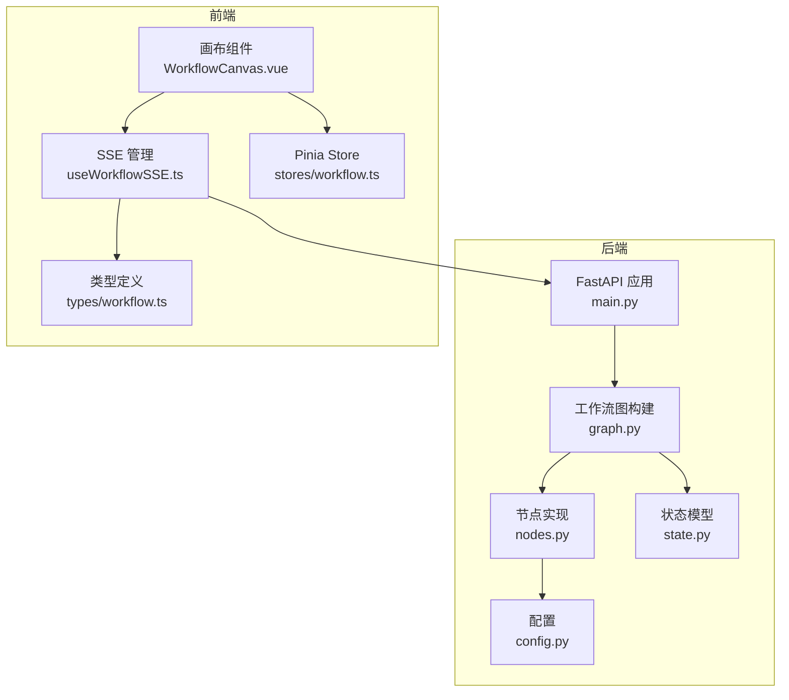
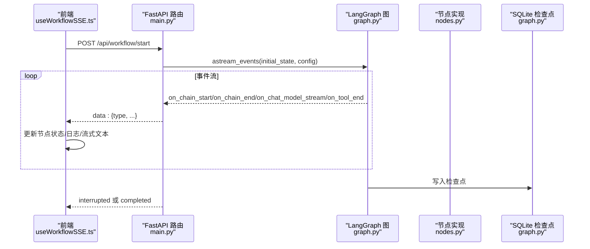
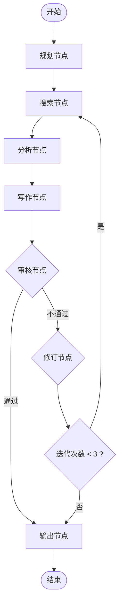
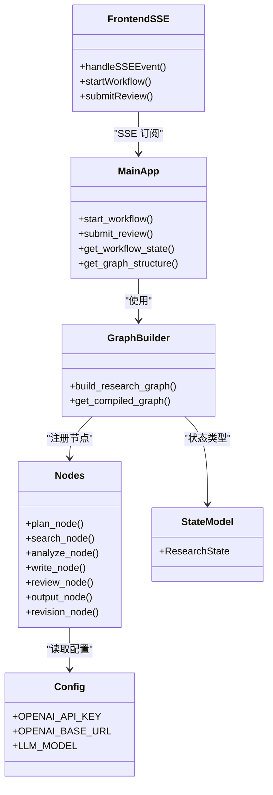
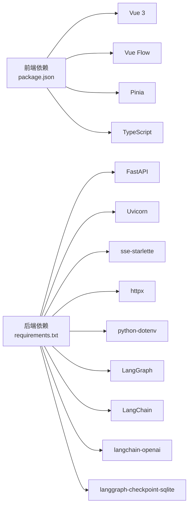

# 调试技巧

<cite>
**本文引用的文件**
- [backend/app/main.py](file://workflow-studio/backend/app/main.py)
- [backend/app/graph.py](file://workflow-studio/backend/app/graph.py)
- [backend/app/nodes.py](file://workflow-studio/backend/app/nodes.py)
- [backend/app/state.py](file://workflow-studio/backend/app/state.py)
- [backend/app/config.py](file://workflow-studio/backend/app/config.py)
- [frontend/src/composables/useWorkflowSSE.ts](file://workflow-studio/frontend/src/composables/useWorkflowSSE.ts)
- [frontend/src/components/WorkflowCanvas.vue](file://workflow-studio/frontend/src/components/WorkflowCanvas.vue)
- [frontend/src/stores/workflow.ts](file://workflow-studio/frontend/src/stores/workflow.ts)
- [frontend/src/types/workflow.ts](file://workflow-studio/frontend/src/types/workflow.ts)
- [backend/requirements.txt](file://workflow-studio/backend/requirements.txt)
- [frontend/package.json](file://workflow-studio/frontend/package.json)
- [README.md](file://workflow-studio/README.md)
</cite>

## 目录
1. [简介](#简介)
2. [项目结构](#项目结构)
3. [核心组件](#核心组件)
4. [架构总览](#架构总览)
5. [详细组件分析](#详细组件分析)
6. [依赖关系分析](#依赖关系分析)
7. [性能考量](#性能考量)
8. [故障排查指南](#故障排查指南)
9. [结论](#结论)
10. [附录](#附录)

## 简介
本指南面向 Workflow Studio 的开发者，聚焦于后端与前端调试、LangGraph 状态追踪、SQLite 检查点查询、SSE 事件监控、网络请求调试、常见问题诊断（LLM API 调用失败、工作流执行异常、实时通信中断）、性能分析与日志记录最佳实践。目标是帮助你在开发过程中快速定位并解决问题。

## 项目结构
- 后端采用 FastAPI 提供 REST + SSE 接口，使用 LangGraph 定义有状态工作流，并通过 SQLite 检查点持久化执行状态。
- 前端基于 Vue 3 + Vue Flow 可视化工作流执行过程，通过 SSE 接收节点开始/结束、工具结果、LLM 流式 token、中断与完成等事件。
- 关键入口：
  - 后端：FastAPI 应用与路由在 main.py；图构建与检查点在 graph.py；节点实现在 nodes.py；状态模型在 state.py；配置在 config.py。
  - 前端：SSE 逻辑在 useWorkflowSSE.ts；画布与状态联动在 WorkflowCanvas.vue；全局状态在 stores/workflow.ts；类型定义在 types/workflow.ts。

图表来源
- [backend/app/main.py:14-21](file://workflow-studio/backend/app/main.py#L14-L21)
- [backend/app/graph.py:23-77](file://workflow-studio/backend/app/graph.py#L23-L77)
- [backend/app/nodes.py:18-129](file://workflow-studio/backend/app/nodes.py#L18-L129)
- [backend/app/state.py:5-30](file://workflow-studio/backend/app/state.py#L5-L30)
- [backend/app/config.py:1-9](file://workflow-studio/backend/app/config.py#L1-L9)
- [frontend/src/composables/useWorkflowSSE.ts:4-172](file://workflow-studio/frontend/src/composables/useWorkflowSSE.ts#L4-L172)
- [frontend/src/components/WorkflowCanvas.vue:1-133](file://workflow-studio/frontend/src/components/WorkflowCanvas.vue#L1-L133)
- [frontend/src/stores/workflow.ts:1-75](file://workflow-studio/frontend/src/stores/workflow.ts#L1-L75)
- [frontend/src/types/workflow.ts:1-64](file://workflow-studio/frontend/src/types/workflow.ts#L1-L64)

章节来源
- [README.md:15-91](file://workflow-studio/README.md#L15-L91)

## 核心组件
- 后端 API 与服务
  - FastAPI 应用初始化与 CORS 配置，提供 /api/workflow/start、/api/workflow/review、/api/workflow/state/{workflow_id}、/api/workflow/graph-structure。
  - 使用 LangGraph 的 astream_events 推送节点开始/结束、LLM 流式 token、工具结果、中断与完成事件。
  - 通过 AsyncSqliteSaver 持久化检查点，支持刷新后恢复。
- 工作流图与节点
  - 图由 StateGraph 构建，包含 plan → search → analyze → write → review → (output | revision → search)。
  - 审核节点前暂停，等待人工审核；修订最多 3 轮防止无限循环。
- 前端 SSE 与可视化
  - useWorkflowSSE 维护节点状态、日志、运行中标志、流式文本、工作流 ID，解析 data: 行并分发事件。
  - WorkflowCanvas 监听 nodeStatuses 变化更新节点样式与边动画。
  - Pinia store 提供跨组件共享状态与计算属性。

章节来源
- [backend/app/main.py:34-200](file://workflow-studio/backend/app/main.py#L34-L200)
- [backend/app/graph.py:23-77](file://workflow-studio/backend/app/graph.py#L23-L77)
- [backend/app/nodes.py:18-129](file://workflow-studio/backend/app/nodes.py#L18-L129)
- [frontend/src/composables/useWorkflowSSE.ts:19-172](file://workflow-studio/frontend/src/composables/useWorkflowSSE.ts#L19-L172)
- [frontend/src/components/WorkflowCanvas.vue:95-127](file://workflow-studio/frontend/src/components/WorkflowCanvas.vue#L95-L127)
- [frontend/src/stores/workflow.ts:5-75](file://workflow-studio/frontend/src/stores/workflow.ts#L5-L75)

## 架构总览
下图展示了从前端发起启动到后端执行工作流、通过 SSE 推送事件、前端渲染更新的完整流程。

图表来源
- [backend/app/main.py:60-103](file://workflow-studio/backend/app/main.py#L60-L103)
- [backend/app/graph.py:65-77](file://workflow-studio/backend/app/graph.py#L65-L77)
- [frontend/src/composables/useWorkflowSSE.ts:84-114](file://workflow-studio/frontend/src/composables/useWorkflowSSE.ts#L84-L114)

## 详细组件分析

### 后端调试方法
- FastAPI 调试模式
  - 使用 uvicorn 的 --reload 开启热重载，便于修改代码即时生效。
  - 访问 /docs 查看自动生成的 API 文档，验证路由与参数。
  - 通过浏览器或 curl 测试 /api/workflow/start 与 /api/workflow/review，观察返回的 SSE 流。
- LangGraph 状态追踪
  - 使用 graph.aget_state(config) 获取当前状态，确认 next 是否为空以判断是否中断。
  - 在 start_workflow 与 submit_review 中均通过 astream_events 监听事件，便于逐步定位问题节点。
- SQLite 数据库查询
  - 检查点存储于 ./checkpoints.db，可通过 sqlite3 命令行或可视化工具打开，查看线程（thread_id）对应的状态快照。
  - 结合 workflow_id 查询对应检查点，验证中断位置与状态字段是否正确更新。

章节来源
- [backend/app/main.py:34-173](file://workflow-studio/backend/app/main.py#L34-L173)
- [backend/app/graph.py:65-77](file://workflow-studio/backend/app/graph.py#L65-L77)
- [backend/app/nodes.py:100-129](file://workflow-studio/backend/app/nodes.py#L100-L129)

### 前端调试技巧
- Vue DevTools 使用
  - 安装浏览器扩展，打开“组件”面板查看 WorkflowCanvas 与 SidePanel 的 props 与响应式数据。
  - 在“状态”面板中观察 useWorkflowSSE 暴露的 nodeStatuses、logs、isRunning、isInterrupted、streamingText、workflowId。
  - 使用 Pinia 插件查看 stores/workflow.ts 的状态变更历史，辅助定位状态同步问题。
- SSE 事件监控
  - 在浏览器“网络”面板找到 /api/workflow/start 或 /api/workflow/review 的请求，选择“事件流”查看 data: 行。
  - 过滤 type 为 node_start、node_end、token、tool_result、interrupted、completed、error，确认事件顺序与内容。
  - 若出现乱码或断流，检查响应头 Cache-Control 与 X-Accel-Buffering，确保未缓存且未被代理缓冲。
- 网络请求调试
  - 使用“控制台”打印 fetch 错误信息，捕获 try/catch 中的异常。
  - 检查 Content-Type 与 JSON body 格式，确保请求体正确序列化。
  - 若跨域报错，确认后端 CORS 允许前端地址（localhost:5173 或 localhost:3000）。

章节来源
- [frontend/src/composables/useWorkflowSSE.ts:84-157](file://workflow-studio/frontend/src/composables/useWorkflowSSE.ts#L84-L157)
- [frontend/src/components/WorkflowCanvas.vue:95-127](file://workflow-studio/frontend/src/components/WorkflowCanvas.vue#L95-L127)
- [backend/app/main.py:16-21](file://workflow-studio/backend/app/main.py#L16-L21)

### 工作流执行流程图（含审核分支）

图表来源
- [backend/app/graph.py:23-62](file://workflow-studio/backend/app/graph.py#L23-L62)
- [backend/app/nodes.py:100-129](file://workflow-studio/backend/app/nodes.py#L100-L129)

### 类与模块关系图

图表来源
- [backend/app/main.py:34-200](file://workflow-studio/backend/app/main.py#L34-L200)
- [backend/app/graph.py:23-77](file://workflow-studio/backend/app/graph.py#L23-L77)
- [backend/app/nodes.py:18-129](file://workflow-studio/backend/app/nodes.py#L18-L129)
- [backend/app/state.py:5-30](file://workflow-studio/backend/app/state.py#L5-L30)
- [backend/app/config.py:1-9](file://workflow-studio/backend/app/config.py#L1-L9)
- [frontend/src/composables/useWorkflowSSE.ts:19-172](file://workflow-studio/frontend/src/composables/useWorkflowSSE.ts#L19-L172)

## 依赖关系分析
- 后端依赖
  - FastAPI、uvicorn、sse-starlette、httpx、python-dotenv。
  - LangGraph、LangChain、langchain-openai、langgraph-checkpoint-sqlite。
- 前端依赖
  - Vue 3、Vue Flow、Pinia、Tailwind CSS、TypeScript、Vite。
- 运行时环境
  - 环境变量 OPENAI_API_KEY、OPENAI_BASE_URL、LLM_MODEL 通过 python-dotenv 加载。

图表来源
- [frontend/package.json:1-32](file://workflow-studio/frontend/package.json#L1-L32)
- [backend/requirements.txt:1-10](file://workflow-studio/backend/requirements.txt#L1-L10)

章节来源
- [backend/requirements.txt:1-10](file://workflow-studio/backend/requirements.txt#L1-L10)
- [frontend/package.json:1-32](file://workflow-studio/frontend/package.json#L1-L32)

## 性能考量
- 内存泄漏检测
  - 前端：使用浏览器“性能”面板录制长时间运行时的内存曲线，关注堆快照增长；检查 SSE reader 是否正确关闭（done 条件退出循环）。
  - 后端：使用 memory_profiler 或 tracemalloc 对长生命周期对象进行采样；避免在节点中累积过大的 messages 列表。
- 响应时间分析
  - 后端：在节点函数前后记录耗时，或使用 OpenTelemetry/requests 钩子统计 LLM 调用耗时。
  - 前端：在 handleSSEEvent 中记录事件处理耗时，识别阻塞 UI 的操作。
- 优化建议
  - 限制 tool_result 与 node_end 输出长度，减少 SSE 负载。
  - 合理设置 LLM temperature 与 max_tokens，降低生成时间与 Token 消耗。
  - 使用连接池与异步 I/O，避免阻塞事件循环。

[本节为通用指导，不直接分析具体文件]

## 故障排查指南
- LLM API 调用失败
  - 检查 .env 中的 OPENAI_API_KEY 与 OPENAI_BASE_URL 是否正确加载。
  - 在 nodes.py 的 llm 初始化处确认参数传递无误。
  - 使用 httpx 或浏览器代理抓包，确认请求头与鉴权信息。
  - 若返回非 JSON，plan_node 会降级为原始问题，需检查 LLM 输出格式。
- 工作流执行异常
  - 通过 /api/workflow/state/{workflow_id} 获取当前状态，确认 next 是否为空。
  - 检查 graph.compile 的 interrupt_before 配置，确保在 review 节点前暂停。
  - 审查 route_after_review 的条件分支，防止死循环或误判。
- 实时通信中断
  - 检查浏览器“网络”面板中 SSE 请求是否持续收到 data: 行。
  - 确认后端返回头包含 no-cache 与禁用缓冲。
  - 前端 ensure 在 read() 抛出错误或 done=true 时退出循环，避免内存泄漏。
- 日志记录最佳实践
  - 在后端节点中添加结构化日志（如 JSON），记录输入摘要、耗时、错误堆栈。
  - 在前端 logs 数组中追加关键事件，便于回放与定位。
  - 将敏感信息脱敏后再记录，避免泄露密钥或用户数据。
- 错误堆栈跟踪
  - 后端：在 astream_events 的 try/except 中捕获异常并返回 error 事件。
  - 前端：在 startWorkflow 与 submitReview 的 catch 块中记录错误消息。
- 调试环境配置
  - 后端：uvicorn app.main:app --reload --port 1994；访问 /docs。
  - 前端：npm run dev；访问 localhost:1993。
  - 环境变量：cp .env.example .env，填写 OPENAI_API_KEY。

章节来源
- [backend/app/config.py:1-9](file://workflow-studio/backend/app/config.py#L1-L9)
- [backend/app/nodes.py:18-40](file://workflow-studio/backend/app/nodes.py#L18-L40)
- [backend/app/main.py:60-103](file://workflow-studio/backend/app/main.py#L60-L103)
- [backend/app/graph.py:65-77](file://workflow-studio/backend/app/graph.py#L65-L77)
- [frontend/src/composables/useWorkflowSSE.ts:84-157](file://workflow-studio/frontend/src/composables/useWorkflowSSE.ts#L84-L157)
- [README.md:23-45](file://workflow-studio/README.md#L23-L45)

## 结论
通过结合 FastAPI 调试模式、LangGraph 状态追踪、SQLite 检查点查询、Vue DevTools、SSE 事件监控与网络请求调试，可以高效定位 Workflow Studio 的问题。遵循日志记录最佳实践与性能分析方法，有助于提升稳定性与可维护性。建议在开发中持续使用上述技巧，形成标准化的排障流程。

## 附录
- 常用命令
  - 后端：cd workflow-studio/backend && uvicorn app.main:app --reload --port 1994
  - 前端：cd workflow-studio/frontend && npm install && npm run dev
- 关键路径
  - 后端入口：main.py
  - 工作流图：graph.py
  - 节点实现：nodes.py
  - 状态模型：state.py
  - 配置：config.py
  - 前端 SSE：useWorkflowSSE.ts
  - 画布组件：WorkflowCanvas.vue
  - 状态管理：stores/workflow.ts
  - 类型定义：types/workflow.ts

[本节为补充信息，不直接分析具体文件]