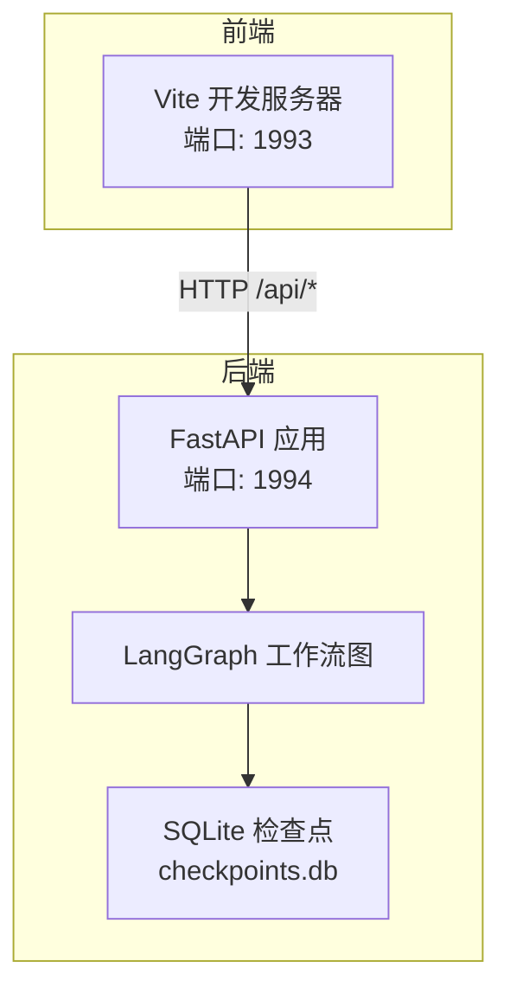
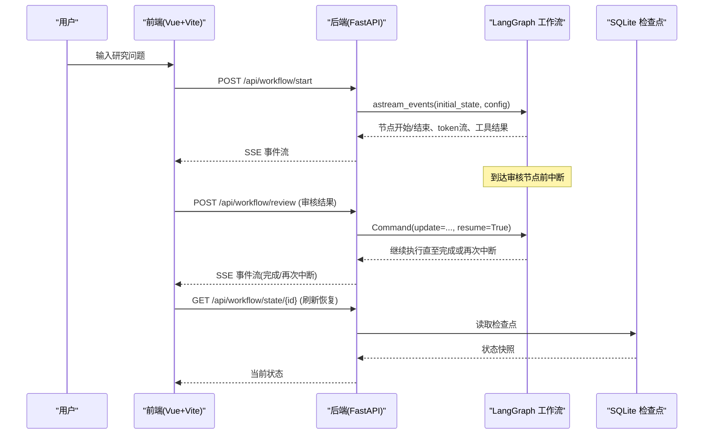
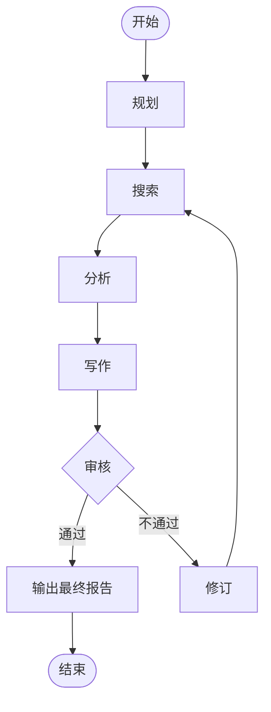
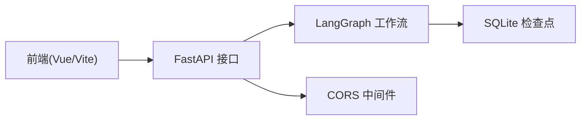

# 快速开始

<cite>
**本文引用的文件**
- [README.md](file://workflow-studio/README.md)
- [requirements.txt](file://workflow-studio/backend/requirements.txt)
- [package.json](file://workflow-studio/frontend/package.json)
- [config.py](file://workflow-studio/backend/app/config.py)
- [main.py](file://workflow-studio/backend/app/main.py)
- [graph.py](file://workflow-studio/backend/app/graph.py)
- [vite.config.ts](file://workflow-studio/frontend/vite.config.ts)
</cite>

## 目录
1. [简介](#简介)
2. [项目结构](#项目结构)
3. [核心组件](#核心组件)
4. [架构总览](#架构总览)
5. [详细组件分析](#详细组件分析)
6. [依赖关系分析](#依赖关系分析)
7. [性能注意事项](#性能注意事项)
8. [故障排除指南](#故障排除指南)
9. [结论](#结论)
10. [附录](#附录)

## 简介
本指南面向首次接触 Workflow Studio 的用户，目标是在最短时间内完成环境准备、配置与启动，体验“可视化工作流 + 多 Agent 协作 + 人工审核”的核心能力。你将学会：
- 安装并配置后端 Python 环境（FastAPI + LangGraph）
- 安装并配置前端 Node.js 环境（Vue 3 + Vite）
- 设置必要的环境变量（OPENAI_API_KEY）
- 启动后端服务（uvicorn）与前端开发服务器
- 解决常见启动与运行问题

## 项目结构
Workflow Studio 采用前后端分离架构：
- 后端：基于 FastAPI 提供 API，使用 LangGraph 定义工作流图，并通过 SQLite 检查点实现状态持久化与中断恢复。
- 前端：基于 Vue 3 + Vite，通过 SSE 实时接收后端事件，渲染工作流执行状态与结果。

图表来源
- [vite.config.ts:12-20](file://workflow-studio/frontend/vite.config.ts#L12-L20)
- [main.py:14-21](file://workflow-studio/backend/app/main.py#L14-L21)
- [graph.py:65-77](file://workflow-studio/backend/app/graph.py#L65-L77)

章节来源
- [README.md:62-90](file://workflow-studio/README.md#L62-L90)

## 核心组件
- 后端入口与路由：FastAPI 应用、CORS 配置、SSE 事件流接口（启动工作流、提交审核、查询状态、获取图结构）。
- 工作流图：LangGraph StateGraph 定义的线性流程与条件分支（规划→搜索→分析→写作→审核→输出/修订），并在审核节点前中断等待人工决策。
- 配置与环境：从环境变量读取 OPENAI_API_KEY、可选的 BASE_URL 与模型名。
- 前端代理：Vite 将 /api 请求转发到后端 1994 端口，便于本地开发联调。

章节来源
- [main.py:14-21](file://workflow-studio/backend/app/main.py#L14-L21)
- [main.py:34-103](file://workflow-studio/backend/app/main.py#L34-L103)
- [main.py:106-154](file://workflow-studio/backend/app/main.py#L106-L154)
- [main.py:157-200](file://workflow-studio/backend/app/main.py#L157-L200)
- [graph.py:23-77](file://workflow-studio/backend/app/graph.py#L23-L77)
- [config.py:1-9](file://workflow-studio/backend/app/config.py#L1-L9)
- [vite.config.ts:12-20](file://workflow-studio/frontend/vite.config.ts#L12-L20)

## 架构总览
下图展示了用户在前端发起研究任务后，后端如何通过 LangGraph 驱动工作流执行，并以 SSE 推送节点开始/结束、LLM 流式输出、工具调用结果等事件；在审核节点处中断，等待前端提交审核结果后继续执行。

图表来源
- [main.py:34-103](file://workflow-studio/backend/app/main.py#L34-L103)
- [main.py:106-154](file://workflow-studio/backend/app/main.py#L106-L154)
- [main.py:157-173](file://workflow-studio/backend/app/main.py#L157-L173)
- [graph.py:65-77](file://workflow-studio/backend/app/graph.py#L65-L77)

## 详细组件分析

### 后端环境与依赖
- Python 版本建议：Python 3.9+（确保 uvloop、httpx 等依赖兼容）
- 虚拟环境：建议在 backend 目录下创建独立 venv 并安装依赖
- 关键依赖：langgraph、fastapi、uvicorn、sse-starlette、httpx、python-dotenv、sqlite 检查点库

章节来源
- [requirements.txt:1-10](file://workflow-studio/backend/requirements.txt#L1-L10)

### 环境变量配置
- 必需：OPENAI_API_KEY（用于 LLM 调用）
- 可选：
  - OPENAI_BASE_URL：自定义 OpenAI 兼容服务的 Base URL
  - LLM_MODEL：指定使用的模型名称（默认 gpt-4o-mini）
- 配置文件会从环境变量加载，若未设置则使用默认值

章节来源
- [config.py:1-9](file://workflow-studio/backend/app/config.py#L1-L9)

### 启动后端服务
- 进入 backend 目录，安装依赖后，使用 uvicorn 启动 app.main:app，监听端口 1994
- 可通过 --reload 开启热重载以便开发调试
- 启动后可访问 /docs 查看自动生成的 API 文档

章节来源
- [README.md:25-35](file://workflow-studio/README.md#L25-L35)
- [main.py:14-21](file://workflow-studio/backend/app/main.py#L14-L21)

### 启动前端开发服务器
- 进入 frontend 目录，安装依赖后运行 dev 脚本，Vite 默认监听端口 1993
- 开发时通过代理将 /api 请求转发至后端 1994 端口，避免跨域问题

章节来源
- [README.md:37-45](file://workflow-studio/README.md#L37-L45)
- [vite.config.ts:12-20](file://workflow-studio/frontend/vite.config.ts#L12-L20)

### 工作流执行流程（算法流程图）

图表来源
- [graph.py:23-62](file://workflow-studio/backend/app/graph.py#L23-L62)

## 依赖关系分析
- 后端依赖 FastAPI 提供 HTTP 接口，使用 sse-starlette 实现 Server-Sent Events 流式响应
- LangGraph 负责工作流编排与状态管理，配合 AsyncSqliteSaver 实现检查点持久化
- 前端依赖 Vue 3、Pinia、Tailwind CSS 与 Vue Flow，通过 SSE 消费后端事件并渲染界面

图表来源
- [main.py:14-21](file://workflow-studio/backend/app/main.py#L14-L21)
- [graph.py:65-77](file://workflow-studio/backend/app/graph.py#L65-L77)

章节来源
- [requirements.txt:1-10](file://workflow-studio/backend/requirements.txt#L1-L10)
- [package.json:11-30](file://workflow-studio/frontend/package.json#L11-L30)

## 性能注意事项
- 并发与流式：SSE 流式传输可减少首屏延迟，提升交互体验
- 检查点：SQLite 检查点适合本地开发；生产环境可替换为 PostgreSQL 以提升并发与可靠性
- 资源占用：LLM 调用可能耗时较长，建议合理设置超时与重试策略
- 前端代理：开发时使用 Vite 代理避免跨域开销，生产部署需配置反向代理

[本节为通用指导，无需特定文件引用]

## 故障排除指南
- 无法访问 /docs
  - 确认后端已启动且监听 1994 端口
  - 检查防火墙或端口占用
  - 参考后端启动命令与日志定位问题

- 前端无法连接后端
  - 确认 Vite 代理配置指向 http://localhost:1994
  - 检查浏览器控制台是否有跨域错误
  - 确认后端 CORS 允许前端来源（默认允许 localhost 多个端口）

- 工作流未中断或无法恢复
  - 确认 graph 编译时设置了 interrupt_before=["review"]
  - 检查 /api/workflow/state/{workflow_id} 返回的 is_interrupted 字段
  - 确保 workflow_id 正确传递到审核接口

- LLM 调用失败
  - 检查 OPENAI_API_KEY 是否正确设置
  - 如需使用兼容服务，请设置 OPENAI_BASE_URL
  - 查看后端日志中的异常信息

- 端口冲突
  - 前端默认 1993，后端默认 1994，如被占用请修改对应端口配置

章节来源
- [main.py:14-21](file://workflow-studio/backend/app/main.py#L14-L21)
- [main.py:34-103](file://workflow-studio/backend/app/main.py#L34-L103)
- [main.py:106-154](file://workflow-studio/backend/app/main.py#L106-L154)
- [main.py:157-173](file://workflow-studio/backend/app/main.py#L157-L173)
- [graph.py:65-77](file://workflow-studio/backend/app/graph.py#L65-L77)
- [vite.config.ts:12-20](file://workflow-studio/frontend/vite.config.ts#L12-L20)

## 结论
按照本指南完成环境准备与配置后，你即可在本地同时运行后端与前端，体验从提问到生成报告的完整工作流，并在审核节点进行人工干预。后续可根据需求扩展节点、接入更多工具或替换检查点存储以适配生产环境。

[本节为总结性内容，无需特定文件引用]

## 附录

### 一键启动步骤（推荐顺序）
- 后端
  - 进入 backend 目录，安装依赖
  - 设置环境变量 OPENAI_API_KEY（以及可选的 OPENAI_BASE_URL、LLM_MODEL）
  - 使用 uvicorn 启动 app.main:app，端口 1994
- 前端
  - 进入 frontend 目录，安装依赖
  - 运行 dev 脚本，端口 1993
  - 打开浏览器访问 http://localhost:1993

章节来源
- [README.md:25-45](file://workflow-studio/README.md#L25-L45)
- [requirements.txt:1-10](file://workflow-studio/backend/requirements.txt#L1-L10)
- [package.json:6-10](file://workflow-studio/frontend/package.json#L6-L10)
- [vite.config.ts:12-20](file://workflow-studio/frontend/vite.config.ts#L12-L20)