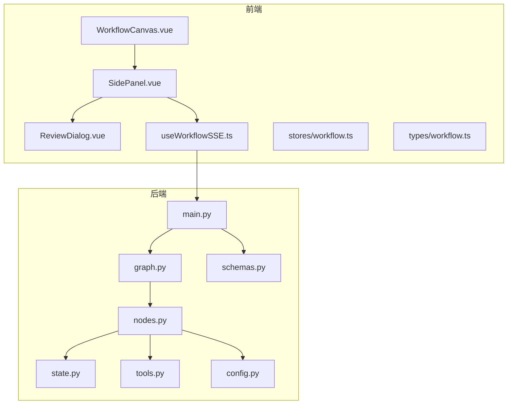
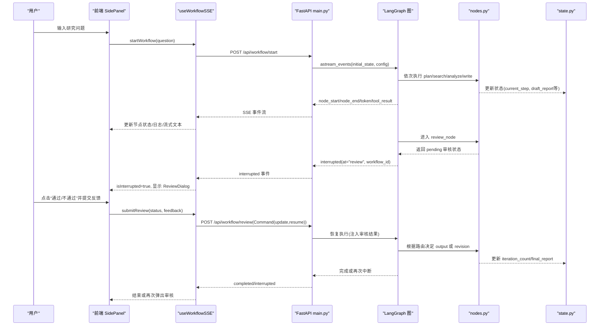
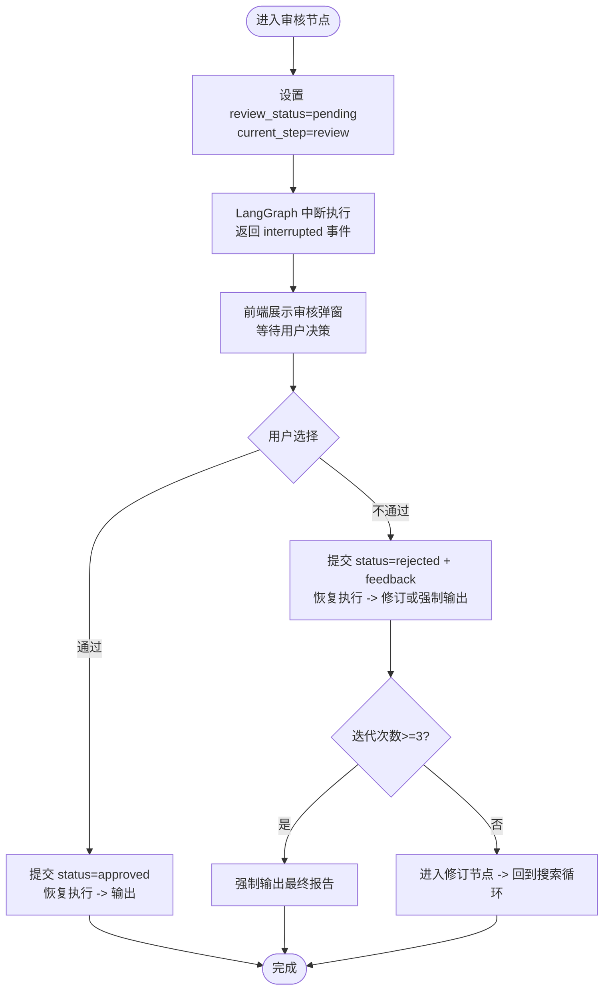
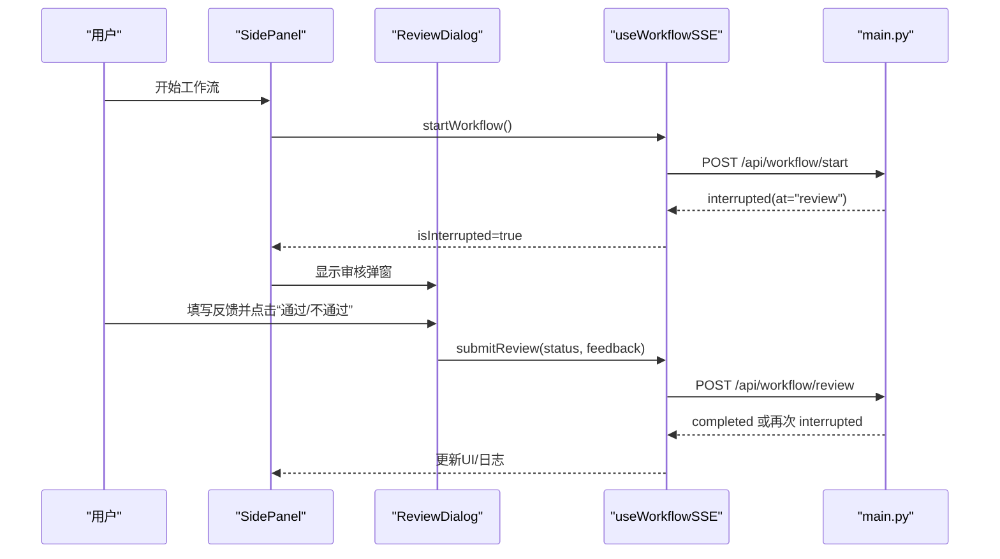
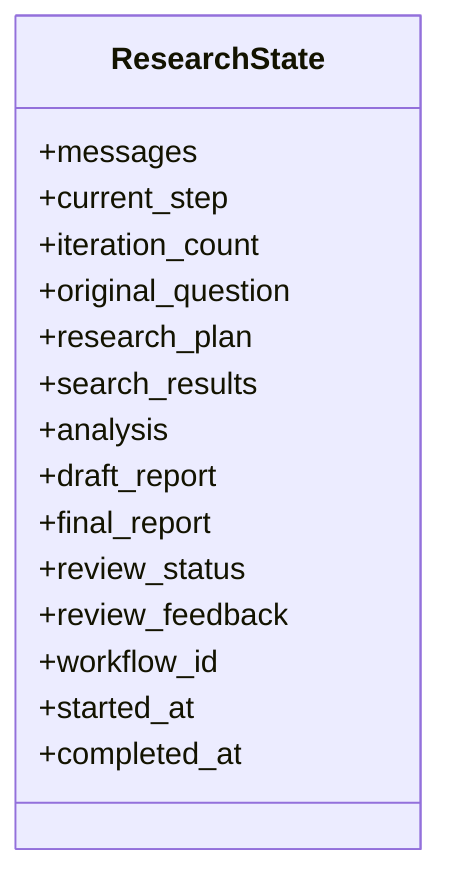
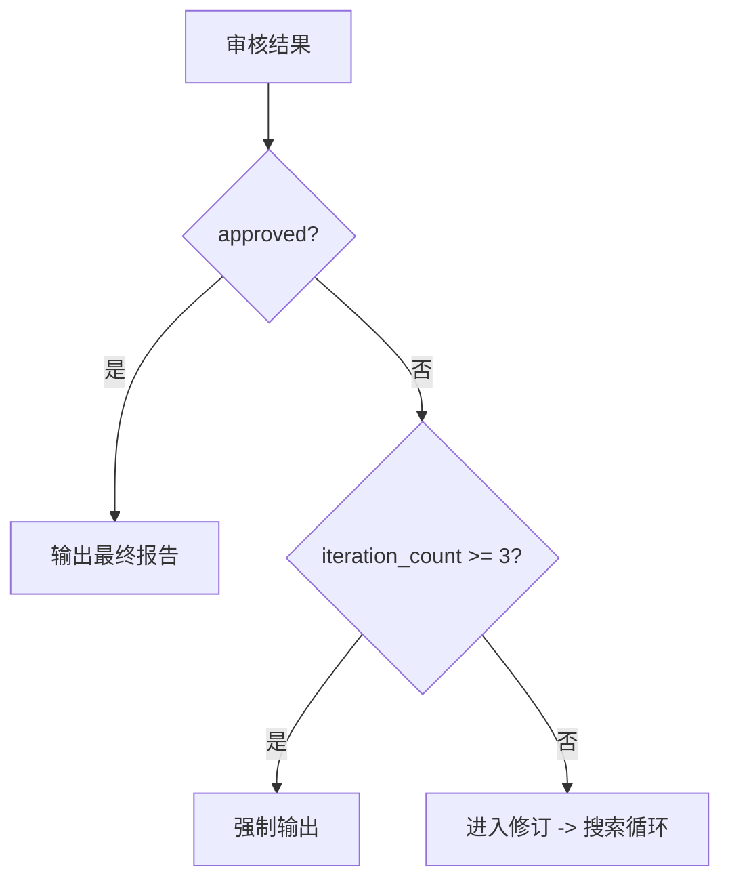
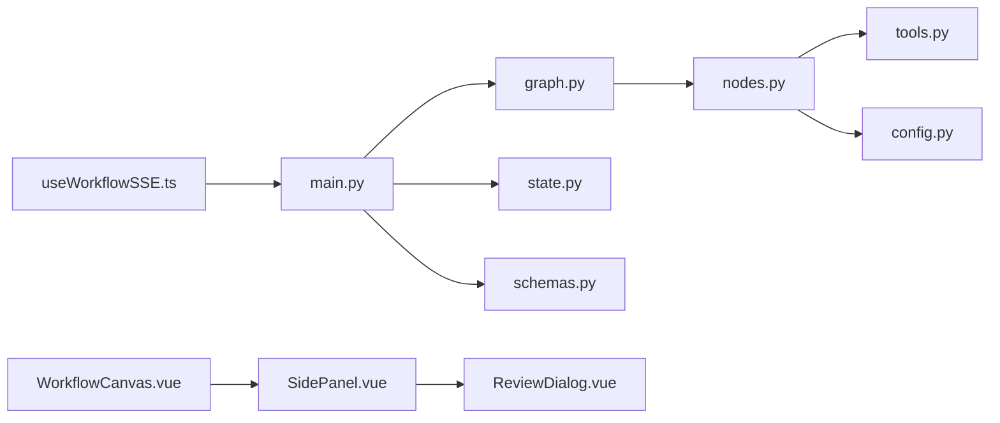

# 人工审核机制

<cite>
**本文引用的文件**
- [backend/app/main.py](file://workflow-studio/backend/app/main.py)
- [backend/app/graph.py](file://workflow-studio/backend/app/graph.py)
- [backend/app/nodes.py](file://workflow-studio/backend/app/nodes.py)
- [backend/app/state.py](file://workflow-studio/backend/app/state.py)
- [backend/app/schemas.py](file://workflow-studio/backend/app/schemas.py)
- [backend/app/tools.py](file://workflow-studio/backend/app/tools.py)
- [backend/app/config.py](file://workflow-studio/backend/app/config.py)
- [frontend/src/components/WorkflowCanvas.vue](file://workflow-studio/frontend/src/components/WorkflowCanvas.vue)
- [frontend/src/components/layout/SidePanel.vue](file://workflow-studio/frontend/src/components/layout/SidePanel.vue)
- [frontend/src/components/panels/ReviewDialog.vue](file://workflow-studio/frontend/src/components/panels/ReviewDialog.vue)
- [frontend/src/composables/useWorkflowSSE.ts](file://workflow-studio/frontend/src/composables/useWorkflowSSE.ts)
- [frontend/src/stores/workflow.ts](file://workflow-studio/frontend/src/stores/workflow.ts)
- [frontend/src/types/workflow.ts](file://workflow-studio/frontend/src/types/workflow.ts)
- [README.md](file://workflow-studio/README.md)
</cite>

## 目录
1. [简介](#简介)
2. [项目结构](#项目结构)
3. [核心组件](#核心组件)
4. [架构总览](#架构总览)
5. [详细组件分析](#详细组件分析)
6. [依赖关系分析](#依赖关系分析)
7. [性能与可扩展性](#性能与可扩展性)
8. [故障排查指南](#故障排查指南)
9. [结论](#结论)
10. [附录：API 参考与操作示例](#附录api-参考与操作示例)

## 简介
本文件围绕“人工审核机制”展开，系统性阐述 Human-in-the-loop（人在回路）设计模式在该研究工作流中的应用。重点包括：
- 审核节点的暂停机制与恢复逻辑
- 用户决策界面与交互流程
- 工作流状态持久化与检查点恢复
- 审核规则配置、批量审核思路与审计日志实现方法
- 前端 SSE 实时推送、错误处理策略与可观测性

该系统基于 LangGraph + FastAPI + Vue 3 + Vue Flow，支持在关键节点（审核）中断执行，等待人工决策后继续推进或回退修订，并通过 SQLite 检查点实现刷新不丢进度。

## 项目结构
后端采用 FastAPI 暴露 API，使用 LangGraph 定义有状态工作流图；前端通过 Vue Flow 可视化节点执行状态，并使用 SSE 接收实时事件。审核弹窗在侧边面板中弹出，提交审核后恢复工作流。

图表来源
- [frontend/src/components/WorkflowCanvas.vue:1-133](file://workflow-studio/frontend/src/components/WorkflowCanvas.vue#L1-L133)
- [frontend/src/components/layout/SidePanel.vue:1-39](file://workflow-studio/frontend/src/components/layout/SidePanel.vue#L1-L39)
- [frontend/src/components/panels/ReviewDialog.vue:1-54](file://workflow-studio/frontend/src/components/panels/ReviewDialog.vue#L1-L54)
- [frontend/src/composables/useWorkflowSSE.ts:1-172](file://workflow-studio/frontend/src/composables/useWorkflowSSE.ts#L1-L172)
- [backend/app/main.py:1-200](file://workflow-studio/backend/app/main.py#L1-L200)
- [backend/app/graph.py:1-78](file://workflow-studio/backend/app/graph.py#L1-L78)
- [backend/app/nodes.py:1-129](file://workflow-studio/backend/app/nodes.py#L1-L129)
- [backend/app/state.py:1-30](file://workflow-studio/backend/app/state.py#L1-L30)
- [backend/app/schemas.py:1-12](file://workflow-studio/backend/app/schemas.py#L1-L12)
- [backend/app/tools.py:1-26](file://workflow-studio/backend/app/tools.py#L1-L26)
- [backend/app/config.py:1-9](file://workflow-studio/backend/app/config.py#L1-L9)

章节来源
- [README.md:1-109](file://workflow-studio/README.md#L1-L109)

## 核心组件
- 工作流图与节点：规划、搜索、分析、写作、审核、修订、输出
- 审核中断与恢复：LangGraph 的 interrupt_before 在审核前暂停；提交审核后注入状态并恢复
- 状态模型：包含消息历史、控制字段、研究内容、审核结果与元数据
- 前端交互：SSE 事件驱动 UI 更新，审核弹窗触发提交
- 持久化：SQLite 检查点保存线程级状态，支持页面刷新恢复

章节来源
- [backend/app/graph.py:23-78](file://workflow-studio/backend/app/graph.py#L23-L78)
- [backend/app/nodes.py:100-129](file://workflow-studio/backend/app/nodes.py#L100-L129)
- [backend/app/state.py:5-30](file://workflow-studio/backend/app/state.py#L5-L30)
- [frontend/src/composables/useWorkflowSSE.ts:19-72](file://workflow-studio/frontend/src/composables/useWorkflowSSE.ts#L19-L72)
- [frontend/src/components/panels/ReviewDialog.vue:32-54](file://workflow-studio/frontend/src/components/panels/ReviewDialog.vue#L32-L54)

## 架构总览
下图展示了从启动到审核暂停、再到恢复执行的完整时序。

图表来源
- [backend/app/main.py:35-154](file://workflow-studio/backend/app/main.py#L35-L154)
- [backend/app/graph.py:11-78](file://workflow-studio/backend/app/graph.py#L11-L78)
- [backend/app/nodes.py:18-129](file://workflow-studio/backend/app/nodes.py#L18-L129)
- [frontend/src/composables/useWorkflowSSE.ts:74-157](file://workflow-studio/frontend/src/composables/useWorkflowSSE.ts#L74-L157)
- [frontend/src/components/layout/SidePanel.vue:1-39](file://workflow-studio/frontend/src/components/layout/SidePanel.vue#L1-L39)

## 详细组件分析

### 审核节点与暂停机制
- 审核节点职责：生成草稿报告后，将状态标记为 pending，并交由人类审核。
- 暂停机制：编译图时设置 interrupt_before=["review"]，使执行在审核节点前停止，等待外部恢复。
- 恢复逻辑：提交审核后，后端使用 Command(update=update, resume=True) 注入审核结果并恢复执行。

图表来源
- [backend/app/nodes.py:100-129](file://workflow-studio/backend/app/nodes.py#L100-L129)
- [backend/app/graph.py:11-21](file://workflow-studio/backend/app/graph.py#L11-L21)
- [backend/app/main.py:107-154](file://workflow-studio/backend/app/main.py#L107-L154)

章节来源
- [backend/app/graph.py:65-78](file://workflow-studio/backend/app/graph.py#L65-L78)
- [backend/app/nodes.py:100-129](file://workflow-studio/backend/app/nodes.py#L100-L129)
- [backend/app/main.py:107-154](file://workflow-studio/backend/app/main.py#L107-L154)

### 用户决策界面与交互
- 审核弹窗：提供意见输入框与“通过/不通过”按钮；不通过时必须填写反馈。
- 交互流程：当收到 interrupted 事件时，侧边面板显示审核弹窗；用户提交后调用 submitReview。
- 状态同步：SSE 实时更新节点状态、日志和流式文本，确保用户感知当前执行位置。

图表来源
- [frontend/src/components/layout/SidePanel.vue:1-39](file://workflow-studio/frontend/src/components/layout/SidePanel.vue#L1-L39)
- [frontend/src/components/panels/ReviewDialog.vue:1-54](file://workflow-studio/frontend/src/components/panels/ReviewDialog.vue#L1-L54)
- [frontend/src/composables/useWorkflowSSE.ts:116-157](file://workflow-studio/frontend/src/composables/useWorkflowSSE.ts#L116-L157)
- [backend/app/main.py:107-154](file://workflow-studio/backend/app/main.py#L107-L154)

章节来源
- [frontend/src/components/panels/ReviewDialog.vue:32-54](file://workflow-studio/frontend/src/components/panels/ReviewDialog.vue#L32-L54)
- [frontend/src/composables/useWorkflowSSE.ts:19-72](file://workflow-studio/frontend/src/composables/useWorkflowSSE.ts#L19-L72)

### 工作流恢复与状态持久化
- 检查点：使用 AsyncSqliteSaver 保存每个 thread_id 的状态，支持中断恢复与页面刷新恢复。
- 恢复接口：/api/workflow/state/{workflow_id} 获取当前状态，用于前端恢复渲染。
- 恢复执行：提交审核后使用 Command(resume=True) 从断点继续执行。

图表来源
- [backend/app/state.py:5-30](file://workflow-studio/backend/app/state.py#L5-L30)

章节来源
- [backend/app/main.py:158-173](file://workflow-studio/backend/app/main.py#L158-L173)
- [backend/app/graph.py:65-78](file://workflow-studio/backend/app/graph.py#L65-L78)

### 审核规则配置与防无限循环
- 条件路由：审核通过后直接输出；不通过则进入修订，最多 3 轮修订后强制输出。
- 迭代计数：revision_node 递增 iteration_count，route_after_review 判断是否强制输出。
- 扩展点：可在 route_after_review 中增加更多业务规则（如质量阈值、专家复核）。

图表来源
- [backend/app/graph.py:11-21](file://workflow-studio/backend/app/graph.py#L11-L21)
- [backend/app/nodes.py:121-129](file://workflow-studio/backend/app/nodes.py#L121-L129)

章节来源
- [backend/app/graph.py:11-21](file://workflow-studio/backend/app/graph.py#L11-L21)
- [backend/app/nodes.py:121-129](file://workflow-studio/backend/app/nodes.py#L121-L129)

### 批量审核功能（建议方案）
当前实现为单条工作流的审核。若需批量审核，可考虑以下方案：
- 批量提交：前端收集多个待审工作流 ID，分批调用 /api/workflow/review，后端按 thread_id 并发恢复。
- 队列管理：引入任务队列（如 Celery/RQ）管理批量恢复，避免阻塞主进程。
- 进度追踪：为每个工作流维护独立状态，前端以列表形式展示批量进度。
- 幂等性：确保同一 workflow_id 多次提交不会重复执行。

[本节为概念性建议，无具体代码映射]

### 审计日志实现（建议方案）
当前系统通过 logs 数组记录执行事件，可作为轻量审计基础。建议增强：
- 结构化日志：在后端记录每次中断/恢复、审核结果、时间戳、用户标识（如有）。
- 存储层：将审计日志写入数据库或对象存储，便于检索与分析。
- 前端展示：在 Timeline 中增加筛选与导出能力。
- 合规性：保留敏感信息脱敏策略与访问权限控制。

[本节为概念性建议，无具体代码映射]

## 依赖关系分析
- 后端模块耦合：
  - main.py 依赖 graph.py、state.py、schemas.py
  - graph.py 依赖 nodes.py、state.py，并配置 checkpointer 与中断点
  - nodes.py 依赖 state.py、tools.py、config.py
- 前后端集成：
  - 前端 useWorkflowSSE.ts 通过 SSE 消费后端事件
  - WorkflowCanvas.vue 与 SidePanel.vue 组合渲染与交互
  - ReviewDialog.vue 负责用户输入与回调

图表来源
- [backend/app/main.py:1-200](file://workflow-studio/backend/app/main.py#L1-L200)
- [backend/app/graph.py:1-78](file://workflow-studio/backend/app/graph.py#L1-L78)
- [backend/app/nodes.py:1-129](file://workflow-studio/backend/app/nodes.py#L1-L129)
- [frontend/src/composables/useWorkflowSSE.ts:1-172](file://workflow-studio/frontend/src/composables/useWorkflowSSE.ts#L1-L172)
- [frontend/src/components/WorkflowCanvas.vue:1-133](file://workflow-studio/frontend/src/components/WorkflowCanvas.vue#L1-L133)
- [frontend/src/components/layout/SidePanel.vue:1-39](file://workflow-studio/frontend/src/components/layout/SidePanel.vue#L1-L39)
- [frontend/src/components/panels/ReviewDialog.vue:1-54](file://workflow-studio/frontend/src/components/panels/ReviewDialog.vue#L1-L54)

章节来源
- [backend/app/main.py:1-200](file://workflow-studio/backend/app/main.py#L1-L200)
- [backend/app/graph.py:1-78](file://workflow-studio/backend/app/graph.py#L1-L78)
- [backend/app/nodes.py:1-129](file://workflow-studio/backend/app/nodes.py#L1-L129)
- [frontend/src/composables/useWorkflowSSE.ts:1-172](file://workflow-studio/frontend/src/composables/useWorkflowSSE.ts#L1-L172)

## 性能与可扩展性
- 流式传输：SSE 提供低延迟的事件推送，减少前端轮询开销。
- 检查点持久化：SQLite 适合开发/小规模场景；生产环境可替换为 PostgreSQL 以提升并发与可靠性。
- 节点并行：可将搜索节点拆分为并行子任务，提升吞吐。
- 资源限制：LLM 调用需限流与重试；工具调用应缓存热点结果。
- 监控指标：记录各节点耗时、Token 消耗、中断次数、恢复成功率。

[本节提供通用指导，无具体文件分析]

## 故障排查指南
- 无法恢复执行：
  - 确认 workflow_id 正确且存在于检查点
  - 检查 /api/workflow/state/{workflow_id} 返回 next 是否为空
- 审核弹窗未出现：
  - 确认 interrupted 事件已到达前端
  - 检查 isInterrupted 状态与 ReviewDialog 显示条件
- 无限循环：
  - 验证 iteration_count 是否正确递增
  - 检查 route_after_review 的强制输出逻辑
- 网络错误：
  - 捕获 SSE 连接异常并重试
  - 记录错误日志并提示用户

章节来源
- [backend/app/main.py:158-173](file://workflow-studio/backend/app/main.py#L158-L173)
- [frontend/src/composables/useWorkflowSSE.ts:66-72](file://workflow-studio/frontend/src/composables/useWorkflowSSE.ts#L66-L72)
- [backend/app/graph.py:11-21](file://workflow-studio/backend/app/graph.py#L11-L21)

## 结论
该人工审核机制通过 LangGraph 的中断与恢复能力，结合前端 SSE 实时交互，实现了可靠的人机协同工作流。审核规则清晰、状态持久化完善，具备向生产环境扩展的基础。建议在后续版本中增强批量审核、审计日志与监控指标，以提升可运维性与合规性。

[本节总结性内容，无具体文件分析]

## 附录：API 参考与操作示例

### 启动工作流
- 端点：POST /api/workflow/start
- 请求体：包含研究问题
- 响应：SSE 事件流，包含节点开始/结束、token 流、工具结果、中断与完成事件

章节来源
- [backend/app/main.py:35-103](file://workflow-studio/backend/app/main.py#L35-L103)
- [backend/app/schemas.py:4-6](file://workflow-studio/backend/app/schemas.py#L4-L6)

### 提交审核结果
- 端点：POST /api/workflow/review
- 请求体：workflow_id、status（approved/rejected）、feedback
- 响应：SSE 事件流，可能再次中断或完成

章节来源
- [backend/app/main.py:107-154](file://workflow-studio/backend/app/main.py#L107-L154)
- [backend/app/schemas.py:8-12](file://workflow-studio/backend/app/schemas.py#L8-L12)

### 获取工作流状态（检查点恢复）
- 端点：GET /api/workflow/state/{workflow_id}
- 响应：当前状态值、下一个节点、是否中断

章节来源
- [backend/app/main.py:158-173](file://workflow-studio/backend/app/main.py#L158-L173)

### 获取图结构（供前端渲染）
- 端点：GET /api/workflow/graph-structure
- 响应：节点与边的静态布局信息

章节来源
- [backend/app/main.py:177-200](file://workflow-studio/backend/app/main.py#L177-L200)

### 前端操作流程
- 启动：用户在聊天输入框提交问题，触发 startWorkflow
- 监听：useWorkflowSSE 解析 SSE 事件，更新节点状态与日志
- 审核：收到 interrupted 事件后显示 ReviewDialog，用户提交审核后恢复执行
- 恢复：页面刷新时可通过 /api/workflow/state 恢复状态

章节来源
- [frontend/src/components/layout/SidePanel.vue:1-39](file://workflow-studio/frontend/src/components/layout/SidePanel.vue#L1-L39)
- [frontend/src/composables/useWorkflowSSE.ts:74-157](file://workflow-studio/frontend/src/composables/useWorkflowSSE.ts#L74-L157)
- [frontend/src/components/panels/ReviewDialog.vue:32-54](file://workflow-studio/frontend/src/components/panels/ReviewDialog.vue#L32-L54)