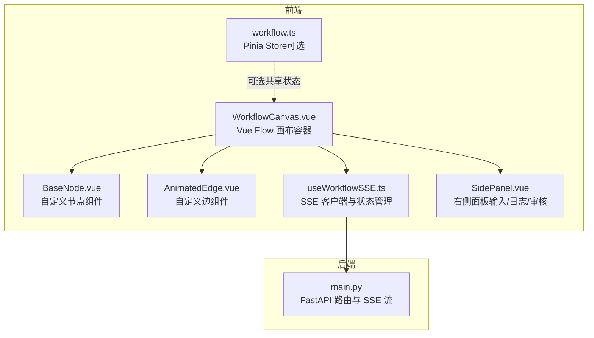
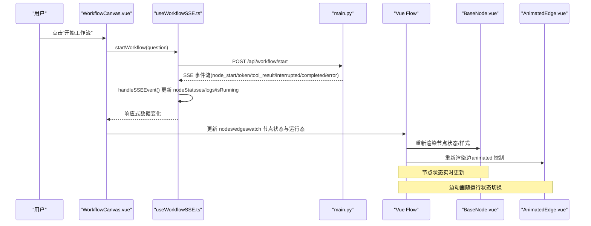
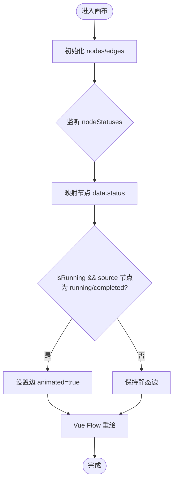
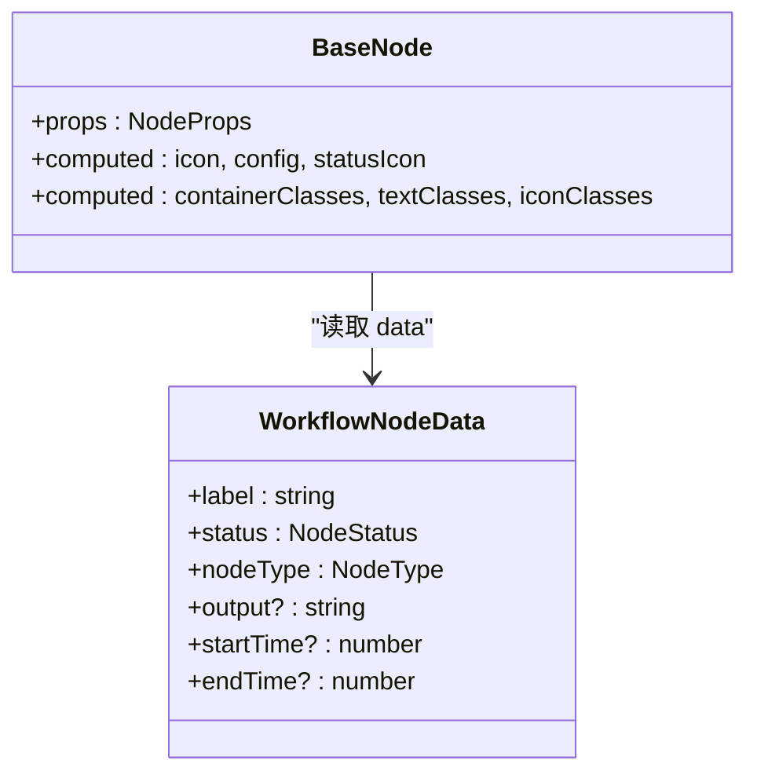
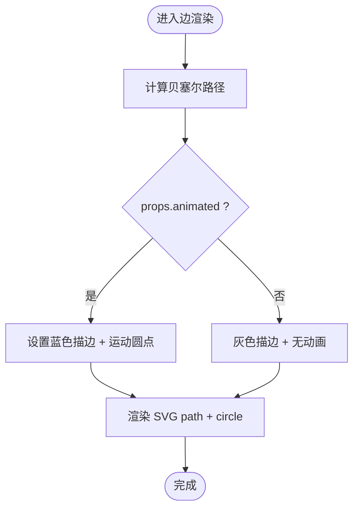
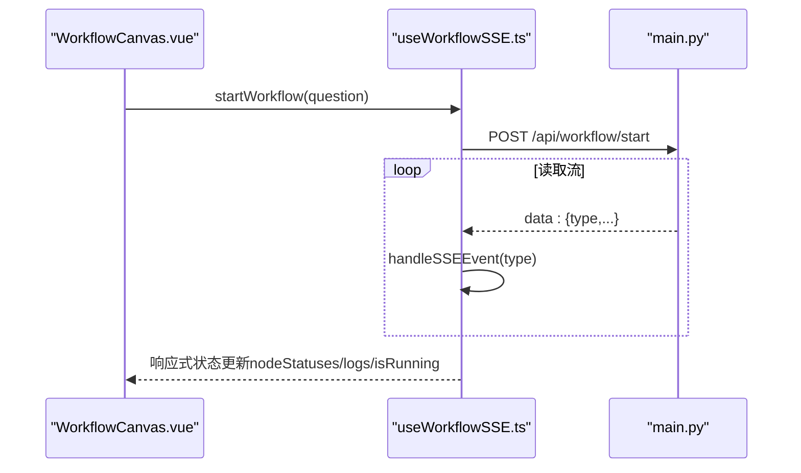
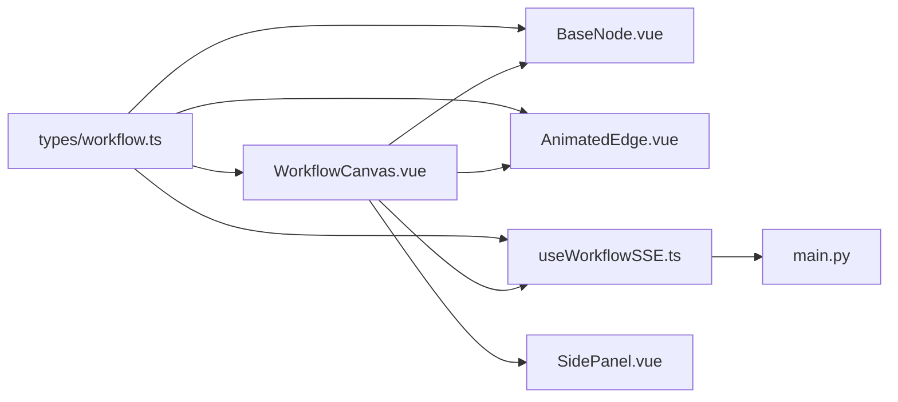

# 可视化工作流执行

<cite>
**本文引用的文件**
- [WorkflowCanvas.vue](file://workflow-studio/frontend/src/components/WorkflowCanvas.vue)
- [BaseNode.vue](file://workflow-studio/frontend/src/components/nodes/BaseNode.vue)
- [AnimatedEdge.vue](file://workflow-studio/frontend/src/components/edges/AnimatedEdge.vue)
- [useWorkflowSSE.ts](file://workflow-studio/frontend/src/composables/useWorkflowSSE.ts)
- [workflow.ts](file://workflow-studio/frontend/src/stores/workflow.ts)
- [workflow.ts（类型定义）](file://workflow-studio/frontend/src/types/workflow.ts)
- [SidePanel.vue](file://workflow-studio/frontend/src/components/layout/SidePanel.vue)
- [main.py](file://workflow-studio/backend/app/main.py)
- [package.json](file://workflow-studio/frontend/package.json)
</cite>

## 目录
1. [简介](#简介)
2. [项目结构](#项目结构)
3. [核心组件](#核心组件)
4. [架构总览](#架构总览)
5. [详细组件分析](#详细组件分析)
6. [依赖关系分析](#依赖关系分析)
7. [性能考虑](#性能考虑)
8. [故障排除指南](#故障排除指南)
9. [结论](#结论)
10. [附录：集成与配置示例路径](#附录：集成与配置示例路径)

## 简介
本文件面向“基于 Vue Flow 的工作流可视化执行”功能，系统性说明前端如何实现节点状态实时更新、边动画效果、缩放平移操作等特性，并解释渲染机制、自定义节点与边的实现方式、以及前后端通过 SSE 的实时状态同步。文档同时提供性能优化建议与常见问题排查方法，帮助读者快速集成与排障。

## 项目结构
前端采用 Vue 3 + TypeScript，使用 @vue-flow/core 及其扩展构建可视化画布；后端使用 FastAPI 暴露 SSE 接口，将 LangGraph 事件流式推送至前端，驱动界面更新。

图表来源
- [WorkflowCanvas.vue:1-133](file://workflow-studio/frontend/src/components/WorkflowCanvas.vue#L1-L133)
- [BaseNode.vue:1-82](file://workflow-studio/frontend/src/components/nodes/BaseNode.vue#L1-L82)
- [AnimatedEdge.vue:1-48](file://workflow-studio/frontend/src/components/edges/AnimatedEdge.vue#L1-L48)
- [useWorkflowSSE.ts:1-172](file://workflow-studio/frontend/src/composables/useWorkflowSSE.ts#L1-L172)
- [workflow.ts:1-75](file://workflow-studio/frontend/src/stores/workflow.ts#L1-L75)
- [SidePanel.vue:1-39](file://workflow-studio/frontend/src/components/layout/SidePanel.vue#L1-L39)
- [main.py:34-200](file://workflow-studio/backend/app/main.py#L34-L200)

章节来源
- [WorkflowCanvas.vue:1-133](file://workflow-studio/frontend/src/components/WorkflowCanvas.vue#L1-L133)
- [package.json:1-32](file://workflow-studio/frontend/package.json#L1-L32)

## 核心组件
- WorkflowCanvas：基于 Vue Flow 的画布容器，负责注册节点类型、初始化节点与边、监听点击事件、根据 SSE 状态驱动节点样式与边动画。
- BaseNode：自定义节点组件，展示图标、标签、状态图标与耗时，依据状态动态切换样式与动画。
- AnimatedEdge：自定义边组件，计算贝塞尔路径，支持运行时动态颜色与运动圆点动画。
- useWorkflowSSE：封装 SSE 连接、事件解析与状态更新，提供启动工作流与提交审核的能力。
- workflow.ts（Pinia Store）：集中式状态管理（可选），提供节点状态查询与重置能力。
- SidePanel：右侧面板，聚合输入、审核弹窗、流式输出、节点详情与时间线日志。

章节来源
- [WorkflowCanvas.vue:35-133](file://workflow-studio/frontend/src/components/WorkflowCanvas.vue#L35-L133)
- [BaseNode.vue:23-82](file://workflow-studio/frontend/src/components/nodes/BaseNode.vue#L23-L82)
- [AnimatedEdge.vue:16-48](file://workflow-studio/frontend/src/components/edges/AnimatedEdge.vue#L16-L48)
- [useWorkflowSSE.ts:4-172](file://workflow-studio/frontend/src/composables/useWorkflowSSE.ts#L4-L172)
- [workflow.ts:5-75](file://workflow-studio/frontend/src/stores/workflow.ts#L5-L75)
- [SidePanel.vue:1-39](file://workflow-studio/frontend/src/components/layout/SidePanel.vue#L1-L39)

## 架构总览
前端通过 Vue Flow 渲染图结构，节点与边均为自定义组件；SSE 事件驱动节点状态变更，进而触发视图更新与边动画。后端以 FastAPI 暴露 SSE 接口，将 LangGraph 的事件转换为统一格式推送到前端。

图表来源
- [WorkflowCanvas.vue:85-127](file://workflow-studio/frontend/src/components/WorkflowCanvas.vue#L85-L127)
- [useWorkflowSSE.ts:19-114](file://workflow-studio/frontend/src/composables/useWorkflowSSE.ts#L19-L114)
- [main.py:34-103](file://workflow-studio/backend/app/main.py#L34-L103)

## 详细组件分析

### WorkflowCanvas.vue：画布与状态联动
- 注册自定义节点类型，绑定 v-model:nodes/v-model:edges，启用 fit-view、背景网格、控件与小地图。
- 初始节点与边定义包含位置、标签、状态与边样式（如虚线、颜色）。
- 通过 watch 监听 nodeStatuses 与 isRunning，动态更新节点 data.status 与边 animated 属性，从而驱动节点样式与边动画。
- 节点点击事件用于选择节点，配合右侧面板显示详情。

图表来源
- [WorkflowCanvas.vue:55-83](file://workflow-studio/frontend/src/components/WorkflowCanvas.vue#L55-L83)
- [WorkflowCanvas.vue:95-127](file://workflow-studio/frontend/src/components/WorkflowCanvas.vue#L95-L127)

章节来源
- [WorkflowCanvas.vue:1-133](file://workflow-studio/frontend/src/components/WorkflowCanvas.vue#L1-L133)

### BaseNode.vue：自定义节点组件
- 使用 Handle 定义连接点（顶部目标、底部源），便于连线交互。
- 根据节点类型与状态计算图标、文本样式与边框背景色，运行中节点带旋转动画。
- 若存在 startTime/endTime，则显示执行耗时。

图表来源
- [BaseNode.vue:23-82](file://workflow-studio/frontend/src/components/nodes/BaseNode.vue#L23-L82)
- [workflow.ts（类型定义）:9-20](file://workflow-studio/frontend/src/types/workflow.ts#L9-L20)

章节来源
- [BaseNode.vue:1-82](file://workflow-studio/frontend/src/components/nodes/BaseNode.vue#L1-L82)
- [workflow.ts（类型定义）:1-64](file://workflow-studio/frontend/src/types/workflow.ts#L1-L64)

### AnimatedEdge.vue：自定义边组件
- 使用 getBezierPath 计算路径，根据 animated 属性切换描边颜色与运动圆点动画。
- 通过 <animateMotion> 沿路径循环移动小圆点，直观表示数据流动。

图表来源
- [AnimatedEdge.vue:16-48](file://workflow-studio/frontend/src/components/edges/AnimatedEdge.vue#L16-L48)

章节来源
- [AnimatedEdge.vue:1-48](file://workflow-studio/frontend/src/components/edges/AnimatedEdge.vue#L1-L48)

### useWorkflowSSE.ts：SSE 客户端与状态管理
- startWorkflow：发起请求，读取流式响应，按行过滤 data: 前缀，解析 JSON 后调用 handleSSEEvent。
- handleSSEEvent：根据事件类型更新 nodeStatuses、logs、isRunning、streamingText 等状态。
- submitReview：在审核中断后恢复执行，同样以 SSE 流形式推进。

图表来源
- [useWorkflowSSE.ts:74-114](file://workflow-studio/frontend/src/composables/useWorkflowSSE.ts#L74-L114)
- [main.py:34-103](file://workflow-studio/backend/app/main.py#L34-L103)

章节来源
- [useWorkflowSSE.ts:1-172](file://workflow-studio/frontend/src/composables/useWorkflowSSE.ts#L1-L172)

### workflow.ts（Pinia Store）：集中状态（可选）
- 提供节点状态、日志、运行标志、选中节点等状态与方法，便于跨组件共享。
- 提供 isNodeRunning、isNodeCompleted、completedNodes 等派生状态。

章节来源
- [workflow.ts:1-75](file://workflow-studio/frontend/src/stores/workflow.ts#L1-L75)

### SidePanel.vue：右侧面板
- 聚合 ChatInput、ReviewDialog、流式输出、NodeDetail、Timeline。
- 接收来自父组件的状态与回调，触发工作流启动与审核提交。

章节来源
- [SidePanel.vue:1-39](file://workflow-studio/frontend/src/components/layout/SidePanel.vue#L1-L39)

## 依赖关系分析
- 前端依赖 @vue-flow/core 及扩展（background、controls、minimap），使用 Tailwind CSS 进行样式编排。
- 组件间耦合：
  - WorkflowCanvas 依赖 BaseNode、AnimatedEdge、useWorkflowSSE。
  - useWorkflowSSE 依赖后端 main.py 的 SSE 接口。
  - SidePanel 依赖各子面板组件。
- 类型定义集中在 types/workflow.ts，确保前后端数据结构一致。

图表来源
- [WorkflowCanvas.vue:35-53](file://workflow-studio/frontend/src/components/WorkflowCanvas.vue#L35-L53)
- [useWorkflowSSE.ts:1-3](file://workflow-studio/frontend/src/composables/useWorkflowSSE.ts#L1-L3)
- [main.py:34-200](file://workflow-studio/backend/app/main.py#L34-L200)
- [workflow.ts（类型定义）:1-64](file://workflow-studio/frontend/src/types/workflow.ts#L1-L64)

章节来源
- [package.json:11-21](file://workflow-studio/frontend/package.json#L11-L21)
- [workflow.ts（类型定义）:1-64](file://workflow-studio/frontend/src/types/workflow.ts#L1-L64)

## 性能考虑
- 减少不必要的重渲染
  - 在 watch 中仅更新必要字段（data.status、edge.animated），避免整体替换 nodes/edges。
  - 使用 markRaw 注册节点类型，降低 Vue 代理开销。
- 优化边动画
  - 仅在运行且上游节点处于 running/completed 时开启 animated，避免全量边动画带来的性能压力。
- 合理使用深度监听
  - 对 nodeStatuses 的深度监听会触发大量更新，建议在必要时拆分监听或使用更细粒度的响应式变量。
- 流式数据处理
  - 对 token 流进行节流或合并，避免高频 DOM 更新导致卡顿。
- 资源与样式
  - 按需引入 Vue Flow 扩展，避免打包体积过大。
  - 使用 Tailwind 原子类减少自定义 CSS 复杂度。

[本节为通用性能建议，不直接分析具体文件]

## 故障排除指南
- 节点状态不更新
  - 检查 SSE 事件是否到达前端，确认 handleSSEEvent 是否正确处理 node_start/node_end。
  - 确认 WorkflowCanvas 中的 watch 是否被触发，nodes.value 是否被正确映射。
- 边动画不生效
  - 确认 edges.value 的 animated 属性是否根据 isRunning 与上游节点状态正确设置。
  - 检查 AnimatedEdge 的 props.animated 是否传入。
- 无法连接后端
  - 检查 CORS 配置与端口，确认后端允许前端来源。
  - 查看浏览器网络面板，确认 /api/workflow/start 返回 text/event-stream。
- 审核中断后无法恢复
  - 确认 workflowId 已保存并在 submitReview 中传递。
  - 检查后端 /api/workflow/review 是否正确 resume 工作流。
- 页面刷新后状态丢失
  - 可调用 /api/workflow/state/{workflow_id} 恢复状态，或在 Pinia Store 中持久化关键状态。

章节来源
- [useWorkflowSSE.ts:19-114](file://workflow-studio/frontend/src/composables/useWorkflowSSE.ts#L19-L114)
- [WorkflowCanvas.vue:95-127](file://workflow-studio/frontend/src/components/WorkflowCanvas.vue#L95-L127)
- [main.py:106-173](file://workflow-studio/backend/app/main.py#L106-L173)

## 结论
该实现以 Vue Flow 为核心，结合自定义节点与边组件，通过 SSE 将后端工作流事件实时映射到前端视图，实现了节点状态的即时反馈与边动画的动态控制。通过合理的状态管理与性能优化策略，可在大规模节点与频繁事件场景下保持流畅体验。后续可扩展更多交互（如拖拽编辑、条件分支可视化）与可视化增强（如高亮路径、统计指标）。

## 附录：集成与配置示例路径
- 集成 Vue Flow
  - 安装与导入：参考包依赖与样式引入
    - [package.json:11-21](file://workflow-studio/frontend/package.json#L11-L21)
    - [WorkflowCanvas.vue:37-42](file://workflow-studio/frontend/src/components/WorkflowCanvas.vue#L37-L42)
- 配置节点样式
  - 自定义节点类型注册与初始布局
    - [WorkflowCanvas.vue:50-64](file://workflow-studio/frontend/src/components/WorkflowCanvas.vue#L50-L64)
  - 节点状态与样式映射
    - [BaseNode.vue:43-79](file://workflow-studio/frontend/src/components/nodes/BaseNode.vue#L43-L79)
- 实现实时状态同步
  - SSE 客户端与事件处理
    - [useWorkflowSSE.ts:19-114](file://workflow-studio/frontend/src/composables/useWorkflowSSE.ts#L19-L114)
  - 画布监听与视图更新
    - [WorkflowCanvas.vue:95-127](file://workflow-studio/frontend/src/components/WorkflowCanvas.vue#L95-L127)
- 边动态样式控制
  - 边动画开关与样式
    - [WorkflowCanvas.vue:107-127](file://workflow-studio/frontend/src/components/WorkflowCanvas.vue#L107-L127)
    - [AnimatedEdge.vue:34-46](file://workflow-studio/frontend/src/components/edges/AnimatedEdge.vue#L34-L46)
- 后端 SSE 接口
  - 启动与审核流程
    - [main.py:34-154](file://workflow-studio/backend/app/main.py#L34-L154)
  - 获取图结构与状态
    - [main.py:157-200](file://workflow-studio/backend/app/main.py#L157-L200)