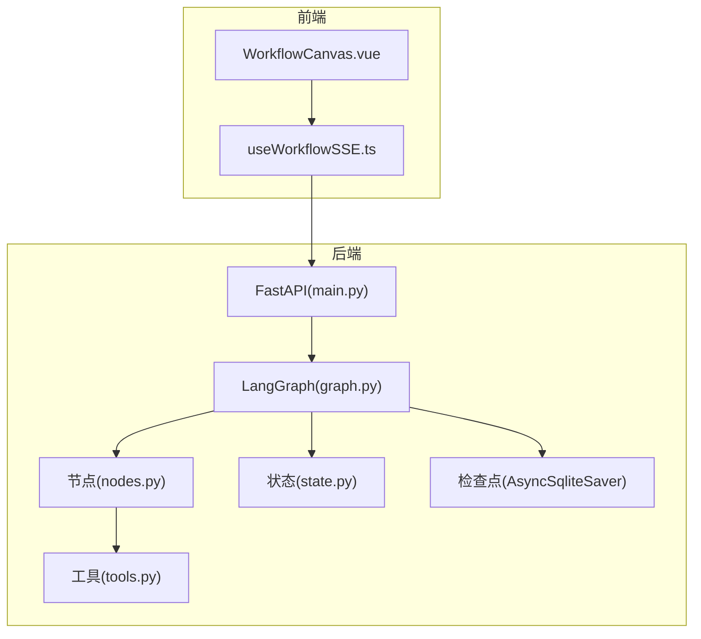
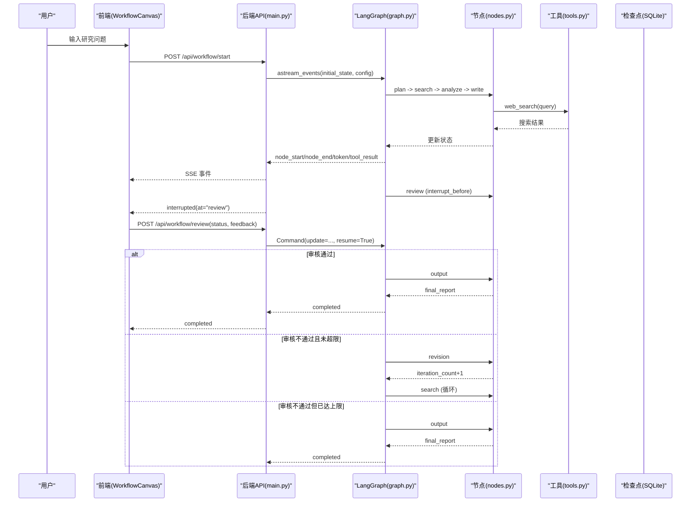
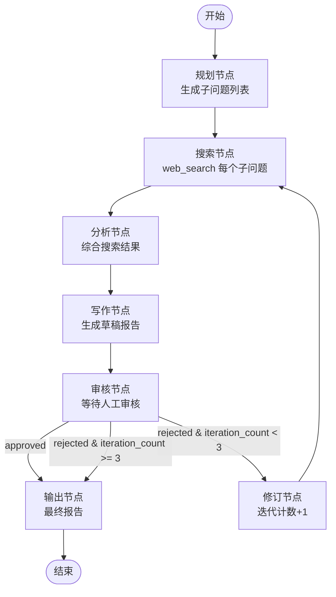
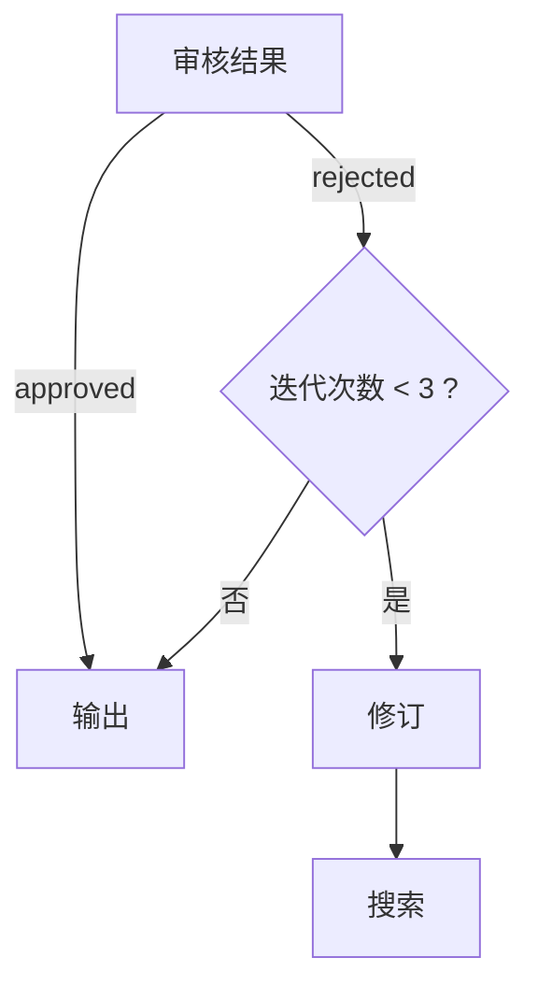
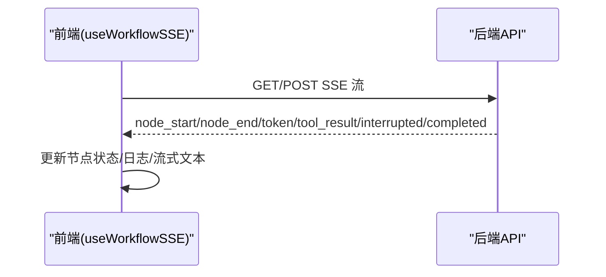
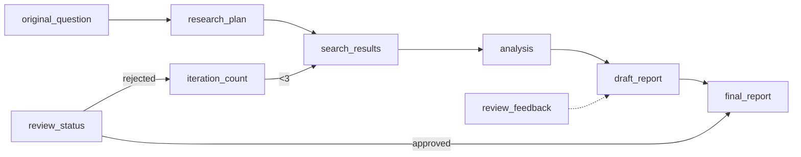
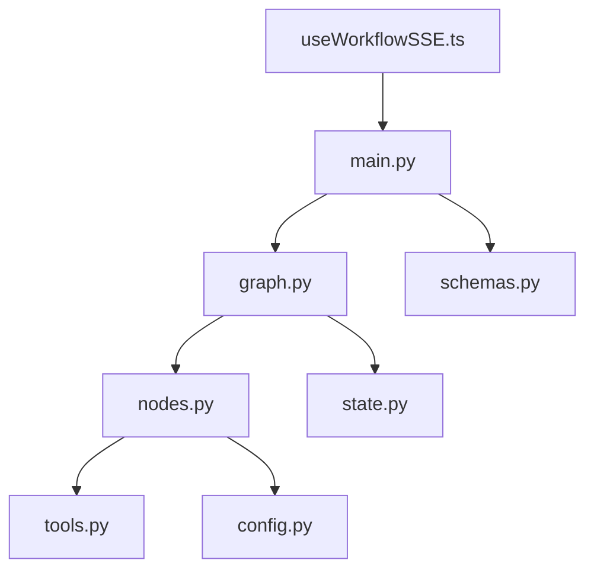

# 多 Agent 协作流程

<cite>
**本文引用的文件**
- [graph.py](file://workflow-studio/backend/app/graph.py)
- [nodes.py](file://workflow-studio/backend/app/nodes.py)
- [state.py](file://workflow-studio/backend/app/state.py)
- [main.py](file://workflow-studio/backend/app/main.py)
- [tools.py](file://workflow-studio/backend/app/tools.py)
- [config.py](file://workflow-studio/backend/app/config.py)
- [schemas.py](file://workflow-studio/backend/app/schemas.py)
- [WorkflowCanvas.vue](file://workflow-studio/frontend/src/components/WorkflowCanvas.vue)
- [useWorkflowSSE.ts](file://workflow-studio/frontend/src/composables/useWorkflowSSE.ts)
- [README.md](file://workflow-studio/README.md)
</cite>

## 目录
1. [简介](#简介)
2. [项目结构](#项目结构)
3. [核心组件](#核心组件)
4. [架构总览](#架构总览)
5. [详细组件分析](#详细组件分析)
6. [依赖关系分析](#依赖关系分析)
7. [性能考虑](#性能考虑)
8. [故障排查指南](#故障排查指南)
9. [结论](#结论)
10. [附录](#附录)

## 简介
本文件面向“多 Agent 协作流程”的完整说明，聚焦基于 LangGraph 的工作流编排机制。系统包含七个核心节点：规划、搜索、分析、写作、审核、修订、输出。文档将详细说明节点间的数据传递、条件分支处理与循环控制机制，提供业务流程图和数据流转图，并给出扩展新节点的方法、调试技巧与性能优化建议。

## 项目结构
后端采用 FastAPI + LangGraph 构建有状态工作流，前端使用 Vue 3 + Vue Flow 可视化执行过程并通过 SSE 实时接收事件。关键文件职责如下：
- graph.py：定义 LangGraph StateGraph、节点注册、边与条件路由、编译与检查点配置
- nodes.py：实现各节点逻辑（调用 LLM 与工具）
- state.py：定义全局状态结构与消息累加器
- main.py：FastAPI 入口，暴露启动、审核、状态查询、图结构等接口，并使用 SSE 推送事件
- tools.py：搜索工具（模拟数据）
- config.py：LLM 配置加载
- schemas.py：请求模型
- WorkflowCanvas.vue：Vue Flow 画布与节点布局
- useWorkflowSSE.ts：前端 SSE 事件处理与工作流控制

图表来源
- [main.py:14-31](file://workflow-studio/backend/app/main.py#L14-L31)
- [graph.py:23-77](file://workflow-studio/backend/app/graph.py#L23-L77)
- [nodes.py:18-128](file://workflow-studio/backend/app/nodes.py#L18-L128)
- [tools.py:4-25](file://workflow-studio/backend/app/tools.py#L4-L25)
- [state.py:5-30](file://workflow-studio/backend/app/state.py#L5-L30)
- [WorkflowCanvas.vue:55-74](file://workflow-studio/frontend/src/components/WorkflowCanvas.vue#L55-L74)
- [useWorkflowSSE.ts:74-157](file://workflow-studio/frontend/src/composables/useWorkflowSSE.ts#L74-L157)

章节来源
- [README.md:1-109](file://workflow-studio/README.md#L1-L109)

## 核心组件
- 状态模型 ResearchState：集中管理工作流控制字段、研究内容、人工审核字段与元数据，并提供消息历史累加器以支持对话式上下文。
- 节点集合：plan/search/analyze/write/review/revision/output，每个节点负责单一职责，通过返回字典更新状态。
- 条件路由：在 review 后根据 review_status 与 iteration_count 决定下一跳。
- 检查点持久化：使用 AsyncSqliteSaver 保存状态，支持中断恢复与页面刷新不丢进度。
- API 层：start/review/state/graph-structure 四个接口，配合 SSE 推送事件驱动前端渲染。

章节来源
- [state.py:5-30](file://workflow-studio/backend/app/state.py#L5-L30)
- [nodes.py:18-128](file://workflow-studio/backend/app/nodes.py#L18-L128)
- [graph.py:11-77](file://workflow-studio/backend/app/graph.py#L11-L77)
- [main.py:34-200](file://workflow-studio/backend/app/main.py#L34-L200)

## 架构总览
下图展示从用户提问到最终输出的完整流程，包括条件分支与循环控制。

图表来源
- [main.py:34-154](file://workflow-studio/backend/app/main.py#L34-L154)
- [graph.py:23-77](file://workflow-studio/backend/app/graph.py#L23-L77)
- [nodes.py:18-128](file://workflow-studio/backend/app/nodes.py#L18-L128)
- [tools.py:4-25](file://workflow-studio/backend/app/tools.py#L4-L25)

## 详细组件分析

### 状态模型与消息累积
- ResearchState 定义了工作流所需的全部字段，包括：
  - 控制字段：current_step、iteration_count
  - 研究内容：original_question、research_plan、search_results、analysis、draft_report、final_report
  - 人工审核：review_status、review_feedback
  - 元数据：workflow_id、started_at、completed_at
- messages 使用 add_messages 累加器，便于后续审计或调试时查看节点交互历史。

章节来源
- [state.py:5-30](file://workflow-studio/backend/app/state.py#L5-L30)

### 节点实现与数据流转
- 规划节点 plan_node：
  - 输入：original_question
  - 行为：调用 LLM 生成子问题列表
  - 输出：research_plan、current_step、messages
- 搜索节点 search_node：
  - 输入：research_plan
  - 行为：对每个子问题调用 web_search
  - 输出：search_results、current_step、messages
- 分析节点 analyze_node：
  - 输入：search_results
  - 行为：汇总结果并调用 LLM 进行结构化分析
  - 输出：analysis、current_step、messages
- 写作节点 write_node：
  - 输入：original_question、analysis、review_feedback（可选）
  - 行为：调用 LLM 生成 Markdown 报告草稿
  - 输出：draft_report、current_step、messages
- 审核节点 review_node：
  - 行为：设置 review_status=pending，等待外部注入审核结果
  - 输出：current_step、review_status、messages
- 修订节点 revision_node：
  - 行为：iteration_count+1，为循环控制提供计数
  - 输出：iteration_count、current_step、messages
- 输出节点 output_node：
  - 行为：产出 final_report
  - 输出：final_report、current_step、completed_at、messages

图表来源
- [nodes.py:18-128](file://workflow-studio/backend/app/nodes.py#L18-L128)
- [graph.py:11-77](file://workflow-studio/backend/app/graph.py#L11-L77)

章节来源
- [nodes.py:18-128](file://workflow-studio/backend/app/nodes.py#L18-L128)

### 条件分支与循环控制
- 条件路由函数 route_after_review：
  - 若 review_status == "approved" → 进入 output
  - 若 review_status == "rejected" 且 iteration_count < 3 → 进入 revision
  - 否则 → 回到 review（默认等待）
- 循环路径：revision → search，形成“审核不通过→修订→重新搜索”的闭环
- 防无限循环：当 iteration_count 达到上限（3）时强制输出

图表来源
- [graph.py:11-20](file://workflow-studio/backend/app/graph.py#L11-L20)
- [graph.py:46-60](file://workflow-studio/backend/app/graph.py#L46-L60)

章节来源
- [graph.py:11-60](file://workflow-studio/backend/app/graph.py#L11-L60)

### 事件流与前后端交互
- 后端通过 SSE 推送四类事件：
  - node_start/node_end：节点执行起止
  - token：LLM 流式输出片段
  - tool_result：工具调用结果摘要
  - interrupted/completed：中断与完成信号
- 前端 useWorkflowSSE 解析事件并更新节点状态、日志与流式文本；WorkflowCanvas 根据状态驱动节点高亮与边动画。

图表来源
- [main.py:60-103](file://workflow-studio/backend/app/main.py#L60-L103)
- [main.py:119-154](file://workflow-studio/backend/app/main.py#L119-L154)
- [useWorkflowSSE.ts:19-72](file://workflow-studio/frontend/src/composables/useWorkflowSSE.ts#L19-L72)
- [useWorkflowSSE.ts:74-157](file://workflow-studio/frontend/src/composables/useWorkflowSSE.ts#L74-L157)

章节来源
- [main.py:34-200](file://workflow-studio/backend/app/main.py#L34-L200)
- [useWorkflowSSE.ts:1-172](file://workflow-studio/frontend/src/composables/useWorkflowSSE.ts#L1-L172)
- [WorkflowCanvas.vue:55-127](file://workflow-studio/frontend/src/components/WorkflowCanvas.vue#L55-L127)

### 数据流转图（状态变更）

图表来源
- [state.py:5-30](file://workflow-studio/backend/app/state.py#L5-L30)
- [nodes.py:18-128](file://workflow-studio/backend/app/nodes.py#L18-L128)
- [graph.py:11-60](file://workflow-studio/backend/app/graph.py#L11-L60)

章节来源
- [state.py:5-30](file://workflow-studio/backend/app/state.py#L5-L30)
- [nodes.py:18-128](file://workflow-studio/backend/app/nodes.py#L18-L128)
- [graph.py:11-60](file://workflow-studio/backend/app/graph.py#L11-L60)

## 依赖关系分析
- 模块耦合：
  - main.py 依赖 graph.py、state.py、schemas.py
  - graph.py 依赖 state.py、nodes.py
  - nodes.py 依赖 state.py、tools.py、config.py
  - frontend 通过 useWorkflowSSE.ts 与 main.py 的 SSE 接口交互
- 外部依赖：
  - LangChain OpenAI Chat 客户端
  - LangGraph StateGraph、检查点持久化
  - FastAPI CORS、StreamingResponse

图表来源
- [main.py:1-31](file://workflow-studio/backend/app/main.py#L1-L31)
- [graph.py:1-10](file://workflow-studio/backend/app/graph.py#L1-L10)
- [nodes.py:1-9](file://workflow-studio/backend/app/nodes.py#L1-L9)
- [tools.py:1-26](file://workflow-studio/backend/app/tools.py#L1-L26)
- [config.py:1-9](file://workflow-studio/backend/app/config.py#L1-L9)
- [schemas.py:1-12](file://workflow-studio/backend/app/schemas.py#L1-L12)
- [useWorkflowSSE.ts:74-157](file://workflow-studio/frontend/src/composables/useWorkflowSSE.ts#L74-L157)

章节来源
- [main.py:1-200](file://workflow-studio/backend/app/main.py#L1-L200)
- [graph.py:1-78](file://workflow-studio/backend/app/graph.py#L1-L78)
- [nodes.py:1-129](file://workflow-studio/backend/app/nodes.py#L1-L129)
- [tools.py:1-26](file://workflow-studio/backend/app/tools.py#L1-L26)
- [config.py:1-9](file://workflow-studio/backend/app/config.py#L1-L9)
- [schemas.py:1-12](file://workflow-studio/backend/app/schemas.py#L1-L12)
- [useWorkflowSSE.ts:1-172](file://workflow-studio/frontend/src/composables/useWorkflowSSE.ts#L1-L172)

## 性能考虑
- 并发与流式：
  - 使用 astream_events 与 StreamingResponse 降低首屏延迟，提升用户体验
  - LLM 调用温度较低（如 0.3），有助于稳定输出
- 循环限制：
  - 通过 iteration_count 限制最大修订轮次，避免无限循环导致的资源消耗
- 检查点：
  - 使用 SQLite 检查点持久化状态，减少重复计算与网络开销
- 工具调用：
  - 当前 web_search 为模拟数据，生产环境替换为真实搜索引擎时应注意限流与缓存策略
- 前端渲染：
  - 仅对运行中或已完成的边启用动画，降低 DOM 操作频率

[本节为通用指导，无需特定文件引用]

## 故障排查指南
- 常见问题定位：
  - 工作流未到达审核节点：检查 interrupt_before 配置是否正确
  - 审核通过后仍循环：确认 review_status 是否被正确注入
  - 超过3轮仍循环：核对 iteration_count 更新逻辑与条件分支
  - SSE 断流：检查后端 StreamingResponse 与前端 reader 读取逻辑
- 调试技巧：
  - 利用 messages 字段查看节点交互历史
  - 通过 /api/workflow/state/{workflow_id} 获取当前状态与 next 节点
  - 在前端 logs 面板观察 node_start/node_end/tool_result 事件
- 错误处理：
  - 后端 try/except 捕获异常并以 error 事件推送
  - 前端忽略 JSON 解析错误，保证流式稳定性

章节来源
- [main.py:60-103](file://workflow-studio/backend/app/main.py#L60-L103)
- [main.py:119-154](file://workflow-studio/backend/app/main.py#L119-L154)
- [useWorkflowSSE.ts:19-72](file://workflow-studio/frontend/src/composables/useWorkflowSSE.ts#L19-L72)

## 结论
该工作流以 LangGraph 为核心，实现了七节点的有序编排与条件分支，结合 Human-in-the-loop 审核机制与检查点恢复能力，提供了可解释、可干预、可回放的研究辅助流程。通过 SSE 实时反馈与可视化呈现，显著提升了复杂多 Agent 协作的可观测性与可控性。

[本节为总结性内容，无需特定文件引用]

## 附录

### 扩展新节点的方法
- 在 nodes.py 新增异步节点函数，遵循“输入状态 → 调用工具/LLM → 返回状态更新字典”的模式
- 在 graph.py 中：
  - 使用 add_node 注册新节点
  - 使用 add_edge 或 add_conditional_edges 连接至现有流程
  - 如需中断，可在 interrupt_before 中添加节点名
- 在 main.py 的图结构中补充节点信息，以便前端渲染

章节来源
- [nodes.py:18-128](file://workflow-studio/backend/app/nodes.py#L18-L128)
- [graph.py:23-77](file://workflow-studio/backend/app/graph.py#L23-L77)
- [main.py:176-200](file://workflow-studio/backend/app/main.py#L176-L200)

### 调试技巧清单
- 启用检查点：确保 checkpointer 配置正确，便于恢复与回放
- 打印 messages：在每个节点末尾追加 AIMessage 记录关键步骤
- 使用 /api/workflow/state 接口：刷新页面后恢复状态
- 前端日志：观察 logs 面板的事件顺序与内容

章节来源
- [graph.py:65-77](file://workflow-studio/backend/app/graph.py#L65-L77)
- [main.py:157-174](file://workflow-studio/backend/app/main.py#L157-L174)
- [useWorkflowSSE.ts:19-72](file://workflow-studio/frontend/src/composables/useWorkflowSSE.ts#L19-L72)

### 性能优化建议
- 工具层：
  - 引入缓存（如 Redis）以减少重复搜索
  - 对 LLM 调用进行重试与超时控制
- 工作流层：
  - 合理设置 temperature 与 max_tokens，平衡质量与成本
  - 将搜索节点拆分为并行子任务（需评估状态一致性）
- 前端层：
  - 节流节点状态更新，避免频繁重绘
  - 仅在必要时启用边动画

[本节为通用指导，无需特定文件引用]