# 核心功能

<cite>
**本文引用的文件**
- [README.md](file://workflow-studio/README.md)
- [main.py](file://workflow-studio/backend/app/main.py)
- [graph.py](file://workflow-studio/backend/app/graph.py)
- [nodes.py](file://workflow-studio/backend/app/nodes.py)
- [state.py](file://workflow-studio/backend/app/state.py)
- [tools.py](file://workflow-studio/backend/app/tools.py)
- [config.py](file://workflow-studio/backend/app/config.py)
- [schemas.py](file://workflow-studio/backend/app/schemas.py)
- [WorkflowCanvas.vue](file://workflow-studio/frontend/src/components/WorkflowCanvas.vue)
- [useWorkflowSSE.ts](file://workflow-studio/frontend/src/composables/useWorkflowSSE.ts)
- [workflow.ts](file://workflow-studio/frontend/src/types/workflow.ts)
- [BaseNode.vue](file://workflow-studio/frontend/src/components/nodes/BaseNode.vue)
- [ReviewDialog.vue](file://workflow-studio/frontend/src/components/panels/ReviewDialog.vue)
</cite>

## 目录
1. [简介](#简介)
2. [项目结构](#项目结构)
3. [核心组件](#核心组件)
4. [架构总览](#架构总览)
5. [详细组件分析](#详细组件分析)
6. [依赖关系分析](#依赖关系分析)
7. [性能考量](#性能考量)
8. [故障排除指南](#故障排除指南)
9. [结论](#结论)
10. [附录](#附录)

## 简介
本文件面向 Workflow Studio 的核心功能，系统性阐述可视化工作流执行、多 Agent 协作流程、人工审核机制、检查点恢复等关键能力。文档覆盖工作流编排逻辑、节点间通信机制、条件分支处理、实时状态同步，并提供业务流程图、数据流转图与用户交互流程，同时给出配置选项、扩展方法与故障排除建议。

## 项目结构
后端基于 FastAPI + LangGraph，提供工作流启动、人工审核、状态查询与图结构接口；前端基于 Vue 3 + Vue Flow，实现可视化画布、SSE 实时事件驱动的状态更新与人工审核弹窗。

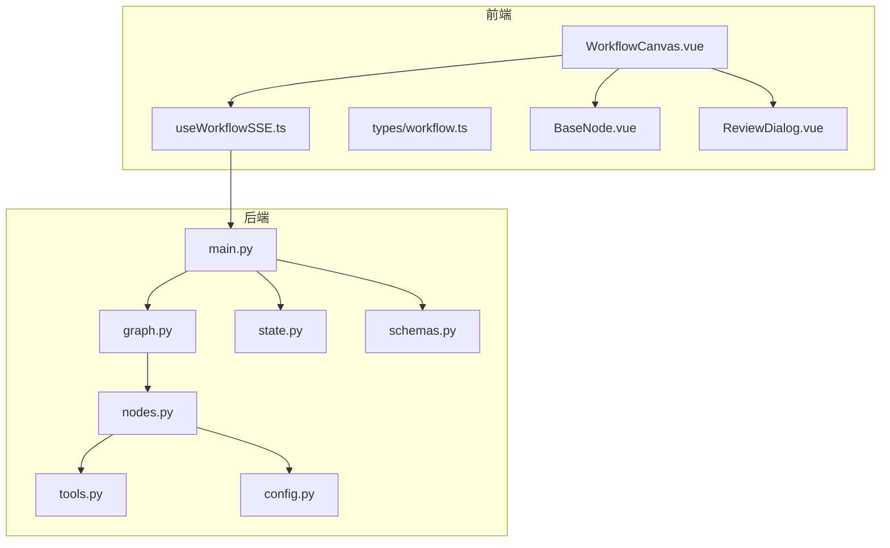

图表来源
- [WorkflowCanvas.vue:1-133](file://workflow-studio/frontend/src/components/WorkflowCanvas.vue#L1-L133)
- [useWorkflowSSE.ts:1-172](file://workflow-studio/frontend/src/composables/useWorkflowSSE.ts#L1-L172)
- [main.py:1-200](file://workflow-studio/backend/app/main.py#L1-L200)
- [graph.py:1-78](file://workflow-studio/backend/app/graph.py#L1-L78)
- [nodes.py:1-129](file://workflow-studio/backend/app/nodes.py#L1-L129)
- [state.py:1-30](file://workflow-studio/backend/app/state.py#L1-L30)
- [tools.py:1-26](file://workflow-studio/backend/app/tools.py#L1-L26)
- [config.py:1-9](file://workflow-studio/backend/app/config.py#L1-L9)
- [schemas.py:1-12](file://workflow-studio/backend/app/schemas.py#L1-L12)

章节来源
- [README.md:1-109](file://workflow-studio/README.md#L1-L109)

## 核心组件
- 工作流编排：LangGraph 有向图定义线性流程与条件分支，支持在审核节点前中断，结合 SQLite 检查点持久化。
- 节点实现：规划、搜索、分析、写作、审核、修订、输出七个节点，分别负责拆解问题、检索信息、综合分析与生成报告、人工审核、修订循环与最终输出。
- 人机协同：审核节点暂停等待人类决策，通过后输出，不通过则进入修订并可能回到搜索形成循环，内置最多三轮修订的防无限循环保护。
- 实时通信：后端通过 Server-Sent Events（SSE）推送节点开始/结束、LLM 流式 token、工具结果、中断与完成事件；前端解析并驱动画布状态更新。
- 检查点恢复：使用 AsyncSqliteSaver 保存执行上下文，页面刷新后可通过状态接口恢复进度。

章节来源
- [graph.py:23-78](file://workflow-studio/backend/app/graph.py#L23-L78)
- [nodes.py:18-129](file://workflow-studio/backend/app/nodes.py#L18-L129)
- [main.py:34-173](file://workflow-studio/backend/app/main.py#L34-L173)
- [useWorkflowSSE.ts:19-72](file://workflow-studio/frontend/src/composables/useWorkflowSSE.ts#L19-L72)

## 架构总览
系统由前后端组成：前端通过 SSE 订阅后端事件，实时更新节点状态与日志；后端基于 LangGraph 编译工作流图，按节点顺序执行并在审核节点前中断，等待人类审核后继续。

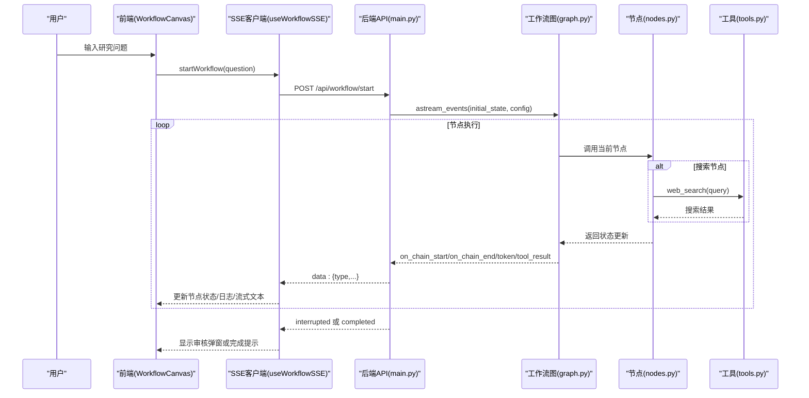

图表来源
- [main.py:34-103](file://workflow-studio/backend/app/main.py#L34-L103)
- [graph.py:23-78](file://workflow-studio/backend/app/graph.py#L23-L78)
- [nodes.py:43-60](file://workflow-studio/backend/app/nodes.py#L43-L60)
- [tools.py:4-19](file://workflow-studio/backend/app/tools.py#L4-L19)
- [useWorkflowSSE.ts:74-114](file://workflow-studio/frontend/src/composables/useWorkflowSSE.ts#L74-L114)

## 详细组件分析

### 工作流编排与条件分支
- 线性流程：START → plan → search → analyze → write → review → output → END。
- 条件分支：review 节点后根据审核状态路由到 output 或 revision；revision 再回到 search 形成循环。
- 防无限循环：当 iteration_count 达到上限时强制输出。

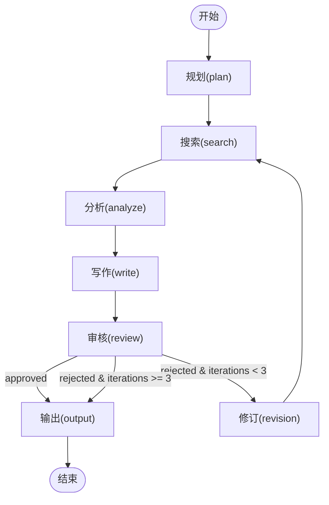

图表来源
- [graph.py:23-62](file://workflow-studio/backend/app/graph.py#L23-L62)
- [nodes.py:100-129](file://workflow-studio/backend/app/nodes.py#L100-L129)

章节来源
- [graph.py:11-21](file://workflow-studio/backend/app/graph.py#L11-L21)
- [graph.py:23-62](file://workflow-studio/backend/app/graph.py#L23-L62)

### 节点间通信机制
- 事件类型：node_start、node_end、token、tool_result、interrupted、completed、error。
- 传输方式：后端以 SSE 流推送，前端解析并更新状态。
- 状态同步：节点开始/结束驱动节点状态从 idle→running→completed；LLM 流式 token 累积为 streamingText；工具结果追加到日志。

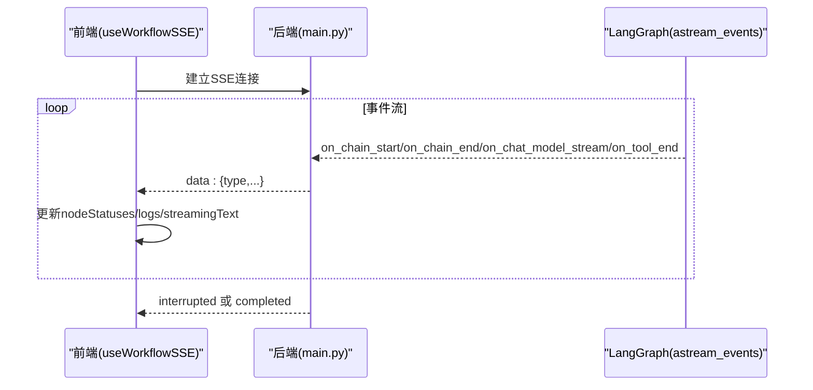

图表来源
- [main.py:60-103](file://workflow-studio/backend/app/main.py#L60-L103)
- [useWorkflowSSE.ts:19-72](file://workflow-studio/frontend/src/composables/useWorkflowSSE.ts#L19-L72)

章节来源
- [useWorkflowSSE.ts:19-72](file://workflow-studio/frontend/src/composables/useWorkflowSSE.ts#L19-L72)
- [main.py:60-103](file://workflow-studio/backend/app/main.py#L60-L103)

### 人工审核机制（Human-in-the-loop）
- 中断点：在审核节点前中断，等待人类提交审核结果。
- 恢复执行：提交审核后，注入 update 并 resume 继续执行。
- 界面交互：弹出 ReviewDialog，支持“通过”和“不通过（附反馈）”。

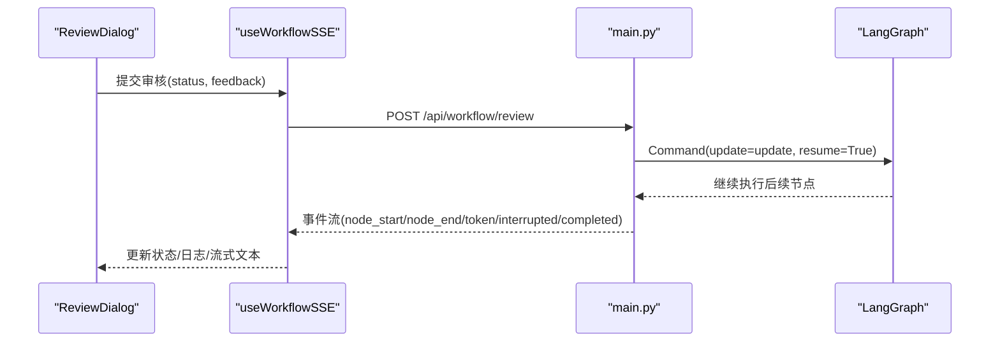

图表来源
- [main.py:106-154](file://workflow-studio/backend/app/main.py#L106-L154)
- [ReviewDialog.vue:1-54](file://workflow-studio/frontend/src/components/panels/ReviewDialog.vue#L1-L54)
- [useWorkflowSSE.ts:116-157](file://workflow-studio/frontend/src/composables/useWorkflowSSE.ts#L116-L157)

章节来源
- [main.py:106-154](file://workflow-studio/backend/app/main.py#L106-L154)
- [ReviewDialog.vue:1-54](file://workflow-studio/frontend/src/components/panels/ReviewDialog.vue#L1-L54)

### 检查点恢复
- 持久化：使用 AsyncSqliteSaver 保存执行上下文至 checkpoints.db。
- 恢复接口：GET /api/workflow/state/{workflow_id} 返回当前值、下一个节点与是否中断。
- 前端恢复：页面加载时可拉取状态，恢复节点高亮与日志。

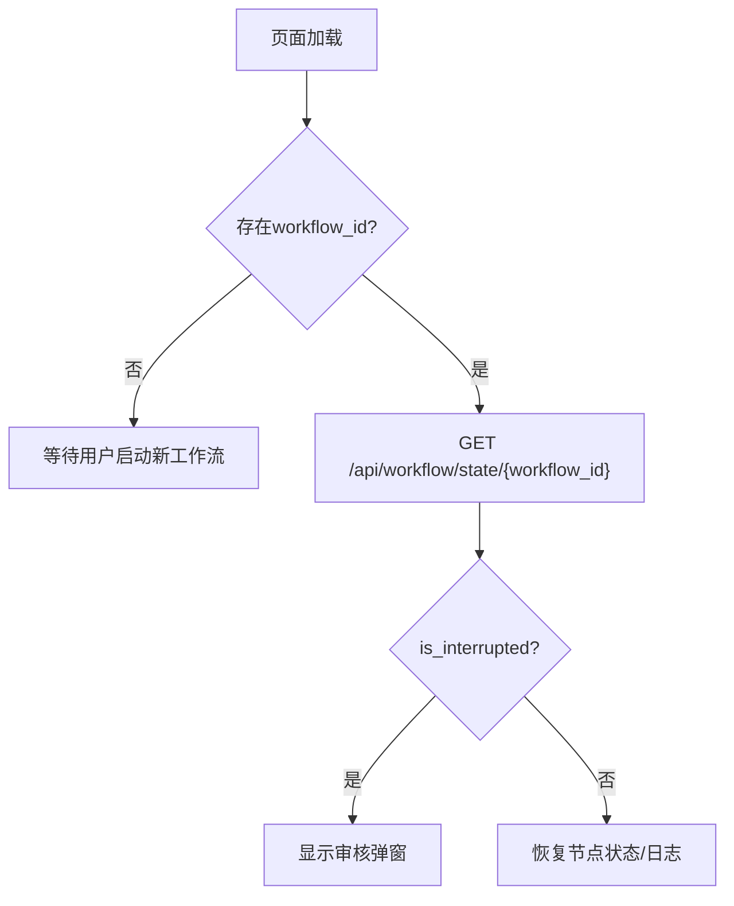

图表来源
- [main.py:157-173](file://workflow-studio/backend/app/main.py#L157-L173)
- [graph.py:65-78](file://workflow-studio/backend/app/graph.py#L65-L78)

章节来源
- [main.py:157-173](file://workflow-studio/backend/app/main.py#L157-L173)
- [graph.py:65-78](file://workflow-studio/backend/app/graph.py#L65-L78)

### 可视化渲染与状态映射
- 节点类型与图标：plan/search/analyze/write/review/revision/output 对应不同图标与样式。
- 状态映射：idle/running/completed/error/waiting 驱动边框颜色、文字色与动画。
- 边动画：当源节点处于 running 或 completed 且工作流运行中时，边启用动画。

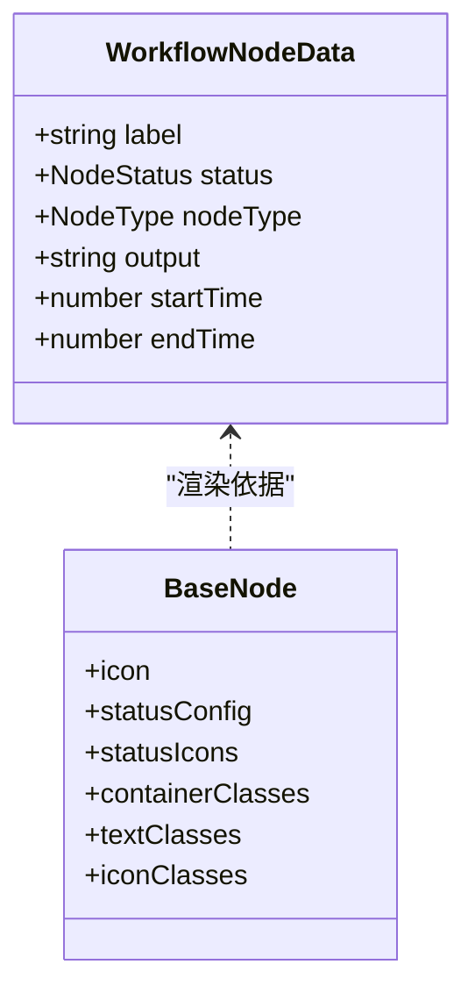

图表来源
- [BaseNode.vue:1-82](file://workflow-studio/frontend/src/components/nodes/BaseNode.vue#L1-L82)
- [workflow.ts:3-18](file://workflow-studio/frontend/src/types/workflow.ts#L3-L18)

章节来源
- [BaseNode.vue:1-82](file://workflow-studio/frontend/src/components/nodes/BaseNode.vue#L1-L82)
- [WorkflowCanvas.vue:55-74](file://workflow-studio/frontend/src/components/WorkflowCanvas.vue#L55-L74)
- [useWorkflowSSE.ts:95-127](file://workflow-studio/frontend/src/composables/useWorkflowSSE.ts#L95-L127)

### 数据模型与API契约
- 请求模型：StartRequest(question)、ReviewRequest(workflow_id, status, feedback)。
- 响应模型：工作流状态包含 values、next、is_interrupted。
- 图结构：nodes 与 edges 列表用于前端渲染初始布局。

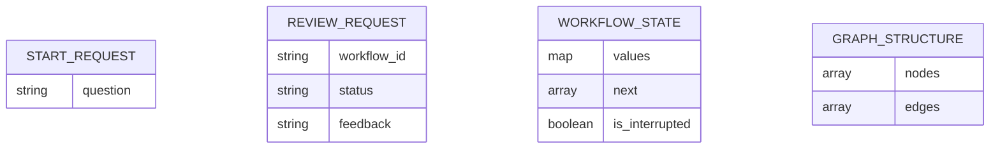

图表来源
- [schemas.py:1-12](file://workflow-studio/backend/app/schemas.py#L1-L12)
- [main.py:157-199](file://workflow-studio/backend/app/main.py#L157-L199)

章节来源
- [schemas.py:1-12](file://workflow-studio/backend/app/schemas.py#L1-L12)
- [main.py:157-199](file://workflow-studio/backend/app/main.py#L157-L199)

## 依赖关系分析
- 模块耦合：
  - main.py 依赖 graph.py、state.py、schemas.py，暴露 REST/SSE 接口。
  - graph.py 依赖 nodes.py、state.py 与检查点持久化。
  - nodes.py 依赖 tools.py 与 config.py，调用 LLM 与搜索工具。
  - 前端 useWorkflowSSE.ts 依赖 types/workflow.ts，封装 SSE 事件处理。
- 外部依赖：
  - FastAPI、LangGraph、LangChain、AsyncSqliteSaver、OpenAI SDK。
  - Vue 3、Vue Flow、Pinia、Tailwind CSS、TypeScript。

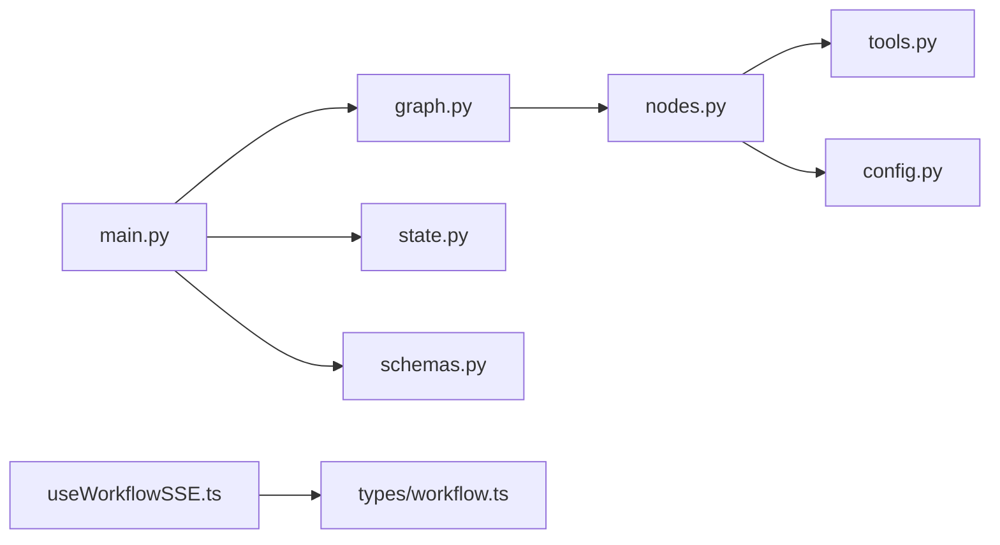

图表来源
- [main.py:1-200](file://workflow-studio/backend/app/main.py#L1-L200)
- [graph.py:1-78](file://workflow-studio/backend/app/graph.py#L1-L78)
- [nodes.py:1-129](file://workflow-studio/backend/app/nodes.py#L1-L129)
- [tools.py:1-26](file://workflow-studio/backend/app/tools.py#L1-L26)
- [config.py:1-9](file://workflow-studio/backend/app/config.py#L1-L9)
- [state.py:1-30](file://workflow-studio/backend/app/state.py#L1-L30)
- [schemas.py:1-12](file://workflow-studio/backend/app/schemas.py#L1-L12)
- [useWorkflowSSE.ts:1-172](file://workflow-studio/frontend/src/composables/useWorkflowSSE.ts#L1-L172)
- [workflow.ts:1-64](file://workflow-studio/frontend/src/types/workflow.ts#L1-L64)

章节来源
- [main.py:1-200](file://workflow-studio/backend/app/main.py#L1-L200)
- [graph.py:1-78](file://workflow-studio/backend/app/graph.py#L1-L78)
- [nodes.py:1-129](file://workflow-studio/backend/app/nodes.py#L1-L129)
- [tools.py:1-26](file://workflow-studio/backend/app/tools.py#L1-L26)
- [config.py:1-9](file://workflow-studio/backend/app/config.py#L1-L9)
- [state.py:1-30](file://workflow-studio/backend/app/state.py#L1-L30)
- [schemas.py:1-12](file://workflow-studio/backend/app/schemas.py#L1-L12)
- [useWorkflowSSE.ts:1-172](file://workflow-studio/frontend/src/composables/useWorkflowSSE.ts#L1-L172)
- [workflow.ts:1-64](file://workflow-studio/frontend/src/types/workflow.ts#L1-L64)

## 性能考量
- 流式输出：LLM 流式 token 降低首屏延迟，提升用户体验。
- 检查点持久化：SQLite 存储执行上下文，避免重复计算与长时间任务丢失。
- 并发与资源：FastAPI 异步 I/O 提高吞吐；生产环境可替换为 PostgreSQL 检查点以提升稳定性。
- 前端渲染：仅对活跃边启用动画，减少不必要的重绘。

[本节为通用指导，无需特定文件引用]

## 故障排除指南
- 无法启动工作流：
  - 检查后端服务端口与 CORS 配置。
  - 确认 OPENAI_API_KEY 与 LLM_MODEL 已正确配置。
- 审核弹窗未出现：
  - 确认 interrupted 事件到达前端，workflowId 已记录。
  - 检查 ReviewDialog 的 onSubmit 回调是否正确触发。
- 刷新后状态丢失：
  - 确保 checkpoints.db 存在且可读。
  - 调用 /api/workflow/state/{workflow_id} 获取状态并恢复。
- 无限循环风险：
  - 确认 iteration_count 阈值与路由逻辑正确。
  - 若仍出现循环，检查 review_status 与 route_after_review 返回值。

章节来源
- [config.py:1-9](file://workflow-studio/backend/app/config.py#L1-L9)
- [main.py:157-173](file://workflow-studio/backend/app/main.py#L157-L173)
- [graph.py:11-21](file://workflow-studio/backend/app/graph.py#L11-L21)
- [useWorkflowSSE.ts:47-72](file://workflow-studio/frontend/src/composables/useWorkflowSSE.ts#L47-L72)

## 结论
Workflow Studio 通过 LangGraph 实现了可视化的多 Agent 研究工作流，具备条件分支、人工审核与检查点恢复等核心能力。前后端以 SSE 进行实时通信，前端以 Vue Flow 直观呈现执行状态。系统在可扩展性、用户体验与可靠性方面提供了良好基础，适合进一步扩展并行节点、模板化工作流与性能监控。

[本节为总结性内容，无需特定文件引用]

## 附录

### 业务流程图（端到端）
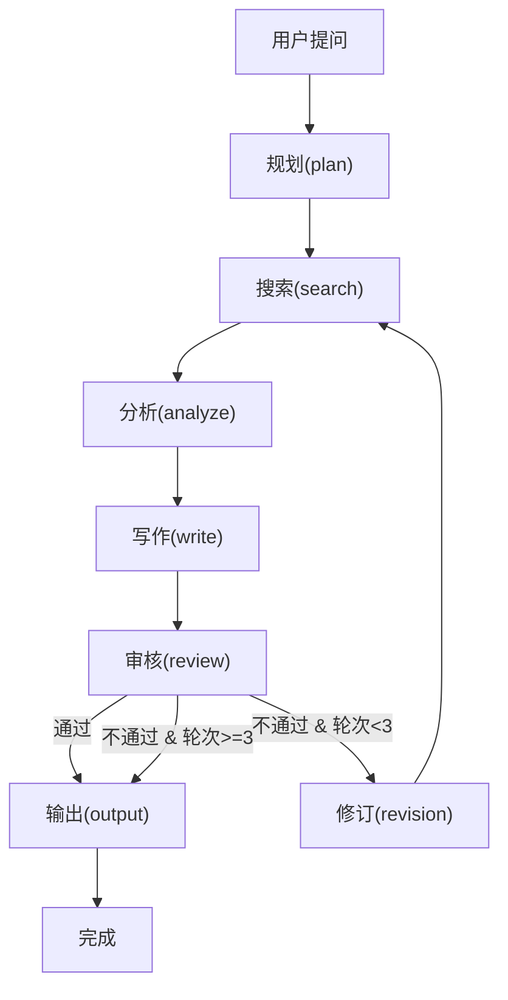

图表来源
- [graph.py:23-62](file://workflow-studio/backend/app/graph.py#L23-L62)
- [nodes.py:100-129](file://workflow-studio/backend/app/nodes.py#L100-L129)

### 数据流转图（SSE事件）
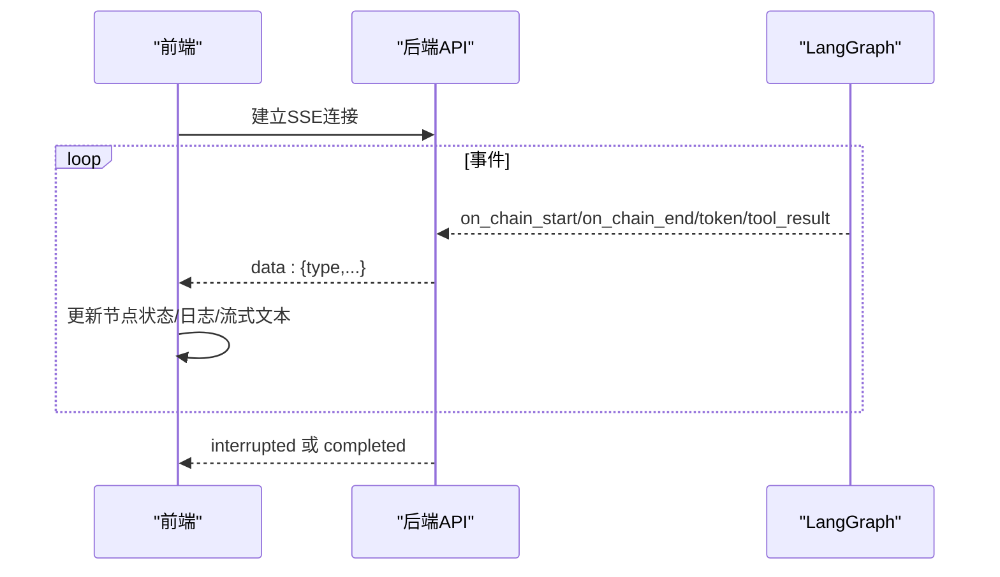

图表来源
- [main.py:60-103](file://workflow-studio/backend/app/main.py#L60-L103)
- [useWorkflowSSE.ts:19-72](file://workflow-studio/frontend/src/composables/useWorkflowSSE.ts#L19-L72)

### 用户交互流程（审核）
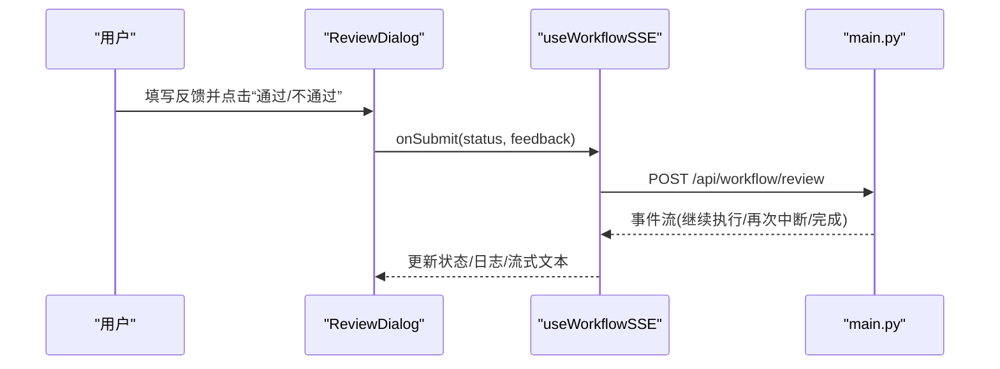

图表来源
- [ReviewDialog.vue:1-54](file://workflow-studio/frontend/src/components/panels/ReviewDialog.vue#L1-L54)
- [useWorkflowSSE.ts:116-157](file://workflow-studio/frontend/src/composables/useWorkflowSSE.ts#L116-L157)
- [main.py:106-154](file://workflow-studio/backend/app/main.py#L106-L154)

### 配置选项
- 环境变量：OPENAI_API_KEY、OPENAI_BASE_URL、LLM_MODEL。
- 检查点存储：checkpoints.db（生产环境建议切换为 PostgreSQL）。
- 前端端口：默认 1993；后端端口：默认 1994。

章节来源
- [config.py:1-9](file://workflow-studio/backend/app/config.py#L1-L9)
- [graph.py:65-78](file://workflow-studio/backend/app/graph.py#L65-L78)
- [README.md:23-45](file://workflow-studio/README.md#L23-L45)

### 扩展方法
- 新增节点：在 graph.py 中添加节点与边，在 nodes.py 实现节点逻辑。
- 自定义工具：在 tools.py 添加 @tool 装饰函数，供节点调用。
- 前端增强：扩展 BaseNode.vue 的样式与交互，或在 WorkflowCanvas.vue 增加新的面板。

章节来源
- [graph.py:23-62](file://workflow-studio/backend/app/graph.py#L23-L62)
- [nodes.py:18-129](file://workflow-studio/backend/app/nodes.py#L18-L129)
- [tools.py:1-26](file://workflow-studio/backend/app/tools.py#L1-L26)
- [BaseNode.vue:1-82](file://workflow-studio/frontend/src/components/nodes/BaseNode.vue#L1-L82)
- [WorkflowCanvas.vue:1-133](file://workflow-studio/frontend/src/components/WorkflowCanvas.vue#L1-L133)