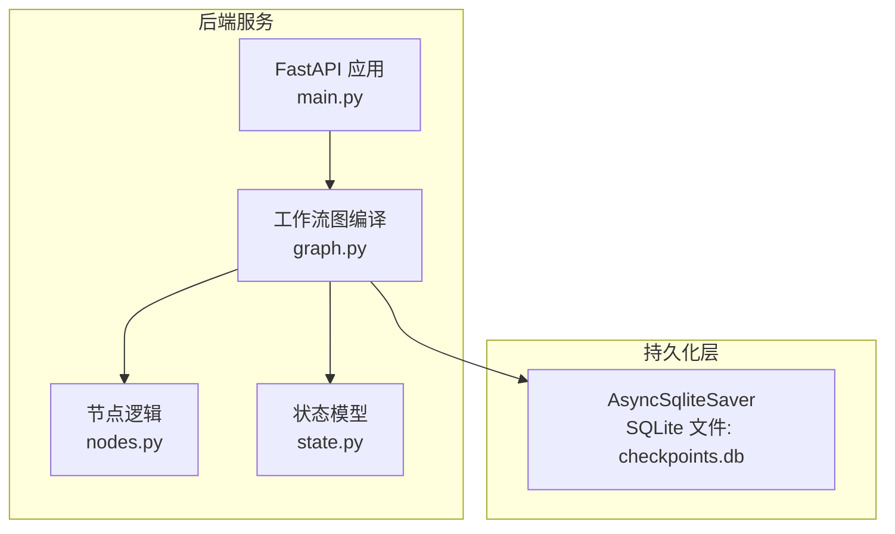
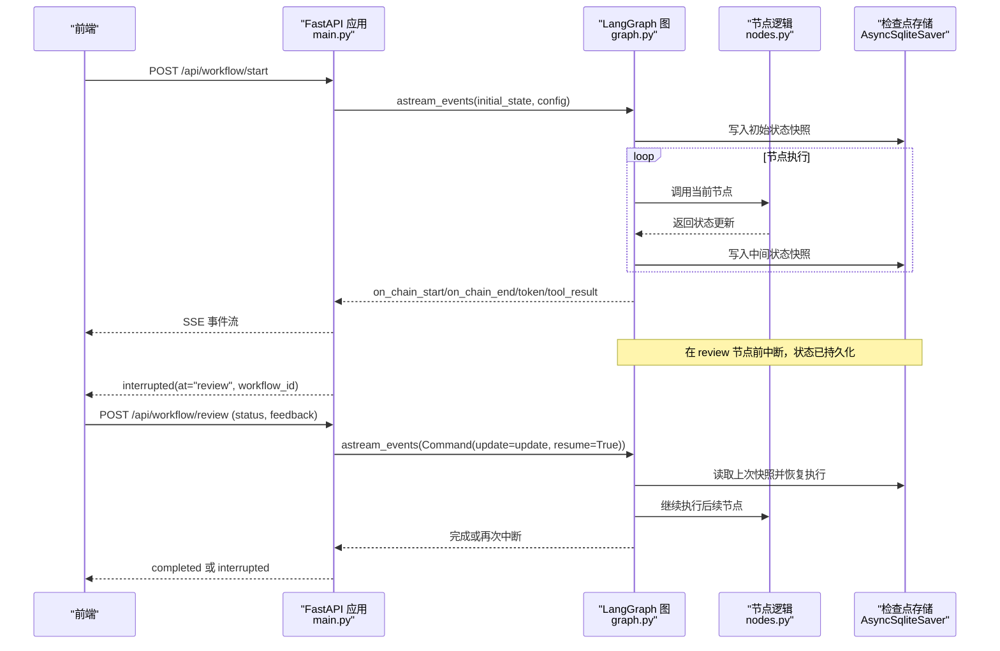
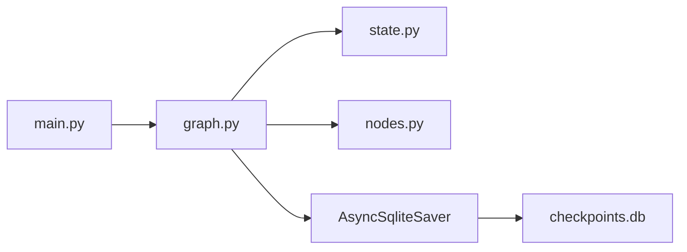

# 检查点恢复机制

<cite>
**本文引用的文件**
- [graph.py](file://workflow-studio/backend/app/graph.py)
- [main.py](file://workflow-studio/backend/app/main.py)
- [state.py](file://workflow-studio/backend/app/state.py)
- [nodes.py](file://workflow-studio/backend/app/nodes.py)
- [schemas.py](file://workflow-studio/backend/app/schemas.py)
- [requirements.txt](file://workflow-studio/backend/requirements.txt)
</cite>

## 目录
1. [简介](#简介)
2. [项目结构](#项目结构)
3. [核心组件](#核心组件)
4. [架构总览](#架构总览)
5. [详细组件分析](#详细组件分析)
6. [依赖关系分析](#依赖关系分析)
7. [性能考量](#性能考量)
8. [故障排查指南](#故障排查指南)
9. [结论](#结论)
10. [附录](#附录)

## 简介
本文件围绕“检查点恢复机制”展开，聚焦于基于 SQLite 的状态持久化实现。内容涵盖：
- 检查点的创建时机与触发条件
- 状态数据的序列化与存储方式
- 页面刷新后的自动恢复逻辑
- AsyncSqliteSaver 的配置与使用
- 状态快照的管理策略与历史执行回放思路
- 数据库表结构设计（由 LangGraph 内部维护）
- 并发访问控制与一致性保障
- 生产环境的迁移方案、性能优化建议与故障恢复策略

该机制通过 LangGraph 的 checkpointer 将工作流状态持久化到 SQLite，使得工作流可以在任意节点暂停并恢复，支持人工审核介入、页面刷新后继续执行等场景。

## 项目结构
后端采用 FastAPI 提供 API，LangGraph 构建有向图工作流，并通过 AsyncSqliteSaver 将状态持久化到 SQLite。关键文件职责如下：
- graph.py：定义工作流图、编译图并配置检查点
- main.py：暴露启动、审核、查询状态的 API，处理事件流与中断恢复
- state.py：定义工作流状态模型
- nodes.py：各节点的业务逻辑，包含审核节点的暂停语义
- schemas.py：请求数据模型
- requirements.txt：依赖声明，包括 langgraph-checkpoint-sqlite

**图表来源**
- [graph.py:23-77](file://workflow-studio/backend/app/graph.py#L23-L77)
- [main.py:27-31](file://workflow-studio/backend/app/main.py#L27-L31)
- [nodes.py:100-108](file://workflow-studio/backend/app/nodes.py#L100-L108)
- [state.py:5-29](file://workflow-studio/backend/app/state.py#L5-L29)

**章节来源**
- [graph.py:23-77](file://workflow-studio/backend/app/graph.py#L23-L77)
- [main.py:27-31](file://workflow-studio/backend/app/main.py#L27-L31)
- [nodes.py:100-108](file://workflow-studio/backend/app/nodes.py#L100-L108)
- [state.py:5-29](file://workflow-studio/backend/app/state.py#L5-L29)

## 核心组件
- 工作流图与检查点：在编译时注入 AsyncSqliteSaver，并在指定节点前设置中断，使状态在到达该节点前被持久化。
- 状态模型：TypedDict 描述工作流状态字段，包含消息历史、控制字段、业务数据与元数据。
- API 层：提供启动、提交审核、获取状态等接口，结合事件流与中断恢复能力。
- 节点逻辑：每个节点返回状态更新；审核节点用于暂停等待人工输入。

**章节来源**
- [graph.py:23-77](file://workflow-studio/backend/app/graph.py#L23-L77)
- [state.py:5-29](file://workflow-studio/backend/app/state.py#L5-L29)
- [main.py:35-173](file://workflow-studio/backend/app/main.py#L35-L173)
- [nodes.py:18-128](file://workflow-studio/backend/app/nodes.py#L18-L128)

## 架构总览
下图展示了从前端发起请求到工作流执行、状态持久化、中断与恢复的整体流程。

**图表来源**
- [main.py:35-173](file://workflow-studio/backend/app/main.py#L35-L173)
- [graph.py:23-77](file://workflow-studio/backend/app/graph.py#L23-L77)
- [nodes.py:100-108](file://workflow-studio/backend/app/nodes.py#L100-L108)

## 详细组件分析

### 检查点创建时机与触发条件
- 编译时配置：在编译图时传入 checkpointer，并设置 interrupt_before=["review"]，确保在执行到审核节点之前保存状态。
- 运行时触发：当工作流执行至审核节点前，LangGraph 会暂停执行并将当前状态持久化到 SQLite；前端收到 interrupted 事件后进入等待状态。
- 恢复触发：前端提交审核后，服务端以 Command(update=update, resume=True) 恢复执行，LangGraph 从最近一次检查点加载状态继续运行。

**章节来源**
- [graph.py:65-77](file://workflow-studio/backend/app/graph.py#L65-L77)
- [main.py:89-94](file://workflow-studio/backend/app/main.py#L89-L94)
- [main.py:119-146](file://workflow-studio/backend/app/main.py#L119-L146)

### 状态数据的序列化存储
- 状态模型：ResearchState 定义了所有状态字段，包括消息历史、控制字段、研究内容与审核相关字段以及元数据。
- 持久化格式：LangGraph 负责将状态序列化为可存储的格式并写入 SQLite；具体表结构与字段映射由库内部维护，应用层无需直接操作数据库。
- 线程隔离：通过 thread_id 区分不同工作流实例，确保多工作流状态互不干扰。

**章节来源**
- [state.py:5-29](file://workflow-studio/backend/app/state.py#L5-L29)
- [graph.py:65-77](file://workflow-studio/backend/app/graph.py#L65-L77)
- [main.py:58-66](file://workflow-studio/backend/app/main.py#L58-L66)

### 页面刷新后的自动恢复逻辑
- 状态查询：前端可通过 GET /api/workflow/state/{workflow_id} 获取当前状态，包括 values、next 与 is_interrupted。
- 恢复策略：若 is_interrupted 为真，前端应提示用户提交审核结果；否则可直接展示已完成的工作流结果。
- 事件驱动：SSE 事件流中的 interrupted 与 completed 事件用于前端状态同步。

**章节来源**
- [main.py:157-173](file://workflow-studio/backend/app/main.py#L157-L173)

### AsyncSqliteSaver 的配置与使用
- 连接字符串：通过 from_conn_string("./checkpoints.db") 指定 SQLite 文件路径。
- 编译注入：在 graph.compile 中传入 checkpointer，并配置中断位置。
- 版本与兼容性：依赖 langgraph-checkpoint-sqlite>=2.0.0，确保与 LangGraph 版本兼容。

**章节来源**
- [graph.py:65-77](file://workflow-studio/backend/app/graph.py#L65-L77)
- [requirements.txt:1-10](file://workflow-studio/backend/requirements.txt#L1-L10)

### 状态快照的管理策略
- 快照粒度：每次节点执行完成后都会写入快照，保证细粒度的恢复能力。
- 中断点管理：在审核节点前中断，确保人工介入前的状态完整持久化。
- 历史回放：通过多次快照可实现历史执行回放（需结合额外日志或事件记录），当前代码未直接实现回放 API，但具备基础能力。

**章节来源**
- [graph.py:65-77](file://workflow-studio/backend/app/graph.py#L65-L77)
- [main.py:60-94](file://workflow-studio/backend/app/main.py#L60-L94)

### 历史执行的回放功能
- 现状：仓库 README 提到未来规划包含“执行回放”，当前未实现专用回放接口。
- 可行方案：利用 LangGraph 的检查点与事件流，结合外部日志系统，按 thread_id 回放特定工作流的执行轨迹。

**章节来源**
- [README.md:93-109](file://workflow-studio/README.md#L93-L109)

### 数据库表结构设计
- 说明：SQLite 表结构与字段由 LangGraph 内部维护，应用层不直接操作数据库。
- 影响：升级 LangGraph 或 checkpoint 插件可能改变底层结构，应避免直接修改数据库文件。

**章节来源**
- [graph.py:65-77](file://workflow-studio/backend/app/graph.py#L65-L77)

### 状态恢复算法
- 中断恢复流程：
  - 启动时创建初始状态并写入检查点。
  - 执行到审核节点前暂停，状态已持久化。
  - 前端提交审核后，服务端以 Command(update=update, resume=True) 恢复执行。
  - LangGraph 从最近检查点加载状态，继续执行后续节点。
- 循环与限制：修订节点增加 iteration_count，防止无限循环；超过阈值强制输出。

**章节来源**
- [main.py:35-173](file://workflow-studio/backend/app/main.py#L35-L173)
- [graph.py:11-20](file://workflow-studio/backend/app/graph.py#L11-L20)
- [nodes.py:121-128](file://workflow-studio/backend/app/nodes.py#L121-L128)

### 并发访问控制
- 线程隔离：thread_id 作为工作流实例的唯一标识，避免状态交叉。
- 数据库锁：SQLite 在同一进程内默认串行化写操作；在高并发场景建议使用 PostgreSQL 替代 SQLite。
- 建议：在生产环境启用连接池与事务管理，减少锁竞争。

**章节来源**
- [graph.py:65-77](file://workflow-studio/backend/app/graph.py#L65-L77)
- [main.py:58-66](file://workflow-studio/backend/app/main.py#L58-L66)

## 依赖关系分析
- 组件耦合：
  - main.py 依赖 graph.py 提供的编译图与检查点。
  - graph.py 依赖 state.py 定义的状态模型与 nodes.py 的节点逻辑。
  - 检查点通过 AsyncSqliteSaver 与 SQLite 交互。
- 外部依赖：
  - langgraph、langchain-core、langchain-openai、fastapi、uvicorn、sse-starlette、httpx、python-dotenv。
  - langgraph-checkpoint-sqlite 提供 SQLite 检查点能力。

**图表来源**
- [main.py:27-31](file://workflow-studio/backend/app/main.py#L27-L31)
- [graph.py:23-77](file://workflow-studio/backend/app/graph.py#L23-L77)
- [state.py:5-29](file://workflow-studio/backend/app/state.py#L5-L29)
- [nodes.py:18-128](file://workflow-studio/backend/app/nodes.py#L18-L128)

**章节来源**
- [requirements.txt:1-10](file://workflow-studio/backend/requirements.txt#L1-L10)
- [graph.py:23-77](file://workflow-studio/backend/app/graph.py#L23-L77)
- [main.py:27-31](file://workflow-studio/backend/app/main.py#L27-L31)

## 性能考量
- SQLite 适用性：适合单机或小规模并发；高并发或多进程部署建议切换至 PostgreSQL。
- 检查点频率：节点级快照带来较高 I/O 开销，可根据业务需求调整中断点与快照粒度。
- 事件流优化：SSE 事件过滤与限流可减少网络负载。
- 资源管理：合理设置 LLM 调用超时与重试策略，避免阻塞工作流。

[本节为通用指导，不直接分析具体文件]

## 故障排查指南
- 常见问题：
  - 工作流不存在：GET /api/workflow/state/{workflow_id} 返回 404，检查 thread_id 是否正确。
  - 无法恢复：确认审核节点前是否已中断且状态已持久化；检查 SQLite 文件权限与完整性。
  - 无限循环：iteration_count 超过阈值仍循环，检查路由逻辑与节点返回值。
- 调试建议：
  - 观察 SSE 事件类型与顺序，定位中断点。
  - 打印节点输出与状态变更，验证状态更新是否符合预期。
  - 检查依赖版本与兼容性，尤其是 langgraph 与 checkpoint 插件。

**章节来源**
- [main.py:157-173](file://workflow-studio/backend/app/main.py#L157-L173)
- [graph.py:11-20](file://workflow-studio/backend/app/graph.py#L11-L20)
- [nodes.py:121-128](file://workflow-studio/backend/app/nodes.py#L121-L128)

## 结论
本工作流通过 LangGraph 的检查点机制实现了可靠的状态持久化与恢复能力。SQLite 作为轻量级存储满足开发与小规模生产需求；在高并发场景下建议迁移至 PostgreSQL。配合中断与恢复、事件流与状态查询，系统能够支持人工审核、页面刷新恢复与复杂分支逻辑。未来可扩展历史回放与性能监控，进一步提升可观测性与用户体验。

[本节为总结性内容，不直接分析具体文件]

## 附录

### 生产环境数据库迁移方案
- 目标：从 SQLite 迁移至 PostgreSQL，提升并发与可靠性。
- 步骤：
  - 选择支持 LangGraph 的 checkpointer 后端（如 PostgresSaver）。
  - 更新依赖与配置，替换连接字符串。
  - 备份现有 checkpoints.db，逐步迁移数据。
  - 灰度发布与回滚预案。
- 注意事项：
  - 确保事务一致性与索引优化。
  - 监控慢查询与锁等待。
  - 定期清理过期检查点与日志。

[本节为通用指导，不直接分析具体文件]

### 性能优化建议
- 降低检查点频率：仅在关键节点前中断并持久化。
- 批量写入：合并频繁的小状态更新。
- 缓存热点数据：对重复计算的结果进行缓存。
- 异步与超时：为外部调用设置超时与重试，避免阻塞。

[本节为通用指导，不直接分析具体文件]

### 故障恢复策略
- 数据损坏：重建 SQLite 或迁移至新数据库，重新初始化工作流。
- 服务重启：通过 thread_id 查询状态并恢复执行。
- 人工干预：提供中止与重置接口，允许管理员终止异常工作流。

[本节为通用指导，不直接分析具体文件]