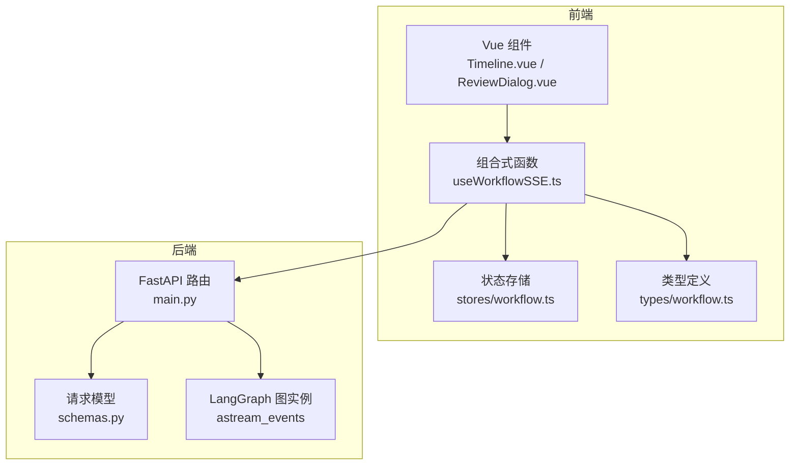
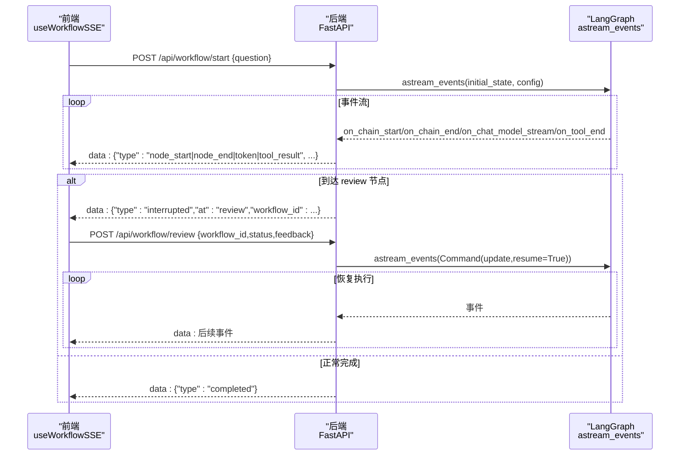
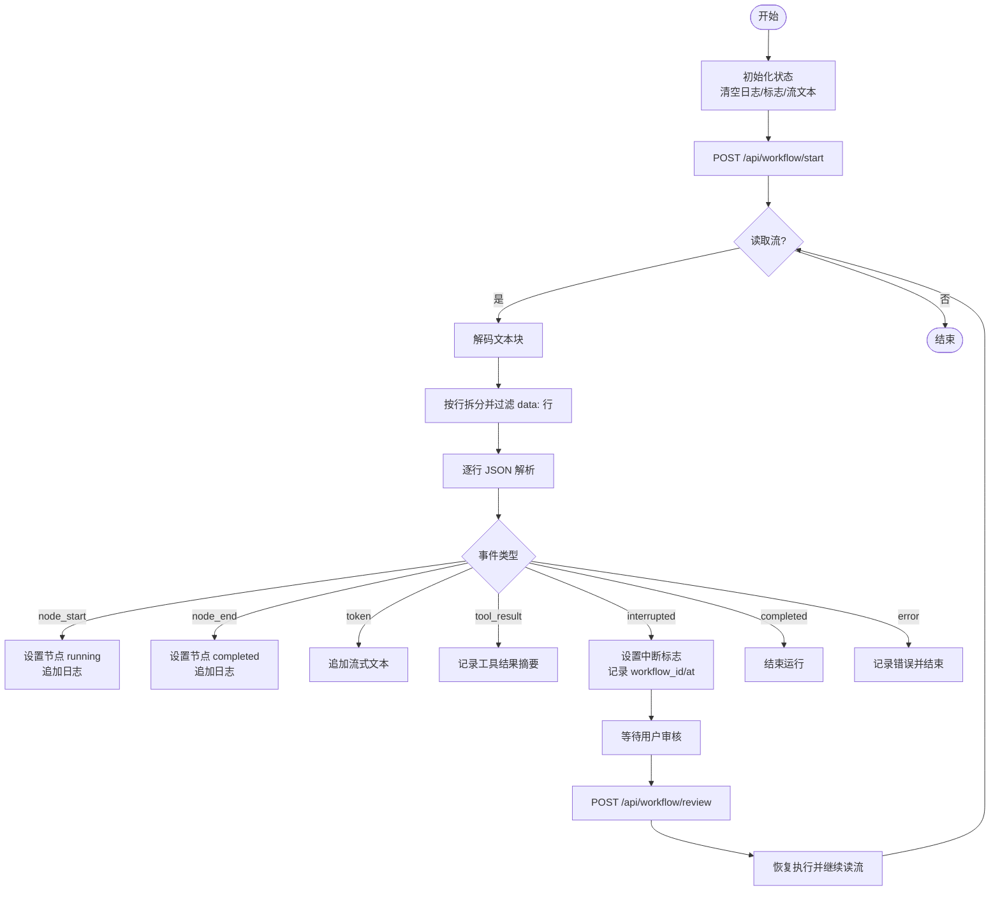
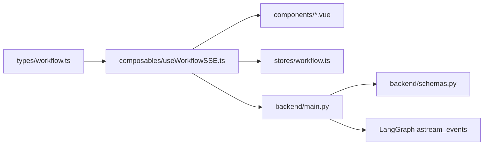

# SSE 实时通信

<cite>
**本文引用的文件**
- [useWorkflowSSE.ts](file://workflow-studio/frontend/src/composables/useWorkflowSSE.ts)
- [workflow.ts](file://workflow-studio/frontend/src/types/workflow.ts)
- [workflow.ts（store）](file://workflow-studio/frontend/src/stores/workflow.ts)
- [main.py](file://workflow-studio/backend/app/main.py)
- [schemas.py](file://workflow-studio/backend/app/schemas.py)
- [Timeline.vue](file://workflow-studio/frontend/src/components/panels/Timeline.vue)
- [ReviewDialog.vue](file://workflow-studio/frontend/src/components/panels/ReviewDialog.vue)
- [package.json](file://workflow-studio/frontend/package.json)
</cite>

## 目录
1. [简介](#简介)
2. [项目结构](#项目结构)
3. [核心组件](#核心组件)
4. [架构总览](#架构总览)
5. [详细组件分析](#详细组件分析)
6. [依赖关系分析](#依赖关系分析)
7. [性能与可靠性](#性能与可靠性)
8. [故障排查指南](#故障排查指南)
9. [结论](#结论)
10. [附录：事件类型与数据格式规范](#附录事件类型与数据格式规范)

## 简介
本文件为 Workflow Studio 的 SSE 实时通信机制提供系统化文档，重点围绕前端组合式函数 useWorkflowSSE 的设计模式、事件处理逻辑、连接管理、状态同步策略、错误处理与恢复流程，以及后端流式接口的事件生成与中断/恢复机制。文档同时给出事件类型定义、数据格式规范与兼容性注意事项，并提供可操作的实现要点与最佳实践，帮助读者构建可靠的实时工作流体验。

## 项目结构
前端采用 Vue 3 + TypeScript，使用组合式函数封装 SSE 能力；Pinia store 维护全局工作流状态；后端基于 FastAPI 提供流式接口，通过 LangGraph 的事件流将节点执行、LLM token 流、工具结果等事件推送给前端。

图表来源
- [useWorkflowSSE.ts:1-172](file://workflow-studio/frontend/src/composables/useWorkflowSSE.ts#L1-L172)
- [workflow.ts（store）:1-75](file://workflow-studio/frontend/src/stores/workflow.ts#L1-L75)
- [workflow.ts:1-64](file://workflow-studio/frontend/src/types/workflow.ts#L1-L64)
- [main.py:34-154](file://workflow-studio/backend/app/main.py#L34-L154)
- [schemas.py:1-12](file://workflow-studio/backend/app/schemas.py#L1-L12)

章节来源
- [useWorkflowSSE.ts:1-172](file://workflow-studio/frontend/src/composables/useWorkflowSSE.ts#L1-L172)
- [workflow.ts:1-64](file://workflow-studio/frontend/src/types/workflow.ts#L1-L64)
- [workflow.ts（store）:1-75](file://workflow-studio/frontend/src/stores/workflow.ts#L1-L75)
- [main.py:34-154](file://workflow-studio/backend/app/main.py#L34-L154)
- [schemas.py:1-12](file://workflow-studio/backend/app/schemas.py#L1-L12)

## 核心组件
- 组合式函数 useWorkflowSSE：封装 SSE 连接、事件解析、状态更新、工作流启动与人工审核提交。
- 类型定义 types/workflow.ts：统一 NodeStatus、SSEEvent、WorkflowState 等类型，确保前后端契约一致。
- Pinia store stores/workflow.ts：集中管理工作流状态（节点状态、日志、运行标志、流式文本等），提供计算属性与重置方法。
- 后端 main.py：暴露 /api/workflow/start 与 /api/workflow/review 两个流式接口，基于 LangGraph 的事件流输出 node_start/node_end/token/tool_result/interrupted/completed/error 等事件。
- 组件 Timeline.vue 与 ReviewDialog.vue：消费组合式函数提供的状态与回调，展示日志与触发审核操作。

章节来源
- [useWorkflowSSE.ts:1-172](file://workflow-studio/frontend/src/composables/useWorkflowSSE.ts#L1-L172)
- [workflow.ts:1-64](file://workflow-studio/frontend/src/types/workflow.ts#L1-L64)
- [workflow.ts（store）:1-75](file://workflow-studio/frontend/src/stores/workflow.ts#L1-L75)
- [main.py:34-154](file://workflow-studio/backend/app/main.py#L34-L154)
- [Timeline.vue:1-22](file://workflow-studio/frontend/src/components/panels/Timeline.vue#L1-L22)
- [ReviewDialog.vue:1-54](file://workflow-studio/frontend/src/components/panels/ReviewDialog.vue#L1-L54)

## 架构总览
SSE 实时通信由前端发起 HTTP 请求并读取响应体流，后端以 text/event-stream 持续推送结构化 JSON 事件。前端在组合式函数中解码、过滤 data: 行、解析 JSON，并根据事件类型更新本地状态与 UI。当工作流到达人工审核节点时，后端发送 interrupted 事件携带 workflow_id，前端暂停并等待用户输入；用户提交审核后，前端调用 /api/workflow/review 继续从断点恢复执行。

图表来源
- [main.py:34-154](file://workflow-studio/backend/app/main.py#L34-L154)
- [useWorkflowSSE.ts:74-157](file://workflow-studio/frontend/src/composables/useWorkflowSSE.ts#L74-L157)

## 详细组件分析

### 组合式函数 useWorkflowSSE
- 设计模式
  - 单一职责：仅负责 SSE 连接生命周期、事件解析与状态变更。
  - 响应式状态：使用 Vue ref/computed 暴露 nodeStatuses、logs、isRunning、isInterrupted、interruptedAt、streamingText、currentWorkflowId。
  - 事件分发：handleSSEEvent 根据事件类型进行分支处理，保证可扩展性。
- 连接管理与事件监听
  - 使用 fetch 发起请求，获取 response.body.getReader() 作为流读取器。
  - 使用 TextDecoder 按块解码，按换行分割并过滤以 data: 开头的行，再解析 JSON。
  - 对解析异常进行吞错保护，避免单条坏消息导致整个流中断。
- 状态同步策略
  - node_start/node_end：更新对应节点的运行/完成状态，并追加日志。
  - token：累加 streamingText 用于实时文本输出。
  - tool_result：截取并记录工具返回摘要。
  - interrupted：设置 isRunning=false、isInterrupted=true，记录 interruptedAt 与 workflow_id，并将目标节点置为 waiting。
  - completed/error：结束运行，清理中断标记，记录日志。
- 错误处理与恢复
  - 网络或解析异常时，设置 isRunning=false 并记录错误日志。
  - 支持通过 submitReview 传入 workflow_id 恢复执行，形成“中断-审核-恢复”闭环。
- 性能优化
  - 增量拼接 streamingText，避免重复渲染大对象。
  - 日志追加采用不可变更新（展开新数组），配合 Vue 响应式最小化重渲染。
  - 限制日志截断长度（如工具结果前 100 字符），控制 DOM 压力。

图表来源
- [useWorkflowSSE.ts:19-157](file://workflow-studio/frontend/src/composables/useWorkflowSSE.ts#L19-L157)

章节来源
- [useWorkflowSSE.ts:1-172](file://workflow-studio/frontend/src/composables/useWorkflowSSE.ts#L1-L172)

### 类型定义 types/workflow.ts
- 统一事件契约：SSEEvent 明确 type 枚举及可选字段，便于前端 switch 分支安全处理。
- 节点状态：NodeStatus 覆盖 idle/running/completed/error/waiting，支撑可视化反馈。
- 工作流状态：WorkflowState 描述全局状态快照，便于调试与持久化。
- 图结构：GraphStructureNode/Edge 用于前端渲染流程图。

章节来源
- [workflow.ts:1-64](file://workflow-studio/frontend/src/types/workflow.ts#L1-L64)

### Pinia store stores/workflow.ts
- 职责：集中管理工作流相关状态与派生计算属性（如是否运行、已完成节点列表）。
- 与组合式函数的协作：组合式函数可直接更新 store，或通过 props/events 传递状态；当前实现中组合式函数维护独立状态，store 可作为共享状态中心扩展。
- 关键方法：setNodeStatus、resetState、addLog、setGraphStructure。

章节来源
- [workflow.ts（store）:1-75](file://workflow-studio/frontend/src/stores/workflow.ts#L1-L75)

### 后端 main.py
- 启动工作流 /api/workflow/start
  - 创建初始状态与 thread_id（workflow_id）。
  - 通过 LangGraph 的 astream_events 订阅 v2 事件，映射到 node_start/node_end/token/tool_result。
  - 结束时检查 state.next，若存在则发送 interrupted 事件（携带 at 与 workflow_id），否则发送 completed。
  - 异常捕获后发送 error 事件。
- 人工审核 /api/workflow/review
  - 接收 workflow_id、status、feedback，构造 Command(update=update, resume=True) 恢复执行。
  - 再次遍历事件流，并在结束后判断是否再次中断。
- 其他接口
  - /api/workflow/state/{workflow_id}：查询当前状态，用于页面刷新后恢复。
  - /api/workflow/graph-structure：返回静态图结构供前端渲染。

章节来源
- [main.py:34-154](file://workflow-studio/backend/app/main.py#L34-L154)
- [main.py:157-200](file://workflow-studio/backend/app/main.py#L157-L200)

### 组件 Timeline.vue 与 ReviewDialog.vue
- Timeline.vue：消费 logs 数组，滚动显示执行日志。
- ReviewDialog.vue：提供审核输入与提交按钮，调用父级传入的 onSubmit(status, feedback)，最终由组合式函数转发至后端。

章节来源
- [Timeline.vue:1-22](file://workflow-studio/frontend/src/components/panels/Timeline.vue#L1-L22)
- [ReviewDialog.vue:1-54](file://workflow-studio/frontend/src/components/panels/ReviewDialog.vue#L1-L54)

## 依赖关系分析
- 前端
  - useWorkflowSSE 依赖 types/workflow.ts 的类型约束。
  - 组件依赖组合式函数暴露的状态与方法。
  - 包依赖 vue、@vue-flow/core、pinia 等。
- 后端
  - main.py 依赖 schemas.py 的请求模型。
  - 通过 LangGraph 的 astream_events 获取细粒度事件。

图表来源
- [workflow.ts:1-64](file://workflow-studio/frontend/src/types/workflow.ts#L1-L64)
- [useWorkflowSSE.ts:1-172](file://workflow-studio/frontend/src/composables/useWorkflowSSE.ts#L1-L172)
- [workflow.ts（store）:1-75](file://workflow-studio/frontend/src/stores/workflow.ts#L1-L75)
- [main.py:34-154](file://workflow-studio/backend/app/main.py#L34-L154)
- [schemas.py:1-12](file://workflow-studio/backend/app/schemas.py#L1-L12)

章节来源
- [package.json:1-32](file://workflow-studio/frontend/package.json#L1-L32)
- [useWorkflowSSE.ts:1-172](file://workflow-studio/frontend/src/composables/useWorkflowSSE.ts#L1-L172)
- [main.py:34-154](file://workflow-studio/backend/app/main.py#L34-L154)

## 性能与可靠性
- 流式传输
  - 后端使用 StreamingResponse 与 text/event-stream，禁用缓存与代理缓冲，确保低延迟。
  - 前端使用 ReadableStream 分块解码，避免整段加载内存峰值。
- 事件解析
  - 按行过滤 data: 前缀，减少无效解析开销。
  - 对 JSON 解析失败进行容错，防止单条损坏消息阻塞整体流。
- 状态更新
  - 日志与流文本采用不可变更新与增量拼接，降低重渲染成本。
  - 工具结果与日志内容做长度限制，避免 DOM 过大。
- 可靠性
  - 中断/恢复机制：通过 workflow_id 关联线程，支持长时间运行的工作流在人工审核后无缝恢复。
  - 错误事件：后端统一捕获异常并以 error 事件通知前端，前端及时终止运行态。
- 兼容性
  - 现代浏览器支持 fetch + ReadableStream；如需兼容旧环境，可考虑 EventSource 替代方案（需后端适配 event: 标签与 id 字段）。
  - 跨域：后端已配置 CORS，允许常见开发端口。

[本节为通用指导，不直接分析具体代码文件]

## 故障排查指南
- 连接建立失败
  - 检查后端 CORS 配置与端口可达性。
  - 确认请求路径与方法正确，Content-Type 为 application/json。
- 事件未到达前端
  - 检查后端是否进入 astream_events 循环，是否有异常被吞掉。
  - 确认响应头包含 text/event-stream，且未被中间件缓冲。
- 解析异常
  - 查看控制台日志，定位非法 JSON 或 data: 行缺失问题。
  - 增加更详细的日志输出（如原始行片段）辅助定位。
- 中断后无法恢复
  - 确认 interrupted 事件中 workflow_id 是否正确回传。
  - 提交审核时携带正确的 workflow_id、status 与可选 feedback。
- 性能问题
  - 观察日志增长与流文本大小，必要时分页或节流渲染。
  - 评估后端事件频率，必要时合并或降采样。

章节来源
- [main.py:34-154](file://workflow-studio/backend/app/main.py#L34-L154)
- [useWorkflowSSE.ts:74-157](file://workflow-studio/frontend/src/composables/useWorkflowSSE.ts#L74-L157)

## 结论
本实现通过组合式函数封装 SSE 能力，结合后端 LangGraph 事件流，实现了工作流的实时可视化与人工审核闭环。其设计清晰、扩展性强，具备基本的错误处理与恢复机制。建议在后续迭代中增强连接重试、断线检测、事件去重与幂等性保障，进一步提升鲁棒性与用户体验。

[本节为总结性内容，不直接分析具体代码文件]

## 附录：事件类型与数据格式规范
- 事件类型
  - node_start：节点开始执行
  - node_end：节点执行结束
  - token：LLM 流式 token
  - tool_result：工具调用结果
  - interrupted：工作流暂停，等待人工审核
  - completed：工作流完成
  - error：发生错误
- 数据结构（SSEEvent）
  - type：必填，事件类型
  - node：节点标识（node_start/node_end）
  - content：流式文本片段（token）
  - output：节点输出摘要（node_end）
  - data：工具结果（tool_result）
  - at：中断位置节点（interrupted）
  - message：错误信息（error）
  - workflow_id：工作流线程标识（interrupted）
- 兼容性说明
  - 前端使用 fetch + ReadableStream 解析 data: 行；如需 EventSource，请后端在每条事件前添加 event: 行与 id 字段。
  - 跨域需在服务端允许前端源与方法。

章节来源
- [workflow.ts:22-32](file://workflow-studio/frontend/src/types/workflow.ts#L22-L32)
- [main.py:60-103](file://workflow-studio/backend/app/main.py#L60-L103)
- [main.py:119-154](file://workflow-studio/backend/app/main.py#L119-L154)