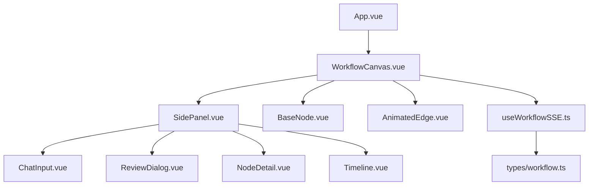
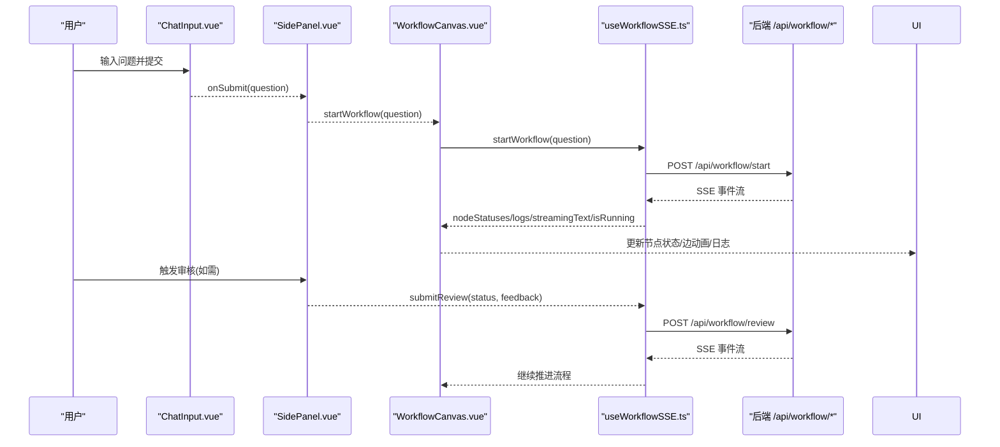
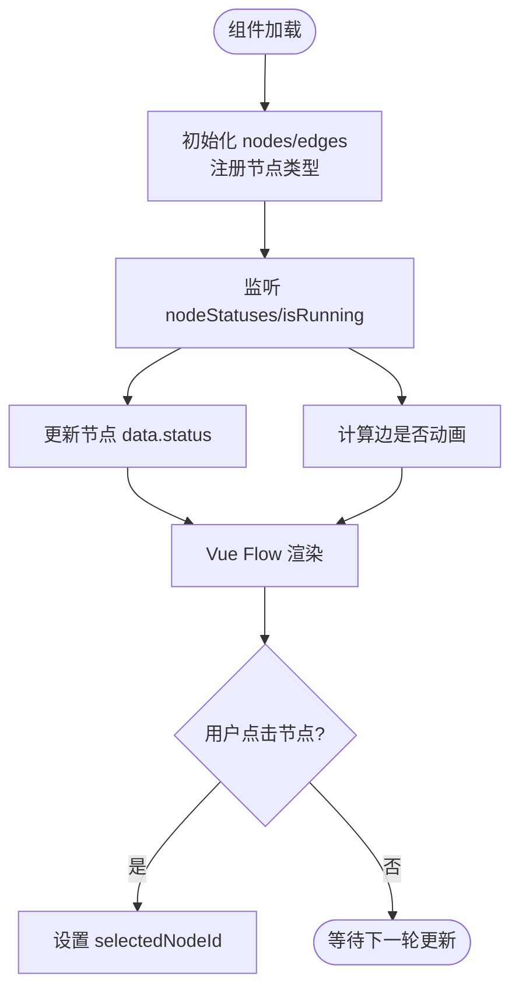
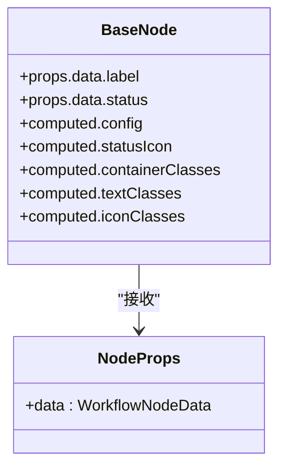
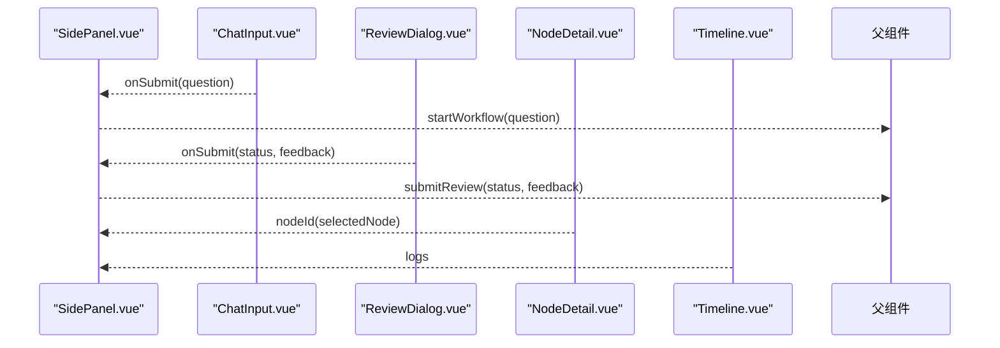
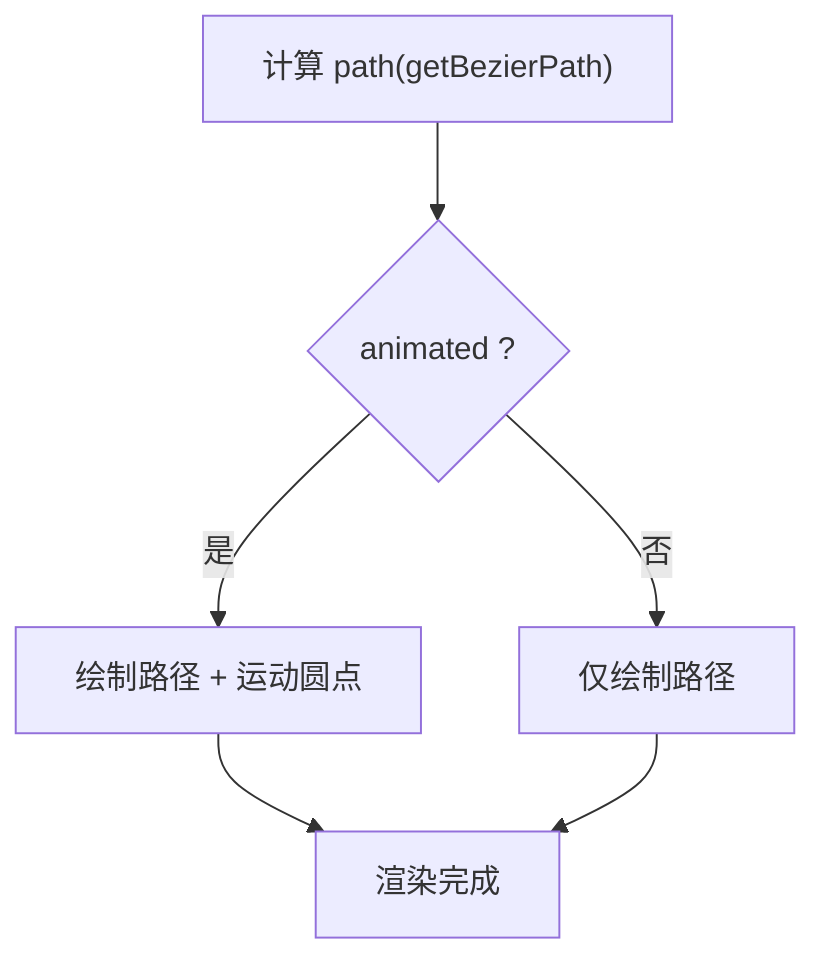
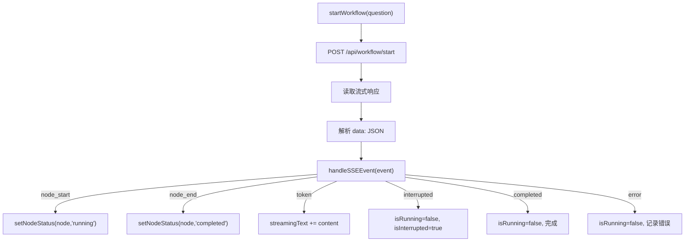
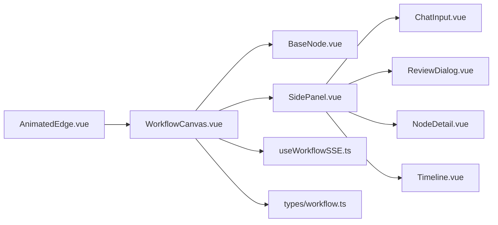

# Vue 组件架构

<cite>
**本文引用的文件**
- [WorkflowCanvas.vue](file://workflow-studio/frontend/src/components/WorkflowCanvas.vue)
- [BaseNode.vue](file://workflow-studio/frontend/src/components/nodes/BaseNode.vue)
- [SidePanel.vue](file://workflow-studio/frontend/src/components/layout/SidePanel.vue)
- [useWorkflowSSE.ts](file://workflow-studio/frontend/src/composables/useWorkflowSSE.ts)
- [workflow.ts](file://workflow-studio/frontend/src/types/workflow.ts)
- [AnimatedEdge.vue](file://workflow-studio/frontend/src/components/edges/AnimatedEdge.vue)
- [ChatInput.vue](file://workflow-studio/frontend/src/components/panels/ChatInput.vue)
- [NodeDetail.vue](file://workflow-studio/frontend/src/components/panels/NodeDetail.vue)
- [Timeline.vue](file://workflow-studio/frontend/src/components/panels/Timeline.vue)
- [ReviewDialog.vue](file://workflow-studio/frontend/src/components/panels/ReviewDialog.vue)
- [App.vue](file://workflow-studio/frontend/src/App.vue)
- [package.json](file://workflow-studio/frontend/package.json)
</cite>

## 更新摘要
**所做更改**
- 更新了 BaseNode 基础节点组件章节，反映移除了节点类型图标映射功能
- 简化了 UI 显示逻辑，专注于状态驱动的视觉反馈
- 调整了可扩展性设计说明，强调基于状态的渲染而非类型映射

## 目录
1. [简介](#简介)
2. [项目结构](#项目结构)
3. [核心组件](#核心组件)
4. [架构总览](#架构总览)
5. [详细组件分析](#详细组件分析)
6. [依赖关系分析](#依赖关系分析)
7. [性能考量](#性能考量)
8. [故障排查指南](#故障排查指南)
9. [结论](#结论)
10. [附录：如何开发新的工作流节点组件](#附录如何开发新的工作流节点组件)

## 简介
本文件为 Workflow Studio 前端 Vue 组件系统的权威文档，聚焦以下目标：
- 深入解析组件层次结构与职责边界
- 说明组件间通信机制（Props/Events、Composable 状态、Pinia Store）
- 详解自定义节点实现与可扩展性设计
- 阐述主画布 WorkflowCanvas 的设计模式、基础节点 BaseNode 的可扩展性、侧边栏 SidePanel 的状态管理
- 覆盖生命周期管理、事件处理模式、响应式数据绑定
- 提供组件复用策略、样式隔离与性能优化技巧
- 给出"新增工作流节点"的实操步骤与示例路径

## 项目结构
前端采用基于功能分层的组织方式：
- components：按职责划分（画布、节点、连线、面板、布局）
- composables：可复用的组合式逻辑（如 SSE 工作流控制）
- stores：全局状态（Pinia）
- types：类型定义
- App.vue：应用入口挂载根组件

图表来源
- [App.vue:1-10](file://workflow-studio/frontend/src/App.vue#L1-L10)
- [WorkflowCanvas.vue:1-135](file://workflow-studio/frontend/src/components/WorkflowCanvas.vue#L1-L135)
- [SidePanel.vue:1-51](file://workflow-studio/frontend/src/components/layout/SidePanel.vue#L1-L51)
- [BaseNode.vue:1-70](file://workflow-studio/frontend/src/components/nodes/BaseNode.vue#L1-L70)
- [AnimatedEdge.vue:1-48](file://workflow-studio/frontend/src/components/edges/AnimatedEdge.vue#L1-L48)
- [useWorkflowSSE.ts:1-181](file://workflow-studio/frontend/src/composables/useWorkflowSSE.ts#L1-L181)
- [workflow.ts:1-66](file://workflow-studio/frontend/src/types/workflow.ts#L1-L66)

章节来源
- [App.vue:1-10](file://workflow-studio/frontend/src/App.vue#L1-L10)
- [package.json:1-32](file://workflow-studio/frontend/package.json#L1-L32)

## 核心组件
- WorkflowCanvas：基于 Vue Flow 的主画布容器，负责注册自定义节点类型、维护节点与边的响应式数据、监听并同步后端 SSE 状态到可视化层。
- BaseNode：通用节点渲染器，专注于基于节点状态的动态展示，通过 Handle 暴露连接点；移除了复杂的节点类型图标映射，简化为统一的状态驱动 UI。
- SidePanel：右侧控制面板，聚合输入、审核弹窗、流式输出、节点详情与执行日志等子面板，统一接收父级传入的状态与回调。
- useWorkflowSSE：封装 SSE 事件处理、工作流启动与人工审核提交，维护运行态、中断态、流式文本与日志。
- AnimatedEdge：自定义连线组件，支持运行时动画指示流转。
- 面板组件：ChatInput、ReviewDialog、NodeDetail、Timeline 分别承担输入、审核、详情与日志展示。

章节来源
- [WorkflowCanvas.vue:1-135](file://workflow-studio/frontend/src/components/WorkflowCanvas.vue#L1-L135)
- [BaseNode.vue:1-70](file://workflow-studio/frontend/src/components/nodes/BaseNode.vue#L1-L70)
- [SidePanel.vue:1-51](file://workflow-studio/frontend/src/components/layout/SidePanel.vue#L1-L51)
- [useWorkflowSSE.ts:1-181](file://workflow-studio/frontend/src/composables/useWorkflowSSE.ts#L1-L181)
- [AnimatedEdge.vue:1-48](file://workflow-studio/frontend/src/components/edges/AnimatedEdge.vue#L1-L48)
- [ChatInput.vue:1-40](file://workflow-studio/frontend/src/components/panels/ChatInput.vue#L1-L40)
- [ReviewDialog.vue:1-54](file://workflow-studio/frontend/src/components/panels/ReviewDialog.vue#L1-L54)
- [NodeDetail.vue:1-36](file://workflow-studio/frontend/src/components/panels/NodeDetail.vue#L1-L36)
- [Timeline.vue:1-22](file://workflow-studio/frontend/src/components/panels/Timeline.vue#L1-L22)

## 架构总览
整体采用"画布 + 侧边栏 + 可插拔节点"的架构：
- 画布层：Vue Flow 提供图编辑能力，WorkflowCanvas 作为编排中心，集中管理 nodes/edges 与交互事件。
- 状态层：useWorkflowSSE 作为单一可信源，驱动节点状态、日志、流式文本与运行标志；可选 Pinia store 用于跨组件共享。
- 视图层：SidePanel 聚合多个子面板，通过 props/events 与父组件协作；BaseNode 与 AnimatedEdge 作为可复用可视化单元。

图表来源
- [ChatInput.vue:1-40](file://workflow-studio/frontend/src/components/panels/ChatInput.vue#L1-L40)
- [SidePanel.vue:1-51](file://workflow-studio/frontend/src/components/layout/SidePanel.vue#L1-L51)
- [WorkflowCanvas.vue:1-135](file://workflow-studio/frontend/src/components/WorkflowCanvas.vue#L1-L135)
- [useWorkflowSSE.ts:1-181](file://workflow-studio/frontend/src/composables/useWorkflowSSE.ts#L1-L181)

## 详细组件分析

### WorkflowCanvas 主画布组件
- 设计模式
  - 组合式函数驱动：通过 useWorkflowSSE 获取运行态与事件结果，集中映射到 nodes/edges。
  - 声明式模板：使用 Vue Flow 提供的 Background/Controls/MiniMap 增强体验。
  - 响应式同步：watch 监听 nodeStatuses 与 isRunning，批量更新节点 data.status 与边 animated。
- 关键职责
  - 注册自定义节点类型 custom -> BaseNode
  - 初始化初始节点与边（便于演示）
  - 处理节点点击以选择节点，传递给 SidePanel
- 性能要点
  - 使用 markRaw 注册节点类型，避免不必要的响应式代理开销
  - 对 edges 进行整批映射更新，减少重绘次数

图表来源
- [WorkflowCanvas.vue:1-135](file://workflow-studio/frontend/src/components/WorkflowCanvas.vue#L1-L135)

章节来源
- [WorkflowCanvas.vue:1-135](file://workflow-studio/frontend/src/components/WorkflowCanvas.vue#L1-L135)

### BaseNode 基础节点组件
**已更新** 移除了节点类型图标映射功能，简化为基于状态的统一渲染逻辑

- 简化后的可扩展性设计
  - 专注于基于节点状态的动态展示，通过 props.data.status 切换样式与动画
  - 移除了复杂的 nodeTypeIcons 映射，所有节点类型使用统一的视觉风格
  - 使用 Handle 暴露上下连接点，天然适配 Vue Flow 连线
- 状态驱动的 UI 系统
  - 通过 statusConfig 定义不同状态的颜色、边框和动画效果
  - 通过 statusIcons 映射状态到对应的 Lucide 图标
  - 支持 idle/running/completed/error/waiting 五种状态
- 样式与交互
  - 使用 clsx 组合动态类名，确保状态驱动的视觉反馈
  - 显示执行耗时（startTime/endTime），便于调试与度量
  - 统一的圆角边框、阴影和过渡动画效果
- 复用策略
  - 所有业务节点均可继承此渲染逻辑，无需关心具体类型
  - 通过 label 字段提供节点名称，保持界面简洁一致

图表来源
- [BaseNode.vue:1-70](file://workflow-studio/frontend/src/components/nodes/BaseNode.vue#L1-L70)
- [workflow.ts:1-66](file://workflow-studio/frontend/src/types/workflow.ts#L1-L66)

章节来源
- [BaseNode.vue:1-70](file://workflow-studio/frontend/src/components/nodes/BaseNode.vue#L1-L70)
- [workflow.ts:1-66](file://workflow-studio/frontend/src/types/workflow.ts#L1-L66)

### SidePanel 侧边栏组件与状态管理
- 职责
  - 聚合 ChatInput、ReviewDialog、NodeDetail、Timeline 等子面板
  - 通过 props 接收 isRunning/isInterrupted/streamingText/logs/selectedNode 以及回调 startWorkflow/submitReview
- 状态管理
  - 当前实现通过父组件传递状态（单向数据流）
  - 也可结合 Pinia store 统一管理（见 workflow.ts），在需要时替换为 store 读取
- 事件处理
  - 用户提交问题 -> 调用 startWorkflow
  - 审核弹窗 -> 调用 submitReview
  - 节点详情 -> 根据 selectedNode 显示对应状态

图表来源
- [SidePanel.vue:1-51](file://workflow-studio/frontend/src/components/layout/SidePanel.vue#L1-L51)
- [ChatInput.vue:1-40](file://workflow-studio/frontend/src/components/panels/ChatInput.vue#L1-L40)
- [ReviewDialog.vue:1-54](file://workflow-studio/frontend/src/components/panels/ReviewDialog.vue#L1-L54)
- [NodeDetail.vue:1-36](file://workflow-studio/frontend/src/components/panels/NodeDetail.vue#L1-L36)
- [Timeline.vue:1-22](file://workflow-studio/frontend/src/components/panels/Timeline.vue#L1-L22)

章节来源
- [SidePanel.vue:1-51](file://workflow-studio/frontend/src/components/layout/SidePanel.vue#L1-L51)
- [workflow.ts:1-75](file://workflow-studio/frontend/src/stores/workflow.ts#L1-L75)

### 连线组件 AnimatedEdge
- 功能
  - 根据 animated 属性决定是否绘制运动圆点，直观表示流转方向
  - 使用 getBezierPath 计算贝塞尔曲线，保持与 Vue Flow 一致的路径风格
- 集成
  - 由 WorkflowCanvas 根据节点状态计算每条边的 animated 属性并传入

图表来源
- [AnimatedEdge.vue:1-48](file://workflow-studio/frontend/src/components/edges/AnimatedEdge.vue#L1-L48)
- [WorkflowCanvas.vue:97-129](file://workflow-studio/frontend/src/components/WorkflowCanvas.vue#L97-L129)

章节来源
- [AnimatedEdge.vue:1-48](file://workflow-studio/frontend/src/components/edges/AnimatedEdge.vue#L1-L48)
- [WorkflowCanvas.vue:97-129](file://workflow-studio/frontend/src/components/WorkflowCanvas.vue#L97-L129)

### 事件处理与 SSE 流
- 事件类型
  - node_start/node_end：节点开始/结束，更新节点状态与日志
  - token：流式内容拼接至 streamingText
  - tool_result：工具执行结果摘要写入日志
  - interrupted：暂停工作流，进入人工审核
  - completed/error：结束或错误处理
- 工作流启动与审核
  - startWorkflow：POST 启动，读取流式响应，逐行解析 data: JSON 并分发
  - submitReview：POST 提交审核结果，恢复运行

图表来源
- [useWorkflowSSE.ts:1-181](file://workflow-studio/frontend/src/composables/useWorkflowSSE.ts#L1-L181)

章节来源
- [useWorkflowSSE.ts:1-181](file://workflow-studio/frontend/src/composables/useWorkflowSSE.ts#L1-L181)

## 依赖关系分析
- 外部库
  - @vue-flow/core 及其插件 background/controls/minimap：提供画布、背景、控件与小地图
  - pinia：可选的全局状态管理
  - @lucide/vue：图标库
  - clsx/tailwind-merge：样式类名合并
- 内部模块
  - WorkflowCanvas 依赖 BaseNode、SidePanel、useWorkflowSSE、types
  - SidePanel 依赖各面板组件
  - 各面板组件通过 props/events 与父组件通信

图表来源
- [WorkflowCanvas.vue:1-135](file://workflow-studio/frontend/src/components/WorkflowCanvas.vue#L1-L135)
- [SidePanel.vue:1-51](file://workflow-studio/frontend/src/components/layout/SidePanel.vue#L1-L51)
- [useWorkflowSSE.ts:1-181](file://workflow-studio/frontend/src/composables/useWorkflowSSE.ts#L1-L181)
- [workflow.ts:1-66](file://workflow-studio/frontend/src/types/workflow.ts#L1-L66)
- [AnimatedEdge.vue:1-48](file://workflow-studio/frontend/src/components/edges/AnimatedEdge.vue#L1-L48)

章节来源
- [package.json:1-32](file://workflow-studio/frontend/package.json#L1-L32)

## 性能考量
- 渲染优化
  - 使用 markRaw 注册节点类型，避免 Vue Flow 节点类型被深度代理
  - 批量更新 edges/nodes，减少多次响应式变更导致的重复渲染
  - BaseNode 组件简化后减少了图标映射的计算开销
- 内存与网络
  - 流式文本 streamingText 仅在必要时追加，避免过大字符串频繁重建
  - 日志数组 logs 适度截断或分页（可按需扩展）
- 样式与主题
  - 使用 Tailwind 原子类与 clsx 组合，减少 CSS 体积与冲突
  - 通过 computed 派生类名，避免在模板中复杂表达式

[本节为通用指导，不直接分析具体文件]

## 故障排查指南
- 工作流未启动
  - 检查 ChatInput 的 disabled 状态与输入是否为空
  - 确认 useWorkflowSSE.startWorkflow 是否正确发起请求并读取流
- 节点状态不更新
  - 检查 SSE 事件是否到达 handleSSEEvent，特别是 node_start/node_end
  - 确认 WorkflowCanvas 的 watch 是否监听到 nodeStatuses 变化
- 边无动画
  - 检查 edges 的 animated 计算逻辑是否与节点状态匹配
  - 确认 AnimatedEdge 的 animated prop 是否传入
- 审核弹窗不出现
  - 检查 isInterrupted 状态是否被置为 true
  - 确认 ReviewDialog 的 v-if 条件与父级状态同步
- BaseNode 显示异常
  - 确认节点数据包含正确的 status 字段
  - 检查状态配置是否正确映射到视觉效果

章节来源
- [useWorkflowSSE.ts:1-181](file://workflow-studio/frontend/src/composables/useWorkflowSSE.ts#L1-L181)
- [WorkflowCanvas.vue:97-129](file://workflow-studio/frontend/src/components/WorkflowCanvas.vue#L97-L129)
- [SidePanel.vue:1-51](file://workflow-studio/frontend/src/components/layout/SidePanel.vue#L1-L51)
- [AnimatedEdge.vue:1-48](file://workflow-studio/frontend/src/components/edges/AnimatedEdge.vue#L1-L48)
- [BaseNode.vue:1-70](file://workflow-studio/frontend/src/components/nodes/BaseNode.vue#L1-L70)

## 结论
该组件系统以 WorkflowCanvas 为中心，结合简化后的 BaseNode 统一节点渲染与 SidePanel 的面板聚合，实现了清晰的数据流与良好的可维护性。通过移除复杂的节点类型图标映射，BaseNode 组件更加专注于状态驱动的视觉反馈，提供了更简洁高效的节点展示方案。配合 useWorkflowSSE 将后端 SSE 事件转化为前端响应式状态，以及 Vue Flow 的图能力，提供了流畅的工作流可视化与交互体验。遵循本文的扩展与优化建议，可快速迭代新的节点类型与功能。

[本节为总结，不直接分析具体文件]

## 附录：如何开发新的工作流节点组件
目标：新增一个名为 "generate" 的新节点类型，并在画布中显示与运行。

**已更新** 由于 BaseNode 组件移除了节点类型图标映射，现在只需关注状态管理

步骤
- 定义类型
  - 在 types/workflow.ts 中扩展 NodeType，加入 'generate'
  - 若需要额外字段，扩展 WorkflowNodeData
- 注册节点类型
  - 在 WorkflowCanvas.vue 的 nodeTypes 中添加 'generate': BaseNode
- 配置节点数据
  - 在 initialNodes 中添加一个 type 为 'custom'、data.nodeType 为 'generate' 的节点
- 渲染与样式
  - 无需修改 BaseNode.vue，所有节点类型使用统一的视觉风格
  - BaseNode 会根据节点的 status 自动应用相应的样式和图标
- 接入运行逻辑
  - 在后端返回的 SSE 事件中，确保包含 node_start/node_end 且 node 字段为新节点 id
  - 前端无需改动，BaseNode 会根据状态自动更新
- 验证
  - 启动工作流，观察新节点是否出现在画布上，状态随 SSE 事件变化
  - 检查边动画与日志是否正常

参考路径
- 类型定义：[workflow.ts:1-66](file://workflow-studio/frontend/src/types/workflow.ts#L1-L66)
- 节点类型注册与初始节点：[WorkflowCanvas.vue:51-65](file://workflow-studio/frontend/src/components/WorkflowCanvas.vue#L51-L65)
- 节点渲染与状态映射：[BaseNode.vue:32-49](file://workflow-studio/frontend/src/components/nodes/BaseNode.vue#L32-L49)
- SSE 事件处理：[useWorkflowSSE.ts:20-79](file://workflow-studio/frontend/src/composables/useWorkflowSSE.ts#L20-L79)

[本节为操作指引，不直接分析具体文件]