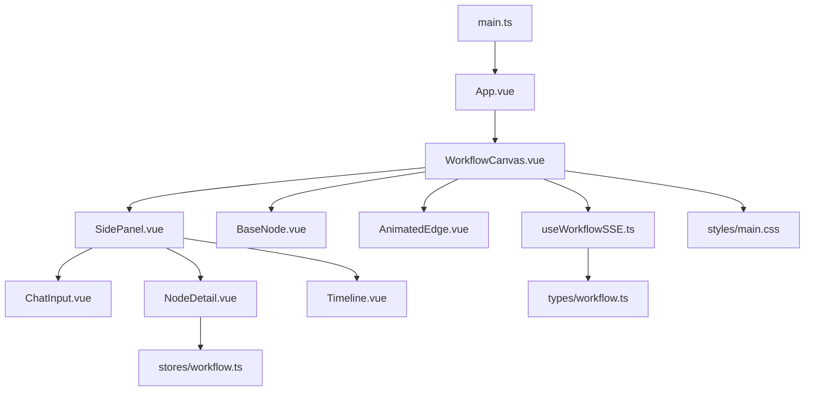
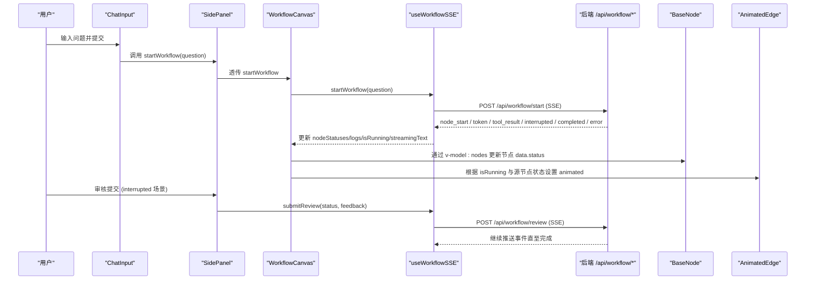
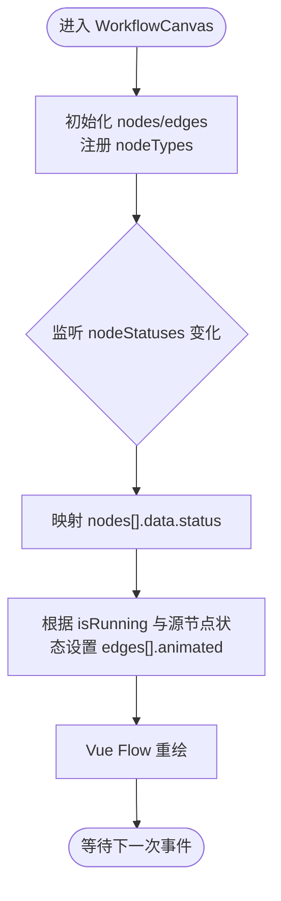
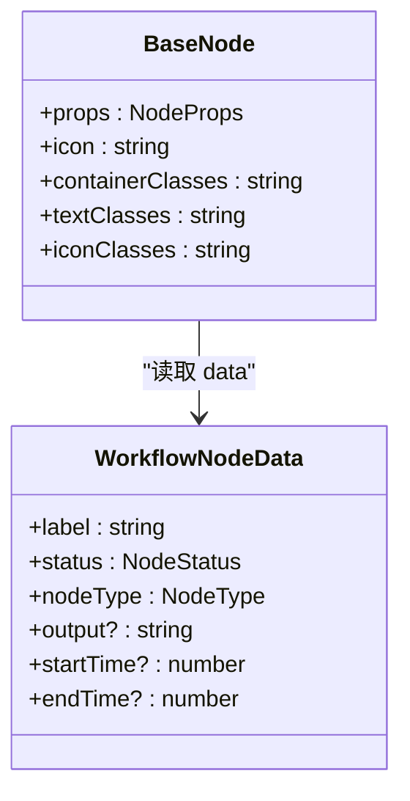
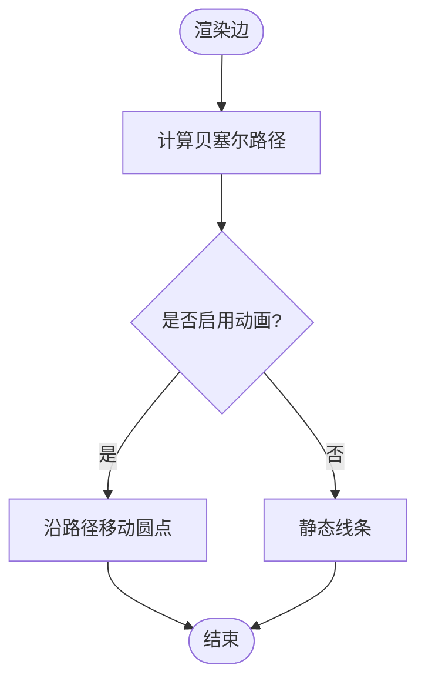
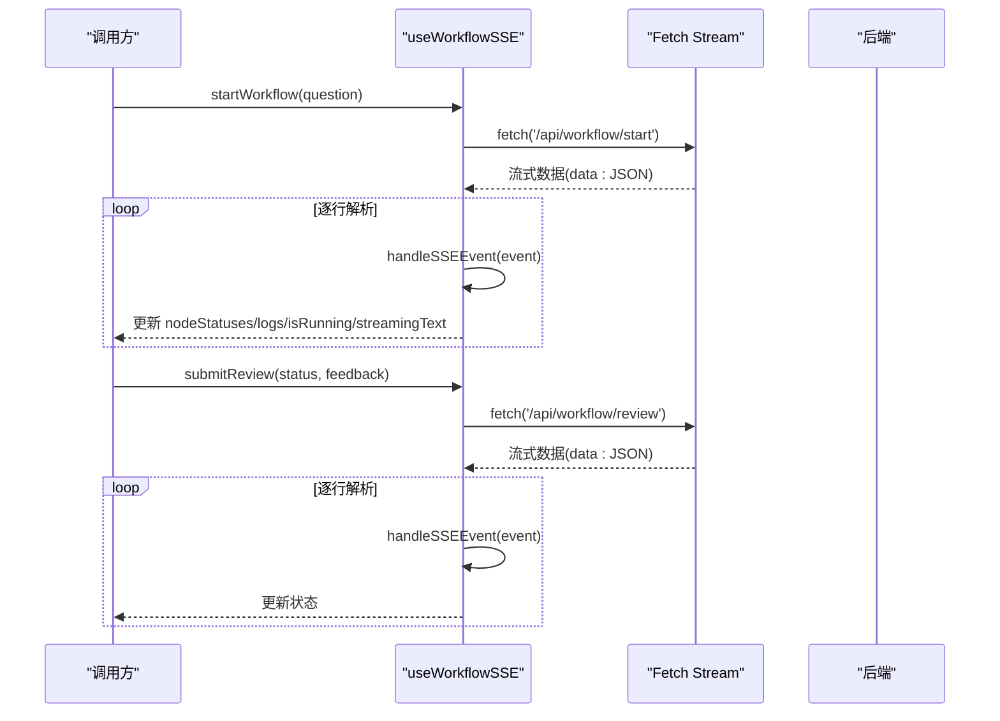
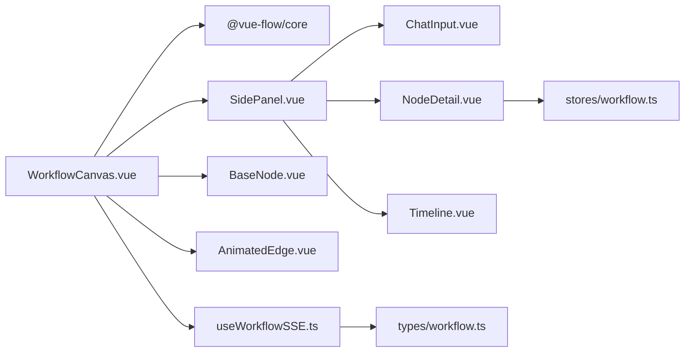

# 前端架构

<cite>
**本文引用的文件**
- [main.ts](file://workflow-studio/frontend/src/main.ts)
- [App.vue](file://workflow-studio/frontend/src/App.vue)
- [WorkflowCanvas.vue](file://workflow-studio/frontend/src/components/WorkflowCanvas.vue)
- [BaseNode.vue](file://workflow-studio/frontend/src/components/nodes/BaseNode.vue)
- [AnimatedEdge.vue](file://workflow-studio/frontend/src/components/edges/AnimatedEdge.vue)
- [SidePanel.vue](file://workflow-studio/frontend/src/components/layout/SidePanel.vue)
- [ChatInput.vue](file://workflow-studio/frontend/src/components/panels/ChatInput.vue)
- [NodeDetail.vue](file://workflow-studio/frontend/src/components/panels/NodeDetail.vue)
- [Timeline.vue](file://workflow-studio/frontend/src/components/panels/Timeline.vue)
- [useWorkflowSSE.ts](file://workflow-studio/frontend/src/composables/useWorkflowSSE.ts)
- [workflow.ts](file://workflow-studio/frontend/src/stores/workflow.ts)
- [workflow.ts](file://workflow-studio/frontend/src/types/workflow.ts)
- [main.css](file://workflow-studio/frontend/src/styles/main.css)
- [package.json](file://workflow-studio/frontend/package.json)
</cite>

## 目录
1. [简介](#简介)
2. [项目结构](#项目结构)
3. [核心组件](#核心组件)
4. [架构总览](#架构总览)
5. [详细组件分析](#详细组件分析)
6. [依赖关系分析](#依赖关系分析)
7. [性能考虑](#性能考虑)
8. [故障排查指南](#故障排查指南)
9. [结论](#结论)
10. [附录](#附录)

## 简介
本文件为 Workflow Studio 前端的完整架构文档，面向前端开发者，聚焦以下目标：
- Vue 3 组件架构与层次组织
- Pinia 状态管理模式与 composables 协作
- Vue Flow 可视化集成（画布、节点、边）
- 事件驱动模式与响应式数据绑定
- 工作流画布实现、节点渲染机制与实时状态同步
- 自定义节点开发、样式系统与性能优化策略

## 项目结构
前端采用模块化组织方式：
- 入口与根应用：main.ts、App.vue
- 视图层：components（画布、布局、面板、节点、边）
- 逻辑层：composables（SSE 工作流通信）、stores（Pinia 状态）
- 类型定义：types
- 样式：styles（Tailwind + Vue Flow 主题覆盖）
- 构建配置：vite.config.ts、tailwind.config.js、postcss.config.js、tsconfig*.json

图表来源
- [main.ts:1-11](file://workflow-studio/frontend/src/main.ts#L1-L11)
- [App.vue:1-10](file://workflow-studio/frontend/src/App.vue#L1-L10)
- [WorkflowCanvas.vue:1-133](file://workflow-studio/frontend/src/components/WorkflowCanvas.vue#L1-L133)
- [SidePanel.vue:1-39](file://workflow-studio/frontend/src/components/layout/SidePanel.vue#L1-L39)
- [BaseNode.vue:1-82](file://workflow-studio/frontend/src/components/nodes/BaseNode.vue#L1-L82)
- [AnimatedEdge.vue:1-48](file://workflow-studio/frontend/src/components/edges/AnimatedEdge.vue#L1-L48)
- [ChatInput.vue:1-40](file://workflow-studio/frontend/src/components/panels/ChatInput.vue#L1-L40)
- [NodeDetail.vue:1-36](file://workflow-studio/frontend/src/components/panels/NodeDetail.vue#L1-L36)
- [Timeline.vue:1-22](file://workflow-studio/frontend/src/components/panels/Timeline.vue#L1-L22)
- [useWorkflowSSE.ts:1-172](file://workflow-studio/frontend/src/composables/useWorkflowSSE.ts#L1-L172)
- [workflow.ts:1-75](file://workflow-studio/frontend/src/stores/workflow.ts#L1-L75)
- [workflow.ts:1-64](file://workflow-studio/frontend/src/types/workflow.ts#L1-L64)
- [main.css:1-36](file://workflow-studio/frontend/src/styles/main.css#L1-L36)

章节来源
- [main.ts:1-11](file://workflow-studio/frontend/src/main.ts#L1-L11)
- [App.vue:1-10](file://workflow-studio/frontend/src/App.vue#L1-L10)
- [package.json:1-32](file://workflow-studio/frontend/package.json#L1-L32)

## 核心组件
- WorkflowCanvas：Vue Flow 画布容器，负责节点与边的初始化、选中交互、根据 SSE 状态更新节点与边的动画。
- BaseNode：自定义节点组件，基于 NodeProps 渲染图标、标签、状态图标与连接点，支持不同节点类型的视觉区分。
- AnimatedEdge：自定义边组件，使用贝塞尔路径绘制，并在激活时以动画圆点沿路径运动。
- SidePanel：右侧控制面板，聚合输入、审核弹窗、流式输出、节点详情与执行日志。
- ChatInput：用户输入与启动工作流的触发器。
- NodeDetail：展示选中节点的当前状态。
- Timeline：滚动显示执行日志。
- useWorkflowSSE：封装 SSE 通信，维护运行态、中断态、流式文本与日志，并处理 node_start/node_end/token/tool_result/interrupted/completed/error 等事件。
- stores/workflow：Pinia store，集中管理工作流全局状态（节点状态、日志、运行标志、图结构等）。
- types/workflow：统一类型定义（节点状态、SSE 事件、图结构等）。

章节来源
- [WorkflowCanvas.vue:1-133](file://workflow-studio/frontend/src/components/WorkflowCanvas.vue#L1-L133)
- [BaseNode.vue:1-82](file://workflow-studio/frontend/src/components/nodes/BaseNode.vue#L1-L82)
- [AnimatedEdge.vue:1-48](file://workflow-studio/frontend/src/components/edges/AnimatedEdge.vue#L1-L48)
- [SidePanel.vue:1-39](file://workflow-studio/frontend/src/components/layout/SidePanel.vue#L1-L39)
- [ChatInput.vue:1-40](file://workflow-studio/frontend/src/components/panels/ChatInput.vue#L1-L40)
- [NodeDetail.vue:1-36](file://workflow-studio/frontend/src/components/panels/NodeDetail.vue#L1-L36)
- [Timeline.vue:1-22](file://workflow-studio/frontend/src/components/panels/Timeline.vue#L1-L22)
- [useWorkflowSSE.ts:1-172](file://workflow-studio/frontend/src/composables/useWorkflowSSE.ts#L1-L172)
- [workflow.ts:1-75](file://workflow-studio/frontend/src/stores/workflow.ts#L1-L75)
- [workflow.ts:1-64](file://workflow-studio/frontend/src/types/workflow.ts#L1-L64)

## 架构总览
整体采用“视图层 + 组合式逻辑 + 状态管理”的分层架构：
- 视图层：Vue 3 单文件组件，通过 props/emits 与组合式函数通信。
- 组合式逻辑：useWorkflowSSE 封装 SSE 事件流与业务动作（启动、审核提交），暴露响应式状态供组件消费。
- 状态管理：Pinia store 提供跨组件共享的全局状态与计算属性；同时 composables 内也维护局部运行态，形成“局部 + 全局”双层状态。
- 可视化层：Vue Flow 提供画布能力，配合自定义节点与边，实现交互式流程图。

图表来源
- [ChatInput.vue:1-40](file://workflow-studio/frontend/src/components/panels/ChatInput.vue#L1-L40)
- [SidePanel.vue:1-39](file://workflow-studio/frontend/src/components/layout/SidePanel.vue#L1-L39)
- [WorkflowCanvas.vue:1-133](file://workflow-studio/frontend/src/components/WorkflowCanvas.vue#L1-L133)
- [useWorkflowSSE.ts:1-172](file://workflow-studio/frontend/src/composables/useWorkflowSSE.ts#L1-L172)
- [BaseNode.vue:1-82](file://workflow-studio/frontend/src/components/nodes/BaseNode.vue#L1-L82)
- [AnimatedEdge.vue:1-48](file://workflow-studio/frontend/src/components/edges/AnimatedEdge.vue#L1-L48)

## 详细组件分析

### WorkflowCanvas（画布与事件中枢）
职责：
- 初始化节点与边，注册自定义节点类型
- 监听节点点击，选择节点并传递给侧边栏
- 根据 SSE 返回的节点状态，同步更新节点 data.status 与边的 animated 属性
- 集成背景、控件、小地图等 Vue Flow 内置功能

关键点：
- 使用 v-model:nodes/v-model:edges 双向绑定，确保视图与数据一致
- 使用 watch 深度监听 nodeStatuses，批量映射到 nodes.data.status，并联动 edges.animated
- 默认边选项统一 type 与 animated 行为

图表来源
- [WorkflowCanvas.vue:1-133](file://workflow-studio/frontend/src/components/WorkflowCanvas.vue#L1-L133)

章节来源
- [WorkflowCanvas.vue:1-133](file://workflow-studio/frontend/src/components/WorkflowCanvas.vue#L1-L133)

### BaseNode（自定义节点）
职责：
- 渲染节点标题、图标、状态指示器与连接点
- 根据节点类型与状态动态切换样式与图标
- 计算并显示执行耗时

关键点：
- 使用 NodeProps 接收 Vue Flow 注入的 props
- 使用 computed 派生 icon、statusConfig、statusIcon、各类 class
- 使用 clsx 组合 Tailwind 类名，实现状态驱动的样式系统

图表来源
- [BaseNode.vue:1-82](file://workflow-studio/frontend/src/components/nodes/BaseNode.vue#L1-L82)
- [workflow.ts:1-64](file://workflow-studio/frontend/src/types/workflow.ts#L1-L64)

章节来源
- [BaseNode.vue:1-82](file://workflow-studio/frontend/src/components/nodes/BaseNode.vue#L1-L82)
- [workflow.ts:1-64](file://workflow-studio/frontend/src/types/workflow.ts#L1-L64)

### AnimatedEdge（自定义边）
职责：
- 使用贝塞尔曲线绘制边路径
- 在激活状态下，沿路径移动一个彩色圆点表示数据流动

关键点：
- 使用 getBezierPath 计算路径
- 通过 animateMotion 实现动画效果
- 根据 animated 属性切换颜色与动画

图表来源
- [AnimatedEdge.vue:1-48](file://workflow-studio/frontend/src/components/edges/AnimatedEdge.vue#L1-L48)

章节来源
- [AnimatedEdge.vue:1-48](file://workflow-studio/frontend/src/components/edges/AnimatedEdge.vue#L1-L48)

### SidePanel（右侧面板）
职责：
- 聚合输入、审核弹窗、流式输出、节点详情与执行日志
- 将用户操作转发给上层或 composables

关键点：
- 条件渲染 ReviewDialog（当 isInterrupted）
- 流式文本实时拼接显示
- 节点详情与日志分别由子组件渲染

章节来源
- [SidePanel.vue:1-39](file://workflow-studio/frontend/src/components/layout/SidePanel.vue#L1-L39)
- [ChatInput.vue:1-40](file://workflow-studio/frontend/src/components/panels/ChatInput.vue#L1-L40)
- [NodeDetail.vue:1-36](file://workflow-studio/frontend/src/components/panels/NodeDetail.vue#L1-L36)
- [Timeline.vue:1-22](file://workflow-studio/frontend/src/components/panels/Timeline.vue#L1-L22)

### useWorkflowSSE（SSE 工作流通信）
职责：
- 维护运行态、中断态、流式文本、日志、工作流 ID
- 解析 SSE 事件并更新状态
- 发起启动与审核提交的 HTTP 请求，持续读取流式响应

关键点：
- handleSSEEvent 对多种事件类型进行分支处理
- startWorkflow/submitReview 使用 ReadableStream 逐块解码并解析 data: 行
- 错误与中断场景下重置运行标志并记录日志

图表来源
- [useWorkflowSSE.ts:1-172](file://workflow-studio/frontend/src/composables/useWorkflowSSE.ts#L1-L172)

章节来源
- [useWorkflowSSE.ts:1-172](file://workflow-studio/frontend/src/composables/useWorkflowSSE.ts#L1-L172)

### Pinia Store（全局状态）
职责：
- 集中管理工作流相关的全局状态（节点状态、日志、运行标志、图结构、选中节点等）
- 提供计算属性（如是否运行、是否完成、已完成节点列表）
- 提供 Actions（设置节点状态、重置状态、添加日志、设置图结构）

关键点：
- 与 composables 的状态互补：composables 侧重运行时与通信，store 侧重跨组件共享与持久化扩展
- 通过 computed 暴露常用查询逻辑，降低组件复杂度

章节来源
- [workflow.ts:1-75](file://workflow-studio/frontend/src/stores/workflow.ts#L1-L75)
- [workflow.ts:1-64](file://workflow-studio/frontend/src/types/workflow.ts#L1-L64)

### 类型系统（types/workflow.ts）
职责：
- 定义节点状态、节点类型、节点数据、SSE 事件、图结构等类型
- 为组件与 composables 提供强类型约束，提升可维护性

章节来源
- [workflow.ts:1-64](file://workflow-studio/frontend/src/types/workflow.ts#L1-L64)

## 依赖关系分析
- 框架与库：
  - Vue 3 作为视图框架
  - Vue Flow 提供可视化画布能力（core/background/controls/minimap）
  - Pinia 用于状态管理
  - Tailwind CSS 与 PostCSS 用于样式
  - Lucide Vue 图标库
  - clsx 用于类名组合
- 模块耦合：
  - WorkflowCanvas 依赖 Vue Flow 与 composables，并通过 props 与 SidePanel 解耦
  - BaseNode/AnimatedEdge 仅依赖 Vue Flow 的类型与工具函数
  - useWorkflowSSE 独立于 UI，仅依赖类型定义
  - NodeDetail 依赖 Pinia store，体现跨组件状态共享

图表来源
- [WorkflowCanvas.vue:1-133](file://workflow-studio/frontend/src/components/WorkflowCanvas.vue#L1-L133)
- [useWorkflowSSE.ts:1-172](file://workflow-studio/frontend/src/composables/useWorkflowSSE.ts#L1-L172)
- [BaseNode.vue:1-82](file://workflow-studio/frontend/src/components/nodes/BaseNode.vue#L1-L82)
- [AnimatedEdge.vue:1-48](file://workflow-studio/frontend/src/components/edges/AnimatedEdge.vue#L1-L48)
- [SidePanel.vue:1-39](file://workflow-studio/frontend/src/components/layout/SidePanel.vue#L1-L39)
- [ChatInput.vue:1-40](file://workflow-studio/frontend/src/components/panels/ChatInput.vue#L1-L40)
- [NodeDetail.vue:1-36](file://workflow-studio/frontend/src/components/panels/NodeDetail.vue#L1-L36)
- [Timeline.vue:1-22](file://workflow-studio/frontend/src/components/panels/Timeline.vue#L1-L22)
- [workflow.ts:1-75](file://workflow-studio/frontend/src/stores/workflow.ts#L1-L75)
- [workflow.ts:1-64](file://workflow-studio/frontend/src/types/workflow.ts#L1-L64)

章节来源
- [package.json:1-32](file://workflow-studio/frontend/package.json#L1-L32)

## 性能考虑
- 避免不必要的重渲染：
  - 使用 markRaw 注册节点类型，减少 Vue 响应式开销
  - 通过 watch 深度监听 nodeStatuses，批量更新 nodes/edges，减少多次 DOM 操作
- 高效的事件处理：
  - 在 SSE 流中按行过滤 data: 前缀后解析，避免无效对象创建
  - 仅在必要时更新 streamingText，避免频繁大字符串拼接导致的卡顿
- 样式与动画：
  - 使用 Tailwind 原子类与 clsx 组合，减少 CSS 体积
  - 边动画仅在 running 且源节点处于 running/completed 时启用，降低 GPU 压力
- 资源加载：
  - 按需引入 Vue Flow 插件（background/controls/minimap），减少打包体积
  - 使用 Vite 构建与 TypeScript 检查，保证开发与生产性能

[本节为通用性能建议，不直接分析具体文件]

## 故障排查指南
- SSE 流解析失败：
  - 现象：控制台出现解析错误或无日志
  - 排查：确认后端返回格式为 data: JSON 行；检查网络请求与 CORS
  - 参考位置：[useWorkflowSSE.ts:94-108](file://workflow-studio/frontend/src/composables/useWorkflowSSE.ts#L94-L108)、[useWorkflowSSE.ts:137-151](file://workflow-studio/frontend/src/composables/useWorkflowSSE.ts#L137-L151)
- 节点状态未更新：
  - 现象：画布节点状态不随运行变化
  - 排查：确认 WorkflowCanvas 的 watch 是否正确映射 nodes.data.status；检查 nodeStatuses 是否被更新
  - 参考位置：[WorkflowCanvas.vue:96-117](file://workflow-studio/frontend/src/components/WorkflowCanvas.vue#L96-L117)
- 边动画异常：
  - 现象：边无动画或动画不生效
  - 排查：确认 isRunning 与源节点状态；检查 defaultEdgeOptions 与 CSS 动画
  - 参考位置：[WorkflowCanvas.vue:119-127](file://workflow-studio/frontend/src/components/WorkflowCanvas.vue#L119-L127)、[main.css:17-35](file://workflow-studio/frontend/src/styles/main.css#L17-L35)
- 中断与审核流程：
  - 现象：工作流暂停但未显示审核弹窗
  - 排查：确认 interruptedAt 与 isInterrupted 状态；检查 ReviewDialog 的条件渲染
  - 参考位置：[useWorkflowSSE.ts:47-58](file://workflow-studio/frontend/src/composables/useWorkflowSSE.ts#L47-L58)、[SidePanel.vue:5-8](file://workflow-studio/frontend/src/components/layout/SidePanel.vue#L5-L8)

章节来源
- [useWorkflowSSE.ts:47-71](file://workflow-studio/frontend/src/composables/useWorkflowSSE.ts#L47-L71)
- [useWorkflowSSE.ts:94-113](file://workflow-studio/frontend/src/composables/useWorkflowSSE.ts#L94-L113)
- [useWorkflowSSE.ts:116-156](file://workflow-studio/frontend/src/composables/useWorkflowSSE.ts#L116-L156)
- [WorkflowCanvas.vue:96-127](file://workflow-studio/frontend/src/components/WorkflowCanvas.vue#L96-L127)
- [main.css:17-35](file://workflow-studio/frontend/src/styles/main.css#L17-L35)
- [SidePanel.vue:5-8](file://workflow-studio/frontend/src/components/layout/SidePanel.vue#L5-L8)

## 结论
该前端架构以 Vue 3 + Vue Flow + Pinia 为核心，结合 composables 实现事件驱动与实时状态同步。通过清晰的组件分层、统一的类型定义与样式系统，实现了可扩展的工作流可视化编辑与执行监控。建议在后续迭代中：
- 将更多全局状态迁移至 Pinia，增强跨组件一致性
- 增加单元测试与端到端测试，覆盖 SSE 事件与边界情况
- 进一步优化大数据量下的渲染性能（虚拟滚动、增量更新）

[本节为总结性内容，不直接分析具体文件]

## 附录
- 开发环境启动：
  - 安装依赖：npm install
  - 启动开发服务器：npm run dev
  - 构建产物：npm run build
- 关键配置文件：
  - Vite 构建：vite.config.ts
  - Tailwind 配置：tailwind.config.js
  - PostCSS 配置：postcss.config.js
  - TypeScript 配置：tsconfig.json、tsconfig.node.json

章节来源
- [package.json:1-32](file://workflow-studio/frontend/package.json#L1-L32)