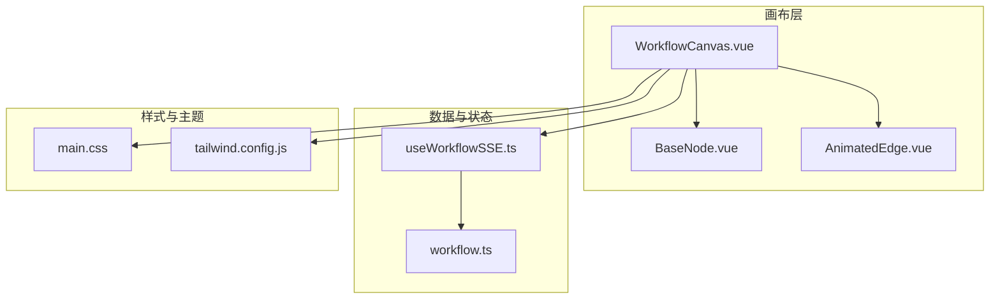
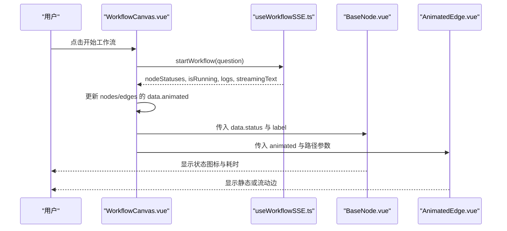
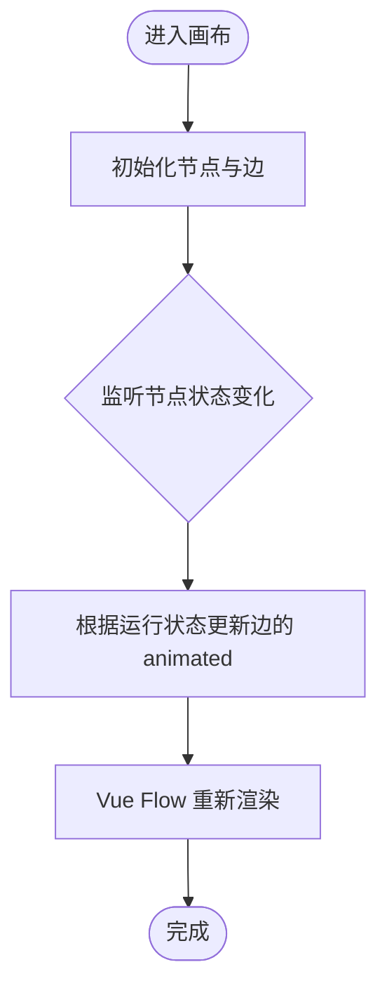
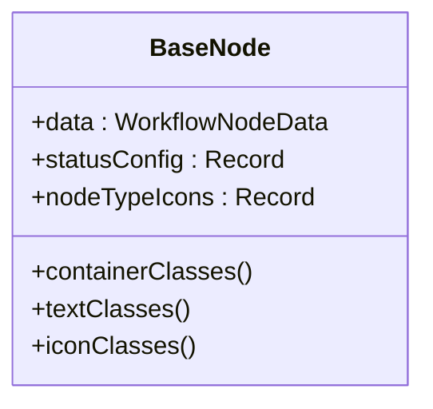
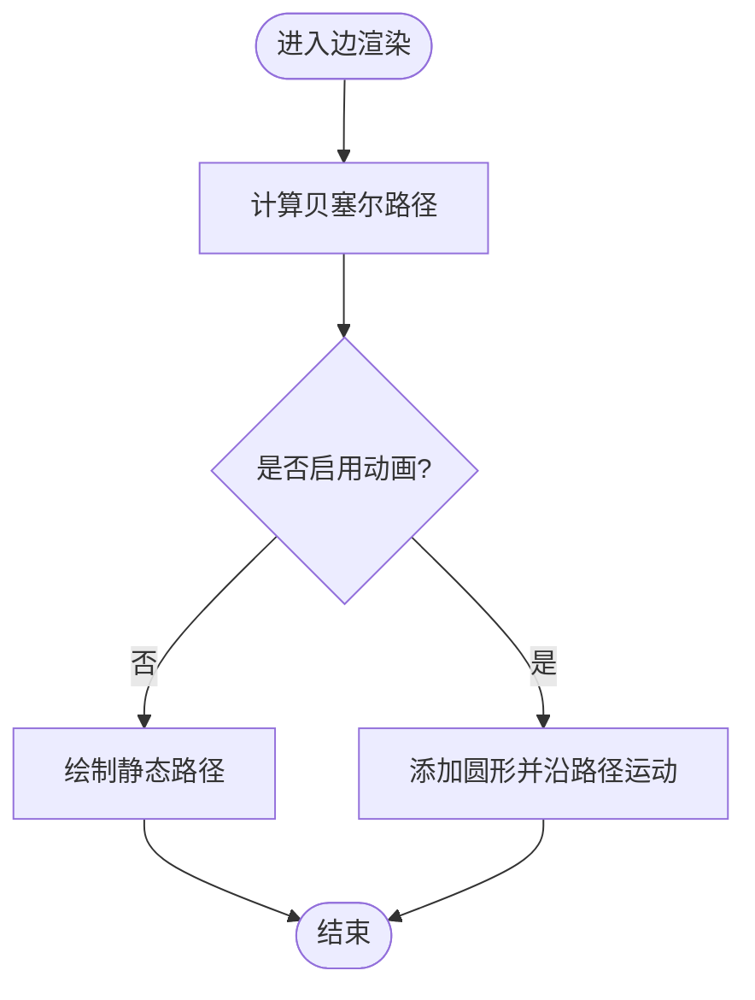
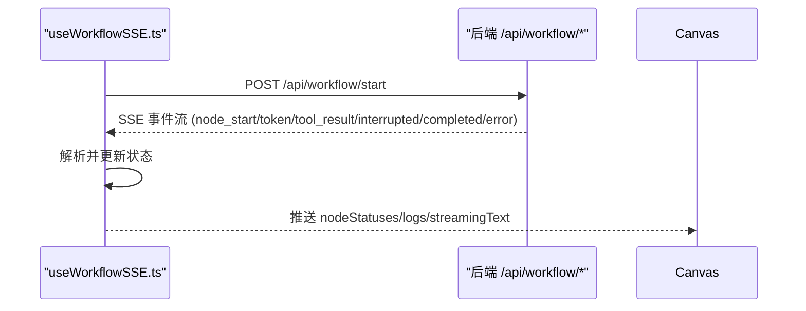
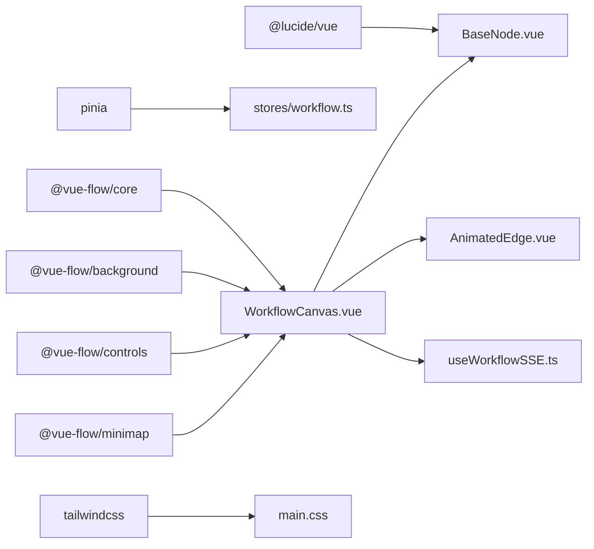

# 可视化集成

<cite>
**本文引用的文件**
- [WorkflowCanvas.vue](file://workflow-studio/frontend/src/components/WorkflowCanvas.vue)
- [AnimatedEdge.vue](file://workflow-studio/frontend/src/components/edges/AnimatedEdge.vue)
- [BaseNode.vue](file://workflow-studio/frontend/src/components/nodes/BaseNode.vue)
- [useWorkflowSSE.ts](file://workflow-studio/frontend/src/composables/useWorkflowSSE.ts)
- [workflow.ts](file://workflow-studio/frontend/src/types/workflow.ts)
- [main.css](file://workflow-studio/frontend/src/styles/main.css)
- [package.json](file://workflow-studio/frontend/package.json)
- [tailwind.config.js](file://workflow-studio/frontend/tailwind.config.js)
- [SidePanel.vue](file://workflow-studio/frontend/src/components/layout/SidePanel.vue)
</cite>

## 目录
1. [简介](#简介)
2. [项目结构](#项目结构)
3. [核心组件](#核心组件)
4. [架构总览](#架构总览)
5. [详细组件分析](#详细组件分析)
6. [依赖关系分析](#依赖关系分析)
7. [性能考量](#性能考量)
8. [故障排查指南](#故障排查指南)
9. [结论](#结论)
10. [附录：配置与扩展示例](#附录：配置与扩展示例)

## 简介
本文件面向 Workflow Studio 的可视化集成，聚焦于 Vue Flow 在前端工作流画布中的集成方式、自定义边组件 AnimatedEdge 的设计与动画实现、节点渲染机制、定位与交互响应、主题与样式系统、以及响应式设计与可扩展性。文档同时提供具体配置示例，展示如何扩展自定义节点样式、边类型和交互行为，帮助读者快速理解并二次开发。

## 项目结构
前端采用 Vue 3 + TypeScript + Tailwind CSS，使用 @vue-flow/core 及其插件（background、controls、minimap）构建可视化工作流画布。核心文件职责如下：
- WorkflowCanvas.vue：Vue Flow 画布容器，注册节点类型、初始化节点与边、监听 SSE 状态驱动 UI 更新。
- BaseNode.vue：自定义基础节点，封装不同状态的视觉表现与连接点。
- AnimatedEdge.vue：自定义边组件，支持贝塞尔曲线绘制与运动圆点动画。
- useWorkflowSSE.ts：处理后端 SSE 事件，驱动节点状态、日志与流式文本。
- workflow.ts：类型定义，包括节点状态、图结构等。
- main.css：全局样式与 Vue Flow 样式覆盖。
- tailwind.config.js：Tailwind 配置，控制扫描范围与主题扩展。
- package.json：依赖声明，包含 Vue Flow 相关包。

图表来源
- [WorkflowCanvas.vue:1-133](file://workflow-studio/frontend/src/components/WorkflowCanvas.vue#L1-L133)
- [BaseNode.vue:1-82](file://workflow-studio/frontend/src/components/nodes/BaseNode.vue#L1-L82)
- [AnimatedEdge.vue:1-48](file://workflow-studio/frontend/src/components/edges/AnimatedEdge.vue#L1-L48)
- [useWorkflowSSE.ts:1-172](file://workflow-studio/frontend/src/composables/useWorkflowSSE.ts#L1-L172)
- [workflow.ts:1-64](file://workflow-studio/frontend/src/types/workflow.ts#L1-L64)
- [main.css:1-36](file://workflow-studio/frontend/src/styles/main.css#L1-L36)
- [tailwind.config.js:1-12](file://workflow-studio/frontend/tailwind.config.js#L1-L12)

章节来源
- [WorkflowCanvas.vue:1-133](file://workflow-studio/frontend/src/components/WorkflowCanvas.vue#L1-L133)
- [package.json:1-32](file://workflow-studio/frontend/package.json#L1-L32)

## 核心组件
- 画布容器 WorkflowCanvas.vue：负责引入 Vue Flow、注册节点类型、初始化节点与边、注入背景网格、控件与小地图，并通过 watch 将 SSE 状态映射到节点与边的可视属性。
- 自定义节点 BaseNode.vue：基于 @vue-flow/core 的 Handle 提供上下连接点；根据节点状态动态切换边框、背景、文字颜色与图标；显示执行耗时。
- 自定义边 AnimatedEdge.vue：使用 getBezierPath 计算贝塞尔路径；当启用 animated 时，通过 animateMotion 沿路径移动圆点，形成“流动”效果；非动画状态下使用静态描边。
- SSE 组合式函数 useWorkflowSSE.ts：维护节点状态、运行标志、中断信息、流式文本与日志；解析后端 SSE 事件，更新状态并触发 UI 变化。

章节来源
- [WorkflowCanvas.vue:35-133](file://workflow-studio/frontend/src/components/WorkflowCanvas.vue#L35-L133)
- [BaseNode.vue:23-82](file://workflow-studio/frontend/src/components/nodes/BaseNode.vue#L23-L82)
- [AnimatedEdge.vue:16-48](file://workflow-studio/frontend/src/components/edges/AnimatedEdge.vue#L16-L48)
- [useWorkflowSSE.ts:1-172](file://workflow-studio/frontend/src/composables/useWorkflowSSE.ts#L1-L172)

## 架构总览
下图展示了从用户操作到画布渲染的数据流与组件交互：

图表来源
- [WorkflowCanvas.vue:85-127](file://workflow-studio/frontend/src/components/WorkflowCanvas.vue#L85-L127)
- [useWorkflowSSE.ts:74-114](file://workflow-studio/frontend/src/composables/useWorkflowSSE.ts#L74-L114)
- [BaseNode.vue:31-82](file://workflow-studio/frontend/src/components/nodes/BaseNode.vue#L31-L82)
- [AnimatedEdge.vue:16-48](file://workflow-studio/frontend/src/components/edges/AnimatedEdge.vue#L16-L48)

## 详细组件分析

### 画布与渲染机制（WorkflowCanvas.vue）
- 节点注册：通过 nodeTypes 将自定义节点类型 custom 映射到 BaseNode.vue。
- 初始布局：定义一组节点与边，节点位置以固定坐标呈现线性流程；边包含标签与样式，用于区分“通过/不通过”分支。
- 默认边选项：设置 type 为 default，animated 默认为 false。
- 状态驱动：watch nodeStatuses 与 isRunning，动态更新节点的 data.status 与边的 animated 属性，从而驱动 BaseNode 与 AnimatedEdge 的视觉变化。
- 交互：onNodeClick 记录选中节点 ID，供侧边面板展示详情。

图表来源
- [WorkflowCanvas.vue:50-83](file://workflow-studio/frontend/src/components/WorkflowCanvas.vue#L50-L83)
- [WorkflowCanvas.vue:95-127](file://workflow-studio/frontend/src/components/WorkflowCanvas.vue#L95-L127)

章节来源
- [WorkflowCanvas.vue:1-133](file://workflow-studio/frontend/src/components/WorkflowCanvas.vue#L1-L133)

### 自定义节点（BaseNode.vue）
- 连接点：顶部目标 Handle 与底部源 Handle，便于连线。
- 状态映射：根据 data.status 选择边框、背景、文字颜色与图标；running/waiting 状态附加动画类。
- 类型图标：根据 data.nodeType 映射不同图标。
- 耗时显示：当存在 startTime 与 endTime 时，计算并显示执行耗时。

图表来源
- [BaseNode.vue:23-82](file://workflow-studio/frontend/src/components/nodes/BaseNode.vue#L23-L82)

章节来源
- [BaseNode.vue:1-82](file://workflow-studio/frontend/src/components/nodes/BaseNode.vue#L1-L82)

### 自定义边与动画（AnimatedEdge.vue）
- 路径计算：使用 getBezierPath 计算贝塞尔路径，确保边在节点间平滑过渡。
- 动画实现：当 animated 为真时，添加一个圆形元素并使用 animateMotion 沿 path 无限循环移动，形成流动效果；duration 固定为 1.5s。
- 样式策略：非动画时使用灰色描边；动画时使用蓝色描边，并在 CSS 中通过 dasharray 与 keyframes 增强流动感。

图表来源
- [AnimatedEdge.vue:16-48](file://workflow-studio/frontend/src/components/edges/AnimatedEdge.vue#L16-L48)
- [main.css:17-36](file://workflow-studio/frontend/src/styles/main.css#L17-L36)

章节来源
- [AnimatedEdge.vue:1-48](file://workflow-studio/frontend/src/components/edges/AnimatedEdge.vue#L1-L48)
- [main.css:1-36](file://workflow-studio/frontend/src/styles/main.css#L1-L36)

### SSE 状态驱动（useWorkflowSSE.ts）
- 事件处理：node_start/node_end 更新节点状态；token 追加流式文本；tool_result 记录工具结果；interrupted 暂停并等待人工审核；completed/error 结束运行。
- 启动与审核：startWorkflow 发起请求并读取流式响应；submitReview 提交审核后继续执行。
- 状态暴露：返回 nodeStatuses、logs、isRunning、isInterrupted、streamingText 等供画布消费。

图表来源
- [useWorkflowSSE.ts:74-114](file://workflow-studio/frontend/src/composables/useWorkflowSSE.ts#L74-L114)
- [useWorkflowSSE.ts:116-157](file://workflow-studio/frontend/src/composables/useWorkflowSSE.ts#L116-L157)

章节来源
- [useWorkflowSSE.ts:1-172](file://workflow-studio/frontend/src/composables/useWorkflowSSE.ts#L1-L172)

### 类型与数据结构（workflow.ts）
- NodeStatus：idle、running、completed、error、waiting。
- NodeType：plan、search、analyze、write、review、revision、output。
- WorkflowNodeData：label、status、nodeType、输出与时间戳等扩展字段。
- GraphStructure：节点与边的结构定义，便于从后端加载图。

章节来源
- [workflow.ts:1-64](file://workflow-studio/frontend/src/types/workflow.ts#L1-L64)

## 依赖关系分析
- 运行时依赖：@vue-flow/core 及 background、controls、minimap 插件；Pinia 用于状态管理；Lucide 图标库；clsx 与 tailwind-merge 辅助样式合并。
- 样式依赖：Tailwind CSS 作为原子化样式框架；main.css 覆盖 Vue Flow 默认样式，增加节点可点击与边动画效果。
- 组件耦合：WorkflowCanvas 依赖 BaseNode 与 AnimatedEdge；SSE 组合式函数被画布消费；类型定义贯穿各组件。

图表来源
- [package.json:11-21](file://workflow-studio/frontend/package.json#L11-L21)
- [WorkflowCanvas.vue:35-48](file://workflow-studio/frontend/src/components/WorkflowCanvas.vue#L35-L48)
- [BaseNode.vue:23-31](file://workflow-studio/frontend/src/components/nodes/BaseNode.vue#L23-L31)
- [main.css:17-36](file://workflow-studio/frontend/src/styles/main.css#L17-L36)

章节来源
- [package.json:1-32](file://workflow-studio/frontend/package.json#L1-L32)
- [tailwind.config.js:1-12](file://workflow-studio/frontend/tailwind.config.js#L1-L12)

## 性能考量
- 动画性能：AnimatedEdge 使用 SVG animateMotion 沿路径移动圆点，避免复杂 DOM 操作；建议限制同时动画的边数量，避免过多重绘。
- 渲染优化：Vue Flow 内部对节点与边进行增量更新；通过 watch 仅变更必要属性（如 data.status、edge.animated），减少不必要的重渲染。
- 样式开销：Tailwind 按需生成样式；CSS 动画使用 stroke-dashoffset 与 keyframes，GPU 友好。
- 大数据集：若节点/边数量较大，建议分页加载或使用虚拟滚动；考虑将复杂节点内容懒加载。

[本节为通用性能指导，无需特定文件引用]

## 故障排查指南
- 边无动画：检查 edges 的 animated 属性是否正确设置；确认 isRunning 与上游节点状态为 running/completed；查看 main.css 中 .vue-flow__edge.animated 是否生效。
- 节点状态不更新：确认 useWorkflowSSE.ts 的事件处理逻辑是否被调用；检查后端 SSE 事件格式是否符合 SSEEvent 类型定义。
- 样式未生效：确认 Tailwind 扫描路径包含所有 Vue/TS 文件；检查 main.css 中 Vue Flow 类名是否被正确覆盖。
- 连接点不可见：BaseNode.vue 中 Handle 的位置与样式需确保可见；检查父容器尺寸与 z-index。

章节来源
- [useWorkflowSSE.ts:19-72](file://workflow-studio/frontend/src/composables/useWorkflowSSE.ts#L19-L72)
- [main.css:17-36](file://workflow-studio/frontend/src/styles/main.css#L17-L36)
- [BaseNode.vue:1-21](file://workflow-studio/frontend/src/components/nodes/BaseNode.vue#L1-L21)

## 结论
本项目通过 Vue Flow 实现了可视化工作流画布，结合自定义节点与边组件，提供了丰富的状态反馈与动画效果。SSE 驱动的实时状态更新使画布能够直观反映后端执行过程。通过 Tailwind 与 CSS 覆盖，实现了主题定制与响应式体验。整体架构清晰、扩展性强，适合进一步扩展更多节点类型与交互行为。

[本节为总结性内容，无需特定文件引用]

## 附录：配置与扩展示例

### 扩展自定义节点样式
- 在 BaseNode.vue 的状态映射中添加新的 NodeStatus，并定义对应的边框、背景、文字颜色与图标。
- 如需新增节点类型，可在 nodeTypeIcons 中添加映射，并在 WorkflowCanvas.vue 的 initialNodes 中声明新节点。

章节来源
- [BaseNode.vue:33-61](file://workflow-studio/frontend/src/components/nodes/BaseNode.vue#L33-L61)
- [WorkflowCanvas.vue:56-64](file://workflow-studio/frontend/src/components/WorkflowCanvas.vue#L56-L64)

### 扩展自定义边类型
- 在 WorkflowCanvas.vue 的 nodeTypes 或 edgeTypes 中注册新的边类型组件。
- 在 AnimatedEdge.vue 基础上，可通过 props 传递更多样式与行为参数（如虚线、箭头方向）。
- 在 defaultEdgeOptions 中设置默认边类型与动画开关。

章节来源
- [WorkflowCanvas.vue:76-79](file://workflow-studio/frontend/src/components/WorkflowCanvas.vue#L76-L79)
- [AnimatedEdge.vue:16-48](file://workflow-studio/frontend/src/components/edges/AnimatedEdge.vue#L16-L48)

### 调整主题与样式系统
- 在 main.css 中覆盖 Vue Flow 的默认样式，例如节点可点击、边描边宽度与动画效果。
- 在 tailwind.config.js 中扩展主题色或字体，确保与业务品牌一致。
- 使用 clsx 与 Tailwind 类名组合，实现条件样式与响应式布局。

章节来源
- [main.css:17-36](file://workflow-studio/frontend/src/styles/main.css#L17-L36)
- [tailwind.config.js:1-12](file://workflow-studio/frontend/tailwind.config.js#L1-L12)
- [BaseNode.vue:63-80](file://workflow-studio/frontend/src/components/nodes/BaseNode.vue#L63-L80)

### 响应式设计
- 画布容器使用 flex 布局，左侧画布自适应宽度，右侧面板固定宽度；在小屏设备上可通过媒体查询调整布局。
- 节点最小宽度与间距通过 Tailwind 类名控制，保证在不同屏幕下的可读性。

章节来源
- [WorkflowCanvas.vue:1-33](file://workflow-studio/frontend/src/components/WorkflowCanvas.vue#L1-L33)
- [BaseNode.vue:63-68](file://workflow-studio/frontend/src/components/nodes/BaseNode.vue#L63-L68)

### 交互行为扩展
- 在 WorkflowCanvas.vue 中监听更多事件（如节点拖拽、边创建/删除），并同步到状态或后端。
- 在 SidePanel.vue 中集成更多控制面板（如批量操作、导出图结构）。

章节来源
- [WorkflowCanvas.vue:129-131](file://workflow-studio/frontend/src/components/WorkflowCanvas.vue#L129-L131)
- [SidePanel.vue:1-39](file://workflow-studio/frontend/src/components/layout/SidePanel.vue#L1-L39)