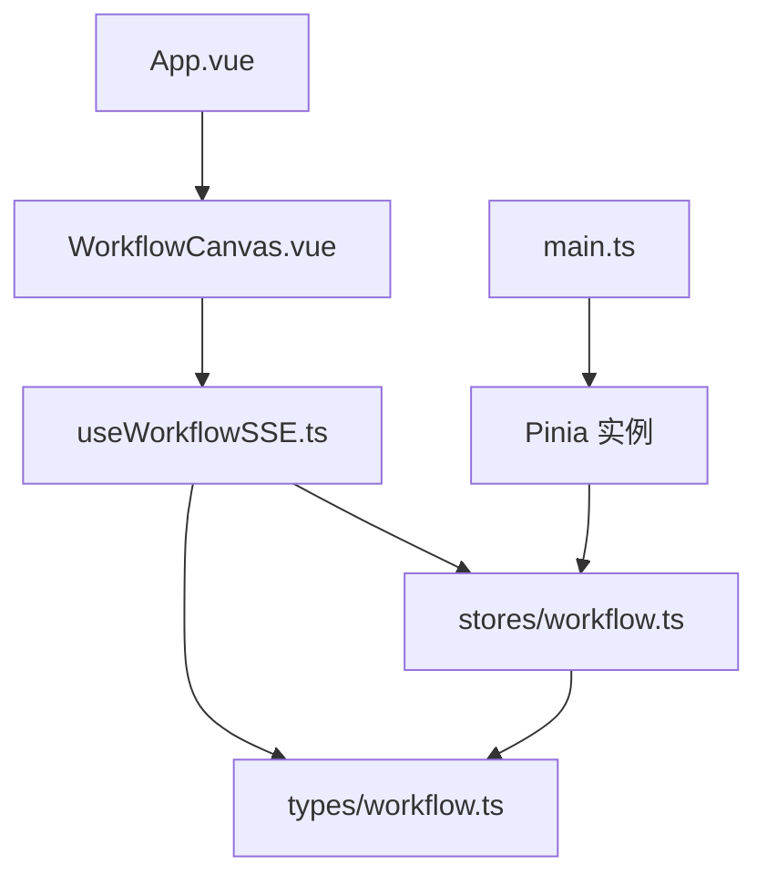
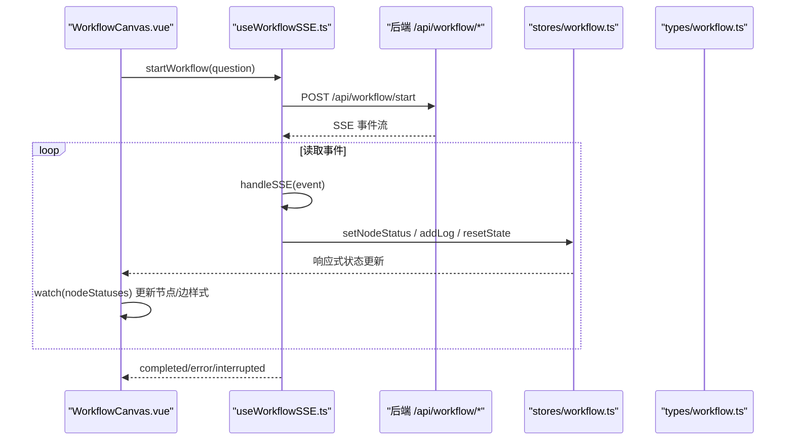
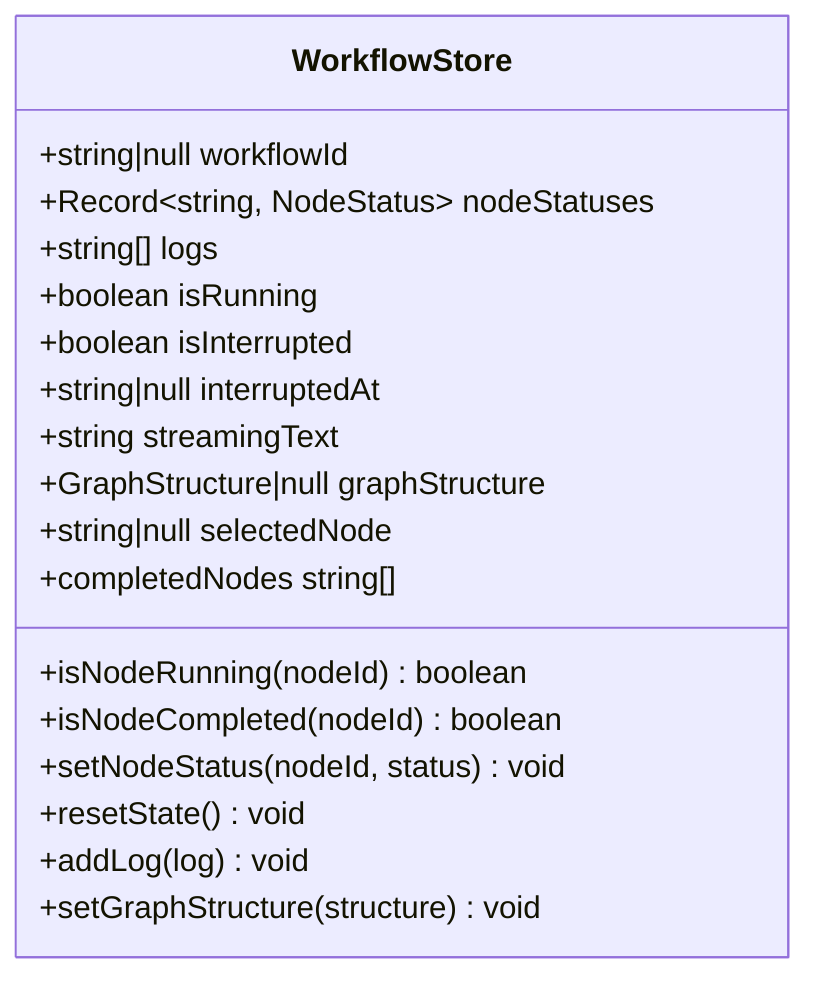
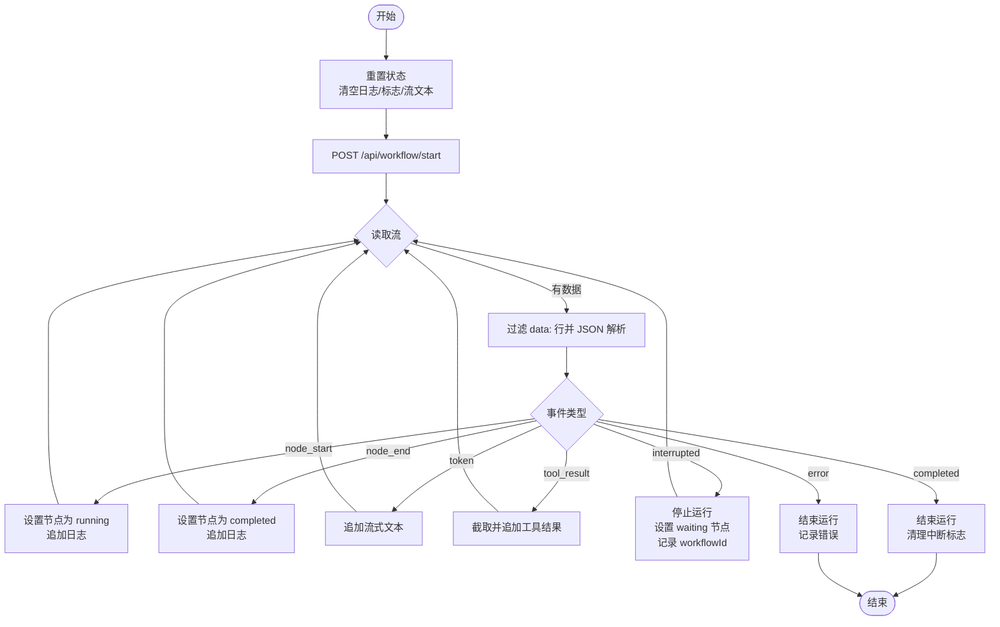
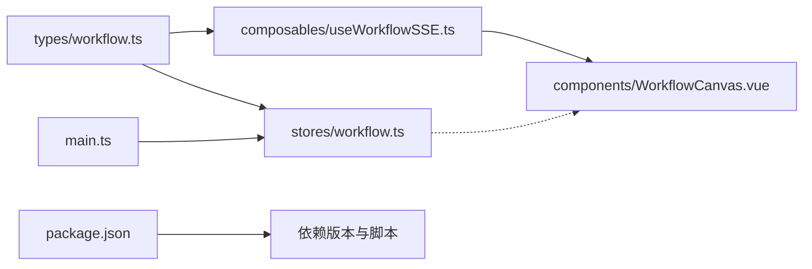

# 状态管理

<cite>
**本文引用的文件**
- [workflow.ts](file://workflow-studio/frontend/src/stores/workflow.ts)
- [workflow.ts（类型定义）](file://workflow-studio/frontend/src/types/workflow.ts)
- [useWorkflowSSE.ts](file://workflow-studio/frontend/src/composables/useWorkflowSSE.ts)
- [main.ts](file://workflow-studio/frontend/src/main.ts)
- [package.json](file://workflow-studio/frontend/package.json)
- [WorkflowCanvas.vue](file://workflow-studio/frontend/src/components/WorkflowCanvas.vue)
</cite>

## 目录
1. [简介](#简介)
2. [项目结构](#项目结构)
3. [核心组件](#核心组件)
4. [架构总览](#架构总览)
5. [详细组件分析](#详细组件分析)
6. [依赖关系分析](#依赖关系分析)
7. [性能考虑](#性能考虑)
8. [故障排查指南](#故障排查指南)
9. [结论](#结论)
10. [附录：使用示例与最佳实践](#附录使用示例与最佳实践)

## 简介
本文件为 Workflow Studio 前端的状态管理系统提供系统化文档，重点围绕基于 Pinia 的 workflow store、TypeScript 类型定义、响应式数据更新、状态持久化策略、错误处理机制、状态同步策略、性能优化技巧与调试方法展开。同时给出在组件中访问和更新工作流状态的具体示例路径，帮助开发者快速上手并深入理解系统设计与实现细节。

## 项目结构
前端采用 Vue 3 + TypeScript + Vite 构建，状态管理使用 Pinia，工作流执行通过 SSE 实时推送事件驱动 UI 更新。关键目录与职责如下：
- stores/workflow.ts：Pinia store，集中管理工作流运行期状态与派生计算属性
- types/workflow.ts：统一类型定义，包括节点状态、图结构、SSE 事件等
- composables/useWorkflowSSE.ts：组合式函数，封装 SSE 连接、事件解析与状态变更逻辑
- components/WorkflowCanvas.vue：画布与侧边栏容器，订阅状态变化并驱动视图渲染
- main.ts：应用入口，创建并挂载 Pinia 实例
- package.json：依赖声明，包含 Vue、Pinia、Vue Flow 等

图表来源
- [WorkflowCanvas.vue:35-93](file://workflow-studio/frontend/src/components/WorkflowCanvas.vue#L35-L93)
- [useWorkflowSSE.ts:1-172](file://workflow-studio/frontend/src/composables/useWorkflowSSE.ts#L1-L172)
- [workflow.ts（store）:1-75](file://workflow-studio/frontend/src/stores/workflow.ts#L1-L75)
- [workflow.ts（类型定义）:1-64](file://workflow-studio/frontend/src/types/workflow.ts#L1-L64)
- [main.ts:1-11](file://workflow-studio/frontend/src/main.ts#L1-L11)

章节来源
- [main.ts:1-11](file://workflow-studio/frontend/src/main.ts#L1-L11)
- [package.json:1-32](file://workflow-studio/frontend/package.json#L1-L32)

## 核心组件
- Pinia Store（workflow store）
  - 职责：集中存储工作流运行期状态（节点状态、日志、运行标志、中断信息、流式文本、图结构、选中节点），并提供派生计算属性与 Actions 用于状态变更
  - 关键点：使用 ref 定义响应式状态；computed 提供只读派生数据；Actions 以不可变方式更新对象或数组，确保响应式追踪正确
- 组合式函数（useWorkflowSSE）
  - 职责：维护本地运行态、发起 SSE 请求、解析事件流、根据事件类型更新状态、处理审核提交流程
  - 关键点：将 SSE 事件映射到状态变更；对 token 流式输出进行追加；对中断与完成事件设置相应标志；错误时记录日志并重置运行标志
- 类型定义（types/workflow.ts）
  - 职责：统一定义 NodeStatus、NodeType、WorkflowNodeData、SSEEvent、GraphStructure 等类型，保证全链路类型安全
  - 关键点：严格枚举与联合类型约束，便于 IDE 提示与编译期检查

章节来源
- [workflow.ts（store）:1-75](file://workflow-studio/frontend/src/stores/workflow.ts#L1-L75)
- [useWorkflowSSE.ts:1-172](file://workflow-studio/frontend/src/composables/useWorkflowSSE.ts#L1-L172)
- [workflow.ts（类型定义）:1-64](file://workflow-studio/frontend/src/types/workflow.ts#L1-L64)

## 架构总览
整体数据流遵循“事件驱动 + 响应式更新”的模式：
- 组件触发操作（如启动工作流、提交审核）
- 组合式函数发起网络请求并建立 SSE 连接
- SSE 事件被解析后更新本地状态（nodeStatuses、logs、isRunning 等）
- 组件通过 watch 监听状态变化，驱动 Vue Flow 节点与边的可视化更新
- Pinia store 作为全局状态中心，可被任意组件共享与消费

图表来源
- [WorkflowCanvas.vue:85-127](file://workflow-studio/frontend/src/components/WorkflowCanvas.vue#L85-L127)
- [useWorkflowSSE.ts:74-114](file://workflow-studio/frontend/src/composables/useWorkflowSSE.ts#L74-L114)
- [useWorkflowSSE.ts:19-72](file://workflow-studio/frontend/src/composables/useWorkflowSSE.ts#L19-L72)
- [workflow.ts（store）:33-54](file://workflow-studio/frontend/src/stores/workflow.ts#L33-L54)
- [workflow.ts（类型定义）:22-32](file://workflow-studio/frontend/src/types/workflow.ts#L22-L32)

## 详细组件分析

### Pinia Store（workflow store）
- 状态设计
  - 基础状态：workflowId、nodeStatuses、logs、isRunning、isInterrupted、interruptedAt、streamingText、graphStructure、selectedNode
  - 派生状态：isNodeRunning、isNodeCompleted、completedNodes（基于 nodeStatuses 的计算结果）
- 响应式更新
  - 使用 ref 包裹状态，保证响应式追踪
  - 更新 nodeStatuses 时采用浅拷贝新对象，避免直接修改导致响应式丢失
  - logs 追加采用新数组，确保 Vue 能检测到变更
- Actions
  - setNodeStatus：按 nodeId 设置节点状态
  - resetState：一键重置所有运行期状态
  - addLog：追加日志
  - setGraphStructure：设置从后端获取的图结构
- 复杂度与性能
  - nodeStatuses 为 Record<string, NodeStatus>，查找 O(1)，适合高频更新
  - completedNodes 每次计算遍历 nodeStatuses，时间复杂度 O(n)，n 为节点数；若节点规模较大，可考虑缓存或增量更新
- 错误处理
  - 当前 store 未直接捕获异常，建议在调用方（如 useWorkflowSSE）统一处理错误并记录日志

图表来源
- [workflow.ts（store）:5-73](file://workflow-studio/frontend/src/stores/workflow.ts#L5-L73)
- [workflow.ts（类型定义）:3-18](file://workflow-studio/frontend/src/types/workflow.ts#L3-L18)
- [workflow.ts（类型定义）:45-63](file://workflow-studio/frontend/src/types/workflow.ts#L45-L63)

章节来源
- [workflow.ts（store）:5-73](file://workflow-studio/frontend/src/stores/workflow.ts#L5-L73)

### 组合式函数（useWorkflowSSE）
- 职责
  - 维护本地运行态（nodeStatuses、logs、isRunning、isInterrupted、interruptedAt、streamingText、workflowId）
  - 解析 SSE 事件并更新状态
  - 启动工作流与提交审核的网络交互
- 事件处理
  - node_start：节点进入 running，追加日志
  - node_end：节点标记 completed，追加日志
  - token：追加流式文本内容
  - tool_result：截取工具结果片段追加日志
  - interrupted：暂停运行，设置等待节点状态，记录 workflowId
  - completed：结束运行，清理中断标志
  - error：结束运行，记录错误信息
- 网络与错误处理
  - 使用 fetch 发起请求，读取 response.body 的 ReadableStream
  - 逐行过滤 data: 前缀，JSON 解析失败时忽略并继续
  - 捕获异常并记录日志，重置 isRunning
- 性能考量
  - 流式文本追加为字符串拼接，频繁更新可能带来重绘开销；建议结合虚拟滚动或节流策略
  - 日志数组持续增长，需考虑分页或限制长度以避免内存压力

图表来源
- [useWorkflowSSE.ts:74-114](file://workflow-studio/frontend/src/composables/useWorkflowSSE.ts#L74-L114)
- [useWorkflowSSE.ts:19-72](file://workflow-studio/frontend/src/composables/useWorkflowSSE.ts#L19-L72)

章节来源
- [useWorkflowSSE.ts:1-172](file://workflow-studio/frontend/src/composables/useWorkflowSSE.ts#L1-L172)

### 类型定义（types/workflow.ts）
- 节点状态与类型
  - NodeStatus：idle | running | completed | error | waiting
  - NodeType：plan | search | analyze | write | review | revision | output
- 节点数据结构
  - WorkflowNodeData：label、status、nodeType、output、startTime、endTime 及扩展字段
  - WorkflowNode：基于 @vue-flow/core 的 Node 泛型，承载自定义数据
- SSE 事件
  - SSEEvent：type、node、content、output、data、at、message、workflow_id
- 图结构
  - GraphStructureNode/Edge：描述节点位置与边关系
  - GraphStructure：nodes 与 edges 集合

章节来源
- [workflow.ts（类型定义）:1-64](file://workflow-studio/frontend/src/types/workflow.ts#L1-L64)

### 组件集成（WorkflowCanvas.vue）
- 状态订阅
  - 通过 useWorkflowSSE 获取 nodeStatuses、isRunning、isInterrupted、streamingText、logs 等
  - 使用 watch 深度监听 nodeStatuses，动态更新节点 data.status 与边的 animated 状态
- 用户交互
  - onNodeClick：选择节点，传递 selectedNodeId 给侧边面板
- 性能优化
  - 仅当 isRunning 且源节点处于 running/completed 时启用边动画，减少不必要的重绘
  - 使用 markRaw 注册自定义节点类型，避免 Vue 代理带来的额外开销

章节来源
- [WorkflowCanvas.vue:35-133](file://workflow-studio/frontend/src/components/WorkflowCanvas.vue#L35-L133)

## 依赖关系分析
- 运行时依赖
  - Vue 3 与 Pinia：提供响应式框架与状态管理
  - @vue-flow/core 及其插件：可视化流程图
  - Tailwind CSS：样式体系
- 模块耦合
  - WorkflowCanvas.vue 依赖 useWorkflowSSE 提供的状态与方法
  - useWorkflowSSE 依赖 types/workflow.ts 的类型约束
  - stores/workflow.ts 同样依赖 types/workflow.ts
  - main.ts 初始化 Pinia 并注入应用

图表来源
- [workflow.ts（类型定义）:1-64](file://workflow-studio/frontend/src/types/workflow.ts#L1-L64)
- [workflow.ts（store）:1-75](file://workflow-studio/frontend/src/stores/workflow.ts#L1-L75)
- [useWorkflowSSE.ts:1-172](file://workflow-studio/frontend/src/composables/useWorkflowSSE.ts#L1-L172)
- [WorkflowCanvas.vue:35-93](file://workflow-studio/frontend/src/components/WorkflowCanvas.vue#L35-L93)
- [main.ts:1-11](file://workflow-studio/frontend/src/main.ts#L1-L11)
- [package.json:1-32](file://workflow-studio/frontend/package.json#L1-L32)

章节来源
- [package.json:1-32](file://workflow-studio/frontend/package.json#L1-L32)

## 性能考虑
- 响应式更新粒度
  - nodeStatuses 为对象键值映射，单点更新成本低；但 completedNodes 每次遍历全部节点，建议在大图场景下引入增量计算或缓存
- 流式文本渲染
  - streamingText 频繁拼接可能导致重排；建议结合虚拟滚动、分片渲染或节流更新
- 日志增长控制
  - logs 数组无限增长会占用内存；建议限制最大长度或分页加载历史日志
- 边动画优化
  - 仅在 isRunning 且源节点状态满足条件时启用动画，减少无效更新
- 序列化与持久化
  - 当前未实现持久化；如需跨会话恢复，可将关键状态（如 nodeStatuses、logs、workflowId）序列化至 localStorage 或 IndexedDB，并在应用启动时恢复

[本节为通用性能指导，不直接分析具体文件]

## 故障排查指南
- SSE 事件解析失败
  - 现象：控制台无日志或状态不更新
  - 排查：确认后端返回格式是否以 data: 开头且为合法 JSON；检查 useWorkflowSSE 中的 try/catch 分支
- 工作流无法结束
  - 现象：isRunning 始终为 true
  - 排查：检查 completed/error 事件是否正确到达；确认 handleSSE 分支逻辑
- 节点状态不同步
  - 现象：UI 显示与实际不一致
  - 排查：确认 watch(nodeStatuses) 是否触发；检查节点 id 是否与后端一致
- 流式文本卡顿
  - 现象：界面响应缓慢
  - 排查：评估 streamingText 更新频率；考虑节流或虚拟滚动

章节来源
- [useWorkflowSSE.ts:19-72](file://workflow-studio/frontend/src/composables/useWorkflowSSE.ts#L19-L72)
- [useWorkflowSSE.ts:74-114](file://workflow-studio/frontend/src/composables/useWorkflowSSE.ts#L74-L114)
- [WorkflowCanvas.vue:95-127](file://workflow-studio/frontend/src/components/WorkflowCanvas.vue#L95-L127)

## 结论
本项目采用 Pinia 作为全局状态中心，结合组合式函数封装 SSE 事件流，形成清晰的事件驱动状态管理机制。类型定义贯穿前后端契约，保障类型安全与可维护性。通过合理的响应式更新策略与性能优化手段，实现了流畅的工作流可视化体验。未来可在持久化、日志管理与大图谱渲染方面进一步增强。

[本节为总结性内容，不直接分析具体文件]

## 附录：使用示例与最佳实践

- 在组件中访问工作流状态
  - 通过 useWorkflowSSE 获取 nodeStatuses、isRunning、isInterrupted、streamingText、logs 等，并在模板中绑定展示
  - 参考路径：[WorkflowCanvas.vue:85-93](file://workflow-studio/frontend/src/components/WorkflowCanvas.vue#L85-L93)
- 在组件中更新工作流状态
  - 调用 useWorkflowSSE 暴露的方法 startWorkflow(question) 启动工作流
  - 调用 submitReview(status, feedback) 提交审核并继续执行
  - 参考路径：[useWorkflowSSE.ts:74-114](file://workflow-studio/frontend/src/composables/useWorkflowSSE.ts#L74-L114)、[useWorkflowSSE.ts:116-157](file://workflow-studio/frontend/src/composables/useWorkflowSSE.ts#L116-L157)
- 在组件中监听状态变化
  - 使用 watch 深度监听 nodeStatuses，动态更新节点与边的可视化状态
  - 参考路径：[WorkflowCanvas.vue:95-127](file://workflow-studio/frontend/src/components/WorkflowCanvas.vue#L95-L127)
- 在 store 中集中管理状态
  - 使用 defineStore 定义 workflow store，提供 setNodeStatus、resetState、addLog、setGraphStructure 等方法
  - 参考路径：[workflow.ts（store）:33-54](file://workflow-studio/frontend/src/stores/workflow.ts#L33-L54)
- 类型定义最佳实践
  - 使用联合类型与接口约束事件与数据结构，确保编译期类型检查
  - 参考路径：[workflow.ts（类型定义）:3-32](file://workflow-studio/frontend/src/types/workflow.ts#L3-L32)、[workflow.ts（类型定义）:45-63](file://workflow-studio/frontend/src/types/workflow.ts#L45-L63)
- 状态持久化策略（建议）
  - 将关键状态序列化为 JSON，存入 localStorage 或 IndexedDB
  - 应用启动时恢复状态，保持用户体验连续性
  - 注意敏感信息脱敏与容量限制
- 调试方法
  - 在浏览器 DevTools 中查看 Pinia 状态树与组件响应式数据
  - 在 useWorkflowSSE 中添加 console.log 或断点，跟踪事件流与状态变更
  - 使用 Vue Devtools 观察组件 props 与 watch 触发时机

章节来源
- [WorkflowCanvas.vue:85-127](file://workflow-studio/frontend/src/components/WorkflowCanvas.vue#L85-L127)
- [useWorkflowSSE.ts:74-157](file://workflow-studio/frontend/src/composables/useWorkflowSSE.ts#L74-L157)
- [workflow.ts（store）:33-54](file://workflow-studio/frontend/src/stores/workflow.ts#L33-L54)
- [workflow.ts（类型定义）:3-32](file://workflow-studio/frontend/src/types/workflow.ts#L3-L32)
- [workflow.ts（类型定义）:45-63](file://workflow-studio/frontend/src/types/workflow.ts#L45-L63)