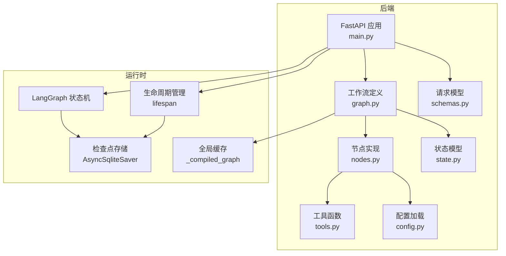
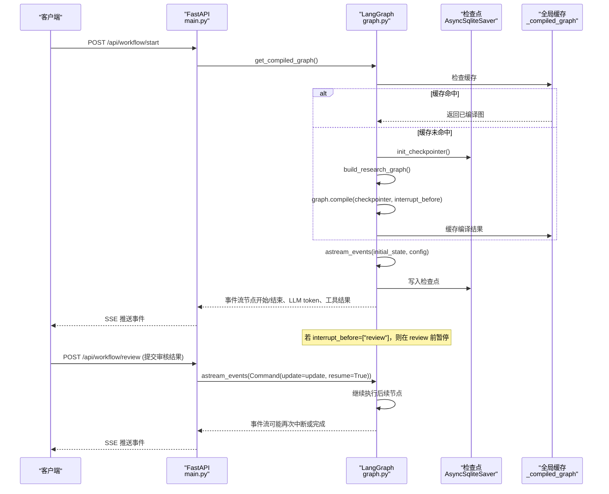
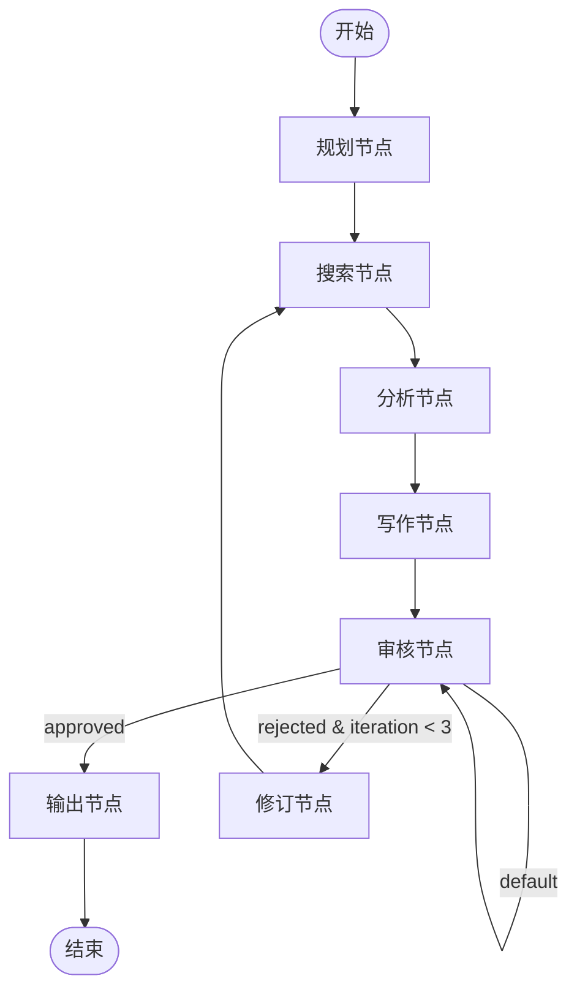
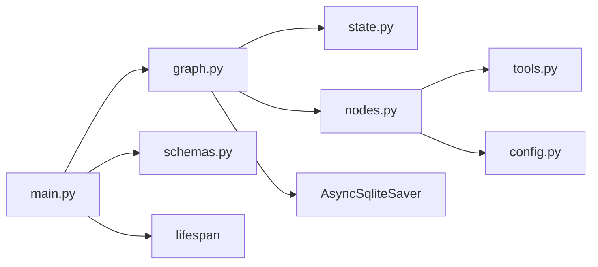

# LangGraph 工作流引擎

<cite>
**本文引用的文件**
- [graph.py](file://workflow-studio/backend/app/graph.py)
- [nodes.py](file://workflow-studio/backend/app/nodes.py)
- [state.py](file://workflow-studio/backend/app/state.py)
- [main.py](file://workflow-studio/backend/app/main.py)
- [tools.py](file://workflow-studio/backend/app/tools.py)
- [config.py](file://workflow-studio/backend/app/config.py)
- [schemas.py](file://workflow-studio/backend/app/schemas.py)
- [README.md](file://workflow-studio/README.md)
</cite>

## 更新摘要
**所做更改**
- 增强了图编译机制，引入懒初始化和缓存策略
- 改进了检查点集成，采用全局实例管理
- 优化了 get_compiled_graph() 的错误处理逻辑
- 更新了应用生命周期管理，确保资源正确初始化与清理

## 目录
1. [简介](#简介)
2. [项目结构](#项目结构)
3. [核心组件](#核心组件)
4. [架构总览](#架构总览)
5. [详细组件分析](#详细组件分析)
6. [依赖关系分析](#依赖关系分析)
7. [性能考量](#性能考量)
8. [故障排查指南](#故障排查指南)
9. [结论](#结论)
10. [附录](#附录)

## 简介
本技术文档围绕基于 LangGraph 的工作流引擎，系统阐述 StateGraph 的构建过程、节点注册机制、边连接与条件路由逻辑；深入解析审核后的条件路由函数 route_after_review 的状态判断与循环控制；说明工作流图的编译流程、检查点持久化配置与中断点设置；并总结 START/END 节点使用模式、条件边定义方式与循环边处理策略。同时提供工作流图构建的最佳实践与扩展指南，帮助读者在现有研究助手工作流基础上进行二次开发与优化。

## 项目结构
后端采用 FastAPI 作为 Web 框架，LangGraph 负责有状态多 Agent 工作流编排，SQLite 检查点用于状态持久化，SSE（Server-Sent Events）实现前端实时事件推送。前端通过 Vue Flow 可视化渲染执行状态。

**图表来源**
- [main.py:16-41](file://workflow-studio/backend/app/main.py#L16-L41)
- [graph.py:10-105](file://workflow-studio/backend/app/graph.py#L10-L105)
- [nodes.py:18-129](file://workflow-studio/backend/app/nodes.py#L18-L129)
- [state.py:5-30](file://workflow-studio/backend/app/state.py#L5-L30)
- [tools.py:4-26](file://workflow-studio/backend/app/tools.py#L4-L26)
- [config.py:1-9](file://workflow-studio/backend/app/config.py#L1-L9)
- [schemas.py:4-12](file://workflow-studio/backend/app/schemas.py#L4-L12)

**章节来源**
- [README.md:15-21](file://workflow-studio/README.md#L15-L21)
- [main.py:16-41](file://workflow-studio/backend/app/main.py#L16-L41)

## 核心组件
- 状态模型 ResearchState：定义工作流中所有字段，包括消息历史、当前步骤、迭代计数、研究内容、人工审核相关字段及元数据。
- 节点集合：plan_node、search_node、analyze_node、write_node、review_node、output_node、revision_node，分别承担规划、搜索、分析、写作、审核、输出与修订职责。
- 条件路由：route_after_review 根据审核状态与迭代次数决定下一步走向。
- **增强型图编译**：get_compiled_graph 实现懒初始化、全局缓存和错误处理的图编译机制。
- **全局检查点管理**：init_checkpointer 和 cleanup_checkpointer 提供异步检查点器的生命周期管理。
- API 层：start_workflow、submit_review、get_workflow_state、get_graph_structure 暴露工作流启动、恢复、状态查询与图结构能力。

**章节来源**
- [state.py:5-30](file://workflow-studio/backend/app/state.py#L5-L30)
- [nodes.py:18-129](file://workflow-studio/backend/app/nodes.py#L18-L129)
- [graph.py:10-105](file://workflow-studio/backend/app/graph.py#L10-L105)
- [main.py:16-210](file://workflow-studio/backend/app/main.py#L16-L210)

## 架构总览
整体流程从用户提问开始，依次经过规划、搜索、分析、写作、审核，随后依据审核结果进行条件分支：通过则输出最终报告；不通过则进入修订并回到搜索，形成循环，直至达到最大迭代次数或审核通过。

**图表来源**
- [main.py:16-210](file://workflow-studio/backend/app/main.py#L16-L210)
- [graph.py:10-105](file://workflow-studio/backend/app/graph.py#L10-L105)
- [nodes.py:18-129](file://workflow-studio/backend/app/nodes.py#L18-L129)

## 详细组件分析

### StateGraph 构建与节点注册
- 创建 StateGraph(ResearchState)：以 TypedDict 定义的 ResearchState 作为状态容器，确保类型安全与字段一致性。
- 节点注册：add_node 将每个业务节点函数映射到图节点名，如 plan、search、analyze、write、review、output、revision。
- 线性边：add_edge 建立顺序执行的边，如 START→plan→search→analyze→write→review。
- 条件边：add_conditional_edges 为 review 节点添加条件路由，调用 route_after_review 并根据返回值选择下一节点。
- 循环边：add_edge("revision", "search") 实现修订后回到搜索的循环路径。
- 结束边：add_edge("output", END) 表示输出完成后终止。

**章节来源**
- [graph.py:28-67](file://workflow-studio/backend/app/graph.py#L28-L67)
- [state.py:5-30](file://workflow-studio/backend/app/state.py#L5-L30)

### 条件路由函数 route_after_review
- 输入：当前状态 ResearchState。
- 判断逻辑：
  - 若 review_status == "approved"，返回 "output"，进入输出节点。
  - 若 review_status == "rejected"：
    - 若 iteration_count >= 3，返回 "output"，强制结束以避免无限循环。
    - 否则返回 "revision"，进入修订节点，再回到搜索。
  - 默认返回 "review"，保持等待（通常由外部中断或上游逻辑控制）。
- 循环控制：通过 iteration_count 递增与阈值判断，确保最多 3 轮修订后强制输出。

**章节来源**
- [graph.py:16-26](file://workflow-studio/backend/app/graph.py#L16-L26)
- [nodes.py:121-129](file://workflow-studio/backend/app/nodes.py#L121-L129)

### 增强型图编译机制与检查点管理

**新增功能** 引入了增强的图编译机制，包含懒初始化、全局缓存和健壮的异常处理：

#### 全局状态管理
- `_checkpointer`：全局检查点器实例，避免重复创建开销
- `_checkpointer_ctx`：检查点上下文管理器，用于资源清理
- `_compiled_graph`：编译后的图实例缓存，提升性能

#### 懒初始化策略
- `get_compiled_graph()` 首次调用时自动初始化检查点器
- 支持按需加载，减少应用启动时间
- 线程安全的单例模式实现

#### 生命周期管理
- `init_checkpointer()`：异步初始化 SQLite 检查点器
- `cleanup_checkpointer()`：优雅关闭检查点器，释放资源
- 集成到 FastAPI lifespan，确保应用启动时初始化，关闭时清理

#### 错误处理增强
- 检查点器初始化失败时的降级处理
- 编译过程中的异常捕获与日志记录
- 资源泄漏防护，确保即使发生异常也能正确清理

**章节来源**
- [graph.py:10-105](file://workflow-studio/backend/app/graph.py#L10-L105)
- [main.py:16-41](file://workflow-studio/backend/app/main.py#L16-L41)

### START/END 节点的使用模式
- START：作为工作流入口，add_edge(START, "plan") 将初始状态传入规划节点。
- END：作为工作流出口，add_edge("output", END) 表示输出完成后终止执行。
- 使用场景：适用于明确起点与终点的有向无环图（DAG）或有环工作流，便于统一管理与可视化。

**章节来源**
- [graph.py:44-65](file://workflow-studio/backend/app/graph.py#L44-L65)

### 条件边的定义方式
- add_conditional_edges(source, condition_fn, mapping)：
  - source：触发条件判断的节点（如 "review"）。
  - condition_fn：接收当前状态并返回目标节点名的函数（如 route_after_review）。
  - mapping：将 condition_fn 返回值映射到具体目标节点名（如 {"output": "output", "revision": "revision", "review": "review"}）。
- 优势：灵活表达复杂分支逻辑，结合状态字段实现动态路由。

**章节来源**
- [graph.py:50-59](file://workflow-studio/backend/app/graph.py#L50-L59)

### 循环边的处理策略
- 循环边：add_edge("revision", "search") 将修订节点重新连接到搜索节点，形成循环。
- 防无限循环：通过 iteration_count 递增与阈值判断（>=3）强制输出，避免死循环。
- 最佳实践：在循环路径中加入退出条件（如最大迭代次数、收敛判定），并在状态中记录关键指标以便监控。

**章节来源**
- [graph.py:61-62](file://workflow-studio/backend/app/graph.py#L61-L62)
- [graph.py:16-26](file://workflow-studio/backend/app/graph.py#L16-L26)
- [nodes.py:121-129](file://workflow-studio/backend/app/nodes.py#L121-L129)

### 节点实现与数据处理
- plan_node：调用 LLM 将原始问题拆解为子问题列表，返回 research_plan、current_step、messages。
- search_node：对每个子问题调用 web_search 工具，收集结果并记录时间戳。
- analyze_node：汇总搜索结果，调用 LLM 进行分析，返回 analysis。
- write_node：基于分析与可选审核反馈生成草稿报告 draft_report。
- review_node：标记审核状态 pending，配合中断点实现人机协作。
- output_node：输出 final_report 并记录完成时间。
- revision_node：递增 iteration_count，提示重新搜索。

**章节来源**
- [nodes.py:18-129](file://workflow-studio/backend/app/nodes.py#L18-L129)
- [tools.py:4-26](file://workflow-studio/backend/app/tools.py#L4-L26)
- [config.py:1-9](file://workflow-studio/backend/app/config.py#L1-L9)

### API 层与工作流交互
- start_workflow：初始化 initial_state，使用 thread_id 标识工作流实例，通过 astream_events 推送节点开始/结束、LLM token、工具结果等事件，检测是否中断。
- submit_review：接收审核结果，使用 Command(update=update, resume=True) 恢复执行，继续推送事件。
- get_workflow_state：通过 graph.aget_state 获取当前状态，支持页面刷新后恢复。
- get_graph_structure：返回静态图结构供前端渲染。

**章节来源**
- [main.py:44-210](file://workflow-studio/backend/app/main.py#L44-L210)
- [schemas.py:4-12](file://workflow-studio/backend/app/schemas.py#L4-L12)

### 流程图与状态转换

**图表来源**
- [graph.py:44-65](file://workflow-studio/backend/app/graph.py#L44-L65)
- [graph.py:16-26](file://workflow-studio/backend/app/graph.py#L16-L26)

## 依赖关系分析
- main.py 依赖 graph.py 提供的 get_compiled_graph，以及 schemas.py 的请求模型。
- graph.py 依赖 state.py 的状态模型、nodes.py 的节点函数、langgraph.checkpoint.sqlite.aio.AsyncSqliteSaver 的检查点。
- nodes.py 依赖 tools.py 的搜索工具、config.py 的 LLM 配置、state.py 的状态模型。
- tools.py 与 config.py 为辅助模块，被 nodes.py 引用。

**图表来源**
- [main.py:1-210](file://workflow-studio/backend/app/main.py#L1-L210)
- [graph.py:1-105](file://workflow-studio/backend/app/graph.py#L1-L105)
- [nodes.py:1-129](file://workflow-studio/backend/app/nodes.py#L1-L129)
- [state.py:1-30](file://workflow-studio/backend/app/state.py#L1-L30)
- [tools.py:1-26](file://workflow-studio/backend/app/tools.py#L1-L26)
- [config.py:1-9](file://workflow-studio/backend/app/config.py#L1-L9)
- [schemas.py:1-12](file://workflow-studio/backend/app/schemas.py#L1-L12)

**章节来源**
- [main.py:1-210](file://workflow-studio/backend/app/main.py#L1-L210)
- [graph.py:1-105](file://workflow-studio/backend/app/graph.py#L1-L105)

## 性能考量
- **懒初始化**：图编译仅在首次需要时执行，减少应用启动时间
- **全局缓存**：编译后的图实例缓存，避免重复编译开销
- **异步执行**：使用 async/await 与 astream_events 提升并发与响应性
- **检查点持久化**：SQLite 检查点减少重复计算，支持断点续跑
- **流式输出**：SSE 推送 LLM token 与节点事件，降低前端等待感知延迟
- **循环限制**：iteration_count 上限防止资源耗尽
- **资源管理**：应用生命周期内统一管理检查点器，避免内存泄漏
- **建议**：在生产环境替换 SQLite 为 PostgreSQL 以获得更高吞吐与可靠性；对搜索工具进行缓存与限流；对 LLM 调用增加重试与超时控制。

## 故障排查指南
- **工作流未恢复**：确认 thread_id 正确且检查点存在；通过 /api/workflow/state/{workflow_id} 查询 next 字段判断是否中断。
- **审核未生效**：检查 submit_review 是否正确传递 update 与 resume=True；确认 review_status 与 review_feedback 已更新。
- **无限循环**：验证 iteration_count 递增逻辑与阈值判断；必要时调整最大迭代次数。
- **事件缺失**：检查 astream_events 的事件过滤逻辑，确保节点名称匹配；查看异常捕获与错误事件推送。
- **检查点损坏**：清理或迁移 ./checkpoints.db；切换至更稳定的数据库后端。
- **图编译失败**：检查检查点器初始化状态；查看全局缓存是否有效；确认依赖库版本兼容性。
- **资源泄漏**：确认应用关闭时 cleanup_checkpointer 是否正常执行；检查异常路径下的资源清理逻辑。

**章节来源**
- [main.py:99-107](file://workflow-studio/backend/app/main.py#L99-L107)
- [main.py:151-158](file://workflow-studio/backend/app/main.py#L151-L158)
- [graph.py:16-26](file://workflow-studio/backend/app/graph.py#L16-L26)
- [graph.py:70-85](file://workflow-studio/backend/app/graph.py#L70-L85)

## 结论
该工作流引擎基于 LangGraph 实现了有状态、可中断、可恢复的研究助手流程。通过增强的图编译机制、全局缓存策略和健壮的资源管理，提供了更好的性能和稳定性。StateGraph 的节点注册、条件路由与循环边，结合检查点持久化与 SSE 实时推送，提供了良好的用户体验与可扩展性。建议在后续迭代中引入并行节点、更多模板与性能监控面板，进一步提升系统的灵活性与可观测性。

## 附录
- **最佳实践**
  - 明确状态字段语义，避免歧义；使用 TypedDict 保证类型安全。
  - 条件路由函数应保持幂等与健壮，处理未知状态与异常分支。
  - 循环路径必须包含退出条件，防止死循环。
  - 使用检查点与中断点实现人机协作与容错恢复。
  - 对外部依赖（LLM、搜索工具）增加重试、超时与降级策略。
  - **利用懒初始化**：将耗资源的对象创建推迟到首次使用时。
  - **实施全局缓存**：对频繁使用的对象进行缓存，提升性能。
  - **完善生命周期管理**：确保资源正确初始化与清理，避免内存泄漏。
- **扩展指南**
  - 新增节点：在 nodes.py 实现节点函数，在 graph.py 注册并连接边。
  - 新增条件分支：扩展 route_after_review 或新增条件函数，并在 add_conditional_edges 中映射。
  - 并行执行：拆分搜索节点为多个并行子任务，合并结果后再进入分析。
  - 持久化升级：将 AsyncSqliteSaver 替换为 PostgreSQL 或其他高可用存储。
  - 监控与日志：增加节点耗时、Token 消耗、错误率等指标上报。
  - **缓存策略优化**：根据访问模式调整缓存大小和过期策略。
  - **错误恢复机制**：实现更完善的异常处理和自动恢复逻辑。
  - **性能监控**：添加图编译时间、检查点操作耗时等性能指标。