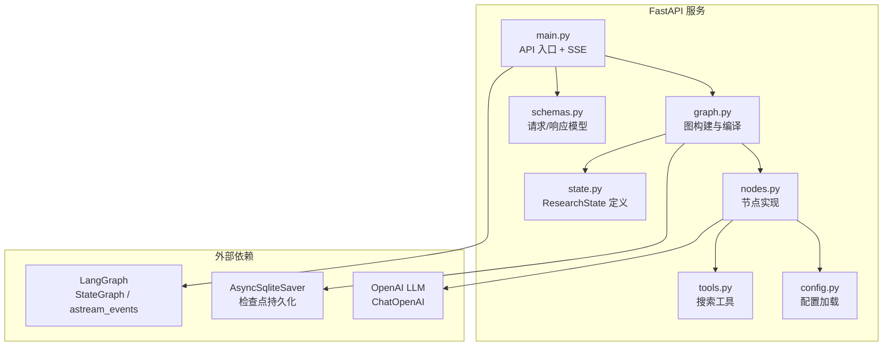
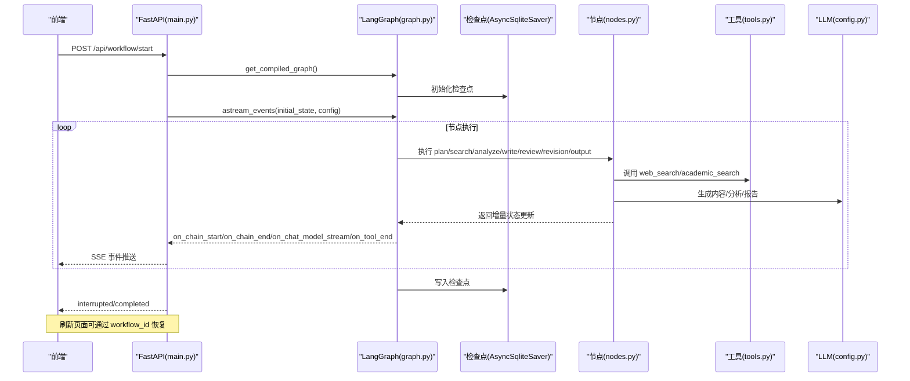
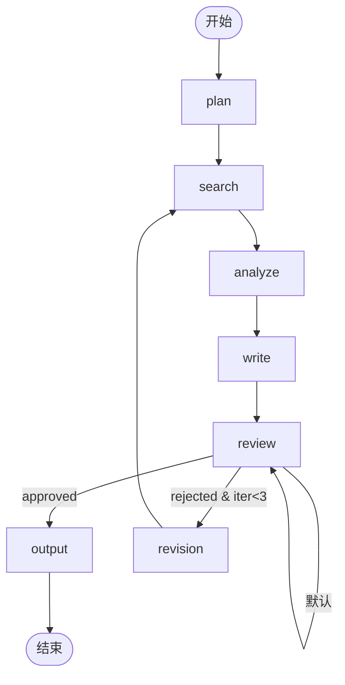
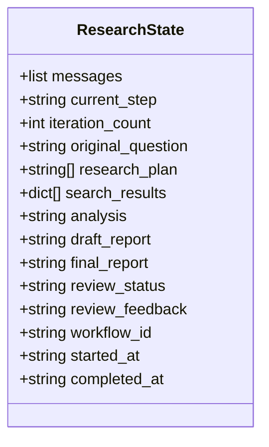
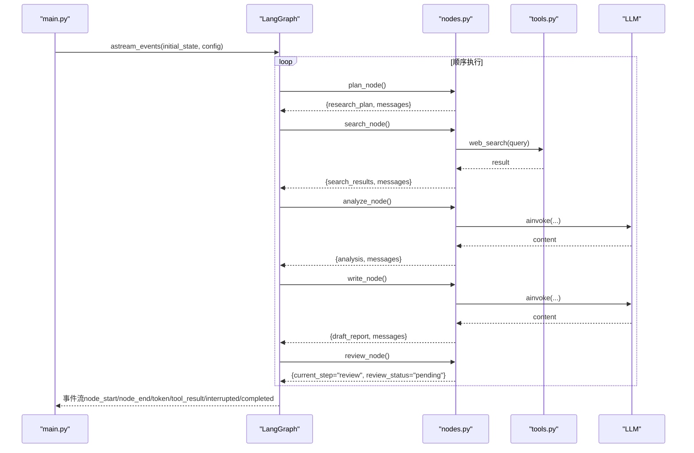
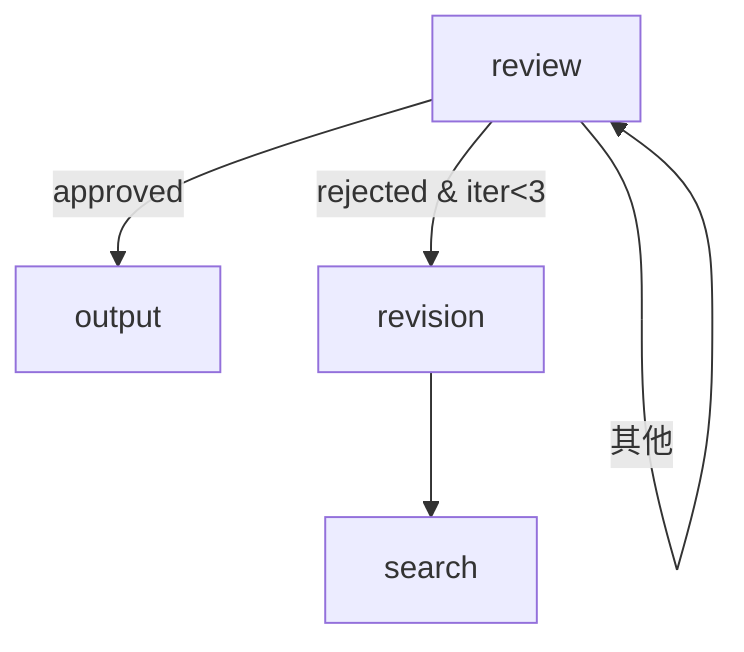
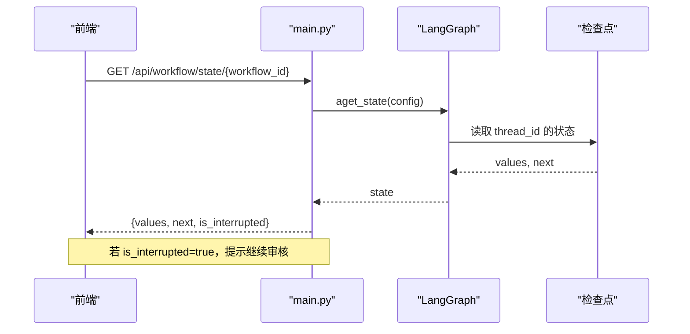
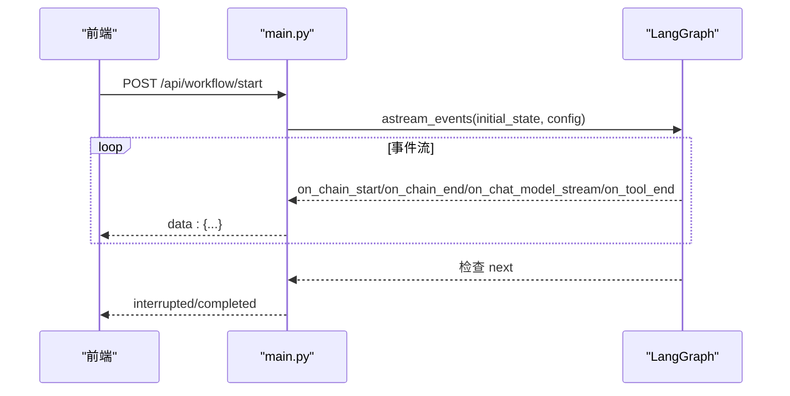

# 后端架构

<cite>
**本文引用的文件**
- [main.py](file://workflow-studio/backend/app/main.py)
- [graph.py](file://workflow-studio/backend/app/graph.py)
- [state.py](file://workflow-studio/backend/app/state.py)
- [nodes.py](file://workflow-studio/backend/app/nodes.py)
- [tools.py](file://workflow-studio/backend/app/tools.py)
- [config.py](file://workflow-studio/backend/app/config.py)
- [schemas.py](file://workflow-studio/backend/app/schemas.py)
- [README.md](file://workflow-studio/README.md)
</cite>

## 目录
1. [简介](#简介)
2. [项目结构](#项目结构)
3. [核心组件](#核心组件)
4. [架构总览](#架构总览)
5. [详细组件分析](#详细组件分析)
6. [依赖关系分析](#依赖关系分析)
7. [性能考量](#性能考量)
8. [故障排查指南](#故障排查指南)
9. [结论](#结论)
10. [附录](#附录)

## 简介
本文件面向后端开发者，系统化阐述 Workflow Studio 后端的 LangGraph 工作流引擎设计与实现。重点覆盖：
- 状态机与工作流编排：节点注册、条件路由、循环控制与中断恢复
- 检查点持久化：SQLite 异步检查点，支持刷新页面后恢复执行
- ResearchState 状态管理：字段语义、节点间数据传递与消息累积
- 异步执行模型：SSE 事件流、LLM 流式输出、工具调用事件
- 图构建过程、编译优化与扩展点设计：如何新增节点、分支、循环与人工审核

## 项目结构
后端采用 FastAPI 作为 Web 框架，LangGraph 定义有状态工作流图，节点封装具体业务逻辑（规划、搜索、分析、写作、审核、修订、输出），并通过 SQLite 检查点实现状态持久化。前端通过 SSE 实时接收执行事件。



图表来源
- [main.py:1-200](file://workflow-studio/backend/app/main.py#L1-L200)
- [graph.py:1-78](file://workflow-studio/backend/app/graph.py#L1-L78)
- [nodes.py:1-129](file://workflow-studio/backend/app/nodes.py#L1-L129)
- [state.py:1-30](file://workflow-studio/backend/app/state.py#L1-L30)
- [tools.py:1-26](file://workflow-studio/backend/app/tools.py#L1-L26)
- [config.py:1-9](file://workflow-studio/backend/app/config.py#L1-L9)
- [schemas.py:1-12](file://workflow-studio/backend/app/schemas.py#L1-L12)

章节来源
- [README.md:15-21](file://workflow-studio/README.md#L15-L21)
- [README.md:47-54](file://workflow-studio/README.md#L47-L54)

## 核心组件
- 工作流图与编译：基于 LangGraph 的 StateGraph 构建研究助手工作流，并在编译时注入检查点与中断策略
- 节点集合：plan/search/analyze/write/review/revision/output，每个节点负责单一职责并返回增量状态更新
- 状态模型：ResearchState 使用 TypedDict 描述全局状态，结合 LangGraph 的消息 reducer 维护消息历史
- API 层：FastAPI 暴露启动、审核、状态查询、图结构等接口，统一通过 SSE 推送事件
- 工具层：web_search/academic_search 作为可插拔工具，当前为模拟实现，便于替换为真实搜索引擎
- 配置层：从环境变量加载 LLM 提供商信息，便于切换模型与端点

章节来源
- [graph.py:23-77](file://workflow-studio/backend/app/graph.py#L23-L77)
- [nodes.py:18-129](file://workflow-studio/backend/app/nodes.py#L18-L129)
- [state.py:5-30](file://workflow-studio/backend/app/state.py#L5-L30)
- [main.py:34-200](file://workflow-studio/backend/app/main.py#L34-L200)
- [tools.py:4-26](file://workflow-studio/backend/app/tools.py#L4-L26)
- [config.py:1-9](file://workflow-studio/backend/app/config.py#L1-L9)

## 架构总览
下图展示了从用户请求到工作流执行、事件流返回、以及检查点恢复的整体流程。



图表来源
- [main.py:34-103](file://workflow-studio/backend/app/main.py#L34-L103)
- [graph.py:65-77](file://workflow-studio/backend/app/graph.py#L65-L77)
- [nodes.py:18-129](file://workflow-studio/backend/app/nodes.py#L18-L129)
- [tools.py:4-26](file://workflow-studio/backend/app/tools.py#L4-L26)
- [config.py:1-9](file://workflow-studio/backend/app/config.py#L1-L9)

## 详细组件分析

### 工作流图构建与编译优化
- 图构建：使用 StateGraph(ResearchState) 创建状态图，依次添加节点与边，形成线性主流程 plan→search→analyze→write→review→output
- 条件路由：在 review 节点后通过 route_after_review 根据 review_status 与 iteration_count 决定下一跳（output/revision/review）
- 循环控制：revision→search 形成闭环；iteration_count 限制最大修订轮次，防止无限循环
- 中断策略：编译时设置 interrupt_before=["review"]，使工作流在审核节点前暂停，等待人工输入
- 检查点：使用 AsyncSqliteSaver.from_conn_string("./checkpoints.db") 持久化状态，支持线程级隔离（thread_id）



图表来源
- [graph.py:23-62](file://workflow-studio/backend/app/graph.py#L23-L62)
- [graph.py:11-21](file://workflow-studio/backend/app/graph.py#L11-L21)

章节来源
- [graph.py:11-77](file://workflow-studio/backend/app/graph.py#L11-L77)

### 状态管理与节点间数据传递
- ResearchState 字段说明：
  - messages：使用 add_messages reducer 累积消息历史
  - current_step：记录当前执行节点
  - iteration_count：用于循环控制，避免无限修订
  - original_question/research_plan/search_results/analysis/draft_report/final_report：研究工作流的核心数据
  - review_status/review_feedback：人工审核结果与反馈
  - workflow_id/started_at/completed_at：元数据与生命周期时间戳
- 节点间数据传递：
  - 每个节点返回 dict，仅包含需要更新的字段，由 LangGraph 合并到全局状态
  - 例如 search_node 更新 search_results，write_node 更新 draft_report，output_node 更新 final_report
- 消息累积：
  - 各节点向 messages 追加 AIMessage，便于前端展示执行日志与上下文



图表来源
- [state.py:5-30](file://workflow-studio/backend/app/state.py#L5-L30)

章节来源
- [state.py:1-30](file://workflow-studio/backend/app/state.py#L1-L30)
- [nodes.py:18-129](file://workflow-studio/backend/app/nodes.py#L18-L129)

### 节点实现与异步执行模型
- 规划节点（plan_node）：将原始问题拆解为子问题列表，更新 research_plan 与 messages
- 搜索节点（search_node）：遍历 research_plan，调用 web_search 工具收集结果，更新 search_results
- 分析节点（analyze_node）：聚合搜索结果，调用 LLM 生成结构化分析，更新 analysis
- 写作节点（write_node）：基于 analysis 与可选 review_feedback 生成草稿报告，更新 draft_report
- 审核节点（review_node）：标记 pending，触发中断，等待人工审核
- 修订节点（revision_node）：递增 iteration_count，准备重新搜索
- 输出节点（output_node）：复制草稿为最终报告，记录完成时间
- 异步执行：
  - 所有节点均为 async，配合 LangGraph 的事件流进行非阻塞执行
  - 通过 astream_events 推送 on_chain_start/end、on_chat_model_stream、on_tool_end 等事件
  - 前端通过 SSE 消费事件，实时更新 UI



图表来源
- [main.py:60-103](file://workflow-studio/backend/app/main.py#L60-L103)
- [nodes.py:18-129](file://workflow-studio/backend/app/nodes.py#L18-L129)
- [tools.py:4-26](file://workflow-studio/backend/app/tools.py#L4-L26)

章节来源
- [nodes.py:18-129](file://workflow-studio/backend/app/nodes.py#L18-L129)
- [main.py:60-103](file://workflow-studio/backend/app/main.py#L60-L103)

### 条件路由与循环控制
- 条件路由函数 route_after_review：
  - approved → output
  - rejected 且 iteration_count < 3 → revision
  - 否则 → review（默认等待）
- 循环控制：
  - revision→search 形成闭环
  - iteration_count 自增，超过阈值强制输出，避免死循环



图表来源
- [graph.py:11-21](file://workflow-studio/backend/app/graph.py#L11-L21)
- [graph.py:45-60](file://workflow-studio/backend/app/graph.py#L45-L60)

章节来源
- [graph.py:11-21](file://workflow-studio/backend/app/graph.py#L11-L21)

### 检查点持久化与恢复
- 检查点存储：使用 AsyncSqliteSaver 以 SQLite 文件形式保存状态，键为 thread_id
- 恢复机制：
  - 启动时通过 workflow_id 获取当前状态，若存在 next 则视为中断
  - 提交审核结果后，使用 Command(update=update, resume=True) 恢复执行
- 前端交互：
  - 刷新页面后调用 /api/workflow/state/{workflow_id} 获取状态，决定是否继续或重新开始



图表来源
- [main.py:157-173](file://workflow-studio/backend/app/main.py#L157-L173)
- [graph.py:65-77](file://workflow-studio/backend/app/graph.py#L65-L77)

章节来源
- [main.py:106-173](file://workflow-studio/backend/app/main.py#L106-L173)
- [graph.py:65-77](file://workflow-studio/backend/app/graph.py#L65-L77)

### API 设计与事件流
- 启动工作流：POST /api/workflow/start，接收 StartRequest.question，返回 SSE 事件流
- 提交审核：POST /api/workflow/review，接收 ReviewRequest.workflow_id/status/feedback，恢复执行
- 获取状态：GET /api/workflow/state/{workflow_id}，返回当前值与是否中断
- 获取图结构：GET /api/workflow/graph-structure，返回节点与边供前端渲染
- 事件类型：
  - node_start/node_end：节点开始/结束
  - token：LLM 流式输出片段
  - tool_result：工具调用结果
  - interrupted/completed：工作流中断或完成



图表来源
- [main.py:34-103](file://workflow-studio/backend/app/main.py#L34-L103)
- [schemas.py:1-12](file://workflow-studio/backend/app/schemas.py#L1-L12)

章节来源
- [main.py:34-200](file://workflow-studio/backend/app/main.py#L34-L200)
- [schemas.py:1-12](file://workflow-studio/backend/app/schemas.py#L1-L12)

### 工具与配置扩展点
- 工具扩展：
  - web_search/academic_search 使用 @tool 装饰器，便于接入真实搜索引擎（如 Tavily/SerpAPI/Bing）
  - 节点中通过 tool.invoke 调用，事件流会推送 on_tool_end
- 配置扩展：
  - 通过 config.py 加载 OPENAI_API_KEY、OPENAI_BASE_URL、LLM_MODEL
  - 可在 nodes.py 中调整 temperature、model 等参数
- 节点扩展：
  - 在 graph.py 中添加新节点与边，或在 review 路由中增加分支
  - 保持节点返回增量状态，不修改全局状态直接赋值

章节来源
- [tools.py:4-26](file://workflow-studio/backend/app/tools.py#L4-L26)
- [config.py:1-9](file://workflow-studio/backend/app/config.py#L1-L9)
- [graph.py:23-62](file://workflow-studio/backend/app/graph.py#L23-L62)

## 依赖关系分析
- 模块耦合：
  - main.py 依赖 graph.py、state.py、schemas.py
  - graph.py 依赖 state.py、nodes.py、AsyncSqliteSaver
  - nodes.py 依赖 tools.py、config.py、state.py
  - tools.py 独立，提供可替换的外部能力
- 外部依赖：
  - LangGraph：状态图、事件流、检查点
  - OpenAI LLM：文本生成与分析
  - SQLite：轻量级检查点存储

```mermaid
graph LR
main["main.py"] --> graph["graph.py"]
graph --> state["state.py"]
graph --> nodes["nodes.py"]
nodes --> tools["tools.py"]
nodes --> config["config.py"]
graph --> saver["AsyncSqliteSaver"]
nodes --> llm["ChatOpenAI"]
```

图表来源
- [main.py:1-200](file://workflow-studio/backend/app/main.py#L1-L200)
- [graph.py:1-78](file://workflow-studio/backend/app/graph.py#L1-L78)
- [nodes.py:1-129](file://workflow-studio/backend/app/nodes.py#L1-L129)
- [tools.py:1-26](file://workflow-studio/backend/app/tools.py#L1-L26)
- [config.py:1-9](file://workflow-studio/backend/app/config.py#L1-L9)

章节来源
- [main.py:1-200](file://workflow-studio/backend/app/main.py#L1-L200)
- [graph.py:1-78](file://workflow-studio/backend/app/graph.py#L1-L78)
- [nodes.py:1-129](file://workflow-studio/backend/app/nodes.py#L1-L129)

## 性能考量
- 异步执行：所有节点与 LLM 调用均为异步，减少阻塞，提升吞吐
- 事件流：SSE 推送细粒度事件，降低前端渲染压力
- 检查点：SQLite 轻量持久化，适合开发与小规模部署；生产环境建议迁移至 PostgreSQL
- 循环保护：iteration_count 限制修订次数，避免长时间运行导致资源耗尽
- 工具缓存：可扩展对搜索结果进行缓存，减少重复搜索开销

[本节为通用指导，不直接分析具体文件]

## 故障排查指南
- 工作流未恢复：
  - 检查 workflow_id 是否正确传入
  - 确认检查点数据库文件是否存在且可读
- 审核未生效：
  - 确保提交审核时使用了正确的 workflow_id 与 status
  - 检查 route_after_review 逻辑是否符合预期
- 事件流中断：
  - 查看异常事件 type=error 的 message
  - 检查 LLM 与工具调用是否超时或失败
- 无限循环：
  - 确认 iteration_count 正确递增
  - 验证 route_after_review 的终止条件

章节来源
- [main.py:96-98](file://workflow-studio/backend/app/main.py#L96-L98)
- [main.py:147-148](file://workflow-studio/backend/app/main.py#L147-L148)
- [graph.py:11-21](file://workflow-studio/backend/app/graph.py#L11-L21)

## 结论
Workflow Studio 后端基于 LangGraph 实现了高内聚、低耦合的研究工作流引擎。通过清晰的状态模型、模块化节点、条件路由与循环控制，以及检查点持久化与 SSE 事件流，提供了稳定、可扩展且易于调试的工作流执行环境。未来可进一步引入并行节点、多模板支持与性能监控面板，以满足更复杂的 AI Agent 场景。

[本节为总结性内容，不直接分析具体文件]

## 附录
- 快速开始与架构图参考 README
- API 文档可通过 FastAPI 内置 /docs 访问

章节来源
- [README.md:23-35](file://workflow-studio/README.md#L23-L35)