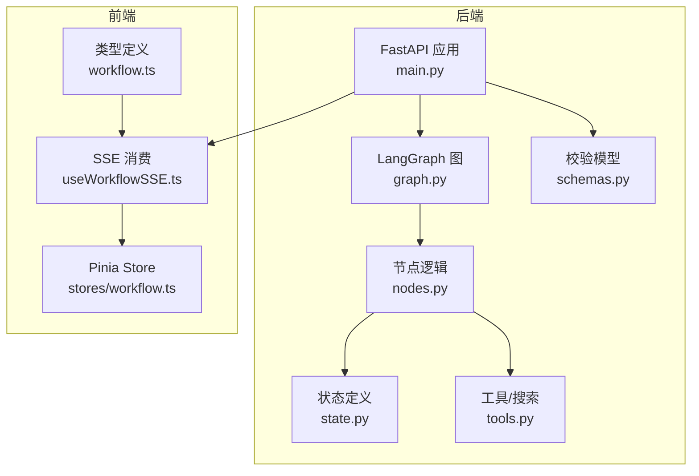
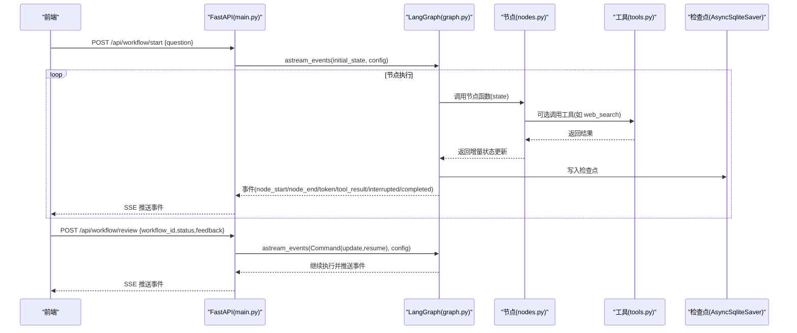
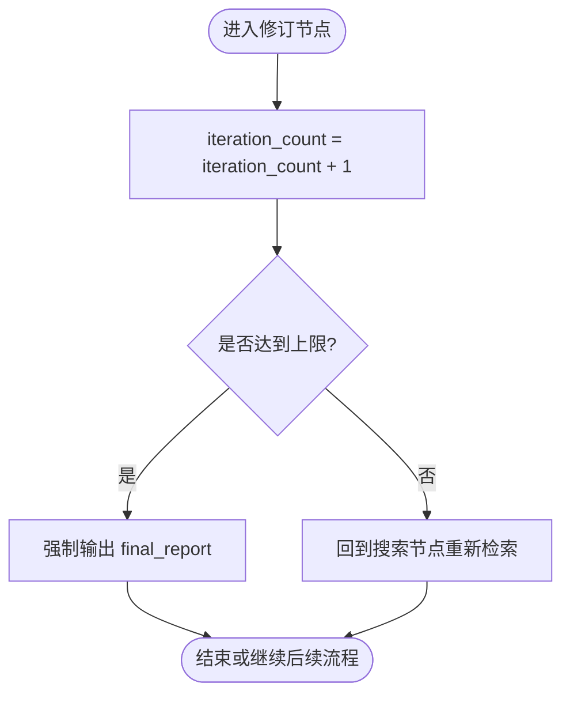
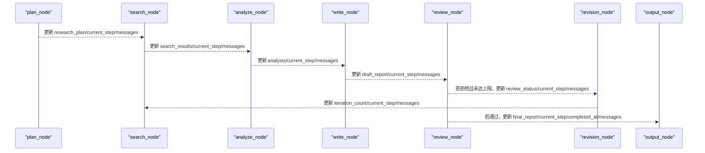
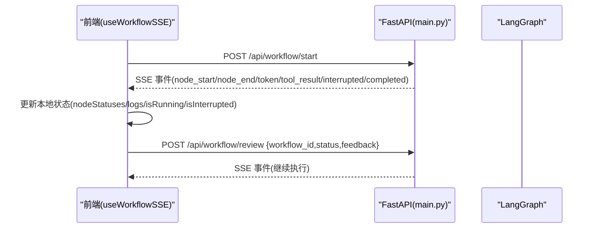
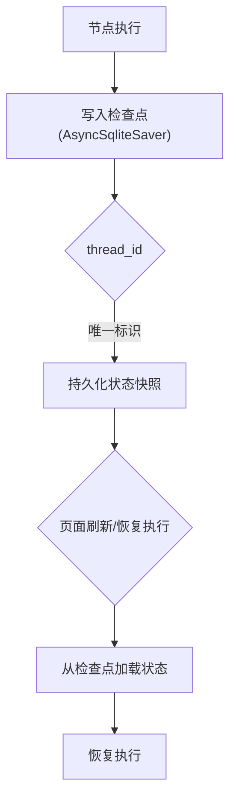
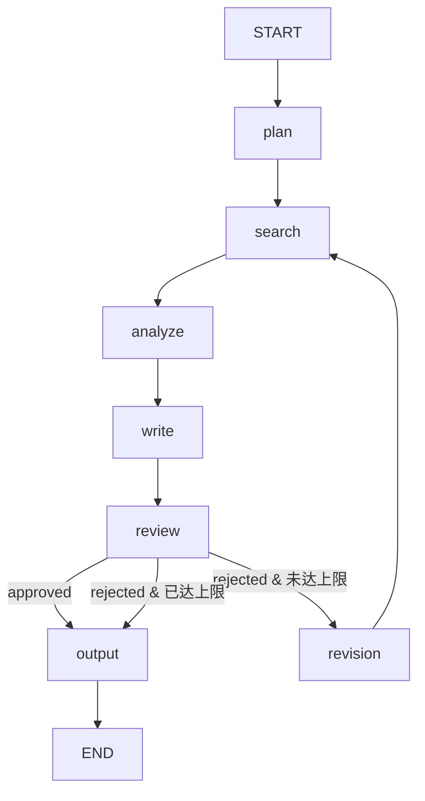
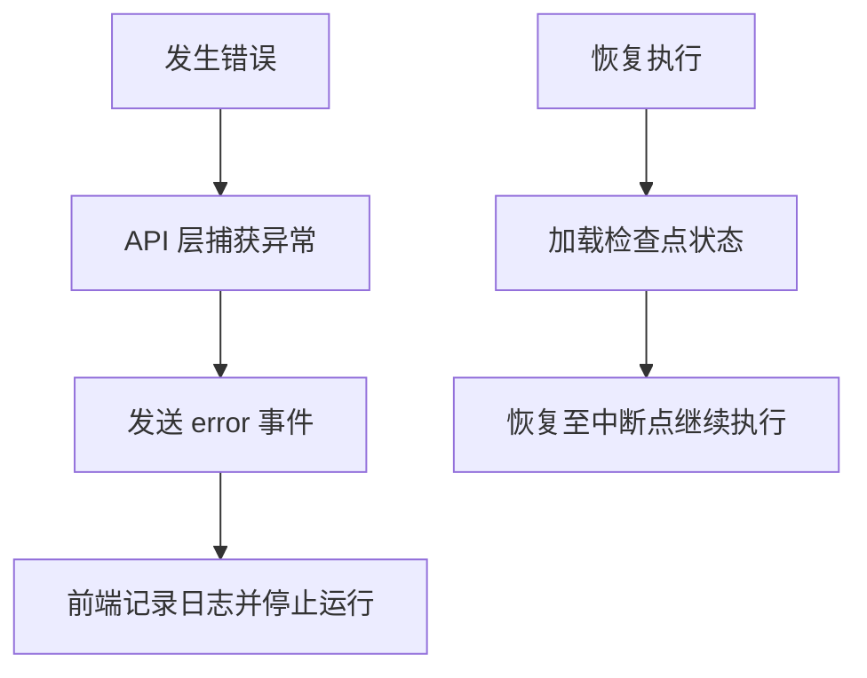
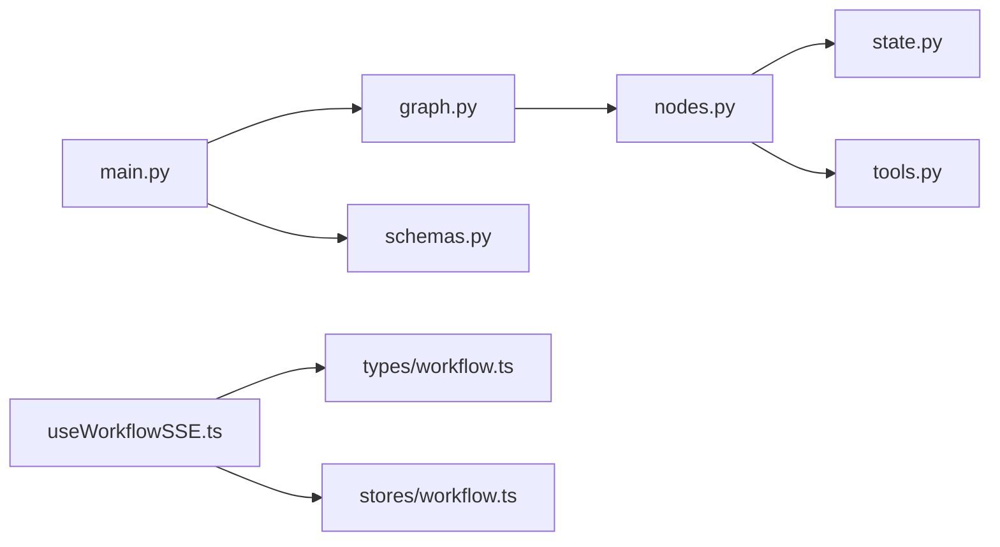

# 状态管理系统

<cite>
**本文引用的文件**
- [state.py](file://workflow-studio/backend/app/state.py)
- [schemas.py](file://workflow-studio/backend/app/schemas.py)
- [nodes.py](file://workflow-studio/backend/app/nodes.py)
- [graph.py](file://workflow-studio/backend/app/graph.py)
- [main.py](file://workflow-studio/backend/app/main.py)
- [tools.py](file://workflow-studio/backend/app/tools.py)
- [workflow.ts](file://workflow-studio/frontend/src/types/workflow.ts)
- [useWorkflowSSE.ts](file://workflow-studio/frontend/src/composables/useWorkflowSSE.ts)
- [workflow.ts（store）](file://workflow-studio/frontend/src/stores/workflow.ts)
</cite>

## 目录
1. [简介](#简介)
2. [项目结构](#项目结构)
3. [核心组件](#核心组件)
4. [架构总览](#架构总览)
5. [详细组件分析](#详细组件分析)
6. [依赖关系分析](#依赖关系分析)
7. [性能考量](#性能考量)
8. [故障排查指南](#故障排查指南)
9. [结论](#结论)
10. [附录：最佳实践与扩展指南](#附录最佳实践与扩展指南)

## 简介
本技术文档围绕 ResearchState 状态管理系统，系统阐述状态类型定义、字段结构与数据验证规则；解释状态更新机制、消息历史管理、迭代计数器实现原理；描述状态在节点间的传递方式、异步状态更新模式与状态持久化策略；并覆盖状态迁移模式、错误状态处理与状态恢复机制。最后提供状态设计的最佳实践与扩展指南，确保状态的一致性与完整性。

## 项目结构
后端基于 FastAPI + LangGraph 构建研究工作流，前端通过 SSE 实时接收事件并驱动 UI 状态。关键文件职责如下：
- 状态定义：backend/app/state.py
- API 入口与事件流：backend/app/main.py
- 工作流图与条件路由：backend/app/graph.py
- 节点逻辑与状态更新：backend/app/nodes.py
- 工具函数（搜索等）：backend/app/tools.py
- 请求校验模型：backend/app/schemas.py
- 前端类型与状态管理：frontend/src/types/workflow.ts, frontend/src/composables/useWorkflowSSE.ts, frontend/src/stores/workflow.ts

图表来源
- [main.py:34-103](file://workflow-studio/backend/app/main.py#L34-L103)
- [graph.py:23-77](file://workflow-studio/backend/app/graph.py#L23-L77)
- [nodes.py:18-128](file://workflow-studio/backend/app/nodes.py#L18-L128)
- [state.py:5-30](file://workflow-studio/backend/app/state.py#L5-L30)
- [tools.py:4-25](file://workflow-studio/backend/app/tools.py#L4-L25)
- [schemas.py:4-11](file://workflow-studio/backend/app/schemas.py#L4-L11)
- [workflow.ts:1-64](file://workflow-studio/frontend/src/types/workflow.ts#L1-L64)
- [useWorkflowSSE.ts:19-71](file://workflow-studio/frontend/src/composables/useWorkflowSSE.ts#L19-L71)
- [workflow.ts（store）:5-73](file://workflow-studio/frontend/src/stores/workflow.ts#L5-L73)

章节来源
- [main.py:34-103](file://workflow-studio/backend/app/main.py#L34-L103)
- [graph.py:23-77](file://workflow-studio/backend/app/graph.py#L23-L77)
- [nodes.py:18-128](file://workflow-studio/backend/app/nodes.py#L18-L128)
- [state.py:5-30](file://workflow-studio/backend/app/state.py#L5-L30)
- [tools.py:4-25](file://workflow-studio/backend/app/tools.py#L4-L25)
- [schemas.py:4-11](file://workflow-studio/backend/app/schemas.py#L4-L11)
- [workflow.ts:1-64](file://workflow-studio/frontend/src/types/workflow.ts#L1-L64)
- [useWorkflowSSE.ts:19-71](file://workflow-studio/frontend/src/composables/useWorkflowSSE.ts#L19-L71)
- [workflow.ts（store）:5-73](file://workflow-studio/frontend/src/stores/workflow.ts#L5-L73)

## 核心组件
- ResearchState：研究工作的完整状态载体，包含消息历史、控制字段、研究内容、审核元数据与工作流元信息。
- 节点集合：plan/search/analyze/write/review/revision/output，负责读取/更新状态并追加消息。
- 工作流图：定义节点顺序、条件分支与循环，支持中断与恢复。
- API 层：启动工作流、提交审核、获取状态、返回图结构，并通过 SSE 推送事件。
- 前端：类型定义、SSE 事件处理、UI 状态同步与交互。

章节来源
- [state.py:5-30](file://workflow-studio/backend/app/state.py#L5-L30)
- [nodes.py:18-128](file://workflow-studio/backend/app/nodes.py#L18-L128)
- [graph.py:23-77](file://workflow-studio/backend/app/graph.py#L23-L77)
- [main.py:34-103](file://workflow-studio/backend/app/main.py#L34-L103)
- [workflow.ts:1-64](file://workflow-studio/frontend/src/types/workflow.ts#L1-L64)

## 架构总览
后端使用 LangGraph 的 StateGraph 组织节点执行流程，结合 AsyncSqliteSaver 进行状态检查点持久化。API 通过 astream_events 将节点开始/结束、LLM token、工具结果、中断与完成事件以 SSE 形式推送到前端。前端根据事件类型更新本地状态，并在需要时调用审核接口恢复执行。

图表来源
- [main.py:34-103](file://workflow-studio/backend/app/main.py#L34-L103)
- [main.py:106-154](file://workflow-studio/backend/app/main.py#L106-L154)
- [graph.py:23-77](file://workflow-studio/backend/app/graph.py#L23-L77)
- [nodes.py:18-128](file://workflow-studio/backend/app/nodes.py#L18-L128)
- [tools.py:4-25](file://workflow-studio/backend/app/tools.py#L4-L25)

## 详细组件分析

### 状态类型定义、字段结构与数据验证规则
- 状态类型：ResearchState 为 TypedDict，用于描述工作流状态的键值结构。
- 关键字段
  - messages：消息历史，使用 LangGraph 内置 reducer add_messages 自动合并消息列表。
  - current_step：当前执行节点标识，用于追踪进度。
  - iteration_count：迭代计数器，防止无限循环，在修订路径中递增。
  - original_question/research_plan/search_results/analysis/draft_report/final_report：研究过程各阶段产出。
  - review_status：审核状态，限定为 pending/approved/rejected/空串。
  - review_feedback：审核反馈文本。
  - workflow_id/started_at/completed_at：工作流元数据与时间戳。
- 数据验证
  - 输入参数由 Pydantic 模型 StartRequest/ReviewRequest 校验。
  - 审核状态使用 Literal 约束，避免非法值。
  - 消息历史通过 add_messages 保证追加式一致性。

章节来源
- [state.py:5-30](file://workflow-studio/backend/app/state.py#L5-L30)
- [schemas.py:4-11](file://workflow-studio/backend/app/schemas.py#L4-L11)

### 状态更新机制、消息历史管理与迭代计数器
- 状态更新机制
  - 每个节点返回一个字典，表示对状态的增量更新（例如设置 current_step、填充 search_results、draft_report 等）。
  - LangGraph 将这些增量合并到全局状态中，形成新的状态快照。
- 消息历史管理
  - 节点通过 messages 字段追加 AIMessage/HumanMessage，add_messages reducer 会按序合并，便于审计与回放。
- 迭代计数器
  - 修订节点 revision_node 将 iteration_count 自增，配合路由逻辑限制最大修订轮次，避免死循环。

图表来源
- [nodes.py:121-128](file://workflow-studio/backend/app/nodes.py#L121-L128)
- [graph.py:11-20](file://workflow-studio/backend/app/graph.py#L11-L20)

章节来源
- [nodes.py:18-128](file://workflow-studio/backend/app/nodes.py#L18-L128)
- [graph.py:11-20](file://workflow-studio/backend/app/graph.py#L11-L20)

### 状态在节点间的传递方式
- 节点间通过 LangGraph 的状态机传递：前一个节点的返回值作为下一个节点的输入状态的一部分。
- 节点仅关注自身需要的字段，其他字段保持不变，降低耦合度。
- 条件路由依据状态字段（如 review_status、iteration_count）决定下一步节点。

图表来源
- [nodes.py:18-128](file://workflow-studio/backend/app/nodes.py#L18-L128)
- [graph.py:38-60](file://workflow-studio/backend/app/graph.py#L38-L60)

章节来源
- [nodes.py:18-128](file://workflow-studio/backend/app/nodes.py#L18-L128)
- [graph.py:38-60](file://workflow-studio/backend/app/graph.py#L38-L60)

### 异步状态更新模式与事件流
- 后端使用 astream_events 异步遍历执行事件，包括节点开始/结束、LLM token、工具结果、中断与完成。
- 前端通过 useWorkflowSSE 解析 SSE 事件，更新 nodeStatuses、logs、isRunning、isInterrupted 等状态。
- 审核提交后，通过 Command(update=update, resume=True) 注入审核结果并恢复执行。

图表来源
- [main.py:34-103](file://workflow-studio/backend/app/main.py#L34-L103)
- [main.py:106-154](file://workflow-studio/backend/app/main.py#L106-L154)
- [useWorkflowSSE.ts:19-71](file://workflow-studio/frontend/src/composables/useWorkflowSSE.ts#L19-L71)
- [useWorkflowSSE.ts:74-157](file://workflow-studio/frontend/src/composables/useWorkflowSSE.ts#L74-L157)

章节来源
- [main.py:34-103](file://workflow-studio/backend/app/main.py#L34-L103)
- [main.py:106-154](file://workflow-studio/backend/app/main.py#L106-L154)
- [useWorkflowSSE.ts:19-71](file://workflow-studio/frontend/src/composables/useWorkflowSSE.ts#L19-L71)
- [useWorkflowSSE.ts:74-157](file://workflow-studio/frontend/src/composables/useWorkflowSSE.ts#L74-L157)

### 状态持久化策略
- 使用 AsyncSqliteSaver 作为检查点存储，保存每次状态变更后的快照，支持中断与恢复。
- 生产环境建议替换为 PostgreSQL 等更健壮的持久化方案。
- 通过 thread_id（workflow_id）区分不同工作流的检查点。

图表来源
- [graph.py:65-77](file://workflow-studio/backend/app/graph.py#L65-L77)
- [main.py:157-173](file://workflow-studio/backend/app/main.py#L157-L173)

章节来源
- [graph.py:65-77](file://workflow-studio/backend/app/graph.py#L65-L77)
- [main.py:157-173](file://workflow-studio/backend/app/main.py#L157-L173)

### 状态迁移模式
- 线性流程：plan → search → analyze → write → review → output。
- 条件分支：review 节点后根据 review_status 决定输出或修订。
- 循环机制：revision → search，配合 iteration_count 限制最大轮数。
- 中断与恢复：在 review 前中断，等待人工审核后恢复。

图表来源
- [graph.py:23-60](file://workflow-studio/backend/app/graph.py#L23-L60)
- [graph.py:11-20](file://workflow-studio/backend/app/graph.py#L11-L20)

章节来源
- [graph.py:23-60](file://workflow-studio/backend/app/graph.py#L23-L60)
- [graph.py:11-20](file://workflow-studio/backend/app/graph.py#L11-L20)

### 错误状态处理与状态恢复机制
- 错误处理
  - 节点内部对 JSON 解析失败进行降级处理（如 plan_node 默认回退为原始问题）。
  - API 层捕获异常并以 error 事件推送给前端。
- 状态恢复
  - 通过 /api/workflow/state/{workflow_id} 获取当前状态，支持页面刷新后恢复。
  - 审核提交后使用 Command(resume=True) 恢复执行。

图表来源
- [main.py:96-97](file://workflow-studio/backend/app/main.py#L96-L97)
- [main.py:141-148](file://workflow-studio/backend/app/main.py#L141-L148)
- [main.py:157-173](file://workflow-studio/backend/app/main.py#L157-L173)

章节来源
- [main.py:96-97](file://workflow-studio/backend/app/main.py#L96-L97)
- [main.py:141-148](file://workflow-studio/backend/app/main.py#L141-L148)
- [main.py:157-173](file://workflow-studio/backend/app/main.py#L157-L173)

## 依赖关系分析
- 后端模块依赖
  - main.py 依赖 graph.py、state.py、schemas.py。
  - graph.py 依赖 state.py 与 nodes.py。
  - nodes.py 依赖 state.py、tools.py、config（外部配置）。
  - tools.py 提供搜索能力，供 search_node 调用。
- 前后端契约
  - 前端 types/workflow.ts 定义事件类型与状态结构，指导前端处理。
  - useWorkflowSSE.ts 解析 SSE 事件并更新 store。
  - stores/workflow.ts 维护前端工作流状态。

图表来源
- [main.py:1-200](file://workflow-studio/backend/app/main.py#L1-L200)
- [graph.py:1-78](file://workflow-studio/backend/app/graph.py#L1-L78)
- [nodes.py:1-129](file://workflow-studio/backend/app/nodes.py#L1-L129)
- [state.py:1-30](file://workflow-studio/backend/app/state.py#L1-L30)
- [tools.py:1-26](file://workflow-studio/backend/app/tools.py#L1-L26)
- [schemas.py:1-12](file://workflow-studio/backend/app/schemas.py#L1-L12)
- [workflow.ts:1-64](file://workflow-studio/frontend/src/types/workflow.ts#L1-L64)
- [useWorkflowSSE.ts:1-172](file://workflow-studio/frontend/src/composables/useWorkflowSSE.ts#L1-L172)
- [workflow.ts（store）:1-75](file://workflow-studio/frontend/src/stores/workflow.ts#L1-L75)

章节来源
- [main.py:1-200](file://workflow-studio/backend/app/main.py#L1-L200)
- [graph.py:1-78](file://workflow-studio/backend/app/graph.py#L1-L78)
- [nodes.py:1-129](file://workflow-studio/backend/app/nodes.py#L1-L129)
- [state.py:1-30](file://workflow-studio/backend/app/state.py#L1-L30)
- [tools.py:1-26](file://workflow-studio/backend/app/tools.py#L1-L26)
- [schemas.py:1-12](file://workflow-studio/backend/app/schemas.py#L1-L12)
- [workflow.ts:1-64](file://workflow-studio/frontend/src/types/workflow.ts#L1-L64)
- [useWorkflowSSE.ts:1-172](file://workflow-studio/frontend/src/composables/useWorkflowSSE.ts#L1-L172)
- [workflow.ts（store）:1-75](file://workflow-studio/frontend/src/stores/workflow.ts#L1-L75)

## 性能考量
- 使用异步执行与事件流减少阻塞，提升响应性。
- 检查点持久化避免重复计算，支持中断与恢复。
- 限制修订轮数以防止无限循环带来的资源消耗。
- 前端对 SSE 事件进行增量更新，避免全量重绘。

[本节为通用性能讨论，不直接分析具体文件]

## 故障排查指南
- 常见问题
  - LLM 返回非预期格式：plan_node 已做降级处理，可检查系统提示词与模型行为。
  - 审核未生效：确认 review_status 与 review_feedback 是否正确注入，以及 resume 标志是否启用。
  - 状态丢失：检查检查点文件是否存在，thread_id 是否正确。
- 调试建议
  - 查看 messages 字段了解节点执行轨迹。
  - 监听 error 事件定位异常原因。
  - 使用 /api/workflow/state/{workflow_id} 获取当前状态进行比对。

章节来源
- [nodes.py:29-34](file://workflow-studio/backend/app/nodes.py#L29-L34)
- [main.py:96-97](file://workflow-studio/backend/app/main.py#L96-L97)
- [main.py:157-173](file://workflow-studio/backend/app/main.py#L157-L173)

## 结论
ResearchState 状态管理系统通过清晰的类型定义、严格的验证规则、节点化的状态更新与条件路由，实现了可中断、可恢复、可扩展的研究工作流。借助 LangGraph 的检查点机制与 SSE 事件流，系统在前后端之间建立了高效、可靠的异步通信通道。遵循本文的最佳实践与扩展指南，可进一步提升状态一致性与系统健壮性。

[本节为总结性内容，不直接分析具体文件]

## 附录：最佳实践与扩展指南
- 状态设计
  - 保持状态最小化与幂等更新，避免冗余字段。
  - 使用 TypedDict 与 Literal 明确约束，提高可读性与安全性。
  - 通过 messages 保留完整审计轨迹，便于回溯与调试。
- 节点开发
  - 节点只关注必要字段，返回增量更新，降低耦合。
  - 对外部调用（LLM/工具）增加容错与降级策略。
- 路由与循环
  - 条件路由应显式处理所有分支，避免隐式默认。
  - 循环必须配备终止条件（如 iteration_count 上限）。
- 持久化与恢复
  - 使用线程隔离的检查点（thread_id），避免状态交叉。
  - 生产环境替换为更稳定的数据库后端。
- 前端集成
  - 严格匹配事件类型，忽略未知事件以保证鲁棒性。
  - 将运行态与视图态分离，避免 UI 抖动。

[本节为通用指导，不直接分析具体文件]