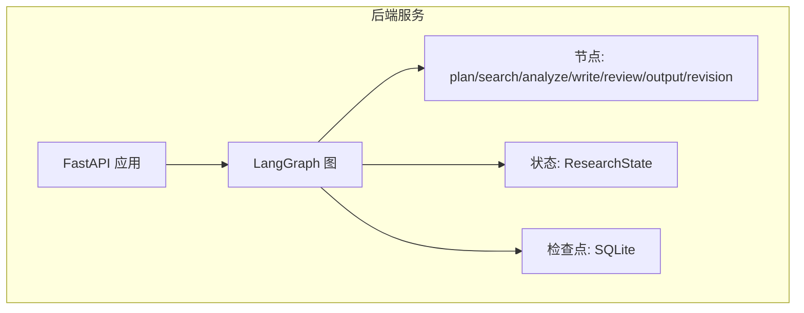
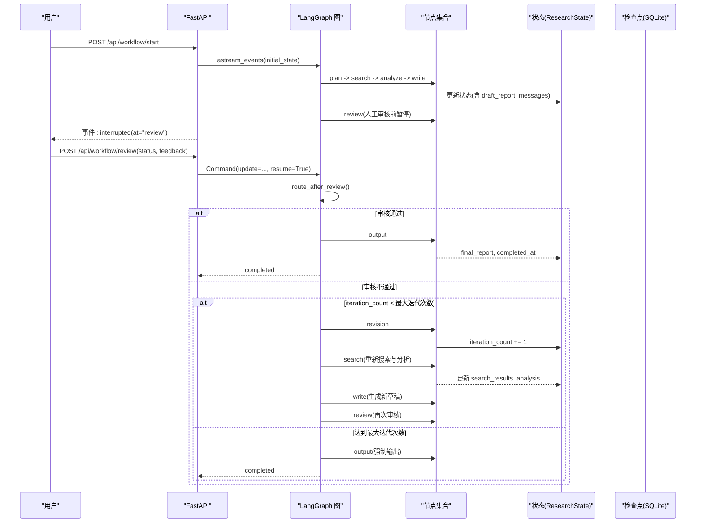
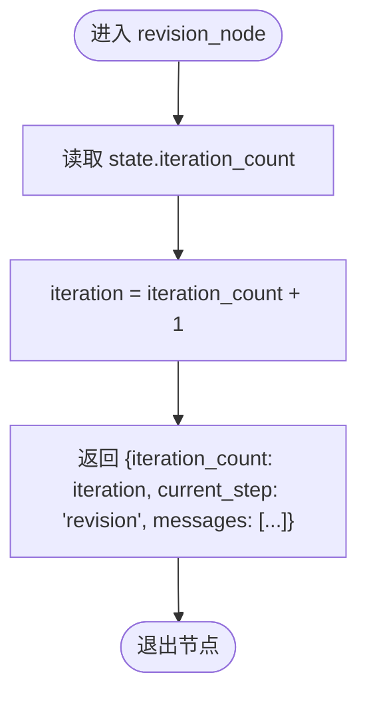
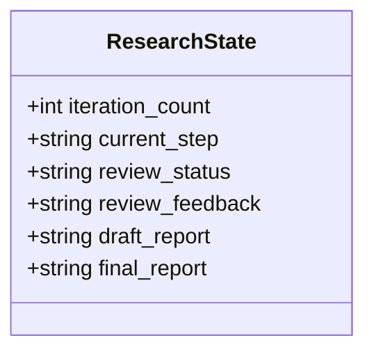
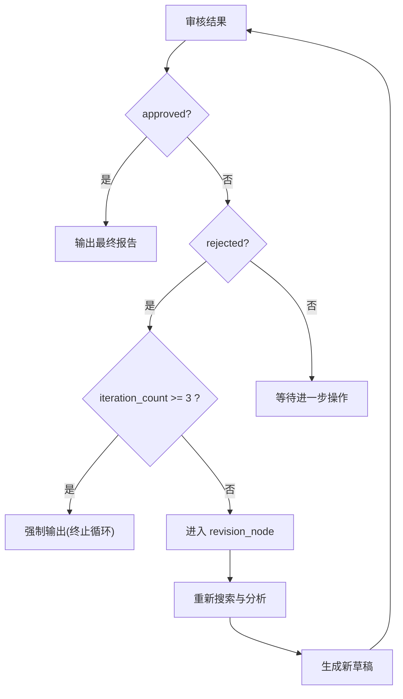
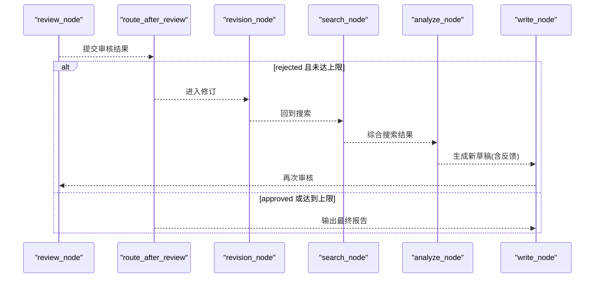
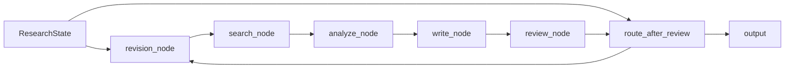

# 修订节点 (revision_node)

<cite>
**本文引用的文件**
- [nodes.py](file://workflow-studio/backend/app/nodes.py)
- [graph.py](file://workflow-studio/backend/app/graph.py)
- [state.py](file://workflow-studio/backend/app/state.py)
- [main.py](file://workflow-studio/backend/app/main.py)
- [tools.py](file://workflow-studio/backend/app/tools.py)
- [config.py](file://workflow-studio/backend/app/config.py)
</cite>

## 目录
1. [简介](#简介)
2. [项目结构](#项目结构)
3. [核心组件](#核心组件)
4. [架构总览](#架构总览)
5. [详细组件分析](#详细组件分析)
6. [依赖关系分析](#依赖关系分析)
7. [性能考量](#性能考量)
8. [故障排查指南](#故障排查指南)
9. [结论](#结论)
10. [附录](#附录)

## 简介
本技术文档聚焦于研究工作流中的“修订节点”（revision_node），围绕其实现逻辑、迭代计数器管理机制、修订循环控制策略、触发条件与终止条件，以及可扩展的修订历史与回滚机制进行系统化说明。该节点在审核不通过时触发，负责递增迭代计数并引导工作流回到搜索与分析阶段，直至满足质量阈值或达到最大迭代次数。

## 项目结构
后端采用 FastAPI + LangGraph 构建研究工作流，关键文件职责如下：
- nodes.py：定义各节点函数，包括 revision_node
- graph.py：构建状态图、条件路由与边连接，包含防止无限循环的策略
- state.py：定义 ResearchState 状态模型，含 iteration_count 等字段
- main.py：提供 API 入口、事件流、中断恢复与检查点持久化
- tools.py：搜索工具（模拟数据）
- config.py：LLM 配置

**图表来源**
- [graph.py:23-62](file://workflow-studio/backend/app/graph.py#L23-L62)
- [state.py:5-30](file://workflow-studio/backend/app/state.py#L5-L30)
- [main.py:65-77](file://workflow-studio/backend/app/main.py#L65-L77)

**章节来源**
- [graph.py:23-62](file://workflow-studio/backend/app/graph.py#L23-L62)
- [state.py:5-30](file://workflow-studio/backend/app/state.py#L5-L30)
- [main.py:65-77](file://workflow-studio/backend/app/main.py#L65-L77)

## 核心组件
- 修订节点（revision_node）：读取当前 iteration_count，自增后写回状态，标记当前步骤为 revision，并记录消息提示进入下一轮修订。
- 条件路由（route_after_review）：根据审核结果决定输出或修订；当拒绝且 iteration_count 达到上限时强制输出，避免无限循环。
- 状态模型（ResearchState）：定义 iteration_count、review_status、review_feedback 等关键字段，用于追踪修订轮次与反馈。
- 工作流图（build_research_graph）：将 revision 节点连接到 search 节点形成循环，并在输出后结束。

**章节来源**
- [nodes.py:121-128](file://workflow-studio/backend/app/nodes.py#L121-L128)
- [graph.py:11-20](file://workflow-studio/backend/app/graph.py#L11-L20)
- [state.py:5-30](file://workflow-studio/backend/app/state.py#L5-L30)
- [graph.py:23-62](file://workflow-studio/backend/app/graph.py#L23-L62)

## 架构总览
下图展示了从规划到输出，以及在审核不通过时的修订循环流程，重点体现 revision_node 的作用与边界条件。

**图表来源**
- [graph.py:11-20](file://workflow-studio/backend/app/graph.py#L11-L20)
- [graph.py:23-62](file://workflow-studio/backend/app/graph.py#L23-L62)
- [nodes.py:121-128](file://workflow-studio/backend/app/nodes.py#L121-L128)
- [main.py:107-154](file://workflow-studio/backend/app/main.py#L107-L154)

## 详细组件分析

### revision_node 实现逻辑
- 输入：ResearchState，包含 iteration_count、review_feedback、draft_report 等
- 处理：
  - 读取当前 iteration_count（默认 0），自增 1
  - 返回新的 iteration_count、current_step="revision"、一条消息提示进入第 N 轮修订
- 作用：作为修订循环的“节拍器”，确保每次修订都推进一轮计数，便于后续判断是否继续循环

**图表来源**
- [nodes.py:121-128](file://workflow-studio/backend/app/nodes.py#L121-L128)

**章节来源**
- [nodes.py:121-128](file://workflow-studio/backend/app/nodes.py#L121-L128)

### 迭代计数器管理机制
- 初始化：启动工作流时将 iteration_count 初始化为 0
- 递增：revision_node 每次执行自增 1
- 使用：route_after_review 中判断 iteration_count 是否达到上限，决定是否强制输出

**图表来源**
- [state.py:5-30](file://workflow-studio/backend/app/state.py#L5-L30)

**章节来源**
- [state.py:5-30](file://workflow-studio/backend/app/state.py#L5-L30)
- [main.py:41-56](file://workflow-studio/backend/app/main.py#L41-L56)
- [graph.py:11-20](file://workflow-studio/backend/app/graph.py#L11-L20)

### 修订循环的控制逻辑
- 触发条件：审核结果为 rejected 且 iteration_count < 最大迭代次数
- 循环路径：revision -> search -> analyze -> write -> review
- 终止条件：
  - 审核通过（approved）直接输出
  - 审核不通过但达到最大迭代次数（当前硬编码为 3）则强制输出
  - 默认等待（pending）保持在中断点

**图表来源**
- [graph.py:11-20](file://workflow-studio/backend/app/graph.py#L11-L20)
- [graph.py:23-62](file://workflow-studio/backend/app/graph.py#L23-L62)
- [nodes.py:121-128](file://workflow-studio/backend/app/nodes.py#L121-L128)

**章节来源**
- [graph.py:11-20](file://workflow-studio/backend/app/graph.py#L11-L20)
- [graph.py:23-62](file://workflow-studio/backend/app/graph.py#L23-L62)
- [nodes.py:121-128](file://workflow-studio/backend/app/nodes.py#L121-L128)

### 修订决策的触发条件与重新搜索/分析的时机
- 触发：review_status == "rejected"
- 重新搜索与分析：revision_node 之后，工作流边指向 search，随后依次执行 analyze、write，再回到 review
- 反馈注入：write_node 会读取 review_feedback 并附加到提示词中，使 LLM 基于上一版反馈改进内容

**图表来源**
- [graph.py:11-20](file://workflow-studio/backend/app/graph.py#L11-L20)
- [graph.py:23-62](file://workflow-studio/backend/app/graph.py#L23-L62)
- [nodes.py:82-97](file://workflow-studio/backend/app/nodes.py#L82-L97)
- [nodes.py:121-128](file://workflow-studio/backend/app/nodes.py#L121-L128)

**章节来源**
- [graph.py:11-20](file://workflow-studio/backend/app/graph.py#L11-L20)
- [graph.py:23-62](file://workflow-studio/backend/app/graph.py#L23-L62)
- [nodes.py:82-97](file://workflow-studio/backend/app/nodes.py#L82-L97)
- [nodes.py:121-128](file://workflow-studio/backend/app/nodes.py#L121-L128)

### 修订策略的配置选项
当前实现的关键配置点：
- 最大迭代次数：在 route_after_review 中硬编码为 3（可提取为配置项）
- 质量阈值判断：当前基于人工审核结果（approved/rejected），未实现自动质量评分
- 自动终止条件：达到最大迭代次数或审核通过即终止

建议的可配置化扩展：
- 将最大迭代次数抽取为环境变量或配置文件项
- 引入自动质量评估（如基于关键词覆盖、引用数量、结构完整性评分）以替代部分人工判断
- 支持动态调整质量阈值与终止策略

**章节来源**
- [graph.py:11-20](file://workflow-studio/backend/app/graph.py#L11-L20)
- [config.py:1-9](file://workflow-studio/backend/app/config.py#L1-L9)

### 修订历史的记录与回滚机制（实现方案）
当前代码未内置修订历史与回滚功能，但可通过以下方案扩展：
- 历史记录：
  - 在每次 revision_node 执行后，将当前状态的快照（如 draft_report、analysis、iteration_count、review_feedback）写入持久化存储（SQLite 表或对象存储）
  - 使用 workflow_id 作为主键关联，按 iteration_count 排序形成时间线
- 回滚机制：
  - 提供 API 允许前端选择某次历史版本，将该版本的 draft_report、analysis、review_feedback 等字段恢复到 ResearchState
  - 恢复后继续执行工作流，从 write 或 review 节点恢复（利用 LangGraph 的检查点与 Command.update）
- 审计与可视化：
  - 在前端展示修订时间线，显示每轮的搜索摘要、分析要点、草稿差异与审核意见
  - 支持对比不同版本的差异（diff）以便快速定位问题

注意：上述为推荐实现方案，需新增数据库表与 API 接口，并在 nodes/graph 中集成状态快照与恢复逻辑。

[本节为概念性方案说明，不直接分析具体文件]

## 依赖关系分析
- revision_node 依赖 ResearchState 中的 iteration_count 与 review_feedback
- route_after_review 依赖 review_status 与 iteration_count 进行分支决策
- 工作流边将 revision 连接到 search，形成循环
- 检查点（SQLite）用于中断恢复与状态持久化

**图表来源**
- [state.py:5-30](file://workflow-studio/backend/app/state.py#L5-L30)
- [nodes.py:121-128](file://workflow-studio/backend/app/nodes.py#L121-L128)
- [graph.py:11-20](file://workflow-studio/backend/app/graph.py#L11-L20)
- [graph.py:23-62](file://workflow-studio/backend/app/graph.py#L23-L62)

**章节来源**
- [state.py:5-30](file://workflow-studio/backend/app/state.py#L5-L30)
- [nodes.py:121-128](file://workflow-studio/backend/app/nodes.py#L121-L128)
- [graph.py:11-20](file://workflow-studio/backend/app/graph.py#L11-L20)
- [graph.py:23-62](file://workflow-studio/backend/app/graph.py#L23-L62)

## 性能考量
- 循环成本：每次修订都会触发搜索、分析与写作，应限制最大迭代次数以避免高开销
- I/O 瓶颈：搜索工具当前为模拟数据，实际接入外部搜索时应考虑缓存与并发
- 检查点开销：频繁的状态持久化可能带来额外延迟，建议批量或按需保存
- 资源保护：在高并发场景下，应考虑对 LLM 调用速率限制与重试退避

[本节提供通用指导，不直接分析具体文件]

## 故障排查指南
- 无限循环风险：若 route_after_review 未正确判断 iteration_count，可能导致死循环；请确认上限设置与分支逻辑
- 审核卡住：若 review_status 始终为 pending，检查前端是否正确提交审核结果，以及后端是否正确恢复工作流
- 状态不一致：检查 checkpoints.db 是否存在损坏，必要时清理并重试
- 日志与事件：通过事件流观察节点开始/结束与 token 流，定位异常发生在哪个阶段

**章节来源**
- [graph.py:11-20](file://workflow-studio/backend/app/graph.py#L11-L20)
- [main.py:60-98](file://workflow-studio/backend/app/main.py#L60-L98)
- [main.py:119-154](file://workflow-studio/backend/app/main.py#L119-L154)

## 结论
revision_node 通过简单的迭代计数器自增，配合条件路由实现了可控的修订循环。当前实现以人工审核为核心质量门控，并通过最大迭代次数防止无限循环。未来可引入自动质量评估、可配置的终止策略以及完整的修订历史与回滚能力，以提升系统的鲁棒性与可维护性。

[本节总结性内容，不直接分析具体文件]

## 附录
- 相关 API：
  - 启动工作流：POST /api/workflow/start
  - 提交审核：POST /api/workflow/review
  - 获取状态：GET /api/workflow/state/{workflow_id}
- 工具与配置：
  - 搜索工具：web_search、academic_search（当前为模拟数据）
  - LLM 配置：OPENAI_API_KEY、OPENAI_BASE_URL、LLM_MODEL

**章节来源**
- [main.py:35-103](file://workflow-studio/backend/app/main.py#L35-L103)
- [main.py:107-154](file://workflow-studio/backend/app/main.py#L107-L154)
- [tools.py:1-26](file://workflow-studio/backend/app/tools.py#L1-L26)
- [config.py:1-9](file://workflow-studio/backend/app/config.py#L1-L9)