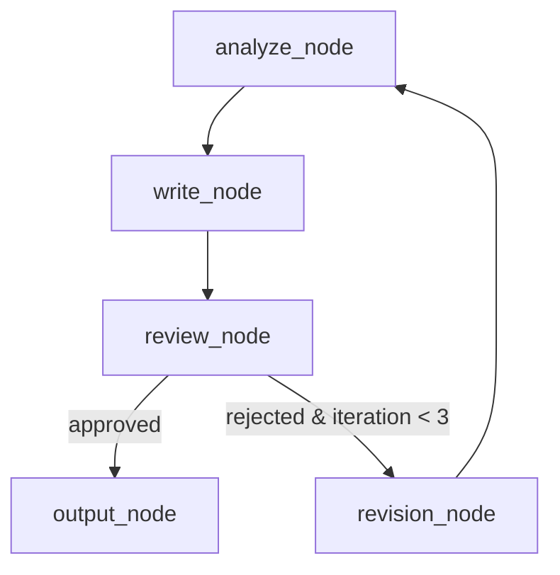
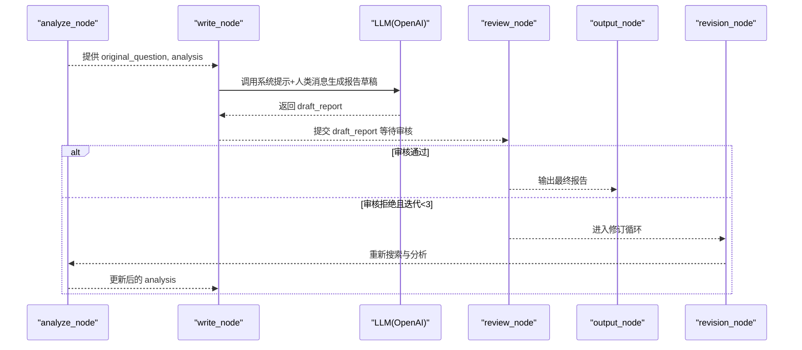
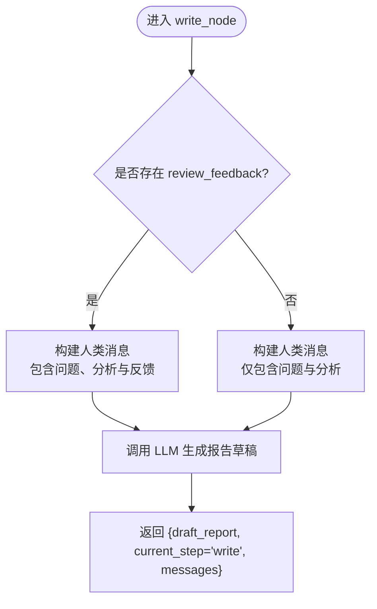
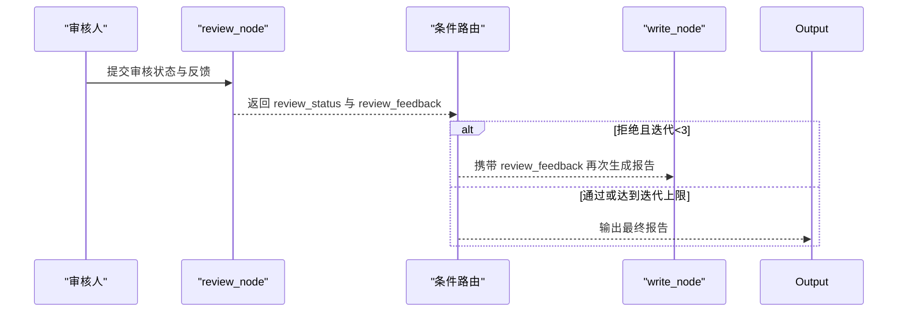
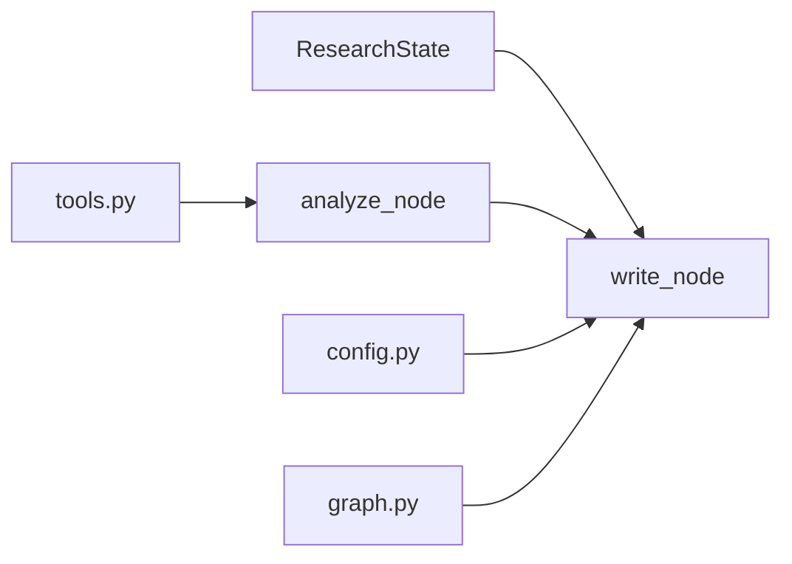

# 写作节点 (write_node)

<cite>
**本文引用的文件**
- [nodes.py](file://workflow-studio/backend/app/nodes.py)
- [state.py](file://workflow-studio/backend/app/state.py)
- [schemas.py](file://workflow-studio/backend/app/schemas.py)
- [tools.py](file://workflow-studio/backend/app/tools.py)
- [graph.py](file://workflow-studio/backend/app/graph.py)
- [config.py](file://workflow-studio/backend/app/config.py)
</cite>

## 目录
1. [简介](#简介)
2. [项目结构](#项目结构)
3. [核心组件](#核心组件)
4. [架构总览](#架构总览)
5. [详细组件分析](#详细组件分析)
6. [依赖关系分析](#依赖关系分析)
7. [性能考量](#性能考量)
8. [故障排查指南](#故障排查指南)
9. [结论](#结论)
10. [附录](#附录)

## 简介
本章节聚焦于“写作节点”（write_node）的技术实现，说明其如何基于前序分析结果生成结构化研究报告草稿。文档涵盖：
- write_node 的输入、处理逻辑与输出
- 报告草稿的章节组织（摘要、关键发现、深入分析、结论与建议）
- 审核反馈 review_feedback 的融入机制
- draft_report 字段的 Markdown 格式要求与内容质量标准
- 报告模板定制、风格控制与长度限制的配置方法

## 项目结构
后端采用 LangGraph 构建研究工作流，write_node 是工作流中的一个关键节点，负责将分析结果转化为可审阅的报告草稿。相关状态定义、工具函数、图编排与配置如下：
- 状态定义：ResearchState 定义了工作流各阶段的数据字段，包括 original_question、analysis、draft_report、review_feedback 等
- 节点实现：nodes.py 中的 write_node 调用 LLM 生成报告草稿
- 图编排：graph.py 将 write_node 接入到 analyze -> write -> review -> output/revision 的流程中
- 工具与配置：tools.py 提供搜索工具；config.py 提供 LLM 模型与端点配置

图表来源
- [graph.py:23-62](file://workflow-studio/backend/app/graph.py#L23-L62)
- [nodes.py:63-128](file://workflow-studio/backend/app/nodes.py#L63-L128)

章节来源
- [state.py:5-30](file://workflow-studio/backend/app/state.py#L5-L30)
- [graph.py:23-62](file://workflow-studio/backend/app/graph.py#L23-L62)
- [nodes.py:63-128](file://workflow-studio/backend/app/nodes.py#L63-L128)

## 核心组件
- write_node：接收 ResearchState，读取 original_question 与 analysis，可选地拼接 review_feedback，调用 LLM 生成 draft_report
- ResearchState：定义 write_node 所需的状态字段，如 original_question、analysis、review_feedback、draft_report
- graph.py：将 write_node 嵌入研究流程，并在 review 后根据审核结果路由到 output 或 revision
- tools.py：为 search_node 提供模拟搜索结果，间接影响 analysis 质量，从而影响 write_node 的输出
- config.py：通过环境变量配置 LLM_MODEL、OPENAI_BASE_URL、OPENAI_API_KEY，影响 write_node 的生成能力与风格

章节来源
- [nodes.py:82-97](file://workflow-studio/backend/app/nodes.py#L82-L97)
- [state.py:5-30](file://workflow-studio/backend/app/state.py#L5-L30)
- [graph.py:23-62](file://workflow-studio/backend/app/graph.py#L23-L62)
- [tools.py:4-26](file://workflow-studio/backend/app/tools.py#L4-L26)
- [config.py:1-9](file://workflow-studio/backend/app/config.py#L1-L9)

## 架构总览
write_node 处于研究流程的中后段，承接 analyze_node 的结构化分析，产出 draft_report，并进入 review_node 进行人工审核。若审核不通过且迭代次数未达上限，则进入 revision_node 重新搜索与分析，再次回到 write_node 生成修订版报告。

图表来源
- [graph.py:23-62](file://workflow-studio/backend/app/graph.py#L23-L62)
- [nodes.py:63-128](file://workflow-studio/backend/app/nodes.py#L63-L128)

## 详细组件分析

### write_node 实现逻辑
- 输入：ResearchState，包含 original_question、analysis、review_feedback（可选）
- 处理：
  - 若存在 review_feedback，将其以明确标记插入到人类消息中，指示 LLM 针对性改进
  - 构造系统提示词，指定角色为学术写作专家，并要求输出包含摘要、关键发现、深入分析、结论与建议的结构化报告
  - 调用 LLM 生成 draft_report
- 输出：
  - draft_report：Markdown 格式的报告草稿
  - current_step：写为 "write"
  - messages：记录当前步骤的消息

图表来源
- [nodes.py:82-97](file://workflow-studio/backend/app/nodes.py#L82-L97)

章节来源
- [nodes.py:82-97](file://workflow-studio/backend/app/nodes.py#L82-L97)
- [state.py:5-30](file://workflow-studio/backend/app/state.py#L5-L30)

### 报告草稿的生成过程与章节组织
- 系统提示词要求 LLM 作为学术写作专家，基于分析结果撰写结构化研究报告
- 明确要求包含以下章节：
  - 摘要：概述研究问题与核心结论
  - 关键发现：提炼搜索结果与分析中的重点信息
  - 深入分析：对矛盾点、趋势与方法论进行深入讨论
  - 结论与建议：总结并给出可操作的建议
- 输出格式：Markdown，便于前端渲染与审阅

章节来源
- [nodes.py:88-90](file://workflow-studio/backend/app/nodes.py#L88-L90)

### 审核反馈的处理机制
- 当 state 中存在 review_feedback 时，write_node 会将其拼接到人类消息中，并以醒目标记提示 LLM 进行针对性改进
- 该机制确保在审核不通过后，修订版报告能够直接响应审核意见，提高迭代效率
- 审核路由由 graph.py 控制：若审核拒绝且迭代次数小于等于阈值，则进入 revision_node 重新搜索与分析，再回到 write_node

图表来源
- [graph.py:11-20](file://workflow-studio/backend/app/graph.py#L11-L20)
- [nodes.py:82-97](file://workflow-studio/backend/app/nodes.py#L82-L97)

章节来源
- [graph.py:11-20](file://workflow-studio/backend/app/graph.py#L11-L20)
- [nodes.py:82-97](file://workflow-studio/backend/app/nodes.py#L82-L97)

### draft_report 字段的 Markdown 格式要求与内容质量标准
- 格式要求：
  - 使用 Markdown 语法组织章节标题、列表、强调等
  - 建议按“摘要、关键发现、深入分析、结论与建议”顺序组织
  - 保持段落清晰、层次分明，避免冗长无结构的文本
- 内容质量标准：
  - 准确性：基于 analysis 的事实性信息，避免臆测
  - 完整性：覆盖研究问题的主要方面，体现关键发现与深入分析
  - 可读性：语言简洁专业，适合非技术读者理解
  - 可操作性：结论与建议需具备实践指导意义

章节来源
- [nodes.py:88-90](file://workflow-studio/backend/app/nodes.py#L88-L90)

### 报告模板定制、风格控制与长度限制的配置方法
- 模板定制：
  - 修改 write_node 的系统提示词，增加固定模板结构或示例，以规范输出格式
  - 可在 HumanMessage 中附加额外约束（如“必须包含X章节”、“禁止Y内容”）
- 风格控制：
  - 调整 LLM 的 temperature 参数（当前 nodes.py 中设置为较低值，利于稳定输出）
  - 通过 config.py 切换 LLM_MODEL 与 OPENAI_BASE_URL，选择不同模型或提供商以获得不同风格
- 长度限制：
  - 在提示词中明确最大字数或章节数量限制
  - 结合前端校验，对 draft_report 的长度进行二次检查与截断提示
- 注意：
  - 当前实现未内置长度限制，需在提示词或后续处理层添加
  - 模板与风格变更应配合测试用例验证输出一致性

章节来源
- [nodes.py:10-15](file://workflow-studio/backend/app/nodes.py#L10-L15)
- [config.py:1-9](file://workflow-studio/backend/app/config.py#L1-L9)

## 依赖关系分析
- write_node 依赖：
  - ResearchState：提供 original_question、analysis、review_feedback 等上下文
  - LLM（ChatOpenAI）：执行生成任务
  - graph.py：编排节点顺序与条件路由
  - tools.py：间接影响 analysis 的质量（通过 search_node 的搜索结果）
- 耦合与内聚：
  - write_node 与 state.py 强耦合（字段依赖），与 graph.py 松耦合（通过状态传递）
  - 可通过抽象提示词与配置项降低对具体 LLM 实现的耦合

图表来源
- [state.py:5-30](file://workflow-studio/backend/app/state.py#L5-L30)
- [nodes.py:82-97](file://workflow-studio/backend/app/nodes.py#L82-L97)
- [tools.py:4-26](file://workflow-studio/backend/app/tools.py#L4-L26)
- [config.py:1-9](file://workflow-studio/backend/app/config.py#L1-L9)
- [graph.py:23-62](file://workflow-studio/backend/app/graph.py#L23-L62)

章节来源
- [state.py:5-30](file://workflow-studio/backend/app/state.py#L5-L30)
- [nodes.py:82-97](file://workflow-studio/backend/app/nodes.py#L82-L97)
- [tools.py:4-26](file://workflow-studio/backend/app/tools.py#L4-L26)
- [config.py:1-9](file://workflow-studio/backend/app/config.py#L1-L9)
- [graph.py:23-62](file://workflow-studio/backend/app/graph.py#L23-L62)

## 性能考量
- LLM 调用成本：write_node 每次生成报告都会产生一次 LLM 调用，建议在提示词中优化信息密度以减少 token 消耗
- 温度设置：当前 temperature=0.3，有利于稳定输出；如需更多创意可适度提高
- 迭代次数：graph.py 中限制最多3轮修订，避免无限循环导致性能问题
- 缓存策略：可对重复查询的 analysis 结果进行缓存，减少重复计算

[本节为通用性能建议，不直接分析具体代码文件]

## 故障排查指南
- 常见问题：
  - draft_report 为空或格式不符合预期：检查 system prompt 与 human message 是否完整传入
  - 审核反馈未生效：确认 review_feedback 是否正确写入 state，并在 write_node 中被拼接
  - 无限修订循环：检查 graph.py 中的 iteration_count 阈值与路由逻辑
- 调试建议：
  - 打印 state 关键字段（original_question、analysis、review_feedback、draft_report）
  - 查看 messages 历史，确认各节点输出是否符合预期
  - 调整 LLM 模型或 base_url，排除提供商侧问题

章节来源
- [nodes.py:82-97](file://workflow-studio/backend/app/nodes.py#L82-L97)
- [graph.py:11-20](file://workflow-studio/backend/app/graph.py#L11-L20)
- [state.py:5-30](file://workflow-studio/backend/app/state.py#L5-L30)

## 结论
write_node 是研究工作流中承上启下的关键环节，负责将分析结果转化为结构化、可审阅的报告草稿。通过引入审核反馈机制与迭代修订流程，能够有效提升报告质量与实用性。建议在提示词层面加强模板与风格控制，并结合前端校验完善长度限制与格式规范。

[本节为总结性内容，不直接分析具体代码文件]

## 附录
- 相关 API 请求模型：
  - StartRequest：用于启动研究工作流，包含 question 字段
  - ReviewRequest：用于提交审核结果，包含 workflow_id、status、feedback
- 工具函数：
  - web_search、academic_search：提供模拟搜索结果，影响 analysis 质量

章节来源
- [schemas.py:4-12](file://workflow-studio/backend/app/schemas.py#L4-L12)
- [tools.py:4-26](file://workflow-studio/backend/app/tools.py#L4-L26)