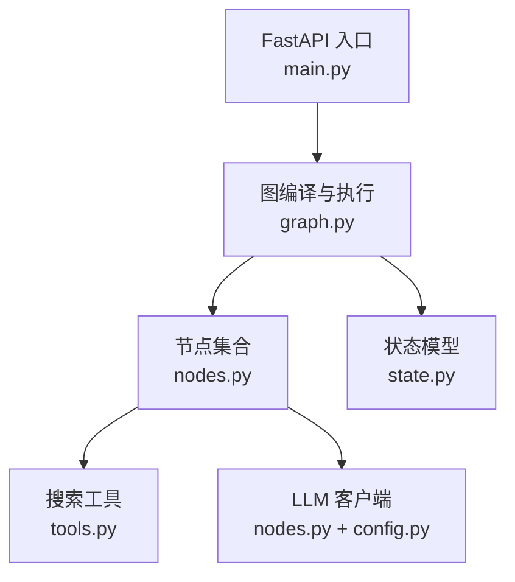
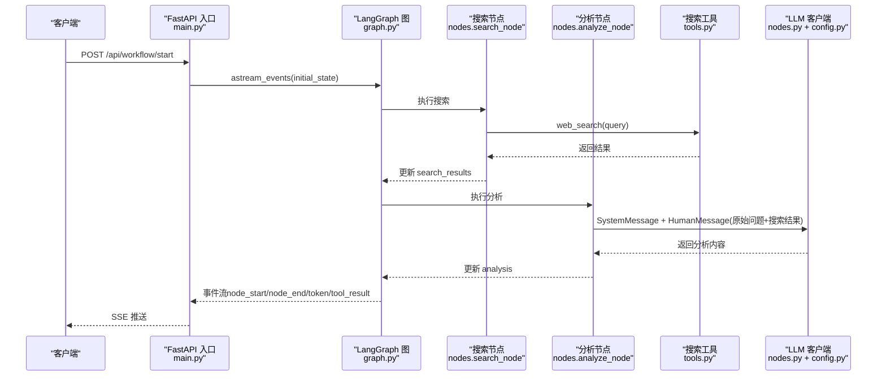
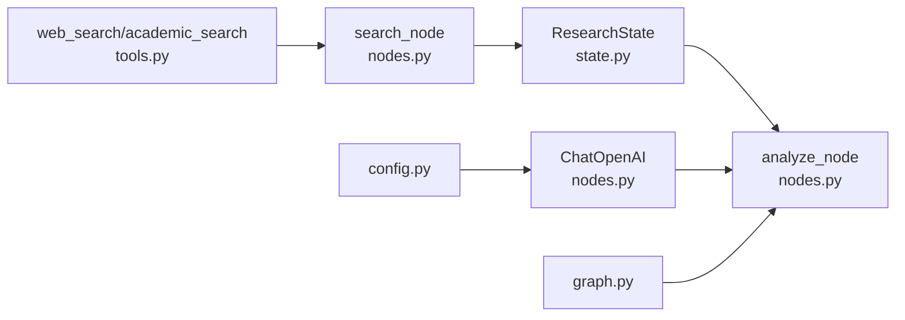
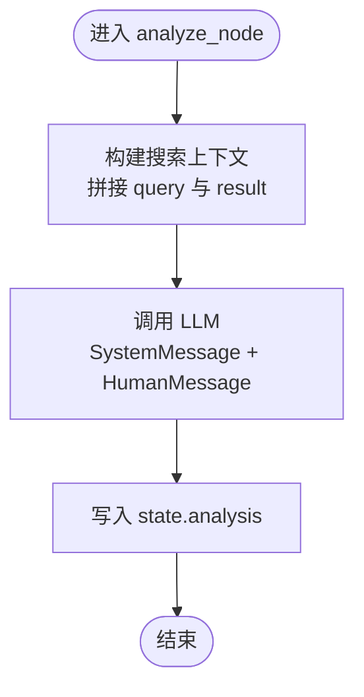

# 分析节点 (analyze_node)

<cite>
**本文引用的文件**
- [nodes.py](file://workflow-studio/backend/app/nodes.py)
- [tools.py](file://workflow-studio/backend/app/tools.py)
- [state.py](file://workflow-studio/backend/app/state.py)
- [graph.py](file://workflow-studio/backend/app/graph.py)
- [config.py](file://workflow-studio/backend/app/config.py)
- [main.py](file://workflow-studio/backend/app/main.py)
</cite>

## 目录
1. [简介](#简介)
2. [项目结构](#项目结构)
3. [核心组件](#核心组件)
4. [架构总览](#架构总览)
5. [详细组件分析](#详细组件分析)
6. [依赖关系分析](#依赖关系分析)
7. [性能考虑](#性能考虑)
8. [故障排查指南](#故障排查指南)
9. [结论](#结论)
10. [附录](#附录)

## 简介
本技术文档聚焦于研究工作流中的“分析节点”（analyze_node），深入解析其实现逻辑：如何综合多个搜索结果进行深度分析、搜索上下文的构建方式（字符串拼接将查询与结果组合为结构化文本）、LLM 提示词设计（SystemMessage 的分析角色设定与 HumanMessage 的问题上下文构建）、输出格式与 analysis 字段的预期结构与质量评估标准，以及缓存策略与性能优化建议。

## 项目结构
后端采用 FastAPI 暴露工作流接口，LangGraph 编排节点执行流程，节点模块负责具体业务逻辑，工具模块封装搜索能力，状态模块定义工作流状态结构，配置模块加载 LLM 相关环境变量。

图表来源
- [main.py:35-103](file://workflow-studio/backend/app/main.py#L35-L103)
- [graph.py:23-77](file://workflow-studio/backend/app/graph.py#L23-L77)
- [nodes.py:63-79](file://workflow-studio/backend/app/nodes.py#L63-L79)
- [tools.py:4-25](file://workflow-studio/backend/app/tools.py#L4-L25)
- [state.py:5-30](file://workflow-studio/backend/app/state.py#L5-L30)
- [config.py:6-8](file://workflow-studio/backend/app/config.py#L6-L8)

章节来源
- [main.py:35-103](file://workflow-studio/backend/app/main.py#L35-L103)
- [graph.py:23-77](file://workflow-studio/backend/app/graph.py#L23-L77)
- [nodes.py:63-79](file://workflow-studio/backend/app/nodes.py#L63-L79)
- [tools.py:4-25](file://workflow-studio/backend/app/tools.py#L4-L25)
- [state.py:5-30](file://workflow-studio/backend/app/state.py#L5-L30)
- [config.py:6-8](file://workflow-studio/backend/app/config.py#L6-L8)

## 核心组件
- 分析节点（analyze_node）：接收 search_results，构建搜索上下文，调用 LLM 生成结构化分析，写入 state.analysis。
- 搜索工具（web_search/academic_search）：提供模拟或真实检索结果，供 analyze_node 消费。
- 状态模型（ResearchState）：定义工作流各阶段的数据字段，包括 original_question、research_plan、search_results、analysis 等。
- 图编排（build_research_graph）：定义节点顺序与条件路由，确保 analyze_node 在 search_node 之后执行。
- 配置（config）：注入 LLM 模型、Base URL、API Key。
- API 入口（main）：启动工作流、事件流式返回、中断恢复。

章节来源
- [nodes.py:63-79](file://workflow-studio/backend/app/nodes.py#L63-L79)
- [tools.py:4-25](file://workflow-studio/backend/app/tools.py#L4-L25)
- [state.py:5-30](file://workflow-studio/backend/app/state.py#L5-L30)
- [graph.py:23-77](file://workflow-studio/backend/app/graph.py#L23-L77)
- [config.py:6-8](file://workflow-studio/backend/app/config.py#L6-L8)
- [main.py:35-103](file://workflow-studio/backend/app/main.py#L35-L103)

## 架构总览
分析节点处于研究流程的中间环节，承接搜索节点产出的多条子问题搜索结果，将其整合为统一上下文，交由 LLM 进行综合分析，产出 analysis 字段供后续写作节点使用。

图表来源
- [main.py:35-103](file://workflow-studio/backend/app/main.py#L35-L103)
- [graph.py:23-77](file://workflow-studio/backend/app/graph.py#L23-L77)
- [nodes.py:43-79](file://workflow-studio/backend/app/nodes.py#L43-L79)
- [tools.py:4-25](file://workflow-studio/backend/app/tools.py#L4-L25)
- [config.py:6-8](file://workflow-studio/backend/app/config.py#L6-L8)

## 详细组件分析

### analyze_node 函数实现逻辑
- 输入：state 包含 original_question 与 search_results（由 search_node 填充）。
- 处理：
  - 构建搜索上下文：遍历 search_results，将每个子问题的查询与结果以固定格式拼接成结构化文本，便于 LLM 理解每条结果的来源与内容。
  - 调用 LLM：传入 SystemMessage（分析角色设定）与 HumanMessage（原始问题 + 搜索上下文）。
  - 输出：将 LLM 返回的内容写入 state.analysis，并标记当前步骤为 analyze。
- 关键点：
  - 上下文拼接顺序与分隔符影响 LLM 对多源信息的整合效果。
  - 若 search_results 为空，HumanMessage 中仍会保留原始问题，避免空上下文导致无意义输出。

章节来源
- [nodes.py:63-79](file://workflow-studio/backend/app/nodes.py#L63-L79)
- [state.py:5-30](file://workflow-studio/backend/app/state.py#L5-L30)

### 搜索上下文的构建过程
- 数据来源：state.search_results，每项包含 query、result、timestamp。
- 构建方式：使用字符串拼接将“查询: ... 结果: ...”逐条组合，并以换行分隔形成结构化文本。
- 目的：使 LLM 能清晰区分不同子问题的搜索结果，便于交叉对比与矛盾识别。

章节来源
- [nodes.py:63-79](file://workflow-studio/backend/app/nodes.py#L63-L79)
- [state.py:5-30](file://workflow-studio/backend/app/state.py#L5-L30)

### LLM 提示词设计
- SystemMessage：设定“研究分析师”角色，要求综合分析搜索结果，提取关键发现、识别矛盾点、形成结构化分析。
- HumanMessage：包含原始问题与搜索上下文，作为具体问题与证据材料。
- 设计要点：
  - 角色明确：强调分析与结构化输出。
  - 上下文完整：同时提供问题与证据，减少幻觉。
  - 可约束性：可在 SystemMessage 中进一步约定输出结构（如分节标题、要点列表），以提升下游可用性。

章节来源
- [nodes.py:63-79](file://workflow-studio/backend/app/nodes.py#L63-L79)
- [config.py:6-8](file://workflow-studio/backend/app/config.py#L6-L8)

### 输出格式与 quality 评估
- 输出字段：state.analysis 存储 LLM 返回的分析文本。
- 预期内容结构：
  - 摘要：对原始问题的高层回答。
  - 关键发现：从搜索结果中提取的核心观点。
  - 矛盾与差异：不同来源间的冲突或不一致之处。
  - 结论与建议：基于证据的综合判断与下一步行动建议。
- 质量评估标准：
  - 相关性：是否紧扣原始问题与提供的搜索结果。
  - 完整性：是否覆盖主要维度（发现、矛盾、结论）。
  - 可追溯性：是否能对应到具体搜索结果条目。
  - 可读性：结构清晰、语言精炼、适合非专业读者理解。
  - 一致性：避免自相矛盾或与证据不符的断言。

章节来源
- [nodes.py:63-79](file://workflow-studio/backend/app/nodes.py#L63-L79)
- [state.py:5-30](file://workflow-studio/backend/app/state.py#L5-L30)

### 缓存策略与性能优化建议
- 现状：当前 analyze_node 未实现显式缓存；每次执行都会重新调用 LLM。
- 建议方案：
  - 基于输入的哈希缓存：对 original_question 与 search_results 的规范化内容进行哈希，命中则直接返回历史 analysis。
  - 分层缓存：
    - 短期内存缓存：进程内字典，用于同一次请求内的重复子问题合并。
    - 持久化缓存：Redis 或 SQLite，跨进程共享，支持失效策略（TTL）。
  - 增量更新：当仅新增少量搜索结果时，优先复用已有分析片段，仅重算受影响部分。
  - 并发控制：对相同或相似查询进行去重，避免重复 LLM 调用。
  - 降级策略：当 LLM 不可用时，返回基于规则的模板化分析，保证流程继续。
- 性能考量：
  - 减少 LLM 调用次数是提升吞吐的关键。
  - 合理设置 temperature（当前为 0.3）有助于稳定输出，利于缓存命中。
  - 对长上下文进行截断或摘要，降低 token 消耗与延迟。

章节来源
- [nodes.py:63-79](file://workflow-studio/backend/app/nodes.py#L63-L79)
- [config.py:6-8](file://workflow-studio/backend/app/config.py#L6-L8)

## 依赖关系分析
- analyze_node 依赖：
  - ResearchState：读取 original_question、search_results，写入 analysis。
  - tools：间接依赖（通过 search_node 产生 search_results）。
  - LLM 客户端：由 nodes.py 初始化，使用 config.py 的配置。
  - graph.py：定义 analyze_node 的执行时机与前后节点关系。
- 耦合度：
  - 低耦合：analyze_node 仅通过 state 与上下游交互，不直接感知其他节点实现细节。
  - 高内聚：LLM 调用与上下文构建集中在 analyze_node，职责单一。
- 外部依赖：
  - OpenAI/兼容 LLM：通过 ChatOpenAI 调用，受 OPENAI_API_KEY、OPENAI_BASE_URL、LLM_MODEL 控制。

图表来源
- [state.py:5-30](file://workflow-studio/backend/app/state.py#L5-L30)
- [nodes.py:63-79](file://workflow-studio/backend/app/nodes.py#L63-L79)
- [tools.py:4-25](file://workflow-studio/backend/app/tools.py#L4-L25)
- [graph.py:23-77](file://workflow-studio/backend/app/graph.py#L23-L77)
- [config.py:6-8](file://workflow-studio/backend/app/config.py#L6-L8)

章节来源
- [state.py:5-30](file://workflow-studio/backend/app/state.py#L5-L30)
- [nodes.py:63-79](file://workflow-studio/backend/app/nodes.py#L63-L79)
- [tools.py:4-25](file://workflow-studio/backend/app/tools.py#L4-L25)
- [graph.py:23-77](file://workflow-studio/backend/app/graph.py#L23-L77)
- [config.py:6-8](file://workflow-studio/backend/app/config.py#L6-L8)

## 性能考虑
- 上下文长度管理：当 search_results 较多时，可对每条 result 做摘要或限制最大条目数，避免超出 LLM 上下文窗口。
- 温度与稳定性：temperature=0.3 有利于稳定输出，提高缓存命中率。
- 事件流与前端体验：SSE 推送 node_start/node_end/token 事件，提升实时性与可观测性。
- 检查点与恢复：使用 AsyncSqliteSaver 保存状态，支持中断后恢复，避免重复计算。

章节来源
- [main.py:35-103](file://workflow-studio/backend/app/main.py#L35-L103)
- [graph.py:65-77](file://workflow-studio/backend/app/graph.py#L65-L77)
- [nodes.py:10-15](file://workflow-studio/backend/app/nodes.py#L10-L15)

## 故障排查指南
- 常见问题：
  - search_results 为空：检查 search_node 是否正确执行，确认 web_search 工具返回有效数据。
  - LLM 调用失败：检查 OPENAI_API_KEY、OPENAI_BASE_URL、LLM_MODEL 配置是否正确。
  - 输出不符合预期：调整 SystemMessage 的结构化约束，或在 HumanMessage 中提供更明确的示例格式。
- 定位方法：
  - 查看 SSE 事件流中的 tool_result 与 node_end 输出，确认中间状态。
  - 通过 /api/workflow/state/{workflow_id} 获取当前状态，验证 search_results 与 analysis 字段。
- 恢复策略：
  - 若审核被拒绝且 iteration_count 达到上限，强制进入 output 节点，避免无限循环。

章节来源
- [main.py:107-154](file://workflow-studio/backend/app/main.py#L107-L154)
- [graph.py:11-20](file://workflow-studio/backend/app/graph.py#L11-L20)
- [nodes.py:43-79](file://workflow-studio/backend/app/nodes.py#L43-L79)

## 结论
analyze_node 通过将多源搜索结果组织为结构化上下文，结合明确的 LLM 角色设定与问题上下文，实现对复杂研究问题的综合分析。其输出 analysis 字段应满足相关性、完整性、可追溯性、可读性与一致性等质量标准。当前实现未内置缓存，建议引入基于输入哈希的分层缓存机制，并结合上下文摘要与并发去重，显著提升性能与成本效率。配合 LangGraph 的检查点与事件流，可实现高可用、可观测的研究工作流。

## 附录
- 流程图：analyze_node 内部处理逻辑

图表来源
- [nodes.py:63-79](file://workflow-studio/backend/app/nodes.py#L63-L79)