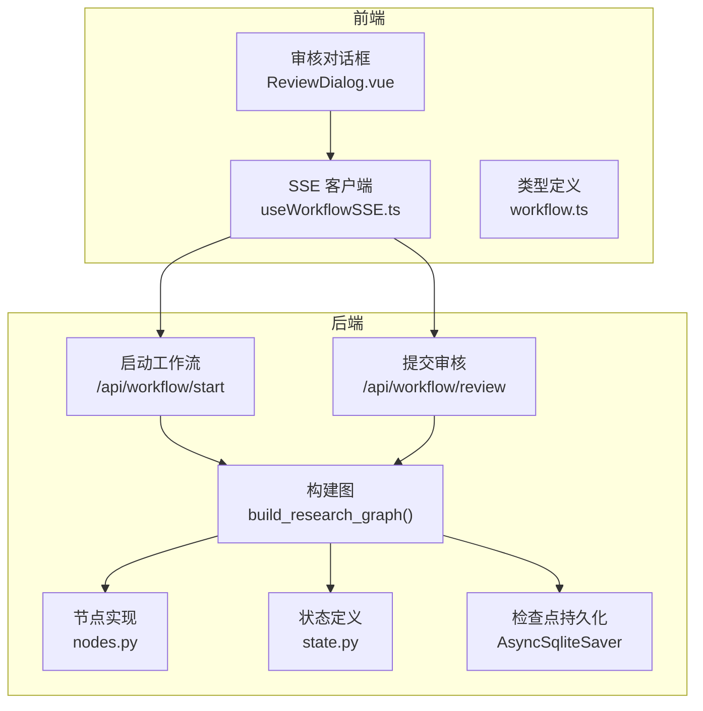
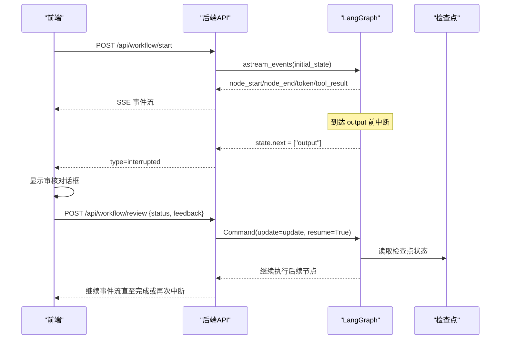
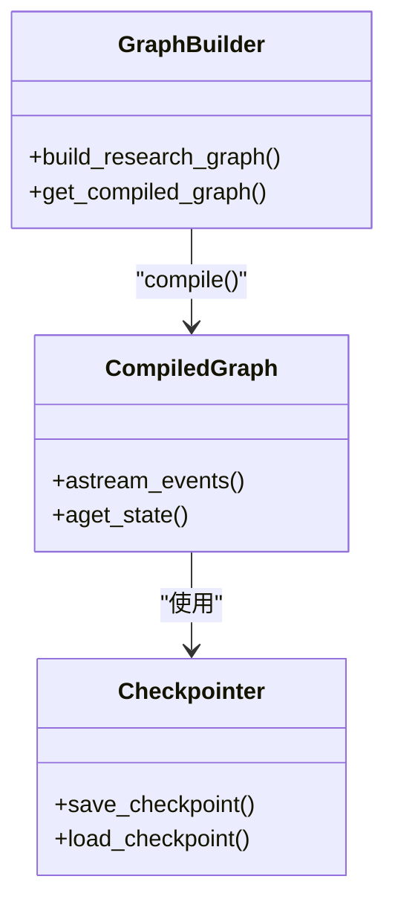
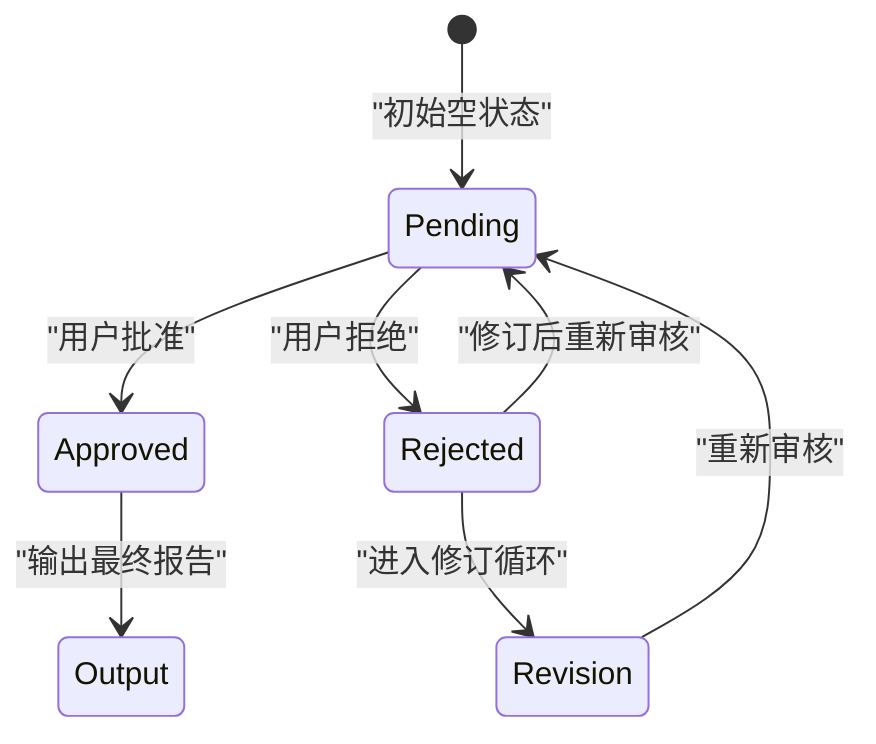
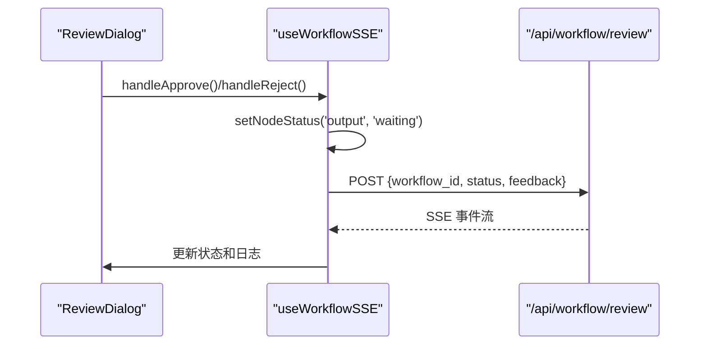
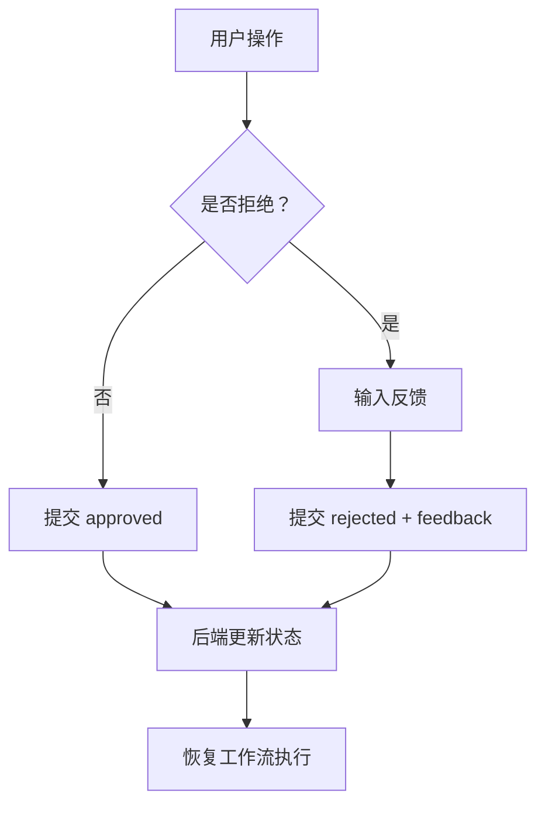
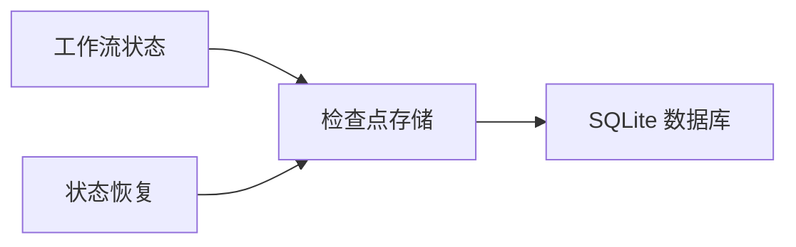
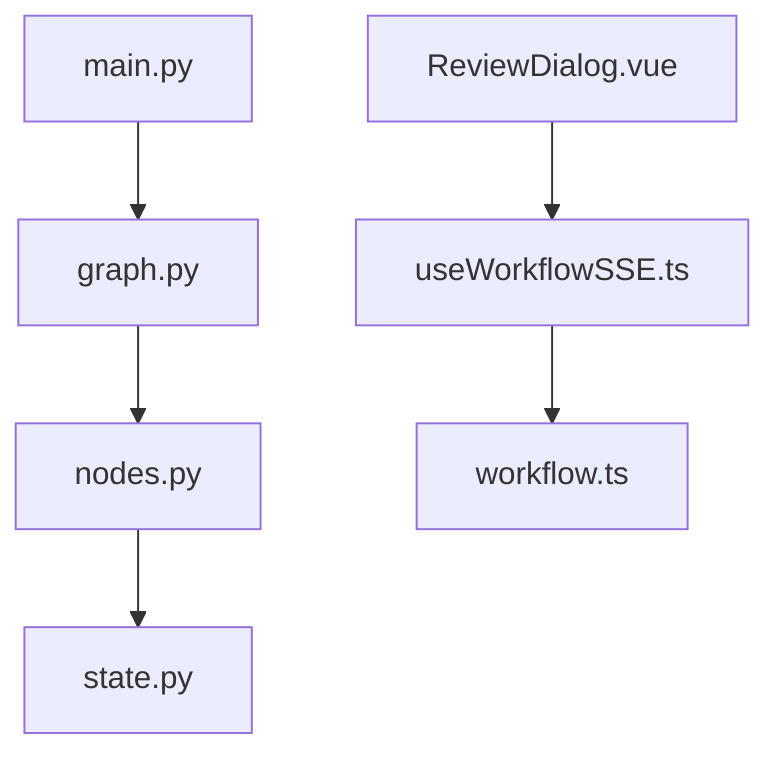

# 审核节点 (review_node)

<cite>
**本文引用的文件**
- [nodes.py](file://workflow-studio/backend/app/nodes.py)
- [graph.py](file://workflow-studio/backend/app/graph.py)
- [state.py](file://workflow-studio/backend/app/state.py)
- [main.py](file://workflow-studio/backend/app/main.py)
- [ReviewDialog.vue](file://workflow-studio/frontend/src/components/panels/ReviewDialog.vue)
- [useWorkflowSSE.ts](file://workflow-studio/frontend/src/composables/useWorkflowSSE.ts)
- [workflow.ts](file://workflow-studio/frontend/src/types/workflow.ts)
- [schemas.py](file://workflow-studio/backend/app/schemas.py)
</cite>

## 更新摘要
**所做更改**
- 更新了中断机制说明：从 `interrupt_before=["review"]` 改为 `interrupt_before=["output"]`
- 修正了审核节点位置：审核现在在输出节点前进行，而非独立的审核节点
- 更新了工作流架构图表以反映新的执行流程
- 调整了状态转换图以匹配新的实现逻辑
- 更新了前端集成说明以反映新的中断点

## 目录
1. [简介](#简介)
2. [项目结构](#项目结构)
3. [核心组件](#核心组件)
4. [架构总览](#架构总览)
5. [详细组件分析](#详细组件分析)
6. [依赖关系分析](#依赖关系分析)
7. [性能考虑](#性能考虑)
8. [故障排查指南](#故障排查指南)
9. [结论](#结论)
10. [附录](#附录)

## 简介
本技术文档聚焦于研究工作流中的"审核节点"（review_node），深入解析其 Human-in-the-loop（人在回路）机制的实现原理。重点说明：
- LangGraph 的 interrupt_before 机制如何在 output 节点前暂停工作流执行，等待人工干预
- review_status 字段的状态管理，从空字符串到 approved 或 rejected 的状态转换
- 前端审核界面的集成方式、用户决策的提交流程与后端恢复执行的交互
- 审核结果的持久化存储机制（基于检查点）
- 审核流程的自定义配置与批量审核扩展指南

**重要更新**：当前实现中，审核节点已从独立节点移除，改为在 output 节点前通过 interrupt_before 机制进行中断，审核逻辑整合到条件路由中。

## 项目结构
本项目采用前后端分离架构：
- 后端使用 FastAPI + LangGraph 构建研究工作流，提供 SSE 事件流接口用于实时状态推送与人工审核提交
- 前端使用 Vue 3 + TypeScript，通过 SSE 接收事件并渲染审核对话框，调用审核接口恢复执行

**图表来源**
- [main.py:45-116](file://workflow-studio/backend/app/main.py#L45-L116)
- [main.py:120-170](file://workflow-studio/backend/app/main.py#L120-L170)
- [graph.py:28-64](file://workflow-studio/backend/app/graph.py#L28-L64)
- [nodes.py:100-129](file://workflow-studio/backend/app/nodes.py#L100-L129)
- [state.py:5-30](file://workflow-studio/backend/app/state.py#L5-L30)
- [ReviewDialog.vue:1-54](file://workflow-studio/frontend/src/components/panels/ReviewDialog.vue#L1-L54)
- [useWorkflowSSE.ts:20-79](file://workflow-studio/frontend/src/composables/useWorkflowSSE.ts#L20-L79)

**章节来源**
- [main.py:45-116](file://workflow-studio/backend/app/main.py#L45-L116)
- [graph.py:28-64](file://workflow-studio/backend/app/graph.py#L28-L64)
- [nodes.py:100-129](file://workflow-studio/backend/app/nodes.py#L100-L129)
- [state.py:5-30](file://workflow-studio/backend/app/state.py#L5-L30)
- [ReviewDialog.vue:1-54](file://workflow-studio/frontend/src/components/panels/ReviewDialog.vue#L1-L54)
- [useWorkflowSSE.ts:20-79](file://workflow-studio/frontend/src/composables/useWorkflowSSE.ts#L20-L79)

## 核心组件
- 审核节点（review_node）：虽然已移除独立节点，但仍保留函数定义作为备用，当前审核逻辑主要通过条件路由实现
- 条件路由（route_after_review）：根据 review_status 决定下一步是输出最终报告还是进入修订循环
- 中断机制（interrupt_before）：LangGraph 编译时配置在 output 节点前暂停，等待外部注入审核结果
- 前端审核界面（ReviewDialog.vue）：提供通过/不通过按钮与反馈输入框，触发审核提交
- SSE 客户端（useWorkflowSSE.ts）：处理事件流，识别 interrupted 事件并展示审核对话框，提交审核后恢复执行
- 状态模型（ResearchState）：定义 review_status 等审核相关字段，支持 pending/approved/rejected 状态

**章节来源**
- [nodes.py:100-129](file://workflow-studio/backend/app/nodes.py#L100-L129)
- [graph.py:16-25](file://workflow-studio/backend/app/graph.py#L16-L25)
- [graph.py:96-99](file://workflow-studio/backend/app/graph.py#L96-L99)
- [state.py:22-24](file://workflow-studio/backend/app/state.py#L22-L24)
- [ReviewDialog.vue:1-54](file://workflow-studio/frontend/src/components/panels/ReviewDialog.vue#L1-L54)
- [useWorkflowSSE.ts:20-79](file://workflow-studio/frontend/src/composables/useWorkflowSSE.ts#L20-L79)

## 架构总览
审核节点的工作流整体流程如下：
1. 前端调用 /api/workflow/start 启动工作流
2. 后端构建图并在 compile 时设置 interrupt_before=["output"]
3. 工作流执行至 write 节点后，通过条件路由判断是否进入 output 节点
4. 在 output 节点前被暂停，返回 interrupted 事件
5. 前端收到 interrupted 事件后显示审核对话框
6. 用户选择通过或不通过并提交审核
7. 后端通过 Command(update=update, resume=True) 恢复执行，更新 review_status 和 review_feedback
8. 条件路由根据 review_status 决定输出或修订

**图表来源**
- [main.py:45-116](file://workflow-studio/backend/app/main.py#L45-L116)
- [main.py:120-170](file://workflow-studio/backend/app/main.py#L120-L170)
- [graph.py:96-99](file://workflow-studio/backend/app/graph.py#L96-L99)

## 详细组件分析

### 审核节点（review_node）实现逻辑
虽然当前实现中审核节点已从独立节点移除，但函数定义仍保留作为备用。当前审核逻辑主要通过以下方式实现：
- 条件路由（route_after_review）：在 write 节点后根据 review_status 决定流向
- 中断机制：在 output 节点前暂停，等待人工审核
- 状态管理：通过 review_status 字段控制审核流程

**更新**：当前实现不再使用独立的 review_node 函数，而是将审核逻辑整合到条件路由和中断机制中。

**章节来源**
- [nodes.py:100-108](file://workflow-studio/backend/app/nodes.py#L100-L108)
- [graph.py:16-25](file://workflow-studio/backend/app/graph.py#L16-L25)

### LangGraph 中断机制（interrupt_before）
- 配置位置：在编译图时通过 interrupt_before=["output"] 指定在 output 节点前暂停
- 效果：工作流执行到 output 节点前会停止，state.next 指向待执行节点
- 恢复方式：通过 Command(update=update, resume=True) 注入审核结果并恢复执行
- 持久化：使用 AsyncSqliteSaver 保存检查点，支持页面刷新后恢复

**图表来源**
- [graph.py:28-64](file://workflow-studio/backend/app/graph.py#L28-L64)
- [graph.py:84-101](file://workflow-studio/backend/app/graph.py#L84-L101)

**章节来源**
- [graph.py:96-99](file://workflow-studio/backend/app/graph.py#L96-L99)
- [main.py:37-41](file://workflow-studio/backend/app/main.py#L37-L41)

### 审核状态管理（review_status）
- 初始状态：空字符串 ""
- 转换规则：
  - "" → approved：用户点击"通过"，状态变为 approved，路由到 output 节点
  - "" → rejected：用户点击"不通过"并提供反馈，状态变为 rejected，路由到 revision 节点
  - rejected → pending：修订后重新搜索和分析，再次进入审核流程
- 防循环：iteration_count 限制最多3轮修订，超过则强制输出

**图表来源**
- [state.py:22-24](file://workflow-studio/backend/app/state.py#L22-L24)
- [graph.py:16-25](file://workflow-studio/backend/app/graph.py#L16-L25)

**章节来源**
- [state.py:22-24](file://workflow-studio/backend/app/state.py#L22-L24)
- [graph.py:16-25](file://workflow-studio/backend/app/graph.py#L16-L25)

### 前端审核界面集成
- ReviewDialog.vue：提供审核输入框和通过/不通过按钮
- useWorkflowSSE.ts：处理 interrupted 事件，显示审核对话框，调用 submitReview 方法
- workflow.ts：定义 NodeStatus、SSEEvent 等类型，确保类型安全

**图表来源**
- [ReviewDialog.vue:1-54](file://workflow-studio/frontend/src/components/panels/ReviewDialog.vue#L1-L54)
- [useWorkflowSSE.ts:124-165](file://workflow-studio/frontend/src/composables/useWorkflowSSE.ts#L124-L165)

**章节来源**
- [ReviewDialog.vue:1-54](file://workflow-studio/frontend/src/components/panels/ReviewDialog.vue#L1-L54)
- [useWorkflowSSE.ts:20-79](file://workflow-studio/frontend/src/composables/useWorkflowSSE.ts#L20-L79)
- [workflow.ts:1-66](file://workflow-studio/frontend/src/types/workflow.ts#L1-L66)

### 用户决策提交流程
1. 用户在前端选择"通过"或"不通过"
2. 如果是"不通过"，必须填写反馈内容
3. 前端调用 /api/workflow/review 提交审核结果
4. 后端使用 Command(update=update, resume=True) 恢复执行
5. 工作流根据新状态继续执行或再次中断

**图表来源**
- [ReviewDialog.vue:42-52](file://workflow-studio/frontend/src/components/panels/ReviewDialog.vue#L42-L52)
- [main.py:120-170](file://workflow-studio/backend/app/main.py#L120-L170)

**章节来源**
- [ReviewDialog.vue:42-52](file://workflow-studio/frontend/src/components/panels/ReviewDialog.vue#L42-L52)
- [main.py:120-170](file://workflow-studio/backend/app/main.py#L120-L170)

### 审核结果持久化存储
- 检查点机制：使用 AsyncSqliteSaver 保存工作流状态，包括 review_status 和 review_feedback
- 恢复能力：页面刷新后可通过 /api/workflow/state/{workflow_id} 获取当前状态
- 线程隔离：每个工作流有独立的 thread_id，确保状态隔离

**图表来源**
- [graph.py:67-82](file://workflow-studio/backend/app/graph.py#L67-L82)
- [main.py:173-189](file://workflow-studio/backend/app/main.py#L173-L189)

**章节来源**
- [graph.py:67-82](file://workflow-studio/backend/app/graph.py#L67-L82)
- [main.py:173-189](file://workflow-studio/backend/app/main.py#L173-L189)

## 依赖关系分析
- nodes.py 依赖 state.py 中的 ResearchState 类型定义
- graph.py 依赖 nodes.py 中的各个节点函数
- main.py 依赖 graph.py 中的图构建和编译
- 前端依赖后端提供的 SSE 接口和类型定义

**图表来源**
- [nodes.py:1-8](file://workflow-studio/backend/app/nodes.py#L1-L8)
- [graph.py:1-8](file://workflow-studio/backend/app/graph.py#L1-L8)
- [main.py:1-13](file://workflow-studio/backend/app/main.py#L1-L13)
- [ReviewDialog.vue:32-38](file://workflow-studio/frontend/src/components/panels/ReviewDialog.vue#L32-L38)
- [useWorkflowSSE.ts:1-3](file://workflow-studio/frontend/src/composables/useWorkflowSSE.ts#L1-L3)
- [workflow.ts:1-66](file://workflow-studio/frontend/src/types/workflow.ts#L1-L66)

**章节来源**
- [nodes.py:1-8](file://workflow-studio/backend/app/nodes.py#L1-L8)
- [graph.py:1-8](file://workflow-studio/backend/app/graph.py#L1-L8)
- [main.py:1-13](file://workflow-studio/backend/app/main.py#L1-L13)

## 性能考虑
- 检查点存储：SQLite 适用于开发环境，生产环境建议迁移到 PostgreSQL 以提高并发性能
- 中断频率：频繁的中断会增加状态同步开销，应合理设计审核节点位置
- 流式传输：SSE 事件流适合实时交互，但需注意网络稳定性和错误重连机制
- 内存占用：大量工作流实例同时运行时，需监控内存使用情况

## 故障排查指南
- 工作流未中断：检查 interrupt_before 配置是否正确，确认 output 节点已添加到图中
- 审核提交失败：验证 workflow_id 是否正确，检查网络连接和后端服务状态
- 状态不同步：确认检查点存储正常，尝试重启服务清理临时文件
- 前端无响应：检查 SSE 连接是否建立，查看浏览器控制台错误信息

**章节来源**
- [graph.py:96-99](file://workflow-studio/backend/app/graph.py#L96-L99)
- [main.py:120-170](file://workflow-studio/backend/app/main.py#L120-L170)
- [useWorkflowSSE.ts:48-79](file://workflow-studio/frontend/src/composables/useWorkflowSSE.ts#L48-L79)

## 结论
审核节点通过 LangGraph 的 interrupt_before 机制实现了高效的人机协作流程。当前实现将审核逻辑整合到条件路由中，在 output 节点前进行中断，避免了独立节点的复杂性。review_status 字段的状态管理确保了审核流程的可控性和可追溯性。前端审核界面提供了直观的用户交互体验，SSE 事件流保证了实时状态同步。检查点机制支持工作流的持久化和恢复，为复杂业务流程提供了可靠的基础设施。

## 附录

### 自定义配置指南
- 修改中断位置：在 graph.py 中调整 interrupt_before 参数
- 自定义审核规则：在 route_after_review 中添加新的条件分支
- 扩展审核字段：在 state.py 中添加新的审核相关字段

### 批量审核功能扩展
- 批量提交：在前端增加多选功能，支持多个工作流同时审核
- 模板审核：预定义审核模板，提高审核效率
- 审核历史：记录每次审核的操作历史和结果变更

**章节来源**
- [graph.py:96-99](file://workflow-studio/backend/app/graph.py#L96-L99)
- [graph.py:16-25](file://workflow-studio/backend/app/graph.py#L16-L25)
- [state.py:22-24](file://workflow-studio/backend/app/state.py#L22-L24)