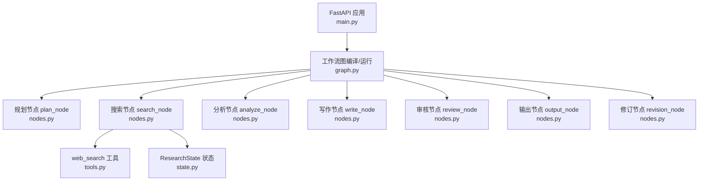
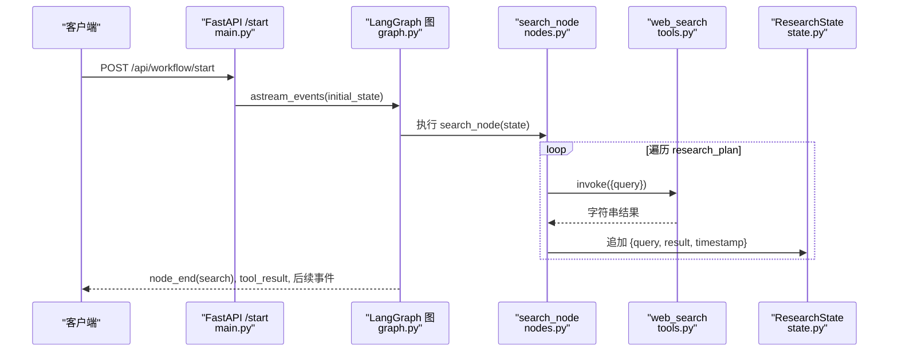
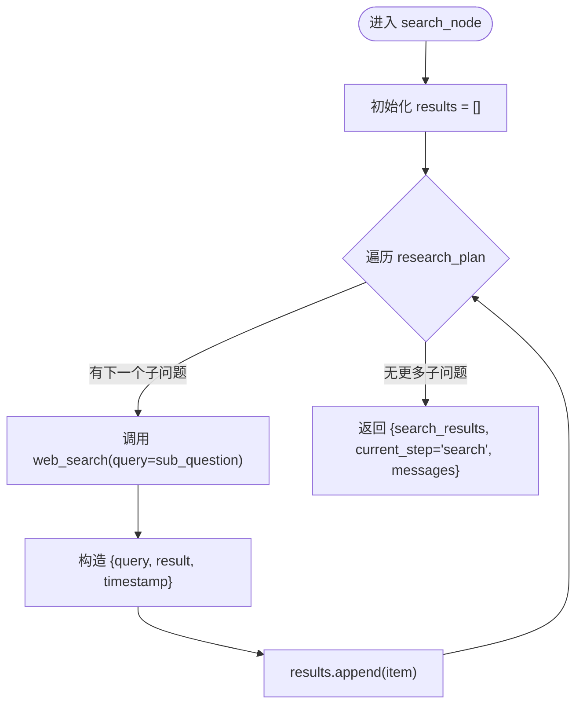
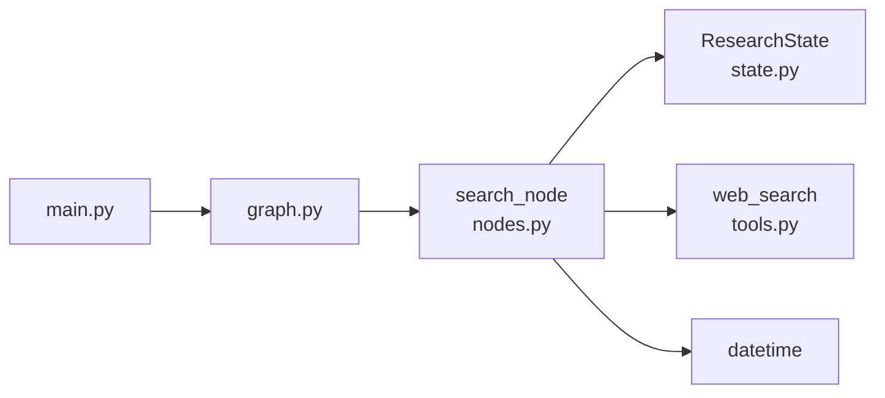

# 搜索节点 (search_node)

<cite>
**本文引用的文件**
- [nodes.py](file://workflow-studio/backend/app/nodes.py)
- [tools.py](file://workflow-studio/backend/app/tools.py)
- [state.py](file://workflow-studio/backend/app/state.py)
- [graph.py](file://workflow-studio/backend/app/graph.py)
- [main.py](file://workflow-studio/backend/app/main.py)
</cite>

## 目录
1. [简介](#简介)
2. [项目结构](#项目结构)
3. [核心组件](#核心组件)
4. [架构总览](#架构总览)
5. [详细组件分析](#详细组件分析)
6. [依赖关系分析](#依赖关系分析)
7. [性能与并发优化](#性能与并发优化)
8. [故障排查指南](#故障排查指南)
9. [结论](#结论)
10. [附录](#附录)

## 简介
本技术文档聚焦于研究工作流中的“搜索节点”（search_node），深入解析其实现逻辑：如何遍历 research_plan 中的每个子问题并执行网络搜索；web_search 工具的调用方式、搜索结果的数据结构；时间戳记录机制；search_results 数组的构建过程；错误处理策略；并发搜索优化与性能调优建议；以及搜索工具扩展指南和测试结果验证方法。

## 项目结构
后端采用 FastAPI 提供 API，LangGraph 编排工作流图，状态由 TypedDict 定义，节点函数封装业务逻辑，工具模块提供 web_search 等能力。搜索节点位于 nodes.py，工具实现在 tools.py，状态定义在 state.py，工作流图在 graph.py，API 入口在 main.py。

图表来源
- [main.py:35-103](file://workflow-studio/backend/app/main.py#L35-L103)
- [graph.py:23-62](file://workflow-studio/backend/app/graph.py#L23-L62)
- [nodes.py:18-60](file://workflow-studio/backend/app/nodes.py#L18-L60)
- [tools.py:4-19](file://workflow-studio/backend/app/tools.py#L4-L19)
- [state.py:5-30](file://workflow-studio/backend/app/state.py#L5-L30)

章节来源
- [main.py:35-103](file://workflow-studio/backend/app/main.py#L35-L103)
- [graph.py:23-62](file://workflow-studio/backend/app/graph.py#L23-L62)
- [nodes.py:18-60](file://workflow-studio/backend/app/nodes.py#L18-L60)
- [tools.py:4-19](file://workflow-studio/backend/app/tools.py#L4-L19)
- [state.py:5-30](file://workflow-studio/backend/app/state.py#L5-L30)

## 核心组件
- 搜索节点 search_node：遍历 research_plan 中的每个子问题，调用 web_search 工具，收集结果并附带时间戳，最终写入 search_results。
- 搜索工具 web_search：当前为模拟实现，返回与查询相关的文本片段；可替换为真实搜索引擎。
- 状态 ResearchState：定义 search_results 字段类型为 list[dict]，用于存储每次搜索的结果条目。
- 工作流图：将 search_node 接入 plan -> search -> analyze -> write -> review -> output/revision 的流程中。

章节来源
- [nodes.py:43-60](file://workflow-studio/backend/app/nodes.py#L43-L60)
- [tools.py:4-19](file://workflow-studio/backend/app/tools.py#L4-L19)
- [state.py:14-18](file://workflow-studio/backend/app/state.py#L14-L18)
- [graph.py:29-43](file://workflow-studio/backend/app/graph.py#L29-L43)

## 架构总览
搜索节点在执行时从状态中读取 research_plan，逐个子问题调用 web_search，并将结果以统一结构追加到 search_results。随后工作流进入分析节点，综合所有搜索结果生成分析内容。

图表来源
- [main.py:35-103](file://workflow-studio/backend/app/main.py#L35-L103)
- [graph.py:23-62](file://workflow-studio/backend/app/graph.py#L23-L62)
- [nodes.py:43-60](file://workflow-studio/backend/app/nodes.py#L43-L60)
- [tools.py:4-19](file://workflow-studio/backend/app/tools.py#L4-L19)
- [state.py:14-18](file://workflow-studio/backend/app/state.py#L14-L18)

## 详细组件分析

### search_node 实现逻辑
- 输入：ResearchState，包含 research_plan（子问题列表）。
- 处理：
  - 初始化 results 列表。
  - 遍历 research_plan 中的每个 sub_question。
  - 调用 web_search.invoke({"query": sub_question}) 获取结果。
  - 构造结果项：{query, result, timestamp}，其中 timestamp 使用当前时间的 ISO 格式。
  - 将结果项追加到 results。
- 输出：
  - search_results: 结果数组。
  - current_step: "search"。
  - messages: 一条消息提示搜索完成及结果数量。

图表来源
- [nodes.py:43-60](file://workflow-studio/backend/app/nodes.py#L43-L60)

章节来源
- [nodes.py:43-60](file://workflow-studio/backend/app/nodes.py#L43-L60)

### web_search 工具调用方式与数据结构
- 调用方式：通过 LangChain 的 @tool 装饰器定义，并在 search_node 中以 .invoke({"query": ...}) 同步调用。
- 返回值：字符串。当前实现为模拟数据，根据 query 关键词匹配返回相关段落或通用描述。
- 数据结构：search_results 中的每个条目包含：
  - query: 原始查询字符串。
  - result: web_search 返回的字符串结果。
  - timestamp: 搜索发生时的 ISO 时间戳。

章节来源
- [tools.py:4-19](file://workflow-studio/backend/app/tools.py#L4-L19)
- [nodes.py:43-60](file://workflow-studio/backend/app/nodes.py#L43-L60)
- [state.py:14-18](file://workflow-studio/backend/app/state.py#L14-L18)

### 时间戳记录机制
- 在每次搜索后，使用 datetime.now().isoformat() 生成时间戳，并作为结果项的 timestamp 字段保存。
- 该机制便于追踪每次搜索的执行时间，支持后续分析与审计。

章节来源
- [nodes.py:43-60](file://workflow-studio/backend/app/nodes.py#L43-L60)

### search_results 数组构建过程
- 初始为空列表。
- 每轮循环构造一个字典对象，包含 query、result、timestamp。
- 使用 append 追加至 results。
- 最终将 results 赋值给状态的 search_results 字段。

章节来源
- [nodes.py:43-60](file://workflow-studio/backend/app/nodes.py#L43-L60)
- [state.py:14-18](file://workflow-studio/backend/app/state.py#L14-L18)

### 错误处理
- 当前实现未对 web_search 异常进行捕获。若工具抛出异常，将导致节点执行失败，工作流中断。
- 建议在 search_node 中对 web_search 调用增加 try/except，记录错误信息并返回降级结果（如空字符串或占位文本），以保证流程继续。

章节来源
- [nodes.py:43-60](file://workflow-studio/backend/app/nodes.py#L43-L60)

### 并发搜索优化与性能调优
- 现状：search_node 顺序遍历并串行调用 web_search，适合小规模子问题。
- 优化方向：
  - 并发执行：使用 asyncio.gather 或线程池并发调用 web_search，提升吞吐。
  - 限流与重试：对 web_search 增加速率限制与指数退避重试，避免外部服务限流。
  - 缓存：对相同 query 的结果进行本地缓存，减少重复请求。
  - 超时控制：为 web_search 设置超时，防止阻塞。
  - 日志与指标：记录每次搜索耗时、错误率，便于监控与调优。

章节来源
- [nodes.py:43-60](file://workflow-studio/backend/app/nodes.py#L43-L60)

### 搜索工具扩展指南
- 替换 web_search 实现：
  - 保持 @tool 装饰器与签名不变，确保兼容现有调用。
  - 集成真实搜索引擎（如 Tavily、SerpAPI、Bing Search），返回字符串摘要或结构化 JSON 字符串。
  - 若返回结构化数据，可在 search_node 中解析并格式化后再存入 result。
- 新增学术搜索 academic_search：
  - 已在 tools.py 中定义，可按需在工作流中引入，或在 search_node 中并行调用。
- 配置管理：
  - 将 API Key、Base URL、超时等配置集中管理，便于切换环境。

章节来源
- [tools.py:4-26](file://workflow-studio/backend/app/tools.py#L4-L26)
- [nodes.py:43-60](file://workflow-studio/backend/app/nodes.py#L43-L60)

### 测试结果验证方法
- 单元测试：
  - 针对 search_node 传入不同 research_plan，断言 search_results 长度与结构正确。
  - 针对 web_search 注入不同 query，断言返回非空且包含预期关键词。
- 集成测试：
  - 启动 FastAPI 服务，调用 /api/workflow/start，检查 SSE 事件中的 node_start/node_end/tool_result。
  - 检查工作流完成后 search_results 是否完整，timestamp 是否递增。
- 性能测试：
  - 构造大量子问题，评估串行与并发实现的耗时差异。
  - 观察内存占用与错误率。

章节来源
- [main.py:35-103](file://workflow-studio/backend/app/main.py#L35-L103)
- [nodes.py:43-60](file://workflow-studio/backend/app/nodes.py#L43-L60)
- [tools.py:4-26](file://workflow-studio/backend/app/tools.py#L4-L26)

## 依赖关系分析
- search_node 依赖：
  - ResearchState：提供 research_plan 与 search_results。
  - web_search 工具：执行实际搜索。
  - datetime：生成时间戳。
- 工作流依赖：
  - graph.py 将 search_node 与其他节点串联，形成线性流程与条件分支。
- API 依赖：
  - main.py 通过 LangGraph 的事件流暴露节点执行进度与工具结果。

图表来源
- [nodes.py:43-60](file://workflow-studio/backend/app/nodes.py#L43-L60)
- [state.py:5-30](file://workflow-studio/backend/app/state.py#L5-L30)
- [tools.py:4-19](file://workflow-studio/backend/app/tools.py#L4-L19)
- [graph.py:23-62](file://workflow-studio/backend/app/graph.py#L23-L62)
- [main.py:35-103](file://workflow-studio/backend/app/main.py#L35-L103)

章节来源
- [nodes.py:43-60](file://workflow-studio/backend/app/nodes.py#L43-L60)
- [state.py:5-30](file://workflow-studio/backend/app/state.py#L5-L30)
- [tools.py:4-19](file://workflow-studio/backend/app/tools.py#L4-L19)
- [graph.py:23-62](file://workflow-studio/backend/app/graph.py#L23-L62)
- [main.py:35-103](file://workflow-studio/backend/app/main.py#L35-L103)

## 性能与并发优化
- 串行 vs 并发：
  - 当前为串行遍历，简单可靠但吞吐有限。
  - 并发方案建议使用 asyncio.gather 或 ThreadPoolExecutor，结合任务队列与限速。
- 资源控制：
  - 设置最大并发数，避免压垮外部搜索服务。
  - 为每个任务设置超时，及时释放资源。
- 缓存策略：
  - 基于 query 的 LRU 缓存，命中则跳过网络请求。
- 监控与告警：
  - 记录每次搜索的开始/结束时间、耗时、错误码。
  - 当错误率超过阈值时触发告警。

[本节为通用性能讨论，不直接分析具体代码文件]

## 故障排查指南
- 常见问题：
  - web_search 抛异常：需在 search_node 中捕获并记录，避免工作流中断。
  - 结果缺失：检查 research_plan 是否为空或包含无效子问题。
  - 时间戳异常：确认系统时间与时区设置。
- 定位手段：
  - 查看 SSE 事件中的 tool_result 与 node_end 输出。
  - 检查状态中的 search_results 与 messages。
- 恢复策略：
  - 对失败子问题实施重试或降级（返回默认摘要）。
  - 必要时回滚到上一节点重新执行。

章节来源
- [nodes.py:43-60](file://workflow-studio/backend/app/nodes.py#L43-L60)
- [main.py:35-103](file://workflow-studio/backend/app/main.py#L35-L103)

## 结论
search_node 实现了按子问题顺序执行网络搜索的核心能力，并通过统一的数据结构与时间戳记录保障结果的可追溯性。当前实现简洁稳定，适合小规模场景。面向生产环境，建议引入并发执行、限流重试、缓存与完善的错误处理，以提升鲁棒性与性能。同时，遵循工具接口约定可扩展多种搜索源，满足多样化检索需求。

## 附录
- 关键路径参考：
  - 搜索节点实现：[nodes.py:43-60](file://workflow-studio/backend/app/nodes.py#L43-L60)
  - 搜索工具实现：[tools.py:4-26](file://workflow-studio/backend/app/tools.py#L4-L26)
  - 状态定义：[state.py:5-30](file://workflow-studio/backend/app/state.py#L5-L30)
  - 工作流图：[graph.py:23-62](file://workflow-studio/backend/app/graph.py#L23-L62)
  - API 事件流：[main.py:35-103](file://workflow-studio/backend/app/main.py#L35-L103)