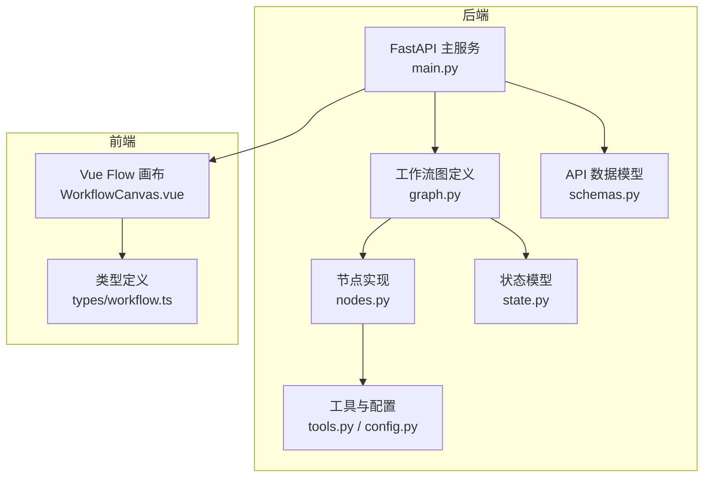
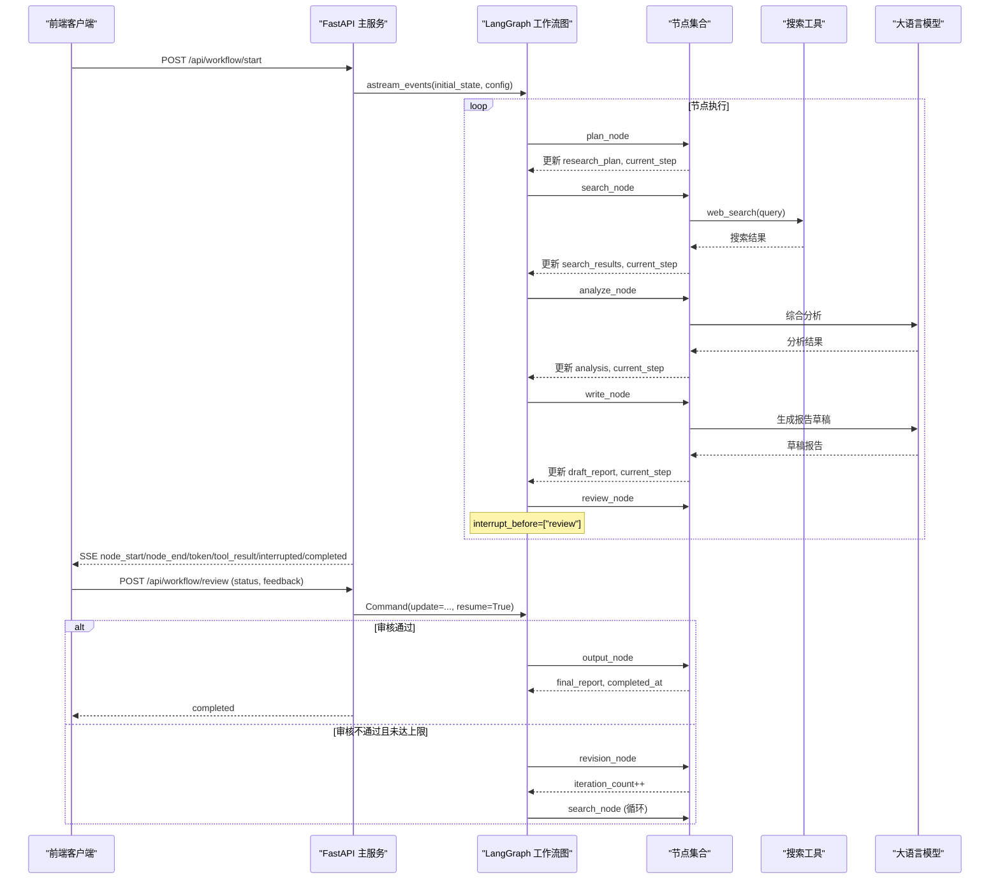
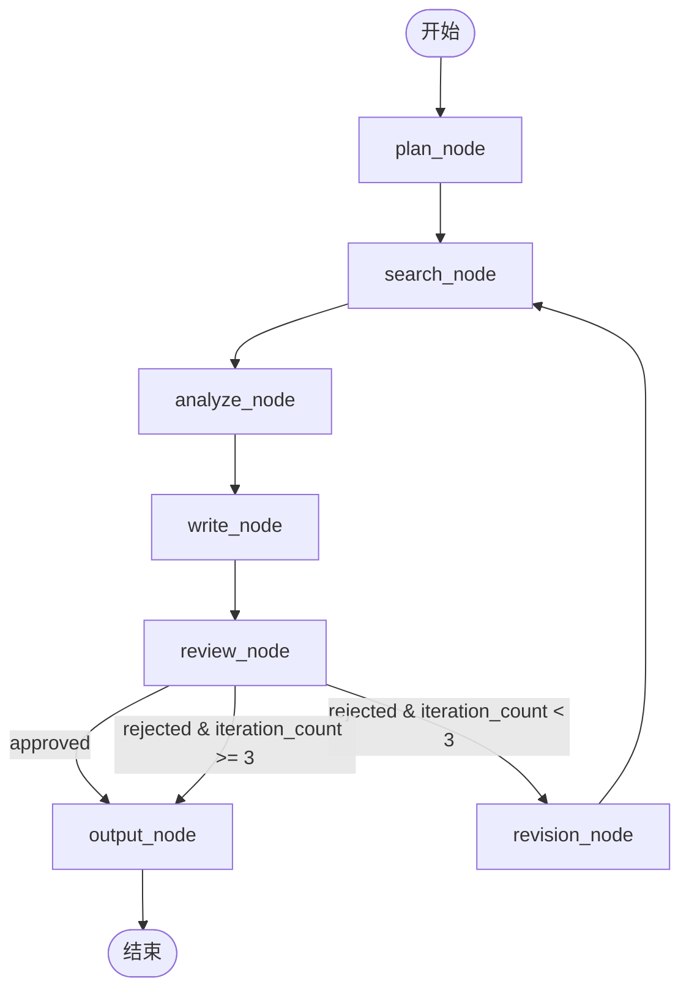
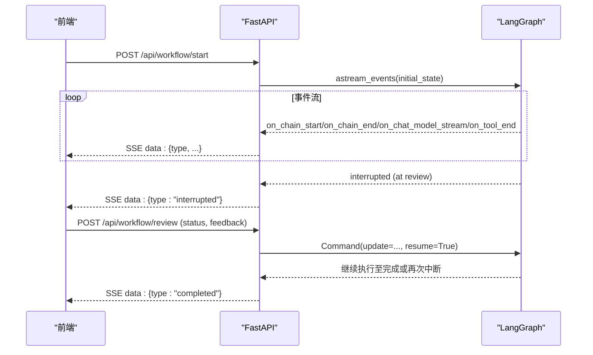
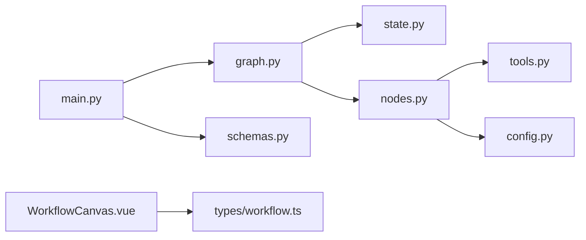

# 节点系统架构

<cite>
**本文引用的文件**
- [nodes.py](file://workflow-studio/backend/app/nodes.py)
- [state.py](file://workflow-studio/backend/app/state.py)
- [graph.py](file://workflow-studio/backend/app/graph.py)
- [main.py](file://workflow-studio/backend/app/main.py)
- [schemas.py](file://workflow-studio/backend/app/schemas.py)
- [tools.py](file://workflow-studio/backend/app/tools.py)
- [config.py](file://workflow-studio/backend/app/config.py)
- [WorkflowCanvas.vue](file://workflow-studio/frontend/src/components/WorkflowCanvas.vue)
- [workflow.ts](file://workflow-studio/frontend/src/types/workflow.ts)
- [README.md](file://workflow-studio/README.md)
</cite>

## 目录
1. [简介](#简介)
2. [项目结构](#项目结构)
3. [核心组件](#核心组件)
4. [架构总览](#架构总览)
5. [详细组件分析](#详细组件分析)
6. [依赖关系分析](#依赖关系分析)
7. [性能考虑](#性能考虑)
8. [故障排查指南](#故障排查指南)
9. [结论](#结论)
10. [附录](#附录)

## 简介
本工作流节点系统基于 LangGraph 构建，提供“规划 → 搜索 → 分析 → 写作 → 审核 → 输出”的可视化研究工作流。系统包含七个核心节点：plan_node（规划）、search_node（搜索）、analyze_node（分析）、write_node（写作）、review_node（审核）、revision_node（修订）和 output_node（输出）。通过 FastAPI 暴露 API，使用 SSE 实时推送执行事件；前端以 Vue Flow 渲染图与状态，支持人工审核中断与检查点恢复。

## 项目结构
后端采用模块化设计：
- 入口与 API：FastAPI 应用、SSE 事件流、工作流启动与恢复
- 工作流定义：LangGraph StateGraph、条件路由、编译与检查点
- 节点实现：各业务节点的异步函数
- 状态模型：TypedDict 描述全局状态字段与类型
- 工具与配置：搜索工具、LLM 配置
- 数据模型：Pydantic 请求校验

前端以 Vue Flow 画布展示节点与边，结合 Pinia 管理状态，并通过 composable 订阅 SSE 事件驱动 UI。

图表来源
- [main.py:14-31](file://workflow-studio/backend/app/main.py#L14-L31)
- [graph.py:23-77](file://workflow-studio/backend/app/graph.py#L23-L77)
- [nodes.py:18-128](file://workflow-studio/backend/app/nodes.py#L18-L128)
- [state.py:5-29](file://workflow-studio/backend/app/state.py#L5-L29)
- [tools.py:4-25](file://workflow-studio/backend/app/tools.py#L4-L25)
- [config.py:6-8](file://workflow-studio/backend/app/config.py#L6-L8)
- [schemas.py:4-11](file://workflow-studio/backend/app/schemas.py#L4-L11)
- [WorkflowCanvas.vue:55-74](file://workflow-studio/frontend/src/components/WorkflowCanvas.vue#L55-L74)
- [workflow.ts:3-63](file://workflow-studio/frontend/src/types/workflow.ts#L3-L63)

章节来源
- [README.md:15-21](file://workflow-studio/README.md#L15-L21)
- [main.py:14-31](file://workflow-studio/backend/app/main.py#L14-L31)
- [graph.py:23-77](file://workflow-studio/backend/app/graph.py#L23-L77)

## 核心组件
- 状态模型 ResearchState：定义消息历史、控制字段、研究内容、审核字段与元数据，作为节点间共享上下文。
- 节点函数：每个节点为异步函数，接收 ResearchState，返回增量更新字典，用于合并到状态中。
- 工作流图：StateGraph 添加节点与边，定义线性流程与条件分支，并在 review 前中断等待人工输入。
- API 层：启动工作流、提交审核、获取状态、获取图结构；通过 SSE 推送事件。
- 工具与 LLM：web_search/academic_search 工具，ChatOpenAI 调用。
- 前端：Vue Flow 渲染图，Pinia 管理状态，composable 处理 SSE 事件。

章节来源
- [state.py:5-29](file://workflow-studio/backend/app/state.py#L5-L29)
- [nodes.py:18-128](file://workflow-studio/backend/app/nodes.py#L18-L128)
- [graph.py:23-77](file://workflow-studio/backend/app/graph.py#L23-L77)
- [main.py:35-103](file://workflow-studio/backend/app/main.py#L35-L103)
- [tools.py:4-25](file://workflow-studio/backend/app/tools.py#L4-L25)
- [config.py:6-8](file://workflow-studio/backend/app/config.py#L6-L8)
- [WorkflowCanvas.vue:55-74](file://workflow-studio/frontend/src/components/WorkflowCanvas.vue#L55-L74)
- [workflow.ts:3-63](file://workflow-studio/frontend/src/types/workflow.ts#L3-L63)

## 架构总览
下图展示了从用户提问到最终输出的完整执行路径，包括条件分支与循环机制。

图表来源
- [main.py:35-103](file://workflow-studio/backend/app/main.py#L35-L103)
- [main.py:107-154](file://workflow-studio/backend/app/main.py#L107-L154)
- [graph.py:23-77](file://workflow-studio/backend/app/graph.py#L23-L77)
- [nodes.py:18-128](file://workflow-studio/backend/app/nodes.py#L18-L128)
- [tools.py:4-25](file://workflow-studio/backend/app/tools.py#L4-L25)

## 详细组件分析

### 节点接口规范
- 统一签名：async def <node>_node(state: ResearchState) -> dict
- 输入：ResearchState 当前状态（消息历史、控制字段、研究内容、审核字段等）
- 输出：增量更新字典，键名需与 ResearchState 字段对应，用于状态合并
- 通用字段：
  - current_step：标识当前执行节点
  - messages：追加一条 AI 消息，便于前端日志展示
- 错误处理：节点内部捕获异常并降级（如 JSON 解析失败回退为原始问题），避免中断工作流

章节来源
- [state.py:5-29](file://workflow-studio/backend/app/state.py#L5-L29)
- [nodes.py:18-128](file://workflow-studio/backend/app/nodes.py#L18-L128)

### 节点实现模式与职责
- plan_node（规划）
  - 职责：将原始问题拆解为若干子问题
  - 输入：original_question
  - 输出：research_plan、current_step="plan"、messages
  - 错误处理：JSON 解析失败时降级为仅包含原始问题的列表
- search_node（搜索）
  - 职责：对每个子问题执行搜索
  - 输入：research_plan
  - 输出：search_results（含 query、result、timestamp）、current_step="search"、messages
  - 外部依赖：web_search 工具
- analyze_node（分析）
  - 职责：综合搜索结果进行结构化分析
  - 输入：original_question、search_results
  - 输出：analysis、current_step="analyze"、messages
  - 外部依赖：LLM
- write_node（写作）
  - 职责：基于分析生成研究报告草稿，可融合审核反馈
  - 输入：original_question、analysis、review_feedback（可选）
  - 输出：draft_report、current_step="write"、messages
  - 外部依赖：LLM
- review_node（审核）
  - 职责：Human-in-the-loop 暂停点，等待人工审核
  - 输出：current_step="review"、review_status="pending"、messages
  - 行为：在 graph.compile 中设置 interrupt_before=["review"]
- revision_node（修订）
  - 职责：根据反馈决定是否重新搜索，防止无限循环
  - 输出：iteration_count++、current_step="revision"、messages
- output_node（输出）
  - 职责：产出最终报告
  - 输入：draft_report
  - 输出：final_report、current_step="output"、completed_at、messages

章节来源
- [nodes.py:18-128](file://workflow-studio/backend/app/nodes.py#L18-L128)
- [graph.py:65-77](file://workflow-studio/backend/app/graph.py#L65-L77)

### 状态更新模式
- 状态模型 ResearchState 使用 TypedDict 定义字段类型，消息历史使用 add_messages reducer 自动追加
- 节点返回增量更新，由 LangGraph 合并到全局状态
- 控制字段：
  - current_step：记录当前节点
  - iteration_count：限制修订轮次，防止无限循环
- 审核字段：
  - review_status：pending/approved/rejected
  - review_feedback：审核意见，传递给 write_node 用于改进草稿

章节来源
- [state.py:5-29](file://workflow-studio/backend/app/state.py#L5-L29)
- [graph.py:11-20](file://workflow-studio/backend/app/graph.py#L11-L20)

### 错误处理机制
- 节点级错误：
  - JSON 解析失败降级为默认值（plan_node）
  - 工具调用失败或空结果时仍继续流程（search_node）
- 工作流级错误：
  - API 层 try/except 捕获异常，通过 SSE 推送 error 事件
  - 检查点持久化确保中断后恢复
- 防无限循环：
  - route_after_review 在 rejected 且 iteration_count >= 3 时强制输出

章节来源
- [nodes.py:29-34](file://workflow-studio/backend/app/nodes.py#L29-L34)
- [main.py:96-97](file://workflow-studio/backend/app/main.py#L96-L97)
- [graph.py:11-20](file://workflow-studio/backend/app/graph.py#L11-L20)

### 节点间依赖关系与数据流转
- 顺序依赖：plan → search → analyze → write → review → output
- 条件分支：review 后根据 review_status 决定 output 或 revision
- 循环依赖：revision → search（最多 3 轮）
- 数据流转：
  - original_question 贯穿全链路
  - research_plan 由 plan 产生，供 search 使用
  - search_results 由 search 产生，供 analyze 使用
  - analysis 由 analyze 产生，供 write 使用
  - draft_report 由 write 产生，经 review 决策后成为 final_report

图表来源
- [graph.py:38-60](file://workflow-studio/backend/app/graph.py#L38-L60)
- [graph.py:11-20](file://workflow-studio/backend/app/graph.py#L11-L20)

### 异步执行模型
- 所有节点均为 async 函数，配合 LangGraph 的 astream_events 实现异步事件流
- 前端通过 SSE 订阅 node_start、node_end、token、tool_result、interrupted、completed、error 事件
- 审核中断：graph.compile 设置 interrupt_before=["review"]，在 review 节点前暂停，等待 /api/workflow/review 恢复

图表来源
- [main.py:60-103](file://workflow-studio/backend/app/main.py#L60-L103)
- [main.py:119-154](file://workflow-studio/backend/app/main.py#L119-L154)
- [graph.py:65-77](file://workflow-studio/backend/app/graph.py#L65-L77)

### 自定义节点开发指南
- 新增节点步骤：
  1. 在 nodes.py 中定义 async 函数，遵循统一签名与返回格式
  2. 在 graph.py 的 build_research_graph 中添加节点与边
  3. 如需条件分支，实现路由函数并注册 add_conditional_edges
  4. 在前端 WorkflowCanvas.vue 中增加节点布局与边定义
  5. 在 types/workflow.ts 中扩展 NodeType 与相关类型
- 最佳实践：
  - 保持节点幂等性，避免副作用
  - 使用 add_messages 追加消息，便于日志追踪
  - 对外部依赖（LLM、工具）做超时与重试策略
  - 严格校验输入，失败时降级而非抛出异常

章节来源
- [nodes.py:18-128](file://workflow-studio/backend/app/nodes.py#L18-L128)
- [graph.py:23-60](file://workflow-studio/backend/app/graph.py#L23-L60)
- [WorkflowCanvas.vue:55-74](file://workflow-studio/frontend/src/components/WorkflowCanvas.vue#L55-L74)
- [workflow.ts:3-63](file://workflow-studio/frontend/src/types/workflow.ts#L3-L63)

### 节点测试方法
- 单元测试：
  - 构造最小 ResearchState，调用节点函数，断言返回字典包含预期键与值
  - 模拟外部依赖（LLM、工具）以验证不同分支
- 集成测试：
  - 启动 FastAPI 服务，调用 /api/workflow/start 与 /api/workflow/review
  - 订阅 SSE 事件，验证事件序列与状态迁移
- 回归测试：
  - 覆盖边界条件：JSON 解析失败、工具返回空、迭代次数上限

章节来源
- [nodes.py:18-128](file://workflow-studio/backend/app/nodes.py#L18-L128)
- [main.py:35-103](file://workflow-studio/backend/app/main.py#L35-L103)
- [main.py:107-154](file://workflow-studio/backend/app/main.py#L107-L154)

### 性能优化策略
- 并发与缓存：
  - 搜索节点可对相同查询去重，减少重复调用
  - 对 LLM 响应做短期缓存（按 prompt 哈希）
- 资源控制：
  - 限制并发 LLM 调用数，避免限流
  - 合理设置 temperature 与最大 token 数
- 传输优化：
  - SSE 事件节流，避免前端过载
  - 工具结果截断显示，减少带宽占用
- 持久化：
  - 生产环境使用 PostgreSQL 替代 SQLite 检查点

章节来源
- [tools.py:4-25](file://workflow-studio/backend/app/tools.py#L4-L25)
- [config.py:6-8](file://workflow-studio/backend/app/config.py#L6-L8)
- [graph.py:65-77](file://workflow-studio/backend/app/graph.py#L65-L77)

### 调试技巧
- 启用详细日志：
  - 打印节点输入输出与中间状态
  - 记录 LLM 调用参数与耗时
- 检查点恢复：
  - 使用 /api/workflow/state/{workflow_id} 查看当前状态
  - 刷新页面后从检查点恢复执行
- 前端调试：
  - 观察节点状态变化与边动画
  - 检查 SSE 事件序列是否符合预期

章节来源
- [main.py:158-173](file://workflow-studio/backend/app/main.py#L158-L173)
- [WorkflowCanvas.vue:95-127](file://workflow-studio/frontend/src/components/WorkflowCanvas.vue#L95-L127)

## 依赖关系分析
- 模块耦合：
  - main.py 依赖 graph.py、state.py、schemas.py
  - graph.py 依赖 state.py、nodes.py
  - nodes.py 依赖 state.py、tools.py、config.py
- 外部依赖：
  - LangChain/LangGraph：工作流编排与状态管理
  - FastAPI：Web 框架与 SSE
  - Vue Flow：前端流程图渲染
- 潜在循环依赖：
  - 无直接循环导入，但逻辑上存在 revision → search 循环，通过 iteration_count 控制

图表来源
- [main.py:10-12](file://workflow-studio/backend/app/main.py#L10-L12)
- [graph.py:4-8](file://workflow-studio/backend/app/graph.py#L4-L8)
- [nodes.py:6-8](file://workflow-studio/backend/app/nodes.py#L6-L8)
- [WorkflowCanvas.vue:44-47](file://workflow-studio/frontend/src/components/WorkflowCanvas.vue#L44-L47)
- [workflow.ts:3-63](file://workflow-studio/frontend/src/types/workflow.ts#L3-L63)

章节来源
- [main.py:10-12](file://workflow-studio/backend/app/main.py#L10-L12)
- [graph.py:4-8](file://workflow-studio/backend/app/graph.py#L4-L8)
- [nodes.py:6-8](file://workflow-studio/backend/app/nodes.py#L6-L8)

## 性能考虑
- LLM 调用成本与延迟：
  - 降低 temperature、限制输出长度
  - 批量处理与缓存策略
- 搜索工具性能：
  - 替换为真实搜索引擎并加入分页与去重
  - 增加超时与重试机制
- 前端渲染性能：
  - 节流 SSE 事件，避免频繁重绘
  - 按需加载节点详情

[本节为通用指导，无需特定文件引用]

## 故障排查指南
- 常见问题：
  - LLM 调用失败：检查 OPENAI_API_KEY 与 BASE_URL，增加重试与降级逻辑
  - 搜索结果为空：确认工具实现与查询关键词，增加兜底文案
  - 审核不通过导致死循环：检查 iteration_count 上限与路由逻辑
- 定位方法：
  - 查看 SSE 事件中的 error 类型消息
  - 使用 /api/workflow/state/{workflow_id} 检查状态与 next
  - 在前端控制台查看节点状态与日志

章节来源
- [main.py:96-97](file://workflow-studio/backend/app/main.py#L96-L97)
- [main.py:158-173](file://workflow-studio/backend/app/main.py#L158-L173)
- [nodes.py:29-34](file://workflow-studio/backend/app/nodes.py#L29-L34)
- [graph.py:11-20](file://workflow-studio/backend/app/graph.py#L11-L20)

## 结论
该节点系统通过清晰的接口规范、健壮的状态管理与灵活的图编排，实现了可观测、可中断、可恢复的研究工作流。七个核心节点各司其职，前后端协同提供实时可视化体验。通过扩展节点、优化性能与完善测试，可进一步支撑更复杂的 AI Agent 场景。

[本节为总结，无需特定文件引用]

## 附录
- API 参考：
  - POST /api/workflow/start：启动工作流，返回 SSE 事件流
  - POST /api/workflow/review：提交审核结果，恢复工作流
  - GET /api/workflow/state/{workflow_id}：获取工作流当前状态
  - GET /api/workflow/graph-structure：返回图结构供前端渲染
- 环境变量：
  - OPENAI_API_KEY、OPENAI_BASE_URL、LLM_MODEL

章节来源
- [main.py:35-103](file://workflow-studio/backend/app/main.py#L35-L103)
- [main.py:107-154](file://workflow-studio/backend/app/main.py#L107-L154)
- [main.py:158-200](file://workflow-studio/backend/app/main.py#L158-L200)
- [config.py:6-8](file://workflow-studio/backend/app/config.py#L6-L8)