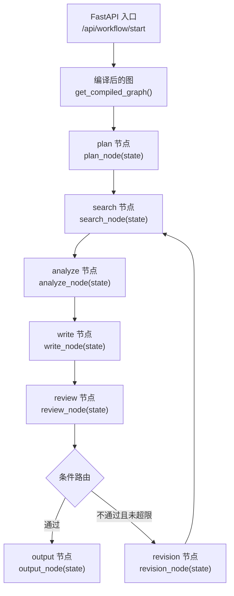
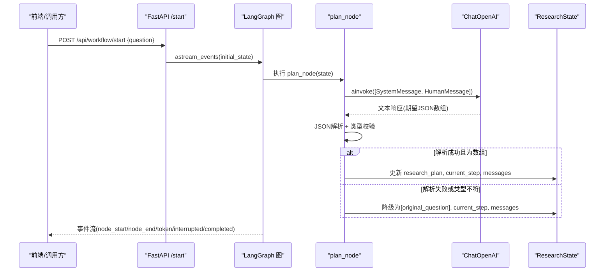
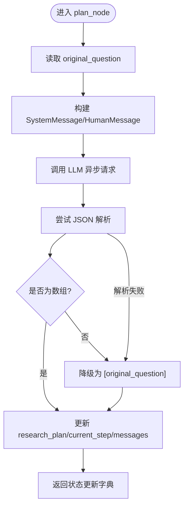
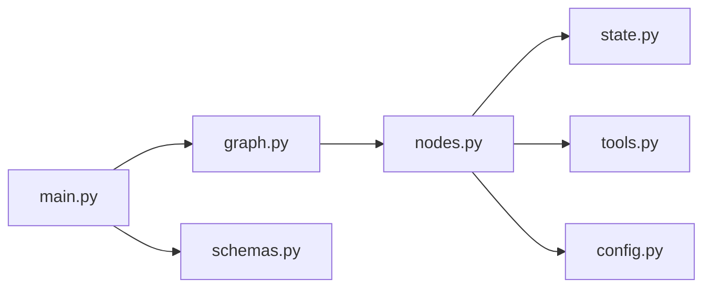

# 规划节点 (plan_node)

<cite>
**本文引用的文件**
- [nodes.py](file://workflow-studio/backend/app/nodes.py)
- [state.py](file://workflow-studio/backend/app/state.py)
- [tools.py](file://workflow-studio/backend/app/tools.py)
- [schemas.py](file://workflow-studio/backend/app/schemas.py)
- [graph.py](file://workflow-studio/backend/app/graph.py)
- [main.py](file://workflow-studio/backend/app/main.py)
- [config.py](file://workflow-studio/backend/app/config.py)
</cite>

## 目录
1. [简介](#简介)
2. [项目结构](#项目结构)
3. [核心组件](#核心组件)
4. [架构总览](#架构总览)
5. [详细组件分析](#详细组件分析)
6. [依赖关系分析](#依赖关系分析)
7. [性能考量](#性能考量)
8. [故障排查指南](#故障排查指南)
9. [结论](#结论)
10. [附录](#附录)

## 简介
本技术文档聚焦于研究工作流中的“规划节点”（plan_node），详细说明其实现逻辑：如何基于用户的研究问题，调用大语言模型将其拆解为3-5个具体子问题；如何构建 SystemMessage 与 HumanMessage；如何进行 JSON 解析与错误处理；以及当解析失败时的降级策略。同时说明输入状态 ResearchState 的使用、输出字典的结构定义，以及状态字段 research_plan 和 current_step 的作用。文末提供测试用例建议与调试方法。

## 项目结构
该工作流由多个节点组成，plan_node 是第一个执行节点，负责将原始问题拆分为可执行的子问题列表，后续节点依次进行搜索、分析、写作、审核与输出。

图表来源
- [main.py:35-103](file://workflow-studio/backend/app/main.py#L35-L103)
- [graph.py:23-62](file://workflow-studio/backend/app/graph.py#L23-L62)

章节来源
- [main.py:35-103](file://workflow-studio/backend/app/main.py#L35-L103)
- [graph.py:23-62](file://workflow-studio/backend/app/graph.py#L23-L62)

## 核心组件
- plan_node：接收 ResearchState，读取 original_question，调用 LLM 生成子问题数组，进行 JSON 解析与降级处理，更新 research_plan、current_step 并追加消息。
- ResearchState：定义工作流状态结构，包含 messages、current_step、original_question、research_plan 等字段。
- tools：web_search 与 academic_search 工具函数，供后续搜索节点使用。
- graph：构建 LangGraph 有向图，定义节点顺序与条件边。
- main：FastAPI 接口，启动工作流并通过事件流返回进度。
- config：加载 LLM 配置（模型、基地址、密钥）。

章节来源
- [nodes.py:18-40](file://workflow-studio/backend/app/nodes.py#L18-L40)
- [state.py:5-30](file://workflow-studio/backend/app/state.py#L5-L30)
- [tools.py:4-26](file://workflow-studio/backend/app/tools.py#L4-L26)
- [graph.py:23-62](file://workflow-studio/backend/app/graph.py#L23-L62)
- [main.py:35-103](file://workflow-studio/backend/app/main.py#L35-L103)
- [config.py:1-9](file://workflow-studio/backend/app/config.py#L1-L9)

## 架构总览
plan_node 作为工作流的起点，承担“问题拆解”职责。它通过 LangChain 的 ChatOpenAI 客户端异步调用 LLM，传入系统提示与人类消息，期望返回一个 JSON 数组形式的子问题列表。随后对响应进行严格校验与容错处理，确保下游节点能稳定消费。

图表来源
- [main.py:35-103](file://workflow-studio/backend/app/main.py#L35-L103)
- [nodes.py:18-40](file://workflow-studio/backend/app/nodes.py#L18-L40)
- [config.py:1-9](file://workflow-studio/backend/app/config.py#L1-L9)

## 详细组件分析

### plan_node 实现逻辑
- 输入参数
  - state: ResearchState，包含 original_question、messages、current_step 等。
- 处理流程
  - 从 state 中读取 original_question。
  - 构造 SystemMessage 与 HumanMessage：
    - SystemMessage：明确角色与任务，要求返回 JSON 数组格式的 3-5 个子问题，仅返回数组，不要其他内容。
    - HumanMessage：携带原始研究问题。
  - 调用 LLM 异步请求（temperature 较低以增强稳定性）。
  - 解析响应：
    - 尝试 json.loads(response.content)。
    - 若解析结果不是 list，则视为异常，触发降级。
    - 若解析失败（JSONDecodeError），同样触发降级。
  - 降级策略：当 JSON 解析失败或类型不符合时，返回 [original_question]，保证下游节点始终有可处理的子问题列表。
  - 更新状态：
    - research_plan：子问题列表。
    - current_step：设置为 "plan"，表示当前步骤。
    - messages：追加一条 AI 消息，告知已拆解为若干子问题。
  - 返回 dict，供 LangGraph 合并到全局状态。

图表来源
- [nodes.py:18-40](file://workflow-studio/backend/app/nodes.py#L18-L40)

章节来源
- [nodes.py:18-40](file://workflow-studio/backend/app/nodes.py#L18-L40)

### 输入参数 ResearchState 的使用
- original_question：用于构建 HumanMessage 的内容，并在降级时作为兜底子问题。
- messages：用于记录工作流过程中的消息历史，plan_node 会追加一条 AI 消息。
- current_step：在 plan_node 完成后被设置为 "plan"，用于追踪当前执行阶段。
- research_plan：存储拆解后的子问题列表，供 search_node 遍历执行。

章节来源
- [state.py:5-30](file://workflow-studio/backend/app/state.py#L5-L30)
- [nodes.py:18-40](file://workflow-studio/backend/app/nodes.py#L18-L40)

### 输出字典的结构定义
plan_node 返回的字典包含以下关键字段：
- research_plan：list[str]，子问题列表。
- current_step：str，固定为 "plan"。
- messages：list[AIMessage]，追加一条完成提示消息。

这些字段会被 LangGraph 合并进全局状态，供后续节点读取。

章节来源
- [nodes.py:36-40](file://workflow-studio/backend/app/nodes.py#L36-L40)
- [state.py:5-30](file://workflow-studio/backend/app/state.py#L5-L30)

### LLM 调用过程与消息构建
- 客户端：ChatOpenAI，使用配置文件中的模型、基地址与密钥。
- SystemMessage：设定角色与输出格式约束，强调只返回 JSON 数组。
- HumanMessage：注入原始问题，引导模型进行问题拆解。
- 温度设置：较低以降低随机性，提高结构化输出的稳定性。

章节来源
- [nodes.py:1-15](file://workflow-studio/backend/app/nodes.py#L1-L15)
- [config.py:1-9](file://workflow-studio/backend/app/config.py#L1-L9)

### JSON 解析与错误处理机制
- 解析：使用标准库 json.loads 对 LLM 响应进行解析。
- 类型校验：确保结果为 list，否则视为异常。
- 异常捕获：捕获 JSONDecodeError，统一走降级路径。
- 降级策略：当解析失败或类型不符时，返回 [original_question]，确保下游节点可用。

章节来源
- [nodes.py:29-35](file://workflow-studio/backend/app/nodes.py#L29-L35)

### 降级处理策略
- 触发条件：
  - JSON 解析失败。
  - 解析结果不是数组。
- 行为：
  - 将 research_plan 设为 [original_question]。
  - 继续推进工作流，避免阻塞。
- 目的：
  - 保证鲁棒性，即使 LLM 输出不规范也能继续执行。
  - 便于调试与回退。

章节来源
- [nodes.py:29-35](file://workflow-studio/backend/app/nodes.py#L29-L35)

### 状态更新字段 research_plan 和 current_step 的作用
- research_plan：承载拆解后的子问题，是后续搜索与分析的核心输入。
- current_step：标记当前执行阶段，便于前端展示与工作流控制。
- messages：记录节点执行结果，便于审计与调试。

章节来源
- [nodes.py:36-40](file://workflow-studio/backend/app/nodes.py#L36-L40)
- [state.py:5-30](file://workflow-studio/backend/app/state.py#L5-L30)

## 依赖关系分析
- nodes.py 依赖：
  - langchain_openai.ChatOpenAI：LLM 客户端。
  - langchain_core.messages：消息类型。
  - .state.ResearchState：状态结构。
  - .tools.web_search：搜索工具（在 search_node 中使用）。
  - .config：LLM 配置。
- graph.py 依赖：
  - LangGraph 的 StateGraph、START、END。
  - 所有节点函数。
- main.py 依赖：
  - FastAPI、SSE 事件流。
  - graph.get_compiled_graph。
  - schemas.StartRequest/ReviewRequest。

图表来源
- [nodes.py:1-8](file://workflow-studio/backend/app/nodes.py#L1-L8)
- [graph.py:1-8](file://workflow-studio/backend/app/graph.py#L1-L8)
- [main.py:1-12](file://workflow-studio/backend/app/main.py#L1-L12)

章节来源
- [nodes.py:1-8](file://workflow-studio/backend/app/nodes.py#L1-L8)
- [graph.py:1-8](file://workflow-studio/backend/app/graph.py#L1-L8)
- [main.py:1-12](file://workflow-studio/backend/app/main.py#L1-L12)

## 性能考量
- 异步调用：plan_node 使用 ainvoke，避免阻塞事件循环。
- 低温度：降低随机性，提升结构化输出稳定性，减少重试成本。
- 降级快速：解析失败立即降级，避免长时间等待或复杂重试。
- 事件流：通过 SSE 实时反馈节点执行状态，提升用户体验。

[本节为通用性能讨论，不直接分析具体代码行]

## 故障排查指南
- 常见问题
  - LLM 返回非 JSON：触发降级，检查 system prompt 是否足够明确。
  - 返回的不是数组：同样触发降级，建议在外部日志中记录 response.content。
  - 网络或鉴权错误：检查 OPENAI_API_KEY 与 OPENAI_BASE_URL 配置。
- 调试方法
  - 启用事件流：观察 node_start/node_end/token/interrupted/completed 事件。
  - 查看状态：通过 /api/workflow/state/{workflow_id} 获取当前状态。
  - 打印中间值：在 plan_node 中记录 response.content 与解析结果。
  - 单元测试：构造不同输入的 ResearchState，验证降级与正常路径。

章节来源
- [main.py:60-103](file://workflow-studio/backend/app/main.py#L60-L103)
- [main.py:158-173](file://workflow-studio/backend/app/main.py#L158-L173)
- [nodes.py:18-40](file://workflow-studio/backend/app/nodes.py#L18-L40)

## 结论
plan_node 作为研究工作流的起始节点，承担了将复杂研究问题拆解为可执行子问题的关键职责。其实现简洁稳健：通过明确的系统提示与人类消息引导 LLM 输出结构化结果，配合严格的 JSON 解析与类型校验，以及在异常情况下采用降级策略，确保工作流的连续性与鲁棒性。结合 LangGraph 的状态管理与事件流，plan_node 能够无缝融入整体工作流，并为后续搜索、分析与写作提供可靠输入。

[本节为总结性内容，不直接分析具体代码行]

## 附录

### 测试用例建议
- 正常路径
  - 输入：original_question 为有效研究问题。
  - 预期：research_plan 为长度 3-5 的子问题数组，current_step 为 "plan"，messages 包含完成提示。
- 异常路径
  - 输入：LLM 返回非 JSON 字符串。
  - 预期：触发降级，research_plan 为 [original_question]。
  - 输入：LLM 返回 JSON 但非数组。
  - 预期：触发降级，research_plan 为 [original_question]。
- 边界情况
  - 空字符串 original_question：应仍能返回 ["" ] 或合理默认值。
  - 超长问题：确保 LLM 上下文限制不被突破，必要时截断或分段。

[本节为概念性测试设计，不直接分析具体代码行]

### 调试方法
- 本地运行后端服务，调用 /api/workflow/start 并订阅事件流。
- 在 plan_node 中添加日志，记录 response.content 与解析结果。
- 使用 /api/workflow/state/{workflow_id} 检查状态变化。
- 模拟 LLM 异常返回，验证降级逻辑。

章节来源
- [main.py:60-103](file://workflow-studio/backend/app/main.py#L60-L103)
- [main.py:158-173](file://workflow-studio/backend/app/main.py#L158-L173)
- [nodes.py:18-40](file://workflow-studio/backend/app/nodes.py#L18-L40)