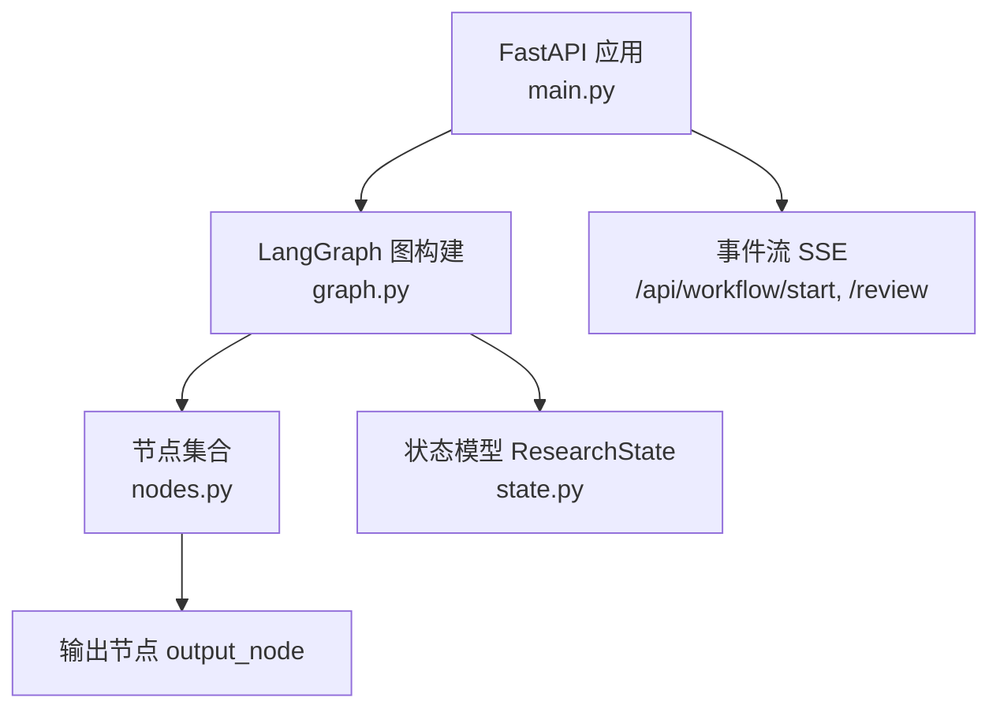
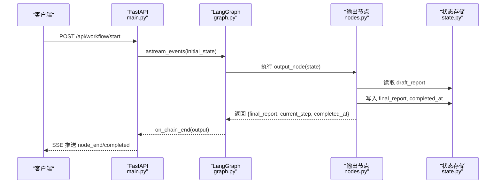
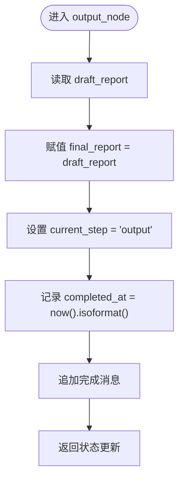
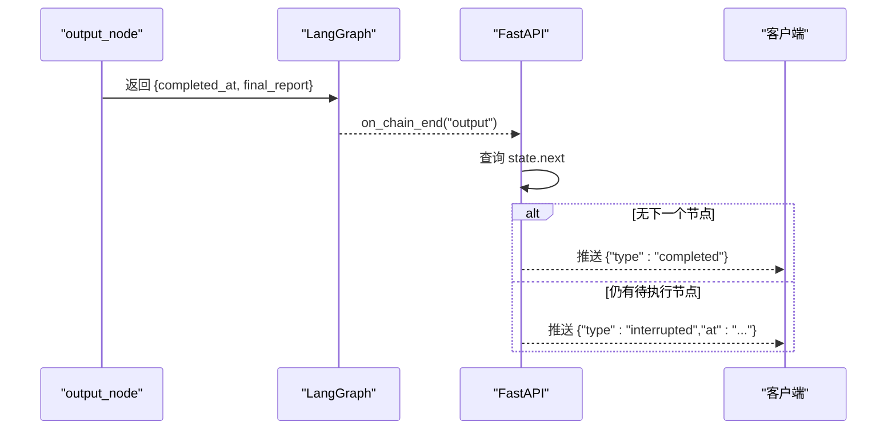
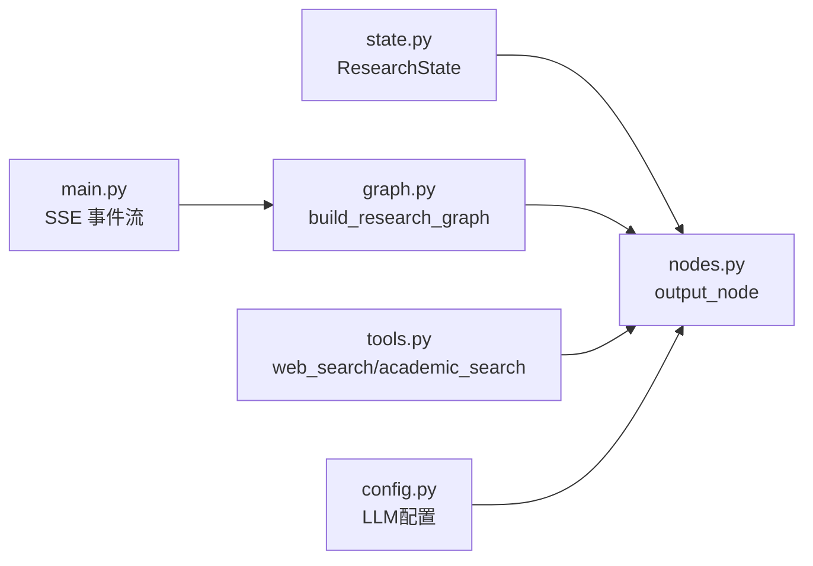

# 输出节点 (output_node)

<cite>
**本文引用的文件**
- [nodes.py](file://workflow-studio/backend/app/nodes.py)
- [state.py](file://workflow-studio/backend/app/state.py)
- [graph.py](file://workflow-studio/backend/app/graph.py)
- [main.py](file://workflow-studio/backend/app/main.py)
- [schemas.py](file://workflow-studio/backend/app/schemas.py)
- [tools.py](file://workflow-studio/backend/app/tools.py)
- [config.py](file://workflow-studio/backend/app/config.py)
</cite>

## 目录
1. [简介](#简介)
2. [项目结构](#项目结构)
3. [核心组件](#核心组件)
4. [架构总览](#架构总览)
5. [详细组件分析](#详细组件分析)
6. [依赖关系分析](#依赖关系分析)
7. [性能与可靠性](#性能与可靠性)
8. [故障排查指南](#故障排查指南)
9. [结论](#结论)
10. [附录：扩展输出格式与集成](#附录：扩展输出格式与集成)

## 简介
本章节聚焦于研究工作流中的“输出节点”（output_node），系统性说明其职责、实现逻辑、数据流转、状态标记以及可扩展的导出能力。重点包括：
- final_report 的来源与从 draft_report 提取/处理的方式
- completed_at 时间戳的记录机制与工作流完成状态的标记
- 输出数据的标准化结构与版本管理策略
- 输出接口的扩展方式，支持多种格式导出（PDF、Word、HTML）与第三方系统集成

## 项目结构
后端采用 FastAPI + LangGraph 的工作流编排，节点以异步函数形式实现，状态通过 TypedDict 定义并持久化到 SQLite 检查点。输出节点位于 nodes.py，由 graph.py 注册为工作流图的一个节点，并在 main.py 中通过事件流对外暴露执行过程与结果。

图表来源
- [main.py:35-103](file://workflow-studio/backend/app/main.py#L35-L103)
- [graph.py:23-62](file://workflow-studio/backend/app/graph.py#L23-L62)
- [nodes.py:111-118](file://workflow-studio/backend/app/nodes.py#L111-L118)
- [state.py:5-30](file://workflow-studio/backend/app/state.py#L5-L30)

章节来源
- [main.py:35-103](file://workflow-studio/backend/app/main.py#L35-L103)
- [graph.py:23-62](file://workflow-studio/backend/app/graph.py#L23-L62)
- [nodes.py:111-118](file://workflow-studio/backend/app/nodes.py#L111-L118)
- [state.py:5-30](file://workflow-studio/backend/app/state.py#L5-L30)

## 核心组件
- 输出节点 output_node：负责组装最终报告、记录完成时间、推进工作流结束。
- 状态模型 ResearchState：定义工作流各阶段的数据字段，包括草稿报告、最终报告、审核状态、元数据等。
- 工作流图 build_research_graph：将 output_node 接入流程，并在审核通过后进入输出阶段。
- API 层 main.py：启动工作流、事件流推送、获取状态、提交审核恢复执行。

章节来源
- [nodes.py:111-118](file://workflow-studio/backend/app/nodes.py#L111-L118)
- [state.py:5-30](file://workflow-studio/backend/app/state.py#L5-L30)
- [graph.py:23-62](file://workflow-studio/backend/app/graph.py#L23-L62)
- [main.py:35-103](file://workflow-studio/backend/app/main.py#L35-L103)

## 架构总览
输出节点处于审核分支的终点路径。当人工审核结果为“通过”，或达到最大修订轮次时，工作流进入 output 节点，生成 final_report 并记录 completed_at，随后结束。

图表来源
- [main.py:60-103](file://workflow-studio/backend/app/main.py#L60-L103)
- [graph.py:45-62](file://workflow-studio/backend/app/graph.py#L45-L62)
- [nodes.py:111-118](file://workflow-studio/backend/app/nodes.py#L111-L118)
- [state.py:5-30](file://workflow-studio/backend/app/state.py#L5-L30)

## 详细组件分析

### output_node 实现逻辑
- 输入：ResearchState 当前状态，包含 draft_report、review_status、iteration_count 等。
- 处理：
  - 将 draft_report 直接赋值给 final_report，作为最终报告内容。
  - 设置 current_step 为 "output"。
  - 记录 completed_at 为当前时间的 ISO 字符串。
  - 追加一条消息提示报告已完成。
- 输出：包含 final_report、current_step、completed_at 和 messages 的字典。

图表来源
- [nodes.py:111-118](file://workflow-studio/backend/app/nodes.py#L111-L118)
- [state.py:5-30](file://workflow-studio/backend/app/state.py#L5-L30)

章节来源
- [nodes.py:111-118](file://workflow-studio/backend/app/nodes.py#L111-L118)
- [state.py:5-30](file://workflow-studio/backend/app/state.py#L5-L30)

### final_report 的来源与处理
- 来源：draft_report 由 write_node 生成，内容为 LLM 基于分析结果撰写的结构化研究报告（Markdown）。
- 处理方式：output_node 直接将 draft_report 复制到 final_report，不做额外转换；如需格式化或增强，可在该节点增加预处理步骤（如清洗、模板填充、版本标注）。
- 建议：在后续扩展中，可将 final_report 的生成改为“模板渲染 + 校验”的流程，确保输出一致性与可追溯性。

章节来源
- [nodes.py:82-97](file://workflow-studio/backend/app/nodes.py#L82-L97)
- [nodes.py:111-118](file://workflow-studio/backend/app/nodes.py#L111-L118)
- [state.py:5-30](file://workflow-studio/backend/app/state.py#L5-L30)

### completed_at 时间戳与完成状态标记
- 记录机制：output_node 使用 datetime.now().isoformat() 生成 ISO 格式的完成时间，并写入状态。
- 完成标记：
  - 节点返回后，graph 边将导向 END，工作流结束。
  - main.py 的事件流在完成后推送 type=completed 事件，前端据此判定流程结束。
  - 若在中断点（review）暂停，则推送 interrupted 事件，表示未完成。

图表来源
- [nodes.py:111-118](file://workflow-studio/backend/app/nodes.py#L111-L118)
- [main.py:60-103](file://workflow-studio/backend/app/main.py#L60-L103)
- [graph.py:45-62](file://workflow-studio/backend/app/graph.py#L45-L62)

章节来源
- [nodes.py:111-118](file://workflow-studio/backend/app/nodes.py#L111-L118)
- [main.py:60-103](file://workflow-studio/backend/app/main.py#L60-L103)
- [graph.py:45-62](file://workflow-studio/backend/app/graph.py#L45-L62)

### 输出数据的标准化格式与版本管理
- 标准化字段：
  - final_report：字符串，承载最终报告内容（建议 Markdown）。
  - current_step：固定为 "output"，便于前端识别阶段。
  - completed_at：ISO 时间戳，用于归档与审计。
  - messages：列表，包含节点执行过程中的消息（例如完成提示）。
- 版本管理建议：
  - 在状态中引入 version 字段（例如 "v1"），每次重大变更递增版本号。
  - 对 final_report 进行快照归档，保留历史版本以便回溯。
  - 结合 workflow_id 与 completed_at 形成唯一标识，便于检索与比对。

章节来源
- [state.py:5-30](file://workflow-studio/backend/app/state.py#L5-L30)
- [nodes.py:111-118](file://workflow-studio/backend/app/nodes.py#L111-L118)

### 工作流完成状态与中断恢复
- 完成：当审核通过或达到最大修订轮次，进入 output 节点并最终结束。
- 中断：在 review 节点前暂停，等待人工提交审核结果；若未通过且未达到上限，回到 revision 重新搜索与写作。
- 恢复：通过 /api/workflow/review 提交审核结果，使用 Command(update=update, resume=True) 恢复执行。

章节来源
- [graph.py:11-20](file://workflow-studio/backend/app/graph.py#L11-L20)
- [graph.py:45-62](file://workflow-studio/backend/app/graph.py#L45-L62)
- [main.py:107-154](file://workflow-studio/backend/app/main.py#L107-L154)

## 依赖关系分析
- nodes.py 依赖 state.py 的 ResearchState 类型，保证状态一致性。
- graph.py 将 output_node 注册为节点，并通过条件边控制审核后的路由。
- main.py 提供 API 入口，使用 LangGraph 的事件流向客户端推送执行进度与结果。
- tools.py 与 config.py 为其他节点提供工具与配置，不直接影响 output_node 的实现，但影响上游数据质量。

图表来源
- [state.py:5-30](file://workflow-studio/backend/app/state.py#L5-L30)
- [nodes.py:111-118](file://workflow-studio/backend/app/nodes.py#L111-L118)
- [graph.py:23-62](file://workflow-studio/backend/app/graph.py#L23-L62)
- [main.py:35-103](file://workflow-studio/backend/app/main.py#L35-L103)
- [tools.py:1-26](file://workflow-studio/backend/app/tools.py#L1-L26)
- [config.py:1-9](file://workflow-studio/backend/app/config.py#L1-L9)

章节来源
- [state.py:5-30](file://workflow-studio/backend/app/state.py#L5-L30)
- [nodes.py:111-118](file://workflow-studio/backend/app/nodes.py#L111-L118)
- [graph.py:23-62](file://workflow-studio/backend/app/graph.py#L23-L62)
- [main.py:35-103](file://workflow-studio/backend/app/main.py#L35-L103)
- [tools.py:1-26](file://workflow-studio/backend/app/tools.py#L1-L26)
- [config.py:1-9](file://workflow-studio/backend/app/config.py#L1-L9)

## 性能与可靠性
- 性能：
  - output_node 仅做状态复制与时间戳记录，计算开销极低。
  - 主要性能瓶颈在上游 LLM 调用与搜索工具，建议在 output 节点前加入缓存或重试机制。
- 可靠性：
  - 使用 LangGraph 检查点持久化状态，支持中断与恢复。
  - 建议在 output_node 中加入异常捕获与降级策略，确保即使上游失败也能产出最小可用输出。
- 可观测性：
  - 通过 SSE 事件流实时反馈节点开始/结束与 token 流，便于前端展示与调试。

[本节为通用指导，无需特定文件引用]

## 故障排查指南
- 常见问题：
  - 工作流未结束：检查 review_status 与 iteration_count，确认是否满足进入 output 的条件。
  - final_report 为空：核查 write_node 是否正确生成 draft_report，以及是否存在异常导致跳过。
  - completed_at 缺失：确认 output_node 正常执行，且未被中断。
- 定位方法：
  - 使用 /api/workflow/state/{workflow_id} 获取当前状态，查看 next 与 values。
  - 观察 SSE 事件流中的 node_start/node_end 与 interrupted/completed 事件。
  - 检查 SQLite 检查点文件，确认状态持久化是否正常。

章节来源
- [main.py:158-173](file://workflow-studio/backend/app/main.py#L158-L173)
- [graph.py:65-78](file://workflow-studio/backend/app/graph.py#L65-L78)

## 结论
output_node 是研究工作流的收尾环节，负责将草稿报告固化为最终报告、记录完成时间并推进流程结束。其实现简洁可靠，易于扩展。通过引入版本管理、多格式导出与第三方集成，可进一步提升输出的可用性与生态兼容性。

[本节为总结性内容，无需特定文件引用]

## 附录：扩展输出格式与集成
- 多格式导出：
  - PDF：在 output_node 或其后置处理器中将 Markdown 转换为 PDF（例如使用 WeasyPrint、pdfkit）。
  - Word：将 Markdown 转为 DOCX（例如使用 python-docx 或 pandoc）。
  - HTML：渲染 Markdown 为 HTML，并可嵌入样式与图表。
- 第三方系统集成：
  - 将 final_report 推送至文档管理系统（如 Confluence、Notion）、知识库或对象存储（S3、OSS）。
  - 通过 Webhook 通知下游系统，触发归档、索引或发布流程。
- 版本与归档策略：
  - 为每个 workflow_id 生成唯一归档键，包含 completed_at 与版本号。
  - 保留历史版本，支持对比与回滚。
  - 对敏感信息脱敏后再归档。

[本节为概念性扩展建议，无需特定文件引用]