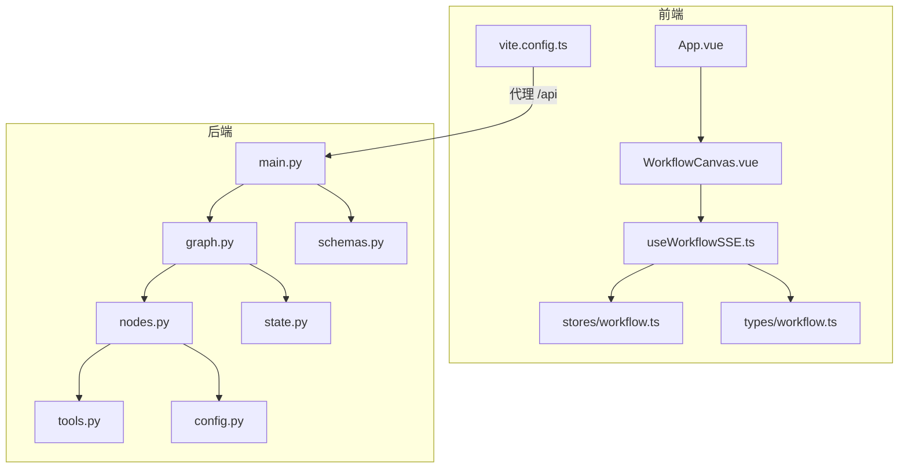
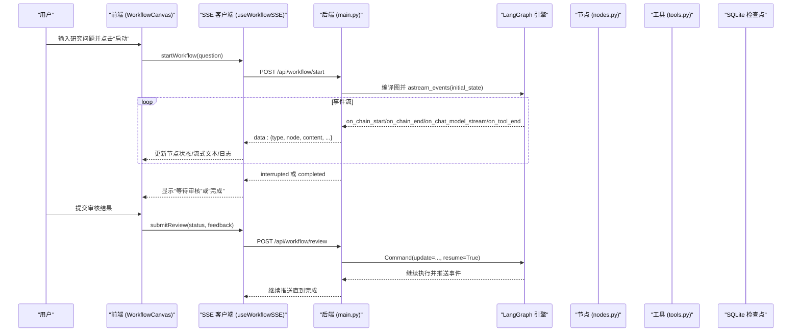
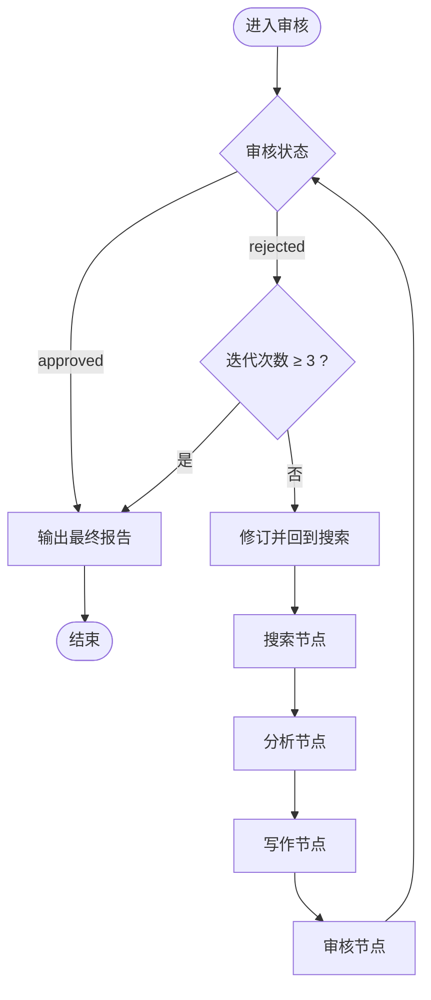
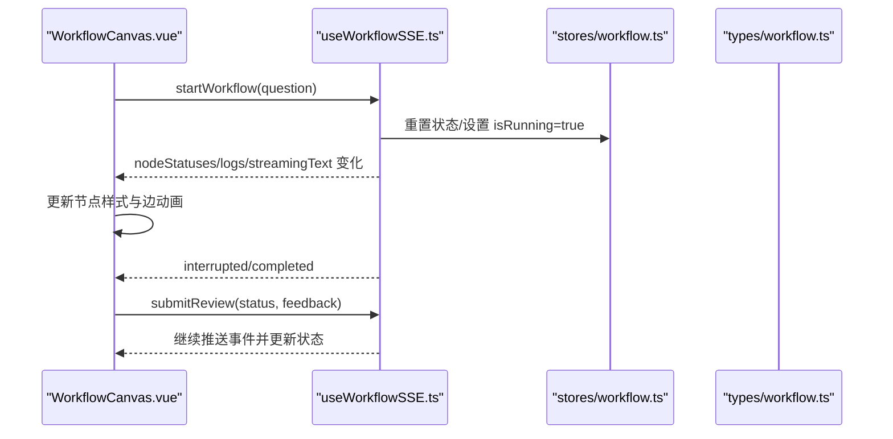
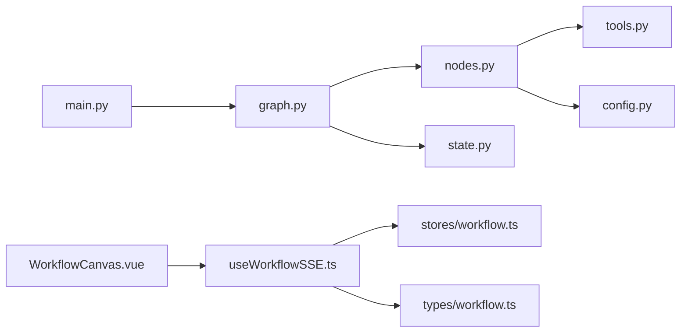
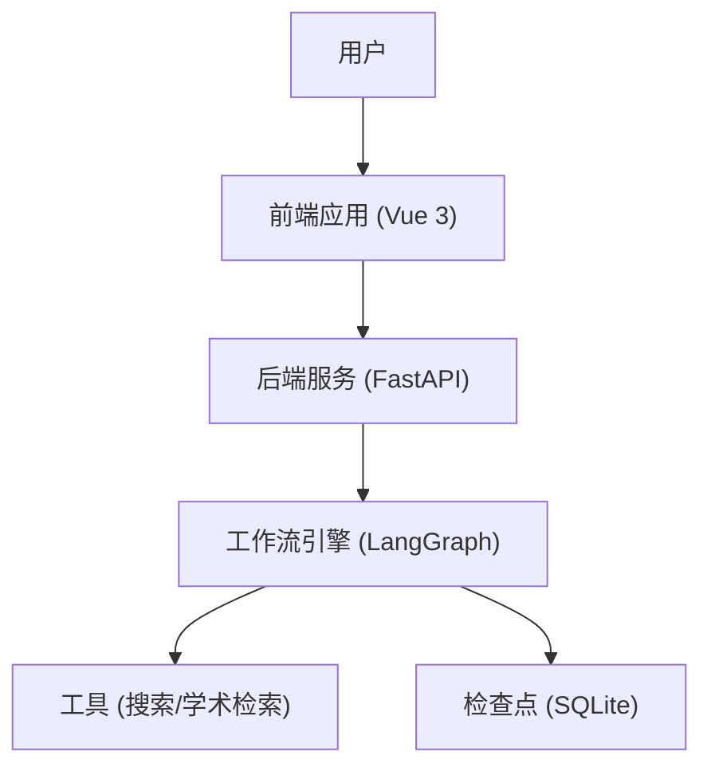

# 整体架构设计

<cite>
**本文引用的文件**
- [README.md](file://workflow-studio/README.md)
- [main.py](file://workflow-studio/backend/app/main.py)
- [graph.py](file://workflow-studio/backend/app/graph.py)
- [nodes.py](file://workflow-studio/backend/app/nodes.py)
- [state.py](file://workflow-studio/backend/app/state.py)
- [schemas.py](file://workflow-studio/backend/app/schemas.py)
- [tools.py](file://workflow-studio/backend/app/tools.py)
- [config.py](file://workflow-studio/backend/app/config.py)
- [WorkflowCanvas.vue](file://workflow-studio/frontend/src/components/WorkflowCanvas.vue)
- [useWorkflowSSE.ts](file://workflow-studio/frontend/src/composables/useWorkflowSSE.ts)
- [workflow.ts](file://workflow-studio/frontend/src/stores/workflow.ts)
- [workflow.ts（类型）](file://workflow-studio/frontend/src/types/workflow.ts)
- [vite.config.ts](file://workflow-studio/frontend/vite.config.ts)
</cite>

## 目录
1. [简介](#简介)
2. [项目结构](#项目结构)
3. [核心组件](#核心组件)
4. [架构总览](#架构总览)
5. [详细组件分析](#详细组件分析)
6. [依赖关系分析](#依赖关系分析)
7. [性能考量](#性能考量)
8. [故障排查指南](#故障排查指南)
9. [结论](#结论)
10. [附录](#附录)

## 简介
本文件为 Workflow Studio 的整体架构设计文档，面向架构师提供全局视角。系统采用前后端分离架构：前端基于 Vue 3 + Vue Flow 构建可视化工作流画布；后端基于 FastAPI 暴露 REST API 并通过 Server-Sent Events（SSE）实时推送执行事件；工作流引擎使用 LangGraph 定义有状态多 Agent 流程，支持条件分支、循环与人工审核（Human-in-the-loop），并借助 SQLite 检查点实现中断恢复与页面刷新后状态续跑。

## 项目结构
- 后端（FastAPI）
  - 入口与路由：main.py
  - 工作流图定义与编译：graph.py
  - 节点实现：nodes.py
  - 状态模型：state.py
  - API 数据模型：schemas.py
  - 工具函数（搜索等）：tools.py
  - 配置加载：config.py
- 前端（Vue 3）
  - 应用根组件：App.vue
  - 画布与交互：components/WorkflowCanvas.vue
  - SSE 通信封装：composables/useWorkflowSSE.ts
  - 状态管理：stores/workflow.ts
  - 类型定义：types/workflow.ts
  - 开发代理与端口：vite.config.ts

图表来源
- [main.py:1-200](file://workflow-studio/backend/app/main.py#L1-L200)
- [graph.py:1-78](file://workflow-studio/backend/app/graph.py#L1-L78)
- [nodes.py:1-129](file://workflow-studio/backend/app/nodes.py#L1-L129)
- [state.py:1-30](file://workflow-studio/backend/app/state.py#L1-L30)
- [schemas.py:1-12](file://workflow-studio/backend/app/schemas.py#L1-L12)
- [tools.py:1-26](file://workflow-studio/backend/app/tools.py#L1-L26)
- [config.py:1-9](file://workflow-studio/backend/app/config.py#L1-L9)
- [WorkflowCanvas.vue:1-133](file://workflow-studio/frontend/src/components/WorkflowCanvas.vue#L1-L133)
- [useWorkflowSSE.ts:1-172](file://workflow-studio/frontend/src/composables/useWorkflowSSE.ts#L1-L172)
- [workflow.ts:1-75](file://workflow-studio/frontend/src/stores/workflow.ts#L1-L75)
- [workflow.ts（类型）:1-64](file://workflow-studio/frontend/src/types/workflow.ts#L1-L64)
- [vite.config.ts:1-22](file://workflow-studio/frontend/vite.config.ts#L1-L22)

章节来源
- [README.md:15-90](file://workflow-studio/README.md#L15-L90)
- [vite.config.ts:12-20](file://workflow-studio/frontend/vite.config.ts#L12-L20)

## 核心组件
- 后端服务（FastAPI）
  - 启动工作流：POST /api/workflow/start，创建初始状态并调用 LangGraph 的 astream_events 以 SSE 推送节点开始/结束、LLM 流式 token、工具结果、中断与完成事件。
  - 人工审核恢复：POST /api/workflow/review，注入审核结果并恢复执行，继续 SSE 推送。
  - 获取状态：GET /api/workflow/state/{workflow_id}，用于页面刷新后从检查点恢复。
  - 获取图结构：GET /api/workflow/graph-structure，返回节点与边供前端渲染。
- 工作流引擎（LangGraph）
  - 图构建：StateGraph(ResearchState)，添加节点 plan/search/analyze/write/review/revision/output，线性连接并在 review 处设置条件边。
  - 中断策略：interrupt_before=["review"]，在审核前暂停，等待人工输入。
  - 持久化：AsyncSqliteSaver 保存检查点，支持断点续跑。
- 前端（Vue 3 + Vue Flow）
  - 画布：WorkflowCanvas.vue 渲染节点与边，根据 SSE 事件更新节点状态与边动画。
  - SSE 通信：useWorkflowSSE.ts 负责发起请求、读取流、解析事件、维护运行/中断/流式文本等状态。
  - 状态管理：stores/workflow.ts 集中管理工作流相关状态与计算属性。
  - 类型：types/workflow.ts 定义 NodeStatus、SSEEvent、GraphStructure 等。

章节来源
- [main.py:34-200](file://workflow-studio/backend/app/main.py#L34-L200)
- [graph.py:23-78](file://workflow-studio/backend/app/graph.py#L23-L78)
- [WorkflowCanvas.vue:1-133](file://workflow-studio/frontend/src/components/WorkflowCanvas.vue#L1-L133)
- [useWorkflowSSE.ts:1-172](file://workflow-studio/frontend/src/composables/useWorkflowSSE.ts#L1-L172)
- [workflow.ts:1-75](file://workflow-studio/frontend/src/stores/workflow.ts#L1-L75)
- [workflow.ts（类型）:1-64](file://workflow-studio/frontend/src/types/workflow.ts#L1-L64)

## 架构总览
系统采用前后端分离的微服务风格部署（当前为单体进程内协作）。前端通过 Vite 开发服务器将 /api 请求代理到后端 FastAPI 服务。后端通过 LangGraph 编排多 Agent 工作流，结合 LLM 与外部工具，按节点顺序执行并在审核节点暂停，等待人类决策后继续。所有执行事件通过 SSE 实时推送到前端，驱动画布状态更新。

图表来源
- [main.py:34-154](file://workflow-studio/backend/app/main.py#L34-L154)
- [graph.py:23-78](file://workflow-studio/backend/app/graph.py#L23-L78)
- [nodes.py:18-129](file://workflow-studio/backend/app/nodes.py#L18-L129)
- [useWorkflowSSE.ts:74-157](file://workflow-studio/frontend/src/composables/useWorkflowSSE.ts#L74-L157)

## 详细组件分析

### 后端服务（FastAPI）
- 职责
  - 接收前端请求，构造初始状态，调用 LangGraph 执行工作流。
  - 通过 StreamingResponse 以 text/event-stream 推送事件。
  - 处理人工审核恢复与状态查询。
- 关键接口
  - POST /api/workflow/start：启动工作流，返回 SSE 流。
  - POST /api/workflow/review：提交审核结果，恢复执行。
  - GET /api/workflow/state/{workflow_id}：获取当前状态（检查点）。
  - GET /api/workflow/graph-structure：返回图结构供前端渲染。
- 错误处理
  - 异常捕获后以 type=error 的事件形式推送。
  - 未找到工作流时返回 404。

章节来源
- [main.py:34-200](file://workflow-studio/backend/app/main.py#L34-L200)

### 工作流引擎（LangGraph）
- 图构建
  - StateGraph(ResearchState) 定义状态字段与消息历史。
  - 节点：plan → search → analyze → write → review → (output | revision)。
  - 条件边：review 根据 review_status 与 iteration_count 决定输出或修订。
- 中断与恢复
  - interrupt_before=["review"] 在审核前暂停。
  - 使用 AsyncSqliteSaver 持久化检查点，支持刷新后恢复。
- 路由逻辑
  - route_after_review：approved→output；rejected 且 iteration_count≥3→output；否则→revision。

图表来源
- [graph.py:11-62](file://workflow-studio/backend/app/graph.py#L11-L62)

章节来源
- [graph.py:11-78](file://workflow-studio/backend/app/graph.py#L11-L78)
- [state.py:5-30](file://workflow-studio/backend/app/state.py#L5-L30)

### 节点实现（nodes.py）
- plan_node：将原始问题拆解为子问题列表。
- search_node：对每个子问题调用 web_search 工具，收集结果。
- analyze_node：综合搜索结果生成结构化分析。
- write_node：基于分析与反馈撰写研究报告草稿。
- review_node：标记 pending，等待人工审核（由 LangGraph 中断）。
- output_node：输出最终报告并记录完成时间。
- revision_node：递增迭代计数，准备重新搜索。

章节来源
- [nodes.py:18-129](file://workflow-studio/backend/app/nodes.py#L18-L129)

### 前端（Vue 3 + Vue Flow）
- 画布与交互
  - WorkflowCanvas.vue 初始化节点与边，监听 SSE 事件更新节点状态与边动画。
- SSE 通信
  - useWorkflowSSE.ts 封装 startWorkflow 与 submitReview，读取流并按事件类型更新 UI。
- 状态管理
  - stores/workflow.ts 集中管理运行态、日志、图结构等。
- 类型系统
  - types/workflow.ts 定义 NodeStatus、SSEEvent、GraphStructure 等。

图表来源
- [WorkflowCanvas.vue:1-133](file://workflow-studio/frontend/src/components/WorkflowCanvas.vue#L1-L133)
- [useWorkflowSSE.ts:1-172](file://workflow-studio/frontend/src/composables/useWorkflowSSE.ts#L1-L172)
- [workflow.ts:1-75](file://workflow-studio/frontend/src/stores/workflow.ts#L1-L75)
- [workflow.ts（类型）:1-64](file://workflow-studio/frontend/src/types/workflow.ts#L1-L64)

章节来源
- [WorkflowCanvas.vue:1-133](file://workflow-studio/frontend/src/components/WorkflowCanvas.vue#L1-L133)
- [useWorkflowSSE.ts:1-172](file://workflow-studio/frontend/src/composables/useWorkflowSSE.ts#L1-L172)
- [workflow.ts:1-75](file://workflow-studio/frontend/src/stores/workflow.ts#L1-L75)
- [workflow.ts（类型）:1-64](file://workflow-studio/frontend/src/types/workflow.ts#L1-L64)

## 依赖关系分析
- 后端模块耦合
  - main.py 依赖 graph.py、state.py、schemas.py。
  - graph.py 依赖 nodes.py、state.py，并使用 AsyncSqliteSaver。
  - nodes.py 依赖 tools.py、config.py 与 LangChain/LangGraph。
- 前端模块耦合
  - WorkflowCanvas.vue 依赖 useWorkflowSSE.ts、stores/workflow.ts、types/workflow.ts。
  - useWorkflowSSE.ts 依赖 types/workflow.ts 进行事件类型约束。
- 外部依赖
  - FastAPI、LangGraph、LangChain、OpenAI（通过 config 配置）、SQLite（检查点）。

图表来源
- [main.py:1-200](file://workflow-studio/backend/app/main.py#L1-L200)
- [graph.py:1-78](file://workflow-studio/backend/app/graph.py#L1-L78)
- [nodes.py:1-129](file://workflow-studio/backend/app/nodes.py#L1-L129)
- [tools.py:1-26](file://workflow-studio/backend/app/tools.py#L1-L26)
- [config.py:1-9](file://workflow-studio/backend/app/config.py#L1-L9)
- [WorkflowCanvas.vue:1-133](file://workflow-studio/frontend/src/components/WorkflowCanvas.vue#L1-L133)
- [useWorkflowSSE.ts:1-172](file://workflow-studio/frontend/src/composables/useWorkflowSSE.ts#L1-L172)
- [workflow.ts:1-75](file://workflow-studio/frontend/src/stores/workflow.ts#L1-L75)
- [workflow.ts（类型）:1-64](file://workflow-studio/frontend/src/types/workflow.ts#L1-L64)

章节来源
- [main.py:1-200](file://workflow-studio/backend/app/main.py#L1-L200)
- [graph.py:1-78](file://workflow-studio/backend/app/graph.py#L1-L78)
- [nodes.py:1-129](file://workflow-studio/backend/app/nodes.py#L1-L129)
- [tools.py:1-26](file://workflow-studio/backend/app/tools.py#L1-L26)
- [config.py:1-9](file://workflow-studio/backend/app/config.py#L1-L9)
- [WorkflowCanvas.vue:1-133](file://workflow-studio/frontend/src/components/WorkflowCanvas.vue#L1-L133)
- [useWorkflowSSE.ts:1-172](file://workflow-studio/frontend/src/composables/useWorkflowSSE.ts#L1-L172)
- [workflow.ts:1-75](file://workflow-studio/frontend/src/stores/workflow.ts#L1-L75)
- [workflow.ts（类型）:1-64](file://workflow-studio/frontend/src/types/workflow.ts#L1-L64)

## 性能考量
- 事件流与渲染
  - SSE 推送粒度细（节点开始/结束、token、工具结果），前端需节流或合并渲染以避免频繁重绘。
- 并发与资源
  - 后端使用异步 I/O 与 LangGraph 事件流，适合高并发长连接；注意限制并发工作流数量与检查点存储大小。
- 检查点与持久化
  - SQLite 适用于轻量场景；生产环境建议迁移至 PostgreSQL 以提升并发与可靠性。
- 网络与代理
  - 开发阶段通过 Vite 代理转发 /api，生产环境应配置反向代理（如 Nginx）并启用合适的缓冲与超时策略。

[本节为通用指导，不直接分析具体文件]

## 故障排查指南
- 常见问题
  - 无法连接后端：检查 Vite 代理配置与后端端口。
  - 工作流未恢复：确认 workflow_id 是否正确传递，检查 /api/workflow/state 是否返回状态。
  - 审核未生效：确认 review 请求包含正确的 workflow_id、status 与 feedback。
- 错误定位
  - 查看前端 logs 与 streamingText 内容。
  - 检查后端事件流中 type=error 的消息。
  - 核对 LangGraph 中断位置与 next 节点。

章节来源
- [useWorkflowSSE.ts:66-70](file://workflow-studio/frontend/src/composables/useWorkflowSSE.ts#L66-L70)
- [main.py:96-98](file://workflow-studio/backend/app/main.py#L96-L98)
- [main.py:147-148](file://workflow-studio/backend/app/main.py#L147-L148)

## 结论
Workflow Studio 通过 FastAPI 提供稳定的 API 与 SSE 实时能力，LangGraph 作为工作流引擎实现复杂的多 Agent 流程与人工审核，Vue 3 + Vue Flow 提供直观的可视化体验。系统边界清晰、组件职责明确，具备可扩展性与可维护性。未来可在微服务拆分、并行节点、模板化工作流与性能面板等方面持续演进。

[本节为总结，不直接分析具体文件]

## 附录
- 技术栈选择说明
  - 后端：FastAPI（高性能异步）、LangGraph（有状态多 Agent）、LangChain（LLM 工具链）、SQLite（检查点）。
  - 前端：Vue 3（渐进式框架）、Vue Flow（流程图可视化）、Pinia（状态管理）、Tailwind CSS（原子化样式）、TypeScript（类型安全）。
- 系统上下文图

[本节为概念性图示，不直接映射具体代码文件]