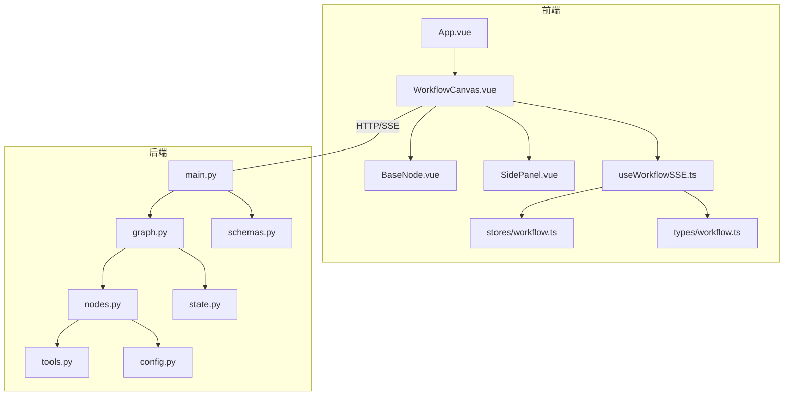
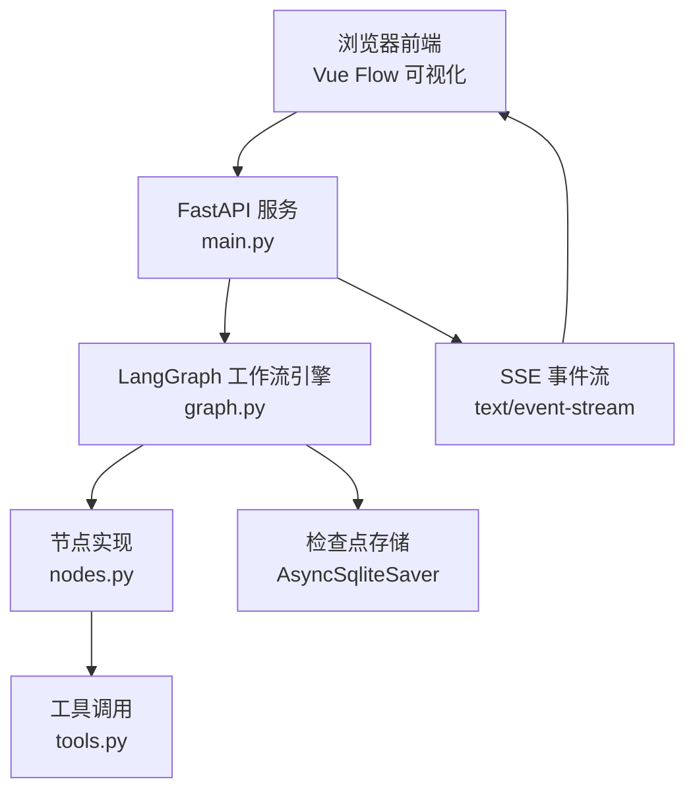
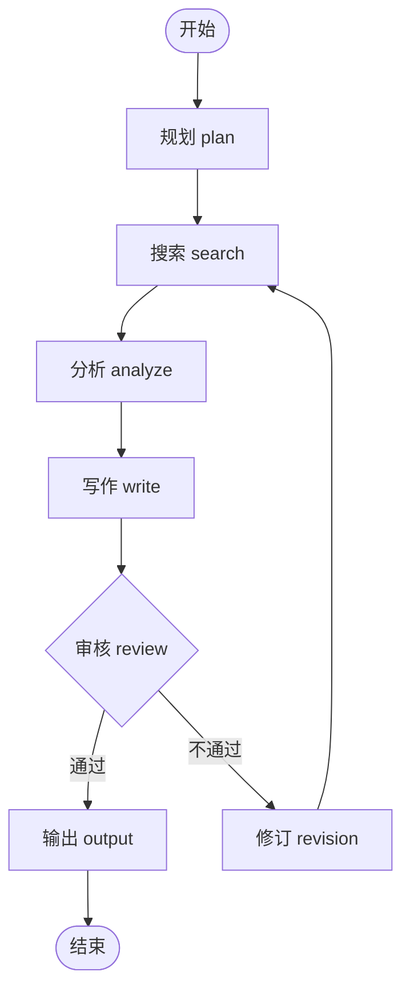
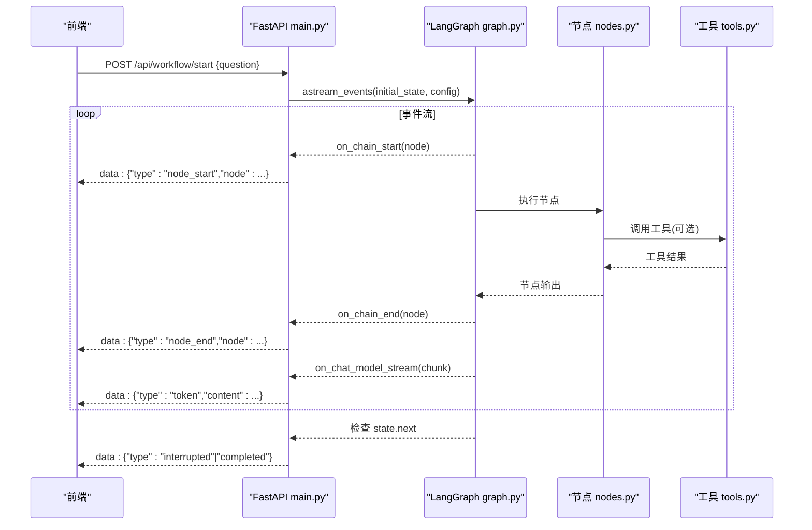
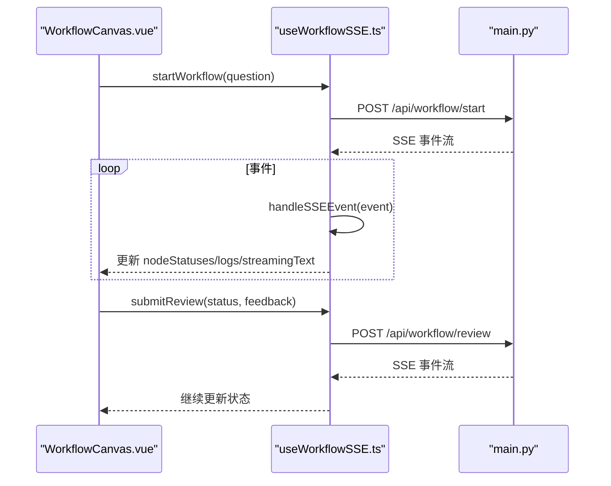
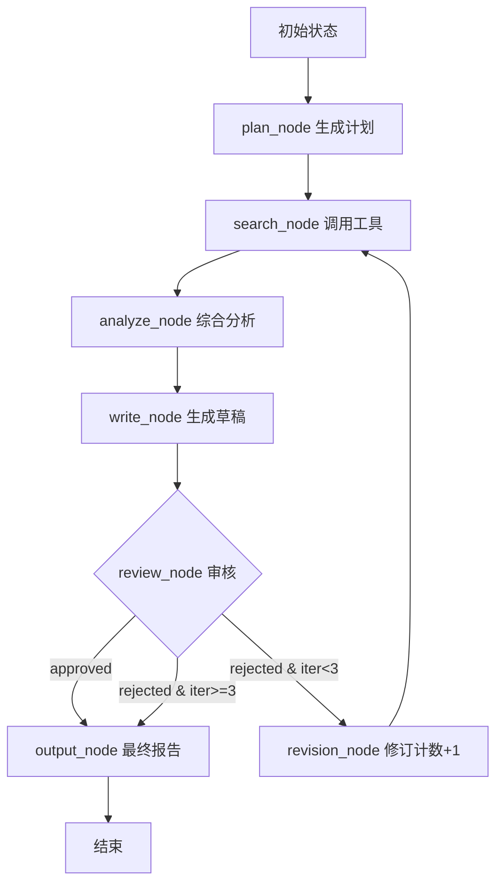
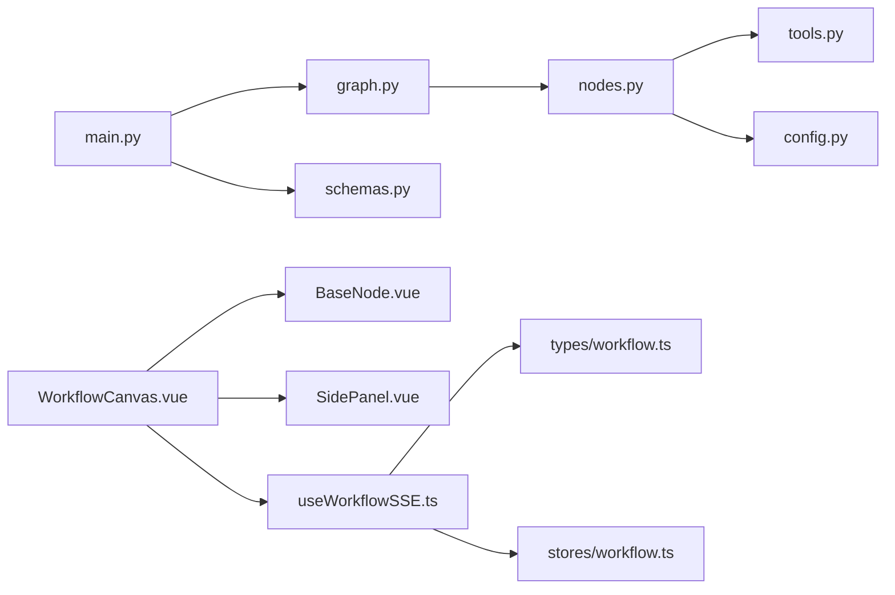

# 系统架构

<cite>
**本文引用的文件**
- [README.md](file://workflow-studio/README.md)
- [main.py](file://workflow-studio/backend/app/main.py)
- [graph.py](file://workflow-studio/backend/app/graph.py)
- [nodes.py](file://workflow-studio/backend/app/nodes.py)
- [state.py](file://workflow-studio/backend/app/state.py)
- [tools.py](file://workflow-studio/backend/app/tools.py)
- [config.py](file://workflow-studio/backend/app/config.py)
- [schemas.py](file://workflow-studio/backend/app/schemas.py)
- [App.vue](file://workflow-studio/frontend/src/App.vue)
- [WorkflowCanvas.vue](file://workflow-studio/frontend/src/components/WorkflowCanvas.vue)
- [BaseNode.vue](file://workflow-studio/frontend/src/components/nodes/BaseNode.vue)
- [SidePanel.vue](file://workflow-studio/frontend/src/components/layout/SidePanel.vue)
- [useWorkflowSSE.ts](file://workflow-studio/frontend/src/composables/useWorkflowSSE.ts)
- [workflow.ts](file://workflow-studio/frontend/src/stores/workflow.ts)
- [workflow.ts](file://workflow-studio/frontend/src/types/workflow.ts)
</cite>

## 目录
1. [简介](#简介)
2. [项目结构](#项目结构)
3. [核心组件](#核心组件)
4. [架构总览](#架构总览)
5. [详细组件分析](#详细组件分析)
6. [依赖关系分析](#依赖关系分析)
7. [性能考量](#性能考量)
8. [故障排查指南](#故障排查指南)
9. [结论](#结论)
10. [附录](#附录)

## 简介
本系统为“Workflow Studio”，是一个基于 LangGraph + Vue 3 + Vue Flow 的可视化多 Agent 研究工作流平台。后端采用 FastAPI 提供 REST 与 SSE（Server-Sent Events）接口，驱动 LangGraph 工作流执行；前端使用 Vue Flow 渲染流程图并实时展示节点状态、边动画与 LLM 流式输出。系统支持人工审核（Human-in-the-loop）、检查点恢复、条件分支与循环控制，具备防无限修订机制。

## 项目结构
- 后端（Python/FastAPI/LangGraph）
  - 入口与路由：main.py
  - 工作流图定义与编译：graph.py
  - 节点实现：nodes.py
  - 状态模型：state.py
  - 工具函数：tools.py
  - 配置加载：config.py
  - API 数据模型：schemas.py
- 前端（Vue 3/Vite/Pinia/Tailwind）
  - 应用根组件：App.vue
  - 画布与交互：WorkflowCanvas.vue
  - 自定义节点：BaseNode.vue
  - 侧边面板：SidePanel.vue
  - SSE 通信封装：useWorkflowSSE.ts
  - 全局状态：stores/workflow.ts
  - 类型定义：types/workflow.ts

图表来源
- [App.vue:1-10](file://workflow-studio/frontend/src/App.vue#L1-L10)
- [WorkflowCanvas.vue:1-133](file://workflow-studio/frontend/src/components/WorkflowCanvas.vue#L1-L133)
- [useWorkflowSSE.ts:1-172](file://workflow-studio/frontend/src/composables/useWorkflowSSE.ts#L1-L172)
- [main.py:1-200](file://workflow-studio/backend/app/main.py#L1-L200)
- [graph.py:1-78](file://workflow-studio/backend/app/graph.py#L1-L78)
- [nodes.py:1-129](file://workflow-studio/backend/app/nodes.py#L1-L129)
- [state.py:1-30](file://workflow-studio/backend/app/state.py#L1-L30)
- [tools.py:1-26](file://workflow-studio/backend/app/tools.py#L1-L26)
- [config.py:1-9](file://workflow-studio/backend/app/config.py#L1-L9)
- [schemas.py:1-12](file://workflow-studio/backend/app/schemas.py#L1-L12)

章节来源
- [README.md:1-109](file://workflow-studio/README.md#L1-L109)

## 核心组件
- 工作流引擎（LangGraph）
  - 通过 StateGraph 构建有向图，定义节点与边，并在审核前中断以等待人工输入。
  - 使用 AsyncSqliteSaver 持久化检查点，支持刷新页面后恢复执行。
- 后端 API（FastAPI）
  - /api/workflow/start：启动工作流，返回 SSE 事件流。
  - /api/workflow/review：提交审核结果，恢复中断的工作流。
  - /api/workflow/state/{id}：查询当前状态，用于页面恢复。
  - /api/workflow/graph-structure：返回图结构供前端渲染。
- 前端可视化（Vue Flow）
  - 使用自定义节点 BaseNode 渲染不同阶段节点，根据 SSE 事件更新节点状态与边动画。
  - SidePanel 提供输入、审核弹窗、流式文本与日志时间线。
- 实时通信（SSE）
  - 前端 useWorkflowSSE 解析后端推送的事件，驱动 UI 状态变化。

章节来源
- [graph.py:1-78](file://workflow-studio/backend/app/graph.py#L1-L78)
- [main.py:1-200](file://workflow-studio/backend/app/main.py#L1-L200)
- [WorkflowCanvas.vue:1-133](file://workflow-studio/frontend/src/components/WorkflowCanvas.vue#L1-L133)
- [useWorkflowSSE.ts:1-172](file://workflow-studio/frontend/src/composables/useWorkflowSSE.ts#L1-L172)

## 架构总览
系统采用前后端分离架构：
- 前端负责可视化与用户交互，通过 SSE 接收后端事件，实时更新节点状态与边动画。
- 后端负责工作流编排与执行，暴露 REST 接口并通过 SSE 推送事件。
- 工作流由 LangGraph 管理，包含规划、搜索、分析、写作、审核、修订、输出等节点，支持条件分支与循环。

图表来源
- [main.py:34-103](file://workflow-studio/backend/app/main.py#L34-L103)
- [graph.py:23-78](file://workflow-studio/backend/app/graph.py#L23-L78)
- [nodes.py:18-129](file://workflow-studio/backend/app/nodes.py#L18-L129)
- [tools.py:4-26](file://workflow-studio/backend/app/tools.py#L4-L26)

## 详细组件分析

### 工作流引擎（LangGraph）
- 图构建
  - 使用 StateGraph(ResearchState) 创建图，添加各节点与边。
  - 在 review 节点前中断，等待人工审核。
- 条件路由
  - 审核通过后进入 output；不通过且迭代次数未达上限则进入 revision，再回到 search；超过阈值强制输出。
- 检查点
  - 使用 AsyncSqliteSaver 保存状态，支持中断恢复与页面刷新后继续。

图表来源
- [graph.py:23-62](file://workflow-studio/backend/app/graph.py#L23-L62)
- [nodes.py:18-129](file://workflow-studio/backend/app/nodes.py#L18-L129)

章节来源
- [graph.py:1-78](file://workflow-studio/backend/app/graph.py#L1-L78)
- [nodes.py:1-129](file://workflow-studio/backend/app/nodes.py#L1-L129)
- [state.py:1-30](file://workflow-studio/backend/app/state.py#L1-L30)

### 后端 API 与 SSE 事件流
- 启动工作流
  - 接收问题，初始化 ResearchState，生成 workflow_id，调用 graph.astream_events 推送事件。
  - 事件类型包括 node_start、node_end、token、tool_result、interrupted、completed、error。
- 提交审核
  - 使用 Command(update=update, resume=True) 恢复中断，继续推送事件。
- 状态查询
  - 获取当前 state.values 与 next，判断是否中断。

图表来源
- [main.py:34-154](file://workflow-studio/backend/app/main.py#L34-L154)
- [graph.py:65-78](file://workflow-studio/backend/app/graph.py#L65-L78)
- [nodes.py:18-129](file://workflow-studio/backend/app/nodes.py#L18-L129)
- [tools.py:4-26](file://workflow-studio/backend/app/tools.py#L4-L26)

章节来源
- [main.py:1-200](file://workflow-studio/backend/app/main.py#L1-L200)
- [schemas.py:1-12](file://workflow-studio/backend/app/schemas.py#L1-L12)

### 前端可视化与 SSE 处理
- 画布与节点
  - WorkflowCanvas 注册自定义节点类型，维护节点与边的响应式数据，监听 SSE 状态更新节点样式与边动画。
  - BaseNode 根据 status 显示不同图标与颜色，支持耗时展示。
- 侧边面板
  - SidePanel 集成输入、审核弹窗、流式文本与日志时间线。
- SSE 通信
  - useWorkflowSSE 建立 fetch 连接，解析 data: 行，分发到 handleSSEEvent，更新 nodeStatuses、logs、isRunning、isInterrupted、streamingText 等状态。

图表来源
- [WorkflowCanvas.vue:1-133](file://workflow-studio/frontend/src/components/WorkflowCanvas.vue#L1-L133)
- [useWorkflowSSE.ts:1-172](file://workflow-studio/frontend/src/composables/useWorkflowSSE.ts#L1-L172)
- [main.py:34-154](file://workflow-studio/backend/app/main.py#L34-L154)

章节来源
- [WorkflowCanvas.vue:1-133](file://workflow-studio/frontend/src/components/WorkflowCanvas.vue#L1-L133)
- [BaseNode.vue:1-82](file://workflow-studio/frontend/src/components/nodes/BaseNode.vue#L1-L82)
- [SidePanel.vue:1-39](file://workflow-studio/frontend/src/components/layout/SidePanel.vue#L1-L39)
- [useWorkflowSSE.ts:1-172](file://workflow-studio/frontend/src/composables/useWorkflowSSE.ts#L1-L172)
- [workflow.ts:1-75](file://workflow-studio/frontend/src/stores/workflow.ts#L1-L75)
- [workflow.ts:1-64](file://workflow-studio/frontend/src/types/workflow.ts#L1-L64)

### 数据处理流程
- 状态模型
  - ResearchState 定义消息历史、工作流控制字段、研究内容、审核相关字段与元数据。
- 节点数据流转
  - plan：生成 research_plan 与 messages。
  - search：调用 web_search/academic_search，填充 search_results。
  - analyze：综合搜索结果生成 analysis。
  - write：基于 analysis 与反馈生成 draft_report。
  - review：暂停等待人工审核。
  - revision：递增 iteration_count，回退至 search。
  - output：产出 final_report 并结束。

图表来源
- [state.py:1-30](file://workflow-studio/backend/app/state.py#L1-L30)
- [nodes.py:18-129](file://workflow-studio/backend/app/nodes.py#L18-L129)
- [graph.py:11-21](file://workflow-studio/backend/app/graph.py#L11-L21)

章节来源
- [state.py:1-30](file://workflow-studio/backend/app/state.py#L1-L30)
- [nodes.py:1-129](file://workflow-studio/backend/app/nodes.py#L1-L129)

## 依赖关系分析
- 后端模块耦合
  - main.py 依赖 graph.py、state.py、schemas.py。
  - graph.py 依赖 nodes.py、state.py 与检查点存储。
  - nodes.py 依赖 tools.py、config.py 与 LLM 客户端。
- 前端模块耦合
  - WorkflowCanvas.vue 依赖 BaseNode.vue、SidePanel.vue 与 useWorkflowSSE.ts。
  - useWorkflowSSE.ts 依赖 types/workflow.ts 与 stores/workflow.ts。

图表来源
- [main.py:1-200](file://workflow-studio/backend/app/main.py#L1-L200)
- [graph.py:1-78](file://workflow-studio/backend/app/graph.py#L1-L78)
- [nodes.py:1-129](file://workflow-studio/backend/app/nodes.py#L1-L129)
- [tools.py:1-26](file://workflow-studio/backend/app/tools.py#L1-L26)
- [config.py:1-9](file://workflow-studio/backend/app/config.py#L1-L9)
- [schemas.py:1-12](file://workflow-studio/backend/app/schemas.py#L1-L12)
- [WorkflowCanvas.vue:1-133](file://workflow-studio/frontend/src/components/WorkflowCanvas.vue#L1-L133)
- [BaseNode.vue:1-82](file://workflow-studio/frontend/src/components/nodes/BaseNode.vue#L1-L82)
- [SidePanel.vue:1-39](file://workflow-studio/frontend/src/components/layout/SidePanel.vue#L1-L39)
- [useWorkflowSSE.ts:1-172](file://workflow-studio/frontend/src/composables/useWorkflowSSE.ts#L1-L172)
- [workflow.ts:1-64](file://workflow-studio/frontend/src/types/workflow.ts#L1-L64)
- [workflow.ts:1-75](file://workflow-studio/frontend/src/stores/workflow.ts#L1-L75)

章节来源
- [main.py:1-200](file://workflow-studio/backend/app/main.py#L1-L200)
- [graph.py:1-78](file://workflow-studio/backend/app/graph.py#L1-L78)
- [nodes.py:1-129](file://workflow-studio/backend/app/nodes.py#L1-L129)
- [tools.py:1-26](file://workflow-studio/backend/app/tools.py#L1-L26)
- [config.py:1-9](file://workflow-studio/backend/app/config.py#L1-L9)
- [schemas.py:1-12](file://workflow-studio/backend/app/schemas.py#L1-L12)
- [WorkflowCanvas.vue:1-133](file://workflow-studio/frontend/src/components/WorkflowCanvas.vue#L1-L133)
- [BaseNode.vue:1-82](file://workflow-studio/frontend/src/components/nodes/BaseNode.vue#L1-L82)
- [SidePanel.vue:1-39](file://workflow-studio/frontend/src/components/layout/SidePanel.vue#L1-L39)
- [useWorkflowSSE.ts:1-172](file://workflow-studio/frontend/src/composables/useWorkflowSSE.ts#L1-L172)
- [workflow.ts:1-75](file://workflow-studio/frontend/src/stores/workflow.ts#L1-L75)
- [workflow.ts:1-64](file://workflow-studio/frontend/src/types/workflow.ts#L1-L64)

## 性能考量
- 后端
  - 使用异步框架与异步检查点，减少阻塞。
  - 限制 token 输出长度与工具结果截断，降低网络负载。
  - 审核前中断避免长时间占用资源。
- 前端
  - 仅对运行中或已完成的源节点启用边动画，减少重绘开销。
  - 流式文本增量拼接，避免全量重渲染。
- 扩展建议
  - 将检查点存储迁移至 PostgreSQL 提升并发与可靠性。
  - 引入缓存层（如 Redis）存储高频读取的图结构与状态摘要。
  - 对工具调用进行限流与重试策略优化。

## 故障排查指南
- 常见问题
  - 工作流未启动：检查 /api/workflow/start 请求与 CORS 配置。
  - 无法恢复：确认 workflow_id 有效且检查点存在。
  - 审核无响应：验证 /api/workflow/review 参数与状态更新。
- 错误处理
  - 后端在异常时返回 error 事件，前端记录日志并停止运行。
  - 前端在解析失败时忽略单条错误，保证流持续。
- 调试建议
  - 查看浏览器控制台与后端日志，定位事件断点。
  - 使用 /api/workflow/state/{id} 检查当前状态与 next。

章节来源
- [main.py:96-103](file://workflow-studio/backend/app/main.py#L96-L103)
- [main.py:147-154](file://workflow-studio/backend/app/main.py#L147-L154)
- [useWorkflowSSE.ts:100-113](file://workflow-studio/frontend/src/composables/useWorkflowSSE.ts#L100-L113)
- [useWorkflowSSE.ts:144-156](file://workflow-studio/frontend/src/composables/useWorkflowSSE.ts#L144-L156)

## 结论
该系统通过 LangGraph 实现了可中断、可恢复、带条件分支的多 Agent 工作流，结合 Vue Flow 提供了直观的可视化体验。SSE 保证了低延迟的状态同步，检查点机制提升了鲁棒性。整体架构清晰、职责分明，具备良好的扩展性与可维护性。未来可在并行节点、模板化工作流与性能监控方面进一步演进。

## 附录
- 技术选型决策
  - LangGraph：提供有状态图、条件边与中断能力，适合复杂工作流。
  - FastAPI：高性能异步 Web 框架，原生支持 SSE。
  - Vue Flow：成熟的流程图库，便于定制节点与交互。
  - Pinia：轻量状态管理，配合 Composables 组织逻辑。
- 架构约束
  - 审核节点前必须中断，确保人工介入。
  - 修订轮次上限防止无限循环。
  - 检查点存储需与业务规模匹配（SQLite 演示，生产建议 PG）。
- 扩展点设计
  - 新增节点：在 graph.py 中添加节点与边，在 nodes.py 实现逻辑。
  - 新工具：在 tools.py 增加 @tool 装饰函数，节点内调用。
  - 前端扩展：在 WorkflowCanvas.vue 注册新节点类型，或在 SidePanel.vue 增加交互。