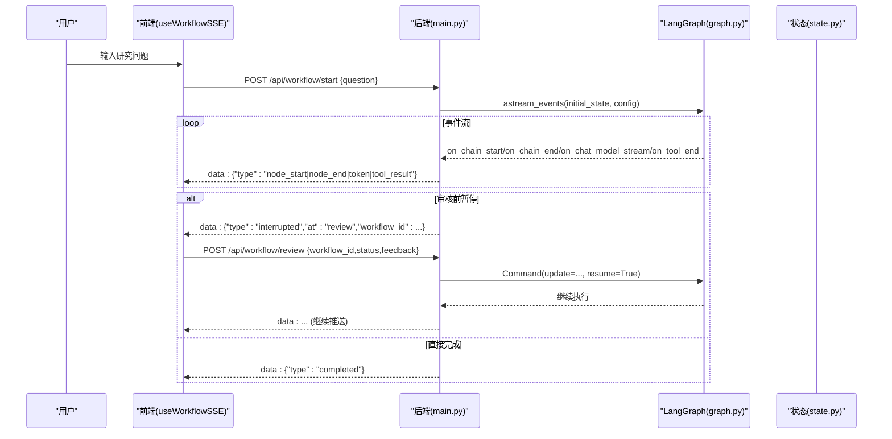
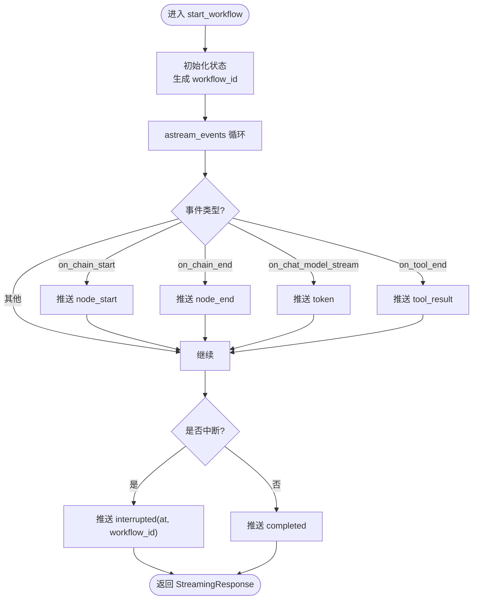
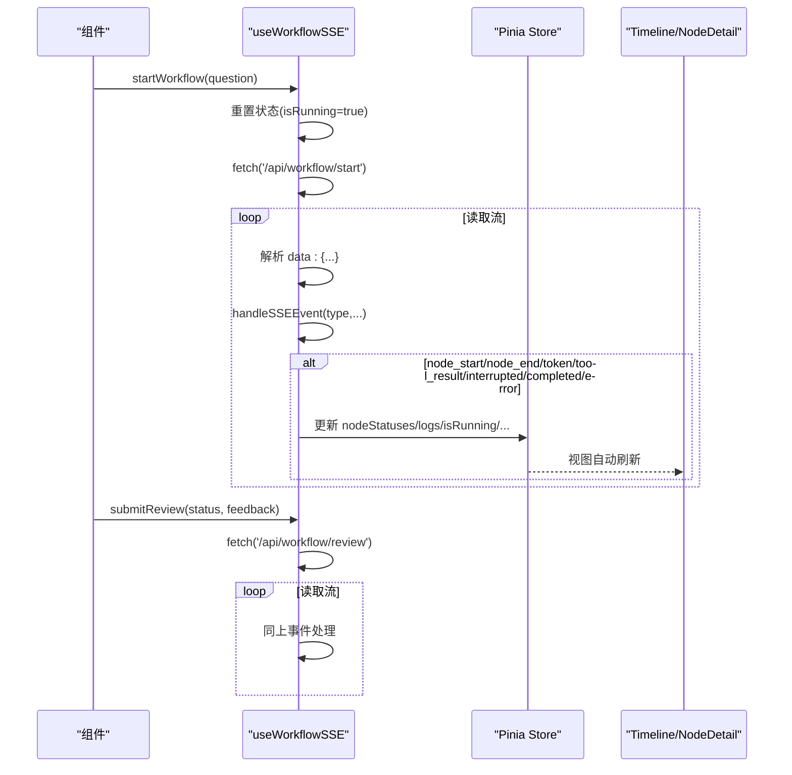
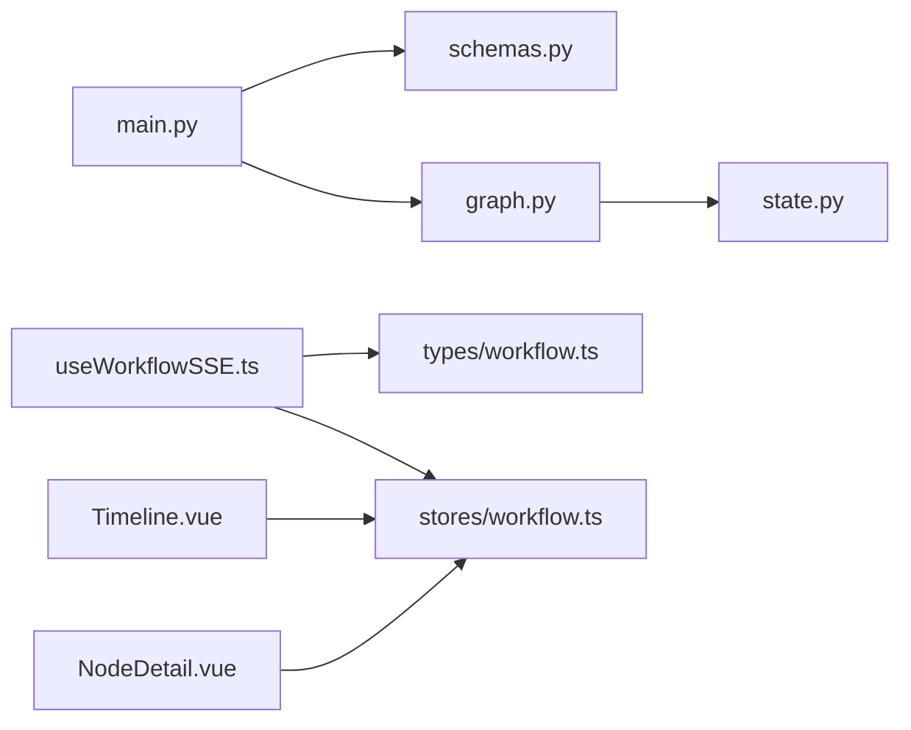

# 通信机制

<cite>
**本文引用的文件**
- [main.py](file://workflow-studio/backend/app/main.py)
- [schemas.py](file://workflow-studio/backend/app/schemas.py)
- [graph.py](file://workflow-studio/backend/app/graph.py)
- [state.py](file://workflow-studio/backend/app/state.py)
- [useWorkflowSSE.ts](file://workflow-studio/frontend/src/composables/useWorkflowSSE.ts)
- [workflow.ts](file://workflow-studio/frontend/src/stores/workflow.ts)
- [workflow.ts（类型）](file://workflow-studio/frontend/src/types/workflow.ts)
- [Timeline.vue](file://workflow-studio/frontend/src/components/panels/Timeline.vue)
- [NodeDetail.vue](file://workflow-studio/frontend/src/components/panels/NodeDetail.vue)
- [README.md](file://workflow-studio/README.md)
</cite>

## 目录
1. [简介](#简介)
2. [项目结构](#项目结构)
3. [核心组件](#核心组件)
4. [架构总览](#架构总览)
5. [详细组件分析](#详细组件分析)
6. [依赖关系分析](#依赖关系分析)
7. [性能考虑](#性能考虑)
8. [故障排查指南](#故障排查指南)
9. [结论](#结论)
10. [附录：协议与接口规范](#附录协议与接口规范)

## 简介
本文件面向全栈开发者，系统化梳理 Workflow Studio 的通信层设计与实现，重点围绕 SSE（Server-Sent Events）实时通信、连接管理、事件处理、前后端数据协议、错误处理、异步任务调度、状态更新推送与断线恢复策略。文档同时给出性能优化建议、安全注意事项与调试技巧，帮助读者快速理解并扩展该系统的通信能力。

## 项目结构
后端基于 FastAPI 提供 REST + SSE 接口，前端通过 Fetch ReadableStream 消费 SSE 流，使用 Vue 组合式函数集中管理状态与事件分发，Pinia Store 作为全局状态容器，配合可视化面板展示执行日志与节点详情。

```mermaid
graph TB
subgraph "前端"
FE_Composable["useWorkflowSSE.ts"]
FE_Store["stores/workflow.ts"]
FE_Timeline["components/panels/Timeline.vue"]
FE_NodeDetail["components/panels/NodeDetail.vue"]
end
subgraph "后端"
BE_Main["app/main.py"]
BE_Schemas["app/schemas.py"]
BE_Graph["app/graph.py"]
BE_State["app/state.py"]
end
FE_Composable --> |POST /api/workflow/start<br/>POST /api/workflow/review| BE_Main
FE_Store --> |GET /api/workflow/state/{id}<br/>GET /api/workflow/graph-structure| BE_Main
FE_Timeline --> FE_Store
FE_NodeDetail --> FE_Store
BE_Main --> BE_Graph
BE_Graph --> BE_State
BE_Main --> BE_Schemas
```

图表来源
- [main.py:34-154](file://workflow-studio/backend/app/main.py#L34-L154)
- [useWorkflowSSE.ts:74-157](file://workflow-studio/frontend/src/composables/useWorkflowSSE.ts#L74-L157)
- [workflow.ts:5-73](file://workflow-studio/frontend/src/stores/workflow.ts#L5-L73)
- [graph.py:23-77](file://workflow-studio/backend/app/graph.py#L23-L77)
- [state.py:5-30](file://workflow-studio/backend/app/state.py#L5-L30)

章节来源
- [README.md:15-90](file://workflow-studio/README.md#L15-L90)

## 核心组件
- 后端 API 与 SSE 推送
  - 启动工作流：POST /api/workflow/start，返回 SSE 流，推送节点开始/结束、LLM token、工具结果、中断/完成/错误等事件。
  - 人工审核恢复：POST /api/workflow/review，注入审核结果并继续执行，同样以 SSE 推送后续事件。
  - 状态查询：GET /api/workflow/state/{workflow_id}，用于页面刷新后从检查点恢复。
  - 图结构：GET /api/workflow/graph-structure，供前端渲染流程图。
- 前端 SSE 客户端
  - useWorkflowSSE：封装 fetch + ReadableStream 读取、事件解析、状态更新、审核提交。
  - Pinia Store：集中保存工作流 ID、节点状态、日志、运行标志、流式文本等。
  - 视图组件：Timeline 显示日志；NodeDetail 显示选中节点的状态。

章节来源
- [main.py:34-173](file://workflow-studio/backend/app/main.py#L34-L173)
- [useWorkflowSSE.ts:1-172](file://workflow-studio/frontend/src/composables/useWorkflowSSE.ts#L1-L172)
- [workflow.ts:5-73](file://workflow-studio/frontend/src/stores/workflow.ts#L5-L73)
- [Timeline.vue:1-22](file://workflow-studio/frontend/src/components/panels/Timeline.vue#L1-L22)
- [NodeDetail.vue:1-36](file://workflow-studio/frontend/src/components/panels/NodeDetail.vue#L1-L36)

## 架构总览
SSE 是单向长连接，适合“后端主动推送”的场景。本系统采用“请求-响应即流”的模式：前端发起一次 POST/GET，后端立即返回一个持续的事件流，直到工作流完成或中断。



图表来源
- [main.py:60-154](file://workflow-studio/backend/app/main.py#L60-L154)
- [graph.py:65-77](file://workflow-studio/backend/app/graph.py#L65-L77)
- [useWorkflowSSE.ts:74-157](file://workflow-studio/frontend/src/composables/useWorkflowSSE.ts#L74-L157)

## 详细组件分析

### 后端：SSE 事件生成与流程控制
- 启动工作流
  - 创建初始状态（包含 workflow_id、started_at 等元数据）。
  - 使用 LangGraph 的 astream_events 迭代事件，按事件类型映射为统一的前端事件格式。
  - 结束时检查是否被中断（state.next），若存在则推送 interrupted 事件并携带 workflow_id 与 at 节点名；否则推送 completed。
- 人工审核恢复
  - 接收 review 请求，构造 Command(update=..., resume=True)，从中断点恢复执行，继续推送事件。
- 状态查询与图结构
  - 提供 state 查询接口，便于前端在刷新后恢复 UI 状态。
  - 提供 graph-structure 接口，用于前端渲染流程图。



图表来源
- [main.py:60-103](file://workflow-studio/backend/app/main.py#L60-L103)
- [main.py:119-154](file://workflow-studio/backend/app/main.py#L119-L154)

章节来源
- [main.py:34-173](file://workflow-studio/backend/app/main.py#L34-L173)
- [schemas.py:4-12](file://workflow-studio/backend/app/schemas.py#L4-L12)
- [graph.py:23-77](file://workflow-studio/backend/app/graph.py#L23-L77)
- [state.py:5-30](file://workflow-studio/backend/app/state.py#L5-L30)

### 前端：SSE 客户端与状态管理
- 连接与解析
  - 使用 fetch 发起请求，获取 response.body.getReader()，逐块解码文本并按行过滤 data: 开头的行，解析 JSON 后分发给 handleSSEEvent。
- 事件处理
  - node_start/node_end：更新节点状态（running/completed），追加日志。
  - token：累积流式输出文本。
  - tool_result：记录工具执行结果摘要。
  - interrupted：标记 isInterrupted=true，记录 interruptedAt 与 workflow_id，将对应节点置为 waiting。
  - completed/error：重置运行标志，记录日志。
- 审核提交
  - 当处于中断状态时，调用 /api/workflow/review 提交审核结果，继续消费 SSE 流。



图表来源
- [useWorkflowSSE.ts:19-157](file://workflow-studio/frontend/src/composables/useWorkflowSSE.ts#L19-L157)
- [workflow.ts:5-73](file://workflow-studio/frontend/src/stores/workflow.ts#L5-L73)
- [Timeline.vue:1-22](file://workflow-studio/frontend/src/components/panels/Timeline.vue#L1-L22)
- [NodeDetail.vue:1-36](file://workflow-studio/frontend/src/components/panels/NodeDetail.vue#L1-L36)

章节来源
- [useWorkflowSSE.ts:1-172](file://workflow-studio/frontend/src/composables/useWorkflowSSE.ts#L1-L172)
- [workflow.ts:5-73](file://workflow-studio/frontend/src/stores/workflow.ts#L5-L73)
- [Timeline.vue:1-22](file://workflow-studio/frontend/src/components/panels/Timeline.vue#L1-L22)
- [NodeDetail.vue:1-36](file://workflow-studio/frontend/src/components/panels/NodeDetail.vue#L1-L36)

### 数据模型与协议
- 请求模型
  - StartRequest：包含 question。
  - ReviewRequest：包含 workflow_id、status（approved/rejected）、feedback。
- SSE 事件类型
  - node_start：节点开始执行。
  - node_end：节点执行完成。
  - token：LLM 流式内容片段。
  - tool_result：工具执行结果摘要。
  - interrupted：工作流在中断点等待人工审核，附带 at 节点名与 workflow_id。
  - completed：工作流完成。
  - error：发生异常，附带 message。
- 状态查询与图结构
  - /api/workflow/state/{workflow_id}：返回 values、next、is_interrupted。
  - /api/workflow/graph-structure：返回 nodes 与 edges 列表。

章节来源
- [schemas.py:4-12](file://workflow-studio/backend/app/schemas.py#L4-L12)
- [workflow.ts（类型）:22-32](file://workflow-studio/frontend/src/types/workflow.ts#L22-L32)
- [main.py:158-173](file://workflow-studio/backend/app/main.py#L158-L173)
- [main.py:177-200](file://workflow-studio/backend/app/main.py#L177-L200)

### 异步任务调度与状态更新
- 后端通过 LangGraph 的 astream_events 异步迭代事件，按事件类型即时推送到前端。
- 审核节点前设置 interrupt_before=["review"]，使工作流在该节点暂停，等待外部命令恢复。
- 前端根据 interrupted 事件将对应节点状态置为 waiting，并在收到审核结果后恢复执行。

章节来源
- [graph.py:65-77](file://workflow-studio/backend/app/graph.py#L65-L77)
- [main.py:89-94](file://workflow-studio/backend/app/main.py#L89-L94)
- [main.py:141-146](file://workflow-studio/backend/app/main.py#L141-L146)
- [useWorkflowSSE.ts:47-58](file://workflow-studio/frontend/src/composables/useWorkflowSSE.ts#L47-L58)

### 断线重连与恢复策略
- 当前实现未内置自动重连逻辑。建议在以下层面增强：
  - 前端：监听网络错误与流关闭事件，基于指数退避策略重试 /api/workflow/start 或 /api/workflow/review，并携带上次已消费的 workflow_id 与 last_event_id（可自定义扩展 SSE 协议）。
  - 后端：支持 Last-Event-ID 语义，以便服务端定位断点续传（当前未实现）。
  - 状态恢复：利用 /api/workflow/state/{workflow_id} 在页面刷新后重建 UI 状态。

[本节为概念性说明，不直接分析具体代码]

## 依赖关系分析
- 后端
  - main.py 依赖 schemas.py（请求校验）、graph.py（工作流定义与编译）、state.py（状态结构）。
  - graph.py 依赖 state.py，并通过 LangGraph 的 StateGraph 构建有向图，配置 interrupt_before 与 checkpointer。
- 前端
  - useWorkflowSSE.ts 依赖 types/workflow.ts 的类型定义，驱动 stores/workflow.ts 的全局状态。
  - Timeline.vue 与 NodeDetail.vue 消费 store 中的 logs 与 nodeStatuses 进行渲染。



图表来源
- [main.py:34-173](file://workflow-studio/backend/app/main.py#L34-L173)
- [graph.py:23-77](file://workflow-studio/backend/app/graph.py#L23-L77)
- [useWorkflowSSE.ts:1-172](file://workflow-studio/frontend/src/composables/useWorkflowSSE.ts#L1-L172)
- [workflow.ts:5-73](file://workflow-studio/frontend/src/stores/workflow.ts#L5-L73)

章节来源
- [main.py:34-173](file://workflow-studio/backend/app/main.py#L34-L173)
- [graph.py:23-77](file://workflow-studio/backend/app/graph.py#L23-L77)
- [useWorkflowSSE.ts:1-172](file://workflow-studio/frontend/src/composables/useWorkflowSSE.ts#L1-L172)
- [workflow.ts:5-73](file://workflow-studio/frontend/src/stores/workflow.ts#L5-L73)

## 性能考虑
- 传输层
  - 使用 text/event-stream 与 StreamingResponse，避免整包缓冲，降低延迟。
  - 合理拆分事件粒度：token 级别推送可实现更流畅的 LLM 输出体验。
- 前端处理
  - 使用 TextDecoder 增量解码，减少内存占用。
  - 对日志数组进行截断或虚拟滚动，避免大量 DOM 操作导致卡顿。
  - 节流/防抖：对高频 token 事件可做合并或节流，平衡实时性与渲染压力。
- 后端优化
  - 限制输出长度：如 node_end 中仅截取部分 output，避免过大 payload。
  - 并发与资源：确保 astream_events 的异步迭代不被阻塞；必要时引入队列与背压控制。
- 缓存与代理
  - 通过中间件允许跨域访问；生产环境可在 Nginx 层禁用缓冲（X-Accel-Buffering=no）以保证实时性。

[本节提供通用指导，不直接分析具体代码]

## 故障排查指南
- 常见问题
  - 前端无法解析事件：检查 data: 行过滤与 JSON 解析逻辑，关注异常捕获与日志记录。
  - 工作流未恢复：确认 interrupted 事件中 workflow_id 是否正确传递至审核请求。
  - 页面刷新后状态丢失：调用 /api/workflow/state/{workflow_id} 恢复 UI。
- 调试技巧
  - 浏览器 Network 面板查看 SSE 流，确认事件序列与负载大小。
  - 后端日志：在 event_stream 中加入关键步骤日志，定位卡点或异常。
  - 最小化复现：先验证 /api/workflow/graph-structure 与 /api/workflow/state 接口可用性。

章节来源
- [useWorkflowSSE.ts:94-157](file://workflow-studio/frontend/src/composables/useWorkflowSSE.ts#L94-L157)
- [main.py:96-98](file://workflow-studio/backend/app/main.py#L96-L98)
- [main.py:147-148](file://workflow-studio/backend/app/main.py#L147-L148)
- [main.py:158-173](file://workflow-studio/backend/app/main.py#L158-L173)

## 结论
本系统通过 FastAPI 的 StreamingResponse 与 LangGraph 的 astream_events 实现了高效、低延迟的 SSE 实时通信。前端以组合式函数集中处理事件与状态，结合 Pinia Store 与可视化组件，提供了良好的用户体验。未来可在断线重连、Last-Event-ID、事件去重与压缩等方面进一步增强鲁棒性与性能。

[本节为总结性内容，不直接分析具体代码]

## 附录：协议与接口规范
- 接口清单
  - POST /api/workflow/start
    - 请求体：{ question }
    - 响应：text/event-stream，事件包括 node_start、node_end、token、tool_result、interrupted、completed、error
  - POST /api/workflow/review
    - 请求体：{ workflow_id, status, feedback }
    - 响应：text/event-stream，同 start 事件集
  - GET /api/workflow/state/{workflow_id}
    - 响应：{ workflow_id, values, next, is_interrupted }
  - GET /api/workflow/graph-structure
    - 响应：{ nodes, edges }
- 事件字段约定
  - type：事件类型枚举
  - node：节点标识（node_start/node_end）
  - content：token 内容片段
  - data：工具结果摘要
  - at：中断所在节点名
  - workflow_id：工作流唯一标识
  - message：错误信息

章节来源
- [schemas.py:4-12](file://workflow-studio/backend/app/schemas.py#L4-L12)
- [main.py:34-173](file://workflow-studio/backend/app/main.py#L34-L173)
- [workflow.ts（类型）:22-32](file://workflow-studio/frontend/src/types/workflow.ts#L22-L32)