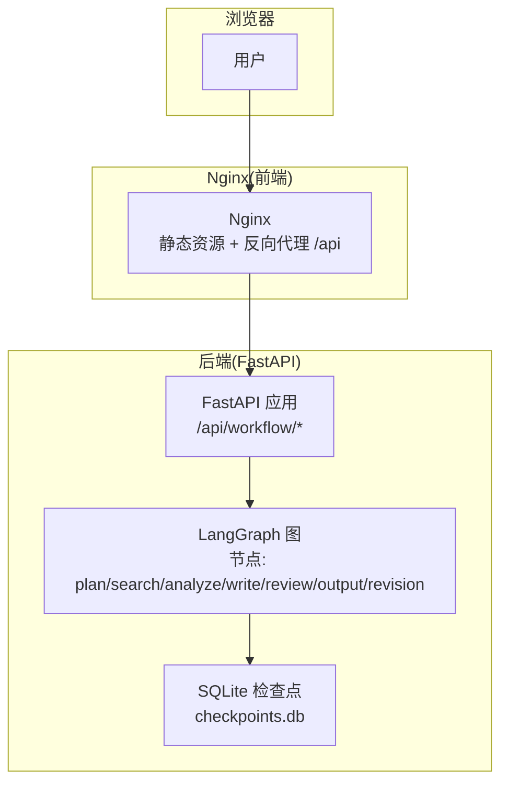
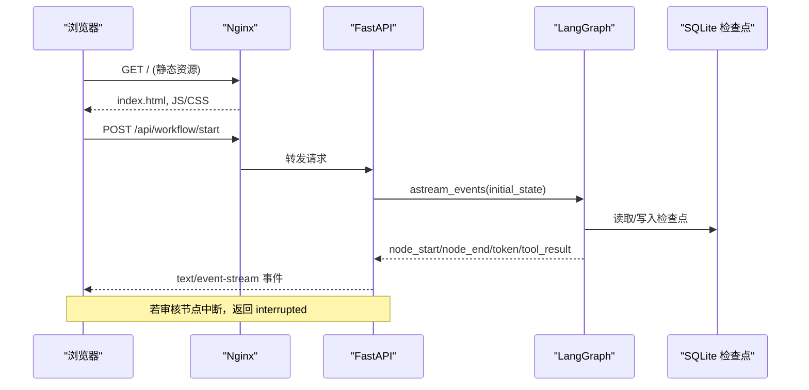
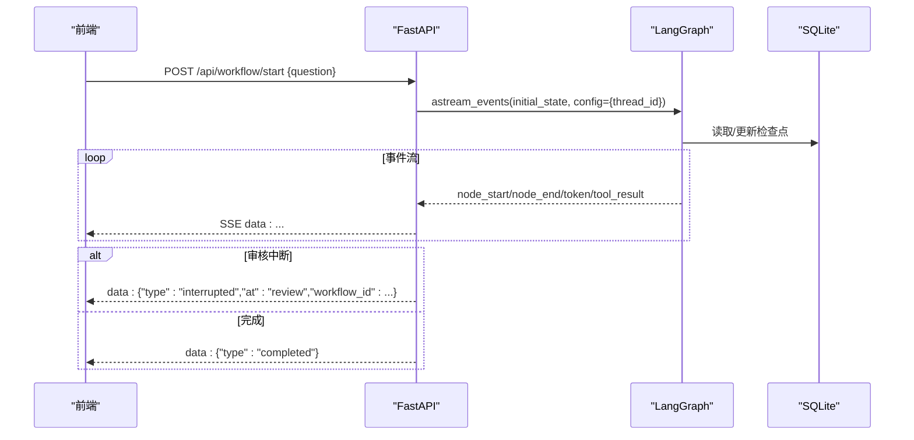
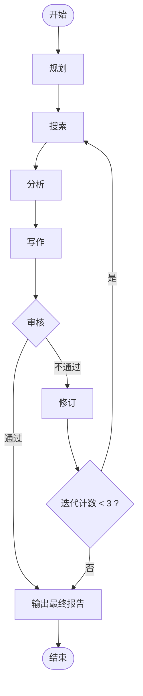
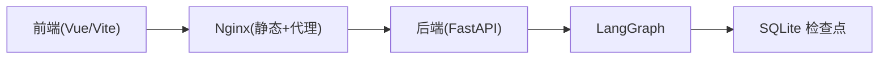

# Docker 容器化部署

<cite>
**本文引用的文件**
- [backend/app/main.py](file://workflow-studio/backend/app/main.py)
- [backend/app/config.py](file://workflow-studio/backend/app/config.py)
- [backend/app/graph.py](file://workflow-studio/backend/app/graph.py)
- [backend/requirements.txt](file://workflow-studio/backend/requirements.txt)
- [frontend/package.json](file://workflow-studio/frontend/package.json)
- [frontend/vite.config.ts](file://workflow-studio/frontend/vite.config.ts)
- [README.md](file://workflow-studio/README.md)
</cite>

## 目录
1. [简介](#简介)
2. [项目结构](#项目结构)
3. [核心组件](#核心组件)
4. [架构总览](#架构总览)
5. [详细组件分析](#详细组件分析)
6. [依赖关系分析](#依赖关系分析)
7. [性能与资源限制](#性能与资源限制)
8. [故障恢复与可观测性](#故障恢复与可观测性)
9. [构建与运行指南](#构建与运行指南)
10. [环境变量与配置](#环境变量与配置)
11. [数据持久化与网络](#数据持久化与网络)
12. [扩展配置示例](#扩展配置示例)
13. [常见问题排查](#常见问题排查)
14. [结论](#结论)

## 简介
本方案为 Workflow Studio 提供生产可用的 Docker 容器化部署，包含：
- 多阶段构建优化镜像体积（前端静态资源 + Nginx；后端 Python FastAPI）
- docker-compose 编排前后端服务与数据库（SQLite 检查点持久化）
- 环境变量注入、数据卷持久化、网络隔离
- 构建命令、运行脚本、扩展配置示例
- 解决容器间通信、资源限制和故障恢复问题

## 项目结构
Workflow Studio 由前后端组成：
- 后端：FastAPI + LangGraph，提供工作流执行、SSE 事件流、状态查询等 API
- 前端：Vue 3 + Vite，构建后通过 Nginx 提供静态页面，并代理 /api 到后端

图表来源
- [backend/app/main.py:14-21](file://workflow-studio/backend/app/main.py#L14-L21)
- [backend/app/graph.py:23-77](file://workflow-studio/backend/app/graph.py#L23-L77)
- [frontend/vite.config.ts:12-20](file://workflow-studio/frontend/vite.config.ts#L12-L20)

章节来源
- [README.md:15-90](file://workflow-studio/README.md#L15-L90)
- [frontend/vite.config.ts:12-20](file://workflow-studio/frontend/vite.config.ts#L12-L20)

## 核心组件
- 后端 API：启动工作流、提交审核、获取状态、获取图结构
- 工作流引擎：LangGraph 有状态图，支持中断与恢复
- 持久化：SQLite 检查点用于刷新页面恢复进度
- 前端：Vite 开发时代理 /api 到后端；生产环境由 Nginx 统一入口

章节来源
- [backend/app/main.py:34-173](file://workflow-studio/backend/app/main.py#L34-L173)
- [backend/app/graph.py:23-77](file://workflow-studio/backend/app/graph.py#L23-L77)
- [backend/app/state.py:5-30](file://workflow-studio/backend/app/state.py#L5-L30)
- [frontend/package.json:6-9](file://workflow-studio/frontend/package.json#L6-L9)

## 架构总览
生产部署采用“Nginx + FastAPI + SQLite”的轻量组合。Nginx 负责静态资源与反向代理，FastAPI 处理业务逻辑并通过 SSE 向前端推送实时事件，SQLite 作为检查点存储。

图表来源
- [backend/app/main.py:34-103](file://workflow-studio/backend/app/main.py#L34-L103)
- [backend/app/graph.py:65-77](file://workflow-studio/backend/app/graph.py#L65-L77)

## 详细组件分析

### 后端 API 与服务
- 启动工作流：POST /api/workflow/start，创建初始状态，使用 LangGraph 的事件流输出节点开始/结束、LLM token、工具结果，并在审核节点中断或完成时通知前端
- 提交审核：POST /api/workflow/review，注入审核结果并恢复执行
- 获取状态：GET /api/workflow/state/{workflow_id}，用于页面刷新后恢复
- 获取图结构：GET /api/workflow/graph-structure，供前端渲染流程图

图表来源
- [backend/app/main.py:34-103](file://workflow-studio/backend/app/main.py#L34-L103)
- [backend/app/graph.py:65-77](file://workflow-studio/backend/app/graph.py#L65-L77)

章节来源
- [backend/app/main.py:34-173](file://workflow-studio/backend/app/main.py#L34-L173)
- [backend/app/graph.py:23-77](file://workflow-studio/backend/app/graph.py#L23-L77)

### 工作流图与状态
- 图节点：plan → search → analyze → write → review → output，review 不通过进入 revision 再回到 search，最多 3 轮强制输出
- 状态字段：消息历史、当前步骤、迭代次数、研究内容、审核信息、元数据
- 检查点：在审核前中断，便于人工介入与恢复

图表来源
- [backend/app/graph.py:23-62](file://workflow-studio/backend/app/graph.py#L23-L62)
- [backend/app/state.py:5-30](file://workflow-studio/backend/app/state.py#L5-L30)

章节来源
- [backend/app/graph.py:23-77](file://workflow-studio/backend/app/graph.py#L23-L77)
- [backend/app/state.py:5-30](file://workflow-studio/backend/app/state.py#L5-L30)

### 前端与代理
- 开发模式：Vite 将 /api 代理到 http://localhost:1994
- 生产模式：Nginx 提供静态资源并将 /api 反向代理到后端服务

章节来源
- [frontend/vite.config.ts:12-20](file://workflow-studio/frontend/vite.config.ts#L12-L20)
- [frontend/package.json:6-9](file://workflow-studio/frontend/package.json#L6-L9)

## 依赖关系分析
- 后端依赖：langgraph、fastapi、uvicorn、sqlite 检查点、httpx、sse-starlette、python-dotenv
- 前端依赖：vue、@vue-flow/*、pinia、tailwind 等
- 运行时：Python 3.11+、Node.js 18+（仅构建期）、Nginx（生产）

图表来源
- [backend/requirements.txt:1-10](file://workflow-studio/backend/requirements.txt#L1-L10)
- [frontend/package.json:11-29](file://workflow-studio/frontend/package.json#L11-L29)

章节来源
- [backend/requirements.txt:1-10](file://workflow-studio/backend/requirements.txt#L1-L10)
- [frontend/package.json:11-29](file://workflow-studio/frontend/package.json#L11-L29)

## 性能与资源限制
- 镜像优化：多阶段构建，仅在生产镜像中保留运行所需依赖
- 并发模型：Uvicorn 默认异步 worker，建议根据 CPU 核数设置 workers=CPU*2+1
- 内存限制：为后端容器设置 memory limit，避免 LLM 调用导致 OOM
- I/O 瓶颈：SQLite 在高并发下可能成为瓶颈，生产建议迁移至 PostgreSQL 并调整 WAL 模式
- 网络：Nginx 与后端之间使用内网网络，减少外部暴露面

[本节为通用指导，无需具体文件引用]

## 故障恢复与可观测性
- 检查点恢复：页面刷新后通过 /api/workflow/state/{workflow_id} 恢复状态
- 中断恢复：审核节点中断后，前端调用 /api/workflow/review 注入结果继续执行
- 日志：后端启用 uvicorn access log，Nginx 记录访问日志
- 健康检查：可通过增加 /health 端点进行存活探针

章节来源
- [backend/app/main.py:157-173](file://workflow-studio/backend/app/main.py#L157-L173)
- [backend/app/main.py:106-154](file://workflow-studio/backend/app/main.py#L106-L154)

## 构建与运行指南

### 前置条件
- 安装 Docker 与 docker-compose
- 准备 OPENAI_API_KEY（或自定义 LLM_BASE_URL、LLM_MODEL）

### 构建镜像
- 后端镜像：基于 python:3.11-slim，安装 requirements.txt 依赖
- 前端镜像：基于 node:18-alpine 构建静态资源，再用 nginx:alpine 提供服务

### 运行服务
- 使用 docker-compose 启动：
  - 服务：nginx、backend、可选 db（如需 PostgreSQL 替换 SQLite）
  - 端口：Nginx 对外 80/443，后端内部 1994
  - 数据卷：挂载 SQLite 检查点文件以持久化
  - 环境变量：注入 OPENAI_API_KEY、OPENAI_BASE_URL、LLM_MODEL

### 常用命令
- 构建并启动：docker compose up --build -d
- 查看日志：docker compose logs -f backend/nginx
- 停止：docker compose down
- 重启：docker compose restart

[本节为操作指引，未直接分析具体代码文件]

## 环境变量与配置
- OPENAI_API_KEY：必填，用于 LLM 调用
- OPENAI_BASE_URL：可选，覆盖默认 OpenAI 接口地址
- LLM_MODEL：可选，指定使用的模型名称
- CORS：后端已允许 localhost:5173 与 localhost:3000 跨域，生产环境建议收紧

章节来源
- [backend/app/config.py:1-9](file://workflow-studio/backend/app/config.py#L1-L9)
- [backend/app/main.py:16-21](file://workflow-studio/backend/app/main.py#L16-L21)

## 数据持久化与网络
- 数据持久化：
  - SQLite 检查点文件位于后端容器内 ./checkpoints.db，需通过数据卷挂载到宿主机
  - 生产建议迁移至 PostgreSQL 并配置连接字符串
- 网络配置：
  - 使用 docker-compose 默认网络，服务间通过服务名通信
  - Nginx 反向代理 /api 到 backend:1994
  - 仅暴露 Nginx 对外端口，后端不直接暴露

章节来源
- [backend/app/graph.py:65-77](file://workflow-studio/backend/app/graph.py#L65-L77)
- [frontend/vite.config.ts:12-20](file://workflow-studio/frontend/vite.config.ts#L12-L20)

## 扩展配置示例
- 替换数据库：将 SQLite 改为 PostgreSQL，修改后端配置中的连接串，并在 docker-compose 中添加 db 服务
- 增加缓存：引入 Redis 缓存热点数据（如图结构、会话元信息）
- 安全加固：启用 HTTPS（Nginx 证书）、限制 CORS、添加鉴权中间件
- 监控告警：接入 Prometheus + Grafana，采集 QPS、延迟、错误率

[本节为概念性扩展，无需具体文件引用]

## 常见问题排查
- 无法连接 LLM：检查 OPENAI_API_KEY 是否正确，OPENAI_BASE_URL 是否可达
- 页面刷新后状态丢失：确认 SQLite 检查点文件已持久化且路径正确
- 审核节点不中断：确认 graph.compile 中 interrupt_before 包含 review
- 跨域失败：核对后端 CORS 允许的前端域名与端口
- 高并发卡顿：评估 SQLite 并发能力，考虑切换 PostgreSQL 并调优

章节来源
- [backend/app/graph.py:65-77](file://workflow-studio/backend/app/graph.py#L65-L77)
- [backend/app/main.py:16-21](file://workflow-studio/backend/app/main.py#L16-L21)

## 结论
本方案通过多阶段构建、docker-compose 编排与环境变量注入，实现了 Workflow Studio 的可移植、可扩展与易维护的容器化部署。结合检查点持久化与 SSE 实时推送，保障了用户体验与系统可靠性。生产环境建议升级数据库、强化安全与监控，以获得更稳定的服务能力。