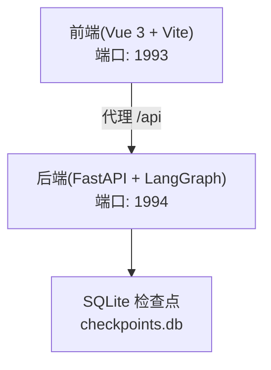
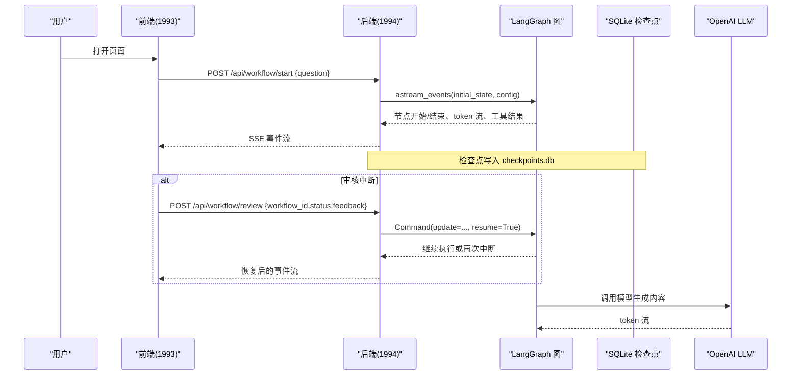
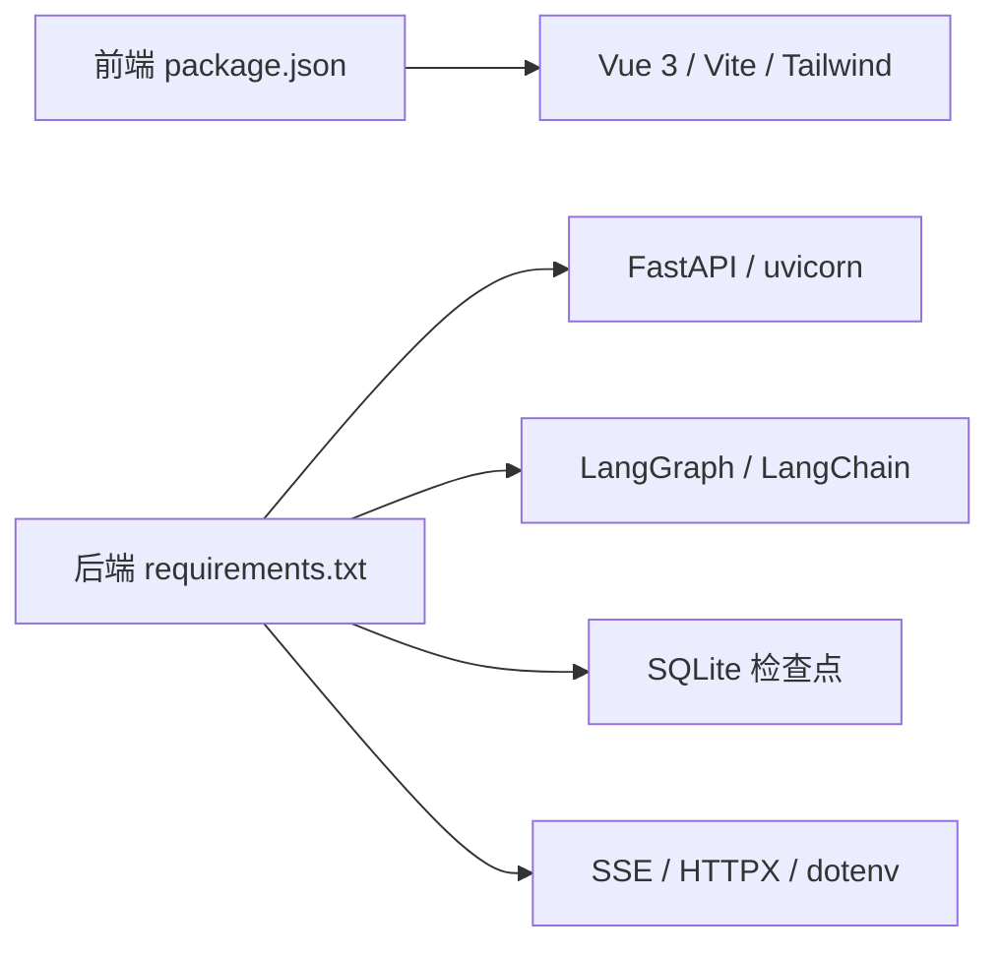

# 开发环境搭建

<cite>
**本文引用的文件**
- [README.md](file://workflow-studio/README.md)
- [requirements.txt](file://workflow-studio/backend/requirements.txt)
- [package.json](file://workflow-studio/frontend/package.json)
- [vite.config.ts](file://workflow-studio/frontend/vite.config.ts)
- [config.py](file://workflow-studio/backend/app/config.py)
- [main.py](file://workflow-studio/backend/app/main.py)
- [schemas.py](file://workflow-studio/backend/app/schemas.py)
- [state.py](file://workflow-studio/backend/app/state.py)
- [graph.py](file://workflow-studio/backend/app/graph.py)
</cite>

## 目录
1. [简介](#简介)
2. [项目结构](#项目结构)
3. [核心组件](#核心组件)
4. [架构总览](#架构总览)
5. [详细组件分析](#详细组件分析)
6. [依赖关系分析](#依赖关系分析)
7. [性能注意事项](#性能注意事项)
8. [故障排查指南](#故障排查指南)
9. [结论](#结论)
10. [附录：完整命令行步骤与环境变量清单](#附录完整命令行步骤与环境变量清单)

## 简介
本指南面向首次参与 Workflow Studio 的开发者，目标是帮助你在本地快速搭建可运行的前后端开发环境。内容涵盖 Python 虚拟环境、Node.js 依赖安装、环境变量配置（OpenAI API 密钥等）、数据库初始化与验证，以及常见问题排查方案。完成后你将能启动后端服务与前端开发服务器，并通过浏览器访问可视化工作流界面。

## 项目结构
Workflow Studio 采用前后端分离架构：
- 后端使用 FastAPI + LangGraph，提供 REST 接口与 SSE 实时事件流，并使用 SQLite 作为检查点持久化存储。
- 前端使用 Vue 3 + Vite，通过代理将 /api 请求转发到后端，端口为 1993；后端默认监听端口 1994。

图表来源
- [vite.config.ts:12-20](file://workflow-studio/frontend/vite.config.ts#L12-L20)
- [main.py:14-21](file://workflow-studio/backend/app/main.py#L14-L21)
- [graph.py:65-77](file://workflow-studio/backend/app/graph.py#L65-L77)

章节来源
- [README.md:23-46](file://workflow-studio/README.md#L23-L46)
- [vite.config.ts:12-20](file://workflow-studio/frontend/vite.config.ts#L12-L20)
- [main.py:14-21](file://workflow-studio/backend/app/main.py#L14-L21)

## 核心组件
- 后端入口与路由：FastAPI 应用定义、CORS 配置、SSE 事件流、工作流控制接口。
- 工作流图：基于 LangGraph 的状态机，包含规划、搜索、分析、写作、审核、修订、输出节点，支持在审核前中断等待人工决策。
- 状态模型：定义研究工作流的状态字段，包括消息历史、迭代计数、报告草稿与最终结果、审核状态等。
- 配置与环境：从环境变量加载 OpenAI 相关设置与模型名称。
- 前端代理：Vite 将 /api 请求代理到后端 1994 端口，便于本地联调。

章节来源
- [main.py:14-21](file://workflow-studio/backend/app/main.py#L14-L21)
- [main.py:34-103](file://workflow-studio/backend/app/main.py#L34-L103)
- [main.py:106-154](file://workflow-studio/backend/app/main.py#L106-L154)
- [main.py:157-173](file://workflow-studio/backend/app/main.py#L157-L173)
- [graph.py:23-77](file://workflow-studio/backend/app/graph.py#L23-L77)
- [state.py:5-30](file://workflow-studio/backend/app/state.py#L5-L30)
- [config.py:1-9](file://workflow-studio/backend/app/config.py#L1-L9)
- [vite.config.ts:12-20](file://workflow-studio/frontend/vite.config.ts#L12-L20)

## 架构总览
下图展示了请求从前端到后端再到 LLM 与 SQLite 的调用链路，以及关键接口职责。

图表来源
- [main.py:34-103](file://workflow-studio/backend/app/main.py#L34-L103)
- [main.py:106-154](file://workflow-studio/backend/app/main.py#L106-L154)
- [graph.py:65-77](file://workflow-studio/backend/app/graph.py#L65-L77)

## 详细组件分析

### 后端服务与接口
- 应用初始化与跨域：启用 CORS，允许前端开发服务器访问。
- 启动工作流接口：接收问题，构建初始状态，返回 SSE 事件流，包含节点开始/结束、token 流、工具结果，并在审核节点前中断。
- 提交审核接口：注入审核结果并恢复执行，继续事件流推送。
- 获取状态接口：用于刷新后恢复工作流状态。
- 图结构接口：返回节点与边信息供前端渲染。

章节来源
- [main.py:14-21](file://workflow-studio/backend/app/main.py#L14-L21)
- [main.py:34-103](file://workflow-studio/backend/app/main.py#L34-L103)
- [main.py:106-154](file://workflow-studio/backend/app/main.py#L106-L154)
- [main.py:157-173](file://workflow-studio/backend/app/main.py#L157-L173)
- [main.py:176-200](file://workflow-studio/backend/app/main.py#L176-L200)

### 工作流图与状态
- 图构建：添加各节点与边，审核节点后根据状态进行条件分支，最多 3 轮修订后强制输出。
- 编译与中断：在审核节点前中断，等待人工输入。
- 状态模型：包含消息历史、当前步骤、迭代次数、研究计划、搜索结果、分析报告、草稿与最终报告、审核状态与反馈、工作流元数据。

章节来源
- [graph.py:23-77](file://workflow-studio/backend/app/graph.py#L23-L77)
- [state.py:5-30](file://workflow-studio/backend/app/state.py#L5-L30)

### 配置与环境变量
- 环境变量加载：使用 python-dotenv 加载 .env 文件。
- 关键变量：
  - OPENAI_API_KEY：OpenAI API 密钥
  - OPENAI_BASE_URL：OpenAI 基础 URL（默认官方地址）
  - LLM_MODEL：使用的模型名称（默认 gpt-4o-mini）

章节来源
- [config.py:1-9](file://workflow-studio/backend/app/config.py#L1-L9)

### 前端代理与端口
- 开发服务器端口：1993
- 代理规则：将 /api 请求转发到 http://localhost:1994
- 这意味着前端无需额外配置后端地址，直接通过相对路径调用接口即可。

章节来源
- [vite.config.ts:12-20](file://workflow-studio/frontend/vite.config.ts#L12-L20)

## 依赖关系分析
- 后端依赖：FastAPI、uvicorn、langgraph、langchain-openai、sqlite 检查点、sse-starlette、httpx、python-dotenv。
- 前端依赖：Vue 3、@vue-flow/*、pinia、tailwindcss、vite、typescript 等。
- 运行时依赖：Node.js（前端构建与运行）、Python 3.x（后端运行）。

图表来源
- [package.json:11-30](file://workflow-studio/frontend/package.json#L11-L30)
- [requirements.txt:1-10](file://workflow-studio/backend/requirements.txt#L1-L10)

章节来源
- [package.json:11-30](file://workflow-studio/frontend/package.json#L11-L30)
- [requirements.txt:1-10](file://workflow-studio/backend/requirements.txt#L1-L10)

## 性能注意事项
- 并发与流式：后端使用异步与 SSE 推送，避免阻塞；确保网络层不缓存事件流（已设置相应响应头）。
- 检查点存储：SQLite 适合开发与测试；生产环境建议迁移至 PostgreSQL 以提升并发与可靠性。
- 模型调用：大模型请求可能耗时较长，前端应做好超时与重试提示；必要时可增加节流与去重逻辑。
- 资源占用：前端开发模式会热更新，注意内存占用；必要时调整 Node 进程参数。

[本节为通用指导，不直接分析具体文件]

## 故障排查指南
- 无法访问前端页面
  - 确认前端 dev 服务器已启动且端口为 1993。
  - 若浏览器控制台报跨域错误，检查后端是否启用了 CORS，并确认允许的源包含前端地址。
  - 章节来源
    - [main.py:14-21](file://workflow-studio/backend/app/main.py#L14-L21)
    - [vite.config.ts:12-20](file://workflow-studio/frontend/vite.config.ts#L12-L20)

- 前端 /api 请求失败
  - 确认后端服务已在 1994 端口运行。
  - 检查 Vite 代理配置是否正确指向后端地址。
  - 章节来源
    - [vite.config.ts:12-20](file://workflow-studio/frontend/vite.config.ts#L12-L20)

- 工作流未启动或报错
  - 检查环境变量是否已正确设置 OPENAI_API_KEY。
  - 检查后端日志中是否有模型调用错误或认证失败。
  - 章节来源
    - [config.py:1-9](file://workflow-studio/backend/app/config.py#L1-L9)

- 审核节点未中断
  - 确认图编译时是否在审核节点前设置了中断。
  - 检查状态中的 review_status 是否符合预期。
  - 章节来源
    - [graph.py:65-77](file://workflow-studio/backend/app/graph.py#L65-L77)
    - [state.py:22-24](file://workflow-studio/backend/app/state.py#L22-L24)

- 刷新后无法恢复状态
  - 确认后端状态查询接口可用，且 workflow_id 有效。
  - 检查 SQLite 检查点文件是否存在并可读。
  - 章节来源
    - [main.py:157-173](file://workflow-studio/backend/app/main.py#L157-L173)
    - [graph.py:65-77](file://workflow-studio/backend/app/graph.py#L65-L77)

- 端口冲突
  - 如果 1993 或 1994 被占用，修改对应服务的端口配置并重启。
  - 章节来源
    - [vite.config.ts:12-20](file://workflow-studio/frontend/vite.config.ts#L12-L20)
    - [README.md:27-35](file://workflow-studio/README.md#L27-L35)

## 结论
按照本指南完成环境搭建后，你将能够：
- 在本地运行后端服务与前端开发服务器
- 通过浏览器访问可视化工作流界面
- 触发研究工作流，观察节点执行与实时输出
- 在审核节点进行人工干预，并恢复执行
- 利用检查点机制在页面刷新后恢复状态

建议在正式使用前先完成环境变量配置与基本连通性测试，再逐步深入功能调试与扩展。

[本节为总结性内容，不直接分析具体文件]

## 附录：完整命令行步骤与环境变量清单

### 前置要求
- 已安装 Python 3.x
- 已安装 Node.js 与 npm
- 具备有效的 OpenAI API 密钥

### 后端环境搭建
- 进入后端目录并创建虚拟环境（如尚未存在）
- 安装依赖
- 准备环境变量文件
- 启动后端服务

参考命令（请根据你的系统替换路径）：
- cd workflow-studio/backend
- python -m venv venv
- source venv/bin/activate  # Windows: venv\Scripts\activate
- pip install -r requirements.txt
- cp .env.example .env  # 若不存在示例文件，可直接创建 .env
- 编辑 .env，填入 OPENAI_API_KEY、可选的 OPENAI_BASE_URL 与 LLM_MODEL
- uvicorn app.main:app --reload --port 1994

章节来源
- [README.md:27-35](file://workflow-studio/README.md#L27-L35)
- [requirements.txt:1-10](file://workflow-studio/backend/requirements.txt#L1-L10)
- [config.py:1-9](file://workflow-studio/backend/app/config.py#L1-L9)

### 前端环境搭建
- 进入前端目录并安装依赖
- 启动开发服务器

参考命令：
- cd workflow-studio/frontend
- npm install
- npm run dev

说明：
- 前端开发服务器默认端口为 1993
- /api 请求将被代理到 http://localhost:1994

章节来源
- [README.md:37-46](file://workflow-studio/README.md#L37-L46)
- [package.json:6-10](file://workflow-studio/frontend/package.json#L6-L10)
- [vite.config.ts:12-20](file://workflow-studio/frontend/vite.config.ts#L12-L20)

### 环境变量清单
- OPENAI_API_KEY：必填，OpenAI API 密钥
- OPENAI_BASE_URL：可选，OpenAI 基础 URL（默认 https://api.openai.com/v1）
- LLM_MODEL：可选，使用的模型名称（默认 gpt-4o-mini）

章节来源
- [config.py:1-9](file://workflow-studio/backend/app/config.py#L1-L9)

### 数据库初始化
- 首次启动后端时会自动创建 SQLite 检查点文件 checkpoints.db
- 该文件位于后端工作目录下，用于保存工作流状态与进度
- 如需重置，可删除 checkpoints.db 后重启后端

章节来源
- [graph.py:65-77](file://workflow-studio/backend/app/graph.py#L65-L77)

### 验证步骤
- 启动后端后访问 http://localhost:1994/docs 查看 API 文档
- 启动前端后访问 http://localhost:1993 打开界面
- 在前端输入研究问题，观察后端事件流与节点执行情况
- 在审核节点进行“通过”或“不通过”操作，验证流程分支

章节来源
- [README.md:27-46](file://workflow-studio/README.md#L27-L46)
- [main.py:176-200](file://workflow-studio/backend/app/main.py#L176-L200)