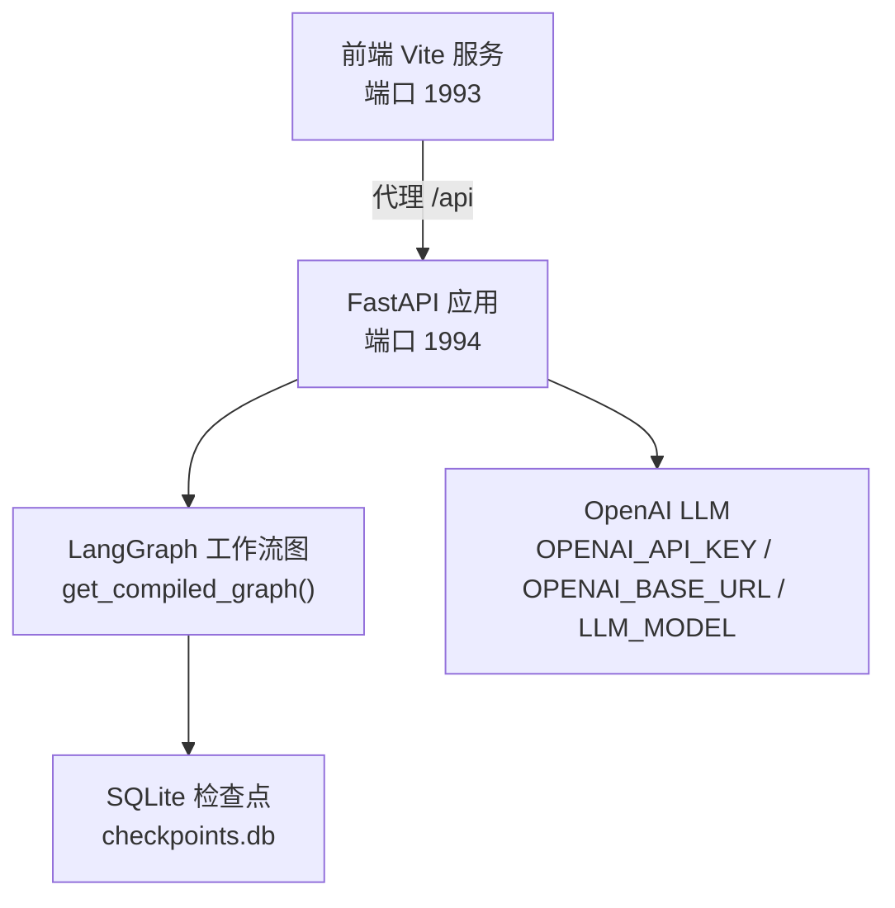
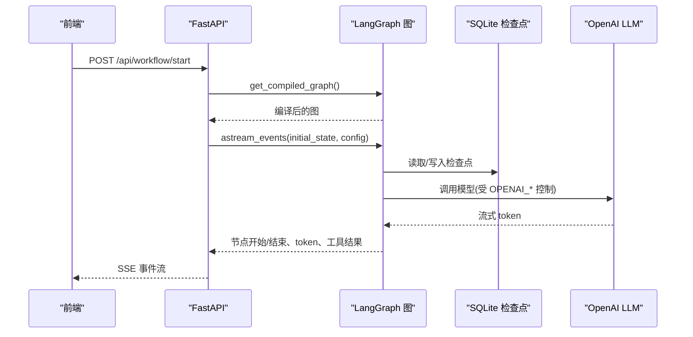

# 环境变量配置

<cite>
**本文引用的文件**
- [config.py](file://workflow-studio/backend/app/config.py)
- [main.py](file://workflow-studio/backend/app/main.py)
- [graph.py](file://workflow-studio/backend/app/graph.py)
- [requirements.txt](file://workflow-studio/backend/requirements.txt)
- [README.md](file://workflow-studio/README.md)
- [vite.config.ts](file://workflow-studio/frontend/vite.config.ts)
</cite>

## 目录
1. [简介](#简介)
2. [项目结构](#项目结构)
3. [核心组件](#核心组件)
4. [架构总览](#架构总览)
5. [详细组件分析](#详细组件分析)
6. [依赖关系分析](#依赖关系分析)
7. [性能与调优建议](#性能与调优建议)
8. [故障排查指南](#故障排查指南)
9. [结论](#结论)
10. [附录：环境模板与最佳实践](#附录环境模板与最佳实践)

## 简介
本文件为 Workflow Studio 的环境变量配置文档，覆盖后端运行所需的全部环境变量、默认值、验证策略、以及在不同环境（开发、测试、生产）下的配置建议。当前代码库已实现基础的环境变量加载与使用，并包含工作流图编译、SSE 事件流、SQLite 检查点持久化等关键能力。本文基于仓库实际代码进行说明，确保所有信息可追溯至具体源码位置。

## 项目结构
- 后端采用 FastAPI + LangGraph，通过 python-dotenv 加载 .env 环境变量，集中管理 OpenAI 相关配置；工作流图在启动时编译并附带 SQLite 检查点以支持中断恢复。
- 前端使用 Vite 开发服务器，提供本地代理转发到后端端口。

图表来源
- [main.py:14-21](file://workflow-studio/backend/app/main.py#L14-L21)
- [graph.py:65-77](file://workflow-studio/backend/app/graph.py#L65-L77)
- [config.py:1-8](file://workflow-studio/backend/app/config.py#L1-L8)
- [vite.config.ts:12-20](file://workflow-studio/frontend/vite.config.ts#L12-L20)

章节来源
- [README.md:23-45](file://workflow-studio/README.md#L23-L45)
- [vite.config.ts:12-20](file://workflow-studio/frontend/vite.config.ts#L12-L20)

## 核心组件
- 环境变量加载与暴露：通过 python-dotenv 在项目启动时加载 .env，并在配置模块中暴露 OpenAI 相关常量。
- 工作流图编译与持久化：在首次访问时编译 LangGraph 图，并使用 AsyncSqliteSaver 作为检查点存储，支持中断恢复。
- API 与服务：FastAPI 提供 SSE 接口用于实时推送执行状态与 LLM 输出。

章节来源
- [config.py:1-8](file://workflow-studio/backend/app/config.py#L1-L8)
- [graph.py:65-77](file://workflow-studio/backend/app/graph.py#L65-L77)
- [main.py:14-21](file://workflow-studio/backend/app/main.py#L14-L21)

## 架构总览
下图展示了从前端请求到后端工作流执行的完整流程，包括环境变量如何影响 LLM 调用与工作流行为。

图表来源
- [main.py:34-103](file://workflow-studio/backend/app/main.py#L34-L103)
- [graph.py:65-77](file://workflow-studio/backend/app/graph.py#L65-L77)
- [config.py:6-8](file://workflow-studio/backend/app/config.py#L6-L8)

## 详细组件分析

### 环境变量加载与配置
- 加载机制：使用 python-dotenv 在项目启动时自动加载 .env 文件。
- 已实现的环境变量：
  - OPENAI_API_KEY：OpenAI API 密钥（必填）。默认值为空字符串。
  - OPENAI_BASE_URL：OpenAI 兼容的 Base URL（可选）。默认值为 https://api.openai.com/v1。
  - LLM_MODEL：使用的 LLM 模型名称（可选）。默认值为 gpt-4o-mini。
- 注意：当前配置模块仅暴露上述三个变量，未在其他模块中直接引用这些变量。若后续需要在工作流或工具中使用，应在相应模块中导入并使用。

章节来源
- [config.py:1-8](file://workflow-studio/backend/app/config.py#L1-L8)
- [requirements.txt:9](file://workflow-studio/backend/requirements.txt#L9)

### 工作流图与检查点
- 图编译：首次访问时编译 LangGraph 图，并在其中断前设置“审核”节点暂停，以便人工介入。
- 检查点存储：默认使用 SQLite 文件 checkpoints.db 作为检查点持久化介质，便于页面刷新后恢复进度。
- 扩展性：注释提示生产环境可使用 PostgreSQL 替代 SQLite，可通过修改连接字符串切换。

章节来源
- [graph.py:65-77](file://workflow-studio/backend/app/graph.py#L65-L77)

### API 与 SSE 事件流
- 启动工作流：POST /api/workflow/start，返回 SSE 流，推送节点开始/结束、token、工具结果等事件。
- 人工审核：POST /api/workflow/review，提交审核结果并恢复工作流。
- 状态查询：GET /api/workflow/state/{workflow_id}，获取当前状态与是否被中断。
- CORS：允许本地开发的前端地址访问。

章节来源
- [main.py:34-103](file://workflow-studio/backend/app/main.py#L34-L103)
- [main.py:106-154](file://workflow-studio/backend/app/main.py#L106-L154)
- [main.py:157-173](file://workflow-studio/backend/app/main.py#L157-L173)
- [main.py:16-21](file://workflow-studio/backend/app/main.py#L16-L21)

### 前端代理与端口
- 前端开发服务器默认端口 1993，并通过 Vite 代理将 /api 请求转发到后端 1994。
- 该配置影响本地开发与调试时的网络路径与跨域处理。

章节来源
- [vite.config.ts:12-20](file://workflow-studio/frontend/vite.config.ts#L12-L20)

## 依赖关系分析
- 运行时依赖：
  - langgraph、langchain-core、langchain-openai：构建与运行多 Agent 工作流及 LLM 调用。
  - langgraph-checkpoint-sqlite：SQLite 检查点持久化。
  - fastapi、uvicorn[standard]：Web 框架与 ASGI 服务器。
  - sse-starlette：SSE 支持。
  - httpx：HTTP 客户端（可用于未来工具扩展）。
  - python-dotenv：环境变量加载。
- 这些依赖决定了环境变量与外部服务的集成方式，尤其是 OpenAI 与 SQLite 检查点。

章节来源
- [requirements.txt:1-9](file://workflow-studio/backend/requirements.txt#L1-L9)

## 性能与调优建议
- 检查点存储：
  - 开发/测试：使用 SQLite 即可满足需求，文件位于 ./checkpoints.db。
  - 生产：建议替换为 PostgreSQL 或其他高可用数据库，以提升并发与可靠性。
- 并发与资源：
  - 使用 uvicorn 的生产模式（workers、threads）可根据 CPU 核数与 I/O 负载调整。
  - 合理设置 LLM 模型的并发与超时，避免阻塞工作流。
- 日志级别：
  - 当前代码未显式配置日志级别，建议在启动脚本或中间件中根据环境设置不同日志级别（开发更详细，生产精简）。
- 缓存与重试：
  - 对搜索工具或外部 API 调用增加缓存与重试策略，降低失败率与延迟。
- 前端代理：
  - 生产部署时建议通过反向代理（如 Nginx）统一入口，关闭开发代理配置。

[本节为通用指导，不直接分析具体文件]

## 故障排查指南
- 无法启动工作流：
  - 检查 OPENAI_API_KEY 是否正确设置。
  - 确认 OPENAI_BASE_URL 指向可用的服务地址。
  - 查看 LLM_MODEL 是否为有效模型名。
- 检查点恢复失败：
  - 确认 checkpoints.db 文件存在且可读写。
  - 生产环境迁移到 PostgreSQL 时，确保连接字符串正确。
- 前端无法连接后端：
  - 确认 Vite 代理目标地址与后端端口一致。
  - 检查 CORS 配置是否允许前端域名。
- 事件流异常：
  - 检查 SSE 响应头与媒体类型是否正确。
  - 捕获并记录异常事件消息，便于定位问题。

章节来源
- [main.py:34-103](file://workflow-studio/backend/app/main.py#L34-L103)
- [graph.py:65-77](file://workflow-studio/backend/app/graph.py#L65-L77)
- [vite.config.ts:12-20](file://workflow-studio/frontend/vite.config.ts#L12-L20)

## 结论
Workflow Studio 当前实现了基础的环境变量加载与 OpenAI 配置，工作流图编译与 SQLite 检查点持久化已就绪。为满足生产环境的稳定性与可维护性，建议完善配置验证、日志级别与环境差异化配置，并根据负载选择合适的检查点存储与服务器参数。

[本节为总结，不直接分析具体文件]

## 附录：环境模板与最佳实践

### 环境变量清单与说明
- OPENAI_API_KEY（必需）
  - 用途：OpenAI API 认证密钥。
  - 默认值：空字符串。
  - 建议：严格保密，使用密钥管理服务注入。
- OPENAI_BASE_URL（可选）
  - 用途：OpenAI 兼容的 Base URL，便于切换提供商或代理。
  - 默认值：https://api.openai.com/v1。
  - 建议：生产环境使用内部网关或代理以提高安全性与稳定性。
- LLM_MODEL（可选）
  - 用途：指定使用的 LLM 模型。
  - 默认值：gpt-4o-mini。
  - 建议：根据任务复杂度与成本选择合适模型。

章节来源
- [config.py:6-8](file://workflow-studio/backend/app/config.py#L6-L8)

### 配置验证与默认值处理
- 当前实现：
  - 使用 os.getenv 读取环境变量并提供默认值。
  - 未实现显式的配置校验逻辑。
- 建议增强：
  - 启动时校验 OPENAI_API_KEY 非空，否则抛出明确错误。
  - 对 OPENAI_BASE_URL 进行格式校验。
  - 对 LLM_MODEL 进行白名单校验（可选）。
  - 将校验结果写入日志，便于快速定位问题。

章节来源
- [config.py:1-8](file://workflow-studio/backend/app/config.py#L1-L8)

### 配置热重载机制
- 当前实现：
  - 使用 python-dotenv 在模块加载时读取 .env。
  - 未实现运行时热重载。
- 建议方案：
  - 开发环境：使用 uvicorn --reload 配合热重载，但需注意环境变量变更需重启进程。
  - 生产环境：通过配置中心或环境变量注入平台（如 Kubernetes ConfigMap/Secret）更新配置并优雅重启。
  - 如需运行时热重载，可在配置模块中引入监听机制，在检测到 .env 变更后重新加载配置并通知相关组件。

章节来源
- [requirements.txt:9](file://workflow-studio/backend/requirements.txt#L9)
- [README.md:27-33](file://workflow-studio/README.md#L27-L33)

### 不同环境配置模板与最佳实践
- 开发环境
  - OPENAI_API_KEY：填入个人开发密钥。
  - OPENAI_BASE_URL：默认或内部代理。
  - LLM_MODEL：轻量模型（如 gpt-4o-mini）以降低费用。
  - 检查点：SQLite 文件即可。
  - 日志：详细日志便于调试。
- 测试环境
  - OPENAI_API_KEY：使用测试专用密钥。
  - OPENAI_BASE_URL：指向测试网关或沙箱。
  - LLM_MODEL：与开发一致或略强模型。
  - 检查点：SQLite 或临时数据库。
  - 日志：中等详细度，聚焦关键路径。
- 生产环境
  - OPENAI_API_KEY：通过密钥管理服务注入，禁止明文。
  - OPENAI_BASE_URL：生产网关或代理，启用限流与审计。
  - LLM_MODEL：根据 SLA 与成本选择合适模型。
  - 检查点：PostgreSQL 等高可用数据库。
  - 日志：精简日志，集中收集与分析。

[本节为通用指导，不直接分析具体文件]