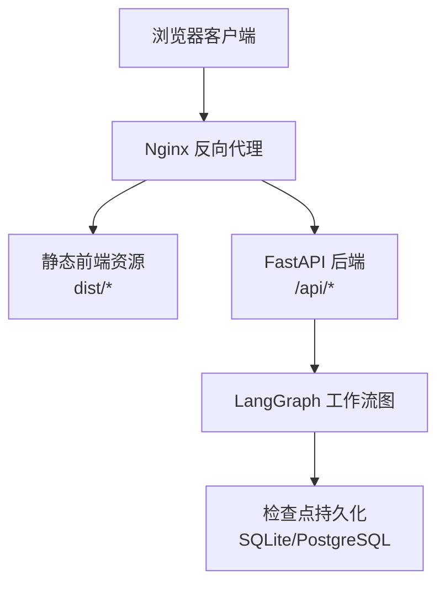
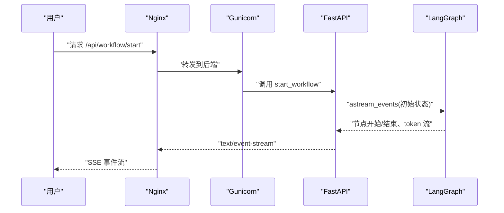
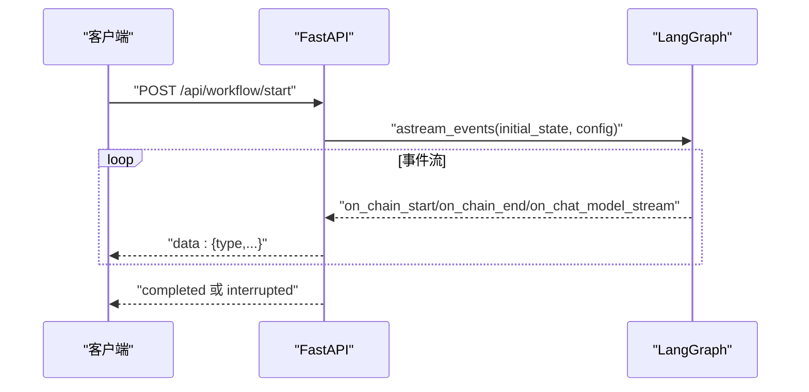
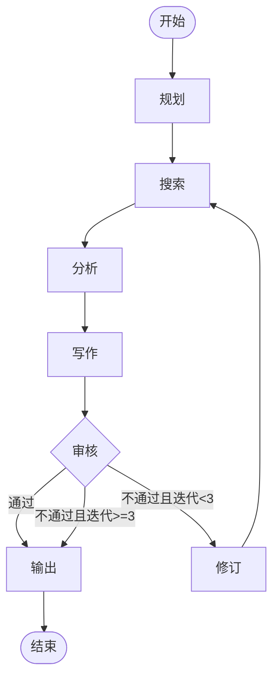
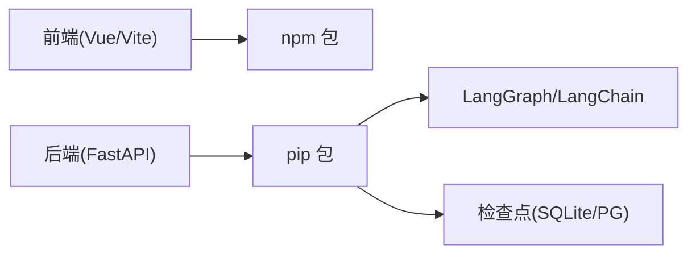

# 生产环境部署

<cite>
**本文引用的文件**
- [backend/app/main.py](file://workflow-studio/backend/app/main.py)
- [backend/app/config.py](file://workflow-studio/backend/app/config.py)
- [backend/app/graph.py](file://workflow-studio/backend/app/graph.py)
- [backend/requirements.txt](file://workflow-studio/backend/requirements.txt)
- [frontend/package.json](file://workflow-studio/frontend/package.json)
- [frontend/vite.config.ts](file://workflow-studio/frontend/vite.config.ts)
- [README.md](file://workflow-studio/README.md)
</cite>

## 目录
1. [简介](#简介)
2. [项目结构](#项目结构)
3. [核心组件](#核心组件)
4. [架构总览](#架构总览)
5. [详细组件分析](#详细组件分析)
6. [依赖分析](#依赖分析)
7. [性能考虑](#性能考虑)
8. [故障排查指南](#故障排查指南)
9. [结论](#结论)
10. [附录](#附录)

## 简介
本指南面向在生产环境中部署 Workflow Studio，覆盖服务器与系统要求、Python/Node.js 版本管理、Nginx 反向代理、Gunicorn 进程管理、systemd 服务配置与开机自启、日志轮转、安全加固、监控告警与性能优化等。文档基于仓库中的后端 FastAPI 应用、LangGraph 工作流图、前端 Vite/Vue 构建产物进行设计，确保可直接落地实施。

## 项目结构
Workflow Studio 由前后端两部分组成：
- 后端：FastAPI + LangGraph，提供 REST API 与 SSE（Server-Sent Events）事件流，使用 SQLite 作为检查点存储（生产建议迁移至 PostgreSQL）。
- 前端：Vue 3 + Vite，构建为静态资源，由 Nginx 直接托管。

图表来源
- [backend/app/main.py:14-21](file://workflow-studio/backend/app/main.py#L14-L21)
- [backend/app/graph.py:65-77](file://workflow-studio/backend/app/graph.py#L65-L77)
- [frontend/vite.config.ts:12-20](file://workflow-studio/frontend/vite.config.ts#L12-L20)

章节来源
- [README.md:15-90](file://workflow-studio/README.md#L15-L90)
- [backend/app/main.py:14-21](file://workflow-studio/backend/app/main.py#L14-L21)
- [backend/app/graph.py:65-77](file://workflow-studio/backend/app/graph.py#L65-L77)
- [frontend/vite.config.ts:12-20](file://workflow-studio/frontend/vite.config.ts#L12-L20)

## 核心组件
- 后端入口与路由：FastAPI 应用定义、CORS 设置、SSE 事件流、工作流启动与恢复、状态查询、图结构返回。
- 工作流图：LangGraph 状态图，节点包括规划、搜索、分析、写作、审核、修订、输出；在审核前中断，支持人工介入。
- 配置：从环境变量加载 LLM 相关参数。
- 前端：Vite 开发/构建脚本，生产构建后由 Nginx 托管。

章节来源
- [backend/app/main.py:34-103](file://workflow-studio/backend/app/main.py#L34-L103)
- [backend/app/main.py:106-154](file://workflow-studio/backend/app/main.py#L106-L154)
- [backend/app/main.py:157-200](file://workflow-studio/backend/app/main.py#L157-L200)
- [backend/app/graph.py:11-77](file://workflow-studio/backend/app/graph.py#L11-L77)
- [backend/app/config.py:1-9](file://workflow-studio/backend/app/config.py#L1-L9)
- [frontend/package.json:6-10](file://workflow-studio/frontend/package.json#L6-L10)

## 架构总览
生产环境推荐拓扑：
- Nginx 作为对外入口，负责静态资源与反向代理到后端。
- Gunicorn 作为 WSGI 进程管理器运行 FastAPI 应用。
- systemd 管理服务生命周期与开机自启。
- 日志通过 journald 或 logrotate 轮转。
- 监控通过 Prometheus/Grafana 或云厂商监控接入。

图表来源
- [backend/app/main.py:34-103](file://workflow-studio/backend/app/main.py#L34-L103)

章节来源
- [backend/app/main.py:34-103](file://workflow-studio/backend/app/main.py#L34-L103)

## 详细组件分析

### 后端服务（FastAPI + Gunicorn + systemd）
- 应用入口：FastAPI 实例、CORS 中间件、全局图实例懒加载。
- 关键接口：
  - POST /api/workflow/start：启动工作流并返回 SSE 事件流。
  - POST /api/workflow/review：提交审核结果，恢复工作流。
  - GET /api/workflow/state/{workflow_id}：获取当前状态用于页面刷新恢复。
  - GET /api/workflow/graph-structure：返回图结构供前端渲染。
- 事件流：SSE 类型包括 node_start、node_end、token、tool_result、interrupted、completed、error。
- 检查点：默认 SQLite，生产建议切换为 PostgreSQL 以支持高并发与持久性。

图表来源
- [backend/app/main.py:34-103](file://workflow-studio/backend/app/main.py#L34-L103)

章节来源
- [backend/app/main.py:34-103](file://workflow-studio/backend/app/main.py#L34-L103)
- [backend/app/main.py:106-154](file://workflow-studio/backend/app/main.py#L106-L154)
- [backend/app/main.py:157-200](file://workflow-studio/backend/app/main.py#L157-L200)
- [backend/app/graph.py:65-77](file://workflow-studio/backend/app/graph.py#L65-L77)

### 工作流图（LangGraph）
- 节点：plan → search → analyze → write → review → (output | revision → search)。
- 条件路由：review 后根据审核状态决定输出或修订；修订最多 3 轮后强制输出。
- 中断：在 review 前中断，等待人工审核。
- 检查点：编译时绑定 checkpointer，支持状态持久化与恢复。

图表来源
- [backend/app/graph.py:11-77](file://workflow-studio/backend/app/graph.py#L11-L77)

章节来源
- [backend/app/graph.py:11-77](file://workflow-studio/backend/app/graph.py#L11-L77)

### 前端构建与静态资源
- 构建命令：npm run build，生成 dist 目录静态资源。
- 开发模式：vite dev 监听 1993 端口，并通过 proxy 将 /api 转发到后端 1994。
- 生产部署：由 Nginx 直接提供 dist 内容，不再需要 Vite 开发服务器。

章节来源
- [frontend/package.json:6-10](file://workflow-studio/frontend/package.json#L6-L10)
- [frontend/vite.config.ts:12-20](file://workflow-studio/frontend/vite.config.ts#L12-L20)

## 依赖分析
- Python 依赖：langgraph、langchain-core、langchain-openai、fastapi、uvicorn[standard]、sse-starlette、httpx、python-dotenv、langgraph-checkpoint-sqlite。
- Node.js 依赖：vue、@vue-flow/*、pinia、tailwindcss、vite、typescript 等。

图表来源
- [backend/requirements.txt:1-10](file://workflow-studio/backend/requirements.txt#L1-L10)
- [frontend/package.json:11-30](file://workflow-studio/frontend/package.json#L11-L30)

章节来源
- [backend/requirements.txt:1-10](file://workflow-studio/backend/requirements.txt#L1-L10)
- [frontend/package.json:11-30](file://workflow-studio/frontend/package.json#L11-L30)

## 性能考虑
- 进程与线程：
  - Gunicorn workers 数量建议为 CPU 核数×2+1；每个 worker 内协程并发由 FastAPI/uvicorn 处理。
  - 若启用多进程，注意共享内存与全局图实例的初始化策略（当前代码使用模块级懒加载，适合单进程或多进程各自独立实例）。
- 连接与超时：
  - Nginx 对 SSE 的缓冲与超时需关闭缓冲并设置合理超时，避免长连接被中断。
  - Gunicorn 的 keepalive、timeout 与 worker 回收策略需按负载调优。
- 数据库：
  - 生产环境建议将检查点从 SQLite 迁移至 PostgreSQL，提升并发与可靠性。
- 缓存与限流：
  - 可在 Nginx 层对重复请求做缓存；对 /api 路径增加速率限制防止滥用。
- 资源隔离：
  - 使用 systemd 限制 CPU/内存；容器化部署可结合 cgroups。

[本节为通用性能指导，无需特定文件引用]

## 故障排查指南
- 常见问题定位：
  - SSE 中断：检查 Nginx 是否设置了缓冲或超时；确认后端返回 text/event-stream 且未提前关闭。
  - 工作流状态丢失：确认检查点存储可用；如使用 SQLite，确保文件权限与磁盘空间充足。
  - CORS 错误：核对前端域名与后端允许的 origin 列表。
  - 审核流程卡住：确认 review 节点中断逻辑与恢复接口调用是否正确。
- 日志与监控：
  - 后端日志：通过 systemd journald 收集；可按级别过滤。
  - 指标采集：暴露 Prometheus 指标或使用云监控；记录请求耗时、错误率、SSE 连接数。
  - 告警规则：针对错误率、响应时间、工作流中断率设置阈值告警。

章节来源
- [backend/app/main.py:16-21](file://workflow-studio/backend/app/main.py#L16-L21)
- [backend/app/main.py:34-103](file://workflow-studio/backend/app/main.py#L34-L103)
- [backend/app/graph.py:65-77](file://workflow-studio/backend/app/graph.py#L65-L77)

## 结论
本指南提供了 Workflow Studio 在生产环境的完整部署方案，涵盖系统要求、依赖安装、Nginx 反向代理、Gunicorn 进程管理、systemd 服务与开机自启、日志轮转、安全加固、监控告警与性能优化。按照本文步骤实施，可获得稳定、可扩展且易于维护的生产部署。

[本节为总结性内容，无需特定文件引用]

## 附录

### 服务器与系统要求
- 操作系统：Linux（推荐 Ubuntu 22.04/Debian 12/CentOS Stream 9）
- CPU/内存：至少 2 核/4GB；LLM 调用密集场景建议更高
- 磁盘：SSD，预留日志与检查点空间
- 网络：开放 80/443（Nginx），后端仅对内网访问

[本节为通用要求，无需特定文件引用]

### Python 与 Node.js 版本管理
- Python：建议使用 3.10+；通过 pyenv 或系统包管理器安装；使用 venv 创建虚拟环境。
- Node.js：建议使用 LTS 版本（如 20.x）；通过 nvm 管理多版本。
- 依赖安装：
  - 后端：pip install -r requirements.txt
  - 前端：npm ci 或 npm install

章节来源
- [backend/requirements.txt:1-10](file://workflow-studio/backend/requirements.txt#L1-L10)
- [frontend/package.json:6-10](file://workflow-studio/frontend/package.json#L6-L10)

### Nginx 反向代理配置要点
- 静态资源：将 frontend/dist 目录映射到根路径或子路径。
- 反向代理：将 /api 请求转发到后端 Gunicorn 监听地址。
- SSE 支持：关闭缓冲、设置合适的超时与缓存控制头。
- 安全：启用 HTTPS、HTTP/2、HSTS、隐藏版本号、限制请求体大小。

[本节为通用配置指导，无需特定文件引用]

### Gunicorn 进程管理
- 启动方式：gunicorn app.main:app -w <workers> -k uvicorn.workers.UvicornWorker --bind 127.0.0.1:8000
- 进程模型：workers 数量按 CPU 核数×2+1 调整；worker_class 使用 uvicorn 以支持异步。
- 健康检查：配合 systemd 的 ExecStartPre 与健康探针。

[本节为通用进程管理指导，无需特定文件引用]

### systemd 服务配置示例与开机自启
- 服务单元：定义 Type=simple，指定 WorkingDirectory、ExecStart、User/Group、Restart=always。
- 环境变量：通过 EnvironmentFile 加载 .env，包含 OPENAI_API_KEY、OPENAI_BASE_URL、LLM_MODEL。
- 开机自启：systemctl enable workflow-studio-backend.service。
- 日志：默认输出到 journald；可通过 journalctl 查看。

章节来源
- [backend/app/config.py:1-9](file://workflow-studio/backend/app/config.py#L1-L9)

### 日志轮转
- 应用日志：统一输出到 stdout/stderr，由 systemd journald 管理。
- 外部日志：如需落盘，可使用 rsyslog 或 logrotate 对 Nginx 与应用日志进行轮转。
- 保留策略：按天/周轮转，保留 30-90 天，压缩归档。

[本节为通用日志管理指导，无需特定文件引用]

### 监控与告警
- 指标：请求量、错误率、P95/P99 延迟、SSE 连接数、工作流中断次数。
- 采集：Prometheus + Grafana 或云监控平台。
- 告警：基于阈值与趋势设置邮件/短信/IM 通知。

[本节为通用监控指导，无需特定文件引用]

### 安全设置
- 最小权限：以非 root 用户运行服务；限制文件系统访问。
- 网络安全：仅开放必要端口；使用防火墙与白名单。
- 认证鉴权：在 Nginx/FastAPI 层增加 JWT/OAuth2；对敏感接口加签名校验。
- 输入校验：严格校验请求参数，防止注入与越权。
- 依赖更新：定期升级 Python/Node 依赖，修复安全漏洞。

[本节为通用安全指导，无需特定文件引用]

### 数据持久化与迁移
- 检查点：当前使用 SQLite，生产建议迁移至 PostgreSQL 以提升并发与可靠性。
- 备份：定期备份检查点数据库与配置文件。
- 迁移：制定回滚计划与数据一致性校验。

章节来源
- [backend/app/graph.py:65-77](file://workflow-studio/backend/app/graph.py#L65-L77)